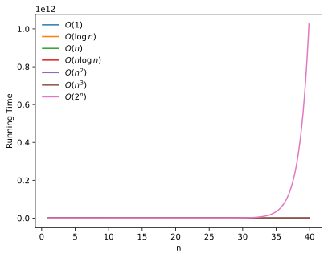
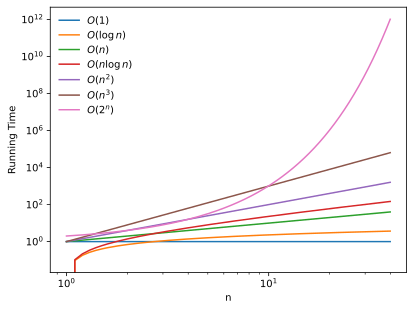
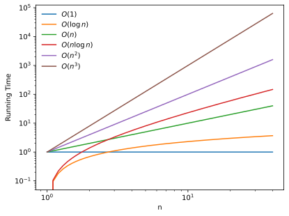
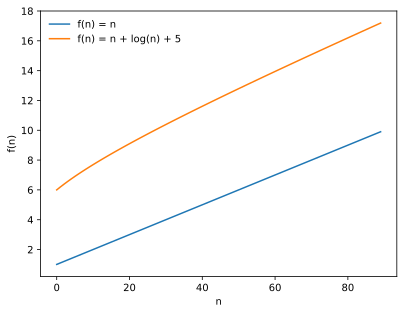
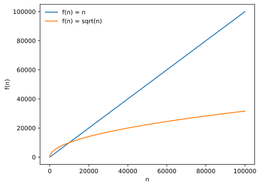
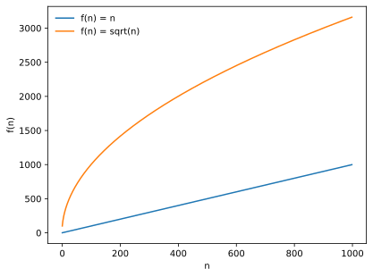

# Lecture 1: Introduction, Time Complexity, and big O Notation

<br>

## Pre-Reading
- [Profiling and Timing Code](https://jakevdp.github.io/PythonDataScienceHandbook/01.07-timing-and-profiling.html)
- Introduction to Big-O Notation: [short video ~30 mins](https://www.youtube.com/watch?v=D6xkbGLQesk)

## Outline

- Course overview (10 mins)
- Code Profiling (10 mins)
- Time Complexity and Big O Notation (35 mins)
- Linear Search Example (20 mins)

## Learning objectives

By the end of this lecture, students will be able to:
- Explain what this course is and what it is not about.
- Maintain an awareness that choosing a good algorithm matters, sometimes _a lot_!
- Measure the amount of time code in Python takes using `timeit`, `prun`, `line_profiler`.
- Given simple code, determine the time complexity using Big-O notation.
- Explain the difference between the common complexity classes (e.g. constant, logarithmic, linear, quadratic, etc.).
- Describe the linear and binary search algorithm.


```python
# import packages needed in this lecture
import numpy as np
import pandas as pd
import time
import altair as alt
from collections import defaultdict

import matplotlib.pyplot as plt
%config InlineBackend.figure_formats = ['svg']
%load_ext line_profiler

```

**Note:** this lecture is meant to be run in a Jupyter notebook. Part of the experience is that some cells take longer to run than others. Simply reading the notebook will not make sense.

## 1. High-level course introduction (10mins)

Welcome to the algorithms and data structures course! This focuses on fundamental data structures and algorithms, complexity analysis, and techniques for improving Python code performance, with a focus on solving data science problems.


```{admonition} What this course is not about!
:class: attention
This course is highly compressed. While it touches on many of the fundamental topics found in traditional undergraduate algorithms and data structures courses, we won’t have time to delve deeply into every subject. Instead, we’ll focus on key ideas that will equip you with the essentials for algorithmic problem-solving.
```

### 1.1 What is an algorithm?
An algorithm is a well-defined computational procedure designed to solve a problem. It consists of a sequence of precise steps that take some inputs, process them systematically, and produce corresponding outputs. In essence, an algorithm provides a clear method for transforming input into output in order to arrive at a solution.

#### Example: linear search vs binary search (in-class activity)

- Common problem: is a certain value present in a collection of items?

### 1.2 What is a data structure?

A data structure is a way to organize and manage data, allowing us to write more efficient code in terms of both time and space. We will discuss data structures in more detail in Lecture 2. 

#### Example: Python lists, sets, etc.

### 1.3 Why do we need to study algorithms and data structures?

- Studying algorithms trains you to think systematically and develop algorithmic thinking abilities. We will learning how to approach problems in a structured way, break them down into smaller steps, and implement solutions effectively.

- Understanding how algorithms and data structures work gives you practical insights into handling slow code. It enables you to identify inefficiencies, reason about computational performance, and select efficient methods for processing and storing data. This foundation is crucial for optimizing code and ensuring analyses scale effectively to large datasets.

- As a future data scientist, you will not only write a significant amount of code but also collaborate with others who do the same. Therefore, it is essential to understand and use this technical language effectively.

- Finally, algorithmic problem-solving is often tested directly in interviews for data science or MLOps roles.


For the remainder of this lecture, 
- we will first discuss code profiling, a practical way to investigate code efficiency. 
- Then, we will talk about time complexity more formally, introduce its notation,
- explore some heuristics for determining the time complexity of a given piece of code, and 
- gain deeper insight into common complexity classes.

## 2. Code Profiling (10 mins)

To determine whether a piece of code has been written efficiently and how it can be improved, we first need to identify the sources of inefficiency. Code profiling allows us to do this. Some of the tools we can use include:

 - `timeit`: A simple yet effective tool for measuring the execution time of small pieces of code. It is useful for quickly comparing the performance of different implementations of the same logic.
 - `prun`: A function-level profiler that provides detailed information about how much time is spent in each function, making it easier to identify performance bottlenecks across different parts of a program.
 - `lprun`: A tool that profiles code line by line, showing how much time is spent on each individual line. This is particularly helpful for pinpointing which specific operations within a function are consuming the most time.

```{note}
Code profiling applies to memory usage as well. We will talk about memory profiling in the next lecture. 
```

#### Example: searching (list vs. set)


```python
n = 10_000_000 # setting n to an arbitrary large number.
```


```python
%timeit (list(range(n))) # measuring how long it takes to create a list.
```

    197 ms ± 1.16 ms per loop (mean ± std. dev. of 7 runs, 1 loop each)


```python
%timeit (set(range(n))) # measuring how long it takes to create a set.
```

    303 ms ± 4.72 ms per loop (mean ± std. dev. of 7 runs, 1 loop each)


```{note}
- We use the `%timeit` function to measure the runtime of a single statement. 
- `%timeit` is a magic command in Jupyter notebooks that allows you to time small bits of Python code. It runs the code multiple times to get a more accurate measurement of its execution time.
- Outside of Jupyter/IPython environment, you can use the [`timeit`](https://docs.python.org/3/library/timeit.html) module in Python's standard library to achieve similar functionality.
For more details, please refer to this [note](https://jakevdp.github.io/PythonDataScienceHandbook/01.07-timing-and-profiling.html).
```


```python
x = list(range(n))
x[:20]  # first 20 items
```


    [0, 1, 2, 3, 4, 5, 6, 7, 8, 9, 10, 11, 12, 13, 14, 15, 16, 17, 18, 19]


```python
%timeit (-1 in x)
```

    104 ms ± 6.41 ms per loop (mean ± std. dev. of 7 runs, 10 loops each)


```python
x = set(range(n))
```


```python
%timeit (-1 in x)
```

    9.38 ns ± 0.111 ns per loop (mean ± std. dev. of 7 runs, 100,000,000 loops each)


### Profiling functions

Now let's get a bit more fancy: we can use `%prun` on a function to tell how much time was spend in each part.

```{note}
Where `%timeit` measures how long a code snippet takes to run, `%prun` tells you where that time is being spent inside your code.
```


#### Example:


```python
def g(n):
    for i in range(n):
        time.sleep(0.1) # wait for 0.1 seconds
```


```python
%prun g(5)
```

As expected, because of the for loop, there are 5 function calls to `time.sleep` and 1 call to `g(n)`. (For now, you can ignore the rest of the information in the table above.)

### `line_profiler`

To gain more insight into what is happening in our code, we can use `%lprun` from the `line_profiler` library on a function. It shows us how much time is spent on each line of the code. 

```{note}
Before using `line_profiler`, we need to make sure that `line_profiler` is loaded in the notebook. We made sure of that in the beginning by adding `%load_ext line_profiler`.
```

#### Example:


```python
%lprun -f g g(5)
```

    Timer unit: 1e-09 s
    
    Total time: 0.523234 s
    File: /var/folders/pn/t6vkyjw123z76md2nlttr3nr0000gn/T/ipykernel_49644/165093275.py
    Function: g at line 1
    
    Line #      Hits         Time  Per Hit   % Time  Line Contents
    ==============================================================
         1                                           def g(n):
         2         6      27000.0   4500.0      0.0      for i in range(n):
         3         5  523207000.0 1.05e+08    100.0          time.sleep(0.1) # wait for 0.1 seconds

```{admonition} **Question**
why is line 2 hit 6 times instead of 5?
```

Now, let's see what happens if n is doubled, i.e., n = 10?


```python
%lprun -f g g(10)
```


    Timer unit: 1e-09 s
    
    Total time: 1.0385 s
    File: /var/folders/mp/13tr36k17_n99rc7qsh4dgxc0000gp/T/ipykernel_62042/165093275.py
    Function: g at line 1
    
    Line #      Hits         Time  Per Hit   % Time  Line Contents
    ==============================================================
         1                                           def g(n):
         2        11      58000.0   5272.7      0.0      for i in range(n):
         3        10 1038439000.0 1.04e+08    100.0          time.sleep(0.1) # wait for 0.1 seconds


As you can see, the running time doubles if we double `n`.

```{admonition} **Question**
What if there is a nested loop?
```


```python
def g_nested(n):
    for i in range(n):
        for j in range (n):
            time.sleep(0.1) 
```


```python
%lprun -f g_nested g_nested(5)
```


    Timer unit: 1e-09 s
    
    Total time: 2.59842 s
    File: /var/folders/mp/13tr36k17_n99rc7qsh4dgxc0000gp/T/ipykernel_62042/1454026234.py
    Function: g_nested at line 1
    
    Line #      Hits         Time  Per Hit   % Time  Line Contents
    ==============================================================
         1                                           def g_nested(n):
         2         6      14000.0   2333.3      0.0      for i in range(n):
         3        30     173000.0   5766.7      0.0          for j in range (n):
         4        25 2598236000.0 1.04e+08    100.0              time.sleep(0.1)


```{admonition} **Question**    
what if n is doubled?
```


```python
%lprun -f g_nested g_nested(10)
```


    Timer unit: 1e-09 s
    
    Total time: 10.373 s
    File: /var/folders/mp/13tr36k17_n99rc7qsh4dgxc0000gp/T/ipykernel_62042/1454026234.py
    Function: g_nested at line 1
    
    Line #      Hits         Time  Per Hit   % Time  Line Contents
    ==============================================================
         1                                           def g_nested(n):
         2        11      23000.0   2090.9      0.0      for i in range(n):
         3       110     702000.0   6381.8      0.0          for j in range (n):
         4       100     1.04e+10 1.04e+08    100.0              time.sleep(0.1)


```{admonition} **Question**
What if 0.1 is double to be 0.2?
```


```python
def g_nested_temp(n):
    for i in range(n):
        for j in range (n):
            time.sleep(0.2) 
```


```python
%lprun -f g_nested_temp g_nested_temp(5)
```


    Timer unit: 1e-09 s
    
    Total time: 5.08357 s
    File: /var/folders/mp/13tr36k17_n99rc7qsh4dgxc0000gp/T/ipykernel_62042/3862782665.py
    Function: g_nested_temp at line 1
    
    Line #      Hits         Time  Per Hit   % Time  Line Contents
    ==============================================================
         1                                           def g_nested_temp(n):
         2         6      11000.0   1833.3      0.0      for i in range(n):
         3        30     195000.0   6500.0      0.0          for j in range (n):
         4        25 5083368000.0 2.03e+08    100.0              time.sleep(0.2)


```{note}
To know more about code profiling, please refer to this [document](https://jakevdp.github.io/PythonDataScienceHandbook/01.07-timing-and-profiling.html).
```

## 3. Time complexity and big O notation (35 mins)

Computer scientists formalize the observations made above using mathematical definitions and notation. The key question to focus on is: How does the runtime grow as $n$ gets bigger? 

For now, let’s return to a simpler version of this question: If we double $n$, what happens to the number of steps?

```python
def g(n):
    for i in range(n):
        time.sleep(0.1)
```

How about?

```python
def g_nested(n):
    for i in range(n):
        for j in range(n):
            time.sleep(0.1)
```

### 3.1 Definition (5min)

- We can formalize time complexity using _Big O notation_. 
  - In addition to $O$, there is also $o$, $\omega$, $\Omega$, $\theta$, $\Theta$, and more. But Big O is the most common and we'll only discuss Big O.
  - We will not go into the mathematical details but if you're interested, you can read about it online (e.g. the [Wikipedia article](https://en.wikipedia.org/wiki/Big_O_notation)).
- The Big O tells us the **approximate number of steps** an algorithm performs **as a function of the input size** (i.e. $n$ above)


#### Common runtimes

| Big O  &nbsp; &nbsp; &nbsp; &nbsp; &nbsp; &nbsp; &nbsp; &nbsp; &nbsp; &nbsp;&nbsp; &nbsp; &nbsp; &nbsp; &nbsp; &nbsp; &nbsp;  &nbsp; &nbsp; &nbsp;&nbsp; &nbsp; &nbsp; &nbsp; &nbsp; &nbsp; |  name  | change in runtime if I double $n$? |
|-------|--------|-------|
| $O(1)$ | constant | same |
| $O(\log n)$ | logarithmic | increased by a constant |
| $O(n)$ | linear | 2x | 
| $O(n \log n)$ | linearithmic | roughly 2x | 
| $O(n^2)$ | quadratic | 4x |
| $O(n^3)$ | cubic | 8x |
| $O(n^k)$ | polynomial | increase by a factor of $2^k$ | 
| $O(2^n)$ | exponential | squared |

- We write $O(f(n))$ for some function $f(n)$.
- You get the doubling time by taking $f(2n)/f(n)$.
- E.g. if $f(n)=n^3$, then $f(2n)/f(n)=(2n)^3/n^3=8$. 
  - So if you double $n$, the running time goes up 8x.
- For $O(2^n)$, increasing $n$ by 1 causes the runtime to double!

Note: these are **common** cases of big O, but this list is not exhaustive.

#### Back to the examples from earlier 

For each of the following, what is the time complexity in Big O notation?

- `g(n)`

> Answer: $O(n)$

- `g_nested(n)`

> Answer: $O(n^2)$

#### Constant Factors & Lower-Order Terms (5mins)

- In Big O notation, we ignore **multiplicative constants**.
  - If an algorithm takes $2n$ steps, we write $O(n)$, not $O(2n$).
  - We are interested in how the runtime grows, not the exact runtime.
- In Big O notation, we ignore **"lower order" terms**, including additive constants.
  - If the number of steps is $n+5$, we write $O(n)$ not $O(n+5)$
  - If the number of steps is $n+\log n$, we write $O(n)$ not $O(n+\log n)$
  - We are interested in the growth when $n$ is large.
  - The lower order terms stop being important when $n$ is large. 
  - But they might be important when $n$ is small!
- As such, Big O complexities can be misleading at times.
  - Is code that runs in $O(\log n)$ time faster than code that runs in $O(n)$ time?
  - Not always! It depends on the details.
  - $10000\log n$ is more than $0.001n$ for small values of $n$.

### 3.2 Example Big O Analysis (5mins)

#### How to determine the complexity?

- With raw Python code, we can often "count the number of loops"
  - A loop $n$ times gives $O(n)$
  - A nested loop gives $O(n^2$)
  - etc.
- However, we have to think about the functions we're using. 

##### Step 1: Determine the number of steps
```python
def g(n):
    for i in range(n):       # n iterations
        for i in range(n):   # n iterations
            print(j)         # constant-time (K)
    for j in range(n):       # n iterations
        print(j)             # constant-time (K)
```
So we have $f(n)=Kn^2+Kn$

##### Step 2: Remove constant factors and lower-order terms
$K$ is a constant factor, so we can remove it: $n^2+n$.

$n$ is lower order than $n^2$, so we can remove it: $n^2$.

Leaving us with: $O(f(n))=n^2$

#### What factors affect the runtime?

- What affects the Big O?
  - Typically, just the algorithm.
- What affects the constant?
  - The algorithm.
    - Does it take $n$ steps or $2n$ steps or $100000n$ steps?
    - How complicated is each step?
  - The _implementation_.
    - How fast is your programming language?
    - How fast are your libraries (e.g. Numpy)?
    - How fast is your laptop?
    - Is there an opportunity for parallel computation?
- The implementation issues are quite complicated. 
  - More on this later.

### 3.3 Visualizing Time Complexities (5mins)


```python
n = np.arange(1, 40, 0.1)

times = {
        r'$O(1)$': 0*n+1,
        r'$O(\log n)$': np.log(n),
        r'$O(n)$': n,
        r'$O(n \log n)$': n*np.log(n),
        r'$O(n^2)$': n**2.,
        r'$O(n^3)$': n**3.,
        r'$O(2^n)$':  2.**n
}

for name, t in times.items():
    plt.plot(n, t, label=name)
plt.legend(frameon=False)
plt.xlabel('n')
plt.ylabel('Running Time')
```


    Text(0, 0.5, 'Running Time')


    

    


It is also common to look at log-log plots:


```python
for name, t in times.items():
    plt.loglog(n, t, label=name)
plt.legend(frameon=False)
plt.xlabel('n')
plt.ylabel('Running Time')
```


    Text(0, 0.5, 'Running Time')


    

    


- Above: we see that $2^n$ (exponential) is by far the biggest! 
- Let's remove $2^n$ so we can see the rest of the log-log plot more clearly:


```python
for name, t in times.items():
    if name != '$O(2^n)$':
        plt.loglog(n, t, label=name)
plt.legend(frameon=False)
plt.xlabel('n')
plt.ylabel('Running Time')
```


    Text(0, 0.5, 'Running Time')


    

    


In log-log plots, polynomials turn into straight lines, with slope equal to the exponent.

### 3.4 Lower Order Terms Revisited (5mins)

Why is $O(n+\log(n)+5)$ considered the same as $O(n)$?


```python
n = np.arange(1,10, 0.1)
plt.plot(n, label="f(n) = n")
plt.plot(n+np.log(n)+5, label="f(n) = n + log(n) + 5")
plt.legend(frameon=False)
plt.xlabel('n')
plt.ylabel('f(n)')
```


    Text(0, 0.5, 'f(n)')


    

    


- What you can see here is that $n+\log(n)+5$ starts curved but soon becomes linear-looking.
- We call the $\log(n)$ and the $5$ "lower order terms" because the grow more slowly than the dominant term ($n$).

#### For small n, the lower-order terms matter

- Consider an algorithm that takes $100\sqrt{n}$ steps vs. an algorithm that takes $n$ steps.
- According to big O, the second one is a faster-growing function, meaning the code will be slower.
- Let's plot it:


```python
n = np.arange(1,100000)
plt.plot(n, label="f(n) = n")
plt.plot(100*np.sqrt(n), label="f(n) = sqrt(n)")
plt.legend(frameon=False)
plt.xlabel('n')
plt.ylabel('f(n)')
```


    Text(0, 0.5, 'f(n)')


    

    


- That seems to be true, $n$ grows faster than $\sqrt{n}$.
- But what if we zoom in:


```python
n = np.arange(1,1000)
plt.plot(n, label="f(n) = n")
plt.plot(100*np.sqrt(n), label="f(n) = sqrt(n)")
plt.legend(frameon=False)
plt.xlabel('n')
plt.ylabel('f(n)')
```


    Text(0, 0.5, 'f(n)')


    

    


- Actually, at first, the $100\sqrt{n}$ algorithm is slower! 
- So, we can't ignore the lower order terms all the time, we can just ignore them for large $n$.
- Big O analysis isn't the be-all and end-all. It's just often useful.

#### Addition vs. multiplication

- How is $n+\log(n)$ different from $n\log(n)$
- The first is $O(n)$, what about the second?

<br><br><br><br>
- The second is $O(n\log(n))$. 
- In Big O analysis, we keep the biggest **term**. 
  - Where "terms" are things being added together (not multiplied!)
- In the first case, the biggest term is $n$.
- In the second case, the biggest (and only) term is $n \log(n)$.

### 3.5 Big O with two variables (5mins)

Consider this code:


```python
def fun(n,m):
    for i in range(n):
        for j in range(m):
            print("Hello")
    
    for j in range(m):
            print("Hello")
```

What is the time complexity?

$nm+m$

- The time complexity here is $O(nm)$. 

- If $m=n$  then it would be $O(n^2)$. 
- Note that everything should be combined in one big O 
  - it should be $O(nm)$ and not $O(n)O(m)$. 
- Likewise with addition, one would write $O(n+m)$ and not $O(n)+O(m)$.
- $O(nm+m)$ would be just $O(nm)$
  - $nm+m=(n+1)m$ and we don't make a distinction between $n$ and $n+1$
- $O(n^2+n+m)$ would be just $O(n^2+m)$
- $O(n^2+nm + m)$ would be $O(n^2+nm)$. We can't throw away either term because we don't know which will end up being the "dominant" factor.

### 3.6 Worst/best/average cases (5mins)

Consider this code:


```python
def find_0(x):
    for x_i in x:
        if x_i == 0:
            return True
    return False
```

- If $n$ is the length of `x`, the runtime here is $O(n)$.

- But is it always? What if we know `x[0]` is always 0, for any $n$? Then it's $O(1)$.
- What if the $0$ could be anywhere? Then it's $n/2$ on average which is $O(n)$.
- Sometimes algorithms have different _best case_, _worst case_ and _average case_ runtimes.
- In this course we won't go into this distinction. We're generally referring to the worst case, which often is the same complexity as the average cases anyway when you're concerned with the asymptotic behaviour.

## 4. More examples: linear search and binary search (20mins --- in-class exercise)

We now return to the problem of checking whether an element is present in a collection. The code below shows the implementation of the activity we worked on at the beginning of the lecture.

```{tip}
Pair up with a neighbor and review the remaining notes together.
```

#### Linear search


```python
def search_unsorted(data, key):
    """
    Searches the key in data using linear search 
    and returns True if found and False otherwise. 

    Parameters
    ----------
    data : list
           the elements to search within
    key  : int
           the key to search for

    Returns
    -------
    bool
        boolean if key is contained in the data 

    Examples
    --------
    >>> search_unsorted([1, 7, 67, 35, 45], 3)
    False
    >>> search_unsorted([1, 7, 67, 35, 45], 7)
    True
    """

    for element in data:
        if element == key:
            return True
    return False
```

**Question:** What is the time complexity of the `search_unsorted`, as a function of the length of the list, $n$? 

<br><br><br><br><br><br><br><br> 
**Answer:** The time complexity of the `search_unsorted` function is $O(n)$ because in the worst case the function loops over $n$ elements. 

#### Binary search

- If the list is already sorted, we can search much faster with _binary search_.
- See the "binary search video" that was assigned as pre-class viewing. 
- We start in the middle and can just restrict ourselves to searching half the list after a comparison.
- Note: the input list must be sorted for the code to work.
- For more information, you can check out https://www.youtube.com/watch?v=y62zj9ozPOM&t=1314s (watch until 31:00.)


```python
def search_sorted(data, key):
    """
    Searches the key in data using binary search 
    and returns True if found and False otherwise. 

    Parameters
    ----------
    data : list
           a list of sorted elements to search within
    key  : int
           the key to search for

    Returns
    -------
    bool :
        boolean if key is contained in the data 

    Examples
    --------
    >>> search_sorted([1, 7, 35, 45, 67], 3)
    False
    >>> search_sorted([1, 7, 35, 45, 67], 7)
    True
    """
    
    low = 0
    high = len(data) - 1
    while (low <= high):
        mid = (high + low)//2
        if data[mid] == key:
            return True
        if key < data[mid]:
            high = mid - 1
        else:
            low = mid + 1
    return False
```

**Question:** What is the time complexity of the `search_sorted`, as a function of the length of the list, $n$? 

<br><br><br><br><br><br><br><br> **Answer:** The time complexity of the `search_sorted` function is $O(\log n)$ because in the worst case, the function loops over $\log n$ elements, as the search space reduces by half in each iteration of the loop. 

**Question:** What happens if you call `search_unsorted` on sorted data? What happens if you call `search_sorted` on unsorted data?

<br><br><br><br><br><br> **Answer:** The `search_unsorted` function does not care about whether the data is sorted or not. In both cases, it sequentially searches for the key and returns `True` when it is found. The `search_sorted` function, on the other hand, is based on the assumption that the data is sorted in ascending order and you might miss the element you are looking for if called on unsorted data. In binary search, whenever we are in a position, all elements on the left are less than (or equal to in cases where values occur multiple times in the data) the element at the position and all elements on the right are greater than the element at the position, which is helpful in deciding which part of the list the next search should happen.   

For example:


```python
search_sorted([3, 2, 1], 1)
```


    False


**Question:** Why doesn't the `search_sorted` function start by verifying that the list is indeed sorted?

<br><br><br><br><br><br>
**Answer:** because this would take $O(n)$ time, defeating the purpose of the $O(\log\, n)$ lookup.

#### Code timing

Below we empirically measure the running times of `search_unsorted` and `search_sorted`. 

**Question:** Why do I search for $-1$ in the code below? Why not $1$?


```python
list_sizes = [100, 1000, 10000, 100000, 1_000_000, 10_000_000]

results = defaultdict(list)
results["size"] = list_sizes

key = -1

for list_size in list_sizes:
    print('List size: ', list_size)
    x = np.random.randint(1e8, size=list_size)

    time = %timeit -q -o -r 3 search_unsorted(x, key)
    results["Unsorted list linear"].append(time.average)
    # Note: -q prevents it from printing to the terminal
    #       -o sends the result to a variable (average time in seconds)
    #       -r 3 makes it average only 3 trials instead of the default of 7, which saves time

    time = %timeit -q -o -r 3 (key in x)
    results["Unsorted list in"].append(time.average)

    x.sort()
    time = %timeit -q -o -r 3 search_sorted(x, key)
    results["Sorted list binary"].append(time.average)

    x_set = set(x)
    time = %timeit -q -o -r 3 (key in x_set)
    results["Python set in"].append(time.average)
```

    List size:  100
    List size:  1000
    List size:  10000
    List size:  100000
    List size:  1000000
    List size:  10000000


**Answer**: we search for -1 because we know it will not be in the array. This gives us a worst case timing, because searching is the slowest  if it has to keep looking; it can be faster if it finds something right away. For example, if it's the 1st element, then linear search would seem extremely fast.


```python
df = pd.DataFrame(results, columns=list(results.keys()))
df
```


<div>
<style scoped>
    .dataframe tbody tr th:only-of-type {
        vertical-align: middle;
    }

    .dataframe tbody tr th {
        vertical-align: top;
    }

    .dataframe thead th {
        text-align: right;
    }
</style>
<table border="1" class="dataframe">
  <thead>
    <tr style="text-align: right;">
      <th></th>
      <th>size</th>
      <th>Unsorted list linear</th>
      <th>Unsorted list in</th>
      <th>Sorted list binary</th>
      <th>Python set in</th>
    </tr>
  </thead>
  <tbody>
    <tr>
      <th>0</th>
      <td>100</td>
      <td>0.000004</td>
      <td>0.000001</td>
      <td>8.931978e-07</td>
      <td>1.011024e-08</td>
    </tr>
    <tr>
      <th>1</th>
      <td>1000</td>
      <td>0.000040</td>
      <td>0.000001</td>
      <td>1.366081e-06</td>
      <td>1.120135e-08</td>
    </tr>
    <tr>
      <th>2</th>
      <td>10000</td>
      <td>0.000380</td>
      <td>0.000002</td>
      <td>1.957204e-06</td>
      <td>9.969507e-09</td>
    </tr>
    <tr>
      <th>3</th>
      <td>100000</td>
      <td>0.004067</td>
      <td>0.000010</td>
      <td>2.416427e-06</td>
      <td>1.126447e-08</td>
    </tr>
    <tr>
      <th>4</th>
      <td>1000000</td>
      <td>0.040626</td>
      <td>0.000091</td>
      <td>2.894380e-06</td>
      <td>1.192713e-08</td>
    </tr>
    <tr>
      <th>5</th>
      <td>10000000</td>
      <td>0.392076</td>
      <td>0.001321</td>
      <td>3.424605e-06</td>
      <td>1.007135e-08</td>
    </tr>
  </tbody>
</table>
</div>


Are these consistent with the time complexities we expected?

Reading runtimes from a table: what happens of $N$ becomes $10N$?

- Linear: time $T$ goes up to $10T$
- Logarithmic: time $T$ goes up to $T+\Delta T$
- Constant: time $T$ stays about the same


```python

df_long = pd.melt(df, id_vars="size", var_name="method", value_name="time (s)")

alt.Chart(df_long).mark_line().encode(
    alt.X('size', scale=alt.Scale(type='log')),
    alt.Y('time (s)', scale=alt.Scale(type='log')),
    color='method'
).configure_axis(grid=False)
```

![[img1/Pasted image 20251007075213.png]]

Note that the `binary_search` we wrote is actually slower than the linear search using `in` when the list is smaller than $10,000$ elements. Remember, big-O is just an "asymptotic" trend. There could be:

- Large/small constants, like $1000\log(n)$ vs. $n$.
- "Lower order terms", like $\log(n)+100 \log \log(n) + 100$ vs. $n$.

We are probably seeing the former; my code performs fewer steps (better complexity), but each step is much slower because the implementation is not optimized. (Often, though, we don't care too much about how code performs for very small inputs.)

(**Note:** the last ~10 minutes of material are not easy and very important. If you didn't completely follow, please review them later and ask questions as needed!)

The two fastest methods (the orange and blue curves) look quite similar. We can compare them on a log plot (time vs. $\log n$) to try and tell the difference.


```python
df_long = pd.melt(df[["size", "Sorted list binary", "Python set in"]],
                  id_vars="size", var_name="method", value_name="time (s)")

alt.Chart(df_long).mark_line().encode(
    alt.X('size', scale=alt.Scale(type='log')),
    alt.Y('time (s)'),
    color='method'
).configure_axis(grid=False)

```

![[img1/Pasted image 20251007075122.png]]


We can see that the set really is constant, but the binary search is logarithmic - in the plot, time is linear in $\log(n)$.
