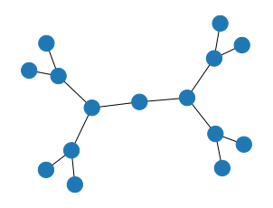
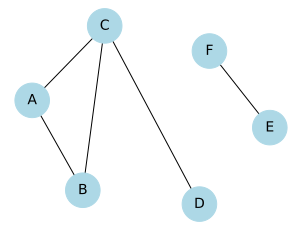
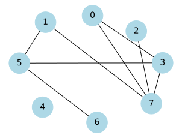
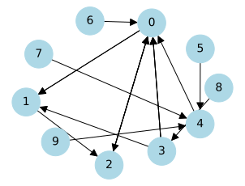

# Lecture 4: Graph Searches and Trees


```python
# import packages needed in this lecture
import numpy as np
import networkx as nx
from collections import Counter
import matplotlib.pyplot as plt
import queue
import scipy.sparse

# The defaults are hard to see on a projector in class
plt.rcParams["figure.figsize"] = (4, 3)
%config InlineBackend.figure_formats = ['svg']

draw_params = {
    "node_color": "lightblue",
    "font_size": 14,
    "with_labels": True,
    "arrowsize": 20,
    "width": 1,
    "node_size": 1200
}

# Ignore deprecation warnings, in particular for getnnz.
# It is deprecated but the replacement doesn't seem to work
# for the examples we want to show here...
import warnings
warnings.filterwarnings("ignore", category=DeprecationWarning)
warnings.filterwarnings("ignore", category=UserWarning)
```

## Pre-Reading:
- [Graph Storage](https://runestone.academy/ns/books/published/pythonds/Graphs/toctree.html) - read sections [8.9](https://runestone.academy/ns/books/published/pythonds/Graphs/ImplementingBreadthFirstSearch.html) and [8.10](https://runestone.academy/ns/books/published/pythonds/Graphs/BreadthFirstSearchAnalysis.html)
- [Depth-First and Breadth-First Search Introduction](https://www.tutorialspoint.com/difference-between-bfs-and-dfs)
  - [Depth-First Search Visualization](https://www.youtube.com/watch?v=x-VTfcmrLEQ&mute=1) (1.5m)
  - [Breadth-First Search Visualization](https://www.youtube.com/watch?v=NUgMa5coCoE&mute=1) (1.5m)
- (Optional) [PageRank Introduction Video](https://www.youtube.com/watch?v=meonLcN7LD4) (5m)

## Outline:

- Trees (10 min)
- Review of Stacks and Queues (15 min)
- Graph searches: BFS and DFS (40 min)

## Learning Objectives

By the end of this lecture, you will be able to:

- Define a tree data structure and explain its practical applications in real-world scenarios.
- Perform breadth-first (BFS) and depth-first searches(DFS) in graphs.
- Compare and contrast BFS and DFS.

## 1. Trees

A tree is a **hierarchical data structure** used to organize and represent data in a parent–child relationship. A tree data structure has a root, branches, and leaves.

In Graph theory, a tree is a connected graph containing no cycles. It means there is exactly one path between any two vertices and no edges ever point back. 


Trees are used in many areas of computer science, including operating systems, graphics, database systems, and computer networking. The difference between a tree in nature and a tree in computer science is that a tree data structure has its root at the top and its leaves on the bottom, as shown in the figure above.

### 1.1 Why do we need to study tree data structure?

Tree data structures are very useful for organizing data hierarchically, where elements are grouped at multiple levels based on their relationship, usually in a parent-child order. 

Many systems involve data that has a parent–child relationship, such as:
- File systems (folders and subfolders),
- Organization charts (manager–employee hierarchy),
- XML/HTML documents (nested tags),
- Trees naturally and efficiently model these relationships.


Specialized trees are often used for efficient searching and sorting algorithms. 
- **Binary Search Trees (BSTs)** support fast lookup, insertion, and deletion (O(log n) average time).
    - We will discuss it later in this course. 

- **AVL Trees / Red-Black Trees** keep data balanced for consistently fast performance.

- **Heaps** enable efficient implementation of priority queues and algorithms like heapsort.
    - You will see heaps later in this program. 

Trees are also the basis for many advanced data structures. For example, 
- Tries are used for autocomplete and spell checking.
- Syntax trees are used by compilers and interpreters.
- B-trees are used for databases and file systems.

Trees help model relationships like 
- decision trees, random forests, and gradient-boosted trees in machine learning, 
- routing hierarchies in networking.

Tree-based indexing structures (like B+ trees) are used in:
- Databases for fast record retrieval, 
- Search engines for indexing web pages, 
- Memory management and compression algorithms.

**Example:** computer file system
Root Folder
 ├── Documents
 │    ├── Resume.pdf
 │    └── Notes.txt
 └── Pictures
      ├── Vacation/
      │     └── beach.jpg
      └── profile.png
### 1.2 Tree Terminology

1. A **node** is a fundamental part of a tree. It stores data.
2. The first node in a tree is called the **root** node.
3. A link connecting one node to another is called an **edge**.
4. A **child** node is an immediate successor of another node.
5. A **parent** node is an immediate predecessor of another node.
    - A node can have zero, one, or many child nodes.
    - A node can only have one parent node.
6. Nodes without links to other child nodes are called **leaves**, or **leaf nodes**.

- The tree **height** is the maximum number of edges from the root node to a leaf node. The height of the tree above is 2.

    - The height of a node is the maximum number of edges between the node and a leaf node.

- A portion of a tree starting from a node and including all its descendants is called a **subtree**. A subtree of the above example is highlighted in yellow. 

- A **balanced tree** is a type of tree data structure in which the height of the left and right subtrees of any node are nearly equal. The example above is a balanced tree.


```python
import networkx as nx

# Create a balanced binary tree of height 2
T_balanced = nx.balanced_tree(2, 3)
nx.draw(T_balanced)

```


    

    


Here is an example implementation of a tree in Python:


```python
class Node:
    """
    A class representing a node in a generic tree structure.

    Each node stores data and maintains a list of its child nodes.

    Attributes
    ----------
    data : any
        The value or data stored in the node.
    children : list of Node
        A list containing all child nodes of the current node.

    Methods
    -------
    add_child(child_node)
        Adds a new child node to the current node.
    print_tree(level=0)
        Recursively prints the tree structure starting from the current node.
    """
    

    def __init__(self, data):
        self.data = data           # Value stored in the node
        self.children = []         # List to hold child nodes

    # Method to add a child node
    def add_child(self, child_node):
        self.children.append(child_node)

    # Method to print the tree structure
    def print_tree(self, level=0):
        print(" " * level * 2 + str(self.data))
        for child in self.children:
            child.print_tree(level + 1)
```


```python
# Example use case:

# Root node
root = Node("Root")

# Create child nodes
child1 = Node("Child 1")
child2 = Node("Child 2")

# Add children to the root
root.add_child(child1)
root.add_child(child2)

# Add grandchildren
child1.add_child(Node("Grandchild 1.1"))
child1.add_child(Node("Grandchild 1.2"))
child2.add_child(Node("Grandchild 2.1"))

# Print the tree structure
root.print_tree()
```

    Root
      Child 1
        Grandchild 1.1
        Grandchild 1.2
      Child 2
        Grandchild 2.1
    

## 2. Review of Stack and Queue

### 2.1 Stack 
A stack is a linear data structure that stores an ordered collection of items, where operations follow the Last In, First Out (LIFO) principle.

Example: a stack of books or plates.


```python
class Stack:
    """A stack data structure."""

    def __init__(self):
        self.data = list()

    def push(self, item):
        """
        Adds a new item to the top of the stack.
        
        Parameters
        ----------
        item : object
           An item added to the stack
        """
        self.data.append(item)

    def pop(self):
        """
        Removes the item that is at the top of the stack and returns the item.

        Returns
        -------
        object 
             The item that was last added to the stack.

        Examples
        --------
        >>> stack = Stack()
        >>> stack.push(1)
        >>> stack.push([1, 2, "dog"])
        >>> stack.push("popcorn")
        >>> stack.pop()
        'popcorn'
        """
        return self.data.pop()

    def isEmpty(self):
        """ 
        Checks to see if the stack is empty.

        Returns
        -------
        bool 
             True if the stack contains no items, False otherwise.    

        Example
        --------
        >>> stack = Stack()
        >>> stack.isEmpty()
        True
        """
        return len(self.data) == 0
    
    def __str__(self):
        return self.data.__str__()
```

### 2.2 Queue

A queue is a linear data structure that stores an ordered collection of items, where operations follow the First In, First Out (FIFO) principle.

Example: people waiting at a ticket counter. 


```python
class Queue:
    """A Queue data structure."""
    
    def __init__(self):
        self.data = list()

    def push(self, item):
        """
        Adds a new item to the end of the queue.
        
        Parameters
        ----------
        item : object
           An item added to the queue
        """
        
        self.data.append(item)

    def pop(self):
        """
        Removes the item that is at the front of the queue and returns the item.

        Returns
        -------
        object 
             The least recent item added to the queue.     

        Example
        --------
        >>> queue = Queue()
        >>> queue.push(1)
        >>> queue.push([1, 2, "dog"])
        >>> queue.push("popcorn")
        >>> queue.pop()
        '1'
        """
        return self.data.pop(0)

    def isEmpty(self):
        """ 
        Checks to see if the queue is empty. 

        Returns
        -------
        bool 
            True if the stack contains no items, False otherwise.    

        Example
        --------
        >>> queue = Queue()
        >>> queue.push(1)
        >>> Queue.isEmpty()
        False
        
        """
        return len(self.data) == 0
    
    def __str__(self):
        return self.data.__str__()
```

## 3. Breadth-first search (BFS)

When we model data as a graph (or tree), we have to search through the graph (or tree) to address various questions, such as:
- Is there a path between all vertices? Or is the graph connected?
    - For example, "Can I fly from Taipei to Honolulu?"
- What is the shortest distance between two particular vertices?
  - For example, "What is the quickest path (fewest transfers) from Honolulu to Taipei?"
  - For example, "What is the least expensive path from Honolulu to Taipei?"

In this section, we will introduce the first algorithm for searching through a graph (or a tree): Breadth-First Search (BFS).

We have seen the graph below: 


```python
disconnected_graph = nx.Graph()

disconnected_graph.add_node("A")
disconnected_graph.add_node("B")
disconnected_graph.add_node("C")
disconnected_graph.add_node("D")
disconnected_graph.add_node("E")
disconnected_graph.add_node("F")

disconnected_graph.add_edge("A", "B")
disconnected_graph.add_edge("A", "C")
disconnected_graph.add_edge("D", "C")
disconnected_graph.add_edge("B", "C")

disconnected_graph.add_edge("E", "F")

pos = nx.spring_layout(disconnected_graph, k=10)
nx.draw(disconnected_graph, pos, **draw_params)

# nx.draw(disconnected_graph, pos=nx.spring_layout(disconnected_graph, k=10, seed=5), **draw_params)
```


    

    


In this case, we can visually check whether nodes $A$ and $E$ are connected easily. However, imagine a dataset with millions of nodes and billions of edges, like a Facebook social network, which you will explore in Lab 2. We can't "eyeball" whether two nodes are connected. We need an **algorithm**.

Breadth-first search (BFS) is one of the simplest algorithms for searching a graph. It also serves as a prototype for several other important graph algorithms that you might encounter in the future. Given a graph $G=(V,E)$ and a starting vertex $s$, BFS proceeds by exploring the edges of the graph to find all the vertices that can be reached from  $s$. 

Initially, all the vertices are marked as "undiscovered". BFS expands the frontier between discovered and undiscovered vertices uniformly across the breadth of the frontier.  It ensures that all nodes at the current distance from the starting node are explored before moving on to nodes at the next distance.

Here we will implement BFS iteratively using the `Queue()` class as defined above. The algorithm begins with the starting node $s$ and adds its neighbors to the queue. Then, we repeatedly dequeue the next node from the queue to visit. Each time we visit an "unvisited" node, we enqueue its unvisited neighbors. This process guarantees that all "distance 1 neighbors" are visited before any "distance 2 neighbors."

Moreover, BFS can be used to determine the "distance" between nodes by keeping track of the "neighbor depth." This depth indicates how far away a node is from the starting node $s$.

Note: We can also implement queue using Python libraries like
- `collections.deque`
- `queue.Queue`

The function below implements BFS to check if `node1` and `node2` are connected:


```python
def check_connected_using_bfs(g, node1, node2, verbose=False):
    """ 
    Given a NetworkX Graph g, and start node node1 
    and goal node node2, tests whether node1 and node2
    are connected in the graph g using breadth first search.
    If they are not connected, returns False.

    Parameters
    ----------
    g : networkx.classes.graph.Graph
        the graph
    node1 : str, int
        first node
    node2 : str, int
        second node
    verbose : bool
        if True, node location will be displayed while False will not
        (default is False)
    
    Returns
    -------
    bool 
        True if the two nodes are connected and False otherwise     

    Example
    --------
    >>> graph = nx.erdos_renyi_graph(2, 1)
    >>> check_connected_using_bfs(graph, 1, 0)
    True
    """
    
    q = Queue()
    q.push(node1)

    visited = {node1}

    while not q.isEmpty():
        v = q.pop()
        
        if verbose:
            print("At node", v)
            
        if v == node2:
            return True

        for neighbor in g.neighbors(v):
            if neighbor in visited:
                continue
            visited.add(neighbor)
            q.push(neighbor)

    return False
```

```{admonition} Let's visualize it first!
:class: tip
Let's see a Graph search example on the [visualgo website](https://visualgo.net/en/dfsbfs?slide=1).
- Here is the link to the website: [https://visualgo.net/en/](https://visualgo.net/en/)

##### Let's test our code
We will generate a new graph and run our algorithm on it.


```python
erg = nx.erdos_renyi_graph(8, 0.2, seed=40)
nx.draw(erg, **draw_params, pos=nx.spring_layout(erg, k=14, seed=5))
```


    

    


We can check whether note 5 and note 0 are connected using the function.


```python
check_connected_using_bfs(erg, 5, 0, verbose=True)
```

    At node 5
    At node 1
    At node 3
    At node 6
    At node 7
    At node 0
    


    True


We can use `networkx` to get the edges encountered during a breadth-first search starting from a specific node, you can use the following code:


```python
print(list(nx.bfs_edges(erg, 5)))
```

    [(5, 1), (5, 3), (5, 6), (1, 7), (3, 0), (7, 2)]
    

## 4. Depth-first search (DFS)

As its name suggests, Depth-First Search (DFS) explores deeper into the graph whenever possible. DFS prioritizes exploring edges that lead out from the most recently discovered vertex $v$ that still has unexplored edges.

One way to convert the BFS algorithm into a DFS is by changing the data structure from a `Queue` to a `Stack`. This adjustment allows DFS to backtrack when it reaches a dead end, exploring deeper paths before returning to previous vertices. 


```python
def check_connected_using_dfs(g, node1, node2, verbose=False):
    """ 
    Given a NetworkX Graph g, and start node node1 
    and goal node node2, tests whether node1 and node2
    are connected in the graph g using depth first search.
    If they are not connected, returns False.

    Parameters
    ----------
    g : networkx.classes.graph.Graph
        the graph
    node1 : str, int
        first node
    node2 : str, int
        second node
    verbose : bool
        if True, node location will be displayed while False will not
        (default is False)
    
 
    Returns
    -------
    bool 
        True if the two nodes are connected and False otherwise     

    Example
    --------
    >>> graph = nx.erdos_renyi_graph(2, 1)
    >>> check_connected_using_dfs(graph, 1, 0)
    True
    """
    
    stack = Stack()
    stack.push(node1)  # Initialize the stack with the starting node
    
    visited = {node1}

    while stack:
        v = stack.pop()  # Get the last node added to the stack
        
        if verbose:
            print("At node", v)
            
        if v == node2:
            return True
        
        for neighbor in g.neighbors(v):
            if neighbor in visited:
                continue
            visited.add(neighbor)
            stack.push(neighbor) # Add neighbor to the stack

    return False
```

We can apply the same function to the same graph:


```python
check_connected_using_dfs(erg, 5, 0, verbose=True)
```

    At node 5
    At node 6
    At node 3
    At node 7
    At node 2
    At node 0
    


    True


We can see that the order is different from BFS. 

Again `networkx` provides the following functions:


```python
print(list(nx.dfs_edges(erg, 5)))
```

    [(5, 1), (1, 7), (7, 0), (0, 3), (7, 2), (5, 6)]
    


```python
nx.draw(erg, **draw_params, pos=nx.spring_layout(erg, k=14, seed=5))
```


    

    


```python
nx.shortest_path_length(erg, source=5, target=0)

```


    2


**This means it takes $2$ hops to get from node $0$ to node $5$.**

## 5. Graph Search without `networkx` graphs (optional read)

In many cases, we may not have a `networkx` graph. Instead, we may have a list of edges or vertices, or an adjacency matrix. In this case, we can still implement BFS and DFS using the same logic as above.

The most common way to represent a sparse graph is to use an adjacency list, `adj`. In the example below the `adj[i]` represents the list of vertices connected to vertex `i`. We will use a list of lists to represent the adjacency list.


```python
from collections import deque

def bfs_connected(adj, start = 0):
    '''
    BFS traversal on a graph represented by an adjacency list.
    The function starts BFS traversal from vertex 0 and returns
    the order in which the vertices are visited.

    Parameters
    ----------
    adj : list of list of int
        Adjacency list representing the graph.
        Each element `adj[i]` is a list of vertices adjacent to vertex `i`.
    start : int, optional
        The starting vertex for BFS traversal. Default is 0.

    Returns
    -------
    raversal_order : list of int
        List of vertices in the order they are visited during BFS traversal.

    Notes
    -----
    - The BFS starts from vertex `0` by default.
    - The graph is assumed to be connected and undirected.
    - Uses a queue (collections.deque) for efficient FIFO operations.

    Examples
    --------
    >>> adj = [[1, 2], [0, 2, 3], [0, 1, 4], [1, 4], [2, 3]]
    >>> bfs_connected(adj)
    [0, 1, 2, 3, 4]
    >>> bfs_connected(adj, start=2)
    [2, 0, 1, 4, 3]
    '''
    
    num_vertices = len(adj)
    traversal_order = []    # list to store traversal order
    # Initially mark all the vertices as not visited
    visited = [False] * num_vertices
    
    # Create a queue for BFS (using python collection module)
    q = deque()
    q.append(start)
    visited[start] = True    
    
    # Iterate over the queue
    while q:
        
        # Dequeue a vertex from queue and store it
        vertex = q.popleft() 
        traversal_order.append(vertex)
        
        # Visit all unvisited neighbors
        for neighbor in adj[vertex]:
            if not visited[neighbor]:
                visited[neighbor] = True
                q.append(neighbor)
                
    return traversal_order

```


```python
adj_example = [[1,2], [0,2,3], [0,4], [1,4], [2,3]]
bfs_order = bfs_connected(adj_example)
bfs_order
```


    [0, 1, 2, 3, 4]


## 6. PageRank (optional)

In the digital age, the volume of information available on the internet can make it challenging to determine the relevance and importance of different webpages. This leads us to a fundamental question: Which is the most "important" webpage? For example, in a given network, is it page $0$ or page $1$ that holds more significance?

This is a problem known as [centrality](https://en.wikipedia.org/wiki/Centrality), which aim to measures the importance of a node within a graph. A related idea is that of a [hub](https://en.wikipedia.org/wiki/Hub_(network_science)), which refers to nodes that connect to many other nodes. 

One of the most famous measures of centrality is [PageRank](https://en.wikipedia.org/wiki/PageRank), the algorithm that propelled Google to become the leading search engine. PageRank evaluates the importance of webpages based on the links between them, creating a dynamic model of web connectivity.

In this model, we represent websites as nodes in a directed graph. We create a directed edge from site $A$ to site $B$ if site $A$ includes a hyperlink to site $B$. This structure allows us to analyze the web as a graph of pages.

PageRank has a specific mathematical definition, and finding it involves a beautiful application of linear algebra. However, exploring the mathematical intricacies of PageRank is beyond our current scope.

Instead, we can approximate PageRank using a Monte Carlo method with a "simulated web surfer." The process is as follows:
1. We start at a random node (representing a random webpage).
2. With probability $\alpha$, choose a completely random node in the graph, simulating a user visiting a new page. With probability $(1−\alpha)$, choose a random neighbor of the current node, simulating a user clicking on a hyperlink.
3. Repeat Step 2 for $n$ iterations.
4. The ranking of each node is determined by the frequency of visits during this random walk, reflecting its relative importance in the network.

It's important to note that this method is not how Google computes PageRank; the actual algorithm is more elegant and efficient. However, this simulation provides an intuitive way to grasp the concept of PageRank and its implications for understanding the web's structure.


This is an example graph:


```python
sfg = nx.scale_free_graph(10, seed=20)
nx.draw(sfg, **draw_params, pos=nx.spring_layout(sfg, k=5, seed=1))
```


    

    


We implemented the page rank as follows:


```python
def page_rank(G, alpha=0.1, iters=100_000):
    """
    Compute the PageRank for all nodes in the directed graph G.
    Returns a dictionary of the PageRank for all nodes.

    Parameters
    ----------
    G : networkx.classes.graph.DiGraph
        the graph
    alpha : float
        the probability of surfing to a random page
    iters : int
        the number of iterations of simulation to perform

    Returns
    -------
    collections.Counter 
        A dictionary containing the PageRank for each node.

    Example
    --------
    >>> pr = page_rank(nx.scale_free_graph(3))
    Counter({2: 33349, 0: 33371, 1: 33280})
    """
    visited = Counter()

    nodes = G.nodes()
    # start at a random node
    current_node = np.random.choice(nodes)  
    for i in range(iters):
        if np.random.random() < alpha: 
            # with probability p, go to a random node
            current_node = np.random.choice(nodes)  
        else: 
            # with probability 1-p, go to a random neighbour
            current_node = np.random.choice(list(G.neighbors(current_node)))
        # keep score whenever you visit a node
        visited[current_node] += 1 

    return visited
```


```python
pr = page_rank(sfg)
```


```python
pr.most_common()
```


    [(np.int64(0), 36900),
     (np.int64(2), 34252),
     (np.int64(1), 18339),
     (np.int64(4), 3597),
     (np.int64(3), 1906),
     (np.int64(8), 1044),
     (np.int64(5), 1006),
     (np.int64(6), 1004),
     (np.int64(9), 978),
     (np.int64(7), 974)]


We observe that node $0$ has the highest PageRank, which aligns with our expectations. 

##### But why does node 2 rank higher than node 4?
Since node $0$ is the most influential node, having a direct link from node $0$ to node $2$ significantly increases the ranking. There is no direct path from node $0$ to node $4$, meaning node $4$ is not benefitting from the influence of the most popular page. This shows that a link from a popular page is more valuable than a link from a lesser-known or isolated page.

In other words, the quality of incoming links matters more than their quantity. If we were to sort the pages simply by the number of incoming links, we would get a different (and often worse) ranking. The code below sorts the pages by the number of incoming links:


```python
num_neigh = {i: len(list(nx.reverse_view(sfg).neighbors(i)))
             for i in sfg.nodes()}
for node in sorted(num_neigh, key=num_neigh.get, reverse=True):
    print("Node", node, "has", num_neigh[node], "incoming links")
```

    Node 0 has 4 incoming links
    Node 4 has 3 incoming links
    Node 1 has 2 incoming links
    Node 2 has 2 incoming links
    Node 3 has 1 incoming links
    Node 5 has 0 incoming links
    Node 6 has 0 incoming links
    Node 7 has 0 incoming links
    Node 8 has 0 incoming links
    Node 9 has 0 incoming links
    

With the ranking, we get node $4$ above nodes $1$ and $2$.

#### Sources of randomness in PageRank

In the context of the PageRank algorithm, there are two sources of randomness:

- Inherent probabilistic nature: The model is fundamentally probabilistic, particularly when we use the probability $\alpha$ to decide whether to follow a link to a neighboring node or jump to a completely random node. This randomness is an integral part of how PageRank is defined.

- Limitations of the Simulation: The simulation introduces randomness as well, specifically through its initialization at one random node and the finite number of iterations performed. This means that the results can vary depending on the starting point and the number of steps taken in the random walk.

These two sources of randomness are quite different. While the first is a core aspect of the PageRank definition and contributes to its effectiveness, the second is a limitation that can affect the accuracy of the results. In fact, it is mathematically possible to calculate the true PageRank for a given network, which addresses the limitations posed by the simulation's finite iterations.

You may encounter similar concepts regarding randomness and probabilistic models in your statistics courses.
