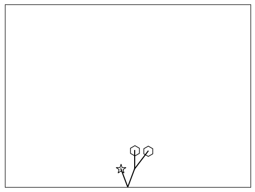

# Lecture 5: Recursive Algorithms

<br>

## Pre-Reading:
- [Recursion in 100 Seconds](https://www.youtube.com/watch?v=rf60MejMz3E)
- [Learn about Fractals](https://www.youtube.com/watch?v=w_MNQBWQ5DI)
- [Fibonacci Sequence](https://www.youtube.com/watch?v=N7pc4aVBP5I)

### For lab preparation:
- [Sierpinski Triangle](https://mathigon.org/course/fractals/sierpinski#)

## Outline:

- Recursion intro: random tree graphics (5 min)
- Recursion intro: the details (35 min)
- Break (5 min)
- Binary search, revisited (5 min)
- Group activity (10 min)
- Multiple recursive calls (20 min)

## Learning Objectives

* Explain what recursion is, and why both the base case(s) and recursive step(s) are essential.
* Recognize problems for which a recursive solution is appropriate.
* Write a recursive solution for a simple problem.
* Compare and contrast recursion and iteration.


```python
import numpy as np
import matplotlib.pyplot as plt
%matplotlib inline
import altair as alt
```

## Recursion intro: random tree graphics (10 min)

Below: credit for the idea goes to [Paul Goldenberg](https://www.edc.org/staff/e-paul-goldenberg); thank you to [Dan Garcia](https://people.eecs.berkeley.edu/~ddgarcia/) for introducing us to it.


```python
def move_pen(x, y, angle, length):
    """
    Moves a point from initial location of x and y according to
    angle and length specified.

    Parameters
    ----------
    x : float
        initial location of pen on the x axis
    y : float
        initial location of pen on the y axis
    angle : float
        direction from initial location (0 means up)
    length: distance from the initial location desired to move

    Returns
    -------
    new_x : float
        new location on the x axis 
    new_y : float
        new location on the y axis 

    Examples
    --------
    >>> move_pen(0, 0, 90,2)
    (2.0, 0)
    >>> move_pen(0, 0, 180,2)
    (0, -2.0)

    """
    new_x = x + length * np.sin(angle * np.pi / 180.0)
    new_y = y + length * np.cos(angle * np.pi / 180.0)
    return new_x, new_y

def branch(x, y, angle=0, length=1, marker="."):
    """
    Plot a shape at the end of a tree branch.

    Parameters
    ----------
    x : float
        initial location on the x axis
    y : float
        initial location on the y axis
    angle : float, optional (default = 0)
        not used, needed to conform to the same interface as vee
    length: float, optional (default = 1)
        not used, needed to conform to the same interface as vee
    marker : str, optional (default = ".")
        the shape at the end of the branch
    """
    plt.plot(x, y, marker=marker, markersize="15",
             markerfacecolor="None", markeredgecolor="k")

def square(*args):
    return branch(*args, marker="s")

def hexagon(*args):
    return branch(*args, marker="h")

def star(*args, length=1):
    return branch(*args, marker="*")

def vee(x=0, y=0, angle=0, length=1):
    """
    Plots a tree with random shaped nodes given
    a trunk location, branch angle and branch length.

    Parameters
    ----------
    x : float, optional (default = 0)
        location of pen on the x axis
    y : float, optional (default = 5)
        location of pen on the y axis
    angle : float, optional (default = 0)
        direction from location desired to move in degrees 
    length: float,  (default = 1)
        distance from the location desired to move
    """
#     plt.figure(figsize=(4,3))
    
    # possible shapes
    shapes = [square, hexagon, star, vee, vee]

    # branch left
    shape = np.random.choice(shapes)
    new_angle = angle - 20/np.pi
    new_x, new_y = move_pen(x, y, new_angle, length)
    plt.plot([x, new_x], [y, new_y], 'k')
    shape(new_x, new_y, new_angle, length)

    # branch right
    shape = np.random.choice(shapes)
    new_angle = angle + 20/np.pi
    new_x, new_y = move_pen(x, y, new_angle, length)
    plt.plot([x, new_x], [y, new_y], 'k')
    shape(new_x, new_y, new_angle, length)

    plt.xticks(())
    plt.yticks(())
    plt.xlim((-2, 2))
    plt.ylim((0, 10))
#     plt.draw()
#     plt.pause(0.05)
```


```python
vee()
```


    

    


## Recursion intro: the details (20 min)

- We are going to take a very step-by-step approach to recursion.
- It might be boring in the middle, but it's going somewhere.

#### Step 1: functions with outputs but no inputs

Consider this function:


```python
def h():
    return 0
```

We can call it:


```python
h()
```


    0


Now let's add a function `g` that calls `h`:


```python
def g():
    return h() + 1
```


```python
g()
```


    1


- What's happening here? `g` is calling `h`, which returns $0$.
- It then adds this result, $0$, to $1$ and gets $1$.
- So it returns $1$.

Now let's add a function `f` that calls `g`:


```python
def f():
    return g() + 1
```


```python
f()
```


    2


- What's happening here? `f` is calling `g`.
- We already know `g` returns $1$, so no need to go through that again.
- So `f` adds $1+1$, and returns $2$.

What's the idea here? That functions can call each other, and we can methodically "unpack" what happens when they call each other. And furthermore, if we already know what `g` does, we can forget about the fact that it calls `h`.

#### Step 2: functions with inputs but no outputs

Now let's make it more interesting by letting the functions take arguments. Consider these functions:


```python
def h(n):
    print("You called h with n=", n)
    print("Ending h with n=", n)
```


```python
h(3)
```

    You called h with n= 3
    Ending h with n= 3


```python
h(2)
```

    You called h with n= 2
    Ending h with n= 2


```python
def g(n):
    print("You called g with n=", n)
    h(n-1)  
    print("Ending g with n= ", n)
```


```python
g(1)
```

    You called g with n= 1
    You called h with n= 0
    Ending h with n= 0
    Ending g with n=  1


```python
g(2)
```

    You called g with n= 2
    You called h with n= 1
    Ending h with n= 1
    Ending g with n=  2


```python
g(3)
```

    You called g with n= 3
    You called h with n= 2
    Ending h with n= 2
    Ending g with n=  3


Ok, now let's add another function, `f`.


```python
def f(n):
    print("You called f with n=", n)
    g(n-1)  
    print("Ending f with n=", n)
```


```python
f(5)
```

    You called f with n= 5
    You called g with n= 4
    You called h with n= 3
    Ending h with n= 3
    Ending g with n=  4
    Ending f with n= 5


```python
f(10)
```

    You called f with n= 10
    You called g with n= 9
    You called h with n= 8
    Ending h with n= 8
    Ending g with n=  9
    Ending f with n= 10


FYI (optional): what we're seeing above is a depiction of the functions' [call stack](https://en.wikipedia.org/wiki/Call_stack). 

#### Step 3: functions with inputs _and_ outputs

Above, each function is passing data _into_ the next function.

Below, we try passing data _out_ of each function as well.


```python
def h(n):
    print("Starting h with n=", n)
    value = 0
    print("Ending h with n=", value)
    return value
```


```python
h(5)
```

    Starting h with n= 5
    Ending h with n= 0


    0


`h` is a weird function that ignores its input and just returns 0.

Below, `g` calls `h` will a smaller value of `n`, and then adds 1 to the result.


```python
def g(n):
    print("Starting g with n=", n)
    value = h(n-1) + 1
    print("Ending g with n=", value)
    return value
```


```python
g(10)
```

    Starting g with n= 10
    Starting h with n= 9
    Ending h with n= 0
    Ending g with n= 1


    1


Let's look at the _order_ of the print statements:

1. We start `g`
2. We start `h`
3. We end `h`
4. We end `g`

This is critical to understanding what happens next.


```python
def f(n):
    print("Starting f with n=", n)
    value = g(n-1) + 1
    print("Ending f with n=", value)
    return value
```


```python
result = f(11)
result
```

    Starting f with n= 11
    Starting g with n= 10
    Starting h with n= 9
    Ending h with n= 0
    Ending g with n= 1
    Ending f with n= 2


    2


Let's remove some of the print statements to make things more compact:


```python
def f(n):
    print("Starting f with n=", n)
    return g(n-1) + 1


def g(n):
    print("Starting g with n=", n)
    return h(n-1) + 1


def h(n):
    print("Starting h with n=", n)
    return 0
```


```python
f(11)
```

    Starting f with n= 11
    Starting g with n= 10
    Starting h with n= 9


    2


So far, this isn't interesting because we're not using `n` for anything. We get the same result, $2$, for any value of `n`:


```python
f(1000)
```

    Starting f with n= 1000
    Starting g with n= 999
    Starting h with n= 998


    2


Now look at this code (we're getting close to the punch line):


```python
def f(n):
    print("Starting f with n=", n)
    if n == 0:
        return 0
    else:
        return g(n-1) + 1


def g(n):
    print("Starting g with n=", n)
    if n == 0:
        return 0
    else:
        return h(n-1) + 1


def h(n):
    print("Starting h with n=", n)
    if n == 0:
        return 0
    else:
        return i(n-1) + 1

# ...
# ...
```

This code actually uses `n`. Here's what it `f` outputs

|  `n`   |   `f(n)` |
|--------|--------|
| 0      |    0   |
| 1      |    1   |
| 2      |    2   |
| 3+     | error  |


```python
f(0)
```

    Starting f with n= 0


    0


```python
f(1)
```

    Starting f with n= 1
    Starting g with n= 0


    1


```python
f(2)
```

    Starting f with n= 2
    Starting g with n= 1
    Starting h with n= 0


    2


```python
f(3)
```

    Starting f with n= 3
    Starting g with n= 2
    Starting h with n= 1


    ---------------------------------------------------------------------------

    NameError                                 Traceback (most recent call last)

    Cell In[33], line 1
    ----> 1 f(3)


    Cell In[29], line 6, in f(n)
          4     return 0
          5 else:
    ----> 6     return g(n-1) + 1


    Cell In[29], line 14, in g(n)
         12     return 0
         13 else:
    ---> 14     return h(n-1) + 1


    Cell In[29], line 22, in h(n)
         20     return 0
         21 else:
    ---> 22     return i(n-1) + 1


    NameError: name 'i' is not defined


And now the key insight: all of the functions above are _exactly the same_. They check if `n` is zero. If so, they return zero. Otherwise, they call a function _identical to themselves_ with argument `n-1`, add `1` to the result, and return it.

So why write


```python
def f(n):
    if n == 0:
        return 0
    else:
        return g(n-1) + 1

# def g(n):
#     ...
#
# def h(n):
#     ...
```

a million times when you can just write


```python
def f(n):
    if n == 0:
        return 0
    else:
        return f(n-1) + 1
```

BAM! Recursion. 

- It is just incidental that all the functions have the same name, `f`. 
- It may be helpful for you to think of them as separate. 
- They do live in separate universes, with separate variables, like `n` and all other variables. 
- The fact that they are all named `f` is just a matter of convenience, to avoid writing an infinite amount of code.


```python
f(3)
```


    3


```python
f(-1)
```


    ---------------------------------------------------------------------------

    RecursionError                            Traceback (most recent call last)

    Cell In[37], line 1
    ----> 1 f(-1)


    Cell In[35], line 5, in f(n)
          3     return 0
          4 else:
    ----> 5     return f(n-1) + 1


    Cell In[35], line 5, in f(n)
          3     return 0
          4 else:
    ----> 5     return f(n-1) + 1


        [... skipping similar frames: f at line 5 (2970 times)]


    Cell In[35], line 5, in f(n)
          3     return 0
          4 else:
    ----> 5     return f(n-1) + 1


    RecursionError: maximum recursion depth exceeded


#### Aside: Stack overflow


(Image source: [Wikipedia](https://commons.wikimedia.org/wiki/File:Stack_Overflow_logo.svg))

- A stack overflow error most commonly occurs when a recursive function makes an exceedingly large numbers of calls to itself (usually because of not properly setting up a base case), causing the memory allocated for a function's call stack to overflow.

- Python prevents this from happening by throwing a `RecursionError` when a certain number of recursive calls are made (this number is system-dependent)

Let's put our print string back in...


```python
def f(n):
    print("Starting f with n=", n)
    if n == 0:
        print("Ending f with n =", n, "and returning 0 (base case)")
        return 0
    else:
        value = f(n-1) + 1
        print("Ending f with n =", n, "and returning", value)
        return value
```


```python
f(2)
```

    Starting f with n= 2
    Starting f with n= 1
    Starting f with n= 0
    Ending f with n = 0 and returning 0 (base case)
    Ending f with n = 1 and returning 1
    Ending f with n = 2 and returning 2


    2


- Does this look familiar? It's the same "call stack" we saw before with our `f`, `g`, and `h`. Except now all the functions are named `f`. 
- The `if n == 0` part of the code is called the _base case_. This is like the function `h` earlier. It is the function that does _not_ call itself, and it's what causes the recursion to terminate.
- The call to itself, in this case `f(n-1)` is the recursive step.


```python
f(5)
```

    Starting f with n= 5
    Starting f with n= 4
    Starting f with n= 3
    Starting f with n= 2
    Starting f with n= 1
    Starting f with n= 0
    Ending f with n = 0 and returning 0 (base case)
    Ending f with n = 1 and returning 1
    Ending f with n = 2 and returning 2
    Ending f with n = 3 and returning 3
    Ending f with n = 4 and returning 4
    Ending f with n = 5 and returning 5


    5


## Binary search, revisited (5 min)

- Let's return to binary search from [Lecture 1](https://github.ubc.ca/mds-2025-26/DSCI_512_alg-data-struct_students/blob/master/lectures/01_complexity-big-O.ipynb).
- The code is rather messy.
- Here is a case where recursion works beautifully.


```python
def binary_search(data, key):
    """
    Searches the key in data using binary search. 
    Returns True if found and False otherwise. 

    Parameters
    ----------
    data : list
        the elements to search within
    key : int
        the key to search for

    Returns
    -------
    bool
        is the key contained in the data?

    Examples
    --------
    >>> binary_search([1, 7, 35, 45, 67], 3)
    False
    >>> binary_search([1, 7, 35, 45, 67], 7)
    True
    """
    if len(data) == 1:
        return data[0] == key

    mid = len(data)//2
    if key < data[mid]:
        return binary_search(data[:mid], key)
    else:
        return binary_search(data[mid:], key)
```


```python
data = [-12, 4, 7, 9, 45, 987, 987, 1000, 2000]

# Test cases for binary search
# key is the first element in the list
assert binary_search(data, -12)

# key is the last element in the list
assert binary_search(data, 2000)

# key is the middle element in the list
assert binary_search(data, 45)

# key occurs multiple times in the list
assert binary_search(data, 987)

# key is larger than the largest element in the list
assert not binary_search(data, 3000)

# key is smaller than the smallest element in the list
assert not binary_search(data, -18)
```

- So elegant!
- And also maps more clearly to our verbal description of the algorithm (think of the phone book).

## Group activity (10 min)

Consider the code below:


```python
def f(n):
    if n == 0:
        return ""
    elif n == 3:
        return "b" + f(n-1) + "c"
    else:
        return "a" + f(n-1)
```

**Without running the code**, fill in the table for what `f` returns:

|  `n`   |   `f(n)` |
|--------|--------|
| 0      |   ""     |
| 1      |   "a"    |
| 2      |   "aa"   |
| 3      |   "baac"   |
| 4      |   "abaac"     |
| 5      |   "aabaac"     |
| -1     |   _infinite loop_     |


```python
for n in range(6):
    print(f'f({n}) = {f(n)}')
```

    f(0) = 
    f(1) = a
    f(2) = aa
    f(3) = baac
    f(4) = abaac
    f(5) = aabaac


## Multiple recursive calls (20 min)

Consider the function below.


```python
def f(n):
    if n == 1 or n == 2:
        return 1
    else: 
        return f(n-1) + f(n-2)
```

What is returned by `f(3)`?
What is returned by `f(4)`?


```python
f(4)
```


    3


```python
def f(n):
    print("Starting f with n=", n)
    if n == 1 or n == 2:
        return 1
    else:
        return f(n-1) + f(n-2)
```


```python
f(4)
```

    Starting f with n= 4
    Starting f with n= 3
    Starting f with n= 2
    Starting f with n= 1
    Starting f with n= 2


    3


Note this is equivalent to:


```python
def f(n):
    print("Starting f with n=", n)
    if n == 1 or n == 2:
        return 1
    val1 = f(n-1)
    val2 = f(n-2)
    return val1 + val2

f(4)
```

    Starting f with n= 4
    Starting f with n= 3
    Starting f with n= 2
    Starting f with n= 1
    Starting f with n= 2


    3


In other words, there's no significance to the two recursive calls being on the same line of code.

Let's draw out the execution tree.

- First, `f(4)` is called.
- The first thing it does is call `f(n-1) = f(3)`

```
            f(4)
           /     
        f(3)  
```


- The first thing `f(3)` does is call `f(n-1)=f(2)`.


```
            f(4)
           /    
        f(3)  
        /   
     f(2)  
```

- `f(2)` triggers the base case and immediately returns $1$.


```
            f(4)
           /    
        f(3)  
        /1    
     f(2)=1  
```

- The return value $1$ is passed back up to `f(3)`. 
- `f(3)` is trying to call `f(n-1) + f(n-2)`, and the first of those has just returned with value $1$.
- So it now proceeds to call the second one, namely `f(n-2)` or `f(1)`.


```
            f(4)
           /      
         f(3)  
        /1   \
     f(2)=1  f(1)
```

- `f(1)` triggers the base case and immediately returns $1$.
- The return value $1$ is passed back up to `f(3)`. 


```
            f(4)
           /     
         f(3)
        /1   \1
     f(2)=1  f(1)=1         
```

- `f(3)` is now done, because it has computed $f(n-1) + f(n-2) = 1 + 1 = 2$


```
            f(4)
           /2      
         f(3)=2 
        /1   \1
     f(2)=1  f(1)=1         
```

- It passes this value, $2$ up to its caller, namely `f(4)`.
- `f(4)` is trying to call `f(n-1) + f(n-2)`, and the first of those has just returned with value $2$.
- So it now proceeds to call the second one, namely `f(n-2)` or `f(2)`.


```
             f(4)
           /2    \ 
        f(3)=2  f(2)
        /1   \1
     f(2)=1  f(1)=1         
```

- `f(2)` triggers the base case and immediately returns $1$.


```
             f(4)
           /2    \1 
        f(3)=2  f(2)=1
        /1   \1
     f(2)=1  f(1)=1         
```

- `f(4)` is now done, because it has computed $f(n-1) + f(n-2) = 2 + 1 = 3$


```
            f(4)=3
           /2    \1
        f(3)=2  f(2)=1
        /1   \1
     f(2)=1  f(1)=1         
```

The function above implements the [Fibonacci sequence](https://en.wikipedia.org/wiki/Fibonacci_number): $F_n=F_{n-1}+F_{n-2}$.

- In this case we need **2 base cases** to get things started, because $F_n$ depends on the **previous 2 steps**.
- Recursive functions don't need to be sequences, as we'll see.
- The time complexity here is something like $O(2^n)$ 
  - (Slightly less than $2^n$ steps but close enough.)
  - It is generally true, rougly speaking, that if a recursive function calls itself $k$ times and the "depth" of the recursion is $n$, then the time complexity is $k^n$. More on this next class.

**Question:** We've said the time complexity of our Fibonacci function `f` above is $O(2^n)$. What is the space complexity?

A: $O(2^n)$ \
B: $O(n^2)$ \
C: $O(n)$ \
D: $O(1)$ 

<br><br><br>

<br><br><br>
**Answer:** $O(n)$

Why? We can only execute one branch of the execution tree at a time.
- Our space usage is proportional to our depth in the stack (number of recursive calls **without a return**)
- When we return from a recursive call, we immediately free up that space
- The maximum depth is the depth of the tree, which is $O(n)$

Revisiting the binary search code above:

```python
def binary_search(data, key):
    if len(data) == 1:
        return data[0] == key   

    mid = len(data)//2
    if key < data[mid]:
        return binary_search(data[:mid], key)
    else:
        return binary_search(data[mid:], key)
```

**Question:** Is this function making multiple recursive calls and thus running in $O(2^n)$ time?

<br><br><br><br><br><br>
**Answer:** No! Because of the `if/else`, it's only calling itself once.

- Does that mean it runs in $O(n)$ time?
- No, in fact, it runs in $O(\log n)$ because it calls itself on a list of 1/2 the size each time. 
  - We discussed this in the first class.
- We can't just read off the running time from the code without thinking carefully about it.
