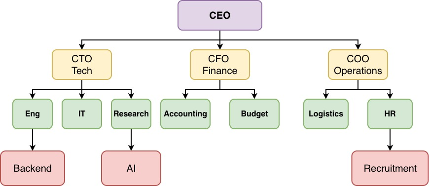
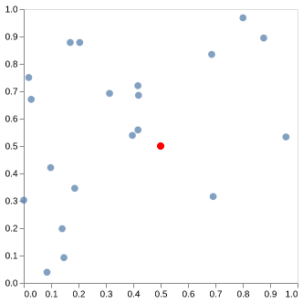
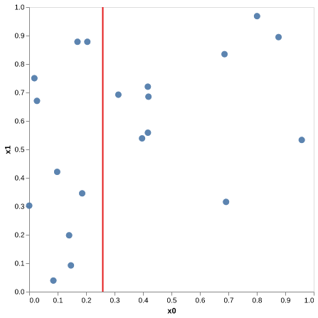
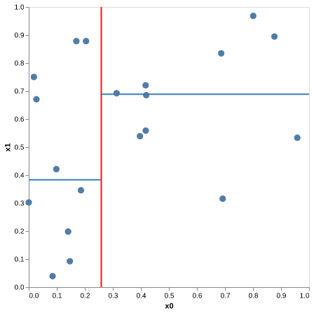
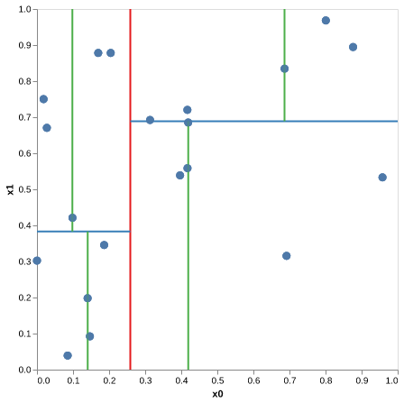
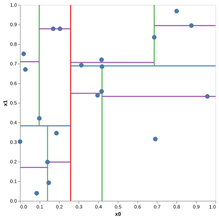
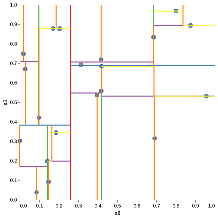

# Lecture 6: Recursive Data Structures

## Pre-Reading:
- [Binary Search Tress (BST)](https://www.youtube.com/watch?v=mtvbVLK5xDQ) (6.0m)
- [KD-Tree Nearest Neighbor Data Structure](https://www.youtube.com/watch?v=Glp7THUpGow) (6:30m)


## Outline: 

- Recursive data structures (15 min)
- Trees, binary search trees (20 min)
- Break (5 min)
- Nearest neighbours intro (5 min)
- $k$-d trees (20 min)
- Amortization (5 min)
- Activities (time-permitting)

## Learning objectives

* Implement a simple recursive data structure such as a linked list.
* Compare and contrast a binary search tree to a hash table.
* Select an appropriate algorithm for finding nearest neighbours.


```python
import numpy as np
import pandas as pd

import matplotlib.pyplot as plt
import altair as alt
alt.renderers.enable('png')

from collections import defaultdict

import networkx as nx
import sklearn.neighbors

```

## Motivation for recursion

- Last class we talked about recursive functions, which call themselves. 
- We saw how this made the binary search code more elegant.
- Today we'll see a stronger motivation for recursive functions and recursive thinking. 

## Recursive data structures (15 min)

We have talked about nested data structures, like:


```python
x = [[1, 2, 3], ["a", "b", "c"]]
x
```


    [[1, 2, 3], ['a', 'b', 'c']]


- This is a list of lists. 
- We have also seen dicts of dicts before.
    - another example is the JSON format.
    
- We can also have a doll within a doll:


(Image attribution to Fanghong, from [Wikipedia article](https://en.wikipedia.org/wiki/Matryoshka_doll))

- Consider that you wanted to store items, one inside each doll.
- How would you add a new item? Describe it in words.
   - To the outside?
   - To the inside?


```python
class TreasureBox:
    """
    A linked list, aka treasure box. The user add and retrive items from it.
    """

    def __init__(self, treasure):
        self.next = None # data type: TreasureBox
        self.treasure = treasure # data type: whatever

    def append_outer(self, treasure):
        """Add a new treasure box to the outside by putting lastest box inside it.

        Parameters
        ----------
        treasure : object
           the label designated to the newly covered treasure box

        Returns
        -------
        new_box : TreasureBox
             new treasure box object containing previous boxes inside    

        Example
        --------
        >>> box = box.append_outer(10)
        """

        new_box = TreasureBox(treasure)
        new_box.next = self
        return new_box

    def append_inner(self, treasure):
        """Add a new treasure box inside the innermost current box.

        Parameters
        ----------
        treasure : object 
           the label designated to the newly inserted treasure box

        Returns
        -------
        new_box : TreasureBox
             new treasure box object contained within innermost box of 
             the last treasure box    

        Example
        --------
        >>> box.append_inner(55)
        """

        if self.next is None:
            self.next = TreasureBox(treasure)
        else:
            self.next.append_inner(treasure)
        return self

    def get(self, depth):
        """Get the treasure by going depth levels deep into the treasure boxes.

        Parameters
        ----------
        depth : int 
           the depth of which to unwrap the treasure box 

        Returns
        -------
        object : 
             the treasure retrieved after recursing the specified depth. 

        Example
        --------
        >>> box = TreasureBox(12)
        >>> box = box.append_outer(9)
        >>> box = box.append_inner(55)
        >>> box.get(0)
        9 
        >>> box.get(2)
        55
        """

        if depth == 0:
            return self.treasure

        if self.next is None:
            return None  # Index out of bounds

        return self.next.get(depth-1)
```


```python
box = TreasureBox("$5")

box = box.append_outer("$100")
box = box.append_outer("$20")
```

**To do in class:** draw a picture of what this looks like.


```python
box.get(0)
```


    '$20'


```python
box.get(1)
```


    '$100'


```python
box.get(2)
```


    '$5'


```python
box.get(3)
```


```python
box = TreasureBox("Initial box")

box = box.append_inner("Box in initial box")
box = box.append_inner("Box in the second box")
```


```python
box.get(0)
```


    'Initial box'


```python
box.get(1)
```


    'Box in initial box'


```python
box.get(2)
```


    'Box in the second box'


```python
box.get(3)
```

Activity: without running the code, what will this return?


```python
box = TreasureBox("A")

box = box.append_inner("B")
box = box.append_outer("C")
box = box.append_outer("D")
box = box.append_inner("E")

box.get(3)
```


    'B'


```
[D [C [A [B [E]] ]]]
```

#### Linked-list

- In computer science, this is called a [linked list](https://en.wikipedia.org/wiki/Linked_list).
- It's not just a nested data structure (list of lists); the definition of the data type itself is recursive. 
  - What is a list? It contains stuff (including possibly lists).
  - What is a treasure box? It contains one thing, and _another treasure box_.

#### Recursive algorithms vs. data structures

- We have a relationship between recursive function calls (see `append_inner` and `get`) and recursive data types (see `__init__`).
- Recursion is an important idea in understanding algorithms _and_ data structures.

#### Could we just implement this with lists?

- Yes, if we decide each list contains 2 elements, an item and another list.
- But using OOP we can make it more clear / less buggy.

## Trees, binary search trees (20 min)

- Trees are recursive data structures, like the linked lists above.
- In lab, you will implement a set based on trees instead of a hash table.
  - In particular this data structure is called a [binary search tree](https://www.geeksforgeeks.org/binary-search-tree-data-structure/).
  - We will talk about them a bit to help with the lab.
- Below we have a tree showing a generic tech company organization chart.



#### Recap: Tree terminology

- A tree is either empty or a node with zero or more _children_ that are themselves trees (or "subtrees").
- If `A` is the child of `B`, then B is the _parent_ of `A`
  - e.g. `CTO` is a child of `CEO` and `COO` is the parent of `HR`.
- The _root_ is the only node without a parent (e.g. `CEO`).
- A _leaf_ is a node that does not have children (e.g. `AI`).
- An _internal node_ is a node that is not a leaf (e.g. `Research`).
- The _height_ (aka _depth_) of the tree is the largest number of edges connecting the root to a leaf (here, 3).


#### Binary Tree

A binary tree is a tree where each node has at most 2 children.    
**Note:** the above tree is not a binary tree. 

So, each tree node will have a label and two children.

 

Let's build a simple binary tree class using Python. 


```python
class BinaryTree:
    
    def __init__(self, item):
        self.item = item
        self.left = None  # type = BinaryTree
        self.right = None # type = BinaryTree
    
    def insert(self, item):
        # pick a random side to insert on
        left = np.random.rand() < 0.5
        if item == left:
            return
        if left:
            if self.left is None:
                self.left = BinaryTree(item)
            else:
                self.left.insert(item)
        else:
            if self.right is None:
                self.right = BinaryTree(item)
            else:
                self.right.insert(item)
    
    def contains(self, item):
        if self.item == item:
            return True
        
        if self.left is not None:
            if self.left.contains(item):
                return True

        if self.right is not None:
            if self.right.contains(item):
                return True

        return False
    
    def print_tree(self, level=0, prefix="Root: "):
        """Recursively prints the tree structure."""
        print("    " * level + prefix + str(self.item))
        if self.left:
            self.left.print_tree(level + 1, prefix="L--- ")
        if self.right:
            self.right.print_tree(level + 1, prefix="R--- ")
    
    # We would want some more functions here, e.g. to add/remove things from the tree.
```

Let's manually build a binary tree containing some of the information in the example above:


```python
tree = BinaryTree("CEO")
tree.insert("CTO")
tree.insert("COO")
tree.insert("Eng")
tree.insert("IT")
```


```python
tree.print_tree()
```

    Root: CEO
        L--- Eng
        R--- CTO
            L--- COO
                R--- IT


```python
tree.contains("Data")
```


    False


```python
type(tree)
```


    __main__.BinaryTree


```python
type(tree.left)
```


    __main__.BinaryTree


- The key idea here is that, like `TreasureBox`, the `BinaryTree` object stores more binary tree objects.
- However, each `TreasureBox` only stores one `TreasureBox`, whereas each `BinaryTree` stores **two** `BinaryTree`s.

#### Binary search trees (BSTs)

**Binary search tree**: A special type of binary tree where each node contains a unique key and satisfies the following properties:
- All nodes in the left subtree of a node contain values strictly less than the node's value.
- All nodes in the right subtree of a node contain values strictly greater than the node's value.


```python
"abc" < "zzz"
```


    True


**To do in class:** draw out a binary search tree, show the process of adding nodes.

```
            8
          /   \
         1    13
             /  \
            9   5942

```

```
    1
     \
      2
       \
        3
         \ 
          4
           \
            5
```

- Requirement to use BSTs: we must be able to compare keys.
- Compare this to a hash table: we need to be able to hash the keys. 

Computational complexity: 

- Binary search trees (BSTs) can be slow if they become very unbalanced (think of adding numbers in increasing order).
- Industrial strength implementations automatically stay balanced and are still efficient.
- Deletion is more tricky and we won't cover it here.
- But the take-home message is that search/insert/delete all run in $O(\log n)$ time, which is pretty fast.

#### Could we do this with lists/dictionaries?

- Again, yes. But here the python data type best reflects the conceptual structure best.

## Break (5 min)

## Nearest neighbours intro (5 min)

- A common problem (DSCI 571, 563, more) is to find the _nearest neighbours_ of a point.
- We can start in 2D:


```python
# You can ignore the code - we'll just look at the plot
###

# Creating Data
n = 20
np.random.seed(1)
X = np.random.rand(n, 2)
```


```python
# Creating Dataframe
data = pd.DataFrame({'x0': X[:, 0], "x1" : X[:, 1]})
data['m0'] = .5
data['m1'] = .5

# Creating Plot
chart1 = alt.Chart(data).mark_circle(size=60).encode(
    x= alt.X('x0',
             axis=alt.Axis(grid=False)),
    y = alt.Y('x1',
             axis=alt.Axis(grid=False)))


chart2 = alt.Chart(data).mark_circle().encode(
    x= alt.X('m0',
              axis=alt.Axis(title = "")),
    y = alt.Y('m1',
               axis=alt.Axis(title = "")),
    color = alt.value('red'),
    size = alt.value(50)
)

chart1 + chart2
```


    

    


- Which blue points are nearest to the red ("query") point?
  - To define "nearest" we need a notion of _distance_.
  - For now, we'll use Euclidean distance (the one you're used to from day-to-day life).
  - In future courses, this might change.
  - Choosing a distance metric is actually important in machine learning.

The algorithmic approach is:

1. Find the distance from the red point to all the blue points.
2. Find the smallest distances.


```python
# It's OK if you don't understand this code, especially during lecture
# (It uses numpy broadcasting, which is covered in the second half of DSCI 523.)


def nearest_neighbour(data, query):
    """
    Find the point in the data that is nearest to the query point.

    Parameters
    ----------
    data : numpy.ndarray
        a 2D array containing the points as rows
    query : numpy.ndarray
        a 1D array containing the query point
    
    Returns
    -------
    int
        the index of the nearest point
                 
    Example
    --------
    >>> array = np.array([[1, 1], [2, 5], [5, 6], [3, 0], [9, 9]])
    >>> nearest_neighbour(array, [10, 10])
    4
    """
    
    if query.ndim == 1:
        query = query[None]

    return np.argmin(np.sum((data - query)**2, axis=1))
```


```python
print(X)
```

    [[4.17022005e-01 7.20324493e-01]
     [1.14374817e-04 3.02332573e-01]
     [1.46755891e-01 9.23385948e-02]
     [1.86260211e-01 3.45560727e-01]
     [3.96767474e-01 5.38816734e-01]
     [4.19194514e-01 6.85219500e-01]
     [2.04452250e-01 8.78117436e-01]
     [2.73875932e-02 6.70467510e-01]
     [4.17304802e-01 5.58689828e-01]
     [1.40386939e-01 1.98101489e-01]
     [8.00744569e-01 9.68261576e-01]
     [3.13424178e-01 6.92322616e-01]
     [8.76389152e-01 8.94606664e-01]
     [8.50442114e-02 3.90547832e-02]
     [1.69830420e-01 8.78142503e-01]
     [9.83468338e-02 4.21107625e-01]
     [9.57889530e-01 5.33165285e-01]
     [6.91877114e-01 3.15515631e-01]
     [6.86500928e-01 8.34625672e-01]
     [1.82882773e-02 7.50144315e-01]]


```python
query = np.array([0.5, 0.5])
nn = nearest_neighbour(X, query)
nn
```


    np.int64(8)


```python
X[8]
```


    array([0.4173048 , 0.55868983])


**Question:** what is the time complexity of `nearest_neighbour` if we have $n$ points in $k$ dimensions?

A: $O(n)$ \
B: $O(k)$ \
C: $O(n^2k)$ \
D: $O(nk)$ 
<br><br><br>

<br><br><br>

**Answer:** $O(nk)$, because we have to loop over all $n$ points, and computing the distance requires looping over the $k$ dimensions.

- Problem: this may be way too slow!
- For example, if you want to find similar items on Amazon, and they have a billion items, you don't want to have to look through _all_ of them every time.

## $k$-d trees (20 min)


- Sometimes we speed things up with faster algorithms.
  - We'll see a lot of that in lab 4. 
- But, as we've seen with trees and hash tables, sometime we speed things up with _better data structures_. 
- One of the classic ways to speed up nearest neighbours is a data structure call the [$k$-d tree](https://en.wikipedia.org/wiki/K-d_tree).
- (Optional) Warning: the use of the letter $k$ here is a bit unfortunate.
  - In future machine learning courses, we'll use $d$ instead of $k$.
  - This will also help avoid confusion with $k$-nearest neighbours, which is a totally different $k$.
  - But I do understand not wanting to call them $d$-d trees... so we'll use $k$ for today.


```python
# You do not need to read/understand this code, but I think
# you shouldn't have any problem understanding it with a bit of time spent.


class KDTree:
    def __init__(self):
        self.location = None
        self.leftSubTree = None
        self.rightSubTree = None
        self.dim = None
        self.data = None

    def build(self, data, depth=0):
        nrows = data.shape[0]
        self.dim = depth % data.shape[1]
        self.data = data

        self.location = np.median(data[:, self.dim])

        if nrows == 1:
            return

        data = data[np.argsort(data[:, self.dim])]
        self.leftSubTree = KDTree()
        self.leftSubTree.build(data[:nrows//2], depth+1)
        self.rightSubTree = KDTree()
        self.rightSubTree.build(data[nrows//2:], depth+1)

    def approximateNearestNeighbour(self, query):
        if self.data.shape[0] == 1:
            return self.data[0]

        if query[self.dim] < self.location:
            return self.leftSubTree.approximateNearestNeighbour(query)
        else:
            return self.rightSubTree.approximateNearestNeighbour(query)

    def plot2d(self, depth=1, minx=0.0, maxx=1.0, miny=0.0, maxy=1.0, color_idx=0):
        """Plot the k-d tree with different colors for each splitting line, and larger plot size."""
        color_palette = [
            "#e41a1c", "#377eb8", "#4daf4a", "#984ea3",
            "#ff7f00", "#ffff33", "#a65628", "#f781bf", "#999999"
        ]
        color = color_palette[color_idx % len(color_palette)]

        # Base data (points)
        data = pd.DataFrame({'x0': self.data[:, 0], "x1": self.data[:, 1]})
        chart1 = (
            alt.Chart(data)
            .mark_circle(size=80)  # slightly larger points
            .encode(
                x=alt.X('x0', axis=alt.Axis(grid=False)),
                y=alt.Y('x1', axis=alt.Axis(grid=False))
            )
            .properties(width=400, height=400) 
        )

        charts_list = [chart1]
        if depth == 0:
            return chart1

        if self.dim == 0:
            # vertical split line
            data2 = pd.DataFrame({'x0': [self.location, self.location], "x1": [miny, maxy]})
            chart2 = (
                alt.Chart(data2)
                .mark_line(color=color, strokeWidth=2)
                .encode(
                    x=alt.X('x0', axis=alt.Axis(grid=False)),
                    y=alt.Y('x1', axis=alt.Axis(grid=False))
                )
                .properties(width=400, height=400)
            )
            charts_list.append(chart2)

            if self.leftSubTree is not None:
                charts_list.append(self.leftSubTree.plot2d(
                    depth-1, minx=minx, maxx=self.location, miny=miny, maxy=maxy, color_idx=color_idx+1))
            if self.rightSubTree is not None:
                charts_list.append(self.rightSubTree.plot2d(
                    depth-1, minx=self.location, maxx=maxx, miny=miny, maxy=maxy, color_idx=color_idx+1))

        elif self.dim == 1:
            # horizontal split line
            data3 = pd.DataFrame({'x0': [minx, maxx], "x1": [self.location, self.location]})
            chart3 = (
                alt.Chart(data3)
                .mark_line(color=color, strokeWidth=2)
                .encode(
                    x=alt.X('x0', axis=alt.Axis(grid=False)),
                    y=alt.Y('x1', axis=alt.Axis(grid=False))
                )
                .properties(width=400, height=400)
            )
            charts_list.append(chart3)

            if self.leftSubTree is not None:
                charts_list.append(self.leftSubTree.plot2d(
                    depth-1, minx=minx, maxx=maxx, miny=miny, maxy=self.location, color_idx=color_idx+1))
            if self.rightSubTree is not None:
                charts_list.append(self.rightSubTree.plot2d(
                    depth-1, minx=minx, maxx=maxx, miny=self.location, maxy=maxy, color_idx=color_idx+1))

        return alt.layer(*charts_list).encode().properties(width=400, height=400)


        # alt.layer(*params).display()
        #alt.layer(whisker_low, box, whisker_high, midline, data=data)
```

Basic idea:

- In each recursive step, there is a certain number of datapoints. If there's only one, we're done.
- Otherwise, for one of the two dimensions (we alternate back and forth), find the median value along the dimension.
- Split the data into two subsets based on being above or below that median, and build a (sub)tree for each of those subsets.
- Starting from the full dataset, you will create a tree where each leaf is a datapoint.
- You can find an approximate nearest neighbour by traversing the down the tree using the same decision points as were used to original split the data; the final leaf is the desired neighbour.


```python
np.median(X[:,0])
```


    np.float64(0.25893821394538014)


```python
kdt = KDTree()
kdt.build(X)
kdt.plot2d(depth=1)
```


    

    


```python
kdt = KDTree()
kdt.build(X)
```


```python
kdt.plot2d(depth=2)
```


    

    


```python
kdt.plot2d(depth=3)
```


    

    


```python
kdt.plot2d(depth=4)
```


    

    


```python
kdt.plot2d(depth=6)
```


    

    


```python
kdt.approximateNearestNeighbour(np.array([1, 1]))
```


    array([0.87638915, 0.89460666])


```python
X[nearest_neighbour(X, np.array([1,1]))]
```


    array([0.87638915, 0.89460666])


```python
kdt.approximateNearestNeighbour(np.array([0.5, 0.5]))
```


    array([0.69187711, 0.31551563])


```python
X[nearest_neighbour(X, np.array([0.5,0.5]))]
```


    array([0.4173048 , 0.55868983])


- Doesn't work perfectly here, but there is a fast correct algorithm, which is beyond the scope of the course.
  - See [`sklearn.neighbors.KDTree`](https://scikit-learn.org/stable/modules/generated/sklearn.neighbors.KDTree.html#sklearn.neighbors.KDTree).
- However, $k$-d trees get slow when the number of dimensions is large.
- Some alternative methods are discussed below.


```python
# ??sklearn.neighbors.KNeighborsClassifier
```


```python
# ??sklearn.neighbors.KDTree
```

#### Timing experiments

We'll time scikit-learn's `KDTree` and compare it to brute force.


```python
n_sizes = [100, 1000, 10_000, 100_000]

results = defaultdict(list)
results["n"] = n_sizes

d = 10

for n in n_sizes:
    print('n: ', n)
    X = np.random.rand(n, d)
    query = np.random.rand(1, d)

    print("  KDTree")
    time = %timeit -q -o -r 3 sklearn.neighbors.KDTree(X)
    results["KDTree init"].append(time.average)
    KDT = sklearn.neighbors.KDTree(X)

    time = %timeit -q -o -r 3 KDT.query(query)
    results["KDTree query"].append(time.average)

    print("  Brute force")
    time = %timeit -q -o -r 3 nearest_neighbour(X, query)
    results["Brute force"].append(time.average)
```

    n:  100
      KDTree
      Brute force
    n:  1000
      KDTree
      Brute force
    n:  10000
      KDTree
      Brute force
    n:  100000
      KDTree
      Brute force


```python
df = pd.DataFrame(results, columns=list(results.keys()))
df
```


<div>
<style scoped>
    .dataframe tbody tr th:only-of-type {
        vertical-align: middle;
    }

    .dataframe tbody tr th {
        vertical-align: top;
    }

    .dataframe thead th {
        text-align: right;
    }
</style>
<table border="1" class="dataframe">
  <thead>
    <tr style="text-align: right;">
      <th></th>
      <th>n</th>
      <th>KDTree init</th>
      <th>KDTree query</th>
      <th>Brute force</th>
    </tr>
  </thead>
  <tbody>
    <tr>
      <th>0</th>
      <td>100</td>
      <td>0.000053</td>
      <td>0.000030</td>
      <td>0.000011</td>
    </tr>
    <tr>
      <th>1</th>
      <td>1000</td>
      <td>0.000553</td>
      <td>0.000041</td>
      <td>0.000051</td>
    </tr>
    <tr>
      <th>2</th>
      <td>10000</td>
      <td>0.009688</td>
      <td>0.000057</td>
      <td>0.000482</td>
    </tr>
    <tr>
      <th>3</th>
      <td>100000</td>
      <td>0.159992</td>
      <td>0.000058</td>
      <td>0.008311</td>
    </tr>
  </tbody>
</table>
</div>


**Question:** What does the time complexity look like for the 3 columns?
<br><br><br>

<br><br><br>

**Answer:** Brute force looks linear, the query looks logarithmic(?), the initialization grows _faster than linear_, perhaps $O(n \log n)$ or perhaps something else, we won't worry about that here.

**Question:** Which is better, the $k$-d tree or brute force?

A: KD Tree \
B: Brute Force \
C: It depends
<br><br><br>

<br><br><br>

**Answer:** It depends how many queries you do.

## Amortization (5 min)

Let's focus on $n=10000$, and $k=10$. Then,

- $k$-d tree initialization takes $\approx 4$ ms
- $k$-d tree query takes $\approx 0.1$ ms
- brute force search takes $\approx 1$ ms

**Question:** How many queries do we need to do such that the $k$-d tree is better?

<br><br><br><br><br><br>
**Answer:** around 5.

- So if we're doing 100 queries, the $k$-d tree is much better.
- This reflects a general phenomenon in algorithms: **doing a lot of work up front to save time later**.
  - We saw this earlier with sorting a list and then doing binary search multiple times.
- We say the up-front effort is _amortized_ (or spread out) over the many queries.
- In some cases, we can make more precise calculations.
  - For example, we say hash table operations are $O(1)$.
  - In fact, once in a while a slower operation must be done.
  - However, we can show that an $O(n)$ operation only needs to be done every $1/n$ steps.
  - In which case we say the cost is amortized and the overall cost is still $O(1)$. 
  - This is an important idea.
  - You will see this in DSCI 513 with the idea of indexing a database.

#### Other nearest neighbour approaches

- Note: there are other nearest neighbour approaches besides $k$-d trees, including some very fast approximate algorithms. 
- In general, _you can often do something faster if the result can be slightly wrong_.
- There are approaches based on hashing instead of trees.
- Here are some resources:
  - [`sklearn.neighbours` documentation](https://scikit-learn.org/stable/modules/neighbors.html#nearest-neighbor-algorithms)
  - Approximate nearest neighbours, e.g. [locality-sensitive hashing](https://en.wikipedia.org/wiki/Locality-sensitive_hashing) (LSH), [this package](https://github.com/spotify/annoy).

#### Related: amortization of hash table growth

- Growth is slow, but only occurs rarely, and so the cost "averages out" because after adding $n$ elements you've spent $O(n)$ time on growth, for an average of $O(1)$ per insertion.
