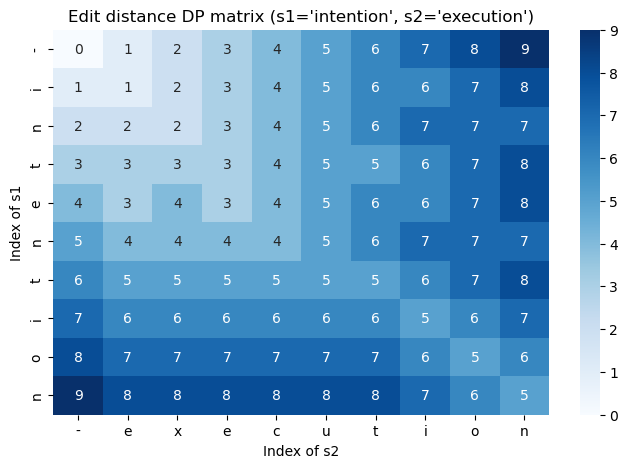
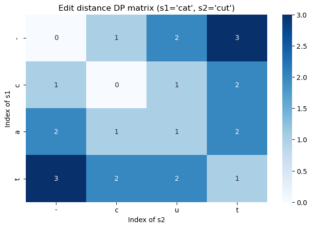

# Lecture 8 Dynamic Programming II
<br>

## Pre-Reading:

[Edit Distance short video](https://www.youtube.com/watch?v=c3KYnQ-VEhs) (8.25m)

## Learning objectives

- Identify problems when dynamic programming is applicable.
- Implement simple dynamic programming algorithms.


```python
#%pip install -U joblib scikit-learn   # sklearn depends on joblib anyway
#%pip install -U seaborn
```


```python
import functools
import numpy as np
import joblib
import sklearn.metrics
from IPython.display import HTML, display

```

## (1). Introduction

In the previous lecture we introduced **dynamic programming (DP)** with simple examples like the Fibonacci sequence and the Climbing Stairs problem.  
DP is a technique for breaking a complex problem down into overlapping subproblems whose solutions can be reused.  It relies on **optimal substructure**, where an optimal solution can be assembled from optimal solutions to its subproblems, and **overlapping subproblems**, where many subproblems recur during the computation.  

In this lecture we build on those foundations and apply dynamic programming to problems on strings and sequences.  Specifically, we will tackle two classic problems:

- **Edit distance** — measuring how many *insertions*, *deletions*, or *substitutions* are required to transform one string into another.  This problem appears in spell checking, natural language processing, and many other applications.  We will see both *top‑down (memoization)* and *bottom‑up (tabulation)* implementations and how to reconstruct an optimal sequence of edits.

- **Global sequence alignment (Optional)** — comparing two sequences (such as DNA or text) to highlight differences and similarities.  The goal is to align the two entire sequences so that mismatches and gaps are penalised and matches are rewarded.


We will continue to use Python and NumPy to implement these algorithms and will compare recursive solutions with dynamic programming approaches.


## (2). Edit Distance

Here, we cover the classic *edit distance* (also known as *Levenshtein distance*).

As a reminder, dynamic programming is a powerful algorithmic technique for solving optimisation problems that exhibit **overlapping subproblems** and an **optimal substructure**. It works by solving smaller instances of a problem once, storing their solutions, and reusing them to construct solutions to larger instances.

In this section we illustrate dynamic programming through the edit distance problem.

**Definition**: Given two strings `s1` and `s2`, the edit distance is the minimum number of operations required to transform `s1` into `s2`. The allowed operations are:

- **Insert** a character
- **Delete** a character
- **Replace** one character with another

For example, transforming `"cat"` into `"cut"` requires just one replacement of `'a'` with `'u'`, so the edit distance is 1.

We will explore a bottom‑up (tabulation) and a top‑down (memoization) dynamic programming approach. We also provide helper functions to reconstruct the sequence of edits and visualize the dynamic programming table.

Before showing an implementation, let's have a refresher on NumPy indexing since we will need it in the code.


### NumPy indexing

NumPy extends basic Python list indexing to support multi‑dimensional arrays.  If `dp` is a 2‑D NumPy array, there are two equivalent ways to access a single element:

- **Chained indexing**: `dp[i][j]`  
  First retrieves row `i` (a one‑dimensional view), then indexes column `j` of that row.  This mirrors how you access a list of lists.

- **Tuple indexing**: `dp[i, j]`  
  Passes the row and column as one tuple.  NumPy interprets this as coordinates and fetches the element in a single step.  It’s concise and avoids creating an intermediate 1‑D view, so it’s generally preferred for large arrays.

Both forms return the same element for a NumPy array, but `dp[i][j]` won’t work on a plain Python list; there you must index row and column separately.

You can also use slicing with comma syntax:

- `dp[i, :]` — extract the entire `i`‑th row  
- `dp[:, j]` — extract the entire `j`‑th column  
- `dp[1:3, 0:2]` — extract a 2×2 sub‑matrix consisting of rows 1–2 and columns 0–1

#### Illustrative example

```python
import numpy as np

# create a 2×3 array
arr = np.array([[1, 2, 3],
                [4, 5, 6]])

# Accessing a single element
print(arr[1][2])  # chained indexing → 6
print(arr[1, 2])  # tuple indexing  → 6

# Slicing rows and columns
print(arr[0, :])  # row 0 → [1 2 3]
print(arr[:, 1])  # column 1 → [2 5]
print(arr[0:2, 1:3])  # 2×2 sub‑matrix → [[2 3], [5 6]]


### Walk‑through example: converting “cat” to “cut”

1. **Initialization**

   We create a 4 × 4 table of integers to store intermediate edit distances.  The extra row and column at the top and left represent *empty* prefixes of the strings.  Each cell `dp[i][j]` will eventually hold the minimum number of edits needed to transform the first `i` characters of the source string into the first `j` characters of the target string. Consider the code snippet below:

```Python
    # Base cases: converting to/from an empty string/prefix
    for i in range(1, n + 1):
        dp[i, 0] = i  # delete all characters from s1[:i]. That is, converting the first i characters of s1
        # into an empty string requires i deletions.
    for j in range(1, m + 1):
        dp[0, j] = j  # insert all characters from s2[:j]. That is, converting an empty string into 
        #the first j characters of s2 requires j insertions.
```

- **What does `dp[i][0] = i` mean?**  When `j = 0`, the target prefix `s2[:0]` is empty.  To convert the first `i` characters of the source string into an empty string, we must **delete** those `i` characters.  The cost of `i` deletions is stored in `dp[i][0]`.

- **What does `dp[0][j] = j` mean?**  When `i = 0`, the source prefix `s1[:0]` is empty.  To convert an empty string into the first `j` characters of the target string, we must **insert** those `j` characters one by one.  The cost of `j` insertions is therefore stored in `dp[0][j]`.

   These assignments fill the entire first row (`dp[0][*]`) and the entire first column (`dp[*][0]`).  They are known as the **base cases**, because they set up the starting conditions for the dynamic‑programming table.  After filling the first row and column with these base‑case values, the table looks like this (the base‑case entries are shown in blue):

<table style="border-collapse: collapse;">
  <tr>
    <th></th><th>–</th><th>c</th><th>u</th><th>t</th>
  </tr>
  <tr>
    <th>–</th>
    <td style="color: blue;">0</td>
    <td style="color: blue;">1</td>
    <td style="color: blue;">2</td>
    <td style="color: blue;">3</td>
  </tr>
  <tr>
    <th>c</th>
    <td style="color: blue;">1</td>
    <td>0</td>
    <td>0</td>
    <td>0</td>
  </tr>
  <tr>
    <th>a</th>
    <td style="color: blue;">2</td>
    <td>0</td>
    <td>0</td>
    <td>0</td>
  </tr>
  <tr>
    <th>t</th>
    <td style="color: blue;">3</td>
    <td>0</td>
    <td>0</td>
    <td>0</td>
  </tr>
</table>

   In this initial table, the blue numbers (`0, 1, 2, 3` along the top row and left column) come from the base cases `dp[0][j] = j` and `dp[i][0] = i`.  The remaining cells are initialized to 0 and will be filled in during subsequent steps using the recurrence relation for edit distance (considering insertions, deletions and replacements).


2. **Processing \(i = 2\) (“a”), \(j = 2\) (“u”)**

Consider the snippet:

```Python
    # Fill the rest of the table iteratively
    for i in range(1, n + 1):
        for j in range(1, m + 1):
            if s1[i - 1] == s2[j - 1]:
                dp[i, j] = dp[i - 1, j - 1]  # no operation needed
            else:
                dp[i, j] = 1 + min(
                    dp[i - 1, j],      # deletion: remove s1[i‑1] and pay dp[i‑1, j] + 1.
                    dp[i, j - 1],      # insertion: insert s2[j‑1] and pay dp[i, j‑1] + 1.
                    dp[i - 1, j - 1]   # replacement: replace s1[i‑1] with s2[j‑1] and pay dp[i‑1, j‑1] + 1.
                    # Note: The minimum of these three possible costs becomes the value of dp[i, j].
                )
    return int(dp[n, m])

```

*Background on indexing*: 

In the dynamic‑programming table, the notation `dp[i][j]` refers to the cell at row `i` and column `j`.  Each row corresponds to taking the first `i` characters of the source string `s1`, and each column corresponds to taking the first `j` characters of the target string `s2`.  The value in `dp[i][j]` is the minimum number of edits needed to turn `s1[:i]` into `s2[:j]`.

So in the “cat” → “cut” example:

- `dp[1][2]` is the entry in **row 1, column 2**.  Row 1 means we’re looking at the prefix `"c"` (the first character of `s1`), and column 2 means we’re looking at the prefix `"cu"` (the first two characters of `s2`).  
- Because converting `"c"` into `"cu"` requires inserting one character (`'u'`), the value stored in `dp[1][2]` is 1.

Whenever we refer to `dp[i][j]` in the recurrence, we’re using these indices to look up the cost of converting prefixes of the two strings.

*Step two*:

At this step we compare the second character of the source prefix (`"ca"`) with the second character of the target prefix (`"cu"`).  Because `'a'` and `'u'` differ, the algorithm considers three possible operations:

- **Deletion**: remove the `'a'` from `"ca"`.  That leaves the prefix `"c"`.  We then need to transform `"c"` into `"cu"`.  In DP terms this costs $dp[1][2]$ for the subproblem, plus one for the deletion.  Since it takes one insertion to turn `"c"` into `"cu"`, we have $dp[1][2] = 1$, so the deletion branch costs $1 + 1 = 2$.

- **Insertion**: insert `'u'` after `"c"` in `"ca"`.  We first transform `"ca"` into `"c"` (this costs $dp[2][1] = 1$, one deletion), and then insert `'u'` (one more operation).  Thus the insertion branch costs $dp[2][1] + 1 = 1 + 1 = 2$.

- **Replacement**: replace `'a'` with `'u'`.  After the replacement, we need to compare `"c"` with `"c"`, which match exactly and therefore cost nothing beyond the replacement.  This branch costs $dp[1][1] + 1 = 0 + 1 = 1$.

The smallest of these three costs is 1, so $dp[2][2]$ is set to 1 (in red below).  After computing this entry, the table becomes:

<table style="border-collapse: collapse;">
  <tr>
    <th></th><th>–</th><th>c</th><th>u</th><th>t</th>
  </tr>
  <tr>
    <th>–</th><td>0</td><td>1</td><td>2</td><td>3</td>
  </tr>
  <tr>
    <th>c</th><td>1</td><td>0</td><td>1</td><td>2</td>
  </tr>
  <tr>
    <th>a</th><td>2</td><td>1</td><td style="color: red;">1</td><td>2</td>
  </tr>
  <tr>
    <th>t</th><td>3</td><td>2</td><td>2</td><td>1</td>
  </tr>
</table>


To **summarize**, this follows the general recurrence used when the current characters differ:

$$
dp[i][j] \;=\; 1 + \min\bigl(dp[i-1][j],\; dp[i][j-1],\; dp[i-1][j-1]\bigr),
$$

corresponding to deletion, insertion and replacement, respectively.


### Completing the table

After filling in the entire DP matrix for “cat” → “cut,” the table looks like this (only the base‑case entries along the top row and left column are shown in blue):

<table style="border-collapse: collapse;">
  <tr>
    <th></th><th>–</th><th>c</th><th>u</th><th>t</th>
  </tr>
  <tr>
    <th>–</th>
    <td style="color: blue;">0</td>
    <td style="color: blue;">1</td>
    <td style="color: blue;">2</td>
    <td style="color: blue;">3</td>
  </tr>
  <tr>
    <th>c</th>
    <td style="color: blue;">1</td>
    <td>0</td>
    <td>1</td>
    <td>2</td>
  </tr>
  <tr>
    <th>a</th>
    <td style="color: blue;">2</td>
    <td>1</td>
    <td>1</td>
    <td>2</td>
  </tr>
  <tr>
    <th>t</th>
    <td style="color: blue;">3</td>
    <td>2</td>
    <td>2</td>
    <td>1</td>
  </tr>
</table>

The bottom‑right value \(dp[3][3] = 1\) indicates that converting `"cat"` into `"cut"` requires just one edit (replacing `'a'` with `'u'`).

#### Final step

Once the dynamic‑programming table is fully populated, the algorithm returns `dp[n][m]`—the entry in the bottom‑right corner—as the edit distance.  For example, in the code that transforms `"intention"` into `"execution"`, the result is 5 because two substitutions, two deletions and one insertion are needed to complete the transformation.

This detailed breakdown illustrates how the recurrence is applied at each step and how the dynamic‑programming table encodes the minimum edit distance between prefixes of the two strings.


```python

```


```python

import numpy as np

def edit_distance_dp(s1: str, s2: str) -> int:
    """Compute the edit distance between two strings using a bottom‑up dynamic programming table."""

    # Compute the lengths of the two strings. These lengths (n and m) determine the size of the DP table. 
    # If s1 = "cat" and s2 = "cut", then n = 3 and m = 3.
    n, m = len(s1), len(s2)
    
    # Initialize a (n+1) × (m+1) table filled with zeros.
    # A two‑dimensional table of zeros with (n + 1) rows and (m + 1) columns is created. 
    # The extra row and column handle cases where one substring is empty. 
    # Each entry dp[i][j] will eventually hold the edit distance between 
    # the first i characters of s1 and the first j characters of s2.
    dp = np.zeros((n + 1, m + 1), dtype=int)
    
    # Base cases: converting to/from an empty string/prefix
    for i in range(1, n + 1):
        dp[i, 0] = i  # delete all characters from s1[:i]. That is, converting the first i characters of s1
        # into an empty string requires i deletions.
    for j in range(1, m + 1):
        dp[0, j] = j  # insert all characters from s2[:j]. That is, converting an empty string into 
        #the first j characters of s2 requires j insertions.

        #Note: For s1 = "cat" and s2 = "cut", the first column becomes [0, 1, 2, 3] 
        # (delete 1, 2, or 3 characters), and the first row becomes [0, 1, 2, 3] (insert 1, 2, or 3 characters).

    # Fill the rest of the table iteratively
    for i in range(1, n + 1):
        for j in range(1, m + 1):
            if s1[i - 1] == s2[j - 1]:
                dp[i, j] = dp[i - 1, j - 1]  # no operation needed
            else:
                dp[i, j] = 1 + min(
                    dp[i - 1, j],      # deletion: remove s1[i‑1] and pay dp[i‑1, j] + 1.
                    dp[i, j - 1],      # insertion: insert s2[j‑1] and pay dp[i, j‑1] + 1.
                    dp[i - 1, j - 1]   # replacement: replace s1[i‑1] with s2[j‑1] and pay dp[i‑1, j‑1] + 1.
                    # Note: The minimum of these three possible costs becomes the value of dp[i, j].
                )
    return int(dp[n, m])

# Example: compute the distance between two sample strings
example_distance = edit_distance_dp("intention", "execution")
print(f"Edit distance between 'intention' and 'execution': {example_distance}")

```

    Edit distance between 'intention' and 'execution': 5


```python

```


#### Edit distance with memoization (Optional)


```python

from functools import lru_cache

def edit_distance_recursive(s1: str, s2: str) -> int:
    """Compute edit distance using recursion with memoization (top‑down DP)."""
    @lru_cache(maxsize=None)
    def helper(i: int, j: int) -> int:
        # Minimum edits to transform s1[:i] to s2[:j]
        if i == 0:
            return j  # need to insert all characters of s2
        if j == 0:
            return i  # need to delete all characters of s1
        if s1[i - 1] == s2[j - 1]:
            return helper(i - 1, j - 1)
        # Consider insert, delete, and replace
        return 1 + min(
            helper(i, j - 1),    # insertion
            helper(i - 1, j),    # deletion
            helper(i - 1, j - 1) # replacement
        )
    return helper(len(s1), len(s2))

# Example: compute the distance between two sample strings (top‑down)
td_distance = edit_distance_recursive("horse", "ros")
print(f"Edit distance (memoized) between 'horse' and 'ros': {td_distance}")

```

    Edit distance (memoized) between 'horse' and 'ros': 3


### Backtracking 

Backtracking is a technique for systematically exploring all possible configurations of a problem space by building solutions incrementally and abandoning (“backtracking” from) those that fail to satisfy constraints.  Think of traversing a tree of decisions: at each node you choose a branch; if that branch leads to an invalid or suboptimal state, you step back and try another branch.  This is useful for problems like solving Sudoku or placing queens on a chessboard.  

For our purpose here, once we have computed the solution using the opt table, the next step is to recover the exact sequence of decisions. This process is called **backtracking**.

#### The `reconstruct_path` function (Otional)

Below, we offer a `reconstruct_path` function showcasing backtracking.
Let's walk you through it.

The `reconstruct_path` function takes two strings `s1` and `s2` and returns a list of edit operations needed to transform `s1` into `s2`.  It works in two phases: first building a dynamic‑programming table, and then backtracking through that table to recover the actual operations.

Once the table is built, we start from `(i, j) = (n, m)` and work our way back to `(0, 0)`, collecting operations:

1. If `i > 0`, `j > 0` and `s1[i‑1] == s2[j‑1]`, the current characters match.  No edit was needed here, so we move diagonally to `(i‑1, j‑1)`.

2. If `i > 0`, `j > 0` and `dp[i][j] == dp[i‑1][j‑1] + 1`, a **replacement** occurred.  
   - Record `("replace", i‑1, s2[j‑1])` (replace the character at index `i‑1` of `s1` with `s2[j‑1]`).
   - Move diagonally to `(i‑1, j‑1)`.

3. Else if `j > 0` and `dp[i][j] == dp[i][j‑1] + 1`, an **insertion** occurred.  
   - Record `("insert", i, s2[j‑1])` (insert `s2[j‑1]` at position `i` in `s1`).  
   - Move left to `(i, j‑1)`.

4. Otherwise, a **deletion** occurred.  
   - Record `("delete", i‑1, s1[i‑1])` (delete the character at index `i‑1` of `s1`).  
   - Move up to `(i‑1, j)`.

Continue this process until both `i` and `j` are zero.  The operations are collected in reverse order (since we traced backward), so the function returns `operations[::-1]` to present them from start to finish.


```python

from typing import List, Tuple

def reconstruct_path(s1: str, s2: str) -> List[Tuple[str, int, str]]:
    """Reconstruct the sequence of operations to transform s1 into s2."""
    n, m = len(s1), len(s2)
    # Build DP table
    dp = [[0] * (m + 1) for _ in range(n + 1)]
    for i in range(n + 1):
        dp[i][0] = i
    for j in range(m + 1):
        dp[0][j] = j
    for i in range(1, n + 1):
        for j in range(1, m + 1):
            if s1[i - 1] == s2[j - 1]:
                dp[i][j] = dp[i - 1][j - 1]
            else:
                dp[i][j] = 1 + min(dp[i - 1][j], dp[i][j - 1], dp[i - 1][j - 1])
    # Backtrack to find operations
    operations: List[Tuple[str, int, str]] = []
    i, j = n, m
    while i > 0 or j > 0:
        if i > 0 and j > 0 and s1[i - 1] == s2[j - 1]:
            i -= 1
            j -= 1
        elif i > 0 and j > 0 and dp[i][j] == dp[i - 1][j - 1] + 1:
            operations.append(("replace", i - 1, s2[j - 1]))
            i -= 1
            j -= 1
        elif j > 0 and dp[i][j] == dp[i][j - 1] + 1:
            operations.append(("insert", i, s2[j - 1]))
            j -= 1
        else:
            operations.append(("delete", i - 1, s1[i - 1]))
            i -= 1
    return operations[::-1]

# Example: reconstruct operations to convert 'cat' into 'cut'
ops = reconstruct_path("cat", "cut")
print("Operations to transform 'cat' to 'cut':", ops)

```

    Operations to transform 'cat' to 'cut': [('replace', 1, 'u')]


#### Example: converting `"cat"` to `"cut"`

Calling `reconstruct_path("cat", "cut")` yields:

```python
[("replace", 1, "u")]
```

Here’s what happens:

- The dynamic‑programming table shows that replacing the character at index 1 (`'a'`) with `'u'` is the only edit needed.
- During backtracking, the algorithm starts at `(i, j) = (3, 3)` and moves to `(2, 2)` where `'a'` and `'u'` differ.  Since `dp[2][2] = dp[1][1] + 1`, it records a replacement: `("replace", 1, "u")`, and then moves diagonally to `(1, 1)`.
- At `(1, 1)` the characters match (`'c'` and `'c'`), so it moves to `(0, 0)` with no further edits.
- Reversing the single recorded operation gives the forward sequence shown above.

The result means “replace the character at index 1 (the `'a'` in `"cat"`) with `'u'`,” which converts `"cat"` into `"cut"` in one step.


Understanding both how the DP table is constructed and how the backtracking process works helps clarify not only how to compute the minimal edit distance but also how to retrieve the exact sequence of edits that achieves it.


```python
ops = reconstruct_path("catfish", "cutter")
print("Operations to transform 'catfish' to 'cutter':", ops)
```

    Operations to transform 'catfish' to 'cutter': [('replace', 1, 'u'), ('delete', 3, 'f'), ('replace', 4, 't'), ('replace', 5, 'e'), ('replace', 6, 'r')]


```python

import matplotlib.pyplot as plt
import seaborn as sns


def visualize_edit_distance(s1: str, s2: str) -> None:
    """Plot the DP matrix as a heatmap for two strings."""
    n, m = len(s1), len(s2)
    dp = [[0] * (m + 1) for _ in range(n + 1)]
    for i in range(n + 1):
        dp[i][0] = i
    for j in range(m + 1):
        dp[0][j] = j
    for i in range(1, n + 1):
        for j in range(1, m + 1):
            if s1[i - 1] == s2[j - 1]:
                dp[i][j] = dp[i - 1][j - 1]
            else:
                dp[i][j] = 1 + min(dp[i - 1][j], dp[i][j - 1], dp[i - 1][j - 1])
    # Plot heatmap
    plt.figure(figsize=(8, 5))
    sns.heatmap(dp, annot=True, fmt="d", cmap="Blues",
                xticklabels=["-"] + list(s2),
                yticklabels=["-"] + list(s1))
    plt.title(f"Edit distance DP matrix (s1='{s1}', s2='{s2}')")
    plt.xlabel("Index of s2")
    plt.ylabel("Index of s1")
    plt.show()

# Example: visualize the DP matrix for two sample strings
visualize_edit_distance("intention", "execution")

```


    

    


```python
visualize_edit_distance("cat", "cut")

```


    

    


#### Edit Distance Summary

The edit distance problem illustrates how dynamic programming tackles complex problems by decomposing them into smaller, overlapping subproblems. By storing intermediate results, both the bottom‑up and top‑down algorithms run in \(O(n\,m)\) time, where \(n\) and \(m\) are the lengths of the input strings.

We implemented two dynamic programming solutions:

- **Bottom‑up (tabulation)**: builds a DP table iteratively and reads the answer from `dp[n][m]`.
- **Top‑down (memoization)**: uses recursion with caching to avoid recomputation of subproblems.

We also provided a function to reconstruct the sequence of operations (insert, delete, replace) that achieves the minimum edit distance, and a heatmap visualization of the DP table.

Again, dynamic programming techniques, such as those demonstrated here, are widely applicable to problems like shortest paths, knapsack variations, and sequence alignment. Understanding these principles will help you recognize and solve similar problems.


## (3). Global Sequence Alignment (Optional)

Attribution: some inspiration for this part of the lecture taken from Sedgewick and Wayne's COS 126 [Global Sequence Alignment](https://www.cs.princeton.edu/courses/archive/fall09/cos126/assignments/sequence.html) assignment.

When you look at a commit in GitHub, you just see the "diff" or difference between the two versions.


In the highlighted areas, GitHub recognizes changes such as *added whitespace*, the *modification of "see" to "SEE,"* and the *removal of an exclamation mark*. But how does GitHub compute this diff? The goal is to highlight the characters that are different between two versions of the file.

This problem of finding the difference between two versions is actually an optimization problem. Technically, you could always describe the diff as "delete the entire old file and add the entire new file," but that wouldn't be a useful feature. Instead, what GitHub (or git) is doing is implicitly aligning the two sequences—finding a way to map one version of the file to the other. The objective is to find the alignment that requires the **minimal number of changes**, meaning we want to minimize the number of characters highlighted in the diff.

For instance, if the sequence $x$ has 4 highlighted characters (in red) and sequence $y$ has 6 highlighted characters (in green), the total number of highlighted characters is 10. The fewer characters we highlight, the better the diff, and now we’ve framed this as an optimization problem.


#### We're really aligning the two strings

When we compare two strings and encounter a mismatch, how do we know if we should highlight the mismatch in red (for the original string)? We face a binary decision every time we hit a mismatch.

This decision isn’t something we can make one character at a time because each choice affects the overall alignment. The problem is more complex because highlighting a single mismatch can shift how subsequent characters align. As a result, we need to consider the **entire string** rather than making local decisions. This means we’re aiming for an alignment that is *optimal across all possible alignments* of **the two strings**.

To find this optimal alignment, one approach is brute force: we could recursively check all possible alignments of the strings and select the one that minimizes the number of changes. We can implement the recursive function below.

(Optional note: This problem can be reformulated as the [longest common subsequence problem](https://en.wikipedia.org/wiki/Longest_common_subsequence_problem), or it can be viewed as a form of [edit distance](https://en.wikipedia.org/wiki/Edit_distance).)


```python
def num_diffs_recursive(x, y):
    """
    Find the number of characters in the diff between x and y.
    
    Parameters
    ----------
    x : str
        The first string
    y : str
        The second string
        
    Returns
    -------
    int
        The number of highlights
        
    Examples
    --------
    >>> num_diffs_rec("This is a!", "this  is a")
    4
    >>> num_diffs_rec("zzHello", "Helloz")
    3
    """    
    if len(x) == 0:
        return len(y) # Highlight the rest of y
    if len(y) == 0:
        return len(x) # Highlight the rest of x
    
    if x[0] == y[0]:  # A match
        return num_diffs_recursive(x[1:], y[1:]) 
    else:
        return 1 + min(num_diffs_recursive(x[1:], y), num_diffs_recursive(x, y[1:]) )
```

#### Question: Why $1 + min(...)$?


```python
num_diffs_recursive("This is a!", "this  is a")
```


    4


```python
num_diffs_recursive("xxHello", "Hellox")
```


    3


Note: the code that actually returns the highlighted characters is slightly more complicated -- we'll defer that until later.

#### How does this recursive function work?

Back to the example:

```
This is a demonstration of diffs in git/GitHub. Let's see if it works!
This    is a demonstration of diffs in git/GitHub. Let's SEE if it works
```

The first mismatch between the two strings is at the character `i` in the first string and ` ` (the space) in the second string. Our goal is to find the alignment that results in the minimum number of highlights. To achieve this, we need to compare two options:
- **Highlight `i`** and **add 1** to the score for highlighting the `i`.
- **Highlight ` ` (the space)** and **add 1** to the score for highlighting the ` `.
  
We evaluate both possibilities and *choose the one with the **lower score***. This process is done recursively for the rest of the string, considering every mismatch and updating the score accordingly.

The **base case** for this recursive approach occurs when we reach the end of one of the strings. In that case, we must highlight the remaining characters in the other string, as no alignment is possible anymore.


#### How slow is this code?

- As usual, the brute force solution is unusably slow:


```python
%timeit -n1 -r1 num_diffs_recursive("This'll be slow", "Yeah, right...")
```

    10.4 s ± 0 ns per loop (mean ± std. dev. of 1 run, 1 loop each)


```python

```

This implementation is pretty much useless!

This is the same issue as we saw earlier with the Fibonacci numbers: repeated computations for subproblems. Each recursive call is recomputing solutions for overlapping subproblems, which leads to inefficiency. If you were to draw out the recursion tree, you'd see just how many subproblems are being recomputed multiple times—this is why it’s slow!

One solution could be to use the **memoization trick** we discussed earlier, which would store results and prevent repeated work. However, there are some challenges with this approach:

- We don’t have a clear idea of how much memory the memoization will take — will it be too much for the system?
- We also don’t know how long the memoized code will take to run.
- While memoization can work, it can feel like a heavy-handed approach and we cannot clearly see what the code is doing.

For these reasons, a better solution would be to directly write efficient code for this problem, avoiding the need for memoization altogether.

#### DP Solution 

We can implement the function using dynamic programming:


```python
def num_diffs(x, y, return_table=False):
    """
    Compute the number of highlighted characters in the
    diff between x and y using dynamic programming.
    
    Parameters
    ----------
    x : str
        The first string
    y : str
        The second string
        
    Returns
    -------
    numpy.ndarray
        The dynamic programming table. 
        The last element is the result.
        
    Examples
    --------
    >>> num_diffs("This is a!", "this  is a")[-1,-1]
    4
    >>> num_diffs("zzHello", "Helloz")[-1,-1]
    3
    """   
    M = len(x)
    N = len(y)
    
    opt = np.zeros((M+1, N+1), dtype=int)
    opt[:,0] = np.arange(M+1)
    opt[0,:] = np.arange(N+1)
    
    for i in range(1,M+1):
        for j in range(1,N+1):
            if x[i-1] == y[j-1]:
                opt[i,j] = opt[i-1, j-1]
            else:
                opt[i,j] = 1 + min( opt[i-1,j], opt[i,j-1] )

    return opt if return_table else opt[-1,-1]
```


```python
num_diffs("This is a!", "this  is a")
```


    np.int64(4)


```python
num_diffs("zzHello", "Helloz")
```


    np.int64(3)


#### How does this function work?

The recursive implementation works in a "top-down" manner. It starts by solving the big problem — comparing the entire two strings — and then breaks it down into smaller subproblems. 

In contrast, dynamic programming works in a "bottom-up" manner. Instead of starting with the full problem, it begins with the smallest subproblems and gradually builds up to the bigger ones. This avoids recomputing the same subproblems multiple times. Essentially, dynamic programming is the recursive solution combined with memoization, but implemented deliberately and efficiently.
  
We defined a 2D array which we called `opt`. The entry `opt[i,j]` will store the result of `num_diffs(x[:i], y[:j])`, which is the solution for the $(i,j)$ subproblem. That is, each cell `opt[i][j]` in this table represents the minimum edit distance (or number of character differences) between the first i characters of string x and the first j characters of string y.

**Initialization:**

The first row and column of the opt table are filled to represent the costs of transforming one string into an empty string:
- `opt[i][0]` indicates the cost of deleting i characters from x to match an empty string.
- `opt[0][j]` indicates the cost of inserting j characters into x to match y.

**Filling the Table:**
- If `x[i]` equals `y[j]`, then `opt[i,j]=opt[i-1,j-1]`. This is because there is no additional highlight needed when the characters match, so we carry forward the previous result.
- If they are not equal, then there are two possibilities: highlight in $x$ or highlight in $y$. We choose the better option (i.e., the one with the fewer number of highlights). We already have the results for these subproblems, so we can make this decision efficiently.

By following this process, we build up the solution iteratively, rather than repeating computations as we would in a top-down recursive approach.

Let's see what `opt` looks like with a concrete example:


```python
x, y = "zzHello", "Helloz"

opt = num_diffs(x, y, return_table=True)
opt
```


    array([[0, 1, 2, 3, 4, 5, 6],
           [1, 2, 3, 4, 5, 6, 5],
           [2, 3, 4, 5, 6, 7, 6],
           [3, 2, 3, 4, 5, 6, 7],
           [4, 3, 2, 3, 4, 5, 6],
           [5, 4, 3, 2, 3, 4, 5],
           [6, 5, 4, 3, 2, 3, 4],
           [7, 6, 5, 4, 3, 2, 3]])


Let's recreate this table according to its definition:


```python
same = 0*opt
same
```


    array([[0, 0, 0, 0, 0, 0, 0],
           [0, 0, 0, 0, 0, 0, 0],
           [0, 0, 0, 0, 0, 0, 0],
           [0, 0, 0, 0, 0, 0, 0],
           [0, 0, 0, 0, 0, 0, 0],
           [0, 0, 0, 0, 0, 0, 0],
           [0, 0, 0, 0, 0, 0, 0],
           [0, 0, 0, 0, 0, 0, 0]])


```python
same = 0*opt
for i in range(len(x)+1):
    for j in range(len(y)+1):
        same[i,j] = num_diffs_recursive(x[:i], y[:j])
same
```


    array([[0, 1, 2, 3, 4, 5, 6],
           [1, 2, 3, 4, 5, 6, 5],
           [2, 3, 4, 5, 6, 7, 6],
           [3, 2, 3, 4, 5, 6, 7],
           [4, 3, 2, 3, 4, 5, 6],
           [5, 4, 3, 2, 3, 4, 5],
           [6, 5, 4, 3, 2, 3, 4],
           [7, 6, 5, 4, 3, 2, 3]])


This illustrates how silly the recursive solution is!! Each element of this table `same` was computed from scratch. But actually we can get each element in $O(1)$ time with the previous elements. That's how the dynamic programming code works.

#### Computational cost

Now that we understand how dynamic programming works for this problem, we can analyze the computational cost.

- **Memory usage:** Since we are using a 2D array `opt` with dimensions $M$ x $N$, where M is the length of string `x` and $N$ is the length of string `y`, the memory usage is $O(MN)$.
- **Runtime:** Similarly, the time complexity is also $O(MN)$, as we need to fill in every entry of the opt array by solving each subproblem exactly once.

Thus, both the memory and runtime scale with the product of the lengths of the two strings, making the algorithm efficient given the problem constraints.

### Backtracking


During the backtracking process, we check where we might have come from in the previous step to determine how to reconstruct the highlights.
We begin at the bottom-right corner of the `opt` table and **backtrack** to the top-left corner, following the optimal path based on the decisions made during the computation.
The function provided below includes some additional HTML visualization code that you can ignore.


```python
dark_green  = '<span style="background-color: rgba(0,255,0,0.5)">'
dark_red    = '<span style="background-color: rgba(255,0,0,0.5)">'
light_green = '<span style="background-color: rgba(0,255,0,0.05)">'
light_red   = '<span style="background-color: rgba(255,0,0,0.05)">'

def show_diff(x, y, align=False):
    opt = num_diffs(x, y, return_table=True)
    
    x_highlight = ''
    y_highlight = ''
    i = len(x) 
    j = len(y)
    while i > 0 or j > 0:
        if i > 0 and j > 0 and x[i-1] == y[j-1]:
            x_highlight = x[i-1] + x_highlight
            y_highlight = y[j-1] + y_highlight
            i -= 1
            j -= 1
        elif j > 0 and opt[i, j] == opt[i, j-1] + 1:
            y_highlight = dark_green + y[j-1] + '</span>' + y_highlight 
            if align:
                x_highlight = " " + x_highlight
            j -= 1
        else:
            x_highlight = dark_red   + x[i-1] + '</span>' + x_highlight 
            if align:
                y_highlight = " " + y_highlight
            i -= 1
    
    x_highlight = light_red   + x_highlight + "</span>"
    y_highlight = light_green + y_highlight + "</span>"
    
    display(HTML('<code>' + x_highlight + '</code>' + '<br>' + '<code>' + y_highlight + '</code>'))
```


```python
x, y = "zzHello", "Helloz"
show_diff(x, y)
```


<code><span style="background-color: rgba(255,0,0,0.05)"><span style="background-color: rgba(255,0,0,0.5)">z</span><span style="background-color: rgba(255,0,0,0.5)">z</span>Hello</span></code><br><code><span style="background-color: rgba(0,255,0,0.05)">Hello<span style="background-color: rgba(0,255,0,0.5)">z</span></span></code>


Note: the colours do not render properly on GitHub - you need to run the notebook locally to see the highlighting.


```python
before = "This is a demonstration of diffs in git/GitHub. Let's see if it works!"
after  = "This    is a demonstration of diffs in git/GitHub. Let's SEE if it works"

show_diff(before, after)
```


<code><span style="background-color: rgba(255,0,0,0.05)">This is a demonstration of diffs in git/GitHub. Let's <span style="background-color: rgba(255,0,0,0.5)">s</span><span style="background-color: rgba(255,0,0,0.5)">e</span><span style="background-color: rgba(255,0,0,0.5)">e</span> if it works<span style="background-color: rgba(255,0,0,0.5)">!</span></span></code><br><code><span style="background-color: rgba(0,255,0,0.05)">This<span style="background-color: rgba(0,255,0,0.5)"> </span><span style="background-color: rgba(0,255,0,0.5)"> </span><span style="background-color: rgba(0,255,0,0.5)"> </span> is a demonstration of diffs in git/GitHub. Let's <span style="background-color: rgba(0,255,0,0.5)">S</span><span style="background-color: rgba(0,255,0,0.5)">E</span><span style="background-color: rgba(0,255,0,0.5)">E</span> if it works</span></code>


Compared to this: 
<br>


Both highlights match, with a slight difference on highlighting of the spaces. 
This is because the solution to the optimization problem is not unique - both are optimal.
Arbitrary choices made in the code will determine which one is returned by the code.

Why could we use dynamic programming to find the diffs between documents?
- This comes back to how `opt` is computed. The optimal solution at a given step can be described in terms of optimal solutions of subproblems.


```python
x, y = "zzHello", "Helloz"
opt = num_diffs(x, y, return_table=True)
opt
```


    array([[0, 1, 2, 3, 4, 5, 6],
           [1, 2, 3, 4, 5, 6, 5],
           [2, 3, 4, 5, 6, 7, 6],
           [3, 2, 3, 4, 5, 6, 7],
           [4, 3, 2, 3, 4, 5, 6],
           [5, 4, 3, 2, 3, 4, 5],
           [6, 5, 4, 3, 2, 3, 4],
           [7, 6, 5, 4, 3, 2, 3]])


Consider `opt[3,1]`


```python
x[:3]
```


    'zzH'


```python
y[:1]
```


    'H'


Here, because the last letters match (both `H`), we can just grab the score from the diagonal entry, that is, `opt[3,1] = opt[2,0]`


```python
print(opt[3,1], opt[2,0])
```

    2 2


Now consider `opt[5,2]`


```python
x[:5]
```


    'zzHel'


```python
y[:2]
```


    'He'


We know this is the right alignment:


```python
show_diff(x[:5], y[:2])
```


<code><span style="background-color: rgba(255,0,0,0.05)"><span style="background-color: rgba(255,0,0,0.5)">z</span><span style="background-color: rgba(255,0,0,0.5)">z</span>He<span style="background-color: rgba(255,0,0,0.5)">l</span></span></code><br><code><span style="background-color: rgba(0,255,0,0.05)">He</span></code>


But how do we get there? 

We need to look at two options: the `l` is highlighted or the `e` is highlighted. Since they don't match, one of them has to be highlighted.

(Note: neither is highlighted in the final result. But for this particular subproblem, one of them has to be! This "line of reasoning" isn't going to end up being used in the final result at all. But we still have to compute it because we don't know in advance what will end up being optimal for the entire problem.)

If we highlight `l` in the first string, then we have the following subproblem:


```python
show_diff(x[:4], y[:2])
```


<code><span style="background-color: rgba(255,0,0,0.05)"><span style="background-color: rgba(255,0,0,0.5)">z</span><span style="background-color: rgba(255,0,0,0.5)">z</span>He</span></code><br><code><span style="background-color: rgba(0,255,0,0.05)">He</span></code>


with the following cost:


```python
opt[4,2]
```


    np.int64(2)


If we highlight `e` in the second string, then we have the following subproblem:


```python
show_diff(x[:5], y[:1])
```


<code><span style="background-color: rgba(255,0,0,0.05)"><span style="background-color: rgba(255,0,0,0.5)">z</span><span style="background-color: rgba(255,0,0,0.5)">z</span>H<span style="background-color: rgba(255,0,0,0.5)">e</span><span style="background-color: rgba(255,0,0,0.5)">l</span></span></code><br><code><span style="background-color: rgba(0,255,0,0.05)">H</span></code>


with the following cost:


```python
opt[5,1]
```


    np.int64(4)


Which one should we highlight? 
- We should highlight `l` in the first string, which leads to a smaller cost `opt[4,2]+1`


```python
opt[5,2]
```


    np.int64(3)


## (4). Conclusion

Dynamic programming allows us to turn exponential‑time recursive solutions into efficient algorithms by storing solutions to subproblems and reusing them.  In this lecture we applied DP to two important problems on sequences and strings:

- In the **edit distance (Levenshtein) problem**, we used both bottom‑up tabulation and top‑down memoization to compute the minimum number of insertions, deletions and substitutions required to transform one string into another.  We then reconstructed an optimal sequence of edits and visualised the dynamic programming table.

- In **global sequence alignment**, we constructed a 2D table to score alignments between two strings and then used backtracking to recover an optimal alignment.  By considering matches, mismatches and gaps, we were able to highlight differences between documents or DNA sequences in a principled way.

Both problems showcase the same core ideas: identify overlapping subproblems, define a recurrence relation capturing the optimal substructure, and fill out a DP table (or cache) systematically.  The resulting algorithms run in polynomial time and are widely used in areas ranging from bioinformatics to text processing.

As you work through more examples, keep an eye out for problems that can be decomposed into similar subproblems with reusable solutions — these are prime candidates for dynamic programming.

