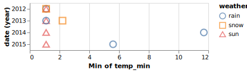

# Exploratory data analysis (EDA)

**Lecture learning goals**


By the end of the lecture you will be able to:

1. Visualize missing values.
2. Define what EDA is on a conceptual levels both for numerical and categorical variables.
3. Use repeated plot grids to investigate multiple data frame columns in the same plot.
4. Visualize correlations.
5. Visualize counts of categorical variables.
   :::


**Required activities**


Before class:

- [This 10 min video on EDA concepts](https://ubcca-my.sharepoint.com/:v:/g/personal/joel_ostblom_ubc_ca/ETctjEToFRlJr38d8jqcOHMBRnJFHLlY0JHKXYLrD8Brvw?e=oZ9b59).

After class:

- Review the lecture notes.
- [Interactive flow chart](https://www.data-to-viz.com/) for which visualization to choose. Not really anything to read, but go there to look around and bookmark it to use as a reference when needed throughout this course and others.

:::
::::

```python
import altair as alt
import pandas as pd

# Simplify working with large datasets in Altair
alt.data_transformers.enable('vegafusion')
alt.renderers.enable('svg')
```

    RendererRegistry.enable('svg')

## Missing values

### Py

First we are going to load in some weather data and simulate a faulty sensor by assigning some NaN values manually.

```python
from vega_datasets import data
import numpy as np


df = data.seattle_weather()
# Artifically introduce some NaNs to simulate a sensor that can't measure below freezing
df.loc[df['temp_min'] <= 0.6, 'temp_min'] = np.nan
df.loc[df['temp_max'] <= 0.6, 'temp_max'] = np.nan
df = df[df['weather'].isin(['rain', 'snow', 'sun'])]
df
```

<div>
<style scoped>
    .dataframe tbody tr th:only-of-type {
        vertical-align: middle;
    }

    .dataframe tbody tr th {
        vertical-align: top;
    }

    .dataframe thead th {
        text-align: right;
    }`</style>`

<table border="1" class="dataframe">
  <thead>
    <tr style="text-align: right;">
      <th></th>
      <th>date</th>
      <th>precipitation</th>
      <th>temp_max</th>
      <th>temp_min</th>
      <th>wind</th>
      <th>weather</th>
    </tr>
  </thead>
  <tbody>
    <tr>
      <th>1</th>
      <td>2012-01-02</td>
      <td>10.9</td>
      <td>10.6</td>
      <td>2.8</td>
      <td>4.5</td>
      <td>rain</td>
    </tr>
    <tr>
      <th>2</th>
      <td>2012-01-03</td>
      <td>0.8</td>
      <td>11.7</td>
      <td>7.2</td>
      <td>2.3</td>
      <td>rain</td>
    </tr>
    <tr>
      <th>3</th>
      <td>2012-01-04</td>
      <td>20.3</td>
      <td>12.2</td>
      <td>5.6</td>
      <td>4.7</td>
      <td>rain</td>
    </tr>
    <tr>
      <th>4</th>
      <td>2012-01-05</td>
      <td>1.3</td>
      <td>8.9</td>
      <td>2.8</td>
      <td>6.1</td>
      <td>rain</td>
    </tr>
    <tr>
      <th>5</th>
      <td>2012-01-06</td>
      <td>2.5</td>
      <td>4.4</td>
      <td>2.2</td>
      <td>2.2</td>
      <td>rain</td>
    </tr>
    <tr>
      <th>...</th>
      <td>...</td>
      <td>...</td>
      <td>...</td>
      <td>...</td>
      <td>...</td>
      <td>...</td>
    </tr>
    <tr>
      <th>1442</th>
      <td>2015-12-13</td>
      <td>1.3</td>
      <td>7.8</td>
      <td>6.1</td>
      <td>6.1</td>
      <td>sun</td>
    </tr>
    <tr>
      <th>1443</th>
      <td>2015-12-14</td>
      <td>0.0</td>
      <td>7.8</td>
      <td>1.7</td>
      <td>1.7</td>
      <td>sun</td>
    </tr>
    <tr>
      <th>1455</th>
      <td>2015-12-26</td>
      <td>0.0</td>
      <td>4.4</td>
      <td>NaN</td>
      <td>2.5</td>
      <td>sun</td>
    </tr>
    <tr>
      <th>1459</th>
      <td>2015-12-30</td>
      <td>0.0</td>
      <td>5.6</td>
      <td>NaN</td>
      <td>3.4</td>
      <td>sun</td>
    </tr>
    <tr>
      <th>1460</th>
      <td>2015-12-31</td>
      <td>0.0</td>
      <td>5.6</td>
      <td>NaN</td>
      <td>3.5</td>
      <td>sun</td>
    </tr>
  </tbody>
</table>
<p>996 rows × 6 columns</p>
</div>

If we were to visualize this data
in order to answer the the question
"what what the minimum temperature each year for the difference types of weather?"
it might look something like this:

```python
alt.Chart(df).mark_point(size=120, opacity=0.7).encode(
    y='year(date):N',
    x='min(temp_min)',
    color='weather',
    shape='weather'
)
```



One immediate drawback with this visualization is that there could be overlapping dots in the exact same spot
which make it difficult to see the exact values from each weather type.
This chart still reveals something peculiar about our data:
it looks like the dots are neatly arranged in a grid around the lowest temperature for each year.
Almost too neat... this might be due to some binning on the data or maybe that the resolution of the sensor is low.
There is also probably something going where the lowest values are clamped to just over one degree celsius,
that seems quite odd as we would expect some variation in the yearly minimum temperature as well.
This could be due to some error in how the data was pre-processed
or maybe that the sensor mechanics don't tolerate values under freezing
and it stops measuring during that time.

In general when we read in data,
it is a good idea to perform some EDA on the missing values before starting to do it on the rest of the data,
regardless of whether we have already observed a weird pattern or not.
`df.info()` can show us how many missing values there are,
but we don't get any info on their pattern.

```python
df.info()
```

    <class 'pandas.core.frame.DataFrame'>
    Index: 996 entries, 1 to 1460
    Data columns (total 6 columns):
     #   Column         Non-Null Count  Dtype
    ---  ------         --------------  -----
    0   date           996 non-null    datetime64[ns]
     1   precipitation  996 non-null    float64
    2   temp_max       991 non-null    float64
    3   temp_min       910 non-null    float64
    4   wind           996 non-null    float64
    5   weather        996 non-null    object
    dtypes: datetime64[ns](1), float64(4), object(1)
    memory usage: 54.5+ KB

To see if there is a pattern in the missing values,
the simplest we could do would be to use pandas built in styling functions.
This produces quite long output,
so I have truncated it here,
but if you were to scroll through it
you would see that there seems to be a periodicity to the data
and since this data set is ordered by the date the measurement was collected
it seems like this periodic variation is through time.

```python
df[:50].style.highlight_null()
```


| date | precipitation | temp_max | temp_min | wind | weather |
|------|---------------|----------|----------|------|----------|
| 2012-01-02 | 10.9 | 10.6 | 2.8 | 4.5 | rain |
| 2012-01-03 | 0.8 | 11.7 | 7.2 | 2.3 | rain |
| 2012-01-04 | 20.3 | 12.2 | 5.6 | 4.7 | rain |
| 2012-01-05 | 1.3 | 8.9 | 2.8 | 6.1 | rain |
| 2012-01-06 | 2.5 | 4.4 | 2.2 | 2.2 | rain |


We could create a more effective visualization of this using Altair,
but it would be a bit involved as you can see below.
The reason we are melting the data
is so that we can perform this viz for all the columns
since we don't know where the EDA values are when we do EDA.
If you are only interested in one column,
you could skip the melting part.

```python
alt.Chart(
    df.isna().reset_index().melt(
        id_vars='index'
    )
).mark_rect().encode(
    alt.X('index:O').axis(None),
    alt.Y('variable').title(None),
    alt.Color('value').title('NaN'),
    alt.Stroke('value')  # We set the stroke which is the outline of each rectangle in the heatmap
).properties(
    width=df.shape[0]
)
```


Aha! Here we can clearly see the periodic pattern in the data.
There is a predictable reoccurrence of the missing values.
Again,
remember that this data is ordered by time
even thought we are using the index when plotting it
to make sure this technique works with dataframe that do not have a date column.

We could explore what this patterns is due to
by sorting the data by another variable.
Let's test our hypothesis that the sensor
can't measure low temperatures.
If this is true,
we should see that all the temp_min values bunch up
to the left since this is also where the lowest temp_max temparatures are
(a day with a low max temperature is more likely to have a low min temperature).

```python
alt.Chart(
    df.sort_values(
        'temp_max',
        ignore_index=True
    ).isna().reset_index().melt(
        id_vars='index'
    )
).mark_rect().encode(
    alt.X('index:O').axis(None),
    alt.Y('variable').title(None),
    alt.Color('value').title('NaN'),
    alt.Stroke('value')
).properties(
    width=df.shape[0]
)
```


There does indeed seem like the missing values are related to low daily temperatures!
(to the far right you can see the values that are NaN for both the max and min temperature,
NaNs are sorted after all numerical values in pandas).

We could have used the sorting technique with the pandas styler as well:

```python
# Just showing the first 50 to save space
df.sort_values('temp_max')[:50].style.highlight_null()
```


<table id="T_fab31">
  <thead>
    <tr>
      <th class="blank level0" > </th>
      <th id="T_fab31_level0_col0" class="col_heading level0 col0" >date</th>
      <th id="T_fab31_level0_col1" class="col_heading level0 col1" >precipitation</th>
      <th id="T_fab31_level0_col2" class="col_heading level0 col2" >temp_max</th>
      <th id="T_fab31_level0_col3" class="col_heading level0 col3" >temp_min</th>
      <th id="T_fab31_level0_col4" class="col_heading level0 col4" >wind</th>
      <th id="T_fab31_level0_col5" class="col_heading level0 col5" >weather</th>
    </tr>
  </thead>
  <tbody>
    <tr>
      <th id="T_fab31_level0_row0" class="row_heading level0 row0" >708</th>
      <td id="T_fab31_row0_col0" class="data row0 col0" >2013-12-09 00:00:00</td>
      <td id="T_fab31_row0_col1" class="data row0 col1" >0.000000</td>
      <td id="T_fab31_row0_col2" class="data row0 col2" >1.100000</td>
      <td id="T_fab31_row0_col3" class="data row0 col3" >nan</td>
      <td id="T_fab31_row0_col4" class="data row0 col4" >1.300000</td>
      <td id="T_fab31_row0_col5" class="data row0 col5" >sun</td>
    </tr>
    <tr>
      <th id="T_fab31_level0_row1" class="row_heading level0 row1" >704</th>
      <td id="T_fab31_row1_col0" class="data row1 col0" >2013-12-05 00:00:00</td>
      <td id="T_fab31_row1_col1" class="data row1 col1" >0.000000</td>
      <td id="T_fab31_row1_col2" class="data row1 col2" >1.100000</td>
      <td id="T_fab31_row1_col3" class="data row1 col3" >nan</td>
      <td id="T_fab31_row1_col4" class="data row1 col4" >2.600000</td>
      <td id="T_fab31_row1_col5" class="data row1 col5" >sun</td>
    </tr>
    <tr>
      <th id="T_fab31_level0_row2" class="row_heading level0 row2" >705</th>
      <td id="T_fab31_row2_col0" class="data row2 col0" >2013-12-06 00:00:00</td>
      <td id="T_fab31_row2_col1" class="data row2 col1" >0.000000</td>
      <td id="T_fab31_row2_col2" class="data row2 col2" >1.100000</td>
      <td id="T_fab31_row2_col3" class="data row2 col3" >nan</td>
      <td id="T_fab31_row2_col4" class="data row2 col4" >4.700000</td>
      <td id="T_fab31_row2_col5" class="data row2 col5" >sun</td>
    </tr>
    <tr>
      <th id="T_fab31_level0_row3" class="row_heading level0 row3" >14</th>
      <td id="T_fab31_row3_col0" class="data row3 col0" >2012-01-15 00:00:00</td>
      <td id="T_fab31_row3_col1" class="data row3 col1" >5.300000</td>
      <td id="T_fab31_row3_col2" class="data row3 col2" >1.100000</td>
      <td id="T_fab31_row3_col3" class="data row3 col3" >nan</td>
      <td id="T_fab31_row3_col4" class="data row3 col4" >3.200000</td>
      <td id="T_fab31_row3_col5" class="data row3 col5" >snow</td>
    </tr>
    <tr>
      <th id="T_fab31_level0_row4" class="row_heading level0 row4" >15</th>
      <td id="T_fab31_row4_col0" class="data row4 col0" >2012-01-16 00:00:00</td>
      <td id="T_fab31_row4_col1" class="data row4 col1" >2.500000</td>
      <td id="T_fab31_row4_col2" class="data row4 col2" >1.700000</td>
      <td id="T_fab31_row4_col3" class="data row4 col3" >nan</td>
      <td id="T_fab31_row4_col4" class="data row4 col4" >5.000000</td>
      <td id="T_fab31_row4_col5" class="data row4 col5" >snow</td>
    </tr>
    <tr>
      <th id="T_fab31_level0_row5" class="row_heading level0 row5" >378</th>
      <td id="T_fab31_row5_col0" class="data row5 col0" >2013-01-13 00:00:00</td>
      <td id="T_fab31_row5_col1" class="data row5 col1" >0.000000</td>
      <td id="T_fab31_row5_col2" class="data row5 col2" >2.200000</td>
      <td id="T_fab31_row5_col3" class="data row5 col3" >nan</td>
      <td id="T_fab31_row5_col4" class="data row5 col4" >1.500000</td>
      <td id="T_fab31_row5_col5" class="data row5 col5" >sun</td>
    </tr>
    <tr>
      <th id="T_fab31_level0_row6" class="row_heading level0 row6" >707</th>
      <td id="T_fab31_row6_col0" class="data row6 col0" >2013-12-08 00:00:00</td>
      <td id="T_fab31_row6_col1" class="data row6 col1" >0.000000</td>
      <td id="T_fab31_row6_col2" class="data row6 col2" >2.200000</td>
      <td id="T_fab31_row6_col3" class="data row6 col3" >nan</td>
      <td id="T_fab31_row6_col4" class="data row6 col4" >2.200000</td>
      <td id="T_fab31_row6_col5" class="data row6 col5" >sun</td>
    </tr>
    <tr>
      <th id="T_fab31_level0_row7" class="row_heading level0 row7" >765</th>
      <td id="T_fab31_row7_col0" class="data row7 col0" >2014-02-04 00:00:00</td>
      <td id="T_fab31_row7_col1" class="data row7 col1" >0.000000</td>
      <td id="T_fab31_row7_col2" class="data row7 col2" >2.800000</td>
      <td id="T_fab31_row7_col3" class="data row7 col3" >nan</td>
      <td id="T_fab31_row7_col4" class="data row7 col4" >4.700000</td>
      <td id="T_fab31_row7_col5" class="data row7 col5" >sun</td>
    </tr>
    <tr>
      <th id="T_fab31_level0_row8" class="row_heading level0 row8" >377</th>
      <td id="T_fab31_row8_col0" class="data row8 col0" >2013-01-12 00:00:00</td>
      <td id="T_fab31_row8_col1" class="data row8 col1" >0.000000</td>
      <td id="T_fab31_row8_col2" class="data row8 col2" >2.800000</td>
      <td id="T_fab31_row8_col3" class="data row8 col3" >nan</td>
      <td id="T_fab31_row8_col4" class="data row8 col4" >2.000000</td>
      <td id="T_fab31_row8_col5" class="data row8 col5" >sun</td>
    </tr>
    <tr>
      <th id="T_fab31_level0_row9" class="row_heading level0 row9" >1064</th>
      <td id="T_fab31_row9_col0" class="data row9 col0" >2014-11-30 00:00:00</td>
      <td id="T_fab31_row9_col1" class="data row9 col1" >0.000000</td>
      <td id="T_fab31_row9_col2" class="data row9 col2" >2.800000</td>
      <td id="T_fab31_row9_col3" class="data row9 col3" >nan</td>
      <td id="T_fab31_row9_col4" class="data row9 col4" >4.400000</td>
      <td id="T_fab31_row9_col5" class="data row9 col5" >sun</td>
    </tr>
    <tr>
      <th id="T_fab31_level0_row10" class="row_heading level0 row10" >1095</th>
      <td id="T_fab31_row10_col0" class="data row10 col0" >2014-12-31 00:00:00</td>
      <td id="T_fab31_row10_col1" class="data row10 col1" >0.000000</td>
      <td id="T_fab31_row10_col2" class="data row10 col2" >3.300000</td>
      <td id="T_fab31_row10_col3" class="data row10 col3" >nan</td>
      <td id="T_fab31_row10_col4" class="data row10 col4" >3.000000</td>
      <td id="T_fab31_row10_col5" class="data row10 col5" >sun</td>
    </tr>
    <tr>
      <th id="T_fab31_level0_row11" class="row_heading level0 row11" >1094</th>
      <td id="T_fab31_row11_col0" class="data row11 col0" >2014-12-30 00:00:00</td>
      <td id="T_fab31_row11_col1" class="data row11 col1" >0.000000</td>
      <td id="T_fab31_row11_col2" class="data row11 col2" >3.300000</td>
      <td id="T_fab31_row11_col3" class="data row11 col3" >nan</td>
      <td id="T_fab31_row11_col4" class="data row11 col4" >3.600000</td>
      <td id="T_fab31_row11_col5" class="data row11 col5" >sun</td>
    </tr>
    <tr>
      <th id="T_fab31_level0_row12" class="row_heading level0 row12" >375</th>
      <td id="T_fab31_row12_col0" class="data row12 col0" >2013-01-10 00:00:00</td>
      <td id="T_fab31_row12_col1" class="data row12 col1" >0.300000</td>
      <td id="T_fab31_row12_col2" class="data row12 col2" >3.300000</td>
      <td id="T_fab31_row12_col3" class="data row12 col3" >nan</td>
      <td id="T_fab31_row12_col4" class="data row12 col4" >2.100000</td>
      <td id="T_fab31_row12_col5" class="data row12 col5" >snow</td>
    </tr>
    <tr>
      <th id="T_fab31_level0_row13" class="row_heading level0 row13" >379</th>
      <td id="T_fab31_row13_col0" class="data row13 col0" >2013-01-14 00:00:00</td>
      <td id="T_fab31_row13_col1" class="data row13 col1" >0.000000</td>
      <td id="T_fab31_row13_col2" class="data row13 col2" >3.300000</td>
      <td id="T_fab31_row13_col3" class="data row13 col3" >nan</td>
      <td id="T_fab31_row13_col4" class="data row13 col4" >1.300000</td>
      <td id="T_fab31_row13_col5" class="data row13 col5" >sun</td>
    </tr>
    <tr>
      <th id="T_fab31_level0_row14" class="row_heading level0 row14" >768</th>
      <td id="T_fab31_row14_col0" class="data row14 col0" >2014-02-07 00:00:00</td>
      <td id="T_fab31_row14_col1" class="data row14 col1" >0.000000</td>
      <td id="T_fab31_row14_col2" class="data row14 col2" >3.300000</td>
      <td id="T_fab31_row14_col3" class="data row14 col3" >nan</td>
      <td id="T_fab31_row14_col4" class="data row14 col4" >4.200000</td>
      <td id="T_fab31_row14_col5" class="data row14 col5" >sun</td>
    </tr>
    <tr>
      <th id="T_fab31_level0_row15" class="row_heading level0 row15" >16</th>
      <td id="T_fab31_row15_col0" class="data row15 col0" >2012-01-17 00:00:00</td>
      <td id="T_fab31_row15_col1" class="data row15 col1" >8.100000</td>
      <td id="T_fab31_row15_col2" class="data row15 col2" >3.300000</td>
      <td id="T_fab31_row15_col3" class="data row15 col3" >nan</td>
      <td id="T_fab31_row15_col4" class="data row15 col4" >5.600000</td>
      <td id="T_fab31_row15_col5" class="data row15 col5" >snow</td>
    </tr>
    <tr>
      <th id="T_fab31_level0_row16" class="row_heading level0 row16" >352</th>
      <td id="T_fab31_row16_col0" class="data row16 col0" >2012-12-18 00:00:00</td>
      <td id="T_fab31_row16_col1" class="data row16 col1" >3.300000</td>
      <td id="T_fab31_row16_col2" class="data row16 col2" >3.900000</td>
      <td id="T_fab31_row16_col3" class="data row16 col3" >nan</td>
      <td id="T_fab31_row16_col4" class="data row16 col4" >5.300000</td>
      <td id="T_fab31_row16_col5" class="data row16 col5" >snow</td>
    </tr>
    <tr>
      <th id="T_fab31_level0_row17" class="row_heading level0 row17" >5</th>
      <td id="T_fab31_row17_col0" class="data row17 col0" >2012-01-06 00:00:00</td>
      <td id="T_fab31_row17_col1" class="data row17 col1" >2.500000</td>
      <td id="T_fab31_row17_col2" class="data row17 col2" >4.400000</td>
      <td id="T_fab31_row17_col3" class="data row17 col3" >2.200000</td>
      <td id="T_fab31_row17_col4" class="data row17 col4" >2.200000</td>
      <td id="T_fab31_row17_col5" class="data row17 col5" >rain</td>
    </tr>
    <tr>
      <th id="T_fab31_level0_row18" class="row_heading level0 row18" >349</th>
      <td id="T_fab31_row18_col0" class="data row18 col0" >2012-12-15 00:00:00</td>
      <td id="T_fab31_row18_col1" class="data row18 col1" >5.300000</td>
      <td id="T_fab31_row18_col2" class="data row18 col2" >4.400000</td>
      <td id="T_fab31_row18_col3" class="data row18 col3" >nan</td>
      <td id="T_fab31_row18_col4" class="data row18 col4" >5.100000</td>
      <td id="T_fab31_row18_col5" class="data row18 col5" >snow</td>
    </tr>
    <tr>
      <th id="T_fab31_level0_row19" class="row_heading level0 row19" >1455</th>
      <td id="T_fab31_row19_col0" class="data row19 col0" >2015-12-26 00:00:00</td>
      <td id="T_fab31_row19_col1" class="data row19 col1" >0.000000</td>
      <td id="T_fab31_row19_col2" class="data row19 col2" >4.400000</td>
      <td id="T_fab31_row19_col3" class="data row19 col3" >nan</td>
      <td id="T_fab31_row19_col4" class="data row19 col4" >2.500000</td>
      <td id="T_fab31_row19_col5" class="data row19 col5" >sun</td>
    </tr>
    <tr>
      <th id="T_fab31_level0_row20" class="row_heading level0 row20" >13</th>
      <td id="T_fab31_row20_col0" class="data row20 col0" >2012-01-14 00:00:00</td>
      <td id="T_fab31_row20_col1" class="data row20 col1" >4.100000</td>
      <td id="T_fab31_row20_col2" class="data row20 col2" >4.400000</td>
      <td id="T_fab31_row20_col3" class="data row20 col3" >nan</td>
      <td id="T_fab31_row20_col4" class="data row20 col4" >5.300000</td>
      <td id="T_fab31_row20_col5" class="data row20 col5" >snow</td>
    </tr>
    <tr>
      <th id="T_fab31_level0_row21" class="row_heading level0 row21" >1065</th>
      <td id="T_fab31_row21_col0" class="data row21 col0" >2014-12-01 00:00:00</td>
      <td id="T_fab31_row21_col1" class="data row21 col1" >0.000000</td>
      <td id="T_fab31_row21_col2" class="data row21 col2" >4.400000</td>
      <td id="T_fab31_row21_col3" class="data row21 col3" >nan</td>
      <td id="T_fab31_row21_col4" class="data row21 col4" >2.200000</td>
      <td id="T_fab31_row21_col5" class="data row21 col5" >sun</td>
    </tr>
    <tr>
      <th id="T_fab31_level0_row22" class="row_heading level0 row22" >703</th>
      <td id="T_fab31_row22_col0" class="data row22 col0" >2013-12-04 00:00:00</td>
      <td id="T_fab31_row22_col1" class="data row22 col1" >0.000000</td>
      <td id="T_fab31_row22_col2" class="data row22 col2" >4.400000</td>
      <td id="T_fab31_row22_col3" class="data row22 col3" >nan</td>
      <td id="T_fab31_row22_col4" class="data row22 col4" >1.600000</td>
      <td id="T_fab31_row22_col5" class="data row22 col5" >sun</td>
    </tr>
    <tr>
      <th id="T_fab31_level0_row23" class="row_heading level0 row23" >59</th>
      <td id="T_fab31_row23_col0" class="data row23 col0" >2012-02-29 00:00:00</td>
      <td id="T_fab31_row23_col1" class="data row23 col1" >0.800000</td>
      <td id="T_fab31_row23_col2" class="data row23 col2" >5.000000</td>
      <td id="T_fab31_row23_col3" class="data row23 col3" >1.100000</td>
      <td id="T_fab31_row23_col4" class="data row23 col4" >7.000000</td>
      <td id="T_fab31_row23_col5" class="data row23 col5" >snow</td>
    </tr>
    <tr>
      <th id="T_fab31_level0_row24" class="row_heading level0 row24" >718</th>
      <td id="T_fab31_row24_col0" class="data row24 col0" >2013-12-19 00:00:00</td>
      <td id="T_fab31_row24_col1" class="data row24 col1" >0.000000</td>
      <td id="T_fab31_row24_col2" class="data row24 col2" >5.000000</td>
      <td id="T_fab31_row24_col3" class="data row24 col3" >nan</td>
      <td id="T_fab31_row24_col4" class="data row24 col4" >2.100000</td>
      <td id="T_fab31_row24_col5" class="data row24 col5" >sun</td>
    </tr>
    <tr>
      <th id="T_fab31_level0_row25" class="row_heading level0 row25" >56</th>
      <td id="T_fab31_row25_col0" class="data row25 col0" >2012-02-26 00:00:00</td>
      <td id="T_fab31_row25_col1" class="data row25 col1" >1.300000</td>
      <td id="T_fab31_row25_col2" class="data row25 col2" >5.000000</td>
      <td id="T_fab31_row25_col3" class="data row25 col3" >nan</td>
      <td id="T_fab31_row25_col4" class="data row25 col4" >3.400000</td>
      <td id="T_fab31_row25_col5" class="data row25 col5" >snow</td>
    </tr>
    <tr>
      <th id="T_fab31_level0_row26" class="row_heading level0 row26" >363</th>
      <td id="T_fab31_row26_col0" class="data row26 col0" >2012-12-29 00:00:00</td>
      <td id="T_fab31_row26_col1" class="data row26 col1" >1.500000</td>
      <td id="T_fab31_row26_col2" class="data row26 col2" >5.000000</td>
      <td id="T_fab31_row26_col3" class="data row26 col3" >3.300000</td>
      <td id="T_fab31_row26_col4" class="data row26 col4" >1.700000</td>
      <td id="T_fab31_row26_col5" class="data row26 col5" >rain</td>
    </tr>
    <tr>
      <th id="T_fab31_level0_row27" class="row_heading level0 row27" >702</th>
      <td id="T_fab31_row27_col0" class="data row27 col0" >2013-12-03 00:00:00</td>
      <td id="T_fab31_row27_col1" class="data row27 col1" >0.000000</td>
      <td id="T_fab31_row27_col2" class="data row27 col2" >5.000000</td>
      <td id="T_fab31_row27_col3" class="data row27 col3" >nan</td>
      <td id="T_fab31_row27_col4" class="data row27 col4" >5.600000</td>
      <td id="T_fab31_row27_col5" class="data row27 col5" >sun</td>
    </tr>
    <tr>
      <th id="T_fab31_level0_row28" class="row_heading level0 row28" >710</th>
      <td id="T_fab31_row28_col0" class="data row28 col0" >2013-12-11 00:00:00</td>
      <td id="T_fab31_row28_col1" class="data row28 col1" >0.000000</td>
      <td id="T_fab31_row28_col2" class="data row28 col2" >5.000000</td>
      <td id="T_fab31_row28_col3" class="data row28 col3" >nan</td>
      <td id="T_fab31_row28_col4" class="data row28 col4" >0.800000</td>
      <td id="T_fab31_row28_col5" class="data row28 col5" >sun</td>
    </tr>
    <tr>
      <th id="T_fab31_level0_row29" class="row_heading level0 row29" >12</th>
      <td id="T_fab31_row29_col0" class="data row29 col0" >2012-01-13 00:00:00</td>
      <td id="T_fab31_row29_col1" class="data row29 col1" >0.000000</td>
      <td id="T_fab31_row29_col2" class="data row29 col2" >5.000000</td>
      <td id="T_fab31_row29_col3" class="data row29 col3" >nan</td>
      <td id="T_fab31_row29_col4" class="data row29 col4" >1.300000</td>
      <td id="T_fab31_row29_col5" class="data row29 col5" >sun</td>
    </tr>
    <tr>
      <th id="T_fab31_level0_row30" class="row_heading level0 row30" >764</th>
      <td id="T_fab31_row30_col0" class="data row30 col0" >2014-02-03 00:00:00</td>
      <td id="T_fab31_row30_col1" class="data row30 col1" >0.000000</td>
      <td id="T_fab31_row30_col2" class="data row30 col2" >5.000000</td>
      <td id="T_fab31_row30_col3" class="data row30 col3" >nan</td>
      <td id="T_fab31_row30_col4" class="data row30 col4" >4.300000</td>
      <td id="T_fab31_row30_col5" class="data row30 col5" >sun</td>
    </tr>
    <tr>
      <th id="T_fab31_level0_row31" class="row_heading level0 row31" >77</th>
      <td id="T_fab31_row31_col0" class="data row31 col0" >2012-03-18 00:00:00</td>
      <td id="T_fab31_row31_col1" class="data row31 col1" >3.600000</td>
      <td id="T_fab31_row31_col2" class="data row31 col2" >5.000000</td>
      <td id="T_fab31_row31_col3" class="data row31 col3" >nan</td>
      <td id="T_fab31_row31_col4" class="data row31 col4" >2.700000</td>
      <td id="T_fab31_row31_col5" class="data row31 col5" >rain</td>
    </tr>
    <tr>
      <th id="T_fab31_level0_row32" class="row_heading level0 row32" >366</th>
      <td id="T_fab31_row32_col0" class="data row32 col0" >2013-01-01 00:00:00</td>
      <td id="T_fab31_row32_col1" class="data row32 col1" >0.000000</td>
      <td id="T_fab31_row32_col2" class="data row32 col2" >5.000000</td>
      <td id="T_fab31_row32_col3" class="data row32 col3" >nan</td>
      <td id="T_fab31_row32_col4" class="data row32 col4" >2.700000</td>
      <td id="T_fab31_row32_col5" class="data row32 col5" >sun</td>
    </tr>
    <tr>
      <th id="T_fab31_level0_row33" class="row_heading level0 row33" >392</th>
      <td id="T_fab31_row33_col0" class="data row33 col0" >2013-01-27 00:00:00</td>
      <td id="T_fab31_row33_col1" class="data row33 col1" >1.800000</td>
      <td id="T_fab31_row33_col2" class="data row33 col2" >5.600000</td>
      <td id="T_fab31_row33_col3" class="data row33 col3" >3.900000</td>
      <td id="T_fab31_row33_col4" class="data row33 col4" >4.500000</td>
      <td id="T_fab31_row33_col5" class="data row33 col5" >rain</td>
    </tr>
    <tr>
      <th id="T_fab31_level0_row34" class="row_heading level0 row34" >709</th>
      <td id="T_fab31_row34_col0" class="data row34 col0" >2013-12-10 00:00:00</td>
      <td id="T_fab31_row34_col1" class="data row34 col1" >0.000000</td>
      <td id="T_fab31_row34_col2" class="data row34 col2" >5.600000</td>
      <td id="T_fab31_row34_col3" class="data row34 col3" >nan</td>
      <td id="T_fab31_row34_col4" class="data row34 col4" >1.500000</td>
      <td id="T_fab31_row34_col5" class="data row34 col5" >sun</td>
    </tr>
    <tr>
      <th id="T_fab31_level0_row35" class="row_heading level0 row35" >711</th>
      <td id="T_fab31_row35_col0" class="data row35 col0" >2013-12-12 00:00:00</td>
      <td id="T_fab31_row35_col1" class="data row35 col1" >6.900000</td>
      <td id="T_fab31_row35_col2" class="data row35 col2" >5.600000</td>
      <td id="T_fab31_row35_col3" class="data row35 col3" >nan</td>
      <td id="T_fab31_row35_col4" class="data row35 col4" >2.300000</td>
      <td id="T_fab31_row35_col5" class="data row35 col5" >sun</td>
    </tr>
    <tr>
      <th id="T_fab31_level0_row36" class="row_heading level0 row36" >359</th>
      <td id="T_fab31_row36_col0" class="data row36 col0" >2012-12-25 00:00:00</td>
      <td id="T_fab31_row36_col1" class="data row36 col1" >13.500000</td>
      <td id="T_fab31_row36_col2" class="data row36 col2" >5.600000</td>
      <td id="T_fab31_row36_col3" class="data row36 col3" >2.800000</td>
      <td id="T_fab31_row36_col4" class="data row36 col4" >4.200000</td>
      <td id="T_fab31_row36_col5" class="data row36 col5" >snow</td>
    </tr>
    <tr>
      <th id="T_fab31_level0_row37" class="row_heading level0 row37" >358</th>
      <td id="T_fab31_row37_col0" class="data row37 col0" >2012-12-24 00:00:00</td>
      <td id="T_fab31_row37_col1" class="data row37 col1" >0.300000</td>
      <td id="T_fab31_row37_col2" class="data row37 col2" >5.600000</td>
      <td id="T_fab31_row37_col3" class="data row37 col3" >2.800000</td>
      <td id="T_fab31_row37_col4" class="data row37 col4" >2.800000</td>
      <td id="T_fab31_row37_col5" class="data row37 col5" >rain</td>
    </tr>
    <tr>
      <th id="T_fab31_level0_row38" class="row_heading level0 row38" >1459</th>
      <td id="T_fab31_row38_col0" class="data row38 col0" >2015-12-30 00:00:00</td>
      <td id="T_fab31_row38_col1" class="data row38 col1" >0.000000</td>
      <td id="T_fab31_row38_col2" class="data row38 col2" >5.600000</td>
      <td id="T_fab31_row38_col3" class="data row38 col3" >nan</td>
      <td id="T_fab31_row38_col4" class="data row38 col4" >3.400000</td>
      <td id="T_fab31_row38_col5" class="data row38 col5" >sun</td>
    </tr>
    <tr>
      <th id="T_fab31_level0_row39" class="row_heading level0 row39" >1460</th>
      <td id="T_fab31_row39_col0" class="data row39 col0" >2015-12-31 00:00:00</td>
      <td id="T_fab31_row39_col1" class="data row39 col1" >0.000000</td>
      <td id="T_fab31_row39_col2" class="data row39 col2" >5.600000</td>
      <td id="T_fab31_row39_col3" class="data row39 col3" >nan</td>
      <td id="T_fab31_row39_col4" class="data row39 col4" >3.500000</td>
      <td id="T_fab31_row39_col5" class="data row39 col5" >sun</td>
    </tr>
    <tr>
      <th id="T_fab31_level0_row40" class="row_heading level0 row40" >72</th>
      <td id="T_fab31_row40_col0" class="data row40 col0" >2012-03-13 00:00:00</td>
      <td id="T_fab31_row40_col1" class="data row40 col1" >9.400000</td>
      <td id="T_fab31_row40_col2" class="data row40 col2" >5.600000</td>
      <td id="T_fab31_row40_col3" class="data row40 col3" >nan</td>
      <td id="T_fab31_row40_col4" class="data row40 col4" >5.300000</td>
      <td id="T_fab31_row40_col5" class="data row40 col5" >snow</td>
    </tr>
    <tr>
      <th id="T_fab31_level0_row41" class="row_heading level0 row41" >1096</th>
      <td id="T_fab31_row41_col0" class="data row41 col0" >2015-01-01 00:00:00</td>
      <td id="T_fab31_row41_col1" class="data row41 col1" >0.000000</td>
      <td id="T_fab31_row41_col2" class="data row41 col2" >5.600000</td>
      <td id="T_fab31_row41_col3" class="data row41 col3" >nan</td>
      <td id="T_fab31_row41_col4" class="data row41 col4" >1.200000</td>
      <td id="T_fab31_row41_col5" class="data row41 col5" >sun</td>
    </tr>
    <tr>
      <th id="T_fab31_level0_row42" class="row_heading level0 row42" >747</th>
      <td id="T_fab31_row42_col0" class="data row42 col0" >2014-01-17 00:00:00</td>
      <td id="T_fab31_row42_col1" class="data row42 col1" >0.000000</td>
      <td id="T_fab31_row42_col2" class="data row42 col2" >5.600000</td>
      <td id="T_fab31_row42_col3" class="data row42 col3" >2.800000</td>
      <td id="T_fab31_row42_col4" class="data row42 col4" >2.300000</td>
      <td id="T_fab31_row42_col5" class="data row42 col5" >sun</td>
    </tr>
    <tr>
      <th id="T_fab31_level0_row43" class="row_heading level0 row43" >749</th>
      <td id="T_fab31_row43_col0" class="data row43 col0" >2014-01-19 00:00:00</td>
      <td id="T_fab31_row43_col1" class="data row43 col1" >0.000000</td>
      <td id="T_fab31_row43_col2" class="data row43 col2" >6.100000</td>
      <td id="T_fab31_row43_col3" class="data row43 col3" >3.300000</td>
      <td id="T_fab31_row43_col4" class="data row43 col4" >2.500000</td>
      <td id="T_fab31_row43_col5" class="data row43 col5" >sun</td>
    </tr>
    <tr>
      <th id="T_fab31_level0_row44" class="row_heading level0 row44" >60</th>
      <td id="T_fab31_row44_col0" class="data row44 col0" >2012-03-01 00:00:00</td>
      <td id="T_fab31_row44_col1" class="data row44 col1" >0.000000</td>
      <td id="T_fab31_row44_col2" class="data row44 col2" >6.100000</td>
      <td id="T_fab31_row44_col3" class="data row44 col3" >1.100000</td>
      <td id="T_fab31_row44_col4" class="data row44 col4" >3.100000</td>
      <td id="T_fab31_row44_col5" class="data row44 col5" >sun</td>
    </tr>
    <tr>
      <th id="T_fab31_level0_row45" class="row_heading level0 row45" >348</th>
      <td id="T_fab31_row45_col0" class="data row45 col0" >2012-12-14 00:00:00</td>
      <td id="T_fab31_row45_col1" class="data row45 col1" >7.900000</td>
      <td id="T_fab31_row45_col2" class="data row45 col2" >6.100000</td>
      <td id="T_fab31_row45_col3" class="data row45 col3" >1.100000</td>
      <td id="T_fab31_row45_col4" class="data row45 col4" >1.700000</td>
      <td id="T_fab31_row45_col5" class="data row45 col5" >rain</td>
    </tr>
    <tr>
      <th id="T_fab31_level0_row46" class="row_heading level0 row46" >10</th>
      <td id="T_fab31_row46_col0" class="data row46 col0" >2012-01-11 00:00:00</td>
      <td id="T_fab31_row46_col1" class="data row46 col1" >0.000000</td>
      <td id="T_fab31_row46_col2" class="data row46 col2" >6.100000</td>
      <td id="T_fab31_row46_col3" class="data row46 col3" >nan</td>
      <td id="T_fab31_row46_col4" class="data row46 col4" >5.100000</td>
      <td id="T_fab31_row46_col5" class="data row46 col5" >sun</td>
    </tr>
    <tr>
      <th id="T_fab31_level0_row47" class="row_heading level0 row47" >367</th>
      <td id="T_fab31_row47_col0" class="data row47 col0" >2013-01-02 00:00:00</td>
      <td id="T_fab31_row47_col1" class="data row47 col1" >0.000000</td>
      <td id="T_fab31_row47_col2" class="data row47 col2" >6.100000</td>
      <td id="T_fab31_row47_col3" class="data row47 col3" >nan</td>
      <td id="T_fab31_row47_col4" class="data row47 col4" >3.200000</td>
      <td id="T_fab31_row47_col5" class="data row47 col5" >sun</td>
    </tr>
    <tr>
      <th id="T_fab31_level0_row48" class="row_heading level0 row48" >11</th>
      <td id="T_fab31_row48_col0" class="data row48 col0" >2012-01-12 00:00:00</td>
      <td id="T_fab31_row48_col1" class="data row48 col1" >0.000000</td>
      <td id="T_fab31_row48_col2" class="data row48 col2" >6.100000</td>
      <td id="T_fab31_row48_col3" class="data row48 col3" >nan</td>
      <td id="T_fab31_row48_col4" class="data row48 col4" >1.900000</td>
      <td id="T_fab31_row48_col5" class="data row48 col5" >sun</td>
    </tr>
    <tr>
      <th id="T_fab31_level0_row49" class="row_heading level0 row49" >393</th>
      <td id="T_fab31_row49_col0" class="data row49 col0" >2013-01-28 00:00:00</td>
      <td id="T_fab31_row49_col1" class="data row49 col1" >7.900000</td>
      <td id="T_fab31_row49_col2" class="data row49 col2" >6.100000</td>
      <td id="T_fab31_row49_col3" class="data row49 col3" >3.300000</td>
      <td id="T_fab31_row49_col4" class="data row49 col4" >3.200000</td>
      <td id="T_fab31_row49_col5" class="data row49 col5" >rain</td>
    </tr>
  </tbody>
</table>

The missing values in our case were directly related to the column itself,
low `temp_min` values meant that they were missing.
Values could also be missing seemingly randomly,
or depending on another column in the data frame.
These three types of missing values are sometimes called:

- Missing not at random - Depends on the value in the column itself
- Missing at random - Depends on the value in another column
- Missing completely at random - Doesn't seem to depend on any other *measured* variable

The underlying reasons for missing values can be quite domain specific,
e.g. a medical doctor might be missing blood pressure measurements for younger adults
than for older adults since that information might be more valuable for older people.
In this case we would say that the values are missing at random
since there is no relation between the actual blood pressure reading and whether a value goes missing
but there is a relation to the patients age
which would be another variable in our dataset
(it is more important you remember these principles than memorizing the exact names).
There are [more discussion of these concepts in this article](https://www.ncbi.nlm.nih.gov/pmc/articles/PMC4121561/).

### R

There is no styler function in dplyer like in pandas,
so we will go straight to showing a summary and creating the heatmap:

```python
%load_ext rpy2.ipython
```

    The rpy2.ipython extension is already loaded. To reload it, use:
      %reload_ext rpy2.ipython

```r
%%R -i df
library(tidyverse)

df |> glimpse()
```

    Rows: 996
    Columns: 6
    $ date`<dttm>` 2012-01-02, 2012-01-03, 2012-01-04, 2012-01-05, 2012-01…
    $ precipitation `<dbl>` 10.9, 0.8, 20.3, 1.3, 2.5, 0.0, 0.0, 4.3, 1.0, 0.0, 0.0,…
    $ temp_max      `<dbl>` 10.6, 11.7, 12.2, 8.9, 4.4, 7.2, 10.0, 9.4, 6.1, 6.1, 6.…
    $ temp_min      `<dbl>` 2.8, 7.2, 5.6, 2.8, 2.2, 2.8, 2.8, 5.0, NaN, NaN, NaN, N…
    $ wind          `<dbl>` 4.5, 2.3, 4.7, 6.1, 2.2, 2.3, 2.0, 3.4, 3.4, 5.1, 1.9, 1…
    $ weather       `<chr>` "rain", "rain", "rain", "rain", "rain", "rain", "sun", "…

There is no overview of NAs in `glimpse`,
instead we can see the NAs in `summary`:

```r
%%R
df |> summary()
```

    date                     precipitation       temp_max
    Min.   :2012-01-02 00:00:00   Min.   : 0.000   Min.   : 1.10
    1st Qu.:2012-10-03 18:00:00   1st Qu.: 0.000   1st Qu.:10.60
    Median :2013-08-05 12:00:00   Median : 0.000   Median :17.20
    Mean   :2013-09-27 05:04:38   Mean   : 1.776   Mean   :17.37
    3rd Qu.:2014-08-19 06:00:00   3rd Qu.: 0.800   3rd Qu.:23.60
    Max.   :2015-12-31 00:00:00   Max.   :54.100   Max.   :35.60
    NA's   :5
    temp_min           wind       weather
    Min.   : 1.100   Min.   :0.4   Length:996
    1st Qu.: 5.600   1st Qu.:2.3   Class :character
    Median : 9.400   Median :3.0   Mode  :character
    Mean   : 9.294   Mean   :3.2
    3rd Qu.:13.300   3rd Qu.:3.9
    Max.   :18.300   Max.   :9.5
    NA's   :86

We use the same strategy to visualize NaNs in ggplot as in Altair
where we first pivot_longer the dataframe:

```r
%%R -w 1200
theme_set(theme_gray(base_size = 20))

df |>
    map_df(is.na) |>
    mutate(index = row_number()) |>
    pivot_longer(-index) |>
    ggplot(aes(x = index, y = name, fill = value)) +
        geom_raster() +
        labs(y = '', fill = 'NaN')
```


Sorted by max temp:

```r
%%R -w 1200
theme_set(theme_gray(base_size = 20))

df |>
    arrange(temp_max) |>
    map_df(is.na) |>
    mutate(index = row_number()) |>
    pivot_longer(-index) |>
    ggplot(aes(x = index, y = name, fill = value)) +
        geom_raster() +
        labs(y = '', fill = 'NaN')
```


## Repeating the same plots for multiple dataframe columns

### Py

Previously we have made subplots via faceting,
which creates one subplot per unique value in a categorical column
and displays the same numerical columns in all the subplots/facets.
This view of multiple subsets in the data
is often called a trellis plot or plot of small multiples.
Here,
we will see how we can create subplots that each display all the data points,
but is repeated for different columns in the data.

We specify which columns we want to use via the `.repeat` method,
and where we want to use them via `alt.repeat`.
For this plot,
we keep the y-axis constant,
and repeat the plot for different x-axis columns.

```python
url = 'https://raw.githubusercontent.com/joelostblom/teaching-datasets/main/movies.json'
movies = pd.read_json(url)[['runtime', 'budget', 'revenue', 'genres', 'countries']]
movies
```

<div>
<style scoped>
    .dataframe tbody tr th:only-of-type {
        vertical-align: middle;
    }

    .dataframe tbody tr th {
        vertical-align: top;
    }

    .dataframe thead th {
        text-align: right;
    }`</style>`

<table border="1" class="dataframe">
  <thead>
    <tr style="text-align: right;">
      <th></th>
      <th>runtime</th>
      <th>budget</th>
      <th>revenue</th>
      <th>genres</th>
      <th>countries</th>
    </tr>
  </thead>
  <tbody>
    <tr>
      <th>0</th>
      <td>100</td>
      <td>94000000</td>
      <td>940335536</td>
      <td>[Animation]</td>
      <td>[United States of America]</td>
    </tr>
    <tr>
      <th>1</th>
      <td>143</td>
      <td>140000000</td>
      <td>655011224</td>
      <td>[Fantasy]</td>
      <td>[United States of America]</td>
    </tr>
    <tr>
      <th>2</th>
      <td>87</td>
      <td>75000000</td>
      <td>527068851</td>
      <td>[Animation]</td>
      <td>[United States of America]</td>
    </tr>
    <tr>
      <th>3</th>
      <td>151</td>
      <td>200000000</td>
      <td>1065659812</td>
      <td>[Fantasy]</td>
      <td>[United States of America]</td>
    </tr>
    <tr>
      <th>4</th>
      <td>106</td>
      <td>70000000</td>
      <td>101371017</td>
      <td>[Fantasy]</td>
      <td>[United States of America]</td>
    </tr>
    <tr>
      <th>...</th>
      <td>...</td>
      <td>...</td>
      <td>...</td>
      <td>...</td>
      <td>...</td>
    </tr>
    <tr>
      <th>675</th>
      <td>107</td>
      <td>100000000</td>
      <td>519876949</td>
      <td>[History]</td>
      <td>[United Kingdom, United States of America]</td>
    </tr>
    <tr>
      <th>676</th>
      <td>86</td>
      <td>50000000</td>
      <td>66913939</td>
      <td>[Animation]</td>
      <td>[United States of America]</td>
    </tr>
    <tr>
      <th>677</th>
      <td>100</td>
      <td>22000000</td>
      <td>194647323</td>
      <td>[Fantasy]</td>
      <td>[United States of America]</td>
    </tr>
    <tr>
      <th>678</th>
      <td>72</td>
      <td>3500000</td>
      <td>3775000</td>
      <td>[Animation]</td>
      <td>[United States of America]</td>
    </tr>
    <tr>
      <th>679</th>
      <td>109</td>
      <td>10000000</td>
      <td>4073489</td>
      <td>[History]</td>
      <td>[United Kingdom, United States of America]</td>
    </tr>
  </tbody>
</table>
<p>680 rows × 5 columns</p>
</div>

```python
# You could extract the columns like this, but we will write them out for clarity here
# numeric_cols = movies.select_dtypes('number').columns.tolist()
alt.Chart(movies).mark_bar().encode(
     alt.X(alt.repeat()).type('quantitative').bin(maxbins=40),
     y='count()',
).properties(
    width=300,
    height=200
).repeat(
    ['runtime', 'revenue', 'budget']
)
```


### R

There is not "repeat" function in ggplot,
so we would first need to pivot all data frame variables
into the same column and then use faceting on this new column name.

```r
%%R

library(rjson)
library(tidyverse)
theme_set(theme_gray(base_size = 16))


url <- 'https://raw.githubusercontent.com/joelostblom/teaching-datasets/main/movies.json'
movies <- fromJSON(file = url) %>%
    as_tibble() %>%
    select(runtime, revenue, budget, genres, countries) %>%
    unnest(-c(countries, genres))
glimpse(movies)
```

    Rows: 680
    Columns: 5
    $ runtime`<dbl>` 100, 143, 87, 151, 106, 119, 115, 178, 179, 201, 132, 101, 1…
    $ revenue   `<dbl>` 940335536, 655011224, 527068851, 1065659812, 101371017, 7627…
    $ budget    `<dbl>` 9.40e+07, 1.40e+08, 7.50e+07, 2.00e+08, 7.00e+07, 2.50e+07, …
    $ genres    `<named list>` "Animation", "Fantasy", "Animation", "Fantasy", "Fant…
    $ countries `<named list>` "United States of America", "United States of America…

```r
%%R

movies_long <- movies |>
    select_if(is.numeric) |>
    pivot_longer(everything())  # To get only some columns we can write c(revenue, budget)

movies_long
```

    # A tibble: 2,040 × 2

    name        value`<chr>`       `<dbl>`
     1 runtime       100
     2 revenue 940335536
     3 budget   94000000
     4 runtime       143
     5 revenue 655011224
     6 budget  140000000
     7 runtime        87
     8 revenue 527068851
     9 budget   75000000
    10 runtime       151
    # ℹ 2,030 more rows
    # ℹ Use `print(n = ...)` to see more rows

```r
%%R -w 800 -h 250

movies_long |>
    ggplot(aes(x = value)) + 
        geom_density(fill = 'grey') + 
        facet_wrap(~name, scales = 'free')
```


### Repeating on two axes

#### Py

To efficiently repeat over both the axis,
we can use the `column` and `row` parameter to `repeat`.
These work similarly as they do for `facet`,
distributing the list of data frame variables
over only one axis,
which we specify with `alt.repeat` to the x and y axis.

```python
alt.Chart(movies).mark_point(opacity=0.3, size=10).encode(
     alt.X(alt.repeat()).type('quantitative'),
     y='revenue',
).properties(
    width=200,
    height=200
).repeat(
    ['runtime', 'revenue', 'budget']
)
```


When we don't give any named parameters to `repeat` and `alt.repeat`,
they use the default,
which is `repeat` and then you can wrap with `columns=2` if you want more than one row.
We could use this technique to create a what is usually called a scatter plot matrix (or pairplot),
where we repeat numerical columns on both axes to investigate their pairwise relationships.

```python
alt.Chart(movies).mark_point(opacity=0.3, size=10).encode(
     alt.X(alt.repeat('row')).type('quantitative'),
     alt.Y(alt.repeat('column')).type('quantitative')
).properties(
    width=200,
    height=200
).repeat(
    column=['runtime', 'revenue', 'budget'],
    row=['runtime', 'revenue', 'budget']
)
```


```python
alt.Chart(movies).mark_point(opacity=0.3, size=10).encode(
     alt.X(alt.repeat('column')).type('quantitative'),
     alt.Y(alt.repeat('row')).type('quantitative')
).properties(
    width=200,
    height=200
).repeat(
    row=['runtime', 'revenue', 'budget'],
    column=['runtime', 'revenue', 'budget']
)
```


#### R

This would not work if both axes are numerical,
but luckiy there is an extension packagge for ggplot called GGally,
which can be used here.
It also plots the density curves on the diagonal and the correlations on top.

```r
%%R -w 800 -h 550
library(GGally)
GGally::ggpairs(movies %>% select_if(is.numeric), progress = FALSE)
```


This function can also show info on categorical variables.

```r
%%R -w 800 -h 550

free_countries <- movies %>% unnest(countries) %>% select(!genres)
GGally::ggpairs(free_countries, aes(color = countries), progress=FALSE)
```

    `stat_bin()` using `bins = 30`. Pick better value `binwidth`.
    `stat_bin()` using `bins = 30`. Pick better value `binwidth`.
    `stat_bin()` using `bins = 30`. Pick better value `binwidth`.


Plotting multiple categories is also possible and will include counts of the combinations of categories as in the next plot.
Customizing these plots is a bit cumbersome,
[this blog post has some good examples](https://www.blopig.com/blog/2019/06/a-brief-introduction-to-ggpairs/),
and you can see one below too.

```r
%%R -w 800 -h 750

free_both <- movies %>% unnest(genres) %>% unnest(countries)
GGally::ggpairs(
    free_both,
    aes(color = countries),
    progress = FALSE,
    lower = list(continuous = GGally::wrap('points', alpha = 0.3, size=0.1, color = 'steelblue')),
    diag = list(continuous = GGally::wrap('densityDiag', fill = 'coral', alpha = 0.4))) 
```

    `stat_bin()` using `bins = 30`. Pick better value `binwidth`.
    `stat_bin()` using `bins = 30`. Pick better value `binwidth`.
    `stat_bin()` using `bins = 30`. Pick better value `binwidth`.
    `stat_bin()` using `bins = 30`. Pick better value `binwidth`.
    `stat_bin()` using `bins = 30`. Pick better value `binwidth`.
    `stat_bin()` using `bins = 30`. Pick better value `binwidth`.


## Correlation plots

### Py

A good complement to a scatter plot matrix is a correlation plot
which helps formalize the correlation between numerical variables.
Using "spearman" correlation instead of "pearson"
allows us to detect non-linear relationships better.

This can be done in pandas via the styler (requires matplotlib).

```python
movies.corr(numeric_only=True).style.background_gradient()
```


<table id="T_dac6f">
  <thead>
    <tr>
      <th class="blank level0" > </th>
      <th id="T_dac6f_level0_col0" class="col_heading level0 col0" >runtime</th>
      <th id="T_dac6f_level0_col1" class="col_heading level0 col1" >budget</th>
      <th id="T_dac6f_level0_col2" class="col_heading level0 col2" >revenue</th>
    </tr>
  </thead>
  <tbody>
    <tr>
      <th id="T_dac6f_level0_row0" class="row_heading level0 row0" >runtime</th>
      <td id="T_dac6f_row0_col0" class="data row0 col0" >1.000000</td>
      <td id="T_dac6f_row0_col1" class="data row0 col1" >0.165387</td>
      <td id="T_dac6f_row0_col2" class="data row0 col2" >0.174192</td>
    </tr>
    <tr>
      <th id="T_dac6f_level0_row1" class="row_heading level0 row1" >budget</th>
      <td id="T_dac6f_row1_col0" class="data row1 col0" >0.165387</td>
      <td id="T_dac6f_row1_col1" class="data row1 col1" >1.000000</td>
      <td id="T_dac6f_row1_col2" class="data row1 col2" >0.694802</td>
    </tr>
    <tr>
      <th id="T_dac6f_level0_row2" class="row_heading level0 row2" >revenue</th>
      <td id="T_dac6f_row2_col0" class="data row2 col0" >0.174192</td>
      <td id="T_dac6f_row2_col1" class="data row2 col1" >0.694802</td>
      <td id="T_dac6f_row2_col2" class="data row2 col2" >1.000000</td>
    </tr>
  </tbody>
</table>

We could do the same in Altair but it would require some more work

```python
corr_df = (
    movies
    .corr('spearman', numeric_only=True)
    .abs()                      # Use abs for negative correlation to stand out
    .stack()                    # Get df into long format for altair
    .reset_index(name='corr'))  # Name the index that is reset to avoid name collision
corr_df
```

<div>
<style scoped>
    .dataframe tbody tr th:only-of-type {
        vertical-align: middle;
    }

    .dataframe tbody tr th {
        vertical-align: top;
    }

    .dataframe thead th {
        text-align: right;
    }`</style>`

<table border="1" class="dataframe">
  <thead>
    <tr style="text-align: right;">
      <th></th>
      <th>level_0</th>
      <th>level_1</th>
      <th>corr</th>
    </tr>
  </thead>
  <tbody>
    <tr>
      <th>0</th>
      <td>runtime</td>
      <td>runtime</td>
      <td>1.000000</td>
    </tr>
    <tr>
      <th>1</th>
      <td>runtime</td>
      <td>budget</td>
      <td>0.147367</td>
    </tr>
    <tr>
      <th>2</th>
      <td>runtime</td>
      <td>revenue</td>
      <td>0.106208</td>
    </tr>
    <tr>
      <th>3</th>
      <td>budget</td>
      <td>runtime</td>
      <td>0.147367</td>
    </tr>
    <tr>
      <th>4</th>
      <td>budget</td>
      <td>budget</td>
      <td>1.000000</td>
    </tr>
    <tr>
      <th>5</th>
      <td>budget</td>
      <td>revenue</td>
      <td>0.758968</td>
    </tr>
    <tr>
      <th>6</th>
      <td>revenue</td>
      <td>runtime</td>
      <td>0.106208</td>
    </tr>
    <tr>
      <th>7</th>
      <td>revenue</td>
      <td>budget</td>
      <td>0.758968</td>
    </tr>
    <tr>
      <th>8</th>
      <td>revenue</td>
      <td>revenue</td>
      <td>1.000000</td>
    </tr>
  </tbody>
</table>
</div>

```python
alt.Chart(corr_df).mark_circle().encode(
    x='level_0',
    y='level_1',
    size='corr',
    color='corr'
)
```


With some effort, we can make it look nicer and remove the correlation on the diagonal since that is just with the same column.

```python
corr_df = movies.select_dtypes('number').corr('spearman', numeric_only=True).stack().reset_index(name='corr')
corr_df.loc[corr_df['corr'] == 1, 'corr'] = 0  # Remove diagonal
corr_df['abs'] = corr_df['corr'].abs()
corr_df
```

<div>
<style scoped>
    .dataframe tbody tr th:only-of-type {
        vertical-align: middle;
    }

    .dataframe tbody tr th {
        vertical-align: top;
    }

    .dataframe thead th {
        text-align: right;
    }`</style>`

<table border="1" class="dataframe">
  <thead>
    <tr style="text-align: right;">
      <th></th>
      <th>level_0</th>
      <th>level_1</th>
      <th>corr</th>
      <th>abs</th>
    </tr>
  </thead>
  <tbody>
    <tr>
      <th>0</th>
      <td>runtime</td>
      <td>runtime</td>
      <td>0.000000</td>
      <td>0.000000</td>
    </tr>
    <tr>
      <th>1</th>
      <td>runtime</td>
      <td>budget</td>
      <td>0.147367</td>
      <td>0.147367</td>
    </tr>
    <tr>
      <th>2</th>
      <td>runtime</td>
      <td>revenue</td>
      <td>0.106208</td>
      <td>0.106208</td>
    </tr>
    <tr>
      <th>3</th>
      <td>budget</td>
      <td>runtime</td>
      <td>0.147367</td>
      <td>0.147367</td>
    </tr>
    <tr>
      <th>4</th>
      <td>budget</td>
      <td>budget</td>
      <td>0.000000</td>
      <td>0.000000</td>
    </tr>
    <tr>
      <th>5</th>
      <td>budget</td>
      <td>revenue</td>
      <td>0.758968</td>
      <td>0.758968</td>
    </tr>
    <tr>
      <th>6</th>
      <td>revenue</td>
      <td>runtime</td>
      <td>0.106208</td>
      <td>0.106208</td>
    </tr>
    <tr>
      <th>7</th>
      <td>revenue</td>
      <td>budget</td>
      <td>0.758968</td>
      <td>0.758968</td>
    </tr>
    <tr>
      <th>8</th>
      <td>revenue</td>
      <td>revenue</td>
      <td>0.000000</td>
      <td>0.000000</td>
    </tr>
  </tbody>
</table>
</div>

```python
alt.Chart(corr_df).mark_circle().encode(
    x='level_0',
    y='level_1',
    size=alt.Size('abs').scale(domain=(0, 1)),
    color=alt.Color('corr').scale(scheme='blueorange', domain=(-1, 1))
)
```


The domain argument sets the extent of the colorscale
(from a perfect negative to a perfect positive correlation),
we will talk more about colorscale later in the course.

### R

We could do the separate calculation in ggplot as well,
but there is also a special function in GGally,
which does the computation and visualizes it as a heatmap.

```r
%%R -w 600 -h 350
GGally::ggcorr(movies)
```

    In addition: Warning message:
    data in columns genres and countries are not numeric and were ignored


## Counting combinations of categorical groups

### Py

Counting categoricals is helpful to get and overview of where most observations lie.
Often the size and color can be used for this,
similar to the correlation plot.

```python
boom_both = movies.explode('countries').explode('genres')
alt.Chart(boom_both).mark_square().encode(
    x='genres',
    y='countries',
    color='count()',
    size='count()'
)
```


As with bar charts of counts,
it is often helpful to sort these categorical plot according to which combinations have the most counts.
Here we can sort based on the `color` or `size` encoding,
just as we have sorted based on `x` and `y` before
(the effect of this sorting is more notable in larger charts).

```python
boom_both = movies.explode('countries').explode('genres')
alt.Chart(boom_both).mark_square().encode(
    x=alt.X('genres').sort('-color'),
    y=alt.Y('countries').sort('color'),
    color='count()',
    size='count()'
)
```


A heatmap could be created as well,
but it can be a little harder to see the difference here
sine we are not using size for the count,
just color variations.

```python
alt.Chart(boom_both).mark_rect().encode(
    x='genres',
    y='countries',
    color='count()'
)
```


For more precise counts,
we could use a faceted bar chart.

```python
alt.Chart(boom_both).mark_bar().encode(
    x='count()',
    y='genres',
    color='genres'
).facet(
    'countries',
    columns=1
)
```


### R

GGally has a similar plot for counting categories.

```r
%%R -w 600 -h 350

free_both <- movies %>% unnest(genres) %>% unnest(countries)
GGally::ggally_cross(free_both, aes(x = genres, y = countries))
```


We can create an heatmap using ggplot's `geom_tile` together with `add_count` (remember that this function adds the count in a column names `n`).

```r
%%R -w 600 -h 350

free_both %>%
    add_count(genres, countries) %>%
    ggplot() +
        aes(x = genres,
            y = countries,
            fill = n) +
        geom_tile()
```


A barplot of counts could be made in ggplot without faceting by using `'dodge'` for he `position`.
The `color` parameter is used to create visual separation between the bars with a white outline.

```r
%%R -w 600 -h 350

ggplot(free_both) +
    aes(y = countries,
        fill = genres) +
    geom_bar(stat = 'count', position = 'dodge', color = 'white')
```

