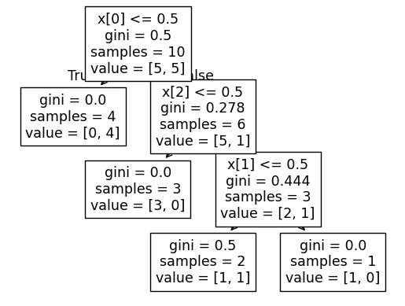
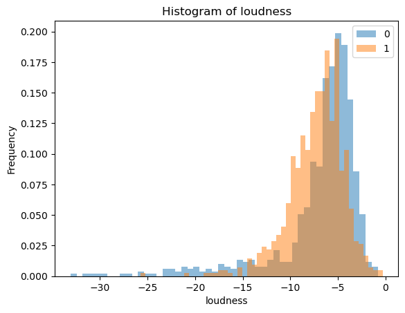
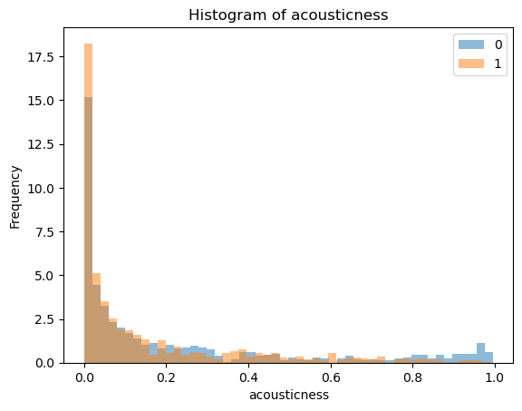
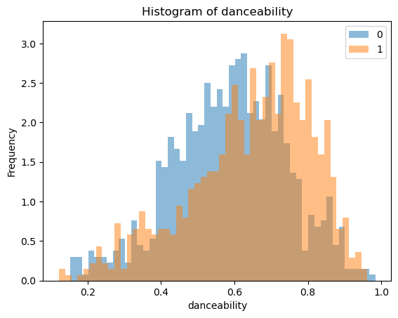
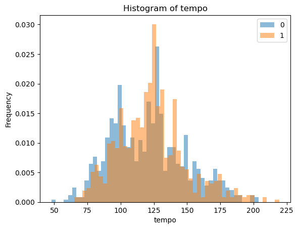
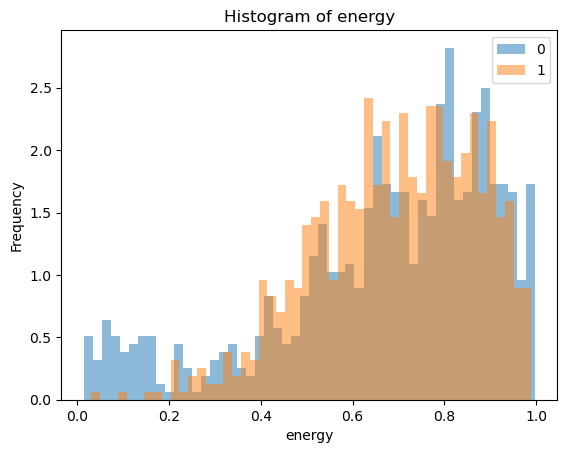
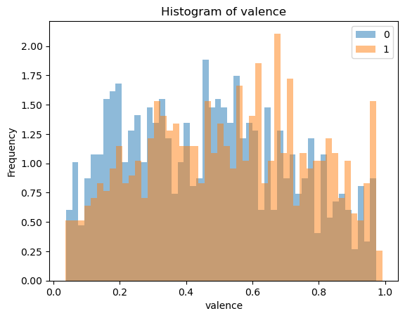

```python
# Initialize Otter
import otter
grader = otter.Notebook("lab1.ipynb")
```


# Lab 1: Decision trees and machine learning fundamentals


## Imports


```python
from hashlib import sha1

import matplotlib.pyplot as plt
import numpy as np
import pandas as pd
from sklearn.dummy import DummyClassifier
from sklearn.model_selection import cross_val_score, cross_validate, train_test_split
from sklearn.tree import DecisionTreeClassifier
```


## Instructions  
rubric={mechanics}

You will earn points for following these instructions and successfully submitting your work on Gradescope.  

### Before you start  

- Read the **[Use of Generative AI Policy](https://ubc-mds.github.io/policies/)**.
  
- Review the **[General Lab Instructions](https://ubc-mds.github.io/resources_pages/general_lab_instructions/)**.
    
- Check the **[MDS Rubrics](https://github.com/UBC-MDS/public/tree/master/rubric)** for grading criteria.

### Before submitting  

- **Run all cells** (▶▶ button) to ensure the notebook executes cleanly from top to bottom.

  - Execution counts must start at **1** and be sequential.
    
  - Notebooks with missing outputs or errors may lose marks.
    
- **Include a clickable link to your GitHub repository** below this cell.

- Make at least 3 commits to your GitHub repository and ensure it's up to date. If Gradescope becomes inaccessible, we'll grade the most recent GitHub version submitted before the deadline.

- **Do not upload or push data files** used in this lab to GitHub or Gradescope. (A `.gitignore` is provided to prevent this.)  


### Submitting on Gradescope  

- Upload **only** your `.ipynb` file (with outputs shown) and any required output files. Do **not** submit extra files.
  
- If needed, refer to the [Gradescope Student Guide](https://lthub.ubc.ca/guides/gradescope-student-guide/).  
- If your notebook is too large to render, also upload a **Web PDF** or **HTML** version.  
  - You can create one using **File $\rightarrow$ Save and Export Notebook As**.  
  - If you get an error when creating a PDF, try running the following commands in your lab directory:  

    ```bash
    conda install -c conda-forge nbconvert-playwright
    jupyter nbconvert --to webpdf lab1.ipynb
    ```  

  - Ensure all outputs are visible in your PDF or HTML file; TAs cannot grade your work if outputs are missing.


_Points:_ 4

<https://github.ubc.ca/mds-2025-26/DSCI_571_lab1_agill59>


## Warmup with toy dataset 


### Warmup activity

What's your studying or working style?

Below is a simple decision tree model trained to **predict what type of student you are based on your studying style**.

Follow the branches and see where you end up. Does this model predict you correctly?

#### Features

* **Daily stress level:** How tense or relaxed you usually feel (scale 1–10).

* **Daily social media time:** How many hours you spend scrolling or chatting online.

* **Sleep hours the night before a deadline:** How many hours do you typically sleep the night before an assignment, quiz, or project is due?

#### Predicted student types

* **Planner:** Organized, consistent, planns everything ahead of time.
  
* **Procrastinator:** Starts late and scrambles to finish.
* **Chill:** Chill, low stress, enjoys life, has steady routines.
* **Last minute genius:** Works best under pressure, bursts of inspiration right before the deadline.


Let's review the terminologies in machine learning together! (You are **NOT** graded on this warm-up task)

**Your Task:**

Please fill in each of the following sentences using the provided machine learning terminologies from the list below. Keep in mind that each term should be used only once!

**List of Terms (in no particular order):**

    a) hyperparameters
    b) training
    c) tree depth
    d) parameters
    e) example/data point
    f) features
    g) target
    h) root node
    i) branch
    j) leaf node


1. The type of student we are trying to predict — chill, planner, last-minute genius, or procrastinator — represents the variable we aim to predict or explain. It is called the (g).

2. The measurable inputs such as stress level, social media time, and sleep hours are known as (f).

3. Each individual row in the dataset, containing both the input values (features) and the corresponding output (target), is referred to as an (e).

4. In the decision tree above, the very first question ("Daily stress level < 7?") is the starting point of the model. It is called the (h).

5. The number of levels or layers from the initial question down to the final prediction in a decision tree is known as the (c).

6. Before building the decision tree, we specify certain configuration settings such as the maximum tree depth. These controllable settings are called (a).


## Exercise 1: Decision trees with a toy dataset 
<hr>

Suppose you have three different job offers with comparable salaries and job descriptions. You want to decide which one to accept, and you want to make this decision based on which job is likely to make you happy. Being a very systematic person, you come up with three features associated with the offers, which are important for your happiness: whether the colleagues are supportive, whether there is work-hour flexibility, and whether the company is a start-up or not. So the `X` of your offer data looks as follows: 


```python
offer_data = {
    # Features
    "supportive_colleagues": [1, 0, 0, 1],
    "work_hour_flexibility": [0, 0, 1, 1],
    "start_up": [0, 1, 1, 1],    
}

offer_df = pd.DataFrame(offer_data)
offer_df
```


<div>
<style scoped>
    .dataframe tbody tr th:only-of-type {
        vertical-align: middle;
    }

    .dataframe tbody tr th {
        vertical-align: top;
    }

    .dataframe thead th {
        text-align: right;
    }
</style>
<table border="1" class="dataframe">
  <thead>
    <tr style="text-align: right;">
      <th></th>
      <th>supportive_colleagues</th>
      <th>work_hour_flexibility</th>
      <th>start_up</th>
    </tr>
  </thead>
  <tbody>
    <tr>
      <th>0</th>
      <td>1</td>
      <td>0</td>
      <td>0</td>
    </tr>
    <tr>
      <th>1</th>
      <td>0</td>
      <td>0</td>
      <td>1</td>
    </tr>
    <tr>
      <th>2</th>
      <td>0</td>
      <td>1</td>
      <td>1</td>
    </tr>
    <tr>
      <th>3</th>
      <td>1</td>
      <td>1</td>
      <td>1</td>
    </tr>
  </tbody>
</table>
</div>


Your goal is to get predictions for these rows. In other words, for each row, you want to predict whether that job would make you **happy** or **unhappy**.   

So you ask the following questions to some of your friends (who you think have similar notions of happiness) regarding their jobs:

1. Do you have supportive colleagues? (1 for 'yes' and 0 for 'no')
2. Do you have flexible work hours? (1 for 'yes' and 0 for 'no')
3. Do you work for a start-up? (1 for 'start up' and 0 for 'non start up')
4. Are you happy in your job? (happy or unhappy)

Suppose you get the following data from this toy survey. You decide to train a machine learning model using this toy survey data and use this model to predict which job from `offer_df` is likely to make you happy. 


```python
import pandas as pd

happiness_data = {
    # Features
    "supportive_colleagues": [1, 1, 1, 0, 0, 1, 1, 0, 1, 0],
    "work_hour_flexibility": [1, 1, 0, 1, 1, 0, 1, 0, 0, 0],
    "start_up": [1, 0, 1, 0, 1, 0, 0, 1, 1, 0],
    # Target
    "target": [
        "happy",
        "happy",
        "happy",
        "unhappy",
        "unhappy",
        "happy",
        "happy",
        "unhappy",
        "unhappy",
        "unhappy",
    ],
}

train_df = pd.DataFrame(happiness_data)
train_df
```


<div>
<style scoped>
    .dataframe tbody tr th:only-of-type {
        vertical-align: middle;
    }

    .dataframe tbody tr th {
        vertical-align: top;
    }

    .dataframe thead th {
        text-align: right;
    }
</style>
<table border="1" class="dataframe">
  <thead>
    <tr style="text-align: right;">
      <th></th>
      <th>supportive_colleagues</th>
      <th>work_hour_flexibility</th>
      <th>start_up</th>
      <th>target</th>
    </tr>
  </thead>
  <tbody>
    <tr>
      <th>0</th>
      <td>1</td>
      <td>1</td>
      <td>1</td>
      <td>happy</td>
    </tr>
    <tr>
      <th>1</th>
      <td>1</td>
      <td>1</td>
      <td>0</td>
      <td>happy</td>
    </tr>
    <tr>
      <th>2</th>
      <td>1</td>
      <td>0</td>
      <td>1</td>
      <td>happy</td>
    </tr>
    <tr>
      <th>3</th>
      <td>0</td>
      <td>1</td>
      <td>0</td>
      <td>unhappy</td>
    </tr>
    <tr>
      <th>4</th>
      <td>0</td>
      <td>1</td>
      <td>1</td>
      <td>unhappy</td>
    </tr>
    <tr>
      <th>5</th>
      <td>1</td>
      <td>0</td>
      <td>0</td>
      <td>happy</td>
    </tr>
    <tr>
      <th>6</th>
      <td>1</td>
      <td>1</td>
      <td>0</td>
      <td>happy</td>
    </tr>
    <tr>
      <th>7</th>
      <td>0</td>
      <td>0</td>
      <td>1</td>
      <td>unhappy</td>
    </tr>
    <tr>
      <th>8</th>
      <td>1</td>
      <td>0</td>
      <td>1</td>
      <td>unhappy</td>
    </tr>
    <tr>
      <th>9</th>
      <td>0</td>
      <td>0</td>
      <td>0</td>
      <td>unhappy</td>
    </tr>
  </tbody>
</table>
</div>


### 1.1 Decision stump by hand 
rubric={autograde}

**Your tasks:**

Using this toy dataset, manually build a decision stump (a decision tree with only one split) based on the condition:

```
supportive_colleagues <= 0.5
```

1. What training accuracy would you obtain with this decision stump?
2. Save the accuracy (as a decimal) in an object named `supportive_colleagues_acc`.

> Note: You are expected to do this question by hand with a pen and paper. You do not need to show any calculations or code.


<div class="alert alert-warning">

Solution_1.1
    
</div>

_Points:_ 2


```python
supportive_colleagues_acc = 0.9

```


```python
grader.check("q1.1")
```


<p><strong><pre style='display: inline;'>q1.1</pre></strong> passed! 🎉</p>


    
### 1.2 Separating features and target
rubric={autograde}

Recall that in `scikit-learn`, before building a classifier, we need to separate features and target. 

**Your tasks:**

1. Separate features and target from `train_df` and save them in `X_train_toy` and `y_train_toy`, respectively.

</div>

<div class="alert alert-warning">

Solution_1.2
    
</div>

_Points:_ 1


```python
X_train_toy = train_df.iloc[:, 0:3]
y_train_toy = train_df.iloc[:, 3]

X_train_toy
```


<div>
<style scoped>
    .dataframe tbody tr th:only-of-type {
        vertical-align: middle;
    }

    .dataframe tbody tr th {
        vertical-align: top;
    }

    .dataframe thead th {
        text-align: right;
    }
</style>
<table border="1" class="dataframe">
  <thead>
    <tr style="text-align: right;">
      <th></th>
      <th>supportive_colleagues</th>
      <th>work_hour_flexibility</th>
      <th>start_up</th>
    </tr>
  </thead>
  <tbody>
    <tr>
      <th>0</th>
      <td>1</td>
      <td>1</td>
      <td>1</td>
    </tr>
    <tr>
      <th>1</th>
      <td>1</td>
      <td>1</td>
      <td>0</td>
    </tr>
    <tr>
      <th>2</th>
      <td>1</td>
      <td>0</td>
      <td>1</td>
    </tr>
    <tr>
      <th>3</th>
      <td>0</td>
      <td>1</td>
      <td>0</td>
    </tr>
    <tr>
      <th>4</th>
      <td>0</td>
      <td>1</td>
      <td>1</td>
    </tr>
    <tr>
      <th>5</th>
      <td>1</td>
      <td>0</td>
      <td>0</td>
    </tr>
    <tr>
      <th>6</th>
      <td>1</td>
      <td>1</td>
      <td>0</td>
    </tr>
    <tr>
      <th>7</th>
      <td>0</td>
      <td>0</td>
      <td>1</td>
    </tr>
    <tr>
      <th>8</th>
      <td>1</td>
      <td>0</td>
      <td>1</td>
    </tr>
    <tr>
      <th>9</th>
      <td>0</td>
      <td>0</td>
      <td>0</td>
    </tr>
  </tbody>
</table>
</div>


```python
grader.check("q1.2")
```


<p><strong><pre style='display: inline;'>q1.2</pre></strong> passed! 🍀</p>


    
### 1.3 Create a decision tree classifier object
rubric={autograde}

**Your tasks:**

1. Create a `DecisionTreeClassifier` object with `random_state=16` and store it in a variable called `toy_tree`.

</div>

<div class="alert alert-warning">

Solution_1.3
    
</div>

_Points:_ 1


```python
toy_tree = DecisionTreeClassifier(random_state=16)


```


```python
grader.check("q1.3")
```


<p><strong><pre style='display: inline;'>q1.3</pre></strong> passed! 🙌</p>


    
### 1.4 `fit` the decision tree classifier 
rubric={autograde}

**Your tasks:**

1. Now train a decision tree model by calling `fit` on `toy_tree` with `X_train_toy` and `y_train_toy` created above.


<div class="alert alert-warning">

Solution_1.4
    
</div>

_Points:_ 1


```python
toy_tree.fit(X_train_toy, y_train_toy)
```


```python
grader.check("q1.4")
```


<p><strong><pre style='display: inline;'>q1.4</pre></strong> passed! 🎉</p>


    
### 1.5 Visualize the trained decision tree
rubric={autograde}


**Your tasks:**
- Visualize the trained decision tree model using the [`tree.plot_tree`](https://scikit-learn.org/stable/modules/generated/sklearn.tree.plot_tree.html) method in `sklearn` by passing the appropriate values for the following arguments: 
    - `feature_names`
    - `class_names`
  
Save the names of the features in `feature_names` variable, names of the classes in `class_names` variable and the visualization tree returned by the function in a variable called `toy_tree_viz`.


<div class="alert alert-warning">

Solution_1.5
    
</div>

_Points:_ 2


```python
from sklearn import tree
toy_tree_viz = tree.plot_tree(toy_tree)
feature_names = ['supportive_colleagues', 'work_hour_flexibility', 'start_up'] # feature names 
class_names = ['unhappy', 'happy'] # unique class names 

```


    

    


```python
grader.check("q1.5")
```


<p><strong><pre style='display: inline;'>q1.5</pre></strong> passed! ✨</p>


You should see that the tree has a depth of 3. We can also access this value directly using the `get_depth()` function of the tree object:


```python
toy_tree.get_depth()
```

    3


### 1.6 Accuracy calculation
rubric={autograde}

**Your tasks:**

1. Evaluate the `toy_tree` on the training data (i.e., call `score()` on `X_train_toy` and `y_train_toy`) and store the score in a variable called `train_acc`.


<div class="alert alert-warning">

Solution_1.6
    
</div>

_Points:_ 1


```python
train_acc = toy_tree.score(X_train_toy, y_train_toy)
```


```python
grader.check("q1.6")
```


<p><strong><pre style='display: inline;'>q1.6</pre></strong> passed! 💯</p>


    
### 1.7 Discussion
rubric={reasoning}

**Your tasks:**

1. Do you achieve perfect training accuracy? If so, what are the reasons behind this, and if not, what factors contribute to the imperfection?


<div class="alert alert-warning">

Solution_1.7
    
</div>

_Points:_ 2

Did not achieve perfect accuracy. This is due to one observation having one supportive colleagues but still being unhappy.


    
### 1.8 Predicting on the offer data 
rubric={autograde}

**Your tasks:**

1. Using the trained decision tree above, predict the targets for all examples in `offer_df` and store them as a list in the `predictions` variable below.
2. In which jobs you are likely to be happy? Append the index or indices of all the examples where you are likely to be happy to the `happy_job_indices` list below.


```python
offer_df
```


<div>
<style scoped>
    .dataframe tbody tr th:only-of-type {
        vertical-align: middle;
    }

    .dataframe tbody tr th {
        vertical-align: top;
    }

    .dataframe thead th {
        text-align: right;
    }
</style>
<table border="1" class="dataframe">
  <thead>
    <tr style="text-align: right;">
      <th></th>
      <th>supportive_colleagues</th>
      <th>work_hour_flexibility</th>
      <th>start_up</th>
    </tr>
  </thead>
  <tbody>
    <tr>
      <th>0</th>
      <td>1</td>
      <td>0</td>
      <td>0</td>
    </tr>
    <tr>
      <th>1</th>
      <td>0</td>
      <td>0</td>
      <td>1</td>
    </tr>
    <tr>
      <th>2</th>
      <td>0</td>
      <td>1</td>
      <td>1</td>
    </tr>
    <tr>
      <th>3</th>
      <td>1</td>
      <td>1</td>
      <td>1</td>
    </tr>
  </tbody>
</table>
</div>


<div class="alert alert-warning">

Solution_1.8
    
</div>

_Points:_ 3


```python
predictions = list(toy_tree.predict(offer_df))
happy_job_indices = [0,3]
```


```python
grader.check("q1.8")
```


<p><strong><pre style='display: inline;'>q1.8</pre></strong> passed! 🚀</p>


<div class="alert alert-warning">
⚠️ Don't forget to <code>git commit</code>. Regular commits will help you track your progress!  
</div>


    
## Decision trees on Spotify Song Attributes dataset 

</div>

## Exercise 2: Data and Exploratory Data Analysis (EDA)

For the rest of the lab you'll be using Kaggle's [Spotify Song Attributes](https://www.kaggle.com/geomack/spotifyclassification/home) dataset. The dataset contains a number of features of songs from 2017 and a binary variable `target` that represents whether the user liked the song (encoded as 1) or not (encoded as 0). See the documentation of all the features [here](https://developer.spotify.com/documentation/web-api/reference/get-audio-features). 

This dataset is publicly available on Kaggle, and you will have to download it yourself. Follow the steps below to get the data CSV. 

1. If you do not have an account with [Kaggle](https://www.kaggle.com/), you will first need to create one (it's free).
2. Login to your account and [download](https://www.kaggle.com/geomack/spotifyclassification/download) the dataset.
3. Unzip the data file if needed, then rename it to `spotify.csv`, and move it under the `data` directory.

> You will not be able to push it to your repository (hopefully) because I have seeded the repository with `.gitignore`. 


    

### 2.1 Reading the data CSV
rubric={autograde}
 
**Your tasks:**
1. Read in the data CSV and store it as a pandas dataframe named `spotify_df`. The first column of the .csv file should be set as the index.

> Make sure you have put the data CSV as `spotify.csv` under the data directory (data/spotify.csv). When you read the data file, use this relative path for the autograder to work properly on Gradescope.


<div class="alert alert-warning">

Solution_2.1
    
</div>

_Points:_ 2


```python
spotify_df = pd.read_csv("data/spotify.csv").iloc[:,1:]

```


```python
grader.check("q2.1")
```


<p><strong><pre style='display: inline;'>q2.1</pre></strong> passed! 🙌</p>


    

### 2.2 Data splitting 
rubric={autograde

**Your tasks:**

1. Split the dataframe into `train_df` and `test_df` with `random_state=123` and `test_size=0.2`. 

</div>

<div class="alert alert-warning">

Solution_2.2
    
</div>

_Points:_ 2


```python
train_df, test_df = train_test_split(spotify_df, test_size=0.2, random_state=123)
```


```python
grader.check("q2.2")
```


<p><strong><pre style='display: inline;'>q2.2</pre></strong> passed! 🌈</p>


    
### 2.3 Number of training and test examples
rubric={autograde}

**Your tasks:**
1. How many training and test examples do we have? Store them as integers in the variables below.


<div class="alert alert-warning">

Solution_2.3
    
</div>

_Points:_ 1


```python
# Please provide integer values
n_train_samples = len(train_df)
n_test_samples = len(test_df)

```


```python
grader.check("q2.3")
```


<p><strong><pre style='display: inline;'>q2.3</pre></strong> passed! 🍀</p>


Typically, when developing machine learning pipelines, a large portion of the work goes into exploratory data analysis (EDA). This step helps you understand both your data and your prediction task before modeling. In this lab, due to time constraints, we'll only examine the output of a few basic methods. Let's begin with the `info` and `describe` methods of a pandas DataFrame.


```python
train_df.info()
```

    <class 'pandas.core.frame.DataFrame'>
    Index: 1613 entries, 1505 to 1534
    Data columns (total 16 columns):
     #   Column            Non-Null Count  Dtype  
    ---  ------            --------------  -----  
     0   acousticness      1613 non-null   float64
     1   danceability      1613 non-null   float64
     2   duration_ms       1613 non-null   int64  
     3   energy            1613 non-null   float64
     4   instrumentalness  1613 non-null   float64
     5   key               1613 non-null   int64  
     6   liveness          1613 non-null   float64
     7   loudness          1613 non-null   float64
     8   mode              1613 non-null   int64  
     9   speechiness       1613 non-null   float64
     10  tempo             1613 non-null   float64
     11  time_signature    1613 non-null   float64
     12  valence           1613 non-null   float64
     13  target            1613 non-null   int64  
     14  song_title        1613 non-null   object 
     15  artist            1613 non-null   object 
    dtypes: float64(10), int64(4), object(2)
    memory usage: 214.2+ KB


We can see that there are no missing values. Most features are numeric (`float64` or `int64`), with two object-type columns (`song_title` and `artist`).


The `describe` method provides quick summary statistics of the training data. By default, it summarizes numeric columns and returns a DataFrame.


```python
spotify_summary = train_df.describe()
spotify_summary
```


<div>
<style scoped>
    .dataframe tbody tr th:only-of-type {
        vertical-align: middle;
    }

    .dataframe tbody tr th {
        vertical-align: top;
    }

    .dataframe thead th {
        text-align: right;
    }
</style>
<table border="1" class="dataframe">
  <thead>
    <tr style="text-align: right;">
      <th></th>
      <th>acousticness</th>
      <th>danceability</th>
      <th>duration_ms</th>
      <th>energy</th>
      <th>instrumentalness</th>
      <th>key</th>
      <th>liveness</th>
      <th>loudness</th>
      <th>mode</th>
      <th>speechiness</th>
      <th>tempo</th>
      <th>time_signature</th>
      <th>valence</th>
      <th>target</th>
    </tr>
  </thead>
  <tbody>
    <tr>
      <th>count</th>
      <td>1613.000000</td>
      <td>1613.000000</td>
      <td>1613.000000</td>
      <td>1613.000000</td>
      <td>1613.000000</td>
      <td>1613.000000</td>
      <td>1613.000000</td>
      <td>1613.000000</td>
      <td>1613.000000</td>
      <td>1613.000000</td>
      <td>1613.000000</td>
      <td>1613.000000</td>
      <td>1613.000000</td>
      <td>1613.000000</td>
    </tr>
    <tr>
      <th>mean</th>
      <td>0.185627</td>
      <td>0.616745</td>
      <td>247114.827650</td>
      <td>0.681296</td>
      <td>0.136862</td>
      <td>5.383137</td>
      <td>0.189189</td>
      <td>-7.112929</td>
      <td>0.621203</td>
      <td>0.091277</td>
      <td>121.979777</td>
      <td>3.964662</td>
      <td>0.497587</td>
      <td>0.507750</td>
    </tr>
    <tr>
      <th>std</th>
      <td>0.259324</td>
      <td>0.163225</td>
      <td>81177.300308</td>
      <td>0.211612</td>
      <td>0.277744</td>
      <td>3.620422</td>
      <td>0.153170</td>
      <td>3.838867</td>
      <td>0.485238</td>
      <td>0.087890</td>
      <td>26.965641</td>
      <td>0.255201</td>
      <td>0.247378</td>
      <td>0.500095</td>
    </tr>
    <tr>
      <th>min</th>
      <td>0.000005</td>
      <td>0.122000</td>
      <td>16042.000000</td>
      <td>0.014800</td>
      <td>0.000000</td>
      <td>0.000000</td>
      <td>0.018800</td>
      <td>-33.097000</td>
      <td>0.000000</td>
      <td>0.023100</td>
      <td>47.859000</td>
      <td>1.000000</td>
      <td>0.035900</td>
      <td>0.000000</td>
    </tr>
    <tr>
      <th>25%</th>
      <td>0.009190</td>
      <td>0.511000</td>
      <td>200105.000000</td>
      <td>0.564000</td>
      <td>0.000000</td>
      <td>2.000000</td>
      <td>0.092300</td>
      <td>-8.388000</td>
      <td>0.000000</td>
      <td>0.037300</td>
      <td>100.518000</td>
      <td>4.000000</td>
      <td>0.295000</td>
      <td>0.000000</td>
    </tr>
    <tr>
      <th>50%</th>
      <td>0.062500</td>
      <td>0.629000</td>
      <td>230200.000000</td>
      <td>0.714000</td>
      <td>0.000071</td>
      <td>6.000000</td>
      <td>0.127000</td>
      <td>-6.248000</td>
      <td>1.000000</td>
      <td>0.054900</td>
      <td>121.990000</td>
      <td>4.000000</td>
      <td>0.496000</td>
      <td>1.000000</td>
    </tr>
    <tr>
      <th>75%</th>
      <td>0.251000</td>
      <td>0.738000</td>
      <td>272533.000000</td>
      <td>0.844000</td>
      <td>0.057300</td>
      <td>9.000000</td>
      <td>0.243000</td>
      <td>-4.791000</td>
      <td>1.000000</td>
      <td>0.107000</td>
      <td>137.932000</td>
      <td>4.000000</td>
      <td>0.690000</td>
      <td>1.000000</td>
    </tr>
    <tr>
      <th>max</th>
      <td>0.995000</td>
      <td>0.984000</td>
      <td>849960.000000</td>
      <td>0.997000</td>
      <td>0.976000</td>
      <td>11.000000</td>
      <td>0.969000</td>
      <td>-0.307000</td>
      <td>1.000000</td>
      <td>0.816000</td>
      <td>219.331000</td>
      <td>5.000000</td>
      <td>0.992000</td>
      <td>1.000000</td>
    </tr>
  </tbody>
</table>
</div>


From the summary, notice a few key points:

- The dataset has good variety in features like tempo, loudness, energy, and valence (mood).

- Most songs aren't very acoustic or instrumental (both are heavily skewed toward 0).

- Danceability and energy are fairly high overall.

- Valence (mood) spans the full range, and the target variable is roughly balanced between 0 and 1.


    
### 2.4 Plotting histograms 
rubric={viz}

The starter code below produces histograms for the `loudness` feature using pandas plotting. The histograms show the distribution of the feature values in the training set, separated for positive (target=1, i.e., user liked the song) and negative (target=0, i.e., user disliked the song) examples. There are two different histograms, one for target = 0 and one for target = 1, and they are overlaid on top of each other. The histogram shows that extremely quiet songs tend to be disliked (more blue bars than orange on the left) and very loud songs also tend to be disliked (more blue than orange on the far right).

> Note: I am using `matplotlib` and pandas plotting here. This is a manually graded question and you can use altair instead, as you're learning it in DSCI 531. I've added `altair` in the course environment and it'll also work fine on Gradescope.


```python
feat = "loudness"
train_df.groupby("target")[feat].plot.hist(bins=50, alpha=0.5, legend=True, density = True, title = "Histogram of " + feat);
plt.xlabel(feat);
```


    

    


**Your tasks:**

Create histograms for the following features in the order below.
- acousticness
- danceability
- tempo
- energy
- valence

> To adhere to the [DRY (Don't Repeat Yourself)](https://en.wikipedia.org/wiki/Don%27t_repeat_yourself) principle, make sure you use a `for` loop for your plotting, rather than repeating the plotting code 4 times. For this to work, I used `plt.show()` at the end of your loop, which draws the figure and resets the canvas for your next plot.

<div class="alert alert-warning">

Solution_2.4
    
</div>

_Points:_ 3


```python
feats = ['acousticness', 'danceability', 'tempo', 'energy', 'valence']

for feat in feats:
    train_df.groupby("target")[feat].plot.hist(bins=50, alpha=0.5, legend=True, density = True, title = "Histogram of " + feat)
    plt.xlabel(feat)
    plt.show()

```


    

    


    

    


    

    


    

    


    

    


    
### 2.5 Identical histograms
rubric={reasoning}

**Your tasks:**

1. Let's say that, for a particular feature, the histograms of that feature are identical for the two target classes. Does that mean the feature is not useful for predicting the target class? Briefly explain.


<div class="alert alert-warning">

Solution_2.5
    
</div>

_Points:_ 2

No, there can be use for that feature. Both features can have a stronger predictive effect when used together than either or on their own.


    
### 2.6 Which columns to include? 
rubric={reasoning}

Note that the dataset includes two text features labeled `song_title` and `artist`.

**Your tasks:**

1. Do you believe that these features could be valuable in predicting whether the user liked the song or not? If so, what makes them suitable, and if not, what makes them unsuitable?
2. Do you anticipate any challenges in using these features in their current form within your model? Please provide a brief explanation.


<div class="alert alert-warning">

Solution_2.6
    
</div>

_Points:_ 4

1. Artist can influence whether someone likes a song or not, but for the wrong reasons. Since we are interested in what parts of a song are likeable, keeping track of artist can negatively impact the model and skew the predicitions in an unintended way.

2. Since they are both characters, they must be encoded in such a way so that a model can use it, such as a factor. However, having song title as a factor would result in a factor with as many levels as rows in the data frame. This many levels is extremely wasteful in terms of resources and won't add to the model positively.


<div class="alert alert-warning">
⚠️ Don't forget to <code>git commit</code>. Regular commits will help you track your progress!  
</div>


## Exercise 3: Model building
<hr>

Now that we did some preliminary exploratory data analysis (EDA), let's move on to modeling. 


The first step we need to do is to separate `X` and `y` from `train_df` and `test_df` from the previous exercise and store them as `X_train`, `y_train`, `X_test`, `y_test`, respectively. We will skip the `song_title` and `artist` columns for now. 


```python
X_train = train_df.drop(columns=["target", "song_title", "artist"])
y_train = train_df["target"]

X_test = test_df.drop(columns=["target", "song_title", "artist"])
y_test = test_df["target"]
```


    
### 3.1 The baseline model: `DummyClassifier`
rubric={autograde}

**Your tasks:**
1. Carry out 10-fold cross-validation using `DummyClassifier` with `random_state=123`. Store the mean cross-validation score in the `dummy_score` variable below.


<div class="alert alert-warning">

Solution_3.1
    
</div>

_Points:_ 1


```python
dummy_score = np.mean(cross_val_score(DummyClassifier(random_state=123), X_train, y_train, cv=10))
```


```python
grader.check("q3.1")
```


<p><strong><pre style='display: inline;'>q3.1</pre></strong> passed! 🌟</p>


    

### 3.2 The decision tree model
rubric={autograde}

**Your tasks:**

1. Create a `DecisionTreeClassifier` with `random_state=123` and store it in a variable named `spotify_tree`.  

2. Perform 10-fold cross-validation with the `spotify_tree` object using `cross_validate` on `X_train` and `y_train`.  
   - Include the parameter `return_train_score=True`.  
   - Save the cross-validation results as a pandas DataFrame in a variable called `dt_scores_df`.


<div class="alert alert-warning">

Solution_3.2
    
</div>

_Points:_ 5


```python
spotify_tree = DecisionTreeClassifier(random_state=123)
dt_scores_df = pd.DataFrame(cross_validate(spotify_tree, X_train, y_train, cv = 10, return_train_score=True))

```


```python
grader.check("q3.2")
```


<p><strong><pre style='display: inline;'>q3.2</pre></strong> passed! 💯</p>


    
### 3.3 Examining cross-validation scores
rubric={reasoning}

**Your tasks:** 
- Inspect the 10 sub-scores, the range and the average cross-validation score from the 10 folds of cross-validation of decision tree model above.
- To what extent do you trust the reported average cross-validation score of approximately 0.66? Is reporting only the average sufficient to convey the model’s performance? Briefly explain.


```python
dt_scores_df
```


<div>
<style scoped>
    .dataframe tbody tr th:only-of-type {
        vertical-align: middle;
    }

    .dataframe tbody tr th {
        vertical-align: top;
    }

    .dataframe thead th {
        text-align: right;
    }
</style>
<table border="1" class="dataframe">
  <thead>
    <tr style="text-align: right;">
      <th></th>
      <th>fit_time</th>
      <th>score_time</th>
      <th>test_score</th>
      <th>train_score</th>
    </tr>
  </thead>
  <tbody>
    <tr>
      <th>0</th>
      <td>0.025949</td>
      <td>0.001904</td>
      <td>0.697531</td>
      <td>0.999311</td>
    </tr>
    <tr>
      <th>1</th>
      <td>0.026473</td>
      <td>0.001783</td>
      <td>0.660494</td>
      <td>1.000000</td>
    </tr>
    <tr>
      <th>2</th>
      <td>0.025620</td>
      <td>0.001519</td>
      <td>0.685185</td>
      <td>0.999311</td>
    </tr>
    <tr>
      <th>3</th>
      <td>0.027029</td>
      <td>0.001450</td>
      <td>0.639752</td>
      <td>1.000000</td>
    </tr>
    <tr>
      <th>4</th>
      <td>0.025857</td>
      <td>0.001485</td>
      <td>0.639752</td>
      <td>0.999311</td>
    </tr>
    <tr>
      <th>5</th>
      <td>0.026011</td>
      <td>0.001587</td>
      <td>0.658385</td>
      <td>0.999311</td>
    </tr>
    <tr>
      <th>6</th>
      <td>0.025902</td>
      <td>0.001599</td>
      <td>0.639752</td>
      <td>0.999311</td>
    </tr>
    <tr>
      <th>7</th>
      <td>0.028317</td>
      <td>0.001584</td>
      <td>0.608696</td>
      <td>0.999311</td>
    </tr>
    <tr>
      <th>8</th>
      <td>0.026557</td>
      <td>0.001457</td>
      <td>0.701863</td>
      <td>0.999311</td>
    </tr>
    <tr>
      <th>9</th>
      <td>0.026885</td>
      <td>0.001423</td>
      <td>0.695652</td>
      <td>0.999311</td>
    </tr>
  </tbody>
</table>
</div>


```python
dt_scores_df.mean()
```


    fit_time       0.026460
    score_time     0.001579
    test_score     0.662706
    train_score    0.999449
    dtype: float64


<div class="alert alert-warning">

Solution_3.3
    
</div>

_Points:_ 4

Cross validation is a way for us to determine how a model will do when given unseen data. We still have not used other parameters for testing models such as accuracy and test error to determine the performance of a model's prediciting ability Hyperparameter optimization is remaining as well so the initial test score of 0.66 is not enough information to determine if this model is good or poor. We can trust it to be better than the dummy classifier since it scored higher than the dummy on each fold.


<div class="alert alert-warning">
⚠️ Don't forget to <code>git commit</code>. Regular commits will help you track your progress!  
</div>


## Exercise 4: Hyperparameters
<hr>

In this exercise, you'll experiment with the `max_depth` hyperparameter of the decision tree classifier. See the [`DecisionTreeClassifier` documentation](https://scikit-learn.org/stable/modules/generated/sklearn.tree.DecisionTreeClassifier.html) for more details.


    

### 4.1 Train and cross-validation accuracies 
rubric={autograde}


**Your tasks:**

1. Explore the `max_depth` hyperparameter. Run 10-fold cross-validation for trees with the following values of `max_depth`: `np.arange(1, 25, 2)`. Set the `random_state` of `DecisionTreeClassifier` to 123 in each case for reproducibility. 
2. For each `max_depth`, get both the mean train accuracy and the mean cross-validation accuracy. Store your results in the `results_df` dataframe, where the max_depth is set as the index. 

> Note: generally speaking (for all assignments) you are welcome to copy/paste code directly from the lecture notes, though I ask that you add a small citation (e.g. "Adapted from lecture 1") if you do so.


```python
depths = np.arange(1, 25, 2)
depths
```


    array([ 1,  3,  5,  7,  9, 11, 13, 15, 17, 19, 21, 23])


<div class="alert alert-warning">

Solution_4.1
    
</div>

_Points:_ 6


```python
train_accuracies = []
cv_accuracies = []
for depth in depths:
    train_accuracy = (
        DecisionTreeClassifier(max_depth=depth, random_state=123).fit(X_train, y_train).score(X_train, y_train)
    )
    cv_accuracy = (
        np.mean(cross_val_score(DecisionTreeClassifier(max_depth=depth, random_state=123), X_train, y_train, cv = 10))
    )
    train_accuracies.append(train_accuracy)
    cv_accuracies.append(cv_accuracy)


results_df = pd.DataFrame({"max_depth" : depths, "mean_train_accuracy" : train_accuracies, "mean_cross_validation_accuracy" : cv_accuracies}).set_index("max_depth")
```


```python
results_df
```


<div>
<style scoped>
    .dataframe tbody tr th:only-of-type {
        vertical-align: middle;
    }

    .dataframe tbody tr th {
        vertical-align: top;
    }

    .dataframe thead th {
        text-align: right;
    }
</style>
<table border="1" class="dataframe">
  <thead>
    <tr style="text-align: right;">
      <th></th>
      <th>mean_train_accuracy</th>
      <th>mean_cross_validation_accuracy</th>
    </tr>
    <tr>
      <th>max_depth</th>
      <th></th>
      <th></th>
    </tr>
  </thead>
  <tbody>
    <tr>
      <th>1</th>
      <td>0.650961</td>
      <td>0.646032</td>
    </tr>
    <tr>
      <th>3</th>
      <td>0.727216</td>
      <td>0.692524</td>
    </tr>
    <tr>
      <th>5</th>
      <td>0.788593</td>
      <td>0.711713</td>
    </tr>
    <tr>
      <th>7</th>
      <td>0.856169</td>
      <td>0.703060</td>
    </tr>
    <tr>
      <th>9</th>
      <td>0.906386</td>
      <td>0.690610</td>
    </tr>
    <tr>
      <th>11</th>
      <td>0.941104</td>
      <td>0.680048</td>
    </tr>
    <tr>
      <th>13</th>
      <td>0.977681</td>
      <td>0.674457</td>
    </tr>
    <tr>
      <th>15</th>
      <td>0.995040</td>
      <td>0.658979</td>
    </tr>
    <tr>
      <th>17</th>
      <td>0.999380</td>
      <td>0.669538</td>
    </tr>
    <tr>
      <th>19</th>
      <td>0.999380</td>
      <td>0.665812</td>
    </tr>
    <tr>
      <th>21</th>
      <td>0.999380</td>
      <td>0.662706</td>
    </tr>
    <tr>
      <th>23</th>
      <td>0.999380</td>
      <td>0.662706</td>
    </tr>
  </tbody>
</table>
</div>


```python
results_df.shape
```


    (12, 2)


```python
grader.check("q4.1")
```


<p><strong><pre style='display: inline;'>q4.1</pre></strong> passed! 💯</p>

### 4.2 Visualization 
rubric={viz}

1. Make a plot with `max_depth` on the *x*-axis and the train and cross-validation accuracies on the *y*-axis. That is, your plot should have two curves, one for train and one for cross-validation. 

**Ensure your plot includes the following:**

1. Both the train accuracy and the cross-validation accuracy are included in the plot.
2. Include a legend to specify which is which. 
3. The provided `max_depth` values are used.
4. The x-axis and y-axis have reasonable names.
5. The data points are correct.


<div class="alert alert-warning">

Solution_4.2
    
</div>

_Points:_ 5


```python
import altair as alt

train_chart = alt.Chart(results_df.reset_index()).mark_line().encode(x = alt.X("max_depth").title("max depth"), y = alt.Y("mean_train_accuracy").title("accuracy"), color = alt.datum('Train Accuracy'))
cv_chart = alt.Chart(results_df.reset_index()).mark_line().encode(x = alt.X("max_depth").title("max depth"), y = alt.Y("mean_cross_validation_accuracy").title("accuracy"), color = alt.datum('Cross Validation'))
(train_chart + cv_chart)
```


![[img1/Pasted image 20251009101005.png]]

### 4.3 `max_depth` and the fundamental tradeoff
rubric={reasoning}

**Your tasks:**
1. Discuss how changing the `max_depth` hyperparameter affects the training and cross-validation accuracy.


<div class="alert alert-warning">

Solution_4.3
    
</div>

_Points:_ 3

Too high and the model overfits, too low and it underfits. Overfitting is when train accuracy is very close to 1 but cross validation is still far away in terms of accuracy. And underfitting is when train accuracy is low, and the model fails to use any of the information the data gives it to accurately predict. There is a sweet spot where the cross validation accuracy peaks without the model being under/overly complex.


    
### 4.4 Picking the "best" value for `max_depth`
rubric={autograde}

**Your tasks:**
1. From these results, pick the "best" `max_depth`, the one which gives the maximum cross-validation score. Store it in a variable called `best_max_depth` as an integer.


<div class="alert alert-warning">

Solution_4.4
    
</div>

_Points:_ 2


```python
best_max_depth = 5

```


```python
grader.check("q4.4")
```


<p><strong><pre style='display: inline;'>q4.4</pre></strong> passed! 🍀</p>


<div class="alert alert-info">
    

### 4.5 Final assessment on the test split 
rubric={autograde}

Now that we have our finalized model, we are ready to evaluate it on the test set. 

**Your tasks:**

1. Create a decision tree model `best_model` using the `best_max_depth` you chose in the previous exercise and `random_state=123`. 
2. Fit the `best_model` on the _entire training set_ (`X_train` and `y_train`). 
3. Compute the test score (on `X_test` and `y_test`) and store it in a variable called `test_score` below.

</div>

<div class="alert alert-warning">

Solution_4.5
    
</div>

_Points:_ 3


```python
best_model = DecisionTreeClassifier(max_depth=5, random_state=123)
test_score = best_model.fit(X_train, y_train).score(X_test, y_test)

test_score
```


    0.7178217821782178

### 4.6 Analysis
rubric={reasoning}

**Your tasks:**

1. How do the test scores compare to the cross-validation scores? Briefly discuss. 
2. Why can't you simply pick the value of `max_depth` that gives the best accuracy on the training data? (Answer in maximum 2 to 3 sentences.)
3. Do you think that the `max_depth` you chose would generalize to other "spotify" datasets (i.e., data on other spotify users)?


<div class="alert alert-warning">

Solution_4.6
    
</div>

_Points:_ 6

1. The test score is very similar to the cross-validation score for depth = 5. 
2. We cannot choose the `max_depth` that has the largest training accuracy since having too high of an accuracy can be a sign of overfitting and having a much too complicated model. When we choose the best hyperparameter, we want the cross-validation accuracy to be highest, not training accuracy.
3. Since other spotify datasets will have similar data, we can expect similar but not exactly the same performance with the new data since the model is generalized to work with any spotify data that fits the training data.

