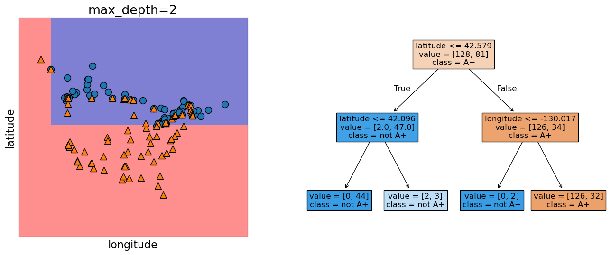

# Lecture 1: Terminology, Baselines, Decision Trees

UBC Master of Data Science program, 2025-26

## Imports, LOs

### Imports


``` {.python .cell-code}
import os
import sys

import matplotlib.pyplot as plt
import numpy as np
import pandas as pd

sys.path.append(os.path.join(os.path.abspath(".."), "code"))
import IPython
import mglearn
from IPython.display import HTML, display
from plotting_functions import *
from sklearn.dummy import DummyClassifier
from sklearn.tree import DecisionTreeClassifier, DecisionTreeRegressor
from utils import *

plt.rcParams["font.size"] = 16
pd.set_option("display.max_colwidth", 200)

%matplotlib inline
DATA_DIR = DATA_DIR = os.path.join(os.path.abspath(".."), "data/")
```


### Learning outcomes

From this lecture, you will be able to

-   Explain the difference between AI, ML, and DL

-   Describe what machine learning is and when it is appropriate to use
    ML-based solutions.

-   Briefly describe supervised learning.

-   Differentiate between traditional programming and machine learning.

-   Evaluate whether a machine learning solution is suitable for your
    problem or whether a rule-based or human-expert solution is more
    appropriate.

-   Define key machine learning terminology:\
    *features, targets, predictions, training, error, classification
    vs. regression, supervised vs. unsupervised learning,
    hyperparameters vs. parameters, baselines, decision boundaries*

-   Build a simple machine learning model in **scikit-learn**,
    explaining the `fit`--`predict` workflow and evaluating performance
    with the `score` method

-   Describe at a high level how decision trees are trained (fitting)
    and how they make predictions

-   Implement and visualize decision trees in scikit-learn using
    `DecisionTreeClassifier` and `DecisionTreeRegressor`

## Terminology \[[video](https://youtu.be/YNT8n4cXu4A)\]

You will see a lot of variable terminology in machine learning and
statistics. Let's familiarize ourselves with some of the basic
terminology used in ML.

``` {seealso}
Check out [the accompanying video](https://youtu.be/YNT8n4cXu4A) on this material. 
```

### Big picture and datasets

In this lecture, we'll talk about our first machine learning model:
Decision trees. We will also familiarize ourselves with some common
terminology in supervised machine learning.

### Toy datasets

Later in the course we will use larger datasets from Kaggle, for
instance. But for our first couple of lectures, we will be working with
the following three toy datasets:

-   [Quiz2 grade prediction classification
    dataset](../data/quiz2-grade-toy-classification.csv)
-   [Quiz2 grade prediction regression
    dataset](../data/quiz2-grade-toy-regression.csv)
-   [Canada USA cities dataset](../data/canada_usa_cities.csv)

``` {note}
If it's not necessary for you to understand the code, I will put it in one of the files under the `code` directory to avoid clutter in this notebook. For example, most of the plotting code is going to be in `code/plotting_functions.py`. 
```

I'll be using the following grade prediction toy dataset to demonstrate
the terminology. Imagine that you are taking a course with four home
work assignments and two quizzes. You and your friends are quite nervous
about your quiz2 grades and you want to know how will you do based on
your previous performance and some other attributes. So you decide to
collect some data from your friends from last year and train a
supervised machine learning model for quiz2 grade prediction.


``` {.python .cell-code}
classification_df = pd.read_csv(DATA_DIR + "quiz2-grade-toy-classification.csv")
print(classification_df.shape)
classification_df.head()
```

```
    (21, 8)
```

```
      ml_experience   class_attendance   lab1   lab2   lab3   lab4   quiz1   quiz2
  --- --------------- ------------------ ------ ------ ------ ------ ------- --------
  0   1               1                  92     93     84     91     92      A+
  1   1               0                  94     90     80     83     91      not A+
  2   0               0                  78     85     83     80     80      not A+
  3   0               1                  91     94     92     91     89      A+
  4   0               1                  77     83     90     92     85      A+
```

### Recap: Supervised machine learning

![[Pasted image 20251005221431.png]]


### Tabular data

In supervised machine learning, the input data is typically organized in
a **tabular** format, where rows are **examples** and columns are
**features**. One of the columns is typically the **target**.
![[Pasted image 20251005221508.png]]


**Features**
:   Features are relevant characteristics of the problem, usually
    suggested by experts. Features are typically denoted by $X$ and the
    number of features is usually denoted by $d$.

**Target**
:   Target is the feature we want to predict (typically denoted by $y$).

**Example**
:   A row of feature values. When people refer to an example, it may or
    may not include the target corresponding to the feature values,
    depending upon the context. The number of examples is usually
    denoted by $n$.

**Training**
:   The process of learning the mapping between the features ($X$) and
    the target ($y$).

#### Example: Tabular data for grade prediction

The tabular data usually contains both: the features (`X`) and the
target (`y`).


``` {.python .cell-code}
classification_df = pd.read_csv(DATA_DIR + "quiz2-grade-toy-classification.csv")
classification_df.head()
```


```
      ml_experience   class_attendance   lab1   lab2   lab3   lab4   quiz1   quiz2
  --- --------------- ------------------ ------ ------ ------ ------ ------- --------
  0   1               1                  92     93     84     91     92      A+
  1   1               0                  94     90     80     83     91      not A+
  2   0               0                  78     85     83     80     80      not A+
  3   0               1                  91     94     92     91     89      A+
  4   0               1                  77     83     90     92     85      A+
```


So the first step in training a supervised machine learning model is
separating `X` and `y`.


``` {.python .cell-code}
X = classification_df.drop(columns=["quiz2"])
y = classification_df["quiz2"]
X.head()
```


```
      ml_experience   class_attendance   lab1   lab2   lab3   lab4   quiz1
  --- --------------- ------------------ ------ ------ ------ ------ -------
  0   1               1                  92     93     84     91     92
  1   1               0                  94     90     80     83     91
  2   0               0                  78     85     83     80     80
  3   0               1                  91     94     92     91     89
  4   0               1                  77     83     90     92     85
```


``` {.python .cell-code}
y.head()
```

```
    0        A+
    1    not A+
    2    not A+
    3        A+
    4        A+
    Name: quiz2, dtype: object
```

#### Example: Tabular data for the housing price prediction

Here is an example of tabular data for housing price prediction. You can
download the data from
[here](https://www.kaggle.com/harlfoxem/housesalesprediction).


``` {.python .cell-code}
housing_df = pd.read_csv(DATA_DIR + "kc_house_data.csv")
housing_df.drop(["id", "date"], axis=1, inplace=True)
HTML(housing_df.head().to_html(index=False))
```


$$
\begin{array}{rrrrrrrrrrrrrrrrrrr}
\textbf{price} & \textbf{bed} & \textbf{bath} & \textbf{sqft\_living} & \textbf{sqft\_lot} & \textbf{floors} &
\textbf{waterfront} & \textbf{view} & \textbf{condition} & \textbf{grade} & \textbf{sqft\_above} &
\textbf{sqft\_basement} & \textbf{yr\_built} & \textbf{yr\_renovated} & \textbf{zipcode} &
\textbf{lat} & \textbf{long} & \textbf{sqft\_living15} & \textbf{sqft\_lot15} \\
221900.0 & 3 & 1.00 & 1180 & 5650 & 1.0 & 0 & 0 & 3 & 7 & 1180 & 0 & 1955 & 0 & 98178 & 47.5112 & -122.257 & 1340 & 5650 \\
538000.0 & 3 & 2.25 & 2570 & 7242 & 2.0 & 0 & 0 & 3 & 7 & 2170 & 400 & 1951 & 1991 & 98125 & 47.7210 & -122.319 & 1690 & 7639 \\
180000.0 & 2 & 1.00 & 770 & 10000 & 1.0 & 0 & 0 & 3 & 6 & 770 & 0 & 1933 & 0 & 98028 & 47.7379 & -122.233 & 2720 & 8062 \\
604000.0 & 4 & 3.00 & 1960 & 5000 & 1.0 & 0 & 0 & 5 & 7 & 1050 & 910 & 1965 & 0 & 98136 & 47.5208 & -122.393 & 1360 & 5000 \\
510000.0 & 3 & 2.00 & 1680 & 8080 & 1.0 & 0 & 0 & 3 & 8 & 1680 & 0 & 1987 & 0 & 98074 & 47.6168 & -122.045 & 1800 & 7503 \\
\end{array}
$$


``` {.python .cell-code}
X = housing_df.drop(columns=["price"])
y = housing_df["price"]
X.head()
```

| ID | bedrooms | bathrooms | sqft_living | sqft_lot | floors | waterfront | view | condition | grade | sqft_above | sqft_basement | yr_built | yr_renovated | zipcode | lat | long | sqft_living15 | sqft_lot15 |
|----|-----------|------------|-------------|-----------|---------|-------------|------|------------|--------|--------------|---------------|-----------|--------------|----------|------|--------|----------------|-------------|
| 0 | 3 | 1.00 | 1180 | 5650 | 1.0 | 0 | 0 | 3 | 7 | 1180 | 0 | 1955 | 0 | 98178 | 47.5112 | -122.257 | 1340 | 5650 |
| 1 | 3 | 2.25 | 2570 | 7242 | 2.0 | 0 | 0 | 3 | 7 | 2170 | 400 | 1951 | 1991 | 98125 | 47.7210 | -122.319 | 1690 | 7639 |
| 2 | 2 | 1.00 | 770 | 10000 | 1.0 | 0 | 0 | 3 | 6 | 770 | 0 | 1933 | 0 | 98028 | 47.7379 | -122.233 | 2720 | 8062 |
| 3 | 4 | 3.00 | 1960 | 5000 | 1.0 | 0 | 0 | 5 | 7 | 1050 | 910 | 1965 | 0 | 98136 | 47.5208 | -122.393 | 1360 | 5000 |
| 4 | 3 | 2.00 | 1680 | 8080 | 1.0 | 0 | 0 | 3 | 8 | 1680 | 0 | 1987 | 0 | 98074 | 47.6168 | -122.045 | 1800 | 7503 |


``` {.python .cell-code}
y.head()
```

```
    0    221900.0
    1    538000.0
    2    180000.0
    3    604000.0
    4    510000.0
    Name: price, dtype: float64
```


``` {.python .cell-code}
X.shape
```

```
    (21613, 18)
```

`Attention: To a machine, column names (features) have no meaning. Only feature values and how they vary across examples mean something.`


#### Alternative terminology for examples, features, targets, and training

-   **examples** = rows = samples = records = instances
-   **features** = inputs = predictors = explanatory variables =
    regressors = independent variables = covariates
-   **targets** = outputs = outcomes = response variable = dependent
    variable = labels (if categorical).
-   **training** = learning = fitting

``` {seealso}
Check out [the MDS terminology document](https://ubc-mds.github.io/resources_pages/terminology/). 
```


### Supervised learning vs. Unsupervised learning

In **supervised learning**, training data comprises a set of features
($X$) and their corresponding targets ($y$). We wish to find a **model
function $f$** that relates $X$ to $y$. Then use that model function
**to predict the targets** of new examples.

![[Pasted image 20251005221431.png]]

In **unsupervised learning** training data consists of observations
($X$) **without any corresponding targets**. Unsupervised learning could
be used to **group similar things together** in $X$ or to provide
**concise summary** of the data. We'll learn more about this topic in
later videos.

![[Pasted image 20251005221557.png]]

Supervised machine learning is about function approximation, i.e.,
finding the mapping function between `X` and `y` whereas unsupervised
machine learning is about concisely describing the data.


### Classification vs. Regression

In supervised machine learning, there are two main kinds of learning
problems based on what they are trying to predict. - **Classification
problem**: predicting among two or more discrete classes - Example1:
Predict whether a patient has a liver disease or not - Example2: Predict
whether a student would get an A+ or not in quiz2.\
- **Regression problem**: predicting a continuous value - Example1:
Predict housing prices - Example2: Predict a student's score in quiz2.

![[Pasted image 20251005221608.png]]

``` {.python .cell-code}
# quiz2 classification toy data
classification_df = pd.read_csv(DATA_DIR + "quiz2-grade-toy-classification.csv")
classification_df.head(4)
```


```
      ml_experience   class_attendance   lab1   lab2   lab3   lab4   quiz1   quiz2
  --- --------------- ------------------ ------ ------ ------ ------ ------- --------
  0   1               1                  92     93     84     91     92      A+
  1   1               0                  94     90     80     83     91      not A+
  2   0               0                  78     85     83     80     80      not A+
  3   0               1                  91     94     92     91     89      A+

```


``` {.python .cell-code}
# quiz2 regression toy data
regression_df = pd.read_csv(DATA_DIR + "quiz2-grade-toy-regression.csv")
regression_df.head(4)
```


```
      ml_experience   class_attendance   lab1   lab2   lab3   lab4   quiz1   quiz2
  --- --------------- ------------------ ------ ------ ------ ------ ------- -------
  0   1               1                  92     93     84     91     92      90
  1   1               0                  94     90     80     83     91      84
  2   0               0                  78     85     83     80     80      82
  3   0               1                  91     94     92     91     89      92
```

``` {.python .cell-code}
classification_df
```


```
       ml_experience   class_attendance   lab1   lab2   lab3   lab4   quiz1   quiz2
  ---- --------------- ------------------ ------ ------ ------ ------ ------- -----
  0    1               1                  92     93     84     91     92      A+
  1    1               0                  94     90     80     83     91      notA+
  2    0               0                  78     85     83     80     80      notA+
  3    0               1                  91     94     92     91     89      A+
  4    0               1                  77     83     90     92     85      A+
  5    1               0                  70     73     68     74     71      notA+
  6    1               0                  80     88     89     88     91      A+
  7    0               1                  95     93     69     79     75      notA+
  8    0               0                  97     90     94     99     80      notA+
  9    1               1                  95     95     94     94     85      notA+
  10   0               1                  98     86     95     95     78      A+
  11   1               1                  95     88     93     92     85      A+
  12   1               1                  98     96     96     99     100     A+
  13   0               1                  95     94     96     95     100     A+
  14   0               1                  95     90     93     95     70      notA+
  15   1               0                  92     85     67     94     92      notA+
  16   0               0                  75     91     93     86     85      A+
  17   1               0                  86     89     65     86     87      notA+
  18   1               1                  91     93     90     88     82      notA+
  19   0               1                  77     94     87     81     89      notA+
  20   1               1                  96     92     92     96     87      A+
```


``` {.python .cell-code}
classification_df.shape
```

```
    (21, 8)
```

### Inference vs Prediction

-   Inference is about understanding "why" something happens by
    examining the relationships and effects within the data, while
    prediction focuses on predicting "what" will happen.
-   The goal of **inference** is to **understand and quantify** the
    relationships between variables in a dataset.
-   Inference involves estimating the parameters of the underlying
    distribution and testing hypotheses about these parameters or
    relationships.
-   Example: Determining the impact of a new drug on patient recovery
    time.
-   The goal of **prediction** is to predcit the target based on input
    features, without necessarily understanding the relationships
    between variables.
-   Of course these goals are related, and in many situations we need
    both.

## ❓❓ Questions for you


### iClicker Exercise 1.1: ML or not

**Select all of the following statements which are suitable problems for
machine learning.**

-   (A) Identifying objects within digital images, such as facial
        recognition in security systems or categorizing images based on
        content.
-   (B) Determining if individuals meet the necessary criteria for
        government or financial services based on strict guidelines.
-   (C) Identifying unusual patterns that may indicate fraudulent
        transactions in banking and finance. Automatically analyzing
        images from MRIs, CT scans, or X-rays to detect abnormalities
        like tumors or fractures.
-   (D) Addressing mental health issues where human empathy,
        understanding, and adaptability are key.

\`\`\`gfyyohjvvgyq V's Solutions! :class: tip, dropdown


### iClicker Exercise 1.2: Supervised vs Unsupervised

**Select all of the following statements which are examples of supervised machine learning.**

 - (A) Finding groups of similar properties in a real estate data set.
 - (B) Predicting whether someone will have a heart attack or not on the basis of demographic, diet, and clinical measurement.
 - (C) Grouping articles on different topics from different news sources (something like the Google News app).
 - (D) Detecting credit card fraud based on examples of fraudulent and non-fraudulent transactions.
 - (E) Given some measure of employee performance, identify the key factors which are likely to influence their performance.

```{admonition} V's Solutions!
:class: tip, dropdown
```
### iClicker Exercise 1.3 Classification vs regression

**Select all of the following statements which are examples of
regression problems**

-   (A) Predicting the price of a house based on features such as number
        of bedrooms and the year built.
-   (B) Predicting if a house will sell or not based on features like
        the price of the house, number of rooms, etc.
-   (C) Predicting percentage grade in DSCI 571 based on past grades.
-   (D) Predicting whether you should bicycle tomorrow or not based on
        the weather forecast.
-   (E) Predicting appropriate thermostat temperature based on the wind
        speed and the number of people in a room.

` V's Solutions! :class: tip, dropdown`

### Exercise 1.4 Food for thought

For each of the following examples what would be the relevant features
and what would be target? 1. Sentiment analysis 2. Fraud detection 3. Face recognition


## Baselines \[[video](https://youtu.be/6eT5cLL-2Vc)\]

``` {seealso}
Check out [the accompanying video](https://youtu.be/6eT5cLL-2Vc) on this material. 
```

### Supervised learning (Reminder)

-   Training data $\rightarrow$ Machine learning algorithm $\rightarrow$
    ML model
-   Unseen test data + ML model $\rightarrow$ predictions
![[Pasted image 20251005221431.png]]


Let's build a very simple supervised machine learning model for quiz2
grade prediction problem.


``` {.python .cell-code}
classification_df = pd.read_csv(DATA_DIR + "quiz2-grade-toy-classification.csv")
classification_df.head()
```


```
      ml_experience   class_attendance   lab1   lab2   lab3   lab4   quiz1   quiz2
  --- --------------- ------------------ ------ ------ ------ ------ ------- --------
  0   1               1                  92     93     84     91     92      A+
  1   1               0                  94     90     80     83     91      not A+
  2   0               0                  78     85     83     80     80      not A+
  3   0               1                  91     94     92     91     89      A+
  4   0               1                  77     83     90     92     85      A+

```


``` {.python .cell-code}
classification_df["quiz2"].value_counts()
```

```
    quiz2
    not A+    11
    A+        10
    Name: count, dtype: int64
```

Seems like "not A+" occurs more frequently than "A+". What if we predict
"not A+" all the time?

### Baselines

**Baseline**
:   A simple machine learning algorithm based on simple rules of thumb.

-   For example, most frequent baseline always predicts the most
    frequent label in the training set.
-   Baselines provide a way to sanity check your machine learning model.

### `DummyClassifier`

-   `sklearn`'s baseline model for classification\
-   Let's train `DummyClassifier` on the grade prediction dataset.

### Steps to train a classifier using `sklearn`

1.  Read the data
2.  Create $X$ and $y$
3.  Create a classifier object
4.  `fit` the classifier
5.  `predict` on new examples
6.  `score` the model

#### Reading the data

``` {.python .cell-code}
classification_df.head()
```


```
      ml_experience   class_attendance   lab1   lab2   lab3   lab4   quiz1   quiz2
  --- --------------- ------------------ ------ ------ ------ ------ ------- --------
  0   1               1                  92     93     84     91     92      A+
  1   1               0                  94     90     80     83     91      not A+
  2   0               0                  78     85     83     80     80      not A+
  3   0               1                  91     94     92     91     89      A+
  4   0               1                  77     83     90     92     85      A+

```


```
#### Create $X$ and $y$

-   $X$ → Feature vectors
-   $y$ → Target


``` {.python .cell-code}
X = classification_df.drop(columns=["quiz2"])
y = classification_df["quiz2"]
```
:::

#### Create a classifier object

-   `import` the appropriate classifier
-   Create an object of the classifier


``` {.python .cell-code}
from sklearn.dummy import DummyClassifier  # import the classifier

dummy_clf = DummyClassifier(strategy="most_frequent")  # Create a classifier object
```
:::

#### `fit` the classifier

-   The "learning" is carried out when we call `fit` on the classifier
    object.


``` {.python .cell-code}
dummy_clf.fit(X, y)
# fit the classifier
```

![[Pasted image 20251005221831.png]]

#### `predict` the target of given examples

-   We can predict the target of examples by calling `predict` on the
    classifier object.


``` {.python .cell-code}
dummy_clf.predict(X)  # predict using the trained classifier
```


    array(['not A+', 'not A+', 'not A+', 'not A+', 'not A+', 'not A+',
           'not A+', 'not A+', 'not A+', 'not A+', 'not A+', 'not A+',
           'not A+', 'not A+', 'not A+', 'not A+', 'not A+', 'not A+',
           'not A+', 'not A+', 'not A+'], dtype='<U6')
```
#### `score` your model

-   How do you know how well your model is doing?

-   For classification problems, by default, `score` gives the
    **accuracy** of the model, i.e., proportion of correctly predicted
    targets.

    $accuracy = \frac{\text{correct predictions}}{\text{total examples}}$


``` {.python .cell-code}
print("The accuracy of the model on the training data: %0.3f" % (dummy_clf.score(X, y)))
```


    The accuracy of the model on the training data: 0.524
```
-   Sometimes you will also see people reporting **error**, which is
    usually $1 - accuracy$
-   `score`
    -   calls `predict` on `X`
    -   compares predictions with `y` (true targets)
    -   returns the accuracy in case of classification.


``` {.python .cell-code}
print(
    "The error of the model on the training data: %0.3f" % (1 - dummy_clf.score(X, y))
)
```


    The error of the model on the training data: 0.476
```
#### `fit`, `predict` , and `score` summary

Here is the general pattern when we build ML models using `sklearn`.


``` {.python .cell-code}
# Create `X` and `y` from the given data
X = classification_df.drop(columns=["quiz2"])
y = classification_df["quiz2"]

clf = DummyClassifier(strategy="most_frequent")  # Create a class object
clf.fit(X, y)  # Train/fit the model
print(clf.score(X, y))  # Assess the model

new_examples = [[0, 1, 92, 90, 95, 93, 92], [1, 1, 92, 93, 94, 92]]
clf.predict(new_examples)  # Predict on some new data using the trained model
```


    0.5238095238095238
:::


    array(['not A+', 'not A+'], dtype='<U6')
```
``` {note}
You'll be exploring dummy classifier in your lab!
```

### [`DummyRegressor`](https://scikit-learn.org/0.15/modules/generated/sklearn.dummy.DummyRegressor.html)

You can also do the same thing for regression problems using
`DummyRegressor`, which predicts mean, median, or constant value of the
training set for all examples.

-   Let's build a regression baseline model using `sklearn`.


``` {.python .cell-code}
from sklearn.dummy import DummyRegressor

regression_df = pd.read_csv(DATA_DIR + "quiz2-grade-toy-regression.csv")  # Read data
X = regression_df.drop(columns=["quiz2"])  # Create `X` and `y` from the given data
y = regression_df["quiz2"]
reg = DummyRegressor()  # Create a class object
reg.fit(X, y)  # Train/fit the model
reg.score(X, y)  # Assess the model
new_examples = [[0, 1, 92, 90, 95, 93, 92], [1, 1, 92, 93, 94, 92]]
reg.predict(new_examples)  # Predict on some new data using the trained model
```


    array([86.28571429, 86.28571429])
```
-   The `fit` and `predict` paradigms similar to classification. The
    `score` method in the context of regression returns somethings
    called [$R^2$
    score](https://scikit-learn.org/stable/modules/generated/sklearn.metrics.r2_score.html#sklearn.metrics.r2_score).
    (More on this in later videos.)
    -   The maximum $R^2$ is 1 for perfect predictions.
    -   For `DummyRegressor` it returns the mean of the `y` values.


``` {.python .cell-code}
reg.score(X, y)
```


    0.0
```
## ❓❓ Questions for you

### Exercise 1.5

Order the steps below to build ML models using `sklearn`. - `score` to
evaluate the performance of a given model - `predict` on new examples -
Creating a model instance - Creating `X` and `y` - `fit`


## Break (5 min)

![[Pasted image 20251005221909.png]]

-   We will try to take a 5-minute break half way through every class.


## Decision trees \[[video](https://youtu.be/Hcf19Ij35rA)\]

``` {seealso}
Check out [the accompanying video](https://youtu.be/Hcf19Ij35rA) on this material. 
```

### Writing a traditional program to predict quiz2 grade

-   Can we do better than the baseline?
-   Forget about ML for a second. If you are asked to write a program to
    predict whether a student gets an A+ or not in quiz2, how would you
    go for it?\
-   For simplicity, let's binarize the feature values.

![[Pasted image 20251005221936.png]]

-   Is there a pattern that distinguishes yes's from no's and what does
    the pattern say about today?

-   How about a rule-based algorithm with a number of *if else*
    statements?\
    `if class_attendance == 1 and quiz1 == 1:         quiz2 == "A+"     elif class_attendance == 1 and lab3 == 1 and lab4 == 1:         quiz2 == "A+"     ...`

-   How many possible rule combinations there could be with the given 7
    binary features?

    -   Gets unwieldy pretty quickly

### Decision tree algorithm

-   A machine learning algorithm to derive such rules from data in a
    principled way.\
-   Have you ever played [20-questions
    game](https://en.wikipedia.org/wiki/Twenty_questions)? Decision
    trees are based on the same idea!
-   Let's `fit` a decision tree using `scikit-learn` and `predict` with
    it.
-   Recall that `scikit-learn` uses the term `fit` for training or
    learning and uses `predict` for prediction.

### Building decision trees with `sklearn`

Let's binarize our toy dataset for simplicity.


``` {.python .cell-code}
classification_df = pd.read_csv(DATA_DIR + "quiz2-grade-toy-classification.csv")
X = classification_df.drop(columns=["quiz2"])
y = classification_df["quiz2"]

X_binary = X.copy()
columns = ["lab1", "lab2", "lab3", "lab4", "quiz1"]
for col in columns:
    X_binary[col] = X_binary[col].apply(lambda x: 1 if x >= 90 else 0)
X_binary.head()
```

```
      ml_experience   class_attendance   lab1   lab2   lab3   lab4   quiz1
  --- --------------- ------------------ ------ ------ ------ ------ -------
  0   1               1                  1      1      0      1      1
  1   1               0                  1      1      0      0      1
  2   0               0                  0      0      0      0      0
  3   0               1                  1      1      1      1      0
  4   0               1                  0      0      1      1      0


```

``` {.python .cell-code}
y.head()
```


    0        A+
    1    not A+
    2    not A+
    3        A+
    4        A+
    Name: quiz2, dtype: object
```
#### `DummyClassifier` on quiz2 grade prediction toy dataset


``` {.python .cell-code}
dummy_clf = DummyClassifier(strategy="most_frequent")
dummy_clf.fit(X_binary, y)
dummy_clf.score(X_binary, y)
```


    0.5238095238095238
```
#### `DecisionTreeClassifier` on quiz2 grade prediction toy dataset


``` {.python .cell-code}
from sklearn.tree import DecisionTreeClassifier

model = DecisionTreeClassifier()  # Create a decision tree
model.fit(X_binary, y)  # Fit a decision tree
model.score(X_binary, y)  # Assess the model
```


    0.9047619047619048
```
The decision tree classifier is giving much higher accuracy than the
dummy classifier. That's good news!


``` {.python .cell-code}
# Call the custom_plot_tree function to visualize the customized tree
width = 12
height = 8
plt.figure(figsize=(width, height))
custom_plot_tree(
    model,
    feature_names=X_binary.columns.tolist(),
    class_names=["A+", "not A+"],
    impurity=False,
    fontsize=10,
)
```


```
### Some terminology related to trees

Here is a commonly used terminology in a typical representation of
decision trees.

**A root node**
:   represents the first condition to check or question to ask

**A branch**
:   connects a node (condition) to the next node (condition) in the
    tree. Each branch typically represents either true or false.

**An internal node**
:   represents conditions within the tree

**A leaf node**
:   represents the predicted class/value when the path from root to the
    leaf node is followed.

**Tree depth**
:   The number of edges on the path from the root node to the farthest
    away leaf node.

### How does `predict` work?


``` {.python .cell-code}
new_example = np.array([[0, 1, 0, 0, 1, 1, 1]])
pd.DataFrame(data=new_example, columns=X.columns)
```


```
      ml_experience   class_attendance   lab1   lab2   lab3   lab4   quiz1
  --- --------------- ------------------ ------ ------ ------ ------ -------
  0   0               1                  0      0      1      1      1


```


``` {.python .cell-code}
plt.figure(figsize=(width, height))
custom_plot_tree(
    model,
    feature_names=X_binary.columns.tolist(),
    class_names=["A+", "not A+"],
    impurity=False,
    fontsize=10,
)
```


```
What's the prediction for the new example?


``` {.python .cell-code}
model.predict(new_example)
```


    /Users/kvarada/miniforge3/envs/571/lib/python3.13/site-packages/sklearn/utils/validation.py:2749: UserWarning: X does not have valid feature names, but DecisionTreeClassifier was fitted with feature names
      warnings.warn(
:::


    array(['A+'], dtype=object)

In summary, given a learned tree and a test example, during prediction
time,\
- Start at the top of the tree. Ask binary questions at each node and
follow the appropriate path in the tree. Once you are at a leaf node,
you have the prediction. - Note that the model only considers the
features which are in the learned tree and ignores all other features.

### How does `fit` work?

-   Decision tree is inspired by [20-questions
    game](https://en.wikipedia.org/wiki/Twenty_questions).
-   Each node either represents a question or an answer. The terminal
    nodes (called leaf nodes) represent answers.

![[Pasted image 20251005222137.png]]

### How does `fit` work?

-   Which features are most useful for classification?
-   Minimize **impurity** at each question
-   Common criteria to minimize impurity: [gini
    index](https://scikit-learn.org/stable/modules/tree.html#classification-criteria),
    information gain, cross entropy


``` {.python .cell-code}
from sklearn.tree import DecisionTreeClassifier

model = DecisionTreeClassifier()  # Create a decision tree
model.fit(X_binary, y)  # Fit a decision tree
plt.figure(figsize=(width, height))
custom_plot_tree(
    model,
    feature_names=X_binary.columns.tolist(),
    class_names=["A+", "not A+"],
    fontsize=10,
)
```


` Warning  :class: warning  We won't go through **how** it does this - that's CPSC 340. But it's worth noting that it support two types of inputs:      1. Categorical (e.g., Yes/No or more options, as shown in the tree above)     2. Numeric (a number)In the numeric case, the decision tree algorithm also picks the _threshold_.`

### Decision trees with continuous features


``` {.python .cell-code}
X.head()
```

```
      ml_experience   class_attendance   lab1   lab2   lab3   lab4   quiz1
  --- --------------- ------------------ ------ ------ ------ ------ -------
  0   1               1                  92     93     84     91     92
  1   1               0                  94     90     80     83     91
  2   0               0                  78     85     83     80     80
  3   0               1                  91     94     92     91     89
  4   0               1                  77     83     90     92     85

```

``` {.python .cell-code}
model = DecisionTreeClassifier()
model.fit(X, y)
plt.figure(figsize=(width, height))
custom_plot_tree(
    model,
    feature_names=X_binary.columns.tolist(),
    class_names=["A+", "not A+"],
    impurity=False,
    fontsize=10,
)
```


### Decision tree for regression problems

-   We can also use decision tree algorithm for regression.
-   Instead of gini, we use [some other
    criteria](https://scikit-learn.org/stable/modules/tree.html#mathematical-formulation)
    for splitting. A common one is mean squared error (MSE).
-   `scikit-learn` supports regression using decision trees with
    `DecisionTreeRegressor`
    -   `fit` and `predict` paradigms similar to classification
    -   `score` returns somethings called [$R^2$
        score](https://scikit-learn.org/stable/modules/generated/sklearn.metrics.r2_score.html#sklearn.metrics.r2_score).
        -   The maximum $R^2$ is 1 for perfect predictions.
        -   It can be negative which is very bad (worse than
            `DummyRegressor`).


``` {.python .cell-code}
regression_df = pd.read_csv(DATA_DIR + "quiz2-grade-toy-regression.csv")
regression_df.head()
```


```
      ml_experience   class_attendance   lab1   lab2   lab3   lab4   quiz1   quiz2
  --- --------------- ------------------ ------ ------ ------ ------ ------- -------
  0   1               1                  92     93     84     91     92      90
  1   1               0                  94     90     80     83     91      84
  2   0               0                  78     85     83     80     80      82
  3   0               1                  91     94     92     91     89      92
  4   0               1                  77     83     90     92     85      90

```

``` {.python .cell-code}
X = regression_df.drop(["quiz2"], axis=1)
y = regression_df["quiz2"]

depth = 2
reg_model = DecisionTreeRegressor(max_depth=depth)
reg_model.fit(X, y)
regression_df["predicted_quiz2"] = reg_model.predict(X)
print("R^2 score on the training data: %0.3f\n\n" % (reg_model.score(X, y)))
regression_df.head()
```


    R^2 score on the training data: 0.989

```
      ml_experience   class_attendance   lab1   lab2   lab3   lab4   quiz1   quiz2   predicted_quiz2
  --- --------------- ------------------ ------ ------ ------ ------ ------- ------- -----------------
  0   1               1                  92     93     84     91     92      90      90.333333
  1   1               0                  94     90     80     83     91      84      83.000000
  2   0               0                  78     85     83     80     80      82      83.000000
  3   0               1                  91     94     92     91     89      92      92.000000
  4   0               1                  77     83     90     92     85      90      90.333333

```
## ❓❓ Questions for you

### iClicker Exercise 1.6 Baselines and decision trees

**Select all of the following statements which are TRUE.**

-   (A) Change in features (e.g., binarizing features) would change
        `DummyClassifier` predictions.
-   (B) `predict` takes only `X` as argument whereas `fit` and `score`
        take both `X` and `y` as arguments.
-   (C) For the decision tree algorithm to work, the feature values must
        be binary.
-   (D) The prediction in a decision tree works by routing the example
        from the root to the leaf.

`gfyyohjvvgyq V's Solutions! :class: tip, dropdown`


## More terminology \[[video](https://youtu.be/KEtsfXn4w2E)\]

-   Parameters and hyperparameters
-   Decision boundary

``` {seealso}
Check out [the accompanying video](https://youtu.be/KEtsfXn4w2E) on this material. 
```

### Parameters

-   The decision tree algorithm primarily learns two things:
    -   the best feature to split on
    -   the threshold for the feature to split on at each node
-   These are called **parameters** of the decision tree model.\
-   When predicting on new examples, we need parameters of the model.


``` {.python .cell-code}
classification_df = pd.read_csv(DATA_DIR + "quiz2-grade-toy-classification.csv")
X = classification_df.drop(columns=["quiz2"])
y = classification_df["quiz2"]
model = DecisionTreeClassifier()
model.fit(X, y);
```
:::


``` {.python .cell-code}
plt.figure(figsize=(width, height))
custom_plot_tree(
    model,
    feature_names=X_binary.columns.tolist(),
    class_names=["A+", "not A+"],
    impurity=False,
    fontsize=10,
)
```


```
-   With the default setting, the nodes are expanded until all leaves
    are "pure".

-   The decision tree is creating very specific rules, based on just one
    example from the data.

-   Is it possible to control the learning in any way?

    -   Yes! One way to do it is by controlling the **depth** of the
        tree, which is the length of the longest path from the tree root
        to a leaf.

### Decision tree with `max_depth=1`

**Decision stump**
:   A decision tree with only one split (depth=1) is called a **decision
    stump**.


``` {.python .cell-code}
model = DecisionTreeClassifier(max_depth=1)
model.fit(X, y)
width = 8
height = 2
plt.figure(figsize=(width, height))
custom_plot_tree(
    model,
    feature_names=X_binary.columns.tolist(),
    class_names=["A+", "not A+"],
    impurity=False,
    fontsize=12,
)  # custom function defined in code/utils.py
```


```
`max_depth` is a **hyperparameter** of `DecisionTreeClassifier`.

### Decision tree with `max_depth=3`


``` {.python .cell-code}
model = DecisionTreeClassifier(
    max_depth=3
)  # Let's try another value for the hyperparameter
model.fit(X, y)
width = 10
height = 5
plt.figure(figsize=(width, height))

custom_plot_tree(
    model,
    feature_names=X_binary.columns.tolist(),
    class_names=["A+", "not A+"],
    impurity=False,
    fontsize=12,
)
```


```
### Parameters and hyperparameters: Summary

**Parameters**
:   When you call `fit`, a bunch of values get set, like the features to
    split on and split thresholds. These are called **parameters**.
    These are learned by the algorithm from the data during training. We
    need them during prediction time.

**Hyperparameters**
:   Even before calling `fit` on a specific data set, we can set some
    "knobs" that control the learning. These are called
    **hyperparameters**. These are specified based on: expert knowledge,
    heuristics, or systematic/automated optimization (more on this in
    the coming lectures).

`` gfyyohjvvgyq Attention :class: important In `sklearn` hyperparameters are set in the constructor. ``

Above we looked at the `max_depth` hyperparameter. Some other commonly
used hyperparameters of decision tree are:

-   `min_samples_split`
-   `min_samples_leaf`
-   `max_leaf_nodes`

``` {seealso}
See [here](https://scikit-learn.org/stable/modules/generated/sklearn.tree.DecisionTreeClassifier.html) for other hyperparameters of a tree.
```

### Decision boundary

What do we do with learned models? So far we have been using them to
predict the class of a new instance. Another way to think about them is
to ask: what sort of test examples will the model classify as positive,
and what sort will it classify as negative?

#### Example 1: quiz 2 grade prediction

For visualization purposes, let's consider a subset of the data with
only two features.


``` {.python .cell-code}
X_subset = X[["lab4", "quiz1"]]
X_subset.head()
```

```
      lab4   quiz1
  --- ------ -------
  0   91     92
  1   83     91
  2   80     80
  3   91     89
  4   92     85

```
##### Decision boundary for `max_depth=1`


``` {.python .cell-code}
depth = 1  # decision stump
model = DecisionTreeClassifier(max_depth=depth)
model.fit(X_subset.values, y)
plot_tree_decision_boundary_and_tree(
    model, X_subset, y, x_label="lab4", y_label="quiz1", fontsize=15
)
```


```
We assume geometric view of the data. Here, the red region corresponds
to "not A+" class and blue region corresponds to "A+" class. And there
is a line separating the red region and the blue region which is called
the **decision boundary** of the model. Different models have different
kinds of decision boundaries. In decision tree models, when we are
working with only two features, the decision boundary is made up of
horizontal and vertical lines. In the example above, the decision
boundary is created by asking one question `lab4 <= 84.5`.

##### Decision boundary for `max_depth=2`


``` {.python .cell-code}
model = DecisionTreeClassifier(max_depth=2)
model.fit(X_subset.values, y)
plot_tree_decision_boundary_and_tree(
    model, X_subset, y, x_label="lab4", y_label="quiz1", fontsize=12
)
```


```
The decision boundary, i.e., the model gets a bit more complicated.

##### Decision boundary for `max_depth=5`


``` {.python .cell-code}
model = DecisionTreeClassifier(max_depth=5)
model.fit(X_subset.values, y)
plot_tree_decision_boundary_and_tree(
    model, X_subset, y, x_label="lab4", y_label="quiz1", fontsize=8
)
```


```
The decision boundary, i.e., the model gets even more complicated with
`max_depth=5`.


#### Example 2: Predicting country using the longitude and latitude

Imagine that you are given longitude and latitude of some border cities
of USA and Canada along with which country they belong to. Using this
training data, you are supposed to come up with a classification model
to predict whether a given longitude and latitude combination is in the
USA or Canada.


``` {.python .cell-code}
### US Canada cities data
df = pd.read_csv(DATA_DIR + "canada_usa_cities.csv")
df
```

```
         longitude   latitude   country
  ------ ----------- ---------- ---------
  0      -130.0437   55.9773    USA
  1      -134.4197   58.3019    USA
  2      -123.0780   48.9854    USA
  3      -122.7436   48.9881    USA
  4      -122.2691   48.9951    USA
  \...   \...        \...       \...
  204    -72.7218    45.3990    Canada
  205    -66.6458    45.9664    Canada
  206    -79.2506    42.9931    Canada
  207    -72.9406    45.6275    Canada
  208    -79.4608    46.3092    Canada


```

``` {.python .cell-code}
X = df[["longitude", "latitude"]]
```
:::


``` {.python .cell-code}
y = df["country"]
```
:::


``` {.python .cell-code}
mglearn.discrete_scatter(X.iloc[:, 0], X.iloc[:, 1], y)
plt.xlabel("longitude")
plt.ylabel("latitude");
```


##### Real boundary between Canada and USA

In real life we know what's the boundary between USA and Canada.


![[Pasted image 20251005222211.jpg]]

Here we want to pretend that we do not know this boundary and we want to
infer this boundary based on the limited training examples given to us.

``` {.python .cell-code}
model = DecisionTreeClassifier(max_depth=1)
model.fit(X.values, y)
plot_tree_decision_boundary_and_tree(
    model,
    X,
    y,
    height=6,
    width=16,
    fontsize=15,
    eps=10,
    x_label="longitude",
    y_label="latitude",
)
```


``` {.python .cell-code}
model = DecisionTreeClassifier(max_depth=2)
model.fit(X.values, y)
plot_tree_decision_boundary_and_tree(
    model,
    X,
    y,
    height=6,
    width=16,
    fontsize=12,
    eps=10,
    x_label="longitude",
    y_label="latitude",
)
```




## Final comments, summary, and reflection

What did we learn today?

-   There is a lot of terminology and jargon used in ML. Some of the
    basic terminology includes:
    -   Features, target, examples, training
    -   Supervised vs. Unsupervised machine learning\
    -   Classification and regression\
    -   Accuracy and error\
    -   Parameters and hyperparameters
    -   Decision boundary
-   Baselines and steps to train a supervised machine learning model
    -   Baselines serve as reference points in ML workflow.
-   Decision trees
    -   are models that make predictions by sequentially looking at
        features and checking whether they are above/below a threshold
    -   learn a hierarchy of if/else questions, similar to questions you
        might ask in a 20-questions game.\
    -   learn axis-aligned decision boundaries (vertical and horizontal
        lines with 2 features)\
    -   One way to control the complexity of decision tree models is by
        using the depth hyperparameter (`max_depth` in `sklearn`).

![[Pasted image 20251005222228.png]]