# Lecture 2: Machine Learning Fundamentals

UBC Master of Data Science program, 2025-26

## Imports, LOs

### Imports


``` {.python .cell-code}
# import the libraries
import os
import sys

import IPython
import matplotlib.pyplot as plt
import numpy as np
import pandas as pd
from IPython.display import HTML
from sklearn.model_selection import train_test_split

sys.path.append(os.path.join(os.path.abspath(".."), "code"))
from plotting_functions import *

# Classifiers
from sklearn.tree import DecisionTreeClassifier
from utils import *

%matplotlib inline

pd.set_option("display.max_colwidth", 200)
plt.rcParams["font.size"] = 16

DATA_DIR = DATA_DIR = os.path.join(os.path.abspath(".."), "data/")
```


### Learning outcomes

By the end of this lesson, you will be able to:

-   Explain how decision boundaries change with the max_depth
    hyperparameter
-   Define generalization
-   Split a dataset into train and test sets using train_test_split
    function
-   Distinguish between train, validation, test, and deployment data
-   Compare training, validation, and test errors
-   Explain cross-validation and use cross_val_score and cross_validate
    to calculate cross-validation error
-   Recognize overfitting and underfitting from train and test scores
-   Explain why perfect test accuracy is unrealistic
-   Describe the fundamental tradeoff: traning score vs. train-test gap
-   State the Golden Rule (no peeking at validation or test data)
-   Apply a standard supervised learning recipe
    -   Train/test split
    -   Hyperparameter tuning with cross-validation
    -   Final test evaluation


## Generalization \[[video](https://youtu.be/iS2hsRRlc2M)\]

### Big picture and motivation

In machine learning we want to learn a mapping function from labeled
data so that we can predict labels of **unlabeled** data. For example,
suppose we want to build a spam filtering system. We will take a large
number of spam/non-spam messages from the past, learn patterns
associated with spam/non-spam from them, and predict whether **a new
incoming message** in someone's inbox is spam or non-spam based on these
patterns.

So we want to learn from the past but ultimately we want to apply it on
the future email messages.

![[Pasted image 20251006092213.png]]

**How can we generalize from what we've seen to what we haven't seen?**

In this lecture, we'll see how machine learning tackles this question.

### Model complexity and training error

In the last lecture, we looked at decision boundaries, a way to
visualize what sort of examples will be classified as positive and
negative.

Let's examine how does the decision boundary change for different tree
depths.


``` {.python .cell-code}
# Toy quiz2 grade data
classification_df = pd.read_csv(DATA_DIR + "quiz2-grade-toy-classification.csv")
classification_df.head(10)
```

```
      ml_experience   class_attendance lab1   lab2   lab3   lab4   quiz1   quiz2
  --- --------------- --------------- ------ ------ ------ ------ ------- --------
  0   1               1                92     93     84     91     92      A+
  1   1               0                94     90     80     83     91      not A+
  2   0               0                78     85     83     80     80      not A+
  3   0               1                91     94     92     91     89      A+
  4   0               1                77     83     90     92     85      A+
  5   1               0                70     73     68     74     71      not A+
  6   1               0                80     88     89     88     91      A+
  7   0               1                95     93     69     79     75      not A+
  8   0               0                97     90     94     99     80      not A+
  9   1               1                95     95     94     94     85      not A+

```

``` {.python .cell-code}
X = classification_df.drop(["quiz2"], axis=1)
y = classification_df["quiz2"]
```


``` {.python .cell-code}
X_subset = X[["lab4", "quiz1"]]  # Let's consider a subset of the data for visualization
X_subset.head()
```

```

      lab4   quiz1
  --- ------ -------
  0   91     92
  1   83     91
  2   80     80
  3   91     89
  4   92     85
```

In the following model, this decision boundary is created by asking one
question.

``` {.python .cell-code}
depth = 1
model = DecisionTreeClassifier(max_depth=depth)
model.fit(X_subset.values, y)
model.score(X_subset.values, y)
print("Error:   %0.3f" % (1 - model.score(X_subset.values, y)))
plot_tree_decision_boundary_and_tree(
    model, X_subset, y, x_label="lab4", y_label="quiz1", fontsize=15
)
```

```
Error:   0.286
```
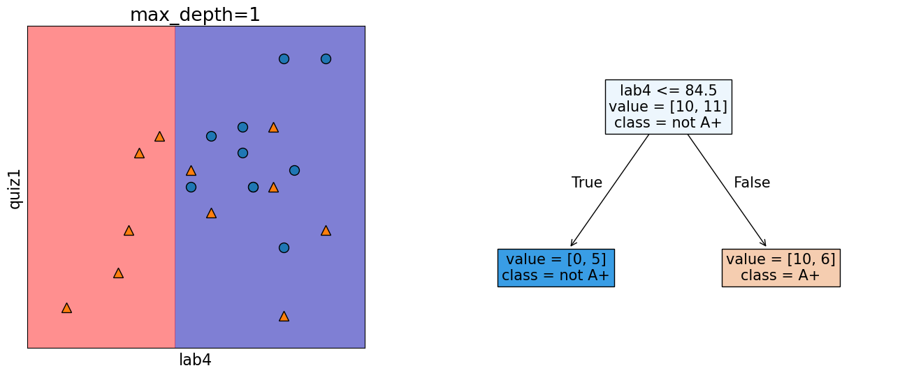

In the following model, this decision boundary is created by asking two
questions.


``` {.python .cell-code}
depth = 2
model = DecisionTreeClassifier(max_depth=depth)
model.fit(X_subset.values, y)
model.score(X_subset.values, y)
print("Error:   %0.3f" % (1 - model.score(X_subset.values, y)))
plot_tree_decision_boundary_and_tree(
    model, X_subset, y, x_label="lab4", y_label="quiz1", fontsize=14
)
```

```
Error:   0.190
```
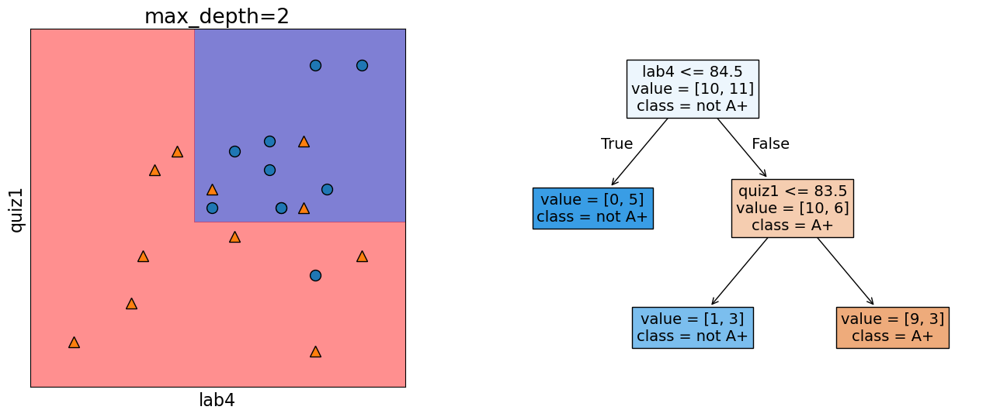

Let's look at the decision boundary with depth = 4.


``` {.python .cell-code}
depth = 4
model = DecisionTreeClassifier(max_depth=depth)
model.fit(X_subset.values, y)
model.score(X_subset.values, y)
print("Error:   %0.3f" % (1 - model.score(X_subset.values, y)))
plot_tree_decision_boundary_and_tree(
    model, X_subset, y, x_label="lab4", y_label="quiz1"
)
```

```
    Error:   0.048
```
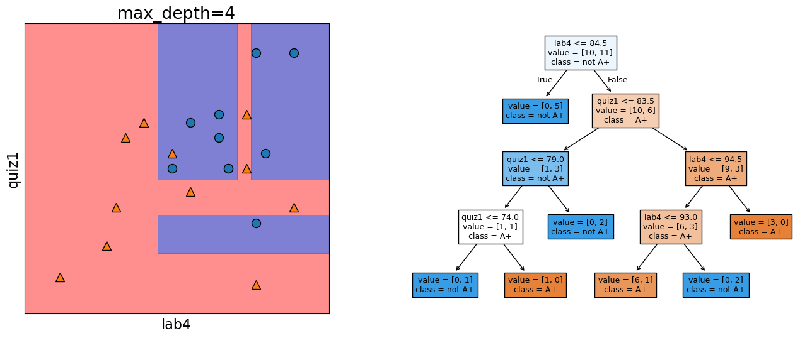

Let's look at the decision boundary with depth = 6.


``` {.python .cell-code}
depth = 6
model = DecisionTreeClassifier(max_depth=depth)
model.fit(X_subset, y)
model.score(X_subset, y)
print("Error:   %0.3f" % (1 - model.score(X_subset, y)))
plot_tree_decision_boundary_and_tree(
    model, X_subset, y, x_label="lab4", y_label="quiz1"
)
```

```
    Error:   0.000


```
    /Users/kvarada/miniforge3/envs/571/lib/python3.12/site-packages/sklearn/base.py:493: UserWarning: X does not have valid feature names, but DecisionTreeClassifier was fitted with feature names
      warnings.warn(


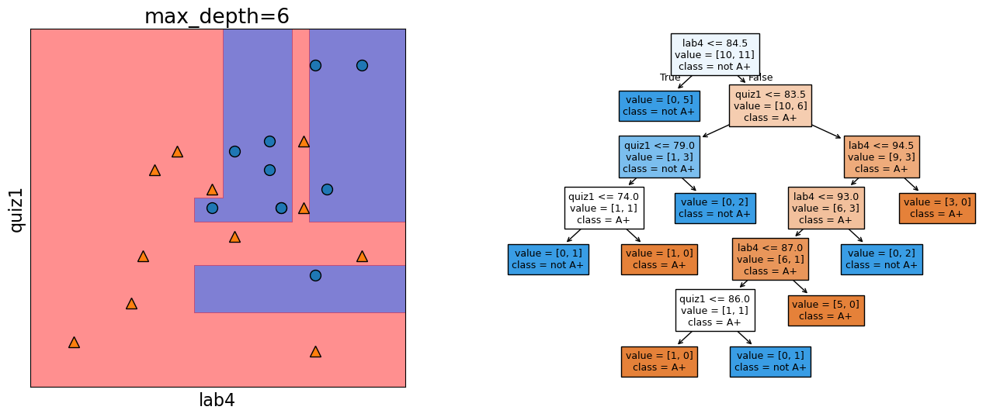


``` {.python .cell-code}
max_depths = np.arange(1, 18)
errors = []
for max_depth in max_depths:
    error = 1 - DecisionTreeClassifier(max_depth=max_depth).fit(X_subset, y).score(
        X_subset, y
    )
    errors.append(error)
plt.plot(max_depths, errors)
plt.xlabel("max depth")
plt.ylabel("error");
```


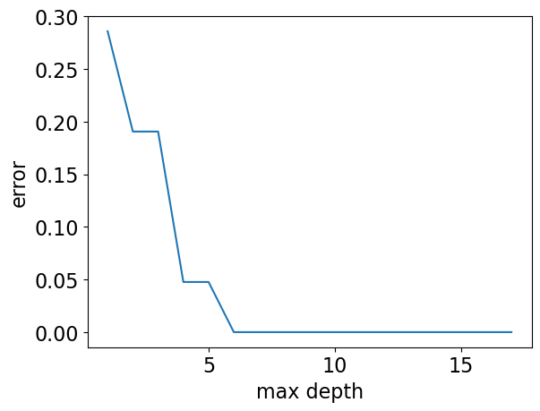

-   Our model has 0% error for depths \>= 6!!
-   But it's also becoming more and more specific and sensitive to the
    training data.\
-   Is it good or bad?

` Note: Although the plot above (complexity hyperparameter vs error) is more popular, we could also look at the same plot flip the $y$-axis, i.e., consider accuracy instead of error.`


``` {.python .cell-code}
max_depths = np.arange(1, 18)
accuracies = []
for max_depth in max_depths:
    accuracy = (
        DecisionTreeClassifier(max_depth=max_depth).fit(X_subset, y).score(X_subset, y)
    )
    accuracies.append(accuracy)
plt.plot(max_depths, accuracies)
plt.xlabel("max depth")
plt.ylabel("accuracy");
```


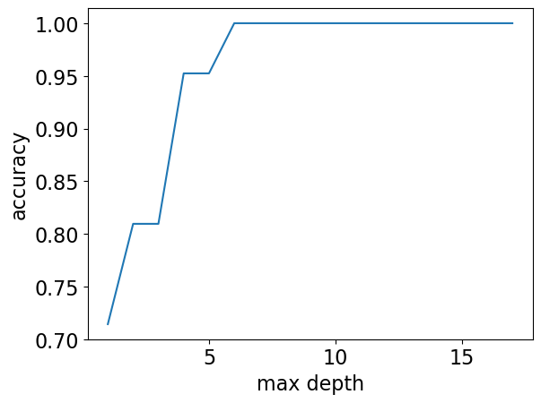

### 🤔 Eva's questions

![[Pasted image 20251006092213.png]]

At this point Eva is wondering about the following questions.

-   How to pick the best depth?
-   How can we make sure that the model we have built would do
    reasonably well on new data in the wild when it's deployed?
-   Which of the following rules learned by the decision tree algorithm
    are likely to generalize better to new data?

> Rule 1: If class_attendance == 1 then grade is A+.

> Rule 2: If lab3 \> 83.5 and quiz1 \<= 83.5 and lab2 \<= 88 then quiz2
> grade is A+

To better understand the material in the next sections, think about
these questions on your own or discuss them with your friend/neighbour
before proceeding.


### Generalization: Fundamental goal of ML

> **To generalize beyond what we see in the training examples**

We only have access to limited amount of training data and we want to
learn a mapping function which would predict targets reasonably well for
examples beyond this training data.

-   Example: Imagine that a learner sees the following images and
    corresponding labels.

![[Pasted image 20251006092417.png]]


### Generalizing to unseen data

-   Now the learner is presented with new images (1 to 4) for
    prediction.
-   What prediction would you expect for each image?

![[Pasted image 20251006092448.png]]

-   Goal: We want the learner to be able to generalize beyond what it
    has seen in the training data.
-   But these new examples should be representative of the training
    data. That is they should have the same characteristics as the
    training data.
-   In this example, we would like the leaner to be able to predict
    labels for test examples 1, 2, and 3 accurately. Although 2, 3 don't
    exactly occur in the training data, they are very much similar to
    the images in the training data. That said, is it fair to expect the
    learner to label image 4 correctly?

### Training error vs. Generalization error

-   Given a model $M$, in ML, people usually talk about two kinds of
    errors of $M$.
    1.  Error on the training data: $error_{training}(M)$
    2.  Error on the entire distribution $D$ of data: $error_{D}(M)$
-   We are interested in the error on the entire distribution
    -   ... But we do not have access to the entire distribution 😞


## Data Splitting \[[video](https://youtu.be/h2AEobwcUQw)\]

### How to approximate generalization error?

A common way is **data splitting**. - Keep aside some randomly selected
portion from the training data. - `fit` (train) a model on the training
portion only. - `score` (assess) the trained model on this set aside
data to get a sense of how well the model would be able to generalize. -
Pretend that the kept aside data is representative of the real
distribution $D$ of data.

![[Pasted image 20251006092526.png]]


``` {.python .cell-code}
# scikit-learn train_test_split
url = "https://scikit-learn.org/stable/modules/generated/sklearn.model_selection.train_test_split.html"
HTML("<iframe src=%s width=1000 height=800></iframe>" % url)
```

```
    /Users/kvarada/miniforge3/envs/571/lib/python3.12/site-packages/IPython/core/display.py:431: UserWarning: Consider using IPython.display.IFrame instead
      warnings.warn("Consider using IPython.display.IFrame instead")
```
-   We can pass `X` and `y` or a dataframe with both `X` and `y` in it.
-   We can also specify the train or test split sizes.

### Simple train/test split

-   The picture shows an 80%-20% split of a toy dataset with 10
    examples.
-   The data is shuffled before splitting.
-   Usually when we do machine learning we split the data before doing
    anything and put the test data in an imaginary chest lock.

![[Pasted image 20251006092558.png]]

``` {.python .cell-code}
# Let's demonstrate this with the canada usa cities data
# The data is available in the data directory
df = pd.read_csv(DATA_DIR + "canada_usa_cities.csv")
X = df.drop(columns=["country"])
y = df["country"]
```


``` {.python .cell-code}
X
```

```
         longitude   latitude
  ------ ----------- ----------
  0      -130.0437   55.9773
  1      -134.4197   58.3019
  2      -123.0780   48.9854
  3      -122.7436   48.9881
  4      -122.2691   48.9951
  \...   \...        \...
  204    -72.7218    45.3990
  205    -66.6458    45.9664
  206    -79.2506    42.9931
  207    -72.9406    45.6275
  208    -79.4608    46.3092
```
```
y
```

```
    0         USA
    1         USA
    2         USA
    3         USA
    4         USA
            ...  
    204    Canada
    205    Canada
    206    Canada
    207    Canada
    208    Canada
    Name: country, Length: 209, dtype: object
```

``` {.python .cell-code}
from sklearn.model_selection import train_test_split

X_train, X_test, y_train, y_test = train_test_split(
    X, y, test_size=0.2, random_state=123
)  # 80%-20% train test split on X and y

# Print shapes
shape_dict = {
    "Data portion": ["X", "y", "X_train", "y_train", "X_test", "y_test"],
    "Shape": [
        X.shape,
        y.shape,
        X_train.shape,
        y_train.shape,
        X_test.shape,
        y_test.shape,
    ],
}

shape_df = pd.DataFrame(shape_dict)
HTML(shape_df.to_html(index=False))
```

```

  Data portion   Shape
  -------------- ----------
  X              (209, 2)
  y              (209,)
  X_train        (167, 2)
  y_train        (167,)
  X_test         (42, 2)
  y_test         (42,)

```
#### Creating `train_df` and `test_df`

-   Sometimes we want to keep the target in the train split for EDA or
    for visualization.


``` {.python .cell-code}
train_df, test_df = train_test_split(
    df, test_size=0.2, random_state=123
)  # 80%-20% train test split on df
X_train, y_train = train_df.drop(columns=["country"]), train_df["country"]
X_test, y_test = test_df.drop(columns=["country"]), test_df["country"]
train_df.head()
```


```
        longitude   latitude   country
  ----- ----------- ---------- ---------
  160   -76.4813    44.2307    Canada
  127   -81.2496    42.9837    Canada
  169   -66.0580    45.2788    Canada
  188   -73.2533    45.3057    Canada
  187   -67.9245    47.1652    Canada

```

``` {.python .cell-code}
mglearn.discrete_scatter(X.iloc[:, 0], X.iloc[:, 1], y, s=8)
plt.xlabel("longitude")
plt.ylabel("latitude");
```


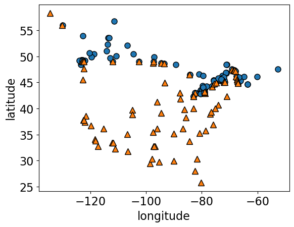


``` {.python .cell-code}
model = DecisionTreeClassifier()
model.fit(X_train, y_train)
custom_plot_tree(model, feature_names = X_train.columns.tolist())
```


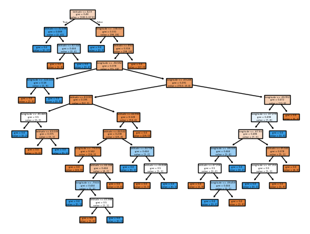

Let's examine the train and test accuracies with the split now.


``` {.python .cell-code}
print("Train accuracy:   %0.3f" % model.score(X_train, y_train))
print("Test accuracy:   %0.3f" % model.score(X_test, y_test))
```

```
    Train accuracy:   1.000
    Test accuracy:   0.762
```

``` {.python .cell-code}
plot_tree_decision_boundary_and_tree(model, X, y, height=10, width=18, eps=10)
```

```
    /Users/kvarada/miniforge3/envs/571/lib/python3.12/site-packages/sklearn/base.py:493: UserWarning: X does not have valid feature names, but DecisionTreeClassifier was fitted with feature names
      warnings.warn(


```
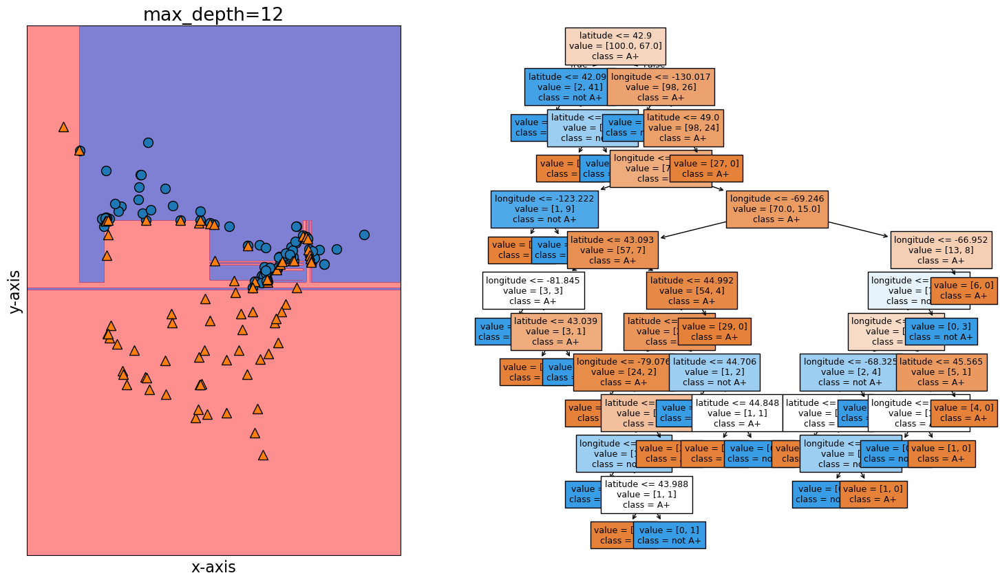

``` {.python .cell-code}
fig, ax = plt.subplots(1, 2, figsize=(16, 6), subplot_kw={"xticks": (), "yticks": ()})
plot_tree_decision_boundary(
    model,
    X_train,
    y_train,
    eps=10,
    x_label="longitude",
    y_label="latitude",
    ax=ax[0],
    title="Decision tree model on the train data",
)
plot_tree_decision_boundary(
    model,
    X_test,
    y_test,
    eps=10,
    x_label="longitude",
    y_label="latitude",
    ax=ax[1],
    title="Decision tree model on the test data",
)
```

```
    /Users/kvarada/miniforge3/envs/571/lib/python3.12/site-packages/sklearn/base.py:493: UserWarning: X does not have valid feature names, but DecisionTreeClassifier was fitted with feature names
      warnings.warn(
    /Users/kvarada/miniforge3/envs/571/lib/python3.12/site-packages/sklearn/base.py:493: UserWarning: X does not have valid feature names, but DecisionTreeClassifier was fitted with feature names
      warnings.warn(


```
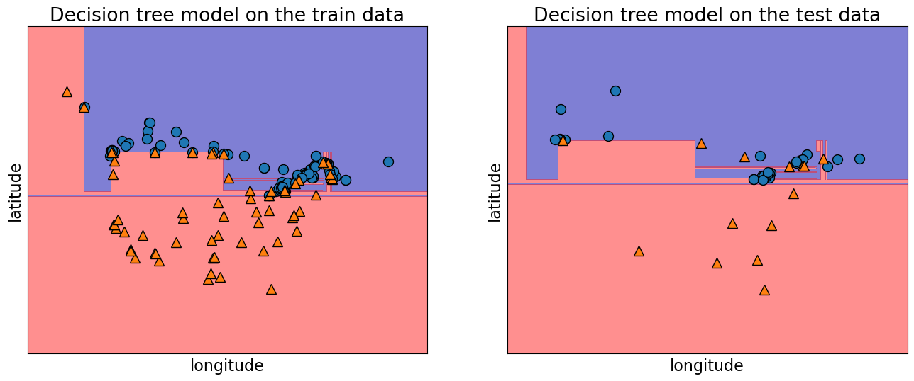

-   Useful arguments of `train_test_split`:
    -   `test_size`
    -   `train_size`
    -   `random_state`

#### `test_size`, `train_size` arguments

-   Let's us specify how we want to split the data.
-   We can specify either of the two. See the documentation
    [here](https://scikit-learn.org/stable/modules/generated/sklearn.model_selection.train_test_split.html).
-   There is no hard and fast rule on what split sizes should we use.
    -   It depends upon how much data is available to you.
-   Some common splits are 90/10, 80/20, 70/30 (training/test).
-   In the above example, we used 80/20 split.

#### `random_state` argument

-   The data is shuffled before splitting which is crucial step. (You
    will explore this in the lab.)
-   The `random_state` argument controls this shuffling.
-   In the example above we used `random_state=123`. If you run this
    notebook with the same `random_state` it should give you exactly the
    same split.
    -   Useful when you want reproducible results.

### Train/validation/test split

-   Some of you may have heard of "validation" data.
-   Sometimes it's a good idea to have a separate data for
    hyperparameter tuning.

![[Pasted image 20251006092742.png]]

-   We will try to use "validation" to refer to data where we have
    access to the target values.
    -   But, unlike the training data, we only use this for
        hyperparameter tuning and model assessment; we don't pass these
        into `fit`.\
-   We will try to use "test" to refer to data where we have access to
    the target values
    -   But, unlike training and validation data, we neither use it in
        training nor hyperparameter optimization.
    -   We only use it **once** to evaluate the performance of the best
        performing model on the validation set.\
    -   We lock it in a "vault" until we're ready to evaluate.

Note that there isn't good concensus on the terminology of what is
validation and what is test.

` Note: Validation data is also referred to as **development data** or **dev set** for short.`

### "Deployment" data

-   After we build and finalize a model, we deploy it, and then the
    model deals with the data in the wild.
-   We will use "deployment" to refer to this data, where we do **not**
    have access to the target values.
-   Deployment error is what we *really* care about.
-   We use validation and test errors as proxies for deployment error,
    and we hope they are similar.
-   So, if our model does well on the validation and test data, we hope
    it will do well on deployment data.

### Summary of train, validation, test, and deployment data

               `fit`   `score`   `predict`
  ------------ ------- --------- -----------
  Train        ✔️      ✔️        ✔️
  Validation           ✔️        ✔️
  Test                 once      once
  Deployment                     ✔️

You can typically expect
$E_{train} < E_{validation} < E_{test} < E_{deployment}$.

## ❓❓ Questions for you

### iClicker Exercise 2.1

**Select all of the following statements which are TRUE.**

-   (A) A decision tree model with no depth (the default `max_depth` in
        `sklearn`) is likely to perform very well on the deployment
        data.
-   (B) Data splitting helps us assess how well our model would
        generalize.
-   (C) Deployment data is only scored once.\
-   (D) Validation data could be used for hyperparameter optimization.
-   (E) It's recommended that data be shuffled before splitting it into
        `train` and `test` sets.

`zmdknhvrvvyx V's Solutions! :class: tip, dropdown`


## Break (5 min)

![[Pasted image 20251006092824.png]]

## Cross-validation \[[video](https://youtu.be/4cv8VYonepA)\]

### Problems with single train/validation split

-   Only using a portion of your data for training and only a portion
    for validation.
-   If your dataset is small you might end up with a tiny training
    and/or validation set.
-   You might be unlucky with your splits such that they don't align
    well or don't well represent your test data.

![[Pasted image 20251006092742.png]]


### Cross-validation to the rescue!!

-   Cross-validation provides a solution to this problem.
-   Split the data into $k$ folds ($k>2$, often $k=10$). In the picture
    below $k=4$.
-   Each "fold" gets a turn at being the validation set.
-   Note that cross-validation doesn't shuffle the data; it's done in
    `train_test_split`.

![[Pasted image 20251006092910.png]]
-   Each fold gives a score and we usually average our $k$ results.
-   It's better to examine the variation in the scores across folds.\
-   Gives a more **robust** measure of error on unseen data.

### Cross-validation using `scikit-learn`


``` {.python .cell-code}
from sklearn.model_selection import cross_val_score, cross_validate
```


#### `cross_val_score`


``` {.python .cell-code}
model = DecisionTreeClassifier(max_depth=4)
cv_scores = cross_val_score(model, X_train, y_train, cv=10)
cv_scores
```

```
    array([0.76470588, 0.82352941, 0.70588235, 0.94117647, 0.82352941,
           0.82352941, 0.70588235, 0.9375    , 0.9375    , 0.9375    ])
```

``` {.python .cell-code}
print(f"Average cross-validation score = {np.mean(cv_scores):.2f}")
print(f"Standard deviation of cross-validation score = {np.std(cv_scores):.2f}")
```

```
    Average cross-validation score = 0.84
    Standard deviation of cross-validation score = 0.09
```
Under the hood

-   It creates `cv` folds on the data.
-   In each fold, it fits the model on the training portion and scores
    on the validation portion.
-   The output is a list of validation scores in each fold.

#### `cross_validate`

-   Similar to `cross_val_score` but more powerful.
-   Gives us access to training and validation scores.


``` {.python .cell-code}
scores = cross_validate(model, X_train, y_train, cv=10, return_train_score=True)
pd.DataFrame(scores)
```

```
      fit_time   score_time   test_score   train_score
  --- ---------- ------------ ------------ -------------
  0   0.001124   0.000589     0.764706     0.913333
  1   0.000699   0.000478     0.823529     0.906667
  2   0.000652   0.000441     0.705882     0.906667
  3   0.000608   0.000427     0.941176     0.900000
  4   0.000602   0.000420     0.823529     0.906667
  5   0.001088   0.000506     0.823529     0.913333
  6   0.000634   0.000434     0.705882     0.920000
  7   0.000609   0.000427     0.937500     0.900662
  8   0.000598   0.000422     0.937500     0.900662
  9   0.000587   0.000419     0.937500     0.900662
```

``` {.python .cell-code}
pd.DataFrame(pd.DataFrame(scores).mean())
```

```
                0
  ------------- ----------
  fit_time      0.000720
  score_time    0.000456
  test_score    0.840074
  train_score   0.906865

```


Keep in mind that cross-validation does not return a model. It is not a way to build a model that can be applied to new data. The purpose of cross-validation is to **evaluate** how well the model will generalize to unseen data. 


Note that both `cross_val_score` and `cross_validate` functions do not shuffle the data. Check out [`StratifiedKFold`](https://scikit-learn.org/stable/modules/generated/sklearn.model_selection.StratifiedKFold.html#sklearn.model_selection.StratifiedKFold), where proportions of classes is the same in each fold as they are in the whole dataset. By default, `sklearn` uses `StratifiedKFold` when carrying out cross-validation for classification problems. 

``` {.python .cell-code}
mglearn.plots.plot_cross_validation()
```


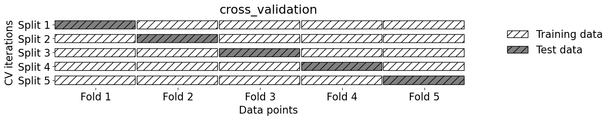

#### Our typical supervised learning set up is as follows:

-   We are given training data with features `X` and target `y`
-   We split the data into train and test portions:
    `X_train, y_train, X_test, y_test`
-   We carry out hyperparameter optimization using cross-validation on
    the train portion: `X_train` and `y_train`.
-   We assess our best performing model on the test portion: `X_test`
    and `y_test`.\
-   What we care about is the **test error**, which tells us how well
    our model can be generalized.
-   If this test error is "reasonable" we deploy the model which will be
    used on new unseen examples.


``` {.python .cell-code}
X_train, X_test, y_train, y_test = train_test_split(X, y, random_state=42)
model = DecisionTreeClassifier(max_depth=10)
scores = cross_validate(model, X_train, y_train, cv=10, return_train_score=True)
pd.DataFrame(scores)
```

```
      fit_time   score_time   test_score   train_score
  --- ---------- ------------ ------------ -------------
  0   0.001078   0.000540     0.937500     1.000000
  1   0.000834   0.000500     0.875000     0.992857
  2   0.000658   0.000437     0.875000     1.000000
  3   0.000785   0.000747     0.687500     1.000000
  4   0.000693   0.000456     0.812500     1.000000
  5   0.000713   0.001212     0.812500     1.000000
  6   0.000674   0.000440     0.866667     0.985816
  7   0.000653   0.000423     0.533333     1.000000
  8   0.000622   0.000418     0.666667     1.000000
  9   0.000602   0.000416     0.733333     1.000000


```


``` {.python .cell-code}
def mean_std_cross_val_scores(model, X_train, y_train, **kwargs):
    """
    Returns mean and std of cross validation
    """
    scores = cross_validate(model, X_train, y_train, **kwargs)

    mean_scores = pd.DataFrame(scores).mean()
    std_scores = pd.DataFrame(scores).std()
    out_col = []

    for i in range(len(mean_scores)):
        out_col.append((f"%0.3f (+/- %0.3f)" % (mean_scores[i], std_scores[i])))

    return pd.Series(data=out_col, index=mean_scores.index)
```


``` {.python .cell-code}
results = {}
results["Decision tree"] = mean_std_cross_val_scores(
    model, X_train, y_train, return_train_score=True
)
pd.DataFrame(results).T
```

```
    /var/folders/b3/g26r0dcx4b35vf3nk31216hc0000gr/T/ipykernel_10817/2246468746.py:12: FutureWarning: Series.__getitem__ treating keys as positions is deprecated. In a future version, integer keys will always be treated as labels (consistent with DataFrame behavior). To access a value by position, use `ser.iloc[pos]`
      out_col.append((f"%0.3f (+/- %0.3f)" % (mean_scores[i], std_scores[i])))


```

```

train_score     fit_time            score_time          test_score          
  --------------- ------------------- ------------------- -------------------
DT  0.001 (+/- 0.000)  0.000 (+/- 0.000)  0.782 (+/- 0.059)  0.992 (+/- 0.014)
```


-   How do we know whether this test score is reasonable?

Exercise 3.3: Cross-validation


## Underfitting, overfitting, the fundamental trade-off, the golden rule [[video](https://youtu.be/Ihay8yE5KTI)]

### Types of errors

Imagine that your train and validation errors do not align with each other. How do you diagnose the problem?  

We're going to think about 4 types of errors:

- $E_\textrm{train}$ is your training error (or mean train error from cross-validation).
- $E_\textrm{valid}$ is your validation error (or mean validation error from cross-validation).
- $E_\textrm{test}$ is your test error.
- $E_\textrm{best}$ is the best possible error you could get for a given problem.

### Underfitting 


``` {.python .cell-code}
model = DecisionTreeClassifier(max_depth=1)  # decision stump
scores = cross_validate(model, X_train, y_train, cv=10, return_train_score=True)
print("Train error:   %0.3f" % (1 - np.mean(scores["train_score"])))
print("Validation error:   %0.3f" % (1 - np.mean(scores["test_score"])))

```
    Train error:   0.188
    Validation error:   0.212

-   If your model is too simple, like `DummyClassifier` or
    `DecisionTreeClassifier` with `max_depth=1`, it's not going to pick
    up on some random quirks in the data but it won't even capture
    useful patterns in the training data.
-   The model won't be very good in general. Both train and validation
    errors would be high. This is **underfitting**.
-   The gap between train and validation error is going to be lower.
-   $E_\textrm{best} \lt E_\textrm{train} \lesssim E_\textrm{valid}$

### Overfitting


``` {.python .cell-code}
model = DecisionTreeClassifier(max_depth=None)
scores = cross_validate(model, X_train, y_train, cv=10, return_train_score=True)
print("Train error:   %0.3f" % (1 - np.mean(scores["train_score"])))
print("Validation error:   %0.3f" % (1 - np.mean(scores["test_score"])))
```

```
    Train error:   0.000
    Validation error:   0.220
```
-   If your model is very complex, like a
    `DecisionTreeClassifier(max_depth=None)`, then you will learn
    unreliable patterns in order to get every single training example
    correct.

-   The training error is going to be very low but there will be a big
    gap between the training error and the validation error. This is
    **overfitting**.

-   In overfitting scenario, usually we'll see:
    $E_\textrm{train} \lt E_\textrm{best}  \lt E_\textrm{valid}$

-   In general, if $E_\textrm{train}$ is low, we are likely to be in the
    overfitting scenario. It is fairly common to have at least a bit of
    this.

-   So the validation error does not necessarily decrease with the
    training error.


``` {.python .cell-code}
X_train, X_test, y_train, y_test = train_test_split(X, y, random_state=1)
results_dict = {
    "depth": [],
    "mean_train_error": [],
    "mean_cv_error": [],
    "std_cv_error": [],
    "std_train_error": [],
}
param_grid = {"max_depth": np.arange(1, 16)}

for depth in param_grid["max_depth"]:
    model = DecisionTreeClassifier(max_depth=depth)
    scores = cross_validate(model, X_train, y_train, cv=10, return_train_score=True)
    results_dict["depth"].append(depth)
    results_dict["mean_cv_error"].append(1 - np.mean(scores["test_score"]))
    results_dict["mean_train_error"].append(1 - np.mean(scores["train_score"]))
    results_dict["std_cv_error"].append(scores["test_score"].std())
    results_dict["std_train_error"].append(scores["train_score"].std())

results_df = pd.DataFrame(results_dict)
results_df = results_df.set_index("depth")
```


``` {.python .cell-code}
results_df[["mean_train_error", "mean_cv_error"]].plot();
```


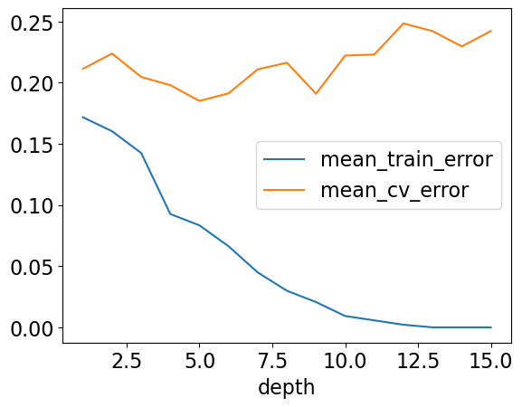

-   Here, for larger depths we observe that the training error is close
    to 0 but validation error goes up and down.
-   As we make more complex models we start encoding random quirks in
    the data, which are not grounded in reality.\
-   These random quirks do not generalize well to new data.
-   This problem of failing to be able to generalize to the validation
    data or test data is called **overfitting**.

### The "fundamental tradeoff" of supervised learning:

**As you increase model complexity, $E_\textrm{train}$ tends to go down
but $E_\textrm{valid}-E_\textrm{train}$ tends to go up.**

### Bias vs variance tradeoff

-   The fundamental trade-off is also called the bias/variance tradeoff
    in supervised machine learning.

**Bias**
:   the tendency to consistently learn the same wrong thing (high bias
    corresponds to underfitting)

**Variance**
:   the tendency to learn random things irrespective of the real signal
    (high variance corresponds to overfitting)


Check out [this article by Pedro Domingos](https://homes.cs.washington.edu/~pedrod/papers/cacm12.pdf) for some approachable explanation on machine learning fundamentals and bias-variance tradeoff. 


### How to pick a model that would generalize better?

-   We want to avoid both underfitting and overfitting.
-   We want to be consistent with the training data but we don't to rely
    too much on it.


![[Pasted image 20251006093549.png]]

[source](https://learning.oreilly.com/library/view/introduction-to-machine/9781449369880/ch02.html#relation-of-model-complexity-to-dataset-size)

-   There are many subtleties here and there is no perfect answer but a
    common practice is to pick the model with minimum cross-validation
    error.


``` {.python .cell-code}
def cross_validate_std(*args, **kwargs):
    """Like cross_validate, except also gives the standard deviation of the score"""
    res = pd.DataFrame(cross_validate(*args, **kwargs))
    res_mean = res.mean()
    res_mean["std_test_score"] = res["test_score"].std()
    if "train_score" in res:
        res_mean["std_train_score"] = res["train_score"].std()
    return res_mean
```


``` {.python .cell-code}
results_df
```

```
          mean_train_error   mean_cv_error   std_cv_error   std_train_error
  ------- ------------------ --------------- -------------- -----------------
  depth                                                     
  1       0.171657           0.211250        0.048378       0.006805
  2       0.160258           0.223750        0.062723       0.007316
  3       0.142467           0.204583        0.053763       0.022848
  4       0.092604           0.197917        0.056955       0.006531
  5       0.083338           0.185000        0.064205       0.010650
  6       0.066251           0.191250        0.072707       0.012019
  7       0.044873           0.210833        0.085192       0.009059
  8       0.029909           0.216250        0.088397       0.009422
  9       0.020653           0.190833        0.096426       0.010294
  10      0.009260           0.222083        0.096358       0.005563
  11      0.005699           0.222917        0.094267       0.004264
  12      0.002143           0.248333        0.089485       0.003273
  13      0.000000           0.242083        0.086932       0.000000
  14      0.000000           0.229583        0.089354       0.000000
  15      0.000000           0.242083        0.086932       0.000000

```


### test score vs. cross-validation score


``` {.python .cell-code}
best_depth = results_df.index.values[np.argmin(results_df["mean_cv_error"])]
print(
    "The minimum validation error is %0.3f at max_depth = %d "
    % (
        np.min(results_df["mean_cv_error"]),
        best_depth,
    )
)
```

```
    The minimum validation error is 0.185 at max_depth = 5 
```
-   Let's pick `max_depth`= 5 and try this model on the test set.


``` {.python .cell-code}
model = DecisionTreeClassifier(max_depth=best_depth)
model.fit(X_train, y_train)
print(f"Error on test set: {1 - model.score(X_test, y_test):.2f}")
```

```
    Error on test set: 0.19
```
-   The test error is comparable with the cross-validation error.
-   Do we feel confident that this model would give similar performace
    when deployed?

### The golden rule 

-   Even though we care the most about test error **THE TEST DATA CANNOT
    INFLUENCE THE TRAINING PHASE IN ANY WAY**.
-   We have to be very careful not to violate it while developing our ML
    pipeline.
-   Even experts end up breaking it sometimes which leads to misleading
    results and lack of generalization on the real data.

#### Golden rule violation: Example 1

![[Pasted image 20251006093817.png]]


... He attempted to reproduce the research, and found a major flaw:
there was some overlap in the data used to both train and test the
model.

#### Golden rule violation: Example 2

![[Pasted image 20251006093924.png]]

... The Challenge rules state that you must only test your code twice a
week, because there's an element of chance to the results. Baidu has
admitted that it used multiple email accounts to test its code roughly
200 times in just under six months -- over four times what the rules
allow.

### How can we avoid violating golden rule?

-   Recall that when we split data, we put our test set in an imaginary
    vault.

![[Pasted image 20251006092558.png]]

### Here is the workflow we'll generally follow.

-   **Splitting**: Before doing anything, split the data `X` and `y`
    into `X_train`, `X_test`, `y_train`, `y_test` or `train_df` and
    `test_df` using `train_test_split`.
-   **Select the best model using cross-validation**: Use
    `cross_validate` with `return_train_score = True` so that we can get
    access to training scores in each fold. (If we want to plot train vs
    validation error plots, for instance.)
-   **Scoring on test data**: Finally score on the test data with the
    chosen hyperparameters to examine the generalization performance.

**Again, there are many subtleties here we'll discuss the golden rule
multiple times throughout the course.**


## ❓❓ Questions for you

### iClicker Exercise 2.2

**Select all of the following statements which are TRUE.**

-   (A) $k$-fold cross-validation calls fit $k$ times.
-   (B) We use cross-validation to get a more robust estimate of model
        performance.
-   (C) If the mean train accuracy is much higher than the mean
        cross-validation accuracy it's likely to be a case of
        overfitting.
-   (D) The fundamental tradeoff of ML states that as training error
        goes down, validation error goes up.
-   (E) A decision stump on a complicated classification problem is
        likely to underfit.

 V's Solutions! :class: tip, dropdown


    ### iClicker Exercise 2.3

    Which of the following scenarios do **NOT necessarily imply overfitting**? 


    - (A) Training accuracy is 0.98 while validation accuracy is 0.60.
    - (B) The model is too specific to the training data. 
    - (C) The decision boundary of a classifier is wiggly and highly irregular.
    - (D) Training and validation accuracies are both approximately 0.88. 

    ```{admonition} V's Solutions!
    :class: tip, dropdown

### iClicker Exercise 2.4

Which of the following statements about **overfitting** is true?

-   (A) Overfitting is always beneficial for model performance on unseen
        data.
-   (B) Some degree of overfitting is common in most real-world
        problems.
-   (C) Overfitting ensures the model will perform well in real-world
        scenarios.
-   (D) Overfitting occurs when the model learns the training data too
        closely, including its noise and outliers.

` V's Solutions! :class: tip, dropdown`

### iClicker Exercise 2.5

How might one address the issue of **underfitting** in a machine
learning model.

-   (A) Introduce more noise to the training data.
-   (B) Remove features that might be relevant to the prediction.
-   (C) Increase the model's complexity, possibly by adding more
        parameter or features
-   (D) Use a smaller dataset for training.

V's Solutions! :class: tip, dropdown


## Summary and reflection

### What did we learn today?

-   Importance of generalization in supervised machine learning
-   Data splitting as a way to approximate generalization error
-   Train, test, validation, deployment data
-   Cross-validation
-   A typical sequence of steps to train supervised machine learning
    models
    -   training the model on the train split
    -   tuning hyperparamters using the validation split
    -   checking the generalization performance on the test split
-   Overfitting, underfitting, the fundamental tradeoff, and the golden
    rule.

### Coming up ...

-   KNNs, SVM RBFs
-   Preprocessing
    -   Imputation
    -   Scaling
    -   One-hot encoding
    -   `sklearn` pipelines


