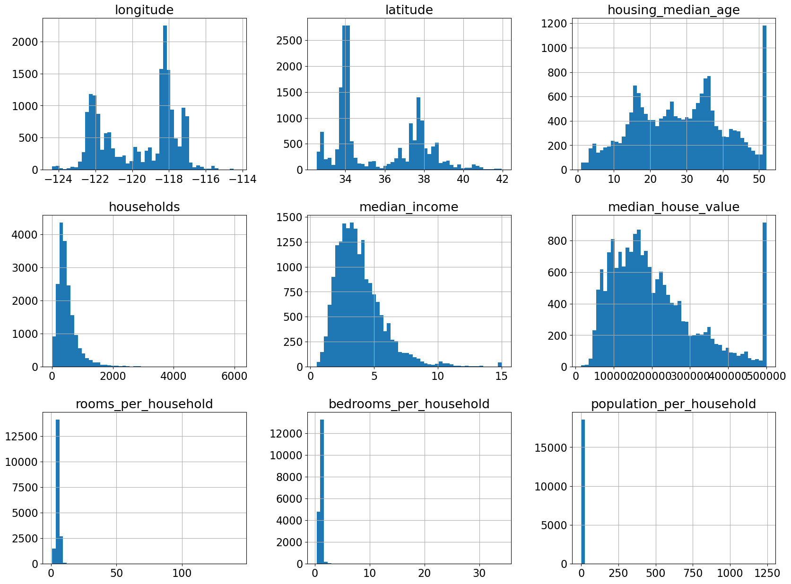
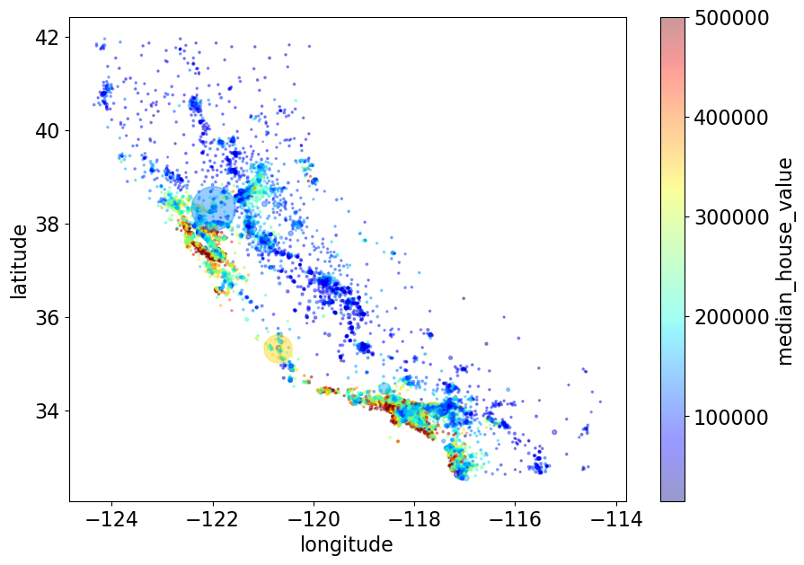
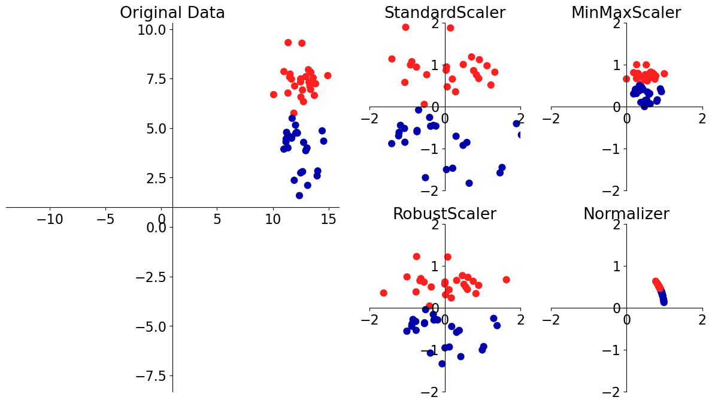
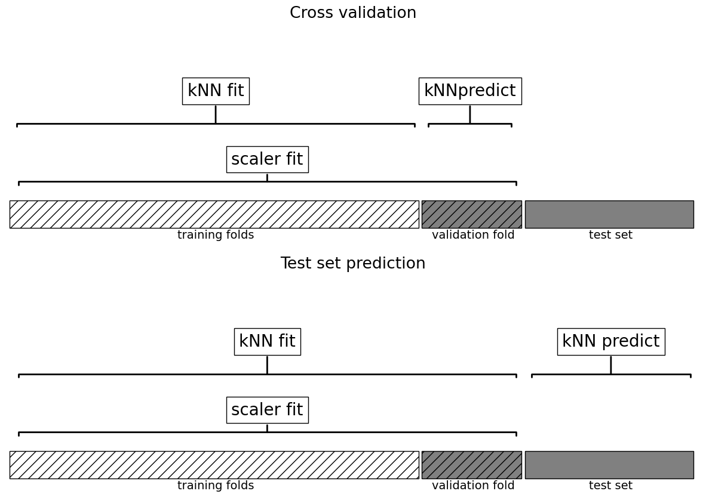
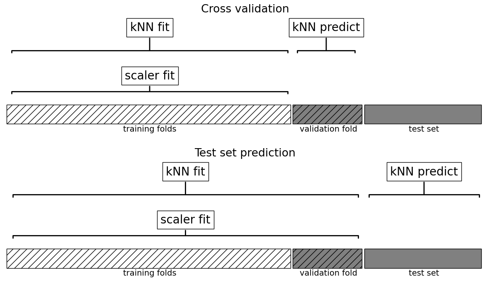

# Lecture 4: Preprocessing, `sklearn` Pipeline, `sklearn` ColumnTrasnsformer

UBC Master of Data Science program, 2025-26

## Imports and LOs

### Imports


```python
import sys, os
import time

import matplotlib.pyplot as plt

%matplotlib inline
import numpy as np
import pandas as pd
from IPython.display import HTML

sys.path.append(os.path.join(os.path.abspath(".."), "code"))

import mglearn
from IPython.display import display
from plotting_functions import *

# Classifiers and regressors
from sklearn.dummy import DummyClassifier, DummyRegressor

# Preprocessing and pipeline
from sklearn.impute import SimpleImputer

# train test split and cross validation
from sklearn.model_selection import cross_val_score, cross_validate, train_test_split
from sklearn.neighbors import KNeighborsClassifier, KNeighborsRegressor
from sklearn.pipeline import Pipeline, make_pipeline
from sklearn.compose import ColumnTransformer, make_column_transformer
from sklearn.preprocessing import (
    MinMaxScaler,
    OneHotEncoder,
    OrdinalEncoder,
    StandardScaler,
)
from sklearn.svm import SVC
from sklearn.tree import DecisionTreeClassifier
from utils import *

pd.set_option("display.max_colwidth", 200)
DATA_DIR = DATA_DIR = os.path.join(os.path.abspath(".."), "data/")
```

### Learning outcomes

From this lecture, you will be able to 

- explain motivation for preprocessing in supervised machine learning;
- identify when to implement feature transformations such as imputation, scaling, and one-hot encoding in a machine learning model development pipeline; 
- use `sklearn` transformers for applying feature transformations on your dataset;
- discuss golden rule in the context of feature transformations;
- use `sklearn.pipeline.Pipeline` and `sklearn.pipeline.make_pipeline` to build a preliminary machine learning pipeline. 
- use `ColumnTransformer` to build all our transformations together into one object and use it with `sklearn` pipelines;
- define `ColumnTransformer` where transformers contain more than one steps;

## ❓❓ Questions for you 

### (iClicker) Exercise 4.1

Take a guess: In your machine learning project, how much time will you typically spend on data preparation and transformation?

- (A) ~80% of the project time 
- (B) ~20% of the project time
- (C) ~50% of the project time 
- (D) None. Most of the time will be spent on model building.
    
The question is adapted from [here](https://developers.google.com/machine-learning/data-prep/process). 

## Motivation and big picture [[video](https://youtu.be/xx9HlmzORRk)]

- So far we have seen
    - Three ML models (decision trees, $k$-NNs, SVMs with RBF kernel)
    - ML fundamentals (train-validation-test split, cross-validation, the fundamental tradeoff, the golden rule)
- Are we ready to do machine learning on real-world datasets?
    - Very often real-world datasets need preprocessing before we use them to build ML models. 

### Example: $k$-nearest neighbours on the Spotify dataset

- In lab1 you used `DecisionTreeClassifier` to predict whether the user would like a particular song or not. 
- Can we use $k$-NN classifier for this task? 
- Intuition: To predict whether the user likes a particular song or not (query point) 
   - find the songs that are closest to the query point
   - let them vote on the target
   - take the majority vote as the target for the query point   

In order to run the code below, you need to download the dataset from [Kaggle](https://www.kaggle.com/geomack/spotifyclassification/download).


```python
spotify_df = pd.read_csv(DATA_DIR + "spotify.csv", index_col=0)
train_df, test_df = train_test_split(spotify_df, test_size=0.20, random_state=123)
X_train, y_train = (
    train_df.drop(columns=["song_title", "artist", "target"]),
    train_df["target"],
)
X_test, y_test = (
    test_df.drop(columns=["song_title", "artist", "target"]),
    test_df["target"],
)
```


```python
dummy = DummyClassifier(strategy="most_frequent")
scores = cross_validate(dummy, X_train, y_train, return_train_score=True)
print("Mean validation score %0.3f" % (np.mean(scores["test_score"])))
pd.DataFrame(scores)
```

    Mean validation score 0.508
    


<div>
<style scoped>
    .dataframe tbody tr th:only-of-type {
        vertical-align: middle;
    }

    .dataframe tbody tr th {
        vertical-align: top;
    }

    .dataframe thead th {
        text-align: right;
    }
</style>
<table border="1" class="dataframe">
  <thead>
    <tr style="text-align: right;">
      <th></th>
      <th>fit_time</th>
      <th>score_time</th>
      <th>test_score</th>
      <th>train_score</th>
    </tr>
  </thead>
  <tbody>
    <tr>
      <th>0</th>
      <td>0.000504</td>
      <td>0.000338</td>
      <td>0.507740</td>
      <td>0.507752</td>
    </tr>
    <tr>
      <th>1</th>
      <td>0.000904</td>
      <td>0.000362</td>
      <td>0.507740</td>
      <td>0.507752</td>
    </tr>
    <tr>
      <th>2</th>
      <td>0.000414</td>
      <td>0.000523</td>
      <td>0.507740</td>
      <td>0.507752</td>
    </tr>
    <tr>
      <th>3</th>
      <td>0.000289</td>
      <td>0.000255</td>
      <td>0.506211</td>
      <td>0.508133</td>
    </tr>
    <tr>
      <th>4</th>
      <td>0.000376</td>
      <td>0.000282</td>
      <td>0.509317</td>
      <td>0.507359</td>
    </tr>
  </tbody>
</table>
</div>


```python
knn = KNeighborsClassifier()
scores = cross_validate(knn, X_train, y_train, return_train_score=True)
print("Mean validation score %0.3f" % (np.mean(scores["test_score"])))
pd.DataFrame(scores)
```

    Mean validation score 0.546
    


<div>
<style scoped>
    .dataframe tbody tr th:only-of-type {
        vertical-align: middle;
    }

    .dataframe tbody tr th {
        vertical-align: top;
    }

    .dataframe thead th {
        text-align: right;
    }
</style>
<table border="1" class="dataframe">
  <thead>
    <tr style="text-align: right;">
      <th></th>
      <th>fit_time</th>
      <th>score_time</th>
      <th>test_score</th>
      <th>train_score</th>
    </tr>
  </thead>
  <tbody>
    <tr>
      <th>0</th>
      <td>0.001290</td>
      <td>0.001616</td>
      <td>0.563467</td>
      <td>0.717829</td>
    </tr>
    <tr>
      <th>1</th>
      <td>0.000948</td>
      <td>0.001603</td>
      <td>0.535604</td>
      <td>0.721705</td>
    </tr>
    <tr>
      <th>2</th>
      <td>0.000829</td>
      <td>0.001325</td>
      <td>0.529412</td>
      <td>0.708527</td>
    </tr>
    <tr>
      <th>3</th>
      <td>0.000915</td>
      <td>0.001367</td>
      <td>0.537267</td>
      <td>0.721921</td>
    </tr>
    <tr>
      <th>4</th>
      <td>0.001003</td>
      <td>0.001709</td>
      <td>0.562112</td>
      <td>0.711077</td>
    </tr>
  </tbody>
</table>
</div>


```python
two_songs = X_train.sample(2, random_state=42)
two_songs
```


<div>
<style scoped>
    .dataframe tbody tr th:only-of-type {
        vertical-align: middle;
    }

    .dataframe tbody tr th {
        vertical-align: top;
    }

    .dataframe thead th {
        text-align: right;
    }
</style>
<table border="1" class="dataframe">
  <thead>
    <tr style="text-align: right;">
      <th></th>
      <th>acousticness</th>
      <th>danceability</th>
      <th>duration_ms</th>
      <th>energy</th>
      <th>instrumentalness</th>
      <th>key</th>
      <th>liveness</th>
      <th>loudness</th>
      <th>mode</th>
      <th>speechiness</th>
      <th>tempo</th>
      <th>time_signature</th>
      <th>valence</th>
    </tr>
  </thead>
  <tbody>
    <tr>
      <th>842</th>
      <td>0.229000</td>
      <td>0.494</td>
      <td>147893</td>
      <td>0.666</td>
      <td>0.000057</td>
      <td>9</td>
      <td>0.0469</td>
      <td>-9.743</td>
      <td>0</td>
      <td>0.0351</td>
      <td>140.832</td>
      <td>4.0</td>
      <td>0.704</td>
    </tr>
    <tr>
      <th>654</th>
      <td>0.000289</td>
      <td>0.771</td>
      <td>227143</td>
      <td>0.949</td>
      <td>0.602000</td>
      <td>8</td>
      <td>0.5950</td>
      <td>-4.712</td>
      <td>1</td>
      <td>0.1750</td>
      <td>111.959</td>
      <td>4.0</td>
      <td>0.372</td>
    </tr>
  </tbody>
</table>
</div>


```python
euclidean_distances(two_songs)
```


    array([[    0.        , 79250.00543825],
           [79250.00543825,     0.        ]])


Let's consider only two features: `duration_ms` and `tempo`.


```python
two_songs_subset = two_songs[["duration_ms", "tempo"]]
two_songs_subset
```


<div>
<style scoped>
    .dataframe tbody tr th:only-of-type {
        vertical-align: middle;
    }

    .dataframe tbody tr th {
        vertical-align: top;
    }

    .dataframe thead th {
        text-align: right;
    }
</style>
<table border="1" class="dataframe">
  <thead>
    <tr style="text-align: right;">
      <th></th>
      <th>duration_ms</th>
      <th>tempo</th>
    </tr>
  </thead>
  <tbody>
    <tr>
      <th>842</th>
      <td>147893</td>
      <td>140.832</td>
    </tr>
    <tr>
      <th>654</th>
      <td>227143</td>
      <td>111.959</td>
    </tr>
  </tbody>
</table>
</div>


```python
euclidean_distances(two_songs_subset)
```


    array([[    0.        , 79250.00525962],
           [79250.00525962,     0.        ]])


Do you see any problem? 

- The distance is completely dominated by the the features with larger values
- The features with smaller values are being ignored. 
- Does it matter? 
    - Yes! Scale is based on how data was collected. 
    - Features on a smaller scale can be highly informative and there is no good reason to ignore them.
    - We want our model to be robust and not sensitive to the scale. 
- Was this a problem for decision trees?


### Scaling using `scikit-learn`'s [`StandardScaler`](https://scikit-learn.org/stable/modules/generated/sklearn.preprocessing.StandardScaler.html)

- We'll use `scikit-learn`'s [`StandardScaler`](https://scikit-learn.org/stable/modules/generated/sklearn.preprocessing.StandardScaler.html), which is a `transformer`.   
- Only focus on the syntax for now. We'll talk about scaling in a bit. 


```python
from sklearn.preprocessing import StandardScaler

scaler = StandardScaler()  # create feature trasformer object
scaler.fit(X_train)  # fitting the transformer on the train split
X_train_scaled = scaler.transform(X_train)  # transforming the train split
X_test_scaled = scaler.transform(X_test)  # transforming the test split
```


```python
X_train # original X_train
```


<div>
<style scoped>
    .dataframe tbody tr th:only-of-type {
        vertical-align: middle;
    }

    .dataframe tbody tr th {
        vertical-align: top;
    }

    .dataframe thead th {
        text-align: right;
    }
</style>
<table border="1" class="dataframe">
  <thead>
    <tr style="text-align: right;">
      <th></th>
      <th>acousticness</th>
      <th>danceability</th>
      <th>duration_ms</th>
      <th>energy</th>
      <th>instrumentalness</th>
      <th>key</th>
      <th>liveness</th>
      <th>loudness</th>
      <th>mode</th>
      <th>speechiness</th>
      <th>tempo</th>
      <th>time_signature</th>
      <th>valence</th>
    </tr>
  </thead>
  <tbody>
    <tr>
      <th>1505</th>
      <td>0.004770</td>
      <td>0.585</td>
      <td>214740</td>
      <td>0.614</td>
      <td>0.000155</td>
      <td>10</td>
      <td>0.0762</td>
      <td>-5.594</td>
      <td>0</td>
      <td>0.0370</td>
      <td>114.059</td>
      <td>4.0</td>
      <td>0.2730</td>
    </tr>
    <tr>
      <th>813</th>
      <td>0.114000</td>
      <td>0.665</td>
      <td>216728</td>
      <td>0.513</td>
      <td>0.303000</td>
      <td>0</td>
      <td>0.1220</td>
      <td>-7.314</td>
      <td>1</td>
      <td>0.3310</td>
      <td>100.344</td>
      <td>3.0</td>
      <td>0.0373</td>
    </tr>
    <tr>
      <th>615</th>
      <td>0.030200</td>
      <td>0.798</td>
      <td>216585</td>
      <td>0.481</td>
      <td>0.000000</td>
      <td>7</td>
      <td>0.1280</td>
      <td>-10.488</td>
      <td>1</td>
      <td>0.3140</td>
      <td>127.136</td>
      <td>4.0</td>
      <td>0.6400</td>
    </tr>
    <tr>
      <th>319</th>
      <td>0.106000</td>
      <td>0.912</td>
      <td>194040</td>
      <td>0.317</td>
      <td>0.000208</td>
      <td>6</td>
      <td>0.0723</td>
      <td>-12.719</td>
      <td>0</td>
      <td>0.0378</td>
      <td>99.346</td>
      <td>4.0</td>
      <td>0.9490</td>
    </tr>
    <tr>
      <th>320</th>
      <td>0.021100</td>
      <td>0.697</td>
      <td>236456</td>
      <td>0.905</td>
      <td>0.893000</td>
      <td>6</td>
      <td>0.1190</td>
      <td>-7.787</td>
      <td>0</td>
      <td>0.0339</td>
      <td>119.977</td>
      <td>4.0</td>
      <td>0.3110</td>
    </tr>
    <tr>
      <th>...</th>
      <td>...</td>
      <td>...</td>
      <td>...</td>
      <td>...</td>
      <td>...</td>
      <td>...</td>
      <td>...</td>
      <td>...</td>
      <td>...</td>
      <td>...</td>
      <td>...</td>
      <td>...</td>
      <td>...</td>
    </tr>
    <tr>
      <th>2012</th>
      <td>0.001060</td>
      <td>0.584</td>
      <td>274404</td>
      <td>0.932</td>
      <td>0.002690</td>
      <td>1</td>
      <td>0.1290</td>
      <td>-3.501</td>
      <td>1</td>
      <td>0.3330</td>
      <td>74.976</td>
      <td>4.0</td>
      <td>0.2110</td>
    </tr>
    <tr>
      <th>1346</th>
      <td>0.000021</td>
      <td>0.535</td>
      <td>203500</td>
      <td>0.974</td>
      <td>0.000149</td>
      <td>10</td>
      <td>0.2630</td>
      <td>-3.566</td>
      <td>0</td>
      <td>0.1720</td>
      <td>116.956</td>
      <td>4.0</td>
      <td>0.4310</td>
    </tr>
    <tr>
      <th>1406</th>
      <td>0.503000</td>
      <td>0.410</td>
      <td>256333</td>
      <td>0.648</td>
      <td>0.000000</td>
      <td>7</td>
      <td>0.2190</td>
      <td>-4.469</td>
      <td>1</td>
      <td>0.0362</td>
      <td>60.391</td>
      <td>4.0</td>
      <td>0.3420</td>
    </tr>
    <tr>
      <th>1389</th>
      <td>0.705000</td>
      <td>0.894</td>
      <td>222307</td>
      <td>0.161</td>
      <td>0.003300</td>
      <td>4</td>
      <td>0.3120</td>
      <td>-14.311</td>
      <td>1</td>
      <td>0.0880</td>
      <td>104.968</td>
      <td>4.0</td>
      <td>0.8180</td>
    </tr>
    <tr>
      <th>1534</th>
      <td>0.623000</td>
      <td>0.470</td>
      <td>394920</td>
      <td>0.156</td>
      <td>0.187000</td>
      <td>2</td>
      <td>0.1040</td>
      <td>-17.036</td>
      <td>1</td>
      <td>0.0399</td>
      <td>118.176</td>
      <td>4.0</td>
      <td>0.0591</td>
    </tr>
  </tbody>
</table>
<p>1613 rows × 13 columns</p>
</div>


Let's examine transformed value of the energy feature in the first row. 


```python
X_train['energy'].iloc[0] 
```


    np.float64(0.614)


```python
(X_train['energy'].iloc[0] - np.mean(X_train['energy']))/ X_train['energy'].std()
```


    np.float64(-0.3180174485124284)


```python
pd.DataFrame(X_train_scaled, columns=X_train.columns, index=X_train.index).head().round(3)
```


<div>
<style scoped>
    .dataframe tbody tr th:only-of-type {
        vertical-align: middle;
    }

    .dataframe tbody tr th {
        vertical-align: top;
    }

    .dataframe thead th {
        text-align: right;
    }
</style>
<table border="1" class="dataframe">
  <thead>
    <tr style="text-align: right;">
      <th></th>
      <th>acousticness</th>
      <th>danceability</th>
      <th>duration_ms</th>
      <th>energy</th>
      <th>instrumentalness</th>
      <th>key</th>
      <th>liveness</th>
      <th>loudness</th>
      <th>mode</th>
      <th>speechiness</th>
      <th>tempo</th>
      <th>time_signature</th>
      <th>valence</th>
    </tr>
  </thead>
  <tbody>
    <tr>
      <th>1505</th>
      <td>-0.698</td>
      <td>-0.195</td>
      <td>-0.399</td>
      <td>-0.318</td>
      <td>-0.492</td>
      <td>1.276</td>
      <td>-0.738</td>
      <td>0.396</td>
      <td>-1.281</td>
      <td>-0.618</td>
      <td>-0.294</td>
      <td>0.139</td>
      <td>-0.908</td>
    </tr>
    <tr>
      <th>813</th>
      <td>-0.276</td>
      <td>0.296</td>
      <td>-0.374</td>
      <td>-0.796</td>
      <td>0.598</td>
      <td>-1.487</td>
      <td>-0.439</td>
      <td>-0.052</td>
      <td>0.781</td>
      <td>2.728</td>
      <td>-0.803</td>
      <td>-3.781</td>
      <td>-1.861</td>
    </tr>
    <tr>
      <th>615</th>
      <td>-0.600</td>
      <td>1.111</td>
      <td>-0.376</td>
      <td>-0.947</td>
      <td>-0.493</td>
      <td>0.447</td>
      <td>-0.400</td>
      <td>-0.879</td>
      <td>0.781</td>
      <td>2.535</td>
      <td>0.191</td>
      <td>0.139</td>
      <td>0.576</td>
    </tr>
    <tr>
      <th>319</th>
      <td>-0.307</td>
      <td>1.809</td>
      <td>-0.654</td>
      <td>-1.722</td>
      <td>-0.492</td>
      <td>0.170</td>
      <td>-0.763</td>
      <td>-1.461</td>
      <td>-1.281</td>
      <td>-0.609</td>
      <td>-0.840</td>
      <td>0.139</td>
      <td>1.825</td>
    </tr>
    <tr>
      <th>320</th>
      <td>-0.635</td>
      <td>0.492</td>
      <td>-0.131</td>
      <td>1.057</td>
      <td>2.723</td>
      <td>0.170</td>
      <td>-0.458</td>
      <td>-0.176</td>
      <td>-1.281</td>
      <td>-0.653</td>
      <td>-0.074</td>
      <td>0.139</td>
      <td>-0.754</td>
    </tr>
  </tbody>
</table>
</div>


### `fit` and `transform` paradigm for transformers
- `sklearn` uses `fit` and `transform` paradigms for feature transformations. 
- We `fit` the transformer on the train split and then transform the train split as well as the test split. 
- We apply the same transformations on the test split. 

### `sklearn` API summary: estimators

Suppose `model` is a classification or regression model. 

```
model.fit(X_train, y_train)
X_train_predictions = model.predict(X_train)
X_test_predictions = model.predict(X_test)
```    


### `sklearn` API summary: transformers

Suppose `transformer` is a transformer used to change the input representation, for example, to tackle missing values or to scales numeric features.

```
transformer.fit(X_train, [y_train])
X_train_transformed = transformer.transform(X_train)
X_test_transformed = transformer.transform(X_test)
```  

- You can pass `y_train` in `fit` but it's usually ignored. It allows you to pass it just to be consistent with usual usage of `sklearn`'s `fit` method.   
- You can also carry out fitting and transforming in one call using `fit_transform`. But be mindful to use it only on the train split and **not** on the test split. 

- Do you expect `DummyClassifier` results to change after scaling the data? 
- Let's check whether scaling makes any difference for $k$-NNs. 


```python
knn_unscaled = KNeighborsClassifier()
knn_unscaled.fit(X_train, y_train)
print("Train score: %0.3f" % (knn_unscaled.score(X_train, y_train)))
print("Test score: %0.3f" % (knn_unscaled.score(X_test, y_test)))
```

    Train score: 0.726
    Test score: 0.552
    


```python
knn_scaled = KNeighborsClassifier()
knn_scaled.fit(X_train_scaled, y_train)
print("Train score: %0.3f" % (knn_scaled.score(X_train_scaled, y_train)))
print("Test score: %0.3f" % (knn_scaled.score(X_test_scaled, y_test)))
```

    Train score: 0.798
    Test score: 0.686
    

- The scores with scaled data are better compared to the unscaled data in case of $k$-NNs.
- I am not carrying out cross-validation here for a reason that we'll look into soon. 
- Note that I am a bit sloppy here and using the test set several times for teaching purposes. But when you build an ML pipeline, please do assessment on the test set only once.  

### Common preprocessing techniques

Some commonly performed feature transformation include:  
- Imputation: Tackling missing values
- Scaling: Scaling of numeric features
- One-hot encoding: Tackling categorical variables      
    

We can have one lecture on each of them! In this lesson our goal is to getting familiar with them so that we can use them to build ML pipelines. 

In the next part of this lecture, we'll build an ML pipeline using [California housing prices regression dataset](https://www.kaggle.com/harrywang/housing). In the process, we will talk about different feature transformations and how can we apply them so that we do not violate the golden rule. 

<br><br><br><br>

## Imputation and scaling [[video](https://youtu.be/G2IXbVzKlt8)]

### Dataset, splitting, and baseline

We'll be working on [California housing prices regression dataset](https://www.kaggle.com/harrywang/housing) to demonstrate these feature transformation techniques. The task is to predict median house values in Californian districts, given a number of features from these districts. If you are running the notebook on your own, you'll have to download the data and put it in the data directory. 


```python
housing_df = pd.read_csv(DATA_DIR + "housing.csv")
train_df, test_df = train_test_split(housing_df, test_size=0.1, random_state=123)

train_df.head()
```


<div>
<style scoped>
    .dataframe tbody tr th:only-of-type {
        vertical-align: middle;
    }

    .dataframe tbody tr th {
        vertical-align: top;
    }

    .dataframe thead th {
        text-align: right;
    }
</style>
<table border="1" class="dataframe">
  <thead>
    <tr style="text-align: right;">
      <th></th>
      <th>longitude</th>
      <th>latitude</th>
      <th>housing_median_age</th>
      <th>total_rooms</th>
      <th>total_bedrooms</th>
      <th>population</th>
      <th>households</th>
      <th>median_income</th>
      <th>median_house_value</th>
      <th>ocean_proximity</th>
    </tr>
  </thead>
  <tbody>
    <tr>
      <th>6051</th>
      <td>-117.75</td>
      <td>34.04</td>
      <td>22.0</td>
      <td>2948.0</td>
      <td>636.0</td>
      <td>2600.0</td>
      <td>602.0</td>
      <td>3.1250</td>
      <td>113600.0</td>
      <td>INLAND</td>
    </tr>
    <tr>
      <th>20113</th>
      <td>-119.57</td>
      <td>37.94</td>
      <td>17.0</td>
      <td>346.0</td>
      <td>130.0</td>
      <td>51.0</td>
      <td>20.0</td>
      <td>3.4861</td>
      <td>137500.0</td>
      <td>INLAND</td>
    </tr>
    <tr>
      <th>14289</th>
      <td>-117.13</td>
      <td>32.74</td>
      <td>46.0</td>
      <td>3355.0</td>
      <td>768.0</td>
      <td>1457.0</td>
      <td>708.0</td>
      <td>2.6604</td>
      <td>170100.0</td>
      <td>NEAR OCEAN</td>
    </tr>
    <tr>
      <th>13665</th>
      <td>-117.31</td>
      <td>34.02</td>
      <td>18.0</td>
      <td>1634.0</td>
      <td>274.0</td>
      <td>899.0</td>
      <td>285.0</td>
      <td>5.2139</td>
      <td>129300.0</td>
      <td>INLAND</td>
    </tr>
    <tr>
      <th>14471</th>
      <td>-117.23</td>
      <td>32.88</td>
      <td>18.0</td>
      <td>5566.0</td>
      <td>1465.0</td>
      <td>6303.0</td>
      <td>1458.0</td>
      <td>1.8580</td>
      <td>205000.0</td>
      <td>NEAR OCEAN</td>
    </tr>
  </tbody>
</table>
</div>


Some column values are mean/median but some are not. 

Let's add some new features to the dataset which could help predicting the target: `median_house_value`. 


```python
train_df = train_df.assign(
    rooms_per_household=train_df["total_rooms"] / train_df["households"]
)
test_df = test_df.assign(
    rooms_per_household=test_df["total_rooms"] / test_df["households"]
)

train_df = train_df.assign(
    bedrooms_per_household=train_df["total_bedrooms"] / train_df["households"]
)
test_df = test_df.assign(
    bedrooms_per_household=test_df["total_bedrooms"] / test_df["households"]
)

train_df = train_df.assign(
    population_per_household=train_df["population"] / train_df["households"]
)
test_df = test_df.assign(
    population_per_household=test_df["population"] / test_df["households"]
)
```


```python
train_df.head()
```


<div>
<style scoped>
    .dataframe tbody tr th:only-of-type {
        vertical-align: middle;
    }

    .dataframe tbody tr th {
        vertical-align: top;
    }

    .dataframe thead th {
        text-align: right;
    }
</style>
<table border="1" class="dataframe">
  <thead>
    <tr style="text-align: right;">
      <th></th>
      <th>longitude</th>
      <th>latitude</th>
      <th>housing_median_age</th>
      <th>total_rooms</th>
      <th>total_bedrooms</th>
      <th>population</th>
      <th>households</th>
      <th>median_income</th>
      <th>median_house_value</th>
      <th>ocean_proximity</th>
      <th>rooms_per_household</th>
      <th>bedrooms_per_household</th>
      <th>population_per_household</th>
    </tr>
  </thead>
  <tbody>
    <tr>
      <th>6051</th>
      <td>-117.75</td>
      <td>34.04</td>
      <td>22.0</td>
      <td>2948.0</td>
      <td>636.0</td>
      <td>2600.0</td>
      <td>602.0</td>
      <td>3.1250</td>
      <td>113600.0</td>
      <td>INLAND</td>
      <td>4.897010</td>
      <td>1.056478</td>
      <td>4.318937</td>
    </tr>
    <tr>
      <th>20113</th>
      <td>-119.57</td>
      <td>37.94</td>
      <td>17.0</td>
      <td>346.0</td>
      <td>130.0</td>
      <td>51.0</td>
      <td>20.0</td>
      <td>3.4861</td>
      <td>137500.0</td>
      <td>INLAND</td>
      <td>17.300000</td>
      <td>6.500000</td>
      <td>2.550000</td>
    </tr>
    <tr>
      <th>14289</th>
      <td>-117.13</td>
      <td>32.74</td>
      <td>46.0</td>
      <td>3355.0</td>
      <td>768.0</td>
      <td>1457.0</td>
      <td>708.0</td>
      <td>2.6604</td>
      <td>170100.0</td>
      <td>NEAR OCEAN</td>
      <td>4.738701</td>
      <td>1.084746</td>
      <td>2.057910</td>
    </tr>
    <tr>
      <th>13665</th>
      <td>-117.31</td>
      <td>34.02</td>
      <td>18.0</td>
      <td>1634.0</td>
      <td>274.0</td>
      <td>899.0</td>
      <td>285.0</td>
      <td>5.2139</td>
      <td>129300.0</td>
      <td>INLAND</td>
      <td>5.733333</td>
      <td>0.961404</td>
      <td>3.154386</td>
    </tr>
    <tr>
      <th>14471</th>
      <td>-117.23</td>
      <td>32.88</td>
      <td>18.0</td>
      <td>5566.0</td>
      <td>1465.0</td>
      <td>6303.0</td>
      <td>1458.0</td>
      <td>1.8580</td>
      <td>205000.0</td>
      <td>NEAR OCEAN</td>
      <td>3.817558</td>
      <td>1.004801</td>
      <td>4.323045</td>
    </tr>
  </tbody>
</table>
</div>


```python
train_df = train_df.drop(columns = ['population', 'total_rooms', 'total_bedrooms'])
test_df =  test_df.drop(columns = ['population', 'total_rooms', 'total_bedrooms'])
```

### When is it OK to do things before splitting? 

- Here it would have been OK to add new features before splitting because we are not using any global information in the data but only looking at one row at a time. 
- But just to be safe and to avoid accidentally breaking the golden rule, it's better to do it after splitting. 

- Question: Should we remove `total_rooms`, `total_bedrooms`, and `population` columns? 
    - Probably. But I am keeping them in this lecture. You could experiment with removing them and examine whether results change. 

### EDA 


```python
train_df.head()
```


<div>
<style scoped>
    .dataframe tbody tr th:only-of-type {
        vertical-align: middle;
    }

    .dataframe tbody tr th {
        vertical-align: top;
    }

    .dataframe thead th {
        text-align: right;
    }
</style>
<table border="1" class="dataframe">
  <thead>
    <tr style="text-align: right;">
      <th></th>
      <th>longitude</th>
      <th>latitude</th>
      <th>housing_median_age</th>
      <th>households</th>
      <th>median_income</th>
      <th>median_house_value</th>
      <th>ocean_proximity</th>
      <th>rooms_per_household</th>
      <th>bedrooms_per_household</th>
      <th>population_per_household</th>
    </tr>
  </thead>
  <tbody>
    <tr>
      <th>6051</th>
      <td>-117.75</td>
      <td>34.04</td>
      <td>22.0</td>
      <td>602.0</td>
      <td>3.1250</td>
      <td>113600.0</td>
      <td>INLAND</td>
      <td>4.897010</td>
      <td>1.056478</td>
      <td>4.318937</td>
    </tr>
    <tr>
      <th>20113</th>
      <td>-119.57</td>
      <td>37.94</td>
      <td>17.0</td>
      <td>20.0</td>
      <td>3.4861</td>
      <td>137500.0</td>
      <td>INLAND</td>
      <td>17.300000</td>
      <td>6.500000</td>
      <td>2.550000</td>
    </tr>
    <tr>
      <th>14289</th>
      <td>-117.13</td>
      <td>32.74</td>
      <td>46.0</td>
      <td>708.0</td>
      <td>2.6604</td>
      <td>170100.0</td>
      <td>NEAR OCEAN</td>
      <td>4.738701</td>
      <td>1.084746</td>
      <td>2.057910</td>
    </tr>
    <tr>
      <th>13665</th>
      <td>-117.31</td>
      <td>34.02</td>
      <td>18.0</td>
      <td>285.0</td>
      <td>5.2139</td>
      <td>129300.0</td>
      <td>INLAND</td>
      <td>5.733333</td>
      <td>0.961404</td>
      <td>3.154386</td>
    </tr>
    <tr>
      <th>14471</th>
      <td>-117.23</td>
      <td>32.88</td>
      <td>18.0</td>
      <td>1458.0</td>
      <td>1.8580</td>
      <td>205000.0</td>
      <td>NEAR OCEAN</td>
      <td>3.817558</td>
      <td>1.004801</td>
      <td>4.323045</td>
    </tr>
  </tbody>
</table>
</div>


The feature scales are quite different. 


```python
train_df.info()
```

    <class 'pandas.core.frame.DataFrame'>
    Index: 18576 entries, 6051 to 19966
    Data columns (total 10 columns):
     #   Column                    Non-Null Count  Dtype  
    ---  ------                    --------------  -----  
     0   longitude                 18576 non-null  float64
     1   latitude                  18576 non-null  float64
     2   housing_median_age        18576 non-null  float64
     3   households                18576 non-null  float64
     4   median_income             18576 non-null  float64
     5   median_house_value        18576 non-null  float64
     6   ocean_proximity           18576 non-null  object 
     7   rooms_per_household       18576 non-null  float64
     8   bedrooms_per_household    18391 non-null  float64
     9   population_per_household  18576 non-null  float64
    dtypes: float64(9), object(1)
    memory usage: 1.6+ MB
    

We have one categorical feature and all other features are numeric features. 


```python
train_df.describe()
```


<div>
<style scoped>
    .dataframe tbody tr th:only-of-type {
        vertical-align: middle;
    }

    .dataframe tbody tr th {
        vertical-align: top;
    }

    .dataframe thead th {
        text-align: right;
    }
</style>
<table border="1" class="dataframe">
  <thead>
    <tr style="text-align: right;">
      <th></th>
      <th>longitude</th>
      <th>latitude</th>
      <th>housing_median_age</th>
      <th>households</th>
      <th>median_income</th>
      <th>median_house_value</th>
      <th>rooms_per_household</th>
      <th>bedrooms_per_household</th>
      <th>population_per_household</th>
    </tr>
  </thead>
  <tbody>
    <tr>
      <th>count</th>
      <td>18576.000000</td>
      <td>18576.000000</td>
      <td>18576.000000</td>
      <td>18576.000000</td>
      <td>18576.000000</td>
      <td>18576.000000</td>
      <td>18576.000000</td>
      <td>18391.000000</td>
      <td>18576.000000</td>
    </tr>
    <tr>
      <th>mean</th>
      <td>-119.565888</td>
      <td>35.627966</td>
      <td>28.622255</td>
      <td>500.061100</td>
      <td>3.862552</td>
      <td>206292.067991</td>
      <td>5.426067</td>
      <td>1.097516</td>
      <td>3.052349</td>
    </tr>
    <tr>
      <th>std</th>
      <td>1.999622</td>
      <td>2.134658</td>
      <td>12.588307</td>
      <td>383.044313</td>
      <td>1.892491</td>
      <td>115083.856175</td>
      <td>2.512319</td>
      <td>0.486266</td>
      <td>10.020873</td>
    </tr>
    <tr>
      <th>min</th>
      <td>-124.350000</td>
      <td>32.540000</td>
      <td>1.000000</td>
      <td>1.000000</td>
      <td>0.499900</td>
      <td>14999.000000</td>
      <td>0.846154</td>
      <td>0.333333</td>
      <td>0.692308</td>
    </tr>
    <tr>
      <th>25%</th>
      <td>-121.790000</td>
      <td>33.930000</td>
      <td>18.000000</td>
      <td>280.000000</td>
      <td>2.560225</td>
      <td>119400.000000</td>
      <td>4.439360</td>
      <td>1.005888</td>
      <td>2.430323</td>
    </tr>
    <tr>
      <th>50%</th>
      <td>-118.490000</td>
      <td>34.250000</td>
      <td>29.000000</td>
      <td>410.000000</td>
      <td>3.527500</td>
      <td>179300.000000</td>
      <td>5.226415</td>
      <td>1.048860</td>
      <td>2.818868</td>
    </tr>
    <tr>
      <th>75%</th>
      <td>-118.010000</td>
      <td>37.710000</td>
      <td>37.000000</td>
      <td>606.000000</td>
      <td>4.736900</td>
      <td>263600.000000</td>
      <td>6.051620</td>
      <td>1.099723</td>
      <td>3.283921</td>
    </tr>
    <tr>
      <th>max</th>
      <td>-114.310000</td>
      <td>41.950000</td>
      <td>52.000000</td>
      <td>6082.000000</td>
      <td>15.000100</td>
      <td>500001.000000</td>
      <td>141.909091</td>
      <td>34.066667</td>
      <td>1243.333333</td>
    </tr>
  </tbody>
</table>
</div>


- Seems like total_bedrooms column has some missing values. 
- This must have affected our new feature `bedrooms_per_household` as well. 


```python
housing_df["total_bedrooms"].isnull().sum()
```


    np.int64(207)


```python
## (optional)
train_df.hist(bins=50, figsize=(20, 15));
```


    

    


```python
## (optional)
train_df.plot(
    kind="scatter",
    x="longitude",
    y="latitude",
    alpha=0.4,
    s=train_df["population_per_household"],
    figsize=(10, 7),
    c="median_house_value",
    cmap=plt.get_cmap("jet"),
    colorbar=True,
    sharex=False,
);
```


    

    


### What all transformations we need to apply on the dataset? 

Here is what we see from the EDA. 

- Some missing values in `total_bedrooms` column
- Scales are quite different across columns. 
- Categorical variable `ocean_proximity`

Read about [preprocessing techniques implemented in `scikit-learn`](https://scikit-learn.org/stable/modules/preprocessing.html).  


```python
# We are droping the categorical variable ocean_proximity for now. We'll come back to it in a bit.
X_train = train_df.drop(columns=["median_house_value", "ocean_proximity"])
y_train = train_df["median_house_value"]

X_test = test_df.drop(columns=["median_house_value", "ocean_proximity"])
y_test = test_df["median_house_value"]
```

### Let's first run our baseline model `DummyRegressor`


```python
results_dict = {}  # dictionary to store our results for different models
```


```python
def mean_std_cross_val_scores(model, X_train, y_train, **kwargs):
    """
    Returns mean and std of cross validation

    Parameters
    ----------
    model :
        scikit-learn model
    X_train : numpy array or pandas DataFrame
        X in the training data
    y_train :
        y in the training data

    Returns
    ----------
        pandas Series with mean scores from cross_validation
    """

    scores = cross_validate(model, X_train, y_train, **kwargs)

    mean_scores = pd.DataFrame(scores).mean()
    std_scores = pd.DataFrame(scores).std()
    out_col = []

    for i in range(len(mean_scores)):
        out_col.append((f"%0.3f (+/- %0.3f)" % (mean_scores.iloc[i], std_scores.iloc[i])))

    return pd.Series(data=out_col, index=mean_scores.index)
```


```python
dummy = DummyRegressor(strategy="median")
results_dict["dummy"] = mean_std_cross_val_scores(
    dummy, X_train, y_train, return_train_score=True
)
```


```python
pd.DataFrame(results_dict)
```


<div>
<style scoped>
    .dataframe tbody tr th:only-of-type {
        vertical-align: middle;
    }

    .dataframe tbody tr th {
        vertical-align: top;
    }

    .dataframe thead th {
        text-align: right;
    }
</style>
<table border="1" class="dataframe">
  <thead>
    <tr style="text-align: right;">
      <th></th>
      <th>dummy</th>
    </tr>
  </thead>
  <tbody>
    <tr>
      <th>fit_time</th>
      <td>0.001 (+/- 0.000)</td>
    </tr>
    <tr>
      <th>score_time</th>
      <td>0.000 (+/- 0.000)</td>
    </tr>
    <tr>
      <th>test_score</th>
      <td>-0.055 (+/- 0.012)</td>
    </tr>
    <tr>
      <th>train_score</th>
      <td>-0.055 (+/- 0.001)</td>
    </tr>
  </tbody>
</table>
</div>


### Imputation 


```python
X_train
```


<div>
<style scoped>
    .dataframe tbody tr th:only-of-type {
        vertical-align: middle;
    }

    .dataframe tbody tr th {
        vertical-align: top;
    }

    .dataframe thead th {
        text-align: right;
    }
</style>
<table border="1" class="dataframe">
  <thead>
    <tr style="text-align: right;">
      <th></th>
      <th>longitude</th>
      <th>latitude</th>
      <th>housing_median_age</th>
      <th>households</th>
      <th>median_income</th>
      <th>rooms_per_household</th>
      <th>bedrooms_per_household</th>
      <th>population_per_household</th>
    </tr>
  </thead>
  <tbody>
    <tr>
      <th>6051</th>
      <td>-117.75</td>
      <td>34.04</td>
      <td>22.0</td>
      <td>602.0</td>
      <td>3.1250</td>
      <td>4.897010</td>
      <td>1.056478</td>
      <td>4.318937</td>
    </tr>
    <tr>
      <th>20113</th>
      <td>-119.57</td>
      <td>37.94</td>
      <td>17.0</td>
      <td>20.0</td>
      <td>3.4861</td>
      <td>17.300000</td>
      <td>6.500000</td>
      <td>2.550000</td>
    </tr>
    <tr>
      <th>14289</th>
      <td>-117.13</td>
      <td>32.74</td>
      <td>46.0</td>
      <td>708.0</td>
      <td>2.6604</td>
      <td>4.738701</td>
      <td>1.084746</td>
      <td>2.057910</td>
    </tr>
    <tr>
      <th>13665</th>
      <td>-117.31</td>
      <td>34.02</td>
      <td>18.0</td>
      <td>285.0</td>
      <td>5.2139</td>
      <td>5.733333</td>
      <td>0.961404</td>
      <td>3.154386</td>
    </tr>
    <tr>
      <th>14471</th>
      <td>-117.23</td>
      <td>32.88</td>
      <td>18.0</td>
      <td>1458.0</td>
      <td>1.8580</td>
      <td>3.817558</td>
      <td>1.004801</td>
      <td>4.323045</td>
    </tr>
    <tr>
      <th>...</th>
      <td>...</td>
      <td>...</td>
      <td>...</td>
      <td>...</td>
      <td>...</td>
      <td>...</td>
      <td>...</td>
      <td>...</td>
    </tr>
    <tr>
      <th>7763</th>
      <td>-118.10</td>
      <td>33.91</td>
      <td>36.0</td>
      <td>130.0</td>
      <td>3.6389</td>
      <td>5.584615</td>
      <td>NaN</td>
      <td>3.769231</td>
    </tr>
    <tr>
      <th>15377</th>
      <td>-117.24</td>
      <td>33.37</td>
      <td>14.0</td>
      <td>779.0</td>
      <td>4.5391</td>
      <td>6.016688</td>
      <td>1.017972</td>
      <td>3.127086</td>
    </tr>
    <tr>
      <th>17730</th>
      <td>-121.76</td>
      <td>37.33</td>
      <td>5.0</td>
      <td>697.0</td>
      <td>5.6306</td>
      <td>5.958393</td>
      <td>1.031564</td>
      <td>3.493544</td>
    </tr>
    <tr>
      <th>15725</th>
      <td>-122.44</td>
      <td>37.78</td>
      <td>44.0</td>
      <td>326.0</td>
      <td>3.8750</td>
      <td>4.739264</td>
      <td>1.024540</td>
      <td>1.720859</td>
    </tr>
    <tr>
      <th>19966</th>
      <td>-119.08</td>
      <td>36.21</td>
      <td>20.0</td>
      <td>348.0</td>
      <td>2.5156</td>
      <td>5.491379</td>
      <td>1.117816</td>
      <td>3.566092</td>
    </tr>
  </tbody>
</table>
<p>18576 rows × 8 columns</p>
</div>


```python
# knn = KNeighborsRegressor()
# knn.fit(X_train, y_train)
```

### What's the problem? 

```
ValueError: Input contains NaN, infinity or a value too large for dtype('float64').
```

- The classifier is not able to deal with missing values (NaNs).
- What are possible ways to deal with the problem? 
    - Delete the rows? 
    - Replace them with some reasonable values?    

- `SimpleImputer` is a transformer in `sklearn` to deal with this problem. For example, 
    - You can impute missing values in categorical columns with the most frequent value.
    - You can impute the missing values in numeric columns with the mean or median of the column.    


```python
X_train.sort_values("bedrooms_per_household")
```


<div>
<style scoped>
    .dataframe tbody tr th:only-of-type {
        vertical-align: middle;
    }

    .dataframe tbody tr th {
        vertical-align: top;
    }

    .dataframe thead th {
        text-align: right;
    }
</style>
<table border="1" class="dataframe">
  <thead>
    <tr style="text-align: right;">
      <th></th>
      <th>longitude</th>
      <th>latitude</th>
      <th>housing_median_age</th>
      <th>households</th>
      <th>median_income</th>
      <th>rooms_per_household</th>
      <th>bedrooms_per_household</th>
      <th>population_per_household</th>
    </tr>
  </thead>
  <tbody>
    <tr>
      <th>20248</th>
      <td>-119.23</td>
      <td>34.25</td>
      <td>28.0</td>
      <td>9.0</td>
      <td>8.0000</td>
      <td>2.888889</td>
      <td>0.333333</td>
      <td>3.222222</td>
    </tr>
    <tr>
      <th>12649</th>
      <td>-121.47</td>
      <td>38.51</td>
      <td>52.0</td>
      <td>9.0</td>
      <td>3.6250</td>
      <td>2.222222</td>
      <td>0.444444</td>
      <td>8.222222</td>
    </tr>
    <tr>
      <th>3125</th>
      <td>-117.76</td>
      <td>35.22</td>
      <td>4.0</td>
      <td>6.0</td>
      <td>1.6250</td>
      <td>3.000000</td>
      <td>0.500000</td>
      <td>1.333333</td>
    </tr>
    <tr>
      <th>12138</th>
      <td>-117.22</td>
      <td>33.87</td>
      <td>16.0</td>
      <td>14.0</td>
      <td>2.6250</td>
      <td>4.000000</td>
      <td>0.500000</td>
      <td>2.785714</td>
    </tr>
    <tr>
      <th>8219</th>
      <td>-118.21</td>
      <td>33.79</td>
      <td>33.0</td>
      <td>36.0</td>
      <td>4.5938</td>
      <td>0.888889</td>
      <td>0.500000</td>
      <td>2.666667</td>
    </tr>
    <tr>
      <th>...</th>
      <td>...</td>
      <td>...</td>
      <td>...</td>
      <td>...</td>
      <td>...</td>
      <td>...</td>
      <td>...</td>
      <td>...</td>
    </tr>
    <tr>
      <th>4591</th>
      <td>-118.28</td>
      <td>34.06</td>
      <td>42.0</td>
      <td>1179.0</td>
      <td>1.2254</td>
      <td>2.096692</td>
      <td>NaN</td>
      <td>3.218830</td>
    </tr>
    <tr>
      <th>19485</th>
      <td>-120.98</td>
      <td>37.66</td>
      <td>10.0</td>
      <td>255.0</td>
      <td>0.9336</td>
      <td>3.662745</td>
      <td>NaN</td>
      <td>1.572549</td>
    </tr>
    <tr>
      <th>6962</th>
      <td>-118.05</td>
      <td>33.99</td>
      <td>38.0</td>
      <td>357.0</td>
      <td>3.7328</td>
      <td>4.535014</td>
      <td>NaN</td>
      <td>2.481793</td>
    </tr>
    <tr>
      <th>14970</th>
      <td>-117.01</td>
      <td>32.74</td>
      <td>31.0</td>
      <td>677.0</td>
      <td>2.6973</td>
      <td>5.129985</td>
      <td>NaN</td>
      <td>3.098966</td>
    </tr>
    <tr>
      <th>7763</th>
      <td>-118.10</td>
      <td>33.91</td>
      <td>36.0</td>
      <td>130.0</td>
      <td>3.6389</td>
      <td>5.584615</td>
      <td>NaN</td>
      <td>3.769231</td>
    </tr>
  </tbody>
</table>
<p>18576 rows × 8 columns</p>
</div>


```python
X_train.shape
X_test.shape
```


    (2064, 8)


```python
imputer = SimpleImputer(strategy="median")
imputer.fit(X_train)
X_train_imp = imputer.transform(X_train)
X_test_imp = imputer.transform(X_test)
```

- Let's check whether the NaN values have been replaced or not
- Note that `imputer.transform` returns an `numpy` array and not a dataframe

### Scaling 

- This problem affects a large number of ML methods.
- A number of approaches to this problem. We are going to look into two most popular one.  

| Approach | What it does | How to update $X$ (but see below!) | sklearn implementation | 
|---------|------------|-----------------------|----------------|
| standardization | sets sample mean to $0$, s.d. to $1$   | `X -= np.mean(X,axis=0)`<br>`X /=  np.std(X,axis=0)` | [`StandardScaler()`](https://scikit-learn.org/stable/modules/generated/sklearn.preprocessing.StandardScaler.html#sklearn.preprocessing.StandardScaler) |

There are all sorts of articles on this; see, e.g. [here](http://www.dataminingblog.com/standardization-vs-normalization/) and [here](https://medium.com/@rrfd/standardize-or-normalize-examples-in-python-e3f174b65dfc).


```python
# [source](https://amueller.github.io/COMS4995-s19/slides/aml-05-preprocessing/#8)
mglearn.plots.plot_scaling()
```


    

    


```python
from sklearn.preprocessing import MinMaxScaler, StandardScaler
```


```python
scaler = StandardScaler()
X_train_scaled = scaler.fit_transform(X_train_imp)
X_test_scaled = scaler.transform(X_test_imp)
pd.DataFrame(X_train_scaled, columns=X_train.columns)
```


<div>
<style scoped>
    .dataframe tbody tr th:only-of-type {
        vertical-align: middle;
    }

    .dataframe tbody tr th {
        vertical-align: top;
    }

    .dataframe thead th {
        text-align: right;
    }
</style>
<table border="1" class="dataframe">
  <thead>
    <tr style="text-align: right;">
      <th></th>
      <th>longitude</th>
      <th>latitude</th>
      <th>housing_median_age</th>
      <th>households</th>
      <th>median_income</th>
      <th>rooms_per_household</th>
      <th>bedrooms_per_household</th>
      <th>population_per_household</th>
    </tr>
  </thead>
  <tbody>
    <tr>
      <th>0</th>
      <td>0.908140</td>
      <td>-0.743917</td>
      <td>-0.526078</td>
      <td>0.266135</td>
      <td>-0.389736</td>
      <td>-0.210591</td>
      <td>-0.083813</td>
      <td>0.126398</td>
    </tr>
    <tr>
      <th>1</th>
      <td>-0.002057</td>
      <td>1.083123</td>
      <td>-0.923283</td>
      <td>-1.253312</td>
      <td>-0.198924</td>
      <td>4.726412</td>
      <td>11.166631</td>
      <td>-0.050132</td>
    </tr>
    <tr>
      <th>2</th>
      <td>1.218207</td>
      <td>-1.352930</td>
      <td>1.380504</td>
      <td>0.542873</td>
      <td>-0.635239</td>
      <td>-0.273606</td>
      <td>-0.025391</td>
      <td>-0.099240</td>
    </tr>
    <tr>
      <th>3</th>
      <td>1.128188</td>
      <td>-0.753286</td>
      <td>-0.843842</td>
      <td>-0.561467</td>
      <td>0.714077</td>
      <td>0.122307</td>
      <td>-0.280310</td>
      <td>0.010183</td>
    </tr>
    <tr>
      <th>4</th>
      <td>1.168196</td>
      <td>-1.287344</td>
      <td>-0.843842</td>
      <td>2.500924</td>
      <td>-1.059242</td>
      <td>-0.640266</td>
      <td>-0.190617</td>
      <td>0.126808</td>
    </tr>
    <tr>
      <th>...</th>
      <td>...</td>
      <td>...</td>
      <td>...</td>
      <td>...</td>
      <td>...</td>
      <td>...</td>
      <td>...</td>
      <td>...</td>
    </tr>
    <tr>
      <th>18571</th>
      <td>0.733102</td>
      <td>-0.804818</td>
      <td>0.586095</td>
      <td>-0.966131</td>
      <td>-0.118182</td>
      <td>0.063110</td>
      <td>-0.099558</td>
      <td>0.071541</td>
    </tr>
    <tr>
      <th>18572</th>
      <td>1.163195</td>
      <td>-1.057793</td>
      <td>-1.161606</td>
      <td>0.728235</td>
      <td>0.357500</td>
      <td>0.235096</td>
      <td>-0.163397</td>
      <td>0.007458</td>
    </tr>
    <tr>
      <th>18573</th>
      <td>-1.097293</td>
      <td>0.797355</td>
      <td>-1.876574</td>
      <td>0.514155</td>
      <td>0.934269</td>
      <td>0.211892</td>
      <td>-0.135305</td>
      <td>0.044029</td>
    </tr>
    <tr>
      <th>18574</th>
      <td>-1.437367</td>
      <td>1.008167</td>
      <td>1.221622</td>
      <td>-0.454427</td>
      <td>0.006578</td>
      <td>-0.273382</td>
      <td>-0.149822</td>
      <td>-0.132875</td>
    </tr>
    <tr>
      <th>18575</th>
      <td>0.242996</td>
      <td>0.272667</td>
      <td>-0.684960</td>
      <td>-0.396991</td>
      <td>-0.711754</td>
      <td>0.025998</td>
      <td>0.042957</td>
      <td>0.051269</td>
    </tr>
  </tbody>
</table>
<p>18576 rows × 8 columns</p>
</div>


```python
knn = KNeighborsRegressor()
knn.fit(X_train_scaled, y_train)
knn.score(X_train_scaled, y_train)
```


    0.7978563117812038


- Big difference in the KNN training performance after scaling the data. 
- But we saw last week that training score doesn't tell us much. We should look at the cross-validation score.

<br><br><br><br>

## ❓❓ Questions for you 

### (iClicker) Exercise 4.2

**Select all of the following statements which are TRUE.**

- (A) `StandardScaler` ensures a fixed range (i.e., minimum and maximum values) for the features. 
- (B) `StandardScaler` calculates mean and standard deviation for each feature separately. 
- (C) In general, it's a good idea to apply scaling on numeric features before training $k$-NN or SVM RBF models. 
- (D) The transformed feature values might be hard to interpret for humans.
- (E) After applying `SimpleImputer` The transformed data has a different shape than the original data.  

```{admonition} V's Solutions!
:class: tip, dropdown

```

<br><br><br><br>

#### Cross validation with already preprocessed data (for class discussion)


```python
knn = KNeighborsRegressor()

scaler = StandardScaler()
scaler.fit(X_train_imp)

X_train_scaled = scaler.transform(X_train_imp)
X_test_scaled = scaler.transform(X_test_imp)
scores = cross_validate(knn, X_train_scaled, y_train, return_train_score=True)
pd.DataFrame(scores)
```


<div>
<style scoped>
    .dataframe tbody tr th:only-of-type {
        vertical-align: middle;
    }

    .dataframe tbody tr th {
        vertical-align: top;
    }

    .dataframe thead th {
        text-align: right;
    }
</style>
<table border="1" class="dataframe">
  <thead>
    <tr style="text-align: right;">
      <th></th>
      <th>fit_time</th>
      <th>score_time</th>
      <th>test_score</th>
      <th>train_score</th>
    </tr>
  </thead>
  <tbody>
    <tr>
      <th>0</th>
      <td>0.003127</td>
      <td>0.075994</td>
      <td>0.696373</td>
      <td>0.794236</td>
    </tr>
    <tr>
      <th>1</th>
      <td>0.003026</td>
      <td>0.067415</td>
      <td>0.684447</td>
      <td>0.791467</td>
    </tr>
    <tr>
      <th>2</th>
      <td>0.002983</td>
      <td>0.072612</td>
      <td>0.695532</td>
      <td>0.789436</td>
    </tr>
    <tr>
      <th>3</th>
      <td>0.003475</td>
      <td>0.076504</td>
      <td>0.679478</td>
      <td>0.793243</td>
    </tr>
    <tr>
      <th>4</th>
      <td>0.003652</td>
      <td>0.049545</td>
      <td>0.680657</td>
      <td>0.794820</td>
    </tr>
  </tbody>
</table>
</div>


- Is there anything wrong in this methodology? Are we breaking the golden rule here?  


```python
plot_improper_processing("kNN")
```


    

    


<br><br><br><br>


```python
plot_proper_processing("kNN")
```


    

    


<br><br>

<br><br><br><br>

## Feature transformations and the golden rule

### How to carry out cross-validation? 

- Last week we saw that cross validation is a better way to get a realistic assessment of the model. 
- Let's try cross-validation with transformed data. 


```python
knn = KNeighborsRegressor()

imp = SimpleImputer()
imp.fit(X_train)
X_train_imp = imp.transform(X_train)
X_test_imp = imp.transform(X_test)
scaler = StandardScaler()
scaler.fit(X_train_imp)
X_train_scaled = scaler.transform(X_train_imp)
X_test_scaled = scaler.transform(X_test_imp)
scores = cross_validate(knn, X_train_scaled, y_train, return_train_score=True)
pd.DataFrame(scores)
```


<div>
<style scoped>
    .dataframe tbody tr th:only-of-type {
        vertical-align: middle;
    }

    .dataframe tbody tr th {
        vertical-align: top;
    }

    .dataframe thead th {
        text-align: right;
    }
</style>
<table border="1" class="dataframe">
  <thead>
    <tr style="text-align: right;">
      <th></th>
      <th>fit_time</th>
      <th>score_time</th>
      <th>test_score</th>
      <th>train_score</th>
    </tr>
  </thead>
  <tbody>
    <tr>
      <th>0</th>
      <td>0.003186</td>
      <td>0.077040</td>
      <td>0.696366</td>
      <td>0.794493</td>
    </tr>
    <tr>
      <th>1</th>
      <td>0.003026</td>
      <td>0.067390</td>
      <td>0.683602</td>
      <td>0.791381</td>
    </tr>
    <tr>
      <th>2</th>
      <td>0.002902</td>
      <td>0.073009</td>
      <td>0.695518</td>
      <td>0.789231</td>
    </tr>
    <tr>
      <th>3</th>
      <td>0.003329</td>
      <td>0.077780</td>
      <td>0.679243</td>
      <td>0.793318</td>
    </tr>
    <tr>
      <th>4</th>
      <td>0.003170</td>
      <td>0.047408</td>
      <td>0.680758</td>
      <td>0.794787</td>
    </tr>
  </tbody>
</table>
</div>


- Do you see any problem here? 
- Are we applying `fit_transform` on train portion and `transform` on validation portion in each fold?  
    - Here you might be allowing information from the validation set to **leak** into the training step.

- You need to apply the **SAME** preprocessing steps to train/validation.
- With many different transformations and cross validation the code gets unwieldy very quickly. 
- Likely to make mistakes and "leak" information.


- In these examples our test accuracies look fine, but our methodology is flawed.
- Implications can be significant in practice!

### Pipelines

Can we do this in a more elegant and organized way?

- YES!! Using [`scikit-learn Pipeline`](https://scikit-learn.org/stable/modules/generated/sklearn.pipeline.Pipeline.html).
- [`scikit-learn Pipeline`](https://scikit-learn.org/stable/modules/generated/sklearn.pipeline.Pipeline.html) allows you to define a "pipeline" of transformers with a final estimator.

Let's combine the preprocessing and model with pipeline


```python
### Simple example of a pipeline
from sklearn.pipeline import Pipeline

pipe = Pipeline(
    steps=[
        ("imputer", SimpleImputer(strategy="median")),
        ("scaler", StandardScaler()),
        ("regressor", KNeighborsRegressor()),
    ]
)
```

- Syntax: pass in a list of steps.
- The last step should be a **model/classifier/regressor**.
- All the earlier steps should be **transformers**.

### Alternative and more compact syntax: `make_pipeline`

- Shorthand for `Pipeline` constructor
- Does not permit naming steps
- Instead the names of steps are set to lowercase of their types automatically; `StandardScaler()` would be named as `standardscaler`


```python
from sklearn.pipeline import make_pipeline

pipe = make_pipeline(
    SimpleImputer(strategy="median"), StandardScaler(), KNeighborsRegressor()
)
```


```python
pipe.fit(X_train, y_train)
```


![[mds/Classes/Block2/DSCI571/Lectures/04_preprocessing-pipelines-column-transformer_files/Pasted image 20251016203601.png]]


- Note that we are passing `X_train` and **not** the imputed or scaled data here. 

When you call `fit` on the pipeline, it carries out the following steps:

- Fit `SimpleImputer` on `X_train`
- Transform `X_train` using the fit `SimpleImputer` to create `X_train_imp`
- Fit `StandardScaler` on `X_train_imp`
- Transform `X_train_imp` using the fit `StandardScaler` to create `X_train_imp_scaled`
- Fit the model (`KNeighborsRegressor` in our case) on `X_train_imp_scaled`


```python
pipe.predict(X_train)
```


    array([126500., 117380., 187700., ..., 259500., 308120.,  60860.],
          shape=(18576,))


Note that we are passing original data to `predict` as well. This time the pipeline is carrying out following steps:
- Transform `X_train` using the fit `SimpleImputer` to create `X_train_imp`
- Transform `X_train_imp` using the fit `StandardScaler` to create `X_train_imp_scaled`
- Predict using the fit model (`KNeighborsRegressor` in our case) on `X_train_imp_scaled`. 

![[mds/Classes/Block2/DSCI571/Lectures/04_preprocessing-pipelines-column-transformer_files/Pasted image 20251016204327.png]]

### Let's try cross-validation with our pipeline 


```python
results_dict["imp + scaling + knn"] = mean_std_cross_val_scores(
    pipe, X_train, y_train, return_train_score=True
)
pd.DataFrame(results_dict).T
```


<div>
<style scoped>
    .dataframe tbody tr th:only-of-type {
        vertical-align: middle;
    }

    .dataframe tbody tr th {
        vertical-align: top;
    }

    .dataframe thead th {
        text-align: right;
    }
</style>
<table border="1" class="dataframe">
  <thead>
    <tr style="text-align: right;">
      <th></th>
      <th>fit_time</th>
      <th>score_time</th>
      <th>test_score</th>
      <th>train_score</th>
    </tr>
  </thead>
  <tbody>
    <tr>
      <th>dummy</th>
      <td>0.001 (+/- 0.000)</td>
      <td>0.000 (+/- 0.000)</td>
      <td>-0.055 (+/- 0.012)</td>
      <td>-0.055 (+/- 0.001)</td>
    </tr>
    <tr>
      <th>imp + scaling + knn</th>
      <td>0.014 (+/- 0.002)</td>
      <td>0.073 (+/- 0.008)</td>
      <td>0.693 (+/- 0.014)</td>
      <td>0.797 (+/- 0.015)</td>
    </tr>
  </tbody>
</table>
</div>


Using a `Pipeline` takes care of applying the `fit_transform` on the train portion and only `transform` on the validation portion in each fold.   


## Categorical features [[video](https://youtu.be/2mJ9rAhMMl0)]

- Recall that we had dropped the categorical feature `ocean_proximity` feature from the dataframe. But it could potentially be a useful feature in this task. 

- Let's create our `X_train` and and `X_test` again by keeping the feature in the data. 


```python
X_train
```


<div>
<style scoped>
    .dataframe tbody tr th:only-of-type {
        vertical-align: middle;
    }

    .dataframe tbody tr th {
        vertical-align: top;
    }

    .dataframe thead th {
        text-align: right;
    }
</style>
<table border="1" class="dataframe">
  <thead>
    <tr style="text-align: right;">
      <th></th>
      <th>longitude</th>
      <th>latitude</th>
      <th>housing_median_age</th>
      <th>households</th>
      <th>median_income</th>
      <th>rooms_per_household</th>
      <th>bedrooms_per_household</th>
      <th>population_per_household</th>
    </tr>
  </thead>
  <tbody>
    <tr>
      <th>6051</th>
      <td>-117.75</td>
      <td>34.04</td>
      <td>22.0</td>
      <td>602.0</td>
      <td>3.1250</td>
      <td>4.897010</td>
      <td>1.056478</td>
      <td>4.318937</td>
    </tr>
    <tr>
      <th>20113</th>
      <td>-119.57</td>
      <td>37.94</td>
      <td>17.0</td>
      <td>20.0</td>
      <td>3.4861</td>
      <td>17.300000</td>
      <td>6.500000</td>
      <td>2.550000</td>
    </tr>
    <tr>
      <th>14289</th>
      <td>-117.13</td>
      <td>32.74</td>
      <td>46.0</td>
      <td>708.0</td>
      <td>2.6604</td>
      <td>4.738701</td>
      <td>1.084746</td>
      <td>2.057910</td>
    </tr>
    <tr>
      <th>13665</th>
      <td>-117.31</td>
      <td>34.02</td>
      <td>18.0</td>
      <td>285.0</td>
      <td>5.2139</td>
      <td>5.733333</td>
      <td>0.961404</td>
      <td>3.154386</td>
    </tr>
    <tr>
      <th>14471</th>
      <td>-117.23</td>
      <td>32.88</td>
      <td>18.0</td>
      <td>1458.0</td>
      <td>1.8580</td>
      <td>3.817558</td>
      <td>1.004801</td>
      <td>4.323045</td>
    </tr>
    <tr>
      <th>...</th>
      <td>...</td>
      <td>...</td>
      <td>...</td>
      <td>...</td>
      <td>...</td>
      <td>...</td>
      <td>...</td>
      <td>...</td>
    </tr>
    <tr>
      <th>7763</th>
      <td>-118.10</td>
      <td>33.91</td>
      <td>36.0</td>
      <td>130.0</td>
      <td>3.6389</td>
      <td>5.584615</td>
      <td>NaN</td>
      <td>3.769231</td>
    </tr>
    <tr>
      <th>15377</th>
      <td>-117.24</td>
      <td>33.37</td>
      <td>14.0</td>
      <td>779.0</td>
      <td>4.5391</td>
      <td>6.016688</td>
      <td>1.017972</td>
      <td>3.127086</td>
    </tr>
    <tr>
      <th>17730</th>
      <td>-121.76</td>
      <td>37.33</td>
      <td>5.0</td>
      <td>697.0</td>
      <td>5.6306</td>
      <td>5.958393</td>
      <td>1.031564</td>
      <td>3.493544</td>
    </tr>
    <tr>
      <th>15725</th>
      <td>-122.44</td>
      <td>37.78</td>
      <td>44.0</td>
      <td>326.0</td>
      <td>3.8750</td>
      <td>4.739264</td>
      <td>1.024540</td>
      <td>1.720859</td>
    </tr>
    <tr>
      <th>19966</th>
      <td>-119.08</td>
      <td>36.21</td>
      <td>20.0</td>
      <td>348.0</td>
      <td>2.5156</td>
      <td>5.491379</td>
      <td>1.117816</td>
      <td>3.566092</td>
    </tr>
  </tbody>
</table>
<p>18576 rows × 8 columns</p>
</div>


```python
X_train = train_df.drop(columns=["median_house_value"])
y_train = train_df["median_house_value"]

X_test = test_df.drop(columns=["median_house_value"])
y_test = test_df["median_house_value"]
```

- Let's try to build a `KNeighborRegressor` on this data using our pipeline


```python
#pipe.fit(X_train, X_train)
```

- This failed because we have non-numeric data. 
- Imagine how $k$-NN would calculate distances when you have non-numeric features.

### Can we use this feature in the model? 
- In `scikit-learn`, most algorithms require numeric inputs.
- Decision trees could theoretically work with categorical features.  
    - However, the sklearn implementation does not support this. 

### What are the options? 

- Drop the column (not recommended)
    - If you know that the column is not relevant to the target in any way you may drop it. 
- We can transform categorical features to numeric ones so that we can use them in the model.     
    - [Ordinal encoding](https://scikit-learn.org/stable/modules/generated/sklearn.preprocessing.OrdinalEncoder.html) (occasionally recommended)
    - One-hot encoding (recommended in most cases) (this lecture)


```python
X_toy = pd.DataFrame(
    {
        "language": [
            "English",
            "Vietnamese",
            "English",
            "Mandarin",
            "English",
            "English",
            "Mandarin",
            "English",
            "Vietnamese",
            "Mandarin",
            "French",
            "Spanish",
            "Mandarin",
            "Hindi",
        ]
    }
)
X_toy
```


<div>
<style scoped>
    .dataframe tbody tr th:only-of-type {
        vertical-align: middle;
    }

    .dataframe tbody tr th {
        vertical-align: top;
    }

    .dataframe thead th {
        text-align: right;
    }
</style>
<table border="1" class="dataframe">
  <thead>
    <tr style="text-align: right;">
      <th></th>
      <th>language</th>
    </tr>
  </thead>
  <tbody>
    <tr>
      <th>0</th>
      <td>English</td>
    </tr>
    <tr>
      <th>1</th>
      <td>Vietnamese</td>
    </tr>
    <tr>
      <th>2</th>
      <td>English</td>
    </tr>
    <tr>
      <th>3</th>
      <td>Mandarin</td>
    </tr>
    <tr>
      <th>4</th>
      <td>English</td>
    </tr>
    <tr>
      <th>5</th>
      <td>English</td>
    </tr>
    <tr>
      <th>6</th>
      <td>Mandarin</td>
    </tr>
    <tr>
      <th>7</th>
      <td>English</td>
    </tr>
    <tr>
      <th>8</th>
      <td>Vietnamese</td>
    </tr>
    <tr>
      <th>9</th>
      <td>Mandarin</td>
    </tr>
    <tr>
      <th>10</th>
      <td>French</td>
    </tr>
    <tr>
      <th>11</th>
      <td>Spanish</td>
    </tr>
    <tr>
      <th>12</th>
      <td>Mandarin</td>
    </tr>
    <tr>
      <th>13</th>
      <td>Hindi</td>
    </tr>
  </tbody>
</table>
</div>


### Ordinal encoding (occasionally recommended)

- Here we simply assign an integer to each of our unique categorical labels. 
- We can use sklearn's [`OrdinalEncoder`](https://scikit-learn.org/stable/modules/generated/sklearn.preprocessing.OrdinalEncoder.html).


```python
from sklearn.preprocessing import OrdinalEncoder

enc = OrdinalEncoder()
enc.fit(X_toy)
X_toy_ord = enc.transform(X_toy)
df = pd.DataFrame(
    data=X_toy_ord,
    columns=["language_enc"],
    index=X_toy.index,
)
pd.concat([X_toy, df], axis=1)
```


<div>
<style scoped>
    .dataframe tbody tr th:only-of-type {
        vertical-align: middle;
    }

    .dataframe tbody tr th {
        vertical-align: top;
    }

    .dataframe thead th {
        text-align: right;
    }
</style>
<table border="1" class="dataframe">
  <thead>
    <tr style="text-align: right;">
      <th></th>
      <th>language</th>
      <th>language_enc</th>
    </tr>
  </thead>
  <tbody>
    <tr>
      <th>0</th>
      <td>English</td>
      <td>0.0</td>
    </tr>
    <tr>
      <th>1</th>
      <td>Vietnamese</td>
      <td>5.0</td>
    </tr>
    <tr>
      <th>2</th>
      <td>English</td>
      <td>0.0</td>
    </tr>
    <tr>
      <th>3</th>
      <td>Mandarin</td>
      <td>3.0</td>
    </tr>
    <tr>
      <th>4</th>
      <td>English</td>
      <td>0.0</td>
    </tr>
    <tr>
      <th>5</th>
      <td>English</td>
      <td>0.0</td>
    </tr>
    <tr>
      <th>6</th>
      <td>Mandarin</td>
      <td>3.0</td>
    </tr>
    <tr>
      <th>7</th>
      <td>English</td>
      <td>0.0</td>
    </tr>
    <tr>
      <th>8</th>
      <td>Vietnamese</td>
      <td>5.0</td>
    </tr>
    <tr>
      <th>9</th>
      <td>Mandarin</td>
      <td>3.0</td>
    </tr>
    <tr>
      <th>10</th>
      <td>French</td>
      <td>1.0</td>
    </tr>
    <tr>
      <th>11</th>
      <td>Spanish</td>
      <td>4.0</td>
    </tr>
    <tr>
      <th>12</th>
      <td>Mandarin</td>
      <td>3.0</td>
    </tr>
    <tr>
      <th>13</th>
      <td>Hindi</td>
      <td>2.0</td>
    </tr>
  </tbody>
</table>
</div>


What's the problem with this approach? 
- We have imposed ordinality on the categorical data.
- For example, imagine when you are calculating distances. Is it fair to say that French and Hindi are closer than French and Spanish? 
- In general, label encoding is useful if there is ordinality in your data and capturing it is important for your problem, e.g., `[cold, warm, hot]`. 

#### One-hot encoding (OHE)
- Create new binary columns to represent our categories.
- If we have $c$ categories in our column.
    - We create $c$ new binary columns to represent those categories.
- Example: Imagine a language column which has the information on whether you 

- We can use sklearn's [`OneHotEncoder`](https://scikit-learn.org/stable/modules/generated/sklearn.preprocessing.OneHotEncoder.html) to do so.

```{note}
One-hot encoding is called one-hot because only one of the newly created features is 1 for each data point. 
```


```python
from sklearn.preprocessing import OneHotEncoder

enc = OneHotEncoder(handle_unknown="ignore", sparse_output=False)
enc.fit(X_toy)
X_toy_ohe = enc.transform(X_toy)
pd.DataFrame(
    data=X_toy_ohe,
    columns=enc.get_feature_names_out(["language"]),
    index=X_toy.index,
)
```


<div>
<style scoped>
    .dataframe tbody tr th:only-of-type {
        vertical-align: middle;
    }

    .dataframe tbody tr th {
        vertical-align: top;
    }

    .dataframe thead th {
        text-align: right;
    }
</style>
<table border="1" class="dataframe">
  <thead>
    <tr style="text-align: right;">
      <th></th>
      <th>language_English</th>
      <th>language_French</th>
      <th>language_Hindi</th>
      <th>language_Mandarin</th>
      <th>language_Spanish</th>
      <th>language_Vietnamese</th>
    </tr>
  </thead>
  <tbody>
    <tr>
      <th>0</th>
      <td>1.0</td>
      <td>0.0</td>
      <td>0.0</td>
      <td>0.0</td>
      <td>0.0</td>
      <td>0.0</td>
    </tr>
    <tr>
      <th>1</th>
      <td>0.0</td>
      <td>0.0</td>
      <td>0.0</td>
      <td>0.0</td>
      <td>0.0</td>
      <td>1.0</td>
    </tr>
    <tr>
      <th>2</th>
      <td>1.0</td>
      <td>0.0</td>
      <td>0.0</td>
      <td>0.0</td>
      <td>0.0</td>
      <td>0.0</td>
    </tr>
    <tr>
      <th>3</th>
      <td>0.0</td>
      <td>0.0</td>
      <td>0.0</td>
      <td>1.0</td>
      <td>0.0</td>
      <td>0.0</td>
    </tr>
    <tr>
      <th>4</th>
      <td>1.0</td>
      <td>0.0</td>
      <td>0.0</td>
      <td>0.0</td>
      <td>0.0</td>
      <td>0.0</td>
    </tr>
    <tr>
      <th>5</th>
      <td>1.0</td>
      <td>0.0</td>
      <td>0.0</td>
      <td>0.0</td>
      <td>0.0</td>
      <td>0.0</td>
    </tr>
    <tr>
      <th>6</th>
      <td>0.0</td>
      <td>0.0</td>
      <td>0.0</td>
      <td>1.0</td>
      <td>0.0</td>
      <td>0.0</td>
    </tr>
    <tr>
      <th>7</th>
      <td>1.0</td>
      <td>0.0</td>
      <td>0.0</td>
      <td>0.0</td>
      <td>0.0</td>
      <td>0.0</td>
    </tr>
    <tr>
      <th>8</th>
      <td>0.0</td>
      <td>0.0</td>
      <td>0.0</td>
      <td>0.0</td>
      <td>0.0</td>
      <td>1.0</td>
    </tr>
    <tr>
      <th>9</th>
      <td>0.0</td>
      <td>0.0</td>
      <td>0.0</td>
      <td>1.0</td>
      <td>0.0</td>
      <td>0.0</td>
    </tr>
    <tr>
      <th>10</th>
      <td>0.0</td>
      <td>1.0</td>
      <td>0.0</td>
      <td>0.0</td>
      <td>0.0</td>
      <td>0.0</td>
    </tr>
    <tr>
      <th>11</th>
      <td>0.0</td>
      <td>0.0</td>
      <td>0.0</td>
      <td>0.0</td>
      <td>1.0</td>
      <td>0.0</td>
    </tr>
    <tr>
      <th>12</th>
      <td>0.0</td>
      <td>0.0</td>
      <td>0.0</td>
      <td>1.0</td>
      <td>0.0</td>
      <td>0.0</td>
    </tr>
    <tr>
      <th>13</th>
      <td>0.0</td>
      <td>0.0</td>
      <td>1.0</td>
      <td>0.0</td>
      <td>0.0</td>
      <td>0.0</td>
    </tr>
  </tbody>
</table>
</div>


### Let's do it on our housing data


```python
ohe = OneHotEncoder(sparse_output=False, dtype=int)
ohe.fit(X_train[["ocean_proximity"]])
X_imp_ohe_train = ohe.transform(X_train[["ocean_proximity"]])
```

- We can look at the new features created using `categories_` attribute


```python
ohe.categories_
```


    [array(['<1H OCEAN', 'INLAND', 'ISLAND', 'NEAR BAY', 'NEAR OCEAN'],
           dtype=object)]


```python
transformed_ohe = pd.DataFrame(
    data=X_imp_ohe_train,
    columns=ohe.get_feature_names_out(["ocean_proximity"]),
    index=X_train.index,
)
transformed_ohe
```


<div>
<style scoped>
    .dataframe tbody tr th:only-of-type {
        vertical-align: middle;
    }

    .dataframe tbody tr th {
        vertical-align: top;
    }

    .dataframe thead th {
        text-align: right;
    }
</style>
<table border="1" class="dataframe">
  <thead>
    <tr style="text-align: right;">
      <th></th>
      <th>ocean_proximity_&lt;1H OCEAN</th>
      <th>ocean_proximity_INLAND</th>
      <th>ocean_proximity_ISLAND</th>
      <th>ocean_proximity_NEAR BAY</th>
      <th>ocean_proximity_NEAR OCEAN</th>
    </tr>
  </thead>
  <tbody>
    <tr>
      <th>6051</th>
      <td>0</td>
      <td>1</td>
      <td>0</td>
      <td>0</td>
      <td>0</td>
    </tr>
    <tr>
      <th>20113</th>
      <td>0</td>
      <td>1</td>
      <td>0</td>
      <td>0</td>
      <td>0</td>
    </tr>
    <tr>
      <th>14289</th>
      <td>0</td>
      <td>0</td>
      <td>0</td>
      <td>0</td>
      <td>1</td>
    </tr>
    <tr>
      <th>13665</th>
      <td>0</td>
      <td>1</td>
      <td>0</td>
      <td>0</td>
      <td>0</td>
    </tr>
    <tr>
      <th>14471</th>
      <td>0</td>
      <td>0</td>
      <td>0</td>
      <td>0</td>
      <td>1</td>
    </tr>
    <tr>
      <th>...</th>
      <td>...</td>
      <td>...</td>
      <td>...</td>
      <td>...</td>
      <td>...</td>
    </tr>
    <tr>
      <th>7763</th>
      <td>1</td>
      <td>0</td>
      <td>0</td>
      <td>0</td>
      <td>0</td>
    </tr>
    <tr>
      <th>15377</th>
      <td>1</td>
      <td>0</td>
      <td>0</td>
      <td>0</td>
      <td>0</td>
    </tr>
    <tr>
      <th>17730</th>
      <td>1</td>
      <td>0</td>
      <td>0</td>
      <td>0</td>
      <td>0</td>
    </tr>
    <tr>
      <th>15725</th>
      <td>0</td>
      <td>0</td>
      <td>0</td>
      <td>1</td>
      <td>0</td>
    </tr>
    <tr>
      <th>19966</th>
      <td>0</td>
      <td>1</td>
      <td>0</td>
      <td>0</td>
      <td>0</td>
    </tr>
  </tbody>
</table>
<p>18576 rows × 5 columns</p>
</div>


```{seealso} 
One-hot encoded variables are also referred to as **dummy variables**. 
You will often see people using [`get_dummies` method of pandas](https://pandas.pydata.org/docs/reference/api/pandas.get_dummies.html) to convert categorical variables into dummy variables. That said, using `sklearn`'s `OneHotEncoder` has the advantage of making it easy to treat training and test set in a consistent way.  
```

## ❓❓ Questions for you

### (iClicker) Exercise 4.2

**Select all of the following statements which are TRUE.**

- (A) You can have scaling of numeric features, one-hot encoding of categorical features, and `scikit-learn` estimator within a single pipeline.  
- (B) Once you have a `scikit-learn` pipeline object with an estimator as the last step, you can call `fit`, `predict`, and `score` on it.
- (C) You can carry out data splitting within `scikit-learn` pipeline. 
- (D) We have to be careful of the order we put each transformation and model in a pipeline.
- (E) If you call `cross_validate` with a pipeline object, it will call `fit` and `transform` on the training fold and only `transform` on the validation fold. 

```{admonition} V's Solutions!
:class: tip, dropdown

```

### Problem: Different transformations on different columns
- How do we put this together with other columns in the data before fitting the regressor? 
- Before we fit our regressor, we want to apply different transformations on different columns 
    - Numeric columns
        - imputation 
        - scaling         
    - Categorical columns 
        - imputation 
        - one-hot encoding        

<br><br><br><br>

## sklearn's [`ColumnTransformer`](https://scikit-learn.org/stable/modules/generated/sklearn.compose.ColumnTransformer.html)

- In most applications, some features are categorical, some are continuous, some are binary, and some are ordinal. 

- When we want to develop supervised machine learning pipelines on real-world datasets, very often we want to apply different transformation on different columns. 

- Enter `sklearn`'s `ColumnTransformer`!! 

- Let's look at a toy example: 


```python
df = pd.read_csv(DATA_DIR + "quiz2-grade-toy-col-transformer.csv")
df.head()
```


<div>
<style scoped>
    .dataframe tbody tr th:only-of-type {
        vertical-align: middle;
    }

    .dataframe tbody tr th {
        vertical-align: top;
    }

    .dataframe thead th {
        text-align: right;
    }
</style>
<table border="1" class="dataframe">
  <thead>
    <tr style="text-align: right;">
      <th></th>
      <th>enjoy_course</th>
      <th>ml_experience</th>
      <th>major</th>
      <th>class_attendance</th>
      <th>university_years</th>
      <th>lab1</th>
      <th>lab2</th>
      <th>lab3</th>
      <th>lab4</th>
      <th>quiz1</th>
      <th>quiz2</th>
    </tr>
  </thead>
  <tbody>
    <tr>
      <th>0</th>
      <td>yes</td>
      <td>1</td>
      <td>Computer Science</td>
      <td>Excellent</td>
      <td>3</td>
      <td>92</td>
      <td>93.0</td>
      <td>84</td>
      <td>91</td>
      <td>92</td>
      <td>A+</td>
    </tr>
    <tr>
      <th>1</th>
      <td>yes</td>
      <td>1</td>
      <td>Mechanical Engineering</td>
      <td>Average</td>
      <td>2</td>
      <td>94</td>
      <td>90.0</td>
      <td>80</td>
      <td>83</td>
      <td>91</td>
      <td>not A+</td>
    </tr>
    <tr>
      <th>2</th>
      <td>yes</td>
      <td>0</td>
      <td>Mathematics</td>
      <td>Poor</td>
      <td>3</td>
      <td>78</td>
      <td>85.0</td>
      <td>83</td>
      <td>80</td>
      <td>80</td>
      <td>not A+</td>
    </tr>
    <tr>
      <th>3</th>
      <td>no</td>
      <td>0</td>
      <td>Mathematics</td>
      <td>Excellent</td>
      <td>3</td>
      <td>91</td>
      <td>NaN</td>
      <td>92</td>
      <td>91</td>
      <td>89</td>
      <td>A+</td>
    </tr>
    <tr>
      <th>4</th>
      <td>yes</td>
      <td>0</td>
      <td>Psychology</td>
      <td>Good</td>
      <td>4</td>
      <td>77</td>
      <td>83.0</td>
      <td>90</td>
      <td>92</td>
      <td>85</td>
      <td>A+</td>
    </tr>
  </tbody>
</table>
</div>


```python
df.info()
```

    <class 'pandas.core.frame.DataFrame'>
    RangeIndex: 21 entries, 0 to 20
    Data columns (total 11 columns):
     #   Column            Non-Null Count  Dtype  
    ---  ------            --------------  -----  
     0   enjoy_course      21 non-null     object 
     1   ml_experience     21 non-null     int64  
     2   major             21 non-null     object 
     3   class_attendance  21 non-null     object 
     4   university_years  21 non-null     int64  
     5   lab1              21 non-null     int64  
     6   lab2              19 non-null     float64
     7   lab3              21 non-null     int64  
     8   lab4              21 non-null     int64  
     9   quiz1             21 non-null     int64  
     10  quiz2             21 non-null     object 
    dtypes: float64(1), int64(6), object(4)
    memory usage: 1.9+ KB
    

### Transformations on the toy data


```python
df.head()
```


<div>
<style scoped>
    .dataframe tbody tr th:only-of-type {
        vertical-align: middle;
    }

    .dataframe tbody tr th {
        vertical-align: top;
    }

    .dataframe thead th {
        text-align: right;
    }
</style>
<table border="1" class="dataframe">
  <thead>
    <tr style="text-align: right;">
      <th></th>
      <th>enjoy_course</th>
      <th>ml_experience</th>
      <th>major</th>
      <th>class_attendance</th>
      <th>university_years</th>
      <th>lab1</th>
      <th>lab2</th>
      <th>lab3</th>
      <th>lab4</th>
      <th>quiz1</th>
      <th>quiz2</th>
    </tr>
  </thead>
  <tbody>
    <tr>
      <th>0</th>
      <td>yes</td>
      <td>1</td>
      <td>Computer Science</td>
      <td>Excellent</td>
      <td>3</td>
      <td>92</td>
      <td>93.0</td>
      <td>84</td>
      <td>91</td>
      <td>92</td>
      <td>A+</td>
    </tr>
    <tr>
      <th>1</th>
      <td>yes</td>
      <td>1</td>
      <td>Mechanical Engineering</td>
      <td>Average</td>
      <td>2</td>
      <td>94</td>
      <td>90.0</td>
      <td>80</td>
      <td>83</td>
      <td>91</td>
      <td>not A+</td>
    </tr>
    <tr>
      <th>2</th>
      <td>yes</td>
      <td>0</td>
      <td>Mathematics</td>
      <td>Poor</td>
      <td>3</td>
      <td>78</td>
      <td>85.0</td>
      <td>83</td>
      <td>80</td>
      <td>80</td>
      <td>not A+</td>
    </tr>
    <tr>
      <th>3</th>
      <td>no</td>
      <td>0</td>
      <td>Mathematics</td>
      <td>Excellent</td>
      <td>3</td>
      <td>91</td>
      <td>NaN</td>
      <td>92</td>
      <td>91</td>
      <td>89</td>
      <td>A+</td>
    </tr>
    <tr>
      <th>4</th>
      <td>yes</td>
      <td>0</td>
      <td>Psychology</td>
      <td>Good</td>
      <td>4</td>
      <td>77</td>
      <td>83.0</td>
      <td>90</td>
      <td>92</td>
      <td>85</td>
      <td>A+</td>
    </tr>
  </tbody>
</table>
</div>


- Scaling on numeric features
- One-hot encoding on the categorical feature `major` and binary feature `enjoy_class`
- Ordinal encoding on the ordinal feature `class_attendance`
- Imputation on the `lab2` feature
- None on the `ml_experience` feature

### `ColumnTransformer` example

#### Data


```python
X = df.drop(columns=["quiz2"])
y = df["quiz2"]
X.columns
```


    Index(['enjoy_course', 'ml_experience', 'major', 'class_attendance',
           'university_years', 'lab1', 'lab2', 'lab3', 'lab4', 'quiz1'],
          dtype='object')


#### Identify the transformations we want to apply


```python
X.head()
```


<div>
<style scoped>
    .dataframe tbody tr th:only-of-type {
        vertical-align: middle;
    }

    .dataframe tbody tr th {
        vertical-align: top;
    }

    .dataframe thead th {
        text-align: right;
    }
</style>
<table border="1" class="dataframe">
  <thead>
    <tr style="text-align: right;">
      <th></th>
      <th>enjoy_course</th>
      <th>ml_experience</th>
      <th>major</th>
      <th>class_attendance</th>
      <th>university_years</th>
      <th>lab1</th>
      <th>lab2</th>
      <th>lab3</th>
      <th>lab4</th>
      <th>quiz1</th>
    </tr>
  </thead>
  <tbody>
    <tr>
      <th>0</th>
      <td>yes</td>
      <td>1</td>
      <td>Computer Science</td>
      <td>Excellent</td>
      <td>3</td>
      <td>92</td>
      <td>93.0</td>
      <td>84</td>
      <td>91</td>
      <td>92</td>
    </tr>
    <tr>
      <th>1</th>
      <td>yes</td>
      <td>1</td>
      <td>Mechanical Engineering</td>
      <td>Average</td>
      <td>2</td>
      <td>94</td>
      <td>90.0</td>
      <td>80</td>
      <td>83</td>
      <td>91</td>
    </tr>
    <tr>
      <th>2</th>
      <td>yes</td>
      <td>0</td>
      <td>Mathematics</td>
      <td>Poor</td>
      <td>3</td>
      <td>78</td>
      <td>85.0</td>
      <td>83</td>
      <td>80</td>
      <td>80</td>
    </tr>
    <tr>
      <th>3</th>
      <td>no</td>
      <td>0</td>
      <td>Mathematics</td>
      <td>Excellent</td>
      <td>3</td>
      <td>91</td>
      <td>NaN</td>
      <td>92</td>
      <td>91</td>
      <td>89</td>
    </tr>
    <tr>
      <th>4</th>
      <td>yes</td>
      <td>0</td>
      <td>Psychology</td>
      <td>Good</td>
      <td>4</td>
      <td>77</td>
      <td>83.0</td>
      <td>90</td>
      <td>92</td>
      <td>85</td>
    </tr>
  </tbody>
</table>
</div>


```python
numeric_feats = ["university_years", "lab1", "lab3", "lab4", "quiz1"]  # apply scaling
categorical_feats = ["major"]  # apply one-hot encoding
passthrough_feats = ["ml_experience"]  # do not apply any transformation
drop_feats = [
    "lab2",
    "class_attendance",
    "enjoy_course",
]  # do not include these features in modeling
```

For simplicity, let's only focus on scaling and one-hot encoding first. 

#### Create a column transformer

- Each transformation is specified by a name, a transformer object, and the columns this transformer should be applied to. 


```python
from sklearn.compose import ColumnTransformer
```


```python
ct = ColumnTransformer(
    [
        ("scaling", StandardScaler(), numeric_feats),
        ("onehot", OneHotEncoder(sparse_output=False), categorical_feats),
    ]
)
```

#### Convenient `make_column_transformer` syntax

- Similar to `make_pipeline` syntax, there is convenient `make_column_transformer` syntax. 
- The syntax automatically names each step based on its class. 
- We'll be mostly using this syntax. 


```python
from sklearn.compose import make_column_transformer

ct = make_column_transformer(    
    (StandardScaler(), numeric_feats),  # scaling on numeric features
    ("passthrough", passthrough_feats),  # no transformations on the binary features    
    (OneHotEncoder(), categorical_feats),  # OHE on categorical features
    ("drop", drop_feats),  # drop the drop features
)
```


```python
ct
```


![[mds/Classes/Block2/DSCI571/Lectures/04_preprocessing-pipelines-column-transformer_files/Pasted image 20251016204522.png]]


```python
transformed = ct.fit_transform(X)
```

- When we `fit_transform`, each transformer is applied to the specified columns and the result of the transformations are concatenated horizontally. 
- A big advantage here is that we build all our transformations together into one object, and that way we're sure we do the same operations to all splits of the data.
- Otherwise we might, for example, do the OHE on both train and test but forget to scale the test data.

#### Let's examine the transformed data


```python
type(transformed[:2])
```


    numpy.ndarray


```python
transformed
```


    array([[-0.09345386,  0.3589134 , -0.21733442,  0.36269995,  0.84002795,
             1.        ,  0.        ,  1.        ,  0.        ,  0.        ,
             2.        ,  0.        ,  0.        ,  0.        ],
           [-1.07471942,  0.59082668, -0.61420598, -0.85597188,  0.71219761,
             3.        ,  0.        ,  0.        ,  0.        ,  0.        ,
             4.        ,  1.        ,  0.        ,  0.        ],
           [-0.09345386, -1.26447953, -0.31655231, -1.31297381, -0.69393613,
             5.        ,  0.        ,  0.        ,  0.        ,  0.        ,
             6.        ,  0.        ,  0.        ,  0.        ],
           [-0.09345386,  0.24295676,  0.57640869,  0.36269995,  0.45653693,
             7.        ,  0.        ,  0.        ,  0.        ,  0.        ,
             8.        ,  0.        ,  0.        ,  0.        ],
           [ 0.8878117 , -1.38043616,  0.37797291,  0.51503393, -0.05478443,
             9.        ,  0.        ,  0.        ,  0.        ,  0.        ,
             10.        ,  0.        ,  0.        ,  1.        ],
           [ 1.86907725, -2.19213263, -1.80482065, -2.22697768, -1.84440919,
             11.        ,  0.        ,  0.        ,  1.        ,  0.        ,
             12.        ,  0.        ,  0.        ,  0.        ],
           [ 0.8878117 , -1.03256625,  0.27875502, -0.09430199,  0.71219761,
             13.        ,  0.        ,  1.        ,  0.        ,  0.        ,
             14.        ,  0.        ,  0.        ,  0.        ],
           [-0.09345386,  0.70678332, -1.70560276, -1.46530779, -1.33308783,
             15.        ,  0.        ,  0.        ,  0.        ,  0.        ,
             16.        ,  1.        ,  0.        ,  0.        ],
           [-1.07471942,  0.93869659,  0.77484447, -1.00830586, -0.69393613,
             17.        ,  0.        ,  0.        ,  0.        ,  1.        ,
             18.        ,  0.        ,  0.        ,  0.        ],
           [ 0.8878117 ,  0.70678332,  0.77484447,  0.81970188, -0.05478443,
             19.        ,  0.        ,  0.        ,  0.        ,  0.        ,
             20.        ,  0.        ,  0.        ,  0.        ],
           [-0.09345386,  1.05465323,  0.87406235,  0.97203586, -0.94959681,
             21.        ,  0.        ,  0.        ,  0.        ,  0.        ,
             22.        ,  0.        ,  0.        ,  1.        ],
           [-2.05598498,  0.70678332,  0.67562658,  0.51503393, -0.05478443,
             23.        ,  0.        ,  0.        ,  0.        ,  0.        ,
             24.        ,  0.        ,  1.        ,  0.        ],
           [-1.07471942,  1.05465323,  0.97328024,  1.58137177,  1.86267067,
             25.        ,  0.        ,  0.        ,  0.        ,  0.        ,
             26.        ,  0.        ,  1.        ,  0.        ],
           [ 0.8878117 ,  0.70678332,  0.97328024,  0.97203586,  1.86267067,
             27.        ,  0.        ,  0.        ,  0.        ,  0.        ,
             28.        ,  1.        ,  0.        ,  0.        ],
           [-0.09345386,  0.70678332,  0.67562658,  0.97203586, -1.97223953,
             29.        ,  0.        ,  0.        ,  0.        ,  0.        ,
             30.        ,  0.        ,  0.        ,  0.        ],
           [-0.09345386,  0.3589134 , -1.90403853,  0.81970188,  0.84002795,
             31.        ,  0.        ,  1.        ,  0.        ,  0.        ,
             32.        ,  0.        ,  0.        ,  0.        ],
           [ 1.86907725, -1.61234944,  0.67562658, -0.39896994, -0.05478443,
             33.        ,  0.        ,  1.        ,  0.        ,  0.        ,
             34.        ,  0.        ,  0.        ,  0.        ],
           [-0.09345386, -0.33682642, -2.10247431, -0.39896994,  0.20087625,
             35.        ,  0.        ,  0.        ,  1.        ,  0.        ,
             36.        ,  0.        ,  0.        ,  0.        ],
           [-1.07471942,  0.24295676,  0.37797291, -0.09430199, -0.43827545,
             37.        ,  1.        ,  0.        ,  0.        ,  0.        ,
             38.        ,  0.        ,  0.        ,  0.        ],
           [-1.07471942, -1.38043616,  0.08031924, -1.16063983,  0.45653693,
             39.        ,  0.        ,  0.        ,  0.        ,  0.        ,
             40.        ,  0.        ,  0.        ,  1.        ],
           [ 0.8878117 ,  0.82273995,  0.57640869,  1.12436984,  0.20087625,
             41.        ,  0.        ,  0.        ,  0.        ,  1.        ,
             42.        ,  0.        ,  0.        ,  0.        ]])


```{note}
Note that the returned object is not a dataframe. So there are no column names. 
```

#### Viewing the transformed data as a dataframe

- How can we view our transformed data as a dataframe? 
- We are adding more columns. 
- So the original columns won't directly map to the transformed data. 
- Let's create column names for the transformed data. 


```python
column_names = (
    numeric_feats
    + passthrough_feats    
    + ct.named_transformers_["onehotencoder"].get_feature_names_out().tolist()
)
column_names
```


    ['university_years',
     'lab1',
     'lab3',
     'lab4',
     'quiz1',
     'ml_experience',
     'major_Biology',
     'major_Computer Science',
     'major_Economics',
     'major_Linguistics',
     'major_Mathematics',
     'major_Mechanical Engineering',
     'major_Physics',
     'major_Psychology']


```python
ct.named_transformers_
```


    {'standardscaler': StandardScaler(),
     'passthrough': FunctionTransformer(accept_sparse=True, check_inverse=False,
                         feature_names_out='one-to-one'),
     'onehotencoder': OneHotEncoder(),
     'drop': 'drop'}


```{note}
Note that the order of the columns in the transformed data depends upon the order of the features we pass to the `ColumnTransformer` and can be different than the order of the features in the original dataframe.  
```


```python
pd.DataFrame(transformed, columns=column_names)
```


<div>
<style scoped>
    .dataframe tbody tr th:only-of-type {
        vertical-align: middle;
    }

    .dataframe tbody tr th {
        vertical-align: top;
    }

    .dataframe thead th {
        text-align: right;
    }
</style>
<table border="1" class="dataframe">
  <thead>
    <tr style="text-align: right;">
      <th></th>
      <th>university_years</th>
      <th>lab1</th>
      <th>lab3</th>
      <th>lab4</th>
      <th>quiz1</th>
      <th>ml_experience</th>
      <th>major_Biology</th>
      <th>major_Computer Science</th>
      <th>major_Economics</th>
      <th>major_Linguistics</th>
      <th>major_Mathematics</th>
      <th>major_Mechanical Engineering</th>
      <th>major_Physics</th>
      <th>major_Psychology</th>
    </tr>
  </thead>
  <tbody>
    <tr>
      <th>0</th>
      <td>-0.093454</td>
      <td>0.358913</td>
      <td>-0.217334</td>
      <td>0.362700</td>
      <td>0.840028</td>
      <td>1.0</td>
      <td>0.0</td>
      <td>1.0</td>
      <td>0.0</td>
      <td>0.0</td>
      <td>0.0</td>
      <td>0.0</td>
      <td>0.0</td>
      <td>0.0</td>
    </tr>
    <tr>
      <th>1</th>
      <td>-1.074719</td>
      <td>0.590827</td>
      <td>-0.614206</td>
      <td>-0.855972</td>
      <td>0.712198</td>
      <td>1.0</td>
      <td>0.0</td>
      <td>0.0</td>
      <td>0.0</td>
      <td>0.0</td>
      <td>0.0</td>
      <td>1.0</td>
      <td>0.0</td>
      <td>0.0</td>
    </tr>
    <tr>
      <th>2</th>
      <td>-0.093454</td>
      <td>-1.264480</td>
      <td>-0.316552</td>
      <td>-1.312974</td>
      <td>-0.693936</td>
      <td>0.0</td>
      <td>0.0</td>
      <td>0.0</td>
      <td>0.0</td>
      <td>0.0</td>
      <td>1.0</td>
      <td>0.0</td>
      <td>0.0</td>
      <td>0.0</td>
    </tr>
    <tr>
      <th>3</th>
      <td>-0.093454</td>
      <td>0.242957</td>
      <td>0.576409</td>
      <td>0.362700</td>
      <td>0.456537</td>
      <td>0.0</td>
      <td>0.0</td>
      <td>0.0</td>
      <td>0.0</td>
      <td>0.0</td>
      <td>1.0</td>
      <td>0.0</td>
      <td>0.0</td>
      <td>0.0</td>
    </tr>
    <tr>
      <th>4</th>
      <td>0.887812</td>
      <td>-1.380436</td>
      <td>0.377973</td>
      <td>0.515034</td>
      <td>-0.054784</td>
      <td>0.0</td>
      <td>0.0</td>
      <td>0.0</td>
      <td>0.0</td>
      <td>0.0</td>
      <td>0.0</td>
      <td>0.0</td>
      <td>0.0</td>
      <td>1.0</td>
    </tr>
    <tr>
      <th>5</th>
      <td>1.869077</td>
      <td>-2.192133</td>
      <td>-1.804821</td>
      <td>-2.226978</td>
      <td>-1.844409</td>
      <td>1.0</td>
      <td>0.0</td>
      <td>0.0</td>
      <td>1.0</td>
      <td>0.0</td>
      <td>0.0</td>
      <td>0.0</td>
      <td>0.0</td>
      <td>0.0</td>
    </tr>
    <tr>
      <th>6</th>
      <td>0.887812</td>
      <td>-1.032566</td>
      <td>0.278755</td>
      <td>-0.094302</td>
      <td>0.712198</td>
      <td>1.0</td>
      <td>0.0</td>
      <td>1.0</td>
      <td>0.0</td>
      <td>0.0</td>
      <td>0.0</td>
      <td>0.0</td>
      <td>0.0</td>
      <td>0.0</td>
    </tr>
    <tr>
      <th>7</th>
      <td>-0.093454</td>
      <td>0.706783</td>
      <td>-1.705603</td>
      <td>-1.465308</td>
      <td>-1.333088</td>
      <td>0.0</td>
      <td>0.0</td>
      <td>0.0</td>
      <td>0.0</td>
      <td>0.0</td>
      <td>0.0</td>
      <td>1.0</td>
      <td>0.0</td>
      <td>0.0</td>
    </tr>
    <tr>
      <th>8</th>
      <td>-1.074719</td>
      <td>0.938697</td>
      <td>0.774844</td>
      <td>-1.008306</td>
      <td>-0.693936</td>
      <td>0.0</td>
      <td>0.0</td>
      <td>0.0</td>
      <td>0.0</td>
      <td>1.0</td>
      <td>0.0</td>
      <td>0.0</td>
      <td>0.0</td>
      <td>0.0</td>
    </tr>
    <tr>
      <th>9</th>
      <td>0.887812</td>
      <td>0.706783</td>
      <td>0.774844</td>
      <td>0.819702</td>
      <td>-0.054784</td>
      <td>1.0</td>
      <td>0.0</td>
      <td>0.0</td>
      <td>0.0</td>
      <td>0.0</td>
      <td>1.0</td>
      <td>0.0</td>
      <td>0.0</td>
      <td>0.0</td>
    </tr>
    <tr>
      <th>10</th>
      <td>-0.093454</td>
      <td>1.054653</td>
      <td>0.874062</td>
      <td>0.972036</td>
      <td>-0.949597</td>
      <td>0.0</td>
      <td>0.0</td>
      <td>0.0</td>
      <td>0.0</td>
      <td>0.0</td>
      <td>0.0</td>
      <td>0.0</td>
      <td>0.0</td>
      <td>1.0</td>
    </tr>
    <tr>
      <th>11</th>
      <td>-2.055985</td>
      <td>0.706783</td>
      <td>0.675627</td>
      <td>0.515034</td>
      <td>-0.054784</td>
      <td>1.0</td>
      <td>0.0</td>
      <td>0.0</td>
      <td>0.0</td>
      <td>0.0</td>
      <td>0.0</td>
      <td>0.0</td>
      <td>1.0</td>
      <td>0.0</td>
    </tr>
    <tr>
      <th>12</th>
      <td>-1.074719</td>
      <td>1.054653</td>
      <td>0.973280</td>
      <td>1.581372</td>
      <td>1.862671</td>
      <td>1.0</td>
      <td>0.0</td>
      <td>0.0</td>
      <td>0.0</td>
      <td>0.0</td>
      <td>0.0</td>
      <td>0.0</td>
      <td>1.0</td>
      <td>0.0</td>
    </tr>
    <tr>
      <th>13</th>
      <td>0.887812</td>
      <td>0.706783</td>
      <td>0.973280</td>
      <td>0.972036</td>
      <td>1.862671</td>
      <td>0.0</td>
      <td>0.0</td>
      <td>0.0</td>
      <td>0.0</td>
      <td>0.0</td>
      <td>0.0</td>
      <td>1.0</td>
      <td>0.0</td>
      <td>0.0</td>
    </tr>
    <tr>
      <th>14</th>
      <td>-0.093454</td>
      <td>0.706783</td>
      <td>0.675627</td>
      <td>0.972036</td>
      <td>-1.972240</td>
      <td>0.0</td>
      <td>0.0</td>
      <td>0.0</td>
      <td>0.0</td>
      <td>0.0</td>
      <td>1.0</td>
      <td>0.0</td>
      <td>0.0</td>
      <td>0.0</td>
    </tr>
    <tr>
      <th>15</th>
      <td>-0.093454</td>
      <td>0.358913</td>
      <td>-1.904039</td>
      <td>0.819702</td>
      <td>0.840028</td>
      <td>1.0</td>
      <td>0.0</td>
      <td>1.0</td>
      <td>0.0</td>
      <td>0.0</td>
      <td>0.0</td>
      <td>0.0</td>
      <td>0.0</td>
      <td>0.0</td>
    </tr>
    <tr>
      <th>16</th>
      <td>1.869077</td>
      <td>-1.612349</td>
      <td>0.675627</td>
      <td>-0.398970</td>
      <td>-0.054784</td>
      <td>0.0</td>
      <td>0.0</td>
      <td>1.0</td>
      <td>0.0</td>
      <td>0.0</td>
      <td>0.0</td>
      <td>0.0</td>
      <td>0.0</td>
      <td>0.0</td>
    </tr>
    <tr>
      <th>17</th>
      <td>-0.093454</td>
      <td>-0.336826</td>
      <td>-2.102474</td>
      <td>-0.398970</td>
      <td>0.200876</td>
      <td>1.0</td>
      <td>0.0</td>
      <td>0.0</td>
      <td>1.0</td>
      <td>0.0</td>
      <td>0.0</td>
      <td>0.0</td>
      <td>0.0</td>
      <td>0.0</td>
    </tr>
    <tr>
      <th>18</th>
      <td>-1.074719</td>
      <td>0.242957</td>
      <td>0.377973</td>
      <td>-0.094302</td>
      <td>-0.438275</td>
      <td>1.0</td>
      <td>1.0</td>
      <td>0.0</td>
      <td>0.0</td>
      <td>0.0</td>
      <td>0.0</td>
      <td>0.0</td>
      <td>0.0</td>
      <td>0.0</td>
    </tr>
    <tr>
      <th>19</th>
      <td>-1.074719</td>
      <td>-1.380436</td>
      <td>0.080319</td>
      <td>-1.160640</td>
      <td>0.456537</td>
      <td>0.0</td>
      <td>0.0</td>
      <td>0.0</td>
      <td>0.0</td>
      <td>0.0</td>
      <td>0.0</td>
      <td>0.0</td>
      <td>0.0</td>
      <td>1.0</td>
    </tr>
    <tr>
      <th>20</th>
      <td>0.887812</td>
      <td>0.822740</td>
      <td>0.576409</td>
      <td>1.124370</td>
      <td>0.200876</td>
      <td>1.0</td>
      <td>0.0</td>
      <td>0.0</td>
      <td>0.0</td>
      <td>1.0</td>
      <td>0.0</td>
      <td>0.0</td>
      <td>0.0</td>
      <td>0.0</td>
    </tr>
  </tbody>
</table>
</div>


#### `ColumnTransformer`: Transformed data

<br>


[Adapted from here.](https://amueller.github.io/COMS4995-s20/slides/aml-04-preprocessing/#37)

#### Training models with transformed data
- We can now pass the `ColumnTransformer` object as a step in a pipeline. 


```python
pipe = make_pipeline(ct, SVC())
pipe.fit(X, y)
pipe.predict(X)
```


    array(['A+', 'not A+', 'not A+', 'A+', 'A+', 'not A+', 'A+', 'not A+',
           'not A+', 'A+', 'A+', 'A+', 'A+', 'A+', 'not A+', 'not A+', 'A+',
           'not A+', 'not A+', 'not A+', 'A+'], dtype=object)


```python
pipe
```

![[mds/Classes/Block2/DSCI571/Lectures/04_preprocessing-pipelines-column-transformer_files/Pasted image 20251016204712.png]]

### Incorporating ordinal feature `class_attendance` 

- The `class_attendance` column is different than the `major` column in that there is some ordering of the values. 
    - Excellent > Good > Average > poor    


```python
X.head()
```


<div>
<style scoped>
    .dataframe tbody tr th:only-of-type {
        vertical-align: middle;
    }

    .dataframe tbody tr th {
        vertical-align: top;
    }

    .dataframe thead th {
        text-align: right;
    }
</style>
<table border="1" class="dataframe">
  <thead>
    <tr style="text-align: right;">
      <th></th>
      <th>enjoy_course</th>
      <th>ml_experience</th>
      <th>major</th>
      <th>class_attendance</th>
      <th>university_years</th>
      <th>lab1</th>
      <th>lab2</th>
      <th>lab3</th>
      <th>lab4</th>
      <th>quiz1</th>
    </tr>
  </thead>
  <tbody>
    <tr>
      <th>0</th>
      <td>yes</td>
      <td>1</td>
      <td>Computer Science</td>
      <td>Excellent</td>
      <td>3</td>
      <td>92</td>
      <td>93.0</td>
      <td>84</td>
      <td>91</td>
      <td>92</td>
    </tr>
    <tr>
      <th>1</th>
      <td>yes</td>
      <td>1</td>
      <td>Mechanical Engineering</td>
      <td>Average</td>
      <td>2</td>
      <td>94</td>
      <td>90.0</td>
      <td>80</td>
      <td>83</td>
      <td>91</td>
    </tr>
    <tr>
      <th>2</th>
      <td>yes</td>
      <td>0</td>
      <td>Mathematics</td>
      <td>Poor</td>
      <td>3</td>
      <td>78</td>
      <td>85.0</td>
      <td>83</td>
      <td>80</td>
      <td>80</td>
    </tr>
    <tr>
      <th>3</th>
      <td>no</td>
      <td>0</td>
      <td>Mathematics</td>
      <td>Excellent</td>
      <td>3</td>
      <td>91</td>
      <td>NaN</td>
      <td>92</td>
      <td>91</td>
      <td>89</td>
    </tr>
    <tr>
      <th>4</th>
      <td>yes</td>
      <td>0</td>
      <td>Psychology</td>
      <td>Good</td>
      <td>4</td>
      <td>77</td>
      <td>83.0</td>
      <td>90</td>
      <td>92</td>
      <td>85</td>
    </tr>
  </tbody>
</table>
</div>


Let's try applying `OrdinalEncoder` on this column. 


```python
X_toy = X[["class_attendance"]]
enc = OrdinalEncoder()
enc.fit(X_toy)
X_toy_ord = enc.transform(X_toy)
df = pd.DataFrame(
    data=X_toy_ord,
    columns=["class_attendance_enc"],
    index=X_toy.index,
)
```


```python
pd.concat([X_toy, df], axis=1).head(10)
```


<div>
<style scoped>
    .dataframe tbody tr th:only-of-type {
        vertical-align: middle;
    }

    .dataframe tbody tr th {
        vertical-align: top;
    }

    .dataframe thead th {
        text-align: right;
    }
</style>
<table border="1" class="dataframe">
  <thead>
    <tr style="text-align: right;">
      <th></th>
      <th>class_attendance</th>
      <th>class_attendance_enc</th>
    </tr>
  </thead>
  <tbody>
    <tr>
      <th>0</th>
      <td>Excellent</td>
      <td>1.0</td>
    </tr>
    <tr>
      <th>1</th>
      <td>Average</td>
      <td>0.0</td>
    </tr>
    <tr>
      <th>2</th>
      <td>Poor</td>
      <td>3.0</td>
    </tr>
    <tr>
      <th>3</th>
      <td>Excellent</td>
      <td>1.0</td>
    </tr>
    <tr>
      <th>4</th>
      <td>Good</td>
      <td>2.0</td>
    </tr>
    <tr>
      <th>5</th>
      <td>Good</td>
      <td>2.0</td>
    </tr>
    <tr>
      <th>6</th>
      <td>Excellent</td>
      <td>1.0</td>
    </tr>
    <tr>
      <th>7</th>
      <td>Poor</td>
      <td>3.0</td>
    </tr>
    <tr>
      <th>8</th>
      <td>Average</td>
      <td>0.0</td>
    </tr>
    <tr>
      <th>9</th>
      <td>Average</td>
      <td>0.0</td>
    </tr>
  </tbody>
</table>
</div>


- What's the problem here? 
    - The encoder doesn't know the order. 
- We can examine unique categories manually, order them based on our intuitions, and then provide this human knowledge to the transformer. 

What are the unique categories of `class_attendance`? 


```python
X_toy["class_attendance"].unique()
```


    array(['Excellent', 'Average', 'Poor', 'Good'], dtype=object)


Let's order them manually. 


```python
class_attendance_levels = ["Poor", "Average", "Good", "Excellent"]
```

```{note}
Note that if you use the reverse order of the categories, it wouldn't matter. 
```

Let's make sure that we have included all categories in our manual ordering.  


```python
assert set(class_attendance_levels) == set(X_toy["class_attendance"].unique())
```


```python
oe = OrdinalEncoder(categories=[class_attendance_levels], dtype=int)
oe.fit(X_toy[["class_attendance"]])
ca_transformed = oe.transform(X_toy[["class_attendance"]])
df = pd.DataFrame(
    data=ca_transformed, columns=["class_attendance_enc"], index=X_toy.index
)
print(oe.categories_)
pd.concat([X_toy, df], axis=1).head(10)
```

    [array(['Poor', 'Average', 'Good', 'Excellent'], dtype=object)]
    


<div>
<style scoped>
    .dataframe tbody tr th:only-of-type {
        vertical-align: middle;
    }

    .dataframe tbody tr th {
        vertical-align: top;
    }

    .dataframe thead th {
        text-align: right;
    }
</style>
<table border="1" class="dataframe">
  <thead>
    <tr style="text-align: right;">
      <th></th>
      <th>class_attendance</th>
      <th>class_attendance_enc</th>
    </tr>
  </thead>
  <tbody>
    <tr>
      <th>0</th>
      <td>Excellent</td>
      <td>3</td>
    </tr>
    <tr>
      <th>1</th>
      <td>Average</td>
      <td>1</td>
    </tr>
    <tr>
      <th>2</th>
      <td>Poor</td>
      <td>0</td>
    </tr>
    <tr>
      <th>3</th>
      <td>Excellent</td>
      <td>3</td>
    </tr>
    <tr>
      <th>4</th>
      <td>Good</td>
      <td>2</td>
    </tr>
    <tr>
      <th>5</th>
      <td>Good</td>
      <td>2</td>
    </tr>
    <tr>
      <th>6</th>
      <td>Excellent</td>
      <td>3</td>
    </tr>
    <tr>
      <th>7</th>
      <td>Poor</td>
      <td>0</td>
    </tr>
    <tr>
      <th>8</th>
      <td>Average</td>
      <td>1</td>
    </tr>
    <tr>
      <th>9</th>
      <td>Average</td>
      <td>1</td>
    </tr>
  </tbody>
</table>
</div>


The encoded categories are looking better now! 

#### More than one ordinal columns?

- We can pass the manually ordered categories when we create an `OrdinalEncoder` object as a list of lists. 
- If you have more than one ordinal columns
    - manually create a list of ordered categories for each column
    - pass a list of lists to `OrdinalEncoder`, where each inner list corresponds to manually created list of ordered categories for a corresponding ordinal column. 
    

Now let's incorporate ordinal encoding of `class_attendance` in our column transformer. 


```python
X
```


<div>
<style scoped>
    .dataframe tbody tr th:only-of-type {
        vertical-align: middle;
    }

    .dataframe tbody tr th {
        vertical-align: top;
    }

    .dataframe thead th {
        text-align: right;
    }
</style>
<table border="1" class="dataframe">
  <thead>
    <tr style="text-align: right;">
      <th></th>
      <th>enjoy_course</th>
      <th>ml_experience</th>
      <th>major</th>
      <th>class_attendance</th>
      <th>university_years</th>
      <th>lab1</th>
      <th>lab2</th>
      <th>lab3</th>
      <th>lab4</th>
      <th>quiz1</th>
    </tr>
  </thead>
  <tbody>
    <tr>
      <th>0</th>
      <td>yes</td>
      <td>1</td>
      <td>Computer Science</td>
      <td>Excellent</td>
      <td>3</td>
      <td>92</td>
      <td>93.0</td>
      <td>84</td>
      <td>91</td>
      <td>92</td>
    </tr>
    <tr>
      <th>1</th>
      <td>yes</td>
      <td>1</td>
      <td>Mechanical Engineering</td>
      <td>Average</td>
      <td>2</td>
      <td>94</td>
      <td>90.0</td>
      <td>80</td>
      <td>83</td>
      <td>91</td>
    </tr>
    <tr>
      <th>2</th>
      <td>yes</td>
      <td>0</td>
      <td>Mathematics</td>
      <td>Poor</td>
      <td>3</td>
      <td>78</td>
      <td>85.0</td>
      <td>83</td>
      <td>80</td>
      <td>80</td>
    </tr>
    <tr>
      <th>3</th>
      <td>no</td>
      <td>0</td>
      <td>Mathematics</td>
      <td>Excellent</td>
      <td>3</td>
      <td>91</td>
      <td>NaN</td>
      <td>92</td>
      <td>91</td>
      <td>89</td>
    </tr>
    <tr>
      <th>4</th>
      <td>yes</td>
      <td>0</td>
      <td>Psychology</td>
      <td>Good</td>
      <td>4</td>
      <td>77</td>
      <td>83.0</td>
      <td>90</td>
      <td>92</td>
      <td>85</td>
    </tr>
    <tr>
      <th>5</th>
      <td>no</td>
      <td>1</td>
      <td>Economics</td>
      <td>Good</td>
      <td>5</td>
      <td>70</td>
      <td>73.0</td>
      <td>68</td>
      <td>74</td>
      <td>71</td>
    </tr>
    <tr>
      <th>6</th>
      <td>yes</td>
      <td>1</td>
      <td>Computer Science</td>
      <td>Excellent</td>
      <td>4</td>
      <td>80</td>
      <td>88.0</td>
      <td>89</td>
      <td>88</td>
      <td>91</td>
    </tr>
    <tr>
      <th>7</th>
      <td>no</td>
      <td>0</td>
      <td>Mechanical Engineering</td>
      <td>Poor</td>
      <td>3</td>
      <td>95</td>
      <td>93.0</td>
      <td>69</td>
      <td>79</td>
      <td>75</td>
    </tr>
    <tr>
      <th>8</th>
      <td>no</td>
      <td>0</td>
      <td>Linguistics</td>
      <td>Average</td>
      <td>2</td>
      <td>97</td>
      <td>90.0</td>
      <td>94</td>
      <td>82</td>
      <td>80</td>
    </tr>
    <tr>
      <th>9</th>
      <td>yes</td>
      <td>1</td>
      <td>Mathematics</td>
      <td>Average</td>
      <td>4</td>
      <td>95</td>
      <td>82.0</td>
      <td>94</td>
      <td>94</td>
      <td>85</td>
    </tr>
    <tr>
      <th>10</th>
      <td>yes</td>
      <td>0</td>
      <td>Psychology</td>
      <td>Good</td>
      <td>3</td>
      <td>98</td>
      <td>86.0</td>
      <td>95</td>
      <td>95</td>
      <td>78</td>
    </tr>
    <tr>
      <th>11</th>
      <td>yes</td>
      <td>1</td>
      <td>Physics</td>
      <td>Average</td>
      <td>1</td>
      <td>95</td>
      <td>88.0</td>
      <td>93</td>
      <td>92</td>
      <td>85</td>
    </tr>
    <tr>
      <th>12</th>
      <td>yes</td>
      <td>1</td>
      <td>Physics</td>
      <td>Excellent</td>
      <td>2</td>
      <td>98</td>
      <td>96.0</td>
      <td>96</td>
      <td>99</td>
      <td>100</td>
    </tr>
    <tr>
      <th>13</th>
      <td>yes</td>
      <td>0</td>
      <td>Mechanical Engineering</td>
      <td>Excellent</td>
      <td>4</td>
      <td>95</td>
      <td>94.0</td>
      <td>96</td>
      <td>95</td>
      <td>100</td>
    </tr>
    <tr>
      <th>14</th>
      <td>no</td>
      <td>0</td>
      <td>Mathematics</td>
      <td>Poor</td>
      <td>3</td>
      <td>95</td>
      <td>90.0</td>
      <td>93</td>
      <td>95</td>
      <td>70</td>
    </tr>
    <tr>
      <th>15</th>
      <td>no</td>
      <td>1</td>
      <td>Computer Science</td>
      <td>Good</td>
      <td>3</td>
      <td>92</td>
      <td>85.0</td>
      <td>67</td>
      <td>94</td>
      <td>92</td>
    </tr>
    <tr>
      <th>16</th>
      <td>yes</td>
      <td>0</td>
      <td>Computer Science</td>
      <td>Average</td>
      <td>5</td>
      <td>75</td>
      <td>91.0</td>
      <td>93</td>
      <td>86</td>
      <td>85</td>
    </tr>
    <tr>
      <th>17</th>
      <td>yes</td>
      <td>1</td>
      <td>Economics</td>
      <td>Average</td>
      <td>3</td>
      <td>86</td>
      <td>89.0</td>
      <td>65</td>
      <td>86</td>
      <td>87</td>
    </tr>
    <tr>
      <th>18</th>
      <td>no</td>
      <td>1</td>
      <td>Biology</td>
      <td>Good</td>
      <td>2</td>
      <td>91</td>
      <td>NaN</td>
      <td>90</td>
      <td>88</td>
      <td>82</td>
    </tr>
    <tr>
      <th>19</th>
      <td>no</td>
      <td>0</td>
      <td>Psychology</td>
      <td>Poor</td>
      <td>2</td>
      <td>77</td>
      <td>94.0</td>
      <td>87</td>
      <td>81</td>
      <td>89</td>
    </tr>
    <tr>
      <th>20</th>
      <td>yes</td>
      <td>1</td>
      <td>Linguistics</td>
      <td>Excellent</td>
      <td>4</td>
      <td>96</td>
      <td>92.0</td>
      <td>92</td>
      <td>96</td>
      <td>87</td>
    </tr>
  </tbody>
</table>
</div>


```python
numeric_feats = [
    "university_years",
    "lab1",
    "lab2",
    "lab3",
    "lab4",
    "quiz1",
]  # apply scaling
categorical_feats = ["major"]  # apply one-hot encoding
ordinal_feats = ["class_attendance"]  # apply ordinal encoding
passthrough_feats = ["ml_experience"]  # do not apply any transformation
drop_feats = ["enjoy_course"]  # do not include these features
```


```python
ct = make_column_transformer(
    (
        make_pipeline(SimpleImputer(), StandardScaler()),
        numeric_feats,
    ),  # scaling on numeric features
    (
        OrdinalEncoder(categories=[class_attendance_levels], dtype=int),
        ordinal_feats,
    ),  # Ordinal encoding on ordinal features
    ("passthrough", passthrough_feats),  # no transformations on the binary features
    (OneHotEncoder(), categorical_feats),  # OHE on categorical features    
    ("drop", drop_feats),  # drop the drop features
)
```


```python
ct
```


```python
X_transformed = ct.fit_transform(X)
```


```python
column_names = (
    numeric_feats
    + ordinal_feats
    + passthrough_feats    
    + ct.named_transformers_["onehotencoder"].get_feature_names_out().tolist()
)
column_names
```


    ['university_years',
     'lab1',
     'lab2',
     'lab3',
     'lab4',
     'quiz1',
     'class_attendance',
     'ml_experience',
     'major_Biology',
     'major_Computer Science',
     'major_Economics',
     'major_Linguistics',
     'major_Mathematics',
     'major_Mechanical Engineering',
     'major_Physics',
     'major_Psychology']


```python
pd.DataFrame(X_transformed, columns=column_names)
```


<div>
<style scoped>
    .dataframe tbody tr th:only-of-type {
        vertical-align: middle;
    }

    .dataframe tbody tr th {
        vertical-align: top;
    }

    .dataframe thead th {
        text-align: right;
    }
</style>
<table border="1" class="dataframe">
  <thead>
    <tr style="text-align: right;">
      <th></th>
      <th>university_years</th>
      <th>lab1</th>
      <th>lab2</th>
      <th>lab3</th>
      <th>lab4</th>
      <th>quiz1</th>
      <th>class_attendance</th>
      <th>ml_experience</th>
      <th>major_Biology</th>
      <th>major_Computer Science</th>
      <th>major_Economics</th>
      <th>major_Linguistics</th>
      <th>major_Mathematics</th>
      <th>major_Mechanical Engineering</th>
      <th>major_Physics</th>
      <th>major_Psychology</th>
    </tr>
  </thead>
  <tbody>
    <tr>
      <th>0</th>
      <td>-0.093454</td>
      <td>0.358913</td>
      <td>0.893260</td>
      <td>-0.217334</td>
      <td>0.362700</td>
      <td>0.840028</td>
      <td>3.0</td>
      <td>1.0</td>
      <td>0.0</td>
      <td>1.0</td>
      <td>0.0</td>
      <td>0.0</td>
      <td>0.0</td>
      <td>0.0</td>
      <td>0.0</td>
      <td>0.0</td>
    </tr>
    <tr>
      <th>1</th>
      <td>-1.074719</td>
      <td>0.590827</td>
      <td>0.294251</td>
      <td>-0.614206</td>
      <td>-0.855972</td>
      <td>0.712198</td>
      <td>1.0</td>
      <td>1.0</td>
      <td>0.0</td>
      <td>0.0</td>
      <td>0.0</td>
      <td>0.0</td>
      <td>0.0</td>
      <td>1.0</td>
      <td>0.0</td>
      <td>0.0</td>
    </tr>
    <tr>
      <th>2</th>
      <td>-0.093454</td>
      <td>-1.264480</td>
      <td>-0.704099</td>
      <td>-0.316552</td>
      <td>-1.312974</td>
      <td>-0.693936</td>
      <td>0.0</td>
      <td>0.0</td>
      <td>0.0</td>
      <td>0.0</td>
      <td>0.0</td>
      <td>0.0</td>
      <td>1.0</td>
      <td>0.0</td>
      <td>0.0</td>
      <td>0.0</td>
    </tr>
    <tr>
      <th>3</th>
      <td>-0.093454</td>
      <td>0.242957</td>
      <td>0.000000</td>
      <td>0.576409</td>
      <td>0.362700</td>
      <td>0.456537</td>
      <td>3.0</td>
      <td>0.0</td>
      <td>0.0</td>
      <td>0.0</td>
      <td>0.0</td>
      <td>0.0</td>
      <td>1.0</td>
      <td>0.0</td>
      <td>0.0</td>
      <td>0.0</td>
    </tr>
    <tr>
      <th>4</th>
      <td>0.887812</td>
      <td>-1.380436</td>
      <td>-1.103439</td>
      <td>0.377973</td>
      <td>0.515034</td>
      <td>-0.054784</td>
      <td>2.0</td>
      <td>0.0</td>
      <td>0.0</td>
      <td>0.0</td>
      <td>0.0</td>
      <td>0.0</td>
      <td>0.0</td>
      <td>0.0</td>
      <td>0.0</td>
      <td>1.0</td>
    </tr>
    <tr>
      <th>5</th>
      <td>1.869077</td>
      <td>-2.192133</td>
      <td>-3.100139</td>
      <td>-1.804821</td>
      <td>-2.226978</td>
      <td>-1.844409</td>
      <td>2.0</td>
      <td>1.0</td>
      <td>0.0</td>
      <td>0.0</td>
      <td>1.0</td>
      <td>0.0</td>
      <td>0.0</td>
      <td>0.0</td>
      <td>0.0</td>
      <td>0.0</td>
    </tr>
    <tr>
      <th>6</th>
      <td>0.887812</td>
      <td>-1.032566</td>
      <td>-0.105089</td>
      <td>0.278755</td>
      <td>-0.094302</td>
      <td>0.712198</td>
      <td>3.0</td>
      <td>1.0</td>
      <td>0.0</td>
      <td>1.0</td>
      <td>0.0</td>
      <td>0.0</td>
      <td>0.0</td>
      <td>0.0</td>
      <td>0.0</td>
      <td>0.0</td>
    </tr>
    <tr>
      <th>7</th>
      <td>-0.093454</td>
      <td>0.706783</td>
      <td>0.893260</td>
      <td>-1.705603</td>
      <td>-1.465308</td>
      <td>-1.333088</td>
      <td>0.0</td>
      <td>0.0</td>
      <td>0.0</td>
      <td>0.0</td>
      <td>0.0</td>
      <td>0.0</td>
      <td>0.0</td>
      <td>1.0</td>
      <td>0.0</td>
      <td>0.0</td>
    </tr>
    <tr>
      <th>8</th>
      <td>-1.074719</td>
      <td>0.938697</td>
      <td>0.294251</td>
      <td>0.774844</td>
      <td>-1.008306</td>
      <td>-0.693936</td>
      <td>1.0</td>
      <td>0.0</td>
      <td>0.0</td>
      <td>0.0</td>
      <td>0.0</td>
      <td>1.0</td>
      <td>0.0</td>
      <td>0.0</td>
      <td>0.0</td>
      <td>0.0</td>
    </tr>
    <tr>
      <th>9</th>
      <td>0.887812</td>
      <td>0.706783</td>
      <td>-1.303109</td>
      <td>0.774844</td>
      <td>0.819702</td>
      <td>-0.054784</td>
      <td>1.0</td>
      <td>1.0</td>
      <td>0.0</td>
      <td>0.0</td>
      <td>0.0</td>
      <td>0.0</td>
      <td>1.0</td>
      <td>0.0</td>
      <td>0.0</td>
      <td>0.0</td>
    </tr>
    <tr>
      <th>10</th>
      <td>-0.093454</td>
      <td>1.054653</td>
      <td>-0.504429</td>
      <td>0.874062</td>
      <td>0.972036</td>
      <td>-0.949597</td>
      <td>2.0</td>
      <td>0.0</td>
      <td>0.0</td>
      <td>0.0</td>
      <td>0.0</td>
      <td>0.0</td>
      <td>0.0</td>
      <td>0.0</td>
      <td>0.0</td>
      <td>1.0</td>
    </tr>
    <tr>
      <th>11</th>
      <td>-2.055985</td>
      <td>0.706783</td>
      <td>-0.105089</td>
      <td>0.675627</td>
      <td>0.515034</td>
      <td>-0.054784</td>
      <td>1.0</td>
      <td>1.0</td>
      <td>0.0</td>
      <td>0.0</td>
      <td>0.0</td>
      <td>0.0</td>
      <td>0.0</td>
      <td>0.0</td>
      <td>1.0</td>
      <td>0.0</td>
    </tr>
    <tr>
      <th>12</th>
      <td>-1.074719</td>
      <td>1.054653</td>
      <td>1.492270</td>
      <td>0.973280</td>
      <td>1.581372</td>
      <td>1.862671</td>
      <td>3.0</td>
      <td>1.0</td>
      <td>0.0</td>
      <td>0.0</td>
      <td>0.0</td>
      <td>0.0</td>
      <td>0.0</td>
      <td>0.0</td>
      <td>1.0</td>
      <td>0.0</td>
    </tr>
    <tr>
      <th>13</th>
      <td>0.887812</td>
      <td>0.706783</td>
      <td>1.092930</td>
      <td>0.973280</td>
      <td>0.972036</td>
      <td>1.862671</td>
      <td>3.0</td>
      <td>0.0</td>
      <td>0.0</td>
      <td>0.0</td>
      <td>0.0</td>
      <td>0.0</td>
      <td>0.0</td>
      <td>1.0</td>
      <td>0.0</td>
      <td>0.0</td>
    </tr>
    <tr>
      <th>14</th>
      <td>-0.093454</td>
      <td>0.706783</td>
      <td>0.294251</td>
      <td>0.675627</td>
      <td>0.972036</td>
      <td>-1.972240</td>
      <td>0.0</td>
      <td>0.0</td>
      <td>0.0</td>
      <td>0.0</td>
      <td>0.0</td>
      <td>0.0</td>
      <td>1.0</td>
      <td>0.0</td>
      <td>0.0</td>
      <td>0.0</td>
    </tr>
    <tr>
      <th>15</th>
      <td>-0.093454</td>
      <td>0.358913</td>
      <td>-0.704099</td>
      <td>-1.904039</td>
      <td>0.819702</td>
      <td>0.840028</td>
      <td>2.0</td>
      <td>1.0</td>
      <td>0.0</td>
      <td>1.0</td>
      <td>0.0</td>
      <td>0.0</td>
      <td>0.0</td>
      <td>0.0</td>
      <td>0.0</td>
      <td>0.0</td>
    </tr>
    <tr>
      <th>16</th>
      <td>1.869077</td>
      <td>-1.612349</td>
      <td>0.493921</td>
      <td>0.675627</td>
      <td>-0.398970</td>
      <td>-0.054784</td>
      <td>1.0</td>
      <td>0.0</td>
      <td>0.0</td>
      <td>1.0</td>
      <td>0.0</td>
      <td>0.0</td>
      <td>0.0</td>
      <td>0.0</td>
      <td>0.0</td>
      <td>0.0</td>
    </tr>
    <tr>
      <th>17</th>
      <td>-0.093454</td>
      <td>-0.336826</td>
      <td>0.094581</td>
      <td>-2.102474</td>
      <td>-0.398970</td>
      <td>0.200876</td>
      <td>1.0</td>
      <td>1.0</td>
      <td>0.0</td>
      <td>0.0</td>
      <td>1.0</td>
      <td>0.0</td>
      <td>0.0</td>
      <td>0.0</td>
      <td>0.0</td>
      <td>0.0</td>
    </tr>
    <tr>
      <th>18</th>
      <td>-1.074719</td>
      <td>0.242957</td>
      <td>0.000000</td>
      <td>0.377973</td>
      <td>-0.094302</td>
      <td>-0.438275</td>
      <td>2.0</td>
      <td>1.0</td>
      <td>1.0</td>
      <td>0.0</td>
      <td>0.0</td>
      <td>0.0</td>
      <td>0.0</td>
      <td>0.0</td>
      <td>0.0</td>
      <td>0.0</td>
    </tr>
    <tr>
      <th>19</th>
      <td>-1.074719</td>
      <td>-1.380436</td>
      <td>1.092930</td>
      <td>0.080319</td>
      <td>-1.160640</td>
      <td>0.456537</td>
      <td>0.0</td>
      <td>0.0</td>
      <td>0.0</td>
      <td>0.0</td>
      <td>0.0</td>
      <td>0.0</td>
      <td>0.0</td>
      <td>0.0</td>
      <td>0.0</td>
      <td>1.0</td>
    </tr>
    <tr>
      <th>20</th>
      <td>0.887812</td>
      <td>0.822740</td>
      <td>0.693590</td>
      <td>0.576409</td>
      <td>1.124370</td>
      <td>0.200876</td>
      <td>3.0</td>
      <td>1.0</td>
      <td>0.0</td>
      <td>0.0</td>
      <td>0.0</td>
      <td>1.0</td>
      <td>0.0</td>
      <td>0.0</td>
      <td>0.0</td>
      <td>0.0</td>
    </tr>
  </tbody>
</table>
</div>


## ❓❓ Questions for you 

### (iClicker) Exercise 4.3

**Select all of the following statements which are TRUE.**

- (A) You could carry out cross-validation by passing a `ColumnTransformer` object to `cross_validate`. 
- (B) After applying column transformer, the order of the columns in the transformed data has to be the same as the order of the columns in the original data. 
- (C) After applying a column transformer, the transformed data is always going to be of different shape than the original data. 
- (D) When you call `fit_transform` on a `ColumnTransformer` object, you get a numpy ndarray. 

```{admonition} V's Solutions!
:class: tip, dropdown
```


## What did we learn today? 

- Motivation for preprocessing
- Common preprocessing steps
    - Imputation 
    - Scaling
    - One-hot encoding
    - Ordinal encoding 
- Golden rule in the context of preprocessing
- Creating column transformers to apply different types of transformations on different features. 
- Building simple supervised machine learning pipelines using `sklearn.pipeline.make_pipeline`. 


