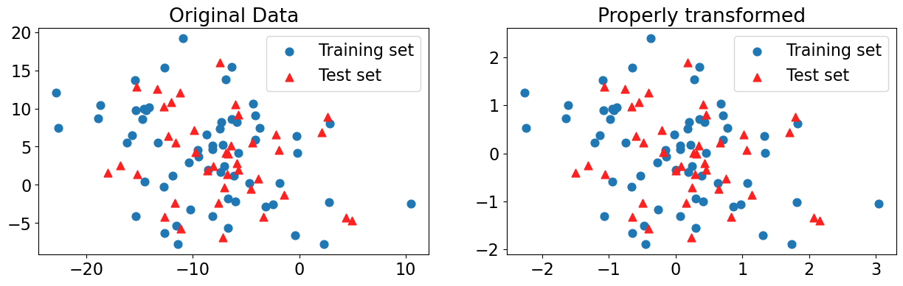

# Lecture 5: More preprocessing, text features

UBC Master of Data Science program, 2025-26

## Imports, Announcements, and LO

### Imports


```python
import os
import sys

import matplotlib.pyplot as plt
import numpy as np
import pandas as pd
from IPython.display import HTML

sys.path.append(os.path.join(os.path.abspath(".."), "code"))
from plotting_functions import *
from utils import *

pd.set_option("display.max_colwidth", 200)

from sklearn.compose import ColumnTransformer, make_column_transformer
from sklearn.dummy import DummyClassifier, DummyRegressor
from sklearn.impute import SimpleImputer
from sklearn.model_selection import cross_val_score, cross_validate, train_test_split
from sklearn.neighbors import KNeighborsClassifier
from sklearn.pipeline import Pipeline, make_pipeline
from sklearn.preprocessing import OneHotEncoder, OrdinalEncoder, StandardScaler
from sklearn.svm import SVC
from sklearn.tree import DecisionTreeClassifier
DATA_DIR = os.path.join(os.path.abspath(".."), "data/")
```

### Learning outcomes 

From this lecture, you will be able to 

- spot problems with commonly used improper methodologies used in preprocessing; 
- explain the difference between ordinal encoding vs one-hot encoding;
- explain possible strategies to deal with categorical variables with too many categories; 
- explain why text data needs a different treatment than categorical variables;
- use `scikit-learn`'s `CountVectorizer` to encode text data;
- explain and use different hyperparameters of `CountVectorizer`.
- incorporate text features in a machine learning pipeline

<br><br><br><br>

## ❓❓ Questions for you

Let's create some synthetic data. 


```python
from sklearn.datasets import make_blobs, make_classification

# make synthetic data
X, y = make_blobs(n_samples=100, centers=3, random_state=12, cluster_std=5)
# split it into training and test sets
X_train_toy, X_test_toy, y_train_toy, y_test_toy = train_test_split(
    X, y, random_state=5, test_size=0.4)

plt.scatter(X_train_toy[:, 0], X_train_toy[:, 1], label="Training set", s=60)
plt.scatter(
    X_test_toy[:, 0], X_test_toy[:, 1], color=mglearn.cm2(1), label="Test set", s=60
)
plt.legend(loc="upper right");
```


    

    


Let's transform the data using `StandardScaler` and examine how the data looks like. 


```python
scaler = StandardScaler()
train_transformed = scaler.fit_transform(X_train_toy)
test_transformed = scaler.transform(X_test_toy)
```


```python
X_train_toy[:, 0].mean(), X_train_toy[:, 0].std()
```


    (np.float64(-8.600287211119548), np.float64(6.270246946519936))


```python
X_train_toy[:, 1].mean(), X_train_toy[:, 1].std()
```


    (np.float64(4.124686209266641), np.float64(6.2749592279985595))


```python
plot_original_scaled(X_train_toy, X_test_toy, train_transformed, test_transformed)
```


    

    


```python
knn = KNeighborsClassifier()
knn.fit(train_transformed, y_train_toy)
print(f"Training score: {knn.score(train_transformed, y_train_toy):.2f}")
print(f"Test score: {knn.score(test_transformed, y_test_toy):.2f}")
```

    Training score: 0.63
    Test score: 0.55


<br><br>

#### Bad methodology 1: Scaling the data separately (for class discussion)


```python
# DO NOT DO THIS! For illustration purposes only.
scaler = StandardScaler()
scaler.fit(X_train_toy)
train_scaled = scaler.transform(X_train_toy)

scaler = StandardScaler()  # Creating a separate object for scaling test data
scaler.fit(X_test_toy)  # Calling fit on the test data
test_scaled = scaler.transform(
    X_test_toy
)  # Transforming the test data using the scaler fit on test data

knn = KNeighborsClassifier()
knn.fit(train_scaled, y_train_toy)
print(f"Training score: {knn.score(train_scaled, y_train_toy):.2f}")
print(f"Test score: {knn.score(test_scaled, y_test_toy):.2f}")
```

    Training score: 0.63
    Test score: 0.60


- Is anything wrong in methodology 1? If yes, what is it?  

<br><br><br><br>

- What are the mean and standard deviation of columns in `X_train_toy` and `X_test_toy`? 


```python
X_train_toy[:, 0].mean(), X_train_toy[:, 0].std() # mean and std of column 1 in X_train_toy
```


    (np.float64(-8.600287211119548), np.float64(6.270246946519936))


```python
X_train_toy[:, 1].mean(), X_train_toy[:, 1].std() # mean and std of column 2 in X_train_toy
```


    (np.float64(4.124686209266641), np.float64(6.2749592279985595))


What are the mean and standard deviation of columns in `X_test_toy`?  


```python
X_test_toy[:, 0].mean(), X_test_toy[:, 0].std() # mean and std of column 1 in X_test_toy
```


    (np.float64(-7.4360796317881865), np.float64(5.415791218175097))


```python
X_test_toy[:, 1].mean(), X_test_toy[:, 1].std() # mean and std of column 2 in X_train_toy
```


    (np.float64(3.584450392629585), np.float64(5.5947435906433025))


```python
plot_original_scaled(
    X_train_toy,
    X_test_toy,
    train_scaled,
    test_scaled,
    title_transformed="Improperly transformed",
)
```


    

    


<br><br>

#### Bad methodology 2: Scaling the data together (for class discussion)


```python
X_train_toy.shape, X_test_toy.shape
```


    ((60, 2), (40, 2))


```python
# join the train and test sets back together
XX = np.vstack((X_train_toy, X_test_toy))
XX.shape
```


    (100, 2)


```python
scaler = StandardScaler()
scaler.fit(XX)
XX_scaled = scaler.transform(XX)
XX_train = XX_scaled[:X_train_toy.shape[0]]
XX_test = XX_scaled[X_train_toy.shape[0]:]
```


```python
knn = KNeighborsClassifier()
knn.fit(XX_train, y_train_toy)
print(f"Training score: {knn.score(XX_train, y_train_toy):.2f}")  # Misleading score
print(f"Test score: {knn.score(XX_test, y_test_toy):.2f}")  # Misleading score
```

    Training score: 0.63
    Test score: 0.55


- Is anything wrong in methodology 2? If yes, what is it? 
- What's are the mean and std of `X_train_toy` vs. `XX`?


```python
X_train_toy[:, 0].mean(), X_train_toy[:, 0].std() # mean and std of column 1 in X_train_toy
```


    (np.float64(-8.600287211119548), np.float64(6.270246946519936))


```python
X_train_toy[:, 1].mean(), X_train_toy[:, 1].std() # mean and std of column 2 in X_train_toy
```


    (np.float64(4.124686209266641), np.float64(6.2749592279985595))


What are the mean and standard deviation of columns in `XX`?  


```python
XX[:, 0].mean(), XX[:, 0].std() # mean and std of column 1 in XX
```


    (np.float64(-8.134604179387004), np.float64(5.970528192615454))


```python
XX[:, 1].mean(), XX[:, 1].std() # mean and std of column 2 in XX
```


    (np.float64(3.9085918826118187), np.float64(6.017937808158447))


There is no big difference but they are not the same. 


```python
plot_original_scaled(
    X_train_toy,
    X_test_toy,
    XX_train,
    XX_test,
    title_transformed="Improperly transformed",
)
```


    

    


Not a noticeable difference in the transformed data and in scores in this case. But there is information leakage which is not good.   

<br><br><br><br>

## More discussion on preprocessing

Let's bring back our quiz2 grades toy dataset. 


```python
grades_df = pd.read_csv(DATA_DIR + 'quiz2-grade-toy-col-transformer.csv')
grades_df.head()
```


<div>
<style scoped>
    .dataframe tbody tr th:only-of-type {
        vertical-align: middle;
    }

    .dataframe tbody tr th {
        vertical-align: top;
    }

    .dataframe thead th {
        text-align: right;
    }
</style>
<table border="1" class="dataframe">
  <thead>
    <tr style="text-align: right;">
      <th></th>
      <th>enjoy_course</th>
      <th>ml_experience</th>
      <th>major</th>
      <th>class_attendance</th>
      <th>university_years</th>
      <th>lab1</th>
      <th>lab2</th>
      <th>lab3</th>
      <th>lab4</th>
      <th>quiz1</th>
      <th>quiz2</th>
    </tr>
  </thead>
  <tbody>
    <tr>
      <th>0</th>
      <td>yes</td>
      <td>1</td>
      <td>Computer Science</td>
      <td>Excellent</td>
      <td>3</td>
      <td>92</td>
      <td>93.0</td>
      <td>84</td>
      <td>91</td>
      <td>92</td>
      <td>A+</td>
    </tr>
    <tr>
      <th>1</th>
      <td>yes</td>
      <td>1</td>
      <td>Mechanical Engineering</td>
      <td>Average</td>
      <td>2</td>
      <td>94</td>
      <td>90.0</td>
      <td>80</td>
      <td>83</td>
      <td>91</td>
      <td>not A+</td>
    </tr>
    <tr>
      <th>2</th>
      <td>yes</td>
      <td>0</td>
      <td>Mathematics</td>
      <td>Poor</td>
      <td>3</td>
      <td>78</td>
      <td>85.0</td>
      <td>83</td>
      <td>80</td>
      <td>80</td>
      <td>not A+</td>
    </tr>
    <tr>
      <th>3</th>
      <td>no</td>
      <td>0</td>
      <td>Mathematics</td>
      <td>Excellent</td>
      <td>3</td>
      <td>91</td>
      <td>NaN</td>
      <td>92</td>
      <td>91</td>
      <td>89</td>
      <td>A+</td>
    </tr>
    <tr>
      <th>4</th>
      <td>yes</td>
      <td>0</td>
      <td>Psychology</td>
      <td>Good</td>
      <td>4</td>
      <td>77</td>
      <td>83.0</td>
      <td>90</td>
      <td>92</td>
      <td>85</td>
      <td>A+</td>
    </tr>
  </tbody>
</table>
</div>


```python
X, y = grades_df.drop(columns=['quiz2']), grades_df['quiz2']
```


```python
numeric_feats = ["university_years", "lab1", "lab3", "lab4", "quiz1"]  # apply scaling
categorical_feats = ["major"]  # apply one-hot encoding
passthrough_feats = ["ml_experience"]  # do not apply any transformation
drop_feats = [
    "lab2",
    "class_attendance",
    "enjoy_course",
]  # do not include these features in modeling
```

### One-hot encoding 
- What's the purpose of the following arguments of one-hot encoding?
    - handle_unknown="ignore"
    - sparse_output=False

### Categorical features with only two possible categories

- Sometimes you have features with only two possible categories. 
- If we apply `OheHotEncoder` on such columns, it'll create two columns, which seems wasteful, as we could represent all information in the column in just one column with say 0's and 1's with presence of absence of one of the categories.
- You can pass `drop="if_binary"` argument to `OneHotEncoder` in order to create only one column in such scenario. 


```python
X["enjoy_course"].head()
```


    0    yes
    1    yes
    2    yes
    3     no
    4    yes
    Name: enjoy_course, dtype: object


```python
ohe_enc = OneHotEncoder(drop="if_binary", dtype=int, sparse_output=False)
ohe_enc.fit(X[["enjoy_course"]])
transformed = ohe_enc.transform(X[["enjoy_course"]])
df = pd.DataFrame(data=transformed, columns=["enjoy_course_enc"], index=X.index)
pd.concat([X[["enjoy_course"]], df], axis=1).head(10)
```


<div>
<style scoped>
    .dataframe tbody tr th:only-of-type {
        vertical-align: middle;
    }

    .dataframe tbody tr th {
        vertical-align: top;
    }

    .dataframe thead th {
        text-align: right;
    }
</style>
<table border="1" class="dataframe">
  <thead>
    <tr style="text-align: right;">
      <th></th>
      <th>enjoy_course</th>
      <th>enjoy_course_enc</th>
    </tr>
  </thead>
  <tbody>
    <tr>
      <th>0</th>
      <td>yes</td>
      <td>1</td>
    </tr>
    <tr>
      <th>1</th>
      <td>yes</td>
      <td>1</td>
    </tr>
    <tr>
      <th>2</th>
      <td>yes</td>
      <td>1</td>
    </tr>
    <tr>
      <th>3</th>
      <td>no</td>
      <td>0</td>
    </tr>
    <tr>
      <th>4</th>
      <td>yes</td>
      <td>1</td>
    </tr>
    <tr>
      <th>5</th>
      <td>no</td>
      <td>0</td>
    </tr>
    <tr>
      <th>6</th>
      <td>yes</td>
      <td>1</td>
    </tr>
    <tr>
      <th>7</th>
      <td>no</td>
      <td>0</td>
    </tr>
    <tr>
      <th>8</th>
      <td>no</td>
      <td>0</td>
    </tr>
    <tr>
      <th>9</th>
      <td>yes</td>
      <td>1</td>
    </tr>
  </tbody>
</table>
</div>


### Ordinal encoding (class discussion)

- What's the difference between ordinal encoding and one-hot encoding? 
- What happens if we do not order the categories when we apply ordinal encoding?  Does it matter if we order the categories in ascending or descending order? 
- What would happen if an unknown category shows up during validation or test time during ordinal encoding? For example, for `class_attendance` feature what if a category called "super poor" shows up? 

<br><br><br><br>

### More than one ordinal columns?

- We can pass the manually ordered categories when we create an `OrdinalEncoder` object as a list of lists. 
- If you have more than one ordinal columns
    - manually create a list of ordered categories for each column
    - pass a list of lists to `OrdinalEncoder`, where each inner list corresponds to manually created list of ordered categories for a corresponding ordinal column. 
    

#### Discussion question

Since `enjoy_course` feature is binary you decide to apply one-hot encoding with `drop="if_binary"`. Your friend decide to apply ordinal encoding on it. Will it make any difference in the transformed data? 


```python
ohe = OneHotEncoder(drop="if_binary", sparse_output=False)
ohe_encoded = ohe.fit_transform(grades_df[['enjoy_course']]).ravel()
```


```python
oe = OrdinalEncoder()
oe_encoded = oe.fit_transform(grades_df[['enjoy_course']]).ravel()
```


```python
data = { "oe_encoded": oe_encoded, 
         "ohe_encoded": ohe_encoded}
pd.DataFrame(data)
```


<div>
<style scoped>
    .dataframe tbody tr th:only-of-type {
        vertical-align: middle;
    }

    .dataframe tbody tr th {
        vertical-align: top;
    }

    .dataframe thead th {
        text-align: right;
    }
</style>
<table border="1" class="dataframe">
  <thead>
    <tr style="text-align: right;">
      <th></th>
      <th>oe_encoded</th>
      <th>ohe_encoded</th>
    </tr>
  </thead>
  <tbody>
    <tr>
      <th>0</th>
      <td>1.0</td>
      <td>1.0</td>
    </tr>
    <tr>
      <th>1</th>
      <td>1.0</td>
      <td>1.0</td>
    </tr>
    <tr>
      <th>2</th>
      <td>1.0</td>
      <td>1.0</td>
    </tr>
    <tr>
      <th>3</th>
      <td>0.0</td>
      <td>0.0</td>
    </tr>
    <tr>
      <th>4</th>
      <td>1.0</td>
      <td>1.0</td>
    </tr>
    <tr>
      <th>5</th>
      <td>0.0</td>
      <td>0.0</td>
    </tr>
    <tr>
      <th>6</th>
      <td>1.0</td>
      <td>1.0</td>
    </tr>
    <tr>
      <th>7</th>
      <td>0.0</td>
      <td>0.0</td>
    </tr>
    <tr>
      <th>8</th>
      <td>0.0</td>
      <td>0.0</td>
    </tr>
    <tr>
      <th>9</th>
      <td>1.0</td>
      <td>1.0</td>
    </tr>
    <tr>
      <th>10</th>
      <td>1.0</td>
      <td>1.0</td>
    </tr>
    <tr>
      <th>11</th>
      <td>1.0</td>
      <td>1.0</td>
    </tr>
    <tr>
      <th>12</th>
      <td>1.0</td>
      <td>1.0</td>
    </tr>
    <tr>
      <th>13</th>
      <td>1.0</td>
      <td>1.0</td>
    </tr>
    <tr>
      <th>14</th>
      <td>0.0</td>
      <td>0.0</td>
    </tr>
    <tr>
      <th>15</th>
      <td>0.0</td>
      <td>0.0</td>
    </tr>
    <tr>
      <th>16</th>
      <td>1.0</td>
      <td>1.0</td>
    </tr>
    <tr>
      <th>17</th>
      <td>1.0</td>
      <td>1.0</td>
    </tr>
    <tr>
      <th>18</th>
      <td>0.0</td>
      <td>0.0</td>
    </tr>
    <tr>
      <th>19</th>
      <td>0.0</td>
      <td>0.0</td>
    </tr>
    <tr>
      <th>20</th>
      <td>1.0</td>
      <td>1.0</td>
    </tr>
  </tbody>
</table>
</div>


### Cases where it's OK to break the golden rule 

- If it's some fix number of categories. For example, if it's something like provinces in Canada or majors taught at UBC. We know the categories in advance and this is one of the cases where it might be OK to violate the golden rule and pass the list of known/possible categories. It's OK to incorporate human knowledge in the model. 

### OHE with many categories

- Do we have enough data for rare categories to learn anything meaningful? 
- How about grouping them into bigger categories?
    - Example: country names into continents such as "South America" or "Asia"
- How about considering the most frequent categories and having "other" category for rare cases? 

### Do we actually want to use certain features for prediction?

- Do you want to use certain features such as **gender** or **race** in prediction?
- Remember that the systems you build are going to be used in some applications. 
- It's extremely important to be mindful of the consequences of including certain features in your predictive model. 

### Discretizing
- Sometimes you want to transform numeric features into categorical features. This is called discretizing, bucketing, or binning.
- Example: You might want to group ages into categories like _children_, _teenager_, _young adults_, _middle-aged_, and _seniors_ for easier interpretation or to maintain privacy, or to capture non-linear relationships in linear models.  
- In `sklearn` you can do this using `KBinsDiscretizer` transformer.

### Preprocessing the targets?

- Generally no need for this when doing classification. 
- `sklearn` is fine with categorical labels ($y$-values) for classification problems. 
- But if you are using something outside `sklearn`, you might want to apply [`LabelEncoder`](https://scikit-learn.org/stable/modules/generated/sklearn.preprocessing.LabelEncoder.html) on the target. 
- In regression it makes sense in some cases. More on this in DSCI 573. 

### Interim summary 

- We have only scratched the surface of preprocessing to get us going. 
- In general, there is no one perfect solution to preprocessing. 
- You as a machine learning practitioner need to carefully look at the data, make appropriate decisions, and justify your decisions in the given situation. -- You are likely to follow the steps below in the process.  
    - Have a long conversation with the stakeholder(s) who will be using your pipeline.
    - Have a long conversation with the person(s) who collected the data.
    - Think about the ethical implications - are you sure you want to do this project? If so, should ethics guide your approach?

<br><br>

## Break (5 min)


So far we talked about data where
- we have a fixed number of features
- features are either continuous or categorical

There are many types of data where there are no predefined features or fixed length descriptions.  
- free text data
- image data 
- audio data
- video data 

In such cases, we need to come up with some representation or fixed length description which is useful for our task.  

Let's focus on text data. Let's look at some example messages from spam classification dataset. 


```python
sms_df = pd.read_csv(DATA_DIR + "spam.csv", encoding="latin-1")
sms_df = sms_df.drop(columns=["Unnamed: 2", "Unnamed: 3", "Unnamed: 4"])
sms_df = sms_df.rename(columns={"v1": "target", "v2": "sms"})
sms_df
```


<div>
<style scoped>
    .dataframe tbody tr th:only-of-type {
        vertical-align: middle;
    }

    .dataframe tbody tr th {
        vertical-align: top;
    }

    .dataframe thead th {
        text-align: right;
    }
</style>
<table border="1" class="dataframe">
  <thead>
    <tr style="text-align: right;">
      <th></th>
      <th>target</th>
      <th>sms</th>
    </tr>
  </thead>
  <tbody>
    <tr>
      <th>0</th>
      <td>ham</td>
      <td>Go until jurong point, crazy.. Available only in bugis n great world la e buffet... Cine there got amore wat...</td>
    </tr>
    <tr>
      <th>1</th>
      <td>ham</td>
      <td>Ok lar... Joking wif u oni...</td>
    </tr>
    <tr>
      <th>2</th>
      <td>spam</td>
      <td>Free entry in 2 a wkly comp to win FA Cup final tkts 21st May 2005. Text FA to 87121 to receive entry question(std txt rate)T&amp;C's apply 08452810075over18's</td>
    </tr>
    <tr>
      <th>3</th>
      <td>ham</td>
      <td>U dun say so early hor... U c already then say...</td>
    </tr>
    <tr>
      <th>4</th>
      <td>ham</td>
      <td>Nah I don't think he goes to usf, he lives around here though</td>
    </tr>
    <tr>
      <th>...</th>
      <td>...</td>
      <td>...</td>
    </tr>
    <tr>
      <th>5567</th>
      <td>spam</td>
      <td>This is the 2nd time we have tried 2 contact u. U have won the å£750 Pound prize. 2 claim is easy, call 087187272008 NOW1! Only 10p per minute. BT-national-rate.</td>
    </tr>
    <tr>
      <th>5568</th>
      <td>ham</td>
      <td>Will Ì_ b going to esplanade fr home?</td>
    </tr>
    <tr>
      <th>5569</th>
      <td>ham</td>
      <td>Pity, * was in mood for that. So...any other suggestions?</td>
    </tr>
    <tr>
      <th>5570</th>
      <td>ham</td>
      <td>The guy did some bitching but I acted like i'd be interested in buying something else next week and he gave it to us for free</td>
    </tr>
    <tr>
      <th>5571</th>
      <td>ham</td>
      <td>Rofl. Its true to its name</td>
    </tr>
  </tbody>
</table>
<p>5572 rows × 2 columns</p>
</div>


```python
sms_df.loc[5567]['sms']
```


    'This is the 2nd time we have tried 2 contact u. U have won the å£750 Pound prize. 2 claim is easy, call 087187272008 NOW1! Only 10p per minute. BT-national-rate.'


- This is how the text looks like in the wild. 
- Clearly they do not have the same length.
- There is no obvious way to represent these strings as floating point numbers which is required by standard machine learning approaches. 
- There are some weird things going on in these texts
    - Capitalization 
    - Punctuation marks
    - Misspellings

- How to tokenize? 
- How to normalize words?
- What to include in the vocabulary? 
    - exclude stopwords (most common words)
    - exclude rarely occurring words

<br><br><br><br>

## Encoding text data  


```python
toy_spam = [
    [
        "URGENT!! As a valued network customer you have been selected to receive a £900 prize reward!",
        "spam",
    ],
    ["Lol you are always so convincing.", "non spam"],
    ["Nah I don't think he goes to usf, he lives around here though", "non spam"],
    [
        "URGENT! You have won a 1 week FREE membership in our £100000 prize Jackpot!",
        "spam",
    ],
    [
        "Had your mobile 11 months or more? U R entitled to Update to the latest colour mobiles with camera for Free! Call The Mobile Update Co FREE on 08002986030",
        "spam",
    ],
    ["Congrats! I can't wait to see you!!", "non spam"],
]
toy_df = pd.DataFrame(toy_spam, columns=["sms", "target"])
```

### Spam/non spam toy example 

- What if the feature is in the form of raw text?
- The feature `sms` below is neither categorical nor ordinal. 
- How can we encode it so that we can pass it to the machine learning algorithms we have seen so far? 


```python
toy_df
```


<div>
<style scoped>
    .dataframe tbody tr th:only-of-type {
        vertical-align: middle;
    }

    .dataframe tbody tr th {
        vertical-align: top;
    }

    .dataframe thead th {
        text-align: right;
    }
</style>
<table border="1" class="dataframe">
  <thead>
    <tr style="text-align: right;">
      <th></th>
      <th>sms</th>
      <th>target</th>
    </tr>
  </thead>
  <tbody>
    <tr>
      <th>0</th>
      <td>URGENT!! As a valued network customer you have been selected to receive a £900 prize reward!</td>
      <td>spam</td>
    </tr>
    <tr>
      <th>1</th>
      <td>Lol you are always so convincing.</td>
      <td>non spam</td>
    </tr>
    <tr>
      <th>2</th>
      <td>Nah I don't think he goes to usf, he lives around here though</td>
      <td>non spam</td>
    </tr>
    <tr>
      <th>3</th>
      <td>URGENT! You have won a 1 week FREE membership in our £100000 prize Jackpot!</td>
      <td>spam</td>
    </tr>
    <tr>
      <th>4</th>
      <td>Had your mobile 11 months or more? U R entitled to Update to the latest colour mobiles with camera for Free! Call The Mobile Update Co FREE on 08002986030</td>
      <td>spam</td>
    </tr>
    <tr>
      <th>5</th>
      <td>Congrats! I can't wait to see you!!</td>
      <td>non spam</td>
    </tr>
  </tbody>
</table>
</div>


### What if we apply OHE? 


```python
### DO NOT DO THIS.
enc = OneHotEncoder(sparse_output=False)
transformed = enc.fit_transform(toy_df[["sms"]])
pd.DataFrame(transformed, columns=enc.categories_)
```


<div>
<style scoped>
    .dataframe tbody tr th:only-of-type {
        vertical-align: middle;
    }

    .dataframe tbody tr th {
        vertical-align: top;
    }

    .dataframe thead tr th {
        text-align: left;
    }
</style>
<table border="1" class="dataframe">
  <thead>
    <tr>
      <th></th>
      <th>Congrats! I can't wait to see you!!</th>
      <th>Had your mobile 11 months or more? U R entitled to Update to the latest colour mobiles with camera for Free! Call The Mobile Update Co FREE on 08002986030</th>
      <th>Lol you are always so convincing.</th>
      <th>Nah I don't think he goes to usf, he lives around here though</th>
      <th>URGENT! You have won a 1 week FREE membership in our £100000 prize Jackpot!</th>
      <th>URGENT!! As a valued network customer you have been selected to receive a £900 prize reward!</th>
    </tr>
  </thead>
  <tbody>
    <tr>
      <th>0</th>
      <td>0.0</td>
      <td>0.0</td>
      <td>0.0</td>
      <td>0.0</td>
      <td>0.0</td>
      <td>1.0</td>
    </tr>
    <tr>
      <th>1</th>
      <td>0.0</td>
      <td>0.0</td>
      <td>1.0</td>
      <td>0.0</td>
      <td>0.0</td>
      <td>0.0</td>
    </tr>
    <tr>
      <th>2</th>
      <td>0.0</td>
      <td>0.0</td>
      <td>0.0</td>
      <td>1.0</td>
      <td>0.0</td>
      <td>0.0</td>
    </tr>
    <tr>
      <th>3</th>
      <td>0.0</td>
      <td>0.0</td>
      <td>0.0</td>
      <td>0.0</td>
      <td>1.0</td>
      <td>0.0</td>
    </tr>
    <tr>
      <th>4</th>
      <td>0.0</td>
      <td>1.0</td>
      <td>0.0</td>
      <td>0.0</td>
      <td>0.0</td>
      <td>0.0</td>
    </tr>
    <tr>
      <th>5</th>
      <td>1.0</td>
      <td>0.0</td>
      <td>0.0</td>
      <td>0.0</td>
      <td>0.0</td>
      <td>0.0</td>
    </tr>
  </tbody>
</table>
</div>


- We do not have a fixed number of categories here. 
- Each "category" (feature value) is likely to occur only once in the training data and we won't learn anything meaningful if we apply one-hot encoding or ordinal encoding on this feature. 

- How can we encode or represent raw text data into fixed number of features so that we can learn some useful patterns from it?  
- This is a well studied problem in the field of Natural Language Processing (NLP), which is concerned with giving computers the ability to understand written and spoken language. 
- Some popular representations of raw text include: 
    - **Bag of words** 
    - TF-IDF
    - Embedding representations 

### Bag of words (BOW) representation

- One of the most popular representation of raw text 
- Ignores the syntax and word order
- It has two components: 
    - The vocabulary (all unique words in all documents) 
    - A value indicating either the presence or absence or the count of each word in the document. 
        
<center>

</center>

[Source](https://web.stanford.edu/~jurafsky/slp3/4.pdf)       

### Extracting BOW features using `scikit-learn`
- `CountVectorizer`
    - Converts a collection of text documents to a matrix of word counts.  
    - Each row represents a "document" (e.g., a text message in our example). 
    - Each column represents a word in the vocabulary (the set of unique words) in the training data. 
    - Each cell represents how often the word occurs in the document.       

```{note}
In the Natural Language Processing (NLP) community text data  is referred to as a **corpus** (plural: corpora). ```   


```python
from sklearn.feature_extraction.text import CountVectorizer

vec = CountVectorizer()
X_counts = vec.fit_transform(toy_df["sms"])
bow_df = pd.DataFrame(
    X_counts.toarray(), columns=vec.get_feature_names_out(), index=toy_df["sms"]
)
bow_df
```


<div>
<style scoped>
    .dataframe tbody tr th:only-of-type {
        vertical-align: middle;
    }

    .dataframe tbody tr th {
        vertical-align: top;
    }

    .dataframe thead th {
        text-align: right;
    }
</style>
<table border="1" class="dataframe">
  <thead>
    <tr style="text-align: right;">
      <th></th>
      <th>08002986030</th>
      <th>100000</th>
      <th>11</th>
      <th>900</th>
      <th>always</th>
      <th>are</th>
      <th>around</th>
      <th>as</th>
      <th>been</th>
      <th>call</th>
      <th>...</th>
      <th>update</th>
      <th>urgent</th>
      <th>usf</th>
      <th>valued</th>
      <th>wait</th>
      <th>week</th>
      <th>with</th>
      <th>won</th>
      <th>you</th>
      <th>your</th>
    </tr>
    <tr>
      <th>sms</th>
      <th></th>
      <th></th>
      <th></th>
      <th></th>
      <th></th>
      <th></th>
      <th></th>
      <th></th>
      <th></th>
      <th></th>
      <th></th>
      <th></th>
      <th></th>
      <th></th>
      <th></th>
      <th></th>
      <th></th>
      <th></th>
      <th></th>
      <th></th>
      <th></th>
    </tr>
  </thead>
  <tbody>
    <tr>
      <th>URGENT!! As a valued network customer you have been selected to receive a £900 prize reward!</th>
      <td>0</td>
      <td>0</td>
      <td>0</td>
      <td>1</td>
      <td>0</td>
      <td>0</td>
      <td>0</td>
      <td>1</td>
      <td>1</td>
      <td>0</td>
      <td>...</td>
      <td>0</td>
      <td>1</td>
      <td>0</td>
      <td>1</td>
      <td>0</td>
      <td>0</td>
      <td>0</td>
      <td>0</td>
      <td>1</td>
      <td>0</td>
    </tr>
    <tr>
      <th>Lol you are always so convincing.</th>
      <td>0</td>
      <td>0</td>
      <td>0</td>
      <td>0</td>
      <td>1</td>
      <td>1</td>
      <td>0</td>
      <td>0</td>
      <td>0</td>
      <td>0</td>
      <td>...</td>
      <td>0</td>
      <td>0</td>
      <td>0</td>
      <td>0</td>
      <td>0</td>
      <td>0</td>
      <td>0</td>
      <td>0</td>
      <td>1</td>
      <td>0</td>
    </tr>
    <tr>
      <th>Nah I don't think he goes to usf, he lives around here though</th>
      <td>0</td>
      <td>0</td>
      <td>0</td>
      <td>0</td>
      <td>0</td>
      <td>0</td>
      <td>1</td>
      <td>0</td>
      <td>0</td>
      <td>0</td>
      <td>...</td>
      <td>0</td>
      <td>0</td>
      <td>1</td>
      <td>0</td>
      <td>0</td>
      <td>0</td>
      <td>0</td>
      <td>0</td>
      <td>0</td>
      <td>0</td>
    </tr>
    <tr>
      <th>URGENT! You have won a 1 week FREE membership in our £100000 prize Jackpot!</th>
      <td>0</td>
      <td>1</td>
      <td>0</td>
      <td>0</td>
      <td>0</td>
      <td>0</td>
      <td>0</td>
      <td>0</td>
      <td>0</td>
      <td>0</td>
      <td>...</td>
      <td>0</td>
      <td>1</td>
      <td>0</td>
      <td>0</td>
      <td>0</td>
      <td>1</td>
      <td>0</td>
      <td>1</td>
      <td>1</td>
      <td>0</td>
    </tr>
    <tr>
      <th>Had your mobile 11 months or more? U R entitled to Update to the latest colour mobiles with camera for Free! Call The Mobile Update Co FREE on 08002986030</th>
      <td>1</td>
      <td>0</td>
      <td>1</td>
      <td>0</td>
      <td>0</td>
      <td>0</td>
      <td>0</td>
      <td>0</td>
      <td>0</td>
      <td>1</td>
      <td>...</td>
      <td>2</td>
      <td>0</td>
      <td>0</td>
      <td>0</td>
      <td>0</td>
      <td>0</td>
      <td>1</td>
      <td>0</td>
      <td>0</td>
      <td>1</td>
    </tr>
    <tr>
      <th>Congrats! I can't wait to see you!!</th>
      <td>0</td>
      <td>0</td>
      <td>0</td>
      <td>0</td>
      <td>0</td>
      <td>0</td>
      <td>0</td>
      <td>0</td>
      <td>0</td>
      <td>0</td>
      <td>...</td>
      <td>0</td>
      <td>0</td>
      <td>0</td>
      <td>0</td>
      <td>1</td>
      <td>0</td>
      <td>0</td>
      <td>0</td>
      <td>1</td>
      <td>0</td>
    </tr>
  </tbody>
</table>
<p>6 rows × 61 columns</p>
</div>


```python
type(toy_df["sms"])
```


    pandas.core.series.Series


```{important}
Note that unlike other transformers we are passing a `Series` object to `fit_transform`. For other transformers, you can define one transformer for more than one columns. But with `CountVectorizer` you need to define separate `CountVectorizer` transformers for each text column, if you have more than one text columns.    
```


```python
X_counts
```


    <Compressed Sparse Row sparse matrix of dtype 'int64'
    	with 71 stored elements and shape (6, 61)>


### Why sparse matrices? 

- Most words do not appear in a given document.
- We get massive computational savings if we only store the nonzero elements.
- There is a bit of overhead, because we also need to store the locations:
    - e.g. "location (3,27): 1".
    
- However, if the fraction of nonzero is small, this is a huge win.


```python
print("The total number of elements: ", np.prod(X_counts.shape))
print("The number of non-zero elements: ", X_counts.nnz)
print(
    "Proportion of non-zero elements: %0.4f" % (X_counts.nnz / np.prod(X_counts.shape))
)
print(
    "The value at cell 3,%d is: %d"
    % (vec.vocabulary_["jackpot"], X_counts[3, vec.vocabulary_["jackpot"]])
)
```

    The total number of elements:  366
    The number of non-zero elements:  71
    Proportion of non-zero elements: 0.1940
    The value at cell 3,27 is: 1


Question for you
- What would happen if you apply `StandardScaler` on sparse data? 

### `OneHotEncoder` and sparse features 
- By default, `OneHotEncoder` also creates sparse features. 
- You could set `sparse=False` to get a regular `numpy` array. 
- If there are a huge number of categories, it may be beneficial to keep them sparse.
- For smaller number of categories, it doesn't matter much.

### Important hyperparameters of `CountVectorizer` 

- `binary`
    - whether to use absence/presence feature values or counts
- `max_features`
    - only consider top `max_features` ordered by frequency in the corpus
- `max_df`
    - ignore features which occur in more than `max_df` documents 
- `min_df` 
    - ignore features which occur in less than `min_df` documents 
- `ngram_range`
    - consider word sequences in the given range 

Let's look at all features, i.e., words (along with their frequencies).


```python
vec = CountVectorizer()
X_counts = vec.fit_transform(toy_df["sms"])
bow_df = pd.DataFrame(
    X_counts.toarray(), columns=vec.get_feature_names_out(), index=toy_df["sms"]
)
bow_df
```


<div>
<style scoped>
    .dataframe tbody tr th:only-of-type {
        vertical-align: middle;
    }

    .dataframe tbody tr th {
        vertical-align: top;
    }

    .dataframe thead th {
        text-align: right;
    }
</style>
<table border="1" class="dataframe">
  <thead>
    <tr style="text-align: right;">
      <th></th>
      <th>08002986030</th>
      <th>100000</th>
      <th>11</th>
      <th>900</th>
      <th>always</th>
      <th>are</th>
      <th>around</th>
      <th>as</th>
      <th>been</th>
      <th>call</th>
      <th>...</th>
      <th>update</th>
      <th>urgent</th>
      <th>usf</th>
      <th>valued</th>
      <th>wait</th>
      <th>week</th>
      <th>with</th>
      <th>won</th>
      <th>you</th>
      <th>your</th>
    </tr>
    <tr>
      <th>sms</th>
      <th></th>
      <th></th>
      <th></th>
      <th></th>
      <th></th>
      <th></th>
      <th></th>
      <th></th>
      <th></th>
      <th></th>
      <th></th>
      <th></th>
      <th></th>
      <th></th>
      <th></th>
      <th></th>
      <th></th>
      <th></th>
      <th></th>
      <th></th>
      <th></th>
    </tr>
  </thead>
  <tbody>
    <tr>
      <th>URGENT!! As a valued network customer you have been selected to receive a £900 prize reward!</th>
      <td>0</td>
      <td>0</td>
      <td>0</td>
      <td>1</td>
      <td>0</td>
      <td>0</td>
      <td>0</td>
      <td>1</td>
      <td>1</td>
      <td>0</td>
      <td>...</td>
      <td>0</td>
      <td>1</td>
      <td>0</td>
      <td>1</td>
      <td>0</td>
      <td>0</td>
      <td>0</td>
      <td>0</td>
      <td>1</td>
      <td>0</td>
    </tr>
    <tr>
      <th>Lol you are always so convincing.</th>
      <td>0</td>
      <td>0</td>
      <td>0</td>
      <td>0</td>
      <td>1</td>
      <td>1</td>
      <td>0</td>
      <td>0</td>
      <td>0</td>
      <td>0</td>
      <td>...</td>
      <td>0</td>
      <td>0</td>
      <td>0</td>
      <td>0</td>
      <td>0</td>
      <td>0</td>
      <td>0</td>
      <td>0</td>
      <td>1</td>
      <td>0</td>
    </tr>
    <tr>
      <th>Nah I don't think he goes to usf, he lives around here though</th>
      <td>0</td>
      <td>0</td>
      <td>0</td>
      <td>0</td>
      <td>0</td>
      <td>0</td>
      <td>1</td>
      <td>0</td>
      <td>0</td>
      <td>0</td>
      <td>...</td>
      <td>0</td>
      <td>0</td>
      <td>1</td>
      <td>0</td>
      <td>0</td>
      <td>0</td>
      <td>0</td>
      <td>0</td>
      <td>0</td>
      <td>0</td>
    </tr>
    <tr>
      <th>URGENT! You have won a 1 week FREE membership in our £100000 prize Jackpot!</th>
      <td>0</td>
      <td>1</td>
      <td>0</td>
      <td>0</td>
      <td>0</td>
      <td>0</td>
      <td>0</td>
      <td>0</td>
      <td>0</td>
      <td>0</td>
      <td>...</td>
      <td>0</td>
      <td>1</td>
      <td>0</td>
      <td>0</td>
      <td>0</td>
      <td>1</td>
      <td>0</td>
      <td>1</td>
      <td>1</td>
      <td>0</td>
    </tr>
    <tr>
      <th>Had your mobile 11 months or more? U R entitled to Update to the latest colour mobiles with camera for Free! Call The Mobile Update Co FREE on 08002986030</th>
      <td>1</td>
      <td>0</td>
      <td>1</td>
      <td>0</td>
      <td>0</td>
      <td>0</td>
      <td>0</td>
      <td>0</td>
      <td>0</td>
      <td>1</td>
      <td>...</td>
      <td>2</td>
      <td>0</td>
      <td>0</td>
      <td>0</td>
      <td>0</td>
      <td>0</td>
      <td>1</td>
      <td>0</td>
      <td>0</td>
      <td>1</td>
    </tr>
    <tr>
      <th>Congrats! I can't wait to see you!!</th>
      <td>0</td>
      <td>0</td>
      <td>0</td>
      <td>0</td>
      <td>0</td>
      <td>0</td>
      <td>0</td>
      <td>0</td>
      <td>0</td>
      <td>0</td>
      <td>...</td>
      <td>0</td>
      <td>0</td>
      <td>0</td>
      <td>0</td>
      <td>1</td>
      <td>0</td>
      <td>0</td>
      <td>0</td>
      <td>1</td>
      <td>0</td>
    </tr>
  </tbody>
</table>
<p>6 rows × 61 columns</p>
</div>


When we use `binary=True`, the representation uses presence/absence of words instead of word counts.   


```python
vec_binary = CountVectorizer(binary=True)
X_counts = vec_binary.fit_transform(toy_df["sms"])
bow_df = pd.DataFrame(
    X_counts.toarray(), columns=vec_binary.get_feature_names_out(), index=toy_df["sms"]
)
bow_df
```


<div>
<style scoped>
    .dataframe tbody tr th:only-of-type {
        vertical-align: middle;
    }

    .dataframe tbody tr th {
        vertical-align: top;
    }

    .dataframe thead th {
        text-align: right;
    }
</style>
<table border="1" class="dataframe">
  <thead>
    <tr style="text-align: right;">
      <th></th>
      <th>08002986030</th>
      <th>100000</th>
      <th>11</th>
      <th>900</th>
      <th>always</th>
      <th>are</th>
      <th>around</th>
      <th>as</th>
      <th>been</th>
      <th>call</th>
      <th>...</th>
      <th>update</th>
      <th>urgent</th>
      <th>usf</th>
      <th>valued</th>
      <th>wait</th>
      <th>week</th>
      <th>with</th>
      <th>won</th>
      <th>you</th>
      <th>your</th>
    </tr>
    <tr>
      <th>sms</th>
      <th></th>
      <th></th>
      <th></th>
      <th></th>
      <th></th>
      <th></th>
      <th></th>
      <th></th>
      <th></th>
      <th></th>
      <th></th>
      <th></th>
      <th></th>
      <th></th>
      <th></th>
      <th></th>
      <th></th>
      <th></th>
      <th></th>
      <th></th>
      <th></th>
    </tr>
  </thead>
  <tbody>
    <tr>
      <th>URGENT!! As a valued network customer you have been selected to receive a £900 prize reward!</th>
      <td>0</td>
      <td>0</td>
      <td>0</td>
      <td>1</td>
      <td>0</td>
      <td>0</td>
      <td>0</td>
      <td>1</td>
      <td>1</td>
      <td>0</td>
      <td>...</td>
      <td>0</td>
      <td>1</td>
      <td>0</td>
      <td>1</td>
      <td>0</td>
      <td>0</td>
      <td>0</td>
      <td>0</td>
      <td>1</td>
      <td>0</td>
    </tr>
    <tr>
      <th>Lol you are always so convincing.</th>
      <td>0</td>
      <td>0</td>
      <td>0</td>
      <td>0</td>
      <td>1</td>
      <td>1</td>
      <td>0</td>
      <td>0</td>
      <td>0</td>
      <td>0</td>
      <td>...</td>
      <td>0</td>
      <td>0</td>
      <td>0</td>
      <td>0</td>
      <td>0</td>
      <td>0</td>
      <td>0</td>
      <td>0</td>
      <td>1</td>
      <td>0</td>
    </tr>
    <tr>
      <th>Nah I don't think he goes to usf, he lives around here though</th>
      <td>0</td>
      <td>0</td>
      <td>0</td>
      <td>0</td>
      <td>0</td>
      <td>0</td>
      <td>1</td>
      <td>0</td>
      <td>0</td>
      <td>0</td>
      <td>...</td>
      <td>0</td>
      <td>0</td>
      <td>1</td>
      <td>0</td>
      <td>0</td>
      <td>0</td>
      <td>0</td>
      <td>0</td>
      <td>0</td>
      <td>0</td>
    </tr>
    <tr>
      <th>URGENT! You have won a 1 week FREE membership in our £100000 prize Jackpot!</th>
      <td>0</td>
      <td>1</td>
      <td>0</td>
      <td>0</td>
      <td>0</td>
      <td>0</td>
      <td>0</td>
      <td>0</td>
      <td>0</td>
      <td>0</td>
      <td>...</td>
      <td>0</td>
      <td>1</td>
      <td>0</td>
      <td>0</td>
      <td>0</td>
      <td>1</td>
      <td>0</td>
      <td>1</td>
      <td>1</td>
      <td>0</td>
    </tr>
    <tr>
      <th>Had your mobile 11 months or more? U R entitled to Update to the latest colour mobiles with camera for Free! Call The Mobile Update Co FREE on 08002986030</th>
      <td>1</td>
      <td>0</td>
      <td>1</td>
      <td>0</td>
      <td>0</td>
      <td>0</td>
      <td>0</td>
      <td>0</td>
      <td>0</td>
      <td>1</td>
      <td>...</td>
      <td>1</td>
      <td>0</td>
      <td>0</td>
      <td>0</td>
      <td>0</td>
      <td>0</td>
      <td>1</td>
      <td>0</td>
      <td>0</td>
      <td>1</td>
    </tr>
    <tr>
      <th>Congrats! I can't wait to see you!!</th>
      <td>0</td>
      <td>0</td>
      <td>0</td>
      <td>0</td>
      <td>0</td>
      <td>0</td>
      <td>0</td>
      <td>0</td>
      <td>0</td>
      <td>0</td>
      <td>...</td>
      <td>0</td>
      <td>0</td>
      <td>0</td>
      <td>0</td>
      <td>1</td>
      <td>0</td>
      <td>0</td>
      <td>0</td>
      <td>1</td>
      <td>0</td>
    </tr>
  </tbody>
</table>
<p>6 rows × 61 columns</p>
</div>


We can control the size of X (the number of features) using `max_features`.


```python
vec8 = CountVectorizer(max_features=8)
X_counts = vec8.fit_transform(toy_df["sms"])
bow_df = pd.DataFrame(
    X_counts.toarray(), columns=vec8.get_feature_names_out(), index=toy_df["sms"]
)
bow_df
```


<div>
<style scoped>
    .dataframe tbody tr th:only-of-type {
        vertical-align: middle;
    }

    .dataframe tbody tr th {
        vertical-align: top;
    }

    .dataframe thead th {
        text-align: right;
    }
</style>
<table border="1" class="dataframe">
  <thead>
    <tr style="text-align: right;">
      <th></th>
      <th>free</th>
      <th>have</th>
      <th>mobile</th>
      <th>the</th>
      <th>to</th>
      <th>update</th>
      <th>urgent</th>
      <th>you</th>
    </tr>
    <tr>
      <th>sms</th>
      <th></th>
      <th></th>
      <th></th>
      <th></th>
      <th></th>
      <th></th>
      <th></th>
      <th></th>
    </tr>
  </thead>
  <tbody>
    <tr>
      <th>URGENT!! As a valued network customer you have been selected to receive a £900 prize reward!</th>
      <td>0</td>
      <td>1</td>
      <td>0</td>
      <td>0</td>
      <td>1</td>
      <td>0</td>
      <td>1</td>
      <td>1</td>
    </tr>
    <tr>
      <th>Lol you are always so convincing.</th>
      <td>0</td>
      <td>0</td>
      <td>0</td>
      <td>0</td>
      <td>0</td>
      <td>0</td>
      <td>0</td>
      <td>1</td>
    </tr>
    <tr>
      <th>Nah I don't think he goes to usf, he lives around here though</th>
      <td>0</td>
      <td>0</td>
      <td>0</td>
      <td>0</td>
      <td>1</td>
      <td>0</td>
      <td>0</td>
      <td>0</td>
    </tr>
    <tr>
      <th>URGENT! You have won a 1 week FREE membership in our £100000 prize Jackpot!</th>
      <td>1</td>
      <td>1</td>
      <td>0</td>
      <td>0</td>
      <td>0</td>
      <td>0</td>
      <td>1</td>
      <td>1</td>
    </tr>
    <tr>
      <th>Had your mobile 11 months or more? U R entitled to Update to the latest colour mobiles with camera for Free! Call The Mobile Update Co FREE on 08002986030</th>
      <td>2</td>
      <td>0</td>
      <td>2</td>
      <td>2</td>
      <td>2</td>
      <td>2</td>
      <td>0</td>
      <td>0</td>
    </tr>
    <tr>
      <th>Congrats! I can't wait to see you!!</th>
      <td>0</td>
      <td>0</td>
      <td>0</td>
      <td>0</td>
      <td>1</td>
      <td>0</td>
      <td>0</td>
      <td>1</td>
    </tr>
  </tbody>
</table>
</div>


```{note}
Notice that `vec8` and `vec8_binary` have different vocabularies, which is kind of unexpected behaviour and doesn't match the documentation of `scikit-learn`. 

[Here](https://github.com/scikit-learn/scikit-learn/blob/master/sklearn/feature_extraction/text.py#L1206-L1225) is the code for `binary=True` condition in `scikit-learn`. As we can see, the binarization is done before limiting the features to `max_features`, and so now we are actually looking at the document counts (in how many documents it occurs) rather than term count. This is not explained anywhere in the documentation. 

The ties in counts between different words makes it even more confusing. I don't think it'll have a big impact on the results but this is good to know! Remember that `scikit-learn` developers are also humans who are prone to make mistakes. So it's always a good habit to question whatever tools we use every now and then. 
```


```python
vec8 = CountVectorizer(max_features=8)
X_counts = vec8.fit_transform(toy_df["sms"])
pd.DataFrame(
    data=X_counts.sum(axis=0).tolist()[0],
    index=vec8.get_feature_names_out(),
    columns=["counts"],
).sort_values("counts", ascending=False)
```


<div>
<style scoped>
    .dataframe tbody tr th:only-of-type {
        vertical-align: middle;
    }

    .dataframe tbody tr th {
        vertical-align: top;
    }

    .dataframe thead th {
        text-align: right;
    }
</style>
<table border="1" class="dataframe">
  <thead>
    <tr style="text-align: right;">
      <th></th>
      <th>counts</th>
    </tr>
  </thead>
  <tbody>
    <tr>
      <th>to</th>
      <td>5</td>
    </tr>
    <tr>
      <th>you</th>
      <td>4</td>
    </tr>
    <tr>
      <th>free</th>
      <td>3</td>
    </tr>
    <tr>
      <th>have</th>
      <td>2</td>
    </tr>
    <tr>
      <th>mobile</th>
      <td>2</td>
    </tr>
    <tr>
      <th>the</th>
      <td>2</td>
    </tr>
    <tr>
      <th>update</th>
      <td>2</td>
    </tr>
    <tr>
      <th>urgent</th>
      <td>2</td>
    </tr>
  </tbody>
</table>
</div>


```python
vec8_binary = CountVectorizer(binary=True, max_features=8)
X_counts = vec8_binary.fit_transform(toy_df["sms"])
pd.DataFrame(
    data=X_counts.sum(axis=0).tolist()[0],
    index=vec8_binary.get_feature_names_out(),
    columns=["counts"],
).sort_values("counts", ascending=False)
```


<div>
<style scoped>
    .dataframe tbody tr th:only-of-type {
        vertical-align: middle;
    }

    .dataframe tbody tr th {
        vertical-align: top;
    }

    .dataframe thead th {
        text-align: right;
    }
</style>
<table border="1" class="dataframe">
  <thead>
    <tr style="text-align: right;">
      <th></th>
      <th>counts</th>
    </tr>
  </thead>
  <tbody>
    <tr>
      <th>to</th>
      <td>4</td>
    </tr>
    <tr>
      <th>you</th>
      <td>4</td>
    </tr>
    <tr>
      <th>free</th>
      <td>2</td>
    </tr>
    <tr>
      <th>have</th>
      <td>2</td>
    </tr>
    <tr>
      <th>prize</th>
      <td>2</td>
    </tr>
    <tr>
      <th>urgent</th>
      <td>2</td>
    </tr>
    <tr>
      <th>mobiles</th>
      <td>1</td>
    </tr>
    <tr>
      <th>months</th>
      <td>1</td>
    </tr>
  </tbody>
</table>
</div>


### Preprocessing

- Note that `CountVectorizer` is carrying out some preprocessing such as because of the default argument values 
    - Converting words to lowercase (`lowercase=True`)
    - getting rid of punctuation and special characters (`token_pattern ='(?u)\\b\\w\\w+\\b'`)


```python
pipe = make_pipeline(CountVectorizer(), SVC())
```


```python
pipe.fit(toy_df["sms"], toy_df["target"])
```

```python
pipe.predict(toy_df["sms"])
```

```
array(['spam', 'non spam', 'non spam', 'spam', 'spam', 'non spam'],
      dtype=object)
```

### Is this a realistic representation of text data?

- Of course this is not a great representation of language
    
    - We are throwing out everything we know about language and losing a lot of information.
        
    - It assumes that there is no syntax and compositional meaning in language.
        
- But it works surprisingly well for many tasks.
    
- We will learn more expressive representations in the coming weeks.