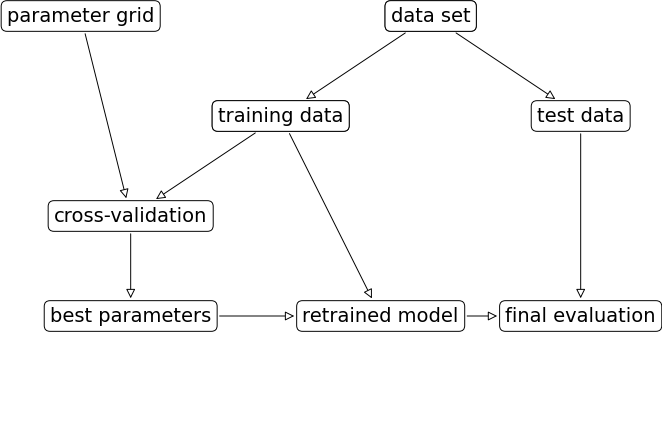
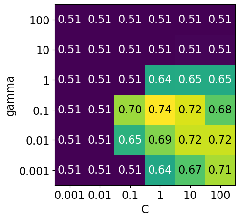
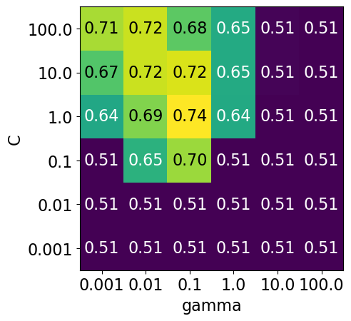
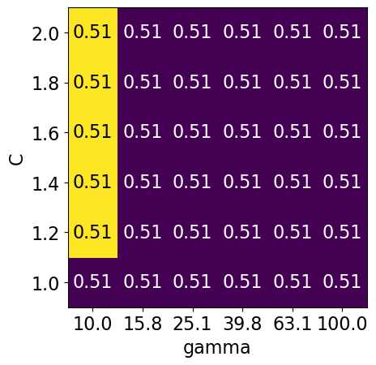
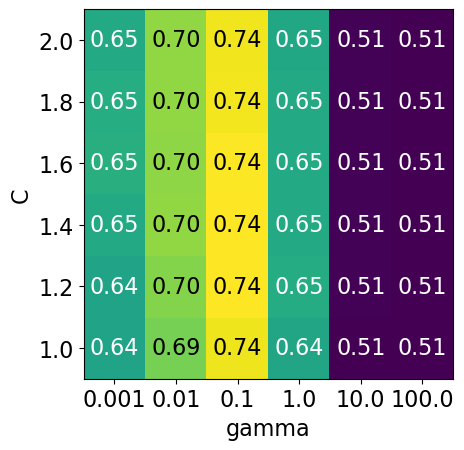
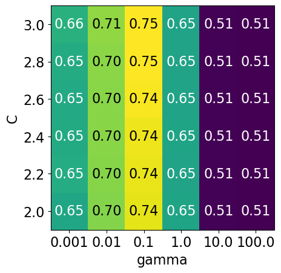
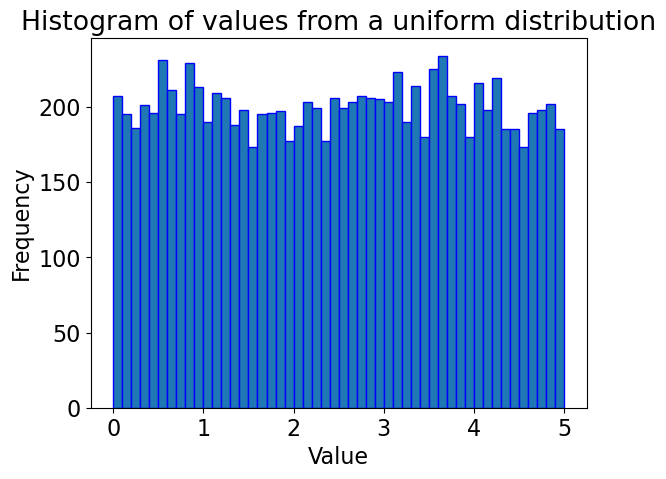
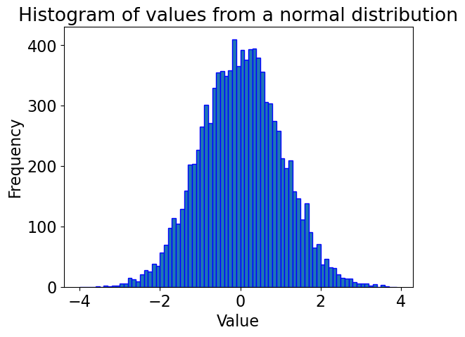
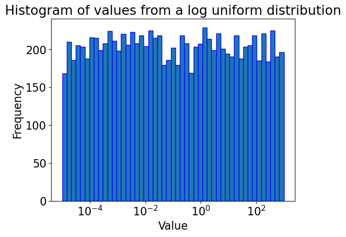

# Lecture 6: Hyperparameter Optimization and Optimization Bias

UBC Master of Data Science program, 2025-26


## Imports and LO

### Imports


```python
import os
import sys

sys.path.append(os.path.join(os.path.abspath(".."), "code"))

import matplotlib.pyplot as plt
import mglearn
import numpy as np
import pandas as pd
from plotting_functions import *
from sklearn.dummy import DummyClassifier
from sklearn.impute import SimpleImputer
from sklearn.model_selection import cross_val_score, cross_validate, train_test_split
from sklearn.pipeline import Pipeline, make_pipeline
from sklearn.preprocessing import OneHotEncoder, StandardScaler
from sklearn.svm import SVC
from sklearn.tree import DecisionTreeClassifier
from utils import *


%matplotlib inline
pd.set_option("display.max_colwidth", 200)
DATA_DIR = os.path.join(os.path.abspath(".."), "data/")
```


```python
from sklearn import set_config

set_config(display="diagram")
```

<br><br>

### Learning outcomes 

From this lecture, you will be able to 

- explain the need for hyperparameter optimization  
- carry out hyperparameter optimization using `sklearn`'s `GridSearchCV` and `RandomizedSearchCV` 
- explain different hyperparameters of `GridSearchCV`
- explain the importance of selecting a good range for the values. 
- explain optimization bias
- identify and reason when to trust and not trust reported accuracies 

<br><br><br><br>

## Hyperparameter optimization motivation 

### Motivation

- Remember that the fundamental goal of supervised machine learning is to generalize beyond what we see in the training examples. 
- We have been using data splitting and cross-validation to provide a framework to approximate generalization error.  
- With this framework, we can improve the model's generalization performance by tuning model hyperparameters using cross-validation on the training set. 

### Hyperparameters: the problem

- In order to improve the generalization performance, finding the best values for the important hyperparameters of a model is necessary for almost all models and datasets. 
- Picking good hyperparameters is important because if we don't do it, we might end up with an underfit or overfit model. 

### Some ways to pick hyperparameters:
- Manual or expert knowledge or heuristics based optimization 
- Data-driven or automated optimization

#### Manual hyperparameter optimization

- Advantage: we may have some intuition about what might work.
  - E.g. if I'm massively overfitting, try decreasing `max_depth` or `C`.
- Disadvantages
    - it takes a lot of work
    - not reproducible
    - in very complicated cases, our intuition might be worse than a data-driven approach

### Automated hyperparameter optimization 

- Formulate the hyperparamter optimization as a one big search problem. 
- Often we have many hyperparameters of different types: Categorical, integer, and continuous.
- Often, the search space is quite big and systematic search for optimal values is infeasible. 

In homework assignments, we have been carrying out hyperparameter search by exhaustively trying different possible combinations of the hyperparameters of interest. 


```python
mglearn.plots.plot_grid_search_overview()
```


    

    


Let's look at an example of tuning `max_depth` of the `DecisionTreeClassifier` on the Spotify dataset. 


```python
spotify_df = pd.read_csv(DATA_DIR + "spotify.csv", index_col=0)
X_spotify = spotify_df.drop(columns=["target", "artist"])
y_spotify = spotify_df["target"]
X_spotify.head()
```


<div>
<style scoped>
    .dataframe tbody tr th:only-of-type {
        vertical-align: middle;
    }

    .dataframe tbody tr th {
        vertical-align: top;
    }

    .dataframe thead th {
        text-align: right;
    }
</style>
<table border="1" class="dataframe">
  <thead>
    <tr style="text-align: right;">
      <th></th>
      <th>acousticness</th>
      <th>danceability</th>
      <th>duration_ms</th>
      <th>energy</th>
      <th>instrumentalness</th>
      <th>key</th>
      <th>liveness</th>
      <th>loudness</th>
      <th>mode</th>
      <th>speechiness</th>
      <th>tempo</th>
      <th>time_signature</th>
      <th>valence</th>
      <th>song_title</th>
    </tr>
  </thead>
  <tbody>
    <tr>
      <th>0</th>
      <td>0.0102</td>
      <td>0.833</td>
      <td>204600</td>
      <td>0.434</td>
      <td>0.021900</td>
      <td>2</td>
      <td>0.1650</td>
      <td>-8.795</td>
      <td>1</td>
      <td>0.4310</td>
      <td>150.062</td>
      <td>4.0</td>
      <td>0.286</td>
      <td>Mask Off</td>
    </tr>
    <tr>
      <th>1</th>
      <td>0.1990</td>
      <td>0.743</td>
      <td>326933</td>
      <td>0.359</td>
      <td>0.006110</td>
      <td>1</td>
      <td>0.1370</td>
      <td>-10.401</td>
      <td>1</td>
      <td>0.0794</td>
      <td>160.083</td>
      <td>4.0</td>
      <td>0.588</td>
      <td>Redbone</td>
    </tr>
    <tr>
      <th>2</th>
      <td>0.0344</td>
      <td>0.838</td>
      <td>185707</td>
      <td>0.412</td>
      <td>0.000234</td>
      <td>2</td>
      <td>0.1590</td>
      <td>-7.148</td>
      <td>1</td>
      <td>0.2890</td>
      <td>75.044</td>
      <td>4.0</td>
      <td>0.173</td>
      <td>Xanny Family</td>
    </tr>
    <tr>
      <th>3</th>
      <td>0.6040</td>
      <td>0.494</td>
      <td>199413</td>
      <td>0.338</td>
      <td>0.510000</td>
      <td>5</td>
      <td>0.0922</td>
      <td>-15.236</td>
      <td>1</td>
      <td>0.0261</td>
      <td>86.468</td>
      <td>4.0</td>
      <td>0.230</td>
      <td>Master Of None</td>
    </tr>
    <tr>
      <th>4</th>
      <td>0.1800</td>
      <td>0.678</td>
      <td>392893</td>
      <td>0.561</td>
      <td>0.512000</td>
      <td>5</td>
      <td>0.4390</td>
      <td>-11.648</td>
      <td>0</td>
      <td>0.0694</td>
      <td>174.004</td>
      <td>4.0</td>
      <td>0.904</td>
      <td>Parallel Lines</td>
    </tr>
  </tbody>
</table>
</div>


```python
X_train, X_test, y_train, y_test = train_test_split(
    X_spotify, y_spotify, test_size=0.2, random_state=123
)
```


```python
numeric_feats = ['acousticness', 'danceability', 'energy',
                 'instrumentalness', 'liveness', 'loudness',
                 'speechiness', 'tempo', 'valence']
categorical_feats = ['time_signature', 'key']
passthrough_feats = ['mode']
text_feat = "song_title"
```


```python
from sklearn.compose import make_column_transformer
from sklearn.feature_extraction.text import CountVectorizer

preprocessor = make_column_transformer(
    (StandardScaler(), numeric_feats), 
    ("passthrough", passthrough_feats),     
    (OneHotEncoder(handle_unknown = "ignore"), categorical_feats), 
    (CountVectorizer(max_features=100, stop_words="english"), text_feat)
)

svc_pipe = make_pipeline(preprocessor, SVC)
```


```python
best_score = 0

param_grid = {"max_depth": np.arange(1, 20, 2)}

results_dict = {"max_depth": [], "mean_cv_score": []}

for depth in param_grid[
    "max_depth"
]:  # for each combination of parameters, train an SVC
    dt_pipe = make_pipeline(preprocessor, DecisionTreeClassifier(max_depth=depth))
    scores = cross_val_score(dt_pipe, X_train, y_train)  # perform cross-validation
    mean_score = np.mean(scores)  # compute mean cross-validation accuracy
    if (
        mean_score > best_score
    ):  # if we got a better score, store the score and parameters
        best_score = mean_score
        best_params = {"max_depth": depth}
    results_dict["max_depth"].append(depth)
    results_dict["mean_cv_score"].append(mean_score)
```


```python
best_params
```


    {'max_depth': np.int64(5)}


```python
best_score
```


    np.float64(0.7309366767301886)


Let's try SVM RBF and tuning `C` and `gamma` on the same dataset. 


```python
pipe_svm = make_pipeline(preprocessor, SVC())  # We need scaling for SVM RBF
pipe_svm.fit(X_train, y_train)
```


Let's try cross-validation with default hyperparameters of SVC. 


```python
scores = cross_validate(pipe_svm, X_train, y_train, return_train_score=True)
pd.DataFrame(scores).mean()
```


    fit_time       0.040368
    score_time     0.009250
    test_score     0.734011
    train_score    0.828891
    dtype: float64


Now let's try exhaustive hyperparameter search using for loops. 

This is what we have been doing for this:

```
for gamma in [0.01, 1, 10, 100]: # for some values of gamma
    for C in [0.01, 1, 10, 100]: # for some values of C
        for fold in folds:
            fit in training portion with the given C
            score on validation portion
        compute average score
        
pick hyperparameter values which yield with best average score
```


```python
best_score = 0

param_grid = {
    "C": [0.001, 0.01, 0.1, 1, 10, 100],
    "gamma": [0.001, 0.01, 0.1, 1, 10, 100],
}

results_dict = {"C": [], "gamma": [], "mean_cv_score": []}

for gamma in param_grid["gamma"]:
    for C in param_grid["C"]:  # for each combination of parameters, train an SVC
        pipe_svm = make_pipeline(preprocessor, SVC(gamma=gamma, C=C))
        scores = cross_val_score(pipe_svm, X_train, y_train)  # perform cross-validation
        mean_score = np.mean(scores)  # compute mean cross-validation accuracy
        if (
            mean_score > best_score
        ):  # if we got a better score, store the score and parameters
            best_score = mean_score
            best_parameters = {"C": C, "gamma": gamma}
        results_dict["C"].append(C)
        results_dict["gamma"].append(gamma)
        results_dict["mean_cv_score"].append(mean_score)
```


```python
best_parameters
```


    {'C': 1, 'gamma': 0.1}


```python
best_score
```


    np.float64(0.7352614272253524)


```python
df = pd.DataFrame(results_dict)
```


```python
df.sort_values(by="mean_cv_score", ascending=False).head(10)
```


<div>
<style scoped>
    .dataframe tbody tr th:only-of-type {
        vertical-align: middle;
    }

    .dataframe tbody tr th {
        vertical-align: top;
    }

    .dataframe thead th {
        text-align: right;
    }
</style>
<table border="1" class="dataframe">
  <thead>
    <tr style="text-align: right;">
      <th></th>
      <th>C</th>
      <th>gamma</th>
      <th>mean_cv_score</th>
    </tr>
  </thead>
  <tbody>
    <tr>
      <th>15</th>
      <td>1.0</td>
      <td>0.100</td>
      <td>0.735261</td>
    </tr>
    <tr>
      <th>16</th>
      <td>10.0</td>
      <td>0.100</td>
      <td>0.722249</td>
    </tr>
    <tr>
      <th>11</th>
      <td>100.0</td>
      <td>0.010</td>
      <td>0.716657</td>
    </tr>
    <tr>
      <th>10</th>
      <td>10.0</td>
      <td>0.010</td>
      <td>0.716655</td>
    </tr>
    <tr>
      <th>5</th>
      <td>100.0</td>
      <td>0.001</td>
      <td>0.705511</td>
    </tr>
    <tr>
      <th>14</th>
      <td>0.1</td>
      <td>0.100</td>
      <td>0.701173</td>
    </tr>
    <tr>
      <th>9</th>
      <td>1.0</td>
      <td>0.010</td>
      <td>0.691877</td>
    </tr>
    <tr>
      <th>17</th>
      <td>100.0</td>
      <td>0.100</td>
      <td>0.677601</td>
    </tr>
    <tr>
      <th>4</th>
      <td>10.0</td>
      <td>0.001</td>
      <td>0.673277</td>
    </tr>
    <tr>
      <th>8</th>
      <td>0.1</td>
      <td>0.010</td>
      <td>0.652828</td>
    </tr>
  </tbody>
</table>
</div>


```python
scores = np.array(df.mean_cv_score).reshape(6, 6)

my_heatmap(
    scores,
    xlabel="C",
    xticklabels=param_grid["C"],
    ylabel="gamma",
    yticklabels=param_grid["gamma"],
    cmap="viridis",
    fmt="%0.2f"
);
# plot the mean cross-validation scores
```


    

    


- We have 6 possible values for `C` and 6 possible values for `gamma`. 
- In 5-fold cross-validation, for each combination of parameter values, five accuracies are computed.
- So to evaluate the accuracy of the SVM using 6 values of `C` and 6 values of `gamma` using five-fold cross-validation, we need to train 36 * 5 = 180 models! 


```python
np.prod(list(map(len, param_grid.values())))
```


    np.int64(36)


Once we have optimized hyperparameters, we retrain a model on the full training set with these optimized hyperparameters. 


```python
pipe_svm = make_pipeline(preprocessor, SVC(**best_parameters))
pipe_svm.fit(
    X_train, y_train
)  # Retrain a model with optimized hyperparameters on the combined training and validation set
```


```{note}
In Python, the double asterisk (`**`) followed by a variable name is used to pass a variable number of keyword arguments to a function. This allows to pass a dictionary of named arguments to a function, where keys of the dictionary become the argument names and values vecome the corresponding argument values.
```

And finally evaluate the performance of this model on the test set. 


```python
pipe_svm.score(X_test, y_test)  # Final evaluation on the test data
```


    0.75


This process is so common that there are some standard methods in `scikit-learn` where we can carry out all of this in a more compact way. 


```python
mglearn.plots.plot_grid_search_overview()
```


    

    


In this lecture we are going to talk about two such most commonly used automated optimizations methods from `scikit-learn`. 

- Exhaustive grid search: [`sklearn.model_selection.GridSearchCV`](http://scikit-learn.org/stable/modules/generated/sklearn.model_selection.GridSearchCV.html)
- Randomized search: [`sklearn.model_selection.RandomizedSearchCV`](https://scikit-learn.org/stable/modules/generated/sklearn.model_selection.RandomizedSearchCV.html)

The "CV" stands for cross-validation; these methods have built-in cross-validation.

<br><br><br><br>

## Exhaustive grid search: [`sklearn.model_selection.GridSearchCV`](http://scikit-learn.org/stable/modules/generated/sklearn.model_selection.GridSearchCV.html)

- For `GridSearchCV` we need
    - an instantiated model or a pipeline
    - a parameter grid: A user specifies a set of values for each hyperparameter. 
    - other optional arguments 

The method considers product of the sets and evaluates each combination one by one.    


```python
from sklearn.model_selection import GridSearchCV

pipe_svm = make_pipeline(preprocessor, SVC())

param_grid = {
    "columntransformer__countvectorizer__max_features": [100, 200, 400, 800, 1000, 2000],
    "svc__gamma": [0.001, 0.01, 0.1, 1.0, 10, 100],
    "svc__C": [0.001, 0.01, 0.1, 1.0, 10, 100],
}

# Create a grid search object 
gs = GridSearchCV(pipe_svm, param_grid=param_grid, n_jobs=-1, return_train_score=True)
```

The `GridSearchCV` object above behaves like a classifier. We can call `fit`, `predict` or `score` on it. 


```python
# Carry out the search 
gs.fit(X_train, y_train)
```


Fitting the `GridSearchCV` object 
- Searches for the best hyperparameter values
- You can access the best score and the best hyperparameters using `best_score_` and `best_params_` attributes, respectively. 


```python
# Get the best score
gs.best_score_ 
```


    np.float64(0.7395977155164125)


```python
# Get the best hyperparameter values
gs.best_params_
```


    {'columntransformer__countvectorizer__max_features': 1000,
     'svc__C': 1.0,
     'svc__gamma': 0.1}


- It is often helpful to visualize results of all cross-validation experiments. 
- You can access this information using `cv_results_` attribute of a fitted `GridSearchCV` object.  


```python
results = pd.DataFrame(gs.cv_results_)
results.T
```


<div>
<style scoped>
    .dataframe tbody tr th:only-of-type {
        vertical-align: middle;
    }

    .dataframe tbody tr th {
        vertical-align: top;
    }

    .dataframe thead th {
        text-align: right;
    }
</style>
<table border="1" class="dataframe">
  <thead>
    <tr style="text-align: right;">
      <th></th>
      <th>0</th>
      <th>1</th>
      <th>2</th>
      <th>3</th>
      <th>4</th>
      <th>5</th>
      <th>6</th>
      <th>7</th>
      <th>8</th>
      <th>9</th>
      <th>...</th>
      <th>206</th>
      <th>207</th>
      <th>208</th>
      <th>209</th>
      <th>210</th>
      <th>211</th>
      <th>212</th>
      <th>213</th>
      <th>214</th>
      <th>215</th>
    </tr>
  </thead>
  <tbody>
    <tr>
      <th>mean_fit_time</th>
      <td>0.093321</td>
      <td>0.087701</td>
      <td>0.07601</td>
      <td>0.080627</td>
      <td>0.076472</td>
      <td>0.08054</td>
      <td>0.094349</td>
      <td>0.093034</td>
      <td>0.084105</td>
      <td>0.090182</td>
      <td>...</td>
      <td>0.280378</td>
      <td>0.131459</td>
      <td>0.118879</td>
      <td>0.107319</td>
      <td>0.094281</td>
      <td>0.123563</td>
      <td>0.11544</td>
      <td>0.1062</td>
      <td>0.116134</td>
      <td>0.099347</td>
    </tr>
    <tr>
      <th>std_fit_time</th>
      <td>0.007231</td>
      <td>0.009807</td>
      <td>0.005509</td>
      <td>0.011649</td>
      <td>0.003978</td>
      <td>0.010126</td>
      <td>0.017488</td>
      <td>0.006286</td>
      <td>0.008352</td>
      <td>0.015497</td>
      <td>...</td>
      <td>0.108316</td>
      <td>0.03069</td>
      <td>0.012479</td>
      <td>0.010411</td>
      <td>0.001974</td>
      <td>0.005358</td>
      <td>0.008918</td>
      <td>0.010094</td>
      <td>0.017696</td>
      <td>0.01178</td>
    </tr>
    <tr>
      <th>mean_score_time</th>
      <td>0.019182</td>
      <td>0.019668</td>
      <td>0.018371</td>
      <td>0.021868</td>
      <td>0.019533</td>
      <td>0.029851</td>
      <td>0.023773</td>
      <td>0.019369</td>
      <td>0.01791</td>
      <td>0.02193</td>
      <td>...</td>
      <td>0.023904</td>
      <td>0.023172</td>
      <td>0.03351</td>
      <td>0.022953</td>
      <td>0.018771</td>
      <td>0.019066</td>
      <td>0.017058</td>
      <td>0.020638</td>
      <td>0.023114</td>
      <td>0.020944</td>
    </tr>
    <tr>
      <th>std_score_time</th>
      <td>0.003046</td>
      <td>0.002781</td>
      <td>0.001891</td>
      <td>0.000934</td>
      <td>0.003756</td>
      <td>0.013247</td>
      <td>0.00987</td>
      <td>0.001362</td>
      <td>0.002912</td>
      <td>0.003513</td>
      <td>...</td>
      <td>0.010039</td>
      <td>0.008671</td>
      <td>0.008879</td>
      <td>0.005078</td>
      <td>0.001428</td>
      <td>0.001851</td>
      <td>0.003612</td>
      <td>0.0028</td>
      <td>0.004079</td>
      <td>0.004873</td>
    </tr>
    <tr>
      <th>param_columntransformer__countvectorizer__max_features</th>
      <td>100</td>
      <td>100</td>
      <td>100</td>
      <td>100</td>
      <td>100</td>
      <td>100</td>
      <td>100</td>
      <td>100</td>
      <td>100</td>
      <td>100</td>
      <td>...</td>
      <td>2000</td>
      <td>2000</td>
      <td>2000</td>
      <td>2000</td>
      <td>2000</td>
      <td>2000</td>
      <td>2000</td>
      <td>2000</td>
      <td>2000</td>
      <td>2000</td>
    </tr>
    <tr>
      <th>param_svc__C</th>
      <td>0.001</td>
      <td>0.001</td>
      <td>0.001</td>
      <td>0.001</td>
      <td>0.001</td>
      <td>0.001</td>
      <td>0.01</td>
      <td>0.01</td>
      <td>0.01</td>
      <td>0.01</td>
      <td>...</td>
      <td>10.0</td>
      <td>10.0</td>
      <td>10.0</td>
      <td>10.0</td>
      <td>100.0</td>
      <td>100.0</td>
      <td>100.0</td>
      <td>100.0</td>
      <td>100.0</td>
      <td>100.0</td>
    </tr>
    <tr>
      <th>param_svc__gamma</th>
      <td>0.001</td>
      <td>0.01</td>
      <td>0.1</td>
      <td>1.0</td>
      <td>10.0</td>
      <td>100.0</td>
      <td>0.001</td>
      <td>0.01</td>
      <td>0.1</td>
      <td>1.0</td>
      <td>...</td>
      <td>0.1</td>
      <td>1.0</td>
      <td>10.0</td>
      <td>100.0</td>
      <td>0.001</td>
      <td>0.01</td>
      <td>0.1</td>
      <td>1.0</td>
      <td>10.0</td>
      <td>100.0</td>
    </tr>
    <tr>
      <th>params</th>
      <td>{'columntransformer__countvectorizer__max_features': 100, 'svc__C': 0.001, 'svc__gamma': 0.001}</td>
      <td>{'columntransformer__countvectorizer__max_features': 100, 'svc__C': 0.001, 'svc__gamma': 0.01}</td>
      <td>{'columntransformer__countvectorizer__max_features': 100, 'svc__C': 0.001, 'svc__gamma': 0.1}</td>
      <td>{'columntransformer__countvectorizer__max_features': 100, 'svc__C': 0.001, 'svc__gamma': 1.0}</td>
      <td>{'columntransformer__countvectorizer__max_features': 100, 'svc__C': 0.001, 'svc__gamma': 10}</td>
      <td>{'columntransformer__countvectorizer__max_features': 100, 'svc__C': 0.001, 'svc__gamma': 100}</td>
      <td>{'columntransformer__countvectorizer__max_features': 100, 'svc__C': 0.01, 'svc__gamma': 0.001}</td>
      <td>{'columntransformer__countvectorizer__max_features': 100, 'svc__C': 0.01, 'svc__gamma': 0.01}</td>
      <td>{'columntransformer__countvectorizer__max_features': 100, 'svc__C': 0.01, 'svc__gamma': 0.1}</td>
      <td>{'columntransformer__countvectorizer__max_features': 100, 'svc__C': 0.01, 'svc__gamma': 1.0}</td>
      <td>...</td>
      <td>{'columntransformer__countvectorizer__max_features': 2000, 'svc__C': 10, 'svc__gamma': 0.1}</td>
      <td>{'columntransformer__countvectorizer__max_features': 2000, 'svc__C': 10, 'svc__gamma': 1.0}</td>
      <td>{'columntransformer__countvectorizer__max_features': 2000, 'svc__C': 10, 'svc__gamma': 10}</td>
      <td>{'columntransformer__countvectorizer__max_features': 2000, 'svc__C': 10, 'svc__gamma': 100}</td>
      <td>{'columntransformer__countvectorizer__max_features': 2000, 'svc__C': 100, 'svc__gamma': 0.001}</td>
      <td>{'columntransformer__countvectorizer__max_features': 2000, 'svc__C': 100, 'svc__gamma': 0.01}</td>
      <td>{'columntransformer__countvectorizer__max_features': 2000, 'svc__C': 100, 'svc__gamma': 0.1}</td>
      <td>{'columntransformer__countvectorizer__max_features': 2000, 'svc__C': 100, 'svc__gamma': 1.0}</td>
      <td>{'columntransformer__countvectorizer__max_features': 2000, 'svc__C': 100, 'svc__gamma': 10}</td>
      <td>{'columntransformer__countvectorizer__max_features': 2000, 'svc__C': 100, 'svc__gamma': 100}</td>
    </tr>
    <tr>
      <th>split0_test_score</th>
      <td>0.50774</td>
      <td>0.50774</td>
      <td>0.50774</td>
      <td>0.50774</td>
      <td>0.50774</td>
      <td>0.50774</td>
      <td>0.50774</td>
      <td>0.50774</td>
      <td>0.50774</td>
      <td>0.50774</td>
      <td>...</td>
      <td>0.733746</td>
      <td>0.616099</td>
      <td>0.50774</td>
      <td>0.504644</td>
      <td>0.718266</td>
      <td>0.718266</td>
      <td>0.724458</td>
      <td>0.616099</td>
      <td>0.50774</td>
      <td>0.504644</td>
    </tr>
    <tr>
      <th>split1_test_score</th>
      <td>0.50774</td>
      <td>0.50774</td>
      <td>0.50774</td>
      <td>0.50774</td>
      <td>0.50774</td>
      <td>0.50774</td>
      <td>0.50774</td>
      <td>0.50774</td>
      <td>0.50774</td>
      <td>0.50774</td>
      <td>...</td>
      <td>0.77709</td>
      <td>0.625387</td>
      <td>0.510836</td>
      <td>0.510836</td>
      <td>0.724458</td>
      <td>0.739938</td>
      <td>0.764706</td>
      <td>0.625387</td>
      <td>0.510836</td>
      <td>0.510836</td>
    </tr>
    <tr>
      <th>split2_test_score</th>
      <td>0.50774</td>
      <td>0.50774</td>
      <td>0.50774</td>
      <td>0.50774</td>
      <td>0.50774</td>
      <td>0.50774</td>
      <td>0.50774</td>
      <td>0.50774</td>
      <td>0.50774</td>
      <td>0.50774</td>
      <td>...</td>
      <td>0.690402</td>
      <td>0.606811</td>
      <td>0.50774</td>
      <td>0.50774</td>
      <td>0.693498</td>
      <td>0.705882</td>
      <td>0.687307</td>
      <td>0.606811</td>
      <td>0.50774</td>
      <td>0.50774</td>
    </tr>
    <tr>
      <th>split3_test_score</th>
      <td>0.506211</td>
      <td>0.506211</td>
      <td>0.506211</td>
      <td>0.506211</td>
      <td>0.506211</td>
      <td>0.506211</td>
      <td>0.506211</td>
      <td>0.506211</td>
      <td>0.506211</td>
      <td>0.506211</td>
      <td>...</td>
      <td>0.708075</td>
      <td>0.618012</td>
      <td>0.509317</td>
      <td>0.509317</td>
      <td>0.68323</td>
      <td>0.704969</td>
      <td>0.708075</td>
      <td>0.618012</td>
      <td>0.509317</td>
      <td>0.509317</td>
    </tr>
    <tr>
      <th>split4_test_score</th>
      <td>0.509317</td>
      <td>0.509317</td>
      <td>0.509317</td>
      <td>0.509317</td>
      <td>0.509317</td>
      <td>0.509317</td>
      <td>0.509317</td>
      <td>0.509317</td>
      <td>0.509317</td>
      <td>0.509317</td>
      <td>...</td>
      <td>0.723602</td>
      <td>0.645963</td>
      <td>0.509317</td>
      <td>0.509317</td>
      <td>0.720497</td>
      <td>0.717391</td>
      <td>0.720497</td>
      <td>0.645963</td>
      <td>0.509317</td>
      <td>0.509317</td>
    </tr>
    <tr>
      <th>mean_test_score</th>
      <td>0.50775</td>
      <td>0.50775</td>
      <td>0.50775</td>
      <td>0.50775</td>
      <td>0.50775</td>
      <td>0.50775</td>
      <td>0.50775</td>
      <td>0.50775</td>
      <td>0.50775</td>
      <td>0.50775</td>
      <td>...</td>
      <td>0.726583</td>
      <td>0.622454</td>
      <td>0.50899</td>
      <td>0.508371</td>
      <td>0.70799</td>
      <td>0.717289</td>
      <td>0.721008</td>
      <td>0.622454</td>
      <td>0.50899</td>
      <td>0.508371</td>
    </tr>
    <tr>
      <th>std_test_score</th>
      <td>0.000982</td>
      <td>0.000982</td>
      <td>0.000982</td>
      <td>0.000982</td>
      <td>0.000982</td>
      <td>0.000982</td>
      <td>0.000982</td>
      <td>0.000982</td>
      <td>0.000982</td>
      <td>0.000982</td>
      <td>...</td>
      <td>0.029198</td>
      <td>0.013161</td>
      <td>0.001162</td>
      <td>0.002105</td>
      <td>0.01647</td>
      <td>0.012616</td>
      <td>0.025396</td>
      <td>0.013161</td>
      <td>0.001162</td>
      <td>0.002105</td>
    </tr>
    <tr>
      <th>rank_test_score</th>
      <td>121</td>
      <td>121</td>
      <td>121</td>
      <td>121</td>
      <td>121</td>
      <td>121</td>
      <td>121</td>
      <td>121</td>
      <td>121</td>
      <td>121</td>
      <td>...</td>
      <td>9</td>
      <td>81</td>
      <td>91</td>
      <td>97</td>
      <td>28</td>
      <td>22</td>
      <td>18</td>
      <td>81</td>
      <td>91</td>
      <td>97</td>
    </tr>
    <tr>
      <th>split0_train_score</th>
      <td>0.507752</td>
      <td>0.507752</td>
      <td>0.507752</td>
      <td>0.507752</td>
      <td>0.507752</td>
      <td>0.507752</td>
      <td>0.507752</td>
      <td>0.507752</td>
      <td>0.507752</td>
      <td>0.507752</td>
      <td>...</td>
      <td>1.0</td>
      <td>1.0</td>
      <td>1.0</td>
      <td>1.0</td>
      <td>0.828682</td>
      <td>0.989147</td>
      <td>1.0</td>
      <td>1.0</td>
      <td>1.0</td>
      <td>1.0</td>
    </tr>
    <tr>
      <th>split1_train_score</th>
      <td>0.507752</td>
      <td>0.507752</td>
      <td>0.507752</td>
      <td>0.507752</td>
      <td>0.507752</td>
      <td>0.507752</td>
      <td>0.507752</td>
      <td>0.507752</td>
      <td>0.507752</td>
      <td>0.507752</td>
      <td>...</td>
      <td>0.999225</td>
      <td>1.0</td>
      <td>1.0</td>
      <td>1.0</td>
      <td>0.834109</td>
      <td>0.989922</td>
      <td>1.0</td>
      <td>1.0</td>
      <td>1.0</td>
      <td>1.0</td>
    </tr>
    <tr>
      <th>split2_train_score</th>
      <td>0.507752</td>
      <td>0.507752</td>
      <td>0.507752</td>
      <td>0.507752</td>
      <td>0.507752</td>
      <td>0.507752</td>
      <td>0.507752</td>
      <td>0.507752</td>
      <td>0.507752</td>
      <td>0.507752</td>
      <td>...</td>
      <td>0.99845</td>
      <td>0.999225</td>
      <td>0.999225</td>
      <td>0.999225</td>
      <td>0.827907</td>
      <td>0.987597</td>
      <td>0.999225</td>
      <td>0.999225</td>
      <td>0.999225</td>
      <td>0.999225</td>
    </tr>
    <tr>
      <th>split3_train_score</th>
      <td>0.508133</td>
      <td>0.508133</td>
      <td>0.508133</td>
      <td>0.508133</td>
      <td>0.508133</td>
      <td>0.508133</td>
      <td>0.508133</td>
      <td>0.508133</td>
      <td>0.508133</td>
      <td>0.508133</td>
      <td>...</td>
      <td>0.998451</td>
      <td>0.999225</td>
      <td>0.999225</td>
      <td>0.999225</td>
      <td>0.841208</td>
      <td>0.989156</td>
      <td>0.999225</td>
      <td>0.999225</td>
      <td>0.999225</td>
      <td>0.999225</td>
    </tr>
    <tr>
      <th>split4_train_score</th>
      <td>0.507359</td>
      <td>0.507359</td>
      <td>0.507359</td>
      <td>0.507359</td>
      <td>0.507359</td>
      <td>0.507359</td>
      <td>0.507359</td>
      <td>0.507359</td>
      <td>0.507359</td>
      <td>0.507359</td>
      <td>...</td>
      <td>0.999225</td>
      <td>0.999225</td>
      <td>0.999225</td>
      <td>0.999225</td>
      <td>0.82804</td>
      <td>0.988381</td>
      <td>0.999225</td>
      <td>0.999225</td>
      <td>0.999225</td>
      <td>0.999225</td>
    </tr>
    <tr>
      <th>mean_train_score</th>
      <td>0.50775</td>
      <td>0.50775</td>
      <td>0.50775</td>
      <td>0.50775</td>
      <td>0.50775</td>
      <td>0.50775</td>
      <td>0.50775</td>
      <td>0.50775</td>
      <td>0.50775</td>
      <td>0.50775</td>
      <td>...</td>
      <td>0.99907</td>
      <td>0.999535</td>
      <td>0.999535</td>
      <td>0.999535</td>
      <td>0.831989</td>
      <td>0.988841</td>
      <td>0.999535</td>
      <td>0.999535</td>
      <td>0.999535</td>
      <td>0.999535</td>
    </tr>
    <tr>
      <th>std_train_score</th>
      <td>0.000245</td>
      <td>0.000245</td>
      <td>0.000245</td>
      <td>0.000245</td>
      <td>0.000245</td>
      <td>0.000245</td>
      <td>0.000245</td>
      <td>0.000245</td>
      <td>0.000245</td>
      <td>0.000245</td>
      <td>...</td>
      <td>0.00058</td>
      <td>0.00038</td>
      <td>0.00038</td>
      <td>0.00038</td>
      <td>0.005151</td>
      <td>0.00079</td>
      <td>0.00038</td>
      <td>0.00038</td>
      <td>0.00038</td>
      <td>0.00038</td>
    </tr>
  </tbody>
</table>
<p>23 rows × 216 columns</p>
</div>


```python
results = (
    pd.DataFrame(gs.cv_results_).set_index("rank_test_score").sort_index()
)
display(results.T)
```


<div>
<style scoped>
    .dataframe tbody tr th:only-of-type {
        vertical-align: middle;
    }

    .dataframe tbody tr th {
        vertical-align: top;
    }

    .dataframe thead th {
        text-align: right;
    }
</style>
<table border="1" class="dataframe">
  <thead>
    <tr style="text-align: right;">
      <th>rank_test_score</th>
      <th>1</th>
      <th>2</th>
      <th>3</th>
      <th>4</th>
      <th>5</th>
      <th>5</th>
      <th>7</th>
      <th>8</th>
      <th>9</th>
      <th>10</th>
      <th>...</th>
      <th>121</th>
      <th>121</th>
      <th>121</th>
      <th>121</th>
      <th>121</th>
      <th>121</th>
      <th>121</th>
      <th>121</th>
      <th>121</th>
      <th>121</th>
    </tr>
  </thead>
  <tbody>
    <tr>
      <th>mean_fit_time</th>
      <td>0.078316</td>
      <td>0.086406</td>
      <td>0.081147</td>
      <td>0.09566</td>
      <td>0.065756</td>
      <td>0.087998</td>
      <td>0.102956</td>
      <td>0.098455</td>
      <td>0.280378</td>
      <td>0.106248</td>
      <td>...</td>
      <td>0.090329</td>
      <td>0.093398</td>
      <td>0.088161</td>
      <td>0.089112</td>
      <td>0.07673</td>
      <td>0.081874</td>
      <td>0.090999</td>
      <td>0.08985</td>
      <td>0.077766</td>
      <td>0.093321</td>
    </tr>
    <tr>
      <th>std_fit_time</th>
      <td>0.011474</td>
      <td>0.006204</td>
      <td>0.010515</td>
      <td>0.007453</td>
      <td>0.002644</td>
      <td>0.012868</td>
      <td>0.013322</td>
      <td>0.008389</td>
      <td>0.108316</td>
      <td>0.002798</td>
      <td>...</td>
      <td>0.008217</td>
      <td>0.010008</td>
      <td>0.011381</td>
      <td>0.002943</td>
      <td>0.0104</td>
      <td>0.007744</td>
      <td>0.005237</td>
      <td>0.007735</td>
      <td>0.002632</td>
      <td>0.007231</td>
    </tr>
    <tr>
      <th>mean_score_time</th>
      <td>0.015569</td>
      <td>0.017538</td>
      <td>0.018698</td>
      <td>0.020649</td>
      <td>0.015351</td>
      <td>0.022319</td>
      <td>0.023631</td>
      <td>0.019321</td>
      <td>0.023904</td>
      <td>0.015289</td>
      <td>...</td>
      <td>0.020937</td>
      <td>0.022776</td>
      <td>0.022931</td>
      <td>0.023618</td>
      <td>0.017368</td>
      <td>0.019962</td>
      <td>0.022355</td>
      <td>0.024637</td>
      <td>0.017999</td>
      <td>0.019182</td>
    </tr>
    <tr>
      <th>std_score_time</th>
      <td>0.001664</td>
      <td>0.001878</td>
      <td>0.005868</td>
      <td>0.002465</td>
      <td>0.003856</td>
      <td>0.005695</td>
      <td>0.007316</td>
      <td>0.002989</td>
      <td>0.010039</td>
      <td>0.003011</td>
      <td>...</td>
      <td>0.003829</td>
      <td>0.004228</td>
      <td>0.001955</td>
      <td>0.003399</td>
      <td>0.002555</td>
      <td>0.004549</td>
      <td>0.003036</td>
      <td>0.003882</td>
      <td>0.001505</td>
      <td>0.003046</td>
    </tr>
    <tr>
      <th>param_columntransformer__countvectorizer__max_features</th>
      <td>1000</td>
      <td>2000</td>
      <td>400</td>
      <td>800</td>
      <td>200</td>
      <td>100</td>
      <td>800</td>
      <td>1000</td>
      <td>2000</td>
      <td>400</td>
      <td>...</td>
      <td>1000</td>
      <td>1000</td>
      <td>1000</td>
      <td>400</td>
      <td>400</td>
      <td>400</td>
      <td>400</td>
      <td>400</td>
      <td>1000</td>
      <td>100</td>
    </tr>
    <tr>
      <th>param_svc__C</th>
      <td>1.0</td>
      <td>1.0</td>
      <td>1.0</td>
      <td>1.0</td>
      <td>1.0</td>
      <td>1.0</td>
      <td>10.0</td>
      <td>10.0</td>
      <td>10.0</td>
      <td>10.0</td>
      <td>...</td>
      <td>0.001</td>
      <td>0.001</td>
      <td>0.001</td>
      <td>0.001</td>
      <td>0.001</td>
      <td>0.001</td>
      <td>0.001</td>
      <td>0.001</td>
      <td>0.001</td>
      <td>0.001</td>
    </tr>
    <tr>
      <th>param_svc__gamma</th>
      <td>0.1</td>
      <td>0.1</td>
      <td>0.1</td>
      <td>0.1</td>
      <td>0.1</td>
      <td>0.1</td>
      <td>0.1</td>
      <td>0.1</td>
      <td>0.1</td>
      <td>0.1</td>
      <td>...</td>
      <td>0.1</td>
      <td>0.01</td>
      <td>0.001</td>
      <td>0.001</td>
      <td>0.01</td>
      <td>0.1</td>
      <td>1.0</td>
      <td>10.0</td>
      <td>100.0</td>
      <td>0.001</td>
    </tr>
    <tr>
      <th>params</th>
      <td>{'columntransformer__countvectorizer__max_features': 1000, 'svc__C': 1.0, 'svc__gamma': 0.1}</td>
      <td>{'columntransformer__countvectorizer__max_features': 2000, 'svc__C': 1.0, 'svc__gamma': 0.1}</td>
      <td>{'columntransformer__countvectorizer__max_features': 400, 'svc__C': 1.0, 'svc__gamma': 0.1}</td>
      <td>{'columntransformer__countvectorizer__max_features': 800, 'svc__C': 1.0, 'svc__gamma': 0.1}</td>
      <td>{'columntransformer__countvectorizer__max_features': 200, 'svc__C': 1.0, 'svc__gamma': 0.1}</td>
      <td>{'columntransformer__countvectorizer__max_features': 100, 'svc__C': 1.0, 'svc__gamma': 0.1}</td>
      <td>{'columntransformer__countvectorizer__max_features': 800, 'svc__C': 10, 'svc__gamma': 0.1}</td>
      <td>{'columntransformer__countvectorizer__max_features': 1000, 'svc__C': 10, 'svc__gamma': 0.1}</td>
      <td>{'columntransformer__countvectorizer__max_features': 2000, 'svc__C': 10, 'svc__gamma': 0.1}</td>
      <td>{'columntransformer__countvectorizer__max_features': 400, 'svc__C': 10, 'svc__gamma': 0.1}</td>
      <td>...</td>
      <td>{'columntransformer__countvectorizer__max_features': 1000, 'svc__C': 0.001, 'svc__gamma': 0.1}</td>
      <td>{'columntransformer__countvectorizer__max_features': 1000, 'svc__C': 0.001, 'svc__gamma': 0.01}</td>
      <td>{'columntransformer__countvectorizer__max_features': 1000, 'svc__C': 0.001, 'svc__gamma': 0.001}</td>
      <td>{'columntransformer__countvectorizer__max_features': 400, 'svc__C': 0.001, 'svc__gamma': 0.001}</td>
      <td>{'columntransformer__countvectorizer__max_features': 400, 'svc__C': 0.001, 'svc__gamma': 0.01}</td>
      <td>{'columntransformer__countvectorizer__max_features': 400, 'svc__C': 0.001, 'svc__gamma': 0.1}</td>
      <td>{'columntransformer__countvectorizer__max_features': 400, 'svc__C': 0.001, 'svc__gamma': 1.0}</td>
      <td>{'columntransformer__countvectorizer__max_features': 400, 'svc__C': 0.001, 'svc__gamma': 10}</td>
      <td>{'columntransformer__countvectorizer__max_features': 1000, 'svc__C': 0.001, 'svc__gamma': 100}</td>
      <td>{'columntransformer__countvectorizer__max_features': 100, 'svc__C': 0.001, 'svc__gamma': 0.001}</td>
    </tr>
    <tr>
      <th>split0_test_score</th>
      <td>0.764706</td>
      <td>0.767802</td>
      <td>0.764706</td>
      <td>0.76161</td>
      <td>0.758514</td>
      <td>0.76161</td>
      <td>0.727554</td>
      <td>0.718266</td>
      <td>0.733746</td>
      <td>0.739938</td>
      <td>...</td>
      <td>0.50774</td>
      <td>0.50774</td>
      <td>0.50774</td>
      <td>0.50774</td>
      <td>0.50774</td>
      <td>0.50774</td>
      <td>0.50774</td>
      <td>0.50774</td>
      <td>0.50774</td>
      <td>0.50774</td>
    </tr>
    <tr>
      <th>split1_test_score</th>
      <td>0.767802</td>
      <td>0.770898</td>
      <td>0.764706</td>
      <td>0.76161</td>
      <td>0.758514</td>
      <td>0.755418</td>
      <td>0.77709</td>
      <td>0.783282</td>
      <td>0.77709</td>
      <td>0.783282</td>
      <td>...</td>
      <td>0.50774</td>
      <td>0.50774</td>
      <td>0.50774</td>
      <td>0.50774</td>
      <td>0.50774</td>
      <td>0.50774</td>
      <td>0.50774</td>
      <td>0.50774</td>
      <td>0.50774</td>
      <td>0.50774</td>
    </tr>
    <tr>
      <th>split2_test_score</th>
      <td>0.71517</td>
      <td>0.708978</td>
      <td>0.708978</td>
      <td>0.712074</td>
      <td>0.712074</td>
      <td>0.712074</td>
      <td>0.690402</td>
      <td>0.708978</td>
      <td>0.690402</td>
      <td>0.693498</td>
      <td>...</td>
      <td>0.50774</td>
      <td>0.50774</td>
      <td>0.50774</td>
      <td>0.50774</td>
      <td>0.50774</td>
      <td>0.50774</td>
      <td>0.50774</td>
      <td>0.50774</td>
      <td>0.50774</td>
      <td>0.50774</td>
    </tr>
    <tr>
      <th>split3_test_score</th>
      <td>0.717391</td>
      <td>0.717391</td>
      <td>0.714286</td>
      <td>0.720497</td>
      <td>0.717391</td>
      <td>0.714286</td>
      <td>0.729814</td>
      <td>0.717391</td>
      <td>0.708075</td>
      <td>0.714286</td>
      <td>...</td>
      <td>0.506211</td>
      <td>0.506211</td>
      <td>0.506211</td>
      <td>0.506211</td>
      <td>0.506211</td>
      <td>0.506211</td>
      <td>0.506211</td>
      <td>0.506211</td>
      <td>0.506211</td>
      <td>0.506211</td>
    </tr>
    <tr>
      <th>split4_test_score</th>
      <td>0.732919</td>
      <td>0.729814</td>
      <td>0.729814</td>
      <td>0.723602</td>
      <td>0.729814</td>
      <td>0.732919</td>
      <td>0.714286</td>
      <td>0.708075</td>
      <td>0.723602</td>
      <td>0.701863</td>
      <td>...</td>
      <td>0.509317</td>
      <td>0.509317</td>
      <td>0.509317</td>
      <td>0.509317</td>
      <td>0.509317</td>
      <td>0.509317</td>
      <td>0.509317</td>
      <td>0.509317</td>
      <td>0.509317</td>
      <td>0.509317</td>
    </tr>
    <tr>
      <th>mean_test_score</th>
      <td>0.739598</td>
      <td>0.738977</td>
      <td>0.736498</td>
      <td>0.735879</td>
      <td>0.735261</td>
      <td>0.735261</td>
      <td>0.727829</td>
      <td>0.727198</td>
      <td>0.726583</td>
      <td>0.726573</td>
      <td>...</td>
      <td>0.50775</td>
      <td>0.50775</td>
      <td>0.50775</td>
      <td>0.50775</td>
      <td>0.50775</td>
      <td>0.50775</td>
      <td>0.50775</td>
      <td>0.50775</td>
      <td>0.50775</td>
      <td>0.50775</td>
    </tr>
    <tr>
      <th>std_test_score</th>
      <td>0.022629</td>
      <td>0.025689</td>
      <td>0.024028</td>
      <td>0.021345</td>
      <td>0.019839</td>
      <td>0.020414</td>
      <td>0.028337</td>
      <td>0.028351</td>
      <td>0.029198</td>
      <td>0.032404</td>
      <td>...</td>
      <td>0.000982</td>
      <td>0.000982</td>
      <td>0.000982</td>
      <td>0.000982</td>
      <td>0.000982</td>
      <td>0.000982</td>
      <td>0.000982</td>
      <td>0.000982</td>
      <td>0.000982</td>
      <td>0.000982</td>
    </tr>
    <tr>
      <th>split0_train_score</th>
      <td>0.889147</td>
      <td>0.903101</td>
      <td>0.881395</td>
      <td>0.886047</td>
      <td>0.872093</td>
      <td>0.856589</td>
      <td>0.993023</td>
      <td>0.996899</td>
      <td>1.0</td>
      <td>0.986047</td>
      <td>...</td>
      <td>0.507752</td>
      <td>0.507752</td>
      <td>0.507752</td>
      <td>0.507752</td>
      <td>0.507752</td>
      <td>0.507752</td>
      <td>0.507752</td>
      <td>0.507752</td>
      <td>0.507752</td>
      <td>0.507752</td>
    </tr>
    <tr>
      <th>split1_train_score</th>
      <td>0.877519</td>
      <td>0.895349</td>
      <td>0.858915</td>
      <td>0.873643</td>
      <td>0.847287</td>
      <td>0.83876</td>
      <td>0.993023</td>
      <td>0.994574</td>
      <td>0.999225</td>
      <td>0.987597</td>
      <td>...</td>
      <td>0.507752</td>
      <td>0.507752</td>
      <td>0.507752</td>
      <td>0.507752</td>
      <td>0.507752</td>
      <td>0.507752</td>
      <td>0.507752</td>
      <td>0.507752</td>
      <td>0.507752</td>
      <td>0.507752</td>
    </tr>
    <tr>
      <th>split2_train_score</th>
      <td>0.888372</td>
      <td>0.897674</td>
      <td>0.87907</td>
      <td>0.887597</td>
      <td>0.85969</td>
      <td>0.849612</td>
      <td>0.994574</td>
      <td>0.994574</td>
      <td>0.99845</td>
      <td>0.989922</td>
      <td>...</td>
      <td>0.507752</td>
      <td>0.507752</td>
      <td>0.507752</td>
      <td>0.507752</td>
      <td>0.507752</td>
      <td>0.507752</td>
      <td>0.507752</td>
      <td>0.507752</td>
      <td>0.507752</td>
      <td>0.507752</td>
    </tr>
    <tr>
      <th>split3_train_score</th>
      <td>0.884586</td>
      <td>0.902401</td>
      <td>0.869094</td>
      <td>0.879938</td>
      <td>0.859799</td>
      <td>0.852053</td>
      <td>0.989156</td>
      <td>0.992254</td>
      <td>0.998451</td>
      <td>0.982184</td>
      <td>...</td>
      <td>0.508133</td>
      <td>0.508133</td>
      <td>0.508133</td>
      <td>0.508133</td>
      <td>0.508133</td>
      <td>0.508133</td>
      <td>0.508133</td>
      <td>0.508133</td>
      <td>0.508133</td>
      <td>0.508133</td>
    </tr>
    <tr>
      <th>split4_train_score</th>
      <td>0.876065</td>
      <td>0.891557</td>
      <td>0.861348</td>
      <td>0.874516</td>
      <td>0.850503</td>
      <td>0.841983</td>
      <td>0.992254</td>
      <td>0.993029</td>
      <td>0.999225</td>
      <td>0.985283</td>
      <td>...</td>
      <td>0.507359</td>
      <td>0.507359</td>
      <td>0.507359</td>
      <td>0.507359</td>
      <td>0.507359</td>
      <td>0.507359</td>
      <td>0.507359</td>
      <td>0.507359</td>
      <td>0.507359</td>
      <td>0.507359</td>
    </tr>
    <tr>
      <th>mean_train_score</th>
      <td>0.883138</td>
      <td>0.898016</td>
      <td>0.869964</td>
      <td>0.880348</td>
      <td>0.857874</td>
      <td>0.847799</td>
      <td>0.992406</td>
      <td>0.994266</td>
      <td>0.99907</td>
      <td>0.986207</td>
      <td>...</td>
      <td>0.50775</td>
      <td>0.50775</td>
      <td>0.50775</td>
      <td>0.50775</td>
      <td>0.50775</td>
      <td>0.50775</td>
      <td>0.50775</td>
      <td>0.50775</td>
      <td>0.50775</td>
      <td>0.50775</td>
    </tr>
    <tr>
      <th>std_train_score</th>
      <td>0.005426</td>
      <td>0.004337</td>
      <td>0.009063</td>
      <td>0.00573</td>
      <td>0.008667</td>
      <td>0.006545</td>
      <td>0.001792</td>
      <td>0.001594</td>
      <td>0.00058</td>
      <td>0.002561</td>
      <td>...</td>
      <td>0.000245</td>
      <td>0.000245</td>
      <td>0.000245</td>
      <td>0.000245</td>
      <td>0.000245</td>
      <td>0.000245</td>
      <td>0.000245</td>
      <td>0.000245</td>
      <td>0.000245</td>
      <td>0.000245</td>
    </tr>
  </tbody>
</table>
<p>22 rows × 216 columns</p>
</div>


Let's only look at the most relevant rows. 


```python
pd.DataFrame(gs.cv_results_)[
    [
        "mean_test_score",
        "param_columntransformer__countvectorizer__max_features", 
        "param_svc__gamma",
        "param_svc__C",
        "mean_fit_time",
        "rank_test_score",
    ]
].set_index("rank_test_score").sort_index().T
```


<div>
<style scoped>
    .dataframe tbody tr th:only-of-type {
        vertical-align: middle;
    }

    .dataframe tbody tr th {
        vertical-align: top;
    }

    .dataframe thead th {
        text-align: right;
    }
</style>
<table border="1" class="dataframe">
  <thead>
    <tr style="text-align: right;">
      <th>rank_test_score</th>
      <th>1</th>
      <th>2</th>
      <th>3</th>
      <th>4</th>
      <th>5</th>
      <th>5</th>
      <th>7</th>
      <th>8</th>
      <th>9</th>
      <th>10</th>
      <th>...</th>
      <th>121</th>
      <th>121</th>
      <th>121</th>
      <th>121</th>
      <th>121</th>
      <th>121</th>
      <th>121</th>
      <th>121</th>
      <th>121</th>
      <th>121</th>
    </tr>
  </thead>
  <tbody>
    <tr>
      <th>mean_test_score</th>
      <td>0.739598</td>
      <td>0.738977</td>
      <td>0.736498</td>
      <td>0.735879</td>
      <td>0.735261</td>
      <td>0.735261</td>
      <td>0.727829</td>
      <td>0.727198</td>
      <td>0.726583</td>
      <td>0.726573</td>
      <td>...</td>
      <td>0.507750</td>
      <td>0.507750</td>
      <td>0.507750</td>
      <td>0.507750</td>
      <td>0.50775</td>
      <td>0.507750</td>
      <td>0.507750</td>
      <td>0.50775</td>
      <td>0.507750</td>
      <td>0.507750</td>
    </tr>
    <tr>
      <th>param_columntransformer__countvectorizer__max_features</th>
      <td>1000.000000</td>
      <td>2000.000000</td>
      <td>400.000000</td>
      <td>800.000000</td>
      <td>200.000000</td>
      <td>100.000000</td>
      <td>800.000000</td>
      <td>1000.000000</td>
      <td>2000.000000</td>
      <td>400.000000</td>
      <td>...</td>
      <td>1000.000000</td>
      <td>1000.000000</td>
      <td>1000.000000</td>
      <td>400.000000</td>
      <td>400.00000</td>
      <td>400.000000</td>
      <td>400.000000</td>
      <td>400.00000</td>
      <td>1000.000000</td>
      <td>100.000000</td>
    </tr>
    <tr>
      <th>param_svc__gamma</th>
      <td>0.100000</td>
      <td>0.100000</td>
      <td>0.100000</td>
      <td>0.100000</td>
      <td>0.100000</td>
      <td>0.100000</td>
      <td>0.100000</td>
      <td>0.100000</td>
      <td>0.100000</td>
      <td>0.100000</td>
      <td>...</td>
      <td>0.100000</td>
      <td>0.010000</td>
      <td>0.001000</td>
      <td>0.001000</td>
      <td>0.01000</td>
      <td>0.100000</td>
      <td>1.000000</td>
      <td>10.00000</td>
      <td>100.000000</td>
      <td>0.001000</td>
    </tr>
    <tr>
      <th>param_svc__C</th>
      <td>1.000000</td>
      <td>1.000000</td>
      <td>1.000000</td>
      <td>1.000000</td>
      <td>1.000000</td>
      <td>1.000000</td>
      <td>10.000000</td>
      <td>10.000000</td>
      <td>10.000000</td>
      <td>10.000000</td>
      <td>...</td>
      <td>0.001000</td>
      <td>0.001000</td>
      <td>0.001000</td>
      <td>0.001000</td>
      <td>0.00100</td>
      <td>0.001000</td>
      <td>0.001000</td>
      <td>0.00100</td>
      <td>0.001000</td>
      <td>0.001000</td>
    </tr>
    <tr>
      <th>mean_fit_time</th>
      <td>0.078316</td>
      <td>0.086406</td>
      <td>0.081147</td>
      <td>0.095660</td>
      <td>0.065756</td>
      <td>0.087998</td>
      <td>0.102956</td>
      <td>0.098455</td>
      <td>0.280378</td>
      <td>0.106248</td>
      <td>...</td>
      <td>0.090329</td>
      <td>0.093398</td>
      <td>0.088161</td>
      <td>0.089112</td>
      <td>0.07673</td>
      <td>0.081874</td>
      <td>0.090999</td>
      <td>0.08985</td>
      <td>0.077766</td>
      <td>0.093321</td>
    </tr>
  </tbody>
</table>
<p>5 rows × 216 columns</p>
</div>


- Other than searching for best hyperparameter values, `GridSearchCV` also fits a new model on the whole training set with the parameters that yielded the best results. 
- So we can conveniently call `score` on the test set with a fitted `GridSearchCV` object. 


```python
gs.best_score_
```


    np.float64(0.7395977155164125)


```python
# Get the test scores 
gs.score(X_test, y_test)
```


    0.7574257425742574


Why are `best_score_` and the score above different? 

### `n_jobs=-1`
- Note the `n_jobs=-1` above.
- Hyperparameter optimization can be done _in parallel_ for each of the configurations.
- This is very useful when scaling up to large numbers of machines in the cloud.
- When you set `n_jobs=-1`, it means that you want to use all available CPU cores for the task. 

### The `__` syntax 

- Above: we have a nesting of transformers.
- We can access the parameters of the "inner" objects by using __ to go "deeper":
- `svc__gamma`: the `gamma` of the `svc` of the pipeline
- `svc__C`: the `C` of the `svc` of the pipeline
- `columntransformer__countvectorizer__max_features`: the `max_features` hyperparameter of `CountVectorizer` in the column transformer `preprocessor`. 


```python
pipe_svm
```


### Range of `C`

- Note the exponential range for `C`. This is quite common. Using this exponential range allows you to explore a wide range of values efficiently.
- There is no point trying $C=\{1,2,3\ldots,100\}$ because $C=1,2,3$ are too similar to each other.
- Often we're trying to find an order of magnitude, e.g. $C=\{0.01,0.1,1,10,100\}$. 
- We can also write that as $C=\{10^{-2},10^{-1},10^0,10^1,10^2\}$. 
- Or, in other words, $C$ values to try are $10^n$ for $n=-2,-1,0,1,2$ which is basically what we have above.

<br><br>

### Visualizing the parameter grid as a heatmap 


```python
def display_heatmap(param_grid, pipe, X_train, y_train):
    grid_search = GridSearchCV(
        pipe, param_grid, cv=5, n_jobs=-1, return_train_score=True
    )
    grid_search.fit(X_train, y_train)
    results = pd.DataFrame(grid_search.cv_results_)
    scores = np.array(results.mean_test_score).reshape(6, 6)

    # plot the mean cross-validation scores
    my_heatmap(
        scores,
        xlabel="gamma",
        xticklabels=param_grid["svc__gamma"],
        ylabel="C",
        yticklabels=param_grid["svc__C"],
        cmap="viridis",
    );
```

- Note that the range we pick for the parameters play an important role in hyperparameter optimization. 
- For example, consider the following grid and the corresponding results.  


```python
param_grid1 = {
    "svc__gamma": 10.0**np.arange(-3, 3, 1), 
    "svc__C": 10.0**np.arange(-3, 3, 1)
}
display_heatmap(param_grid1, pipe_svm, X_train, y_train)
```


    

    


- Each point in the heat map corresponds to one run of cross-validation, with a particular setting
- Colour encodes cross-validation accuracy. 
    - Lighter colour means high accuracy
    - Darker colour means low accuracy
- SVC is quite sensitive to hyperparameter settings.
- Adjusting hyperparameters can change the accuracy from 0.51 to 0.74! 

### Bad range for hyperparameters 


```python
np.logspace(1, 2, 6)
```


    array([ 10.        ,  15.84893192,  25.11886432,  39.81071706,
            63.09573445, 100.        ])


```python
np.linspace(1, 2, 6)
```


    array([1. , 1.2, 1.4, 1.6, 1.8, 2. ])


```python
param_grid2 = {"svc__gamma": np.round(np.logspace(1, 2, 6), 1), "svc__C": np.linspace(1, 2, 6)}
display_heatmap(param_grid2, pipe_svm, X_train, y_train)
```


    

    


### Different range for hyperparameters yields better results! 


```python
np.logspace(-3, 2, 6)
```


    array([1.e-03, 1.e-02, 1.e-01, 1.e+00, 1.e+01, 1.e+02])


```python
np.linspace(1, 2, 6)
```


    array([1. , 1.2, 1.4, 1.6, 1.8, 2. ])


```python
param_grid3 = {"svc__gamma": np.logspace(-3, 2, 6), "svc__C": np.linspace(1, 2, 6)}

display_heatmap(param_grid3, pipe_svm, X_train, y_train)
```


    

    


It seems like we are getting even better cross-validation results with `C` = 2.0 and `gamma` = 0.1 

How about exploring different values of `C` close to 2.0? 


```python
param_grid4 = {"svc__gamma": np.logspace(-3, 2, 6), "svc__C": np.linspace(2, 3, 6)}

display_heatmap(param_grid4, pipe_svm, X_train, y_train)
```


    

    


That's good! We are finding some more options for `C` where the accuracy is 0.75. 
The tricky part is we do not know in advance what range of hyperparameters might work the best for the given problem, model, and the dataset.    

```{note}
`GridSearchCV` allows the param_grid to be a list of dictionaries. Sometimes some hyperparameters are applicable only for certain models. 
For example, in the context of `SVC`, `C` and `gamma` are applicable when the kernel is `rbf` whereas only `C` is applicable for `kernel="linear"`.    
```

### Problems with exhaustive grid search 

- Required number of models to evaluate grows exponentially with the dimensionally of the configuration space. 
- Example: Suppose you have
    - 5 hyperparameters 
    - 10 different values for each hyperparameter
    - You'll be evaluating $10^5=100,000$ models! That is you'll be calling `cross_validate` 100,000 times!
- Exhaustive search may become infeasible fairly quickly. 
- Other options? 

<br><br><br><br>

## Randomized hyperparameter search

- Randomized hyperparameter optimization 
    - [`sklearn.model_selection.RandomizedSearchCV`](https://scikit-learn.org/stable/modules/generated/sklearn.model_selection.RandomizedSearchCV.html)
- Samples configurations at random until certain budget (e.g., time) is exhausted 


```python
from sklearn.model_selection import RandomizedSearchCV

param_grid = {
    "columntransformer__countvectorizer__max_features": [100, 200, 400, 800, 1000, 2000],
    "svc__gamma": [0.001, 0.01, 0.1, 1.0, 10, 100],
    "svc__C": [0.001, 0.01, 0.1, 1.0, 10, 100]
}

print("Grid size: %d" % (np.prod(list(map(len, param_grid.values())))))
param_grid
```

    Grid size: 216


    {'columntransformer__countvectorizer__max_features': [100,
      200,
      400,
      800,
      1000,
      2000],
     'svc__gamma': [0.001, 0.01, 0.1, 1.0, 10, 100],
     'svc__C': [0.001, 0.01, 0.1, 1.0, 10, 100]}


```python
svc_pipe = make_pipeline(preprocessor, SVC())
```


```python
# Create a random search object
random_search = RandomizedSearchCV(svc_pipe, param_distributions=param_grid, n_iter=100, n_jobs= -1, return_train_score=True) 
```


```python
# Carry out the search
random_search.fit(X_train, y_train)
```


```python
pd.DataFrame(random_search.cv_results_)[
    [
        "mean_test_score",
        "param_columntransformer__countvectorizer__max_features", 
        "param_svc__gamma",
        "param_svc__C",
        "mean_fit_time",
        "rank_test_score",
    ]
].set_index("rank_test_score").sort_index().T
```


<div>
<style scoped>
    .dataframe tbody tr th:only-of-type {
        vertical-align: middle;
    }

    .dataframe tbody tr th {
        vertical-align: top;
    }

    .dataframe thead th {
        text-align: right;
    }
</style>
<table border="1" class="dataframe">
  <thead>
    <tr style="text-align: right;">
      <th>rank_test_score</th>
      <th>1</th>
      <th>2</th>
      <th>3</th>
      <th>4</th>
      <th>5</th>
      <th>6</th>
      <th>7</th>
      <th>8</th>
      <th>9</th>
      <th>10</th>
      <th>...</th>
      <th>56</th>
      <th>56</th>
      <th>56</th>
      <th>56</th>
      <th>56</th>
      <th>56</th>
      <th>56</th>
      <th>56</th>
      <th>56</th>
      <th>56</th>
    </tr>
  </thead>
  <tbody>
    <tr>
      <th>mean_test_score</th>
      <td>0.739598</td>
      <td>0.735879</td>
      <td>0.735261</td>
      <td>0.724712</td>
      <td>0.721622</td>
      <td>0.721008</td>
      <td>0.720393</td>
      <td>0.718532</td>
      <td>0.717289</td>
      <td>0.716657</td>
      <td>...</td>
      <td>0.50775</td>
      <td>0.507750</td>
      <td>0.507750</td>
      <td>0.507750</td>
      <td>0.507750</td>
      <td>0.50775</td>
      <td>0.507750</td>
      <td>0.50775</td>
      <td>0.507750</td>
      <td>0.507750</td>
    </tr>
    <tr>
      <th>param_columntransformer__countvectorizer__max_features</th>
      <td>1000.000000</td>
      <td>800.000000</td>
      <td>200.000000</td>
      <td>200.000000</td>
      <td>400.000000</td>
      <td>2000.000000</td>
      <td>800.000000</td>
      <td>200.000000</td>
      <td>2000.000000</td>
      <td>100.000000</td>
      <td>...</td>
      <td>200.00000</td>
      <td>2000.000000</td>
      <td>100.000000</td>
      <td>400.000000</td>
      <td>800.000000</td>
      <td>2000.00000</td>
      <td>100.000000</td>
      <td>1000.00000</td>
      <td>1000.000000</td>
      <td>400.000000</td>
    </tr>
    <tr>
      <th>param_svc__gamma</th>
      <td>0.100000</td>
      <td>0.100000</td>
      <td>0.100000</td>
      <td>0.010000</td>
      <td>0.010000</td>
      <td>0.100000</td>
      <td>0.010000</td>
      <td>0.100000</td>
      <td>0.010000</td>
      <td>0.010000</td>
      <td>...</td>
      <td>1.00000</td>
      <td>10.000000</td>
      <td>100.000000</td>
      <td>0.010000</td>
      <td>1.000000</td>
      <td>0.01000</td>
      <td>10.000000</td>
      <td>1.00000</td>
      <td>0.010000</td>
      <td>0.001000</td>
    </tr>
    <tr>
      <th>param_svc__C</th>
      <td>1.000000</td>
      <td>1.000000</td>
      <td>1.000000</td>
      <td>100.000000</td>
      <td>10.000000</td>
      <td>100.000000</td>
      <td>100.000000</td>
      <td>10.000000</td>
      <td>100.000000</td>
      <td>100.000000</td>
      <td>...</td>
      <td>0.10000</td>
      <td>0.100000</td>
      <td>0.010000</td>
      <td>0.001000</td>
      <td>0.100000</td>
      <td>0.01000</td>
      <td>0.010000</td>
      <td>0.10000</td>
      <td>0.001000</td>
      <td>0.010000</td>
    </tr>
    <tr>
      <th>mean_fit_time</th>
      <td>0.074005</td>
      <td>0.074555</td>
      <td>0.073464</td>
      <td>0.097987</td>
      <td>0.072955</td>
      <td>0.109633</td>
      <td>0.104528</td>
      <td>0.190255</td>
      <td>0.137541</td>
      <td>0.090476</td>
      <td>...</td>
      <td>0.08421</td>
      <td>0.110163</td>
      <td>0.074367</td>
      <td>0.087989</td>
      <td>0.102393</td>
      <td>0.09966</td>
      <td>0.075562</td>
      <td>0.08718</td>
      <td>0.111301</td>
      <td>0.087091</td>
    </tr>
  </tbody>
</table>
<p>5 rows × 100 columns</p>
</div>


### `n_iter`

- Note the `n_iter`, we didn't need this for `GridSearchCV`.
- Larger `n_iter` will take longer but it'll do more searching.
  - Remember you still need to multiply by number of folds!
- I have set the `random_state` for reproducibility but you don't have to do it.

### Passing probability distributions to random search

Another thing we can do is give probability distributions to draw from:


```python
from scipy.stats import expon, lognorm, loguniform, randint, uniform, norm, randint
```


```python
np.random.seed(123)
def plot_distribution(y, bins, dist_name="uniform", x_label='Value', y_label="Frequency"):
    plt.hist(y, bins=bins, edgecolor='blue')
    plt.title('Histogram of values from a {} distribution'.format(dist_name))
    plt.xlabel('Value')
    plt.ylabel('Frequency')
    plt.show()
```

#### Uniform distribution


```python
# Generate random values from a uniform distribution
y = uniform.rvs(0, 5, size=10000)

# Creating bins within the range of the data
bins = np.arange(0, 5.1, 0.1)  # Bins from 0 to 5, in increments of 0.1

plot_distribution(y, bins, "uniform")
```


    

    


#### Gaussian distribution


```python
y = norm.rvs(0, 1, 10000)

# Creating bins
bins = np.arange(-4, 4, 0.1)

plot_distribution(y, bins, "normal")  # Corrected distribution name
```


    

    


```python
# Generate random values from a log-uniform distribution
# Using loguniform from scipy.stats, specifying a range using the exponents
y = loguniform.rvs(1e-5, 1e3, size=10000)

# Creating bins on a logarithmic scale for better visualization
bins = np.logspace(np.log10(1e-5), np.log10(1e3), 50)
plt.xscale('log')

plot_distribution(y, bins, "log uniform")  # Corrected distribution name
```


    

    


<br><br>


```python
pipe_svm
```


```python
param_dist = {
    "columntransformer__countvectorizer__max_features": randint(100, 2000), 
    "svc__C": uniform(0.1, 1e4),  # loguniform(1e-3, 1e3),
    "svc__gamma": loguniform(1e-5, 1e3),
}
```


```python
# Create a random search object
random_search = RandomizedSearchCV(pipe_svm,                                    
                  param_distributions = param_dist, 
                  n_iter=100, 
                  n_jobs=-1, 
                  return_train_score=True)

# Carry out the search
random_search.fit(X_train, y_train)
```


```python
random_search.best_score_
```


    np.float64(0.7278214718381631)


```python
pd.DataFrame(random_search.cv_results_)[
    [
        "mean_test_score",
        "param_columntransformer__countvectorizer__max_features",
        "param_svc__gamma",
        "param_svc__C",
        "mean_fit_time",
        "rank_test_score",
    ]
].set_index("rank_test_score").sort_index().T
```


<div>
<style scoped>
    .dataframe tbody tr th:only-of-type {
        vertical-align: middle;
    }

    .dataframe tbody tr th {
        vertical-align: top;
    }

    .dataframe thead th {
        text-align: right;
    }
</style>
<table border="1" class="dataframe">
  <thead>
    <tr style="text-align: right;">
      <th>rank_test_score</th>
      <th>1</th>
      <th>2</th>
      <th>3</th>
      <th>4</th>
      <th>5</th>
      <th>6</th>
      <th>7</th>
      <th>8</th>
      <th>9</th>
      <th>10</th>
      <th>...</th>
      <th>76</th>
      <th>76</th>
      <th>76</th>
      <th>94</th>
      <th>94</th>
      <th>94</th>
      <th>94</th>
      <th>94</th>
      <th>94</th>
      <th>94</th>
    </tr>
  </thead>
  <tbody>
    <tr>
      <th>mean_test_score</th>
      <td>0.727821</td>
      <td>0.722241</td>
      <td>0.721616</td>
      <td>0.721006</td>
      <td>0.715424</td>
      <td>0.712324</td>
      <td>0.711717</td>
      <td>0.711086</td>
      <td>0.709880</td>
      <td>0.709874</td>
      <td>...</td>
      <td>0.508371</td>
      <td>0.508371</td>
      <td>0.508371</td>
      <td>0.507130</td>
      <td>0.507130</td>
      <td>0.507130</td>
      <td>0.507130</td>
      <td>0.507130</td>
      <td>0.507130</td>
      <td>0.507130</td>
    </tr>
    <tr>
      <th>param_columntransformer__countvectorizer__max_features</th>
      <td>1619.000000</td>
      <td>1014.000000</td>
      <td>688.000000</td>
      <td>1880.000000</td>
      <td>224.000000</td>
      <td>947.000000</td>
      <td>987.000000</td>
      <td>386.000000</td>
      <td>1997.000000</td>
      <td>1963.000000</td>
      <td>...</td>
      <td>928.000000</td>
      <td>1953.000000</td>
      <td>445.000000</td>
      <td>1397.000000</td>
      <td>776.000000</td>
      <td>1715.000000</td>
      <td>1562.000000</td>
      <td>1854.000000</td>
      <td>708.000000</td>
      <td>1631.000000</td>
    </tr>
    <tr>
      <th>param_svc__gamma</th>
      <td>0.123539</td>
      <td>0.165811</td>
      <td>0.336735</td>
      <td>0.101688</td>
      <td>0.000976</td>
      <td>0.126563</td>
      <td>0.000508</td>
      <td>0.000917</td>
      <td>0.032324</td>
      <td>0.000503</td>
      <td>...</td>
      <td>18.053918</td>
      <td>226.698857</td>
      <td>40.024122</td>
      <td>387.490568</td>
      <td>268.760262</td>
      <td>845.206099</td>
      <td>358.257024</td>
      <td>601.401895</td>
      <td>984.435792</td>
      <td>461.301200</td>
    </tr>
    <tr>
      <th>param_svc__C</th>
      <td>7551.390429</td>
      <td>477.418069</td>
      <td>8502.828976</td>
      <td>2806.696859</td>
      <td>9471.173025</td>
      <td>9295.688135</td>
      <td>559.066944</td>
      <td>3590.674490</td>
      <td>7951.972198</td>
      <td>1520.347523</td>
      <td>...</td>
      <td>7758.841886</td>
      <td>9203.835651</td>
      <td>3089.543297</td>
      <td>2144.534114</td>
      <td>7736.150115</td>
      <td>2451.353961</td>
      <td>1813.530052</td>
      <td>1564.825306</td>
      <td>2192.718242</td>
      <td>389.888811</td>
    </tr>
    <tr>
      <th>mean_fit_time</th>
      <td>0.109998</td>
      <td>0.112186</td>
      <td>0.109863</td>
      <td>0.126032</td>
      <td>0.307067</td>
      <td>0.100825</td>
      <td>0.100564</td>
      <td>0.173652</td>
      <td>0.143504</td>
      <td>0.144106</td>
      <td>...</td>
      <td>0.112664</td>
      <td>0.106609</td>
      <td>0.099053</td>
      <td>0.091681</td>
      <td>0.104479</td>
      <td>0.096395</td>
      <td>0.109845</td>
      <td>0.108420</td>
      <td>0.084941</td>
      <td>0.094401</td>
    </tr>
  </tbody>
</table>
<p>5 rows × 100 columns</p>
</div>


- This is a bit fancy. What's nice is that you can have it concentrate more on certain values by setting the distribution. 


### Advantages of `RandomizedSearchCV`

- Faster compared to `GridSearchCV`.
- Adding parameters that do not influence the performance does not affect efficiency.
- Works better when some parameters are more important than others. 
- In general, I recommend using `RandomizedSearchCV` rather than `GridSearchCV`.    

### Advantages of `RandomizedSearchCV`

    
Source: [Bergstra and Bengio, Random Search for Hyper-Parameter Optimization, JMLR 2012](http://www.jmlr.org/papers/volume13/bergstra12a/bergstra12a.pdf).

- The yellow on the left shows how your scores are going to change when you vary the unimportant hyperparameter.
- The green on the top shows how your scores are  going to change when you vary the important hyperparameter.
- You don't know in advance which hyperparameters are important for your problem.
- In the left figure, 6 of the 9 searches are useless because they are only varying the unimportant parameter.
- In the right figure, all 9 searches are useful.

### (Optional) Searching for optimal parameters with successive halving¶

- Successive halving is an iterative selection process where all candidates (the parameter combinations) are evaluated with a small amount of resources (e.g., small amount of training data) at the first iteration.
- Checkout [successive halving with grid search](https://scikit-learn.org/stable/modules/generated/sklearn.model_selection.HalvingGridSearchCV.html) and [random search](https://scikit-learn.org/stable/modules/generated/sklearn.model_selection.HalvingRandomSearchCV.html).


```python
from sklearn.experimental import enable_halving_search_cv  # noqa
from sklearn.model_selection import HalvingRandomSearchCV
```


```python
rsh = HalvingRandomSearchCV(
    estimator=pipe_svm, param_distributions=param_dist, factor=2, random_state=123
)
rsh.fit(X_train, y_train)
```


```python
results = pd.DataFrame(rsh.cv_results_)
results["params_str"] = results.params.apply(str)
results.drop_duplicates(subset=("params_str", "iter"), inplace=True)
results
```


<div>
<style scoped>
    .dataframe tbody tr th:only-of-type {
        vertical-align: middle;
    }

    .dataframe tbody tr th {
        vertical-align: top;
    }

    .dataframe thead th {
        text-align: right;
    }
</style>
<table border="1" class="dataframe">
  <thead>
    <tr style="text-align: right;">
      <th></th>
      <th>iter</th>
      <th>n_resources</th>
      <th>mean_fit_time</th>
      <th>std_fit_time</th>
      <th>mean_score_time</th>
      <th>std_score_time</th>
      <th>param_columntransformer__countvectorizer__max_features</th>
      <th>param_svc__C</th>
      <th>param_svc__gamma</th>
      <th>params</th>
      <th>...</th>
      <th>std_test_score</th>
      <th>rank_test_score</th>
      <th>split0_train_score</th>
      <th>split1_train_score</th>
      <th>split2_train_score</th>
      <th>split3_train_score</th>
      <th>split4_train_score</th>
      <th>mean_train_score</th>
      <th>std_train_score</th>
      <th>params_str</th>
    </tr>
  </thead>
  <tbody>
    <tr>
      <th>0</th>
      <td>0</td>
      <td>20</td>
      <td>0.004549</td>
      <td>0.001052</td>
      <td>0.002150</td>
      <td>0.000532</td>
      <td>1634</td>
      <td>7129.653205</td>
      <td>0.026777</td>
      <td>{'columntransformer__countvectorizer__max_features': 1634, 'svc__C': 7129.653205232272, 'svc__gamma': 0.02677733855112973}</td>
      <td>...</td>
      <td>0.333333</td>
      <td>111</td>
      <td>1.0</td>
      <td>1.0</td>
      <td>1.0</td>
      <td>1.0</td>
      <td>1.0</td>
      <td>1.0</td>
      <td>0.0</td>
      <td>{'columntransformer__countvectorizer__max_features': 1634, 'svc__C': np.float64(7129.653205232272), 'svc__gamma': np.float64(0.02677733855112973)}</td>
    </tr>
    <tr>
      <th>1</th>
      <td>0</td>
      <td>20</td>
      <td>0.003101</td>
      <td>0.000211</td>
      <td>0.001759</td>
      <td>0.000173</td>
      <td>1222</td>
      <td>5513.247691</td>
      <td>5.698385</td>
      <td>{'columntransformer__countvectorizer__max_features': 1222, 'svc__C': 5513.247690828913, 'svc__gamma': 5.698384608345687}</td>
      <td>...</td>
      <td>0.367423</td>
      <td>22</td>
      <td>1.0</td>
      <td>1.0</td>
      <td>1.0</td>
      <td>1.0</td>
      <td>1.0</td>
      <td>1.0</td>
      <td>0.0</td>
      <td>{'columntransformer__countvectorizer__max_features': 1222, 'svc__C': np.float64(5513.247690828913), 'svc__gamma': np.float64(5.698384608345687)}</td>
    </tr>
    <tr>
      <th>2</th>
      <td>0</td>
      <td>20</td>
      <td>0.003560</td>
      <td>0.000194</td>
      <td>0.001858</td>
      <td>0.000142</td>
      <td>1247</td>
      <td>7800.377619</td>
      <td>0.019382</td>
      <td>{'columntransformer__countvectorizer__max_features': 1247, 'svc__C': 7800.377619120792, 'svc__gamma': 0.019381838999846482}</td>
      <td>...</td>
      <td>0.333333</td>
      <td>111</td>
      <td>1.0</td>
      <td>1.0</td>
      <td>1.0</td>
      <td>1.0</td>
      <td>1.0</td>
      <td>1.0</td>
      <td>0.0</td>
      <td>{'columntransformer__countvectorizer__max_features': 1247, 'svc__C': np.float64(7800.377619120792), 'svc__gamma': np.float64(0.019381838999846482)}</td>
    </tr>
    <tr>
      <th>3</th>
      <td>0</td>
      <td>20</td>
      <td>0.003293</td>
      <td>0.000335</td>
      <td>0.001878</td>
      <td>0.000250</td>
      <td>213</td>
      <td>4809.419015</td>
      <td>0.013707</td>
      <td>{'columntransformer__countvectorizer__max_features': 213, 'svc__C': 4809.41901484361, 'svc__gamma': 0.013706928443177698}</td>
      <td>...</td>
      <td>0.359784</td>
      <td>144</td>
      <td>1.0</td>
      <td>1.0</td>
      <td>1.0</td>
      <td>1.0</td>
      <td>1.0</td>
      <td>1.0</td>
      <td>0.0</td>
      <td>{'columntransformer__countvectorizer__max_features': 213, 'svc__C': np.float64(4809.41901484361), 'svc__gamma': np.float64(0.013706928443177698)}</td>
    </tr>
    <tr>
      <th>4</th>
      <td>0</td>
      <td>20</td>
      <td>0.003073</td>
      <td>0.000209</td>
      <td>0.001710</td>
      <td>0.000152</td>
      <td>1042</td>
      <td>6273.270093</td>
      <td>0.003919</td>
      <td>{'columntransformer__countvectorizer__max_features': 1042, 'svc__C': 6273.270093376167, 'svc__gamma': 0.003919287722401839}</td>
      <td>...</td>
      <td>0.406202</td>
      <td>97</td>
      <td>1.0</td>
      <td>1.0</td>
      <td>1.0</td>
      <td>1.0</td>
      <td>1.0</td>
      <td>1.0</td>
      <td>0.0</td>
      <td>{'columntransformer__countvectorizer__max_features': 1042, 'svc__C': np.float64(6273.270093376167), 'svc__gamma': np.float64(0.003919287722401839)}</td>
    </tr>
    <tr>
      <th>...</th>
      <td>...</td>
      <td>...</td>
      <td>...</td>
      <td>...</td>
      <td>...</td>
      <td>...</td>
      <td>...</td>
      <td>...</td>
      <td>...</td>
      <td>...</td>
      <td>...</td>
      <td>...</td>
      <td>...</td>
      <td>...</td>
      <td>...</td>
      <td>...</td>
      <td>...</td>
      <td>...</td>
      <td>...</td>
      <td>...</td>
      <td>...</td>
    </tr>
    <tr>
      <th>155</th>
      <td>5</td>
      <td>640</td>
      <td>0.015930</td>
      <td>0.000456</td>
      <td>0.004076</td>
      <td>0.000404</td>
      <td>729</td>
      <td>4943.400650</td>
      <td>0.092454</td>
      <td>{'columntransformer__countvectorizer__max_features': 729, 'svc__C': 4943.400649628005, 'svc__gamma': 0.09245358900622544}</td>
      <td>...</td>
      <td>0.051925</td>
      <td>10</td>
      <td>1.0</td>
      <td>1.0</td>
      <td>1.0</td>
      <td>1.0</td>
      <td>1.0</td>
      <td>1.0</td>
      <td>0.0</td>
      <td>{'columntransformer__countvectorizer__max_features': 729, 'svc__C': np.float64(4943.400649628005), 'svc__gamma': np.float64(0.09245358900622544)}</td>
    </tr>
    <tr>
      <th>156</th>
      <td>5</td>
      <td>640</td>
      <td>0.015595</td>
      <td>0.000395</td>
      <td>0.004179</td>
      <td>0.000157</td>
      <td>1383</td>
      <td>2705.246646</td>
      <td>0.173979</td>
      <td>{'columntransformer__countvectorizer__max_features': 1383, 'svc__C': 2705.246646103936, 'svc__gamma': 0.1739787032867638}</td>
      <td>...</td>
      <td>0.046116</td>
      <td>9</td>
      <td>1.0</td>
      <td>1.0</td>
      <td>1.0</td>
      <td>1.0</td>
      <td>1.0</td>
      <td>1.0</td>
      <td>0.0</td>
      <td>{'columntransformer__countvectorizer__max_features': 1383, 'svc__C': np.float64(2705.246646103936), 'svc__gamma': np.float64(0.1739787032867638)}</td>
    </tr>
    <tr>
      <th>157</th>
      <td>5</td>
      <td>640</td>
      <td>0.014947</td>
      <td>0.000238</td>
      <td>0.004017</td>
      <td>0.000254</td>
      <td>440</td>
      <td>5315.613738</td>
      <td>0.179730</td>
      <td>{'columntransformer__countvectorizer__max_features': 440, 'svc__C': 5315.613738418384, 'svc__gamma': 0.17973005068132514}</td>
      <td>...</td>
      <td>0.043509</td>
      <td>12</td>
      <td>1.0</td>
      <td>1.0</td>
      <td>1.0</td>
      <td>1.0</td>
      <td>1.0</td>
      <td>1.0</td>
      <td>0.0</td>
      <td>{'columntransformer__countvectorizer__max_features': 440, 'svc__C': np.float64(5315.613738418384), 'svc__gamma': np.float64(0.17973005068132514)}</td>
    </tr>
    <tr>
      <th>158</th>
      <td>6</td>
      <td>1280</td>
      <td>0.048790</td>
      <td>0.000520</td>
      <td>0.008163</td>
      <td>0.000486</td>
      <td>729</td>
      <td>4943.400650</td>
      <td>0.092454</td>
      <td>{'columntransformer__countvectorizer__max_features': 729, 'svc__C': 4943.400649628005, 'svc__gamma': 0.09245358900622544}</td>
      <td>...</td>
      <td>0.010715</td>
      <td>19</td>
      <td>1.0</td>
      <td>1.0</td>
      <td>1.0</td>
      <td>1.0</td>
      <td>1.0</td>
      <td>1.0</td>
      <td>0.0</td>
      <td>{'columntransformer__countvectorizer__max_features': 729, 'svc__C': np.float64(4943.400649628005), 'svc__gamma': np.float64(0.09245358900622544)}</td>
    </tr>
    <tr>
      <th>159</th>
      <td>6</td>
      <td>1280</td>
      <td>0.047604</td>
      <td>0.000597</td>
      <td>0.009848</td>
      <td>0.000481</td>
      <td>1383</td>
      <td>2705.246646</td>
      <td>0.173979</td>
      <td>{'columntransformer__countvectorizer__max_features': 1383, 'svc__C': 2705.246646103936, 'svc__gamma': 0.1739787032867638}</td>
      <td>...</td>
      <td>0.026620</td>
      <td>11</td>
      <td>1.0</td>
      <td>1.0</td>
      <td>1.0</td>
      <td>1.0</td>
      <td>1.0</td>
      <td>1.0</td>
      <td>0.0</td>
      <td>{'columntransformer__countvectorizer__max_features': 1383, 'svc__C': np.float64(2705.246646103936), 'svc__gamma': np.float64(0.1739787032867638)}</td>
    </tr>
  </tbody>
</table>
<p>160 rows × 26 columns</p>
</div>


## (Optional) Fancier methods 
- Both `GridSearchCV` and `RandomizedSearchCV` do each trial independently.
- What if you could learn from your experience, e.g. learn that `max_depth=3` is bad?
  - That could save time because you wouldn't try combinations involving `max_depth=3` in the future.
- We can do this with `scikit-optimize`, which is a completely different package from `scikit-learn`
- It uses a technique called "model-based optimization" and we'll specifically use "Bayesian optimization".
  - In short, it uses machine learning to predict what hyperparameters will be good.
  - Machine learning on machine learning!

- This is an active research area and there are sophisticated packages for this.

Here are some examples 
- [hyperopt-sklearn](https://github.com/hyperopt/hyperopt-sklearn)
- [auto-sklearn](https://github.com/automl/auto-sklearn)
- [SigOptSearchCV](https://sigopt.com/docs/overview/scikit_learn)
- [TPOT](https://github.com/rhiever/tpot)
- [hyperopt](https://github.com/hyperopt/hyperopt)
- [hyperband](https://github.com/zygmuntz/hyperband)
- [SMAC](http://www.cs.ubc.ca/labs/beta/Projects/SMAC/)
- [MOE](https://github.com/Yelp/MOE)
- [pybo](https://github.com/mwhoffman/pybo)
- [spearmint](https://github.com/HIPS/Spearmint)
- [BayesOpt](https://github.com/rmcantin/bayesopt)

## ❓❓ Questions for you

### (iClicker) Exercise 6.1 

**Select all of the following statements which are TRUE.**

- (A) If you get best results at the edges of your parameter grid, it might be a good idea to adjust the range of values in your parameter grid.   
- (B) Grid search is guaranteed to find the best hyperparameter values. 
- (C) It is possible to get different hyperparameters in different runs of `RandomizedSearchCV`.

```{admonition} V's Solutions!
:class: tip, dropdown
```

### Questions for class discussion (hyperparameter optimization)

- Suppose you have 10 hyperparameters, each with 4 possible values. If you run `GridSearchCV` with this parameter grid, how many cross-validation experiments will be carried out? 
- Suppose you have 10 hyperparameters and each takes 4 values. If you run `RandomizedSearchCV` with this parameter grid with `n_iter=20`, how many cross-validation experiments will be carried out? 

<br><br><br><br>

## Optimization bias/Overfitting of the validation set

### Overfitting of the validation error 

- Why do we need to evaluate the model on the test set in the end?
- Why not just use cross-validation on the whole dataset? 
- While carrying out hyperparameter optimization, we usually try over many possibilities.  
- If our dataset is small and if your validation set is hit too many times, we suffer from **optimization bias** or **overfitting the validation set**. 

### Optimization bias of parameter learning
- Overfitting of the training error
- An example: 
    - During training, we could search over tons of different decision trees.
    - So we can get "lucky" and find a tree with low training error by chance.

    

### Optimization bias of hyper-parameter learning

- Overfitting of the validation error
- An example: 
    - Here, we might optimize the validation error over 1000 values of `max_depth`.
    - One of the 1000 trees might have low validation error by chance.

### (Optional) Example 1: Optimization bias

Consider a multiple-choice (a,b,c,d) "test" with 10 questions:
- If you choose answers randomly, expected grade is 25% (no bias).
- If you fill out two tests randomly and pick the best, expected grade is 33%.
    - Optimization bias of ~8%.
- If you take the best among 10 random tests, expected grade is ~47%.
- If you take the best among 100, expected grade is ~62%.
- If you take the best among 1000, expected grade is ~73%.
- If you take the best among 10000, expected grade is ~82%.
    - You have so many "chances" that you expect to do well.
    
**But on new questions the "random choice" accuracy is still 25%.**


```python
# (Optional) Code attribution: Rodolfo Lourenzutti
number_tests = [1, 2, 10, 100, 1000, 10000]
for ntests in number_tests:
    y = np.zeros(10000)
    for i in range(10000):
        y[i] = np.max(np.random.binomial(10.0, 0.25, ntests))
    print(
        "The expected grade among the best of %d tests is : %0.2f"
        % (ntests, np.mean(y) / 10.0)
    )
```

    The expected grade among the best of 1 tests is : 0.25
    The expected grade among the best of 2 tests is : 0.33
    The expected grade among the best of 10 tests is : 0.47
    The expected grade among the best of 100 tests is : 0.62
    The expected grade among the best of 1000 tests is : 0.73
    The expected grade among the best of 10000 tests is : 0.83


### (Optional) Example 2: Optimization bias 

- If we instead used a 100-question test then:
    - Expected grade from best over 1 randomly-filled test is 25%.
    - Expected grade from best over 2 randomly-filled test is ~27%.
    - Expected grade from best over 10 randomly-filled test is ~32%.
    - Expected grade from best over 100 randomly-filled test is ~36%.
    - Expected grade from best over 1000 randomly-filled test is ~40%.
    - Expected grade from best over 10000 randomly-filled test is ~43%.

- The optimization bias **grows with the number of things we try**.
    - “Complexity” of the set of models we search over.
- But, optimization bias **shrinks quickly with the number of examples**.
    - But it’s still non-zero and growing if you over-use your validation set!    


```python
# (Optional) Code attribution: Rodolfo Lourenzutti
number_tests = [1, 2, 10, 100, 1000, 10000]
for ntests in number_tests:
    y = np.zeros(10000)
    for i in range(10000):
        y[i] = np.max(np.random.binomial(100.0, 0.25, ntests))
    print(
        "The expected grade among the best of %d tests is : %0.2f"
        % (ntests, np.mean(y) / 100.0)
    )
```

    The expected grade among the best of 1 tests is : 0.25
    The expected grade among the best of 2 tests is : 0.27
    The expected grade among the best of 10 tests is : 0.32
    The expected grade among the best of 100 tests is : 0.36
    The expected grade among the best of 1000 tests is : 0.40
    The expected grade among the best of 10000 tests is : 0.43


### Optimization bias on the Spotify dataset


```python
X_train_tiny, X_test_big, y_train_tiny, y_test_big = train_test_split(
    X_spotify, y_spotify, test_size=0.99, random_state=42
)
```


```python
X_train_tiny.shape
```


    (20, 14)


```python
X_train_tiny.head()
```


<div>
<style scoped>
    .dataframe tbody tr th:only-of-type {
        vertical-align: middle;
    }

    .dataframe tbody tr th {
        vertical-align: top;
    }

    .dataframe thead th {
        text-align: right;
    }
</style>
<table border="1" class="dataframe">
  <thead>
    <tr style="text-align: right;">
      <th></th>
      <th>acousticness</th>
      <th>danceability</th>
      <th>duration_ms</th>
      <th>energy</th>
      <th>instrumentalness</th>
      <th>key</th>
      <th>liveness</th>
      <th>loudness</th>
      <th>mode</th>
      <th>speechiness</th>
      <th>tempo</th>
      <th>time_signature</th>
      <th>valence</th>
      <th>song_title</th>
    </tr>
  </thead>
  <tbody>
    <tr>
      <th>130</th>
      <td>0.055100</td>
      <td>0.547</td>
      <td>251093</td>
      <td>0.643</td>
      <td>0.000000</td>
      <td>1</td>
      <td>0.2670</td>
      <td>-8.904</td>
      <td>1</td>
      <td>0.2270</td>
      <td>143.064</td>
      <td>4.0</td>
      <td>0.1870</td>
      <td>My Sub (Pt. 2: The Jackin') - Album Version (Edited)</td>
    </tr>
    <tr>
      <th>1687</th>
      <td>0.000353</td>
      <td>0.420</td>
      <td>210240</td>
      <td>0.929</td>
      <td>0.000747</td>
      <td>7</td>
      <td>0.1220</td>
      <td>-3.899</td>
      <td>0</td>
      <td>0.1210</td>
      <td>127.204</td>
      <td>4.0</td>
      <td>0.3180</td>
      <td>Chop Suey!</td>
    </tr>
    <tr>
      <th>871</th>
      <td>0.314000</td>
      <td>0.430</td>
      <td>193427</td>
      <td>0.734</td>
      <td>0.000286</td>
      <td>9</td>
      <td>0.0808</td>
      <td>-10.043</td>
      <td>0</td>
      <td>0.1020</td>
      <td>133.992</td>
      <td>4.0</td>
      <td>0.0537</td>
      <td>Able to See Me</td>
    </tr>
    <tr>
      <th>1123</th>
      <td>0.082100</td>
      <td>0.725</td>
      <td>246653</td>
      <td>0.711</td>
      <td>0.000000</td>
      <td>10</td>
      <td>0.0931</td>
      <td>-4.544</td>
      <td>1</td>
      <td>0.0335</td>
      <td>93.003</td>
      <td>4.0</td>
      <td>0.4760</td>
      <td>Mi Tesoro (feat. Nicky Jam)</td>
    </tr>
    <tr>
      <th>1396</th>
      <td>0.286000</td>
      <td>0.616</td>
      <td>236960</td>
      <td>0.387</td>
      <td>0.000000</td>
      <td>9</td>
      <td>0.2770</td>
      <td>-6.079</td>
      <td>0</td>
      <td>0.0335</td>
      <td>81.856</td>
      <td>4.0</td>
      <td>0.4700</td>
      <td>All in Vain</td>
    </tr>
  </tbody>
</table>
</div>


```python
pipe = make_pipeline(preprocessor, SVC())
```


```python
from sklearn.model_selection import RandomizedSearchCV

param_grid = {
    "svc__gamma": 10.0 ** np.arange(-20, 10),
    "svc__C": 10.0 ** np.arange(-20, 10),
}
print("Grid size: %d" % (np.prod(list(map(len, param_grid.values())))))
param_grid
```

    Grid size: 900


    {'svc__gamma': array([1.e-20, 1.e-19, 1.e-18, 1.e-17, 1.e-16, 1.e-15, 1.e-14, 1.e-13,
            1.e-12, 1.e-11, 1.e-10, 1.e-09, 1.e-08, 1.e-07, 1.e-06, 1.e-05,
            1.e-04, 1.e-03, 1.e-02, 1.e-01, 1.e+00, 1.e+01, 1.e+02, 1.e+03,
            1.e+04, 1.e+05, 1.e+06, 1.e+07, 1.e+08, 1.e+09]),
     'svc__C': array([1.e-20, 1.e-19, 1.e-18, 1.e-17, 1.e-16, 1.e-15, 1.e-14, 1.e-13,
            1.e-12, 1.e-11, 1.e-10, 1.e-09, 1.e-08, 1.e-07, 1.e-06, 1.e-05,
            1.e-04, 1.e-03, 1.e-02, 1.e-01, 1.e+00, 1.e+01, 1.e+02, 1.e+03,
            1.e+04, 1.e+05, 1.e+06, 1.e+07, 1.e+08, 1.e+09])}


```python
random_search = RandomizedSearchCV(
    pipe, param_distributions=param_grid, n_jobs=-1, n_iter=900, cv=5, random_state=123
)
random_search.fit(X_train_tiny, y_train_tiny);
```


```python
pd.DataFrame(random_search.cv_results_)[
    [
        "mean_test_score",
        "param_svc__gamma",
        "param_svc__C",
        "mean_fit_time",
        "rank_test_score",
    ]
].set_index("rank_test_score").sort_index().T
```


<div>
<style scoped>
    .dataframe tbody tr th:only-of-type {
        vertical-align: middle;
    }

    .dataframe tbody tr th {
        vertical-align: top;
    }

    .dataframe thead th {
        text-align: right;
    }
</style>
<table border="1" class="dataframe">
  <thead>
    <tr style="text-align: right;">
      <th>rank_test_score</th>
      <th>1</th>
      <th>1</th>
      <th>1</th>
      <th>1</th>
      <th>1</th>
      <th>1</th>
      <th>1</th>
      <th>1</th>
      <th>1</th>
      <th>1</th>
      <th>...</th>
      <th>888</th>
      <th>888</th>
      <th>888</th>
      <th>888</th>
      <th>888</th>
      <th>888</th>
      <th>888</th>
      <th>888</th>
      <th>888</th>
      <th>900</th>
    </tr>
  </thead>
  <tbody>
    <tr>
      <th>mean_test_score</th>
      <td>6.500000e-01</td>
      <td>0.650000</td>
      <td>0.650000</td>
      <td>0.650000</td>
      <td>0.650000</td>
      <td>0.650000</td>
      <td>0.65000</td>
      <td>0.65000</td>
      <td>0.650000</td>
      <td>0.650000</td>
      <td>...</td>
      <td>0.550000</td>
      <td>5.500000e-01</td>
      <td>5.500000e-01</td>
      <td>5.500000e-01</td>
      <td>0.550000</td>
      <td>0.550000</td>
      <td>0.550000</td>
      <td>5.500000e-01</td>
      <td>0.550000</td>
      <td>5.000000e-01</td>
    </tr>
    <tr>
      <th>param_svc__gamma</th>
      <td>1.000000e-20</td>
      <td>0.010000</td>
      <td>0.100000</td>
      <td>1.000000</td>
      <td>10.000000</td>
      <td>100.000000</td>
      <td>1000.00000</td>
      <td>10000.00000</td>
      <td>100000.000000</td>
      <td>1000000.000000</td>
      <td>...</td>
      <td>0.100000</td>
      <td>1.000000e-01</td>
      <td>1.000000e-09</td>
      <td>1.000000e-10</td>
      <td>0.100000</td>
      <td>0.100000</td>
      <td>0.100000</td>
      <td>1.000000e-01</td>
      <td>0.100000</td>
      <td>1.000000e-09</td>
    </tr>
    <tr>
      <th>param_svc__C</th>
      <td>1.000000e-20</td>
      <td>0.010000</td>
      <td>0.010000</td>
      <td>0.010000</td>
      <td>0.010000</td>
      <td>0.010000</td>
      <td>0.01000</td>
      <td>0.01000</td>
      <td>0.010000</td>
      <td>0.010000</td>
      <td>...</td>
      <td>100000.000000</td>
      <td>1.000000e+07</td>
      <td>1.000000e+09</td>
      <td>1.000000e+09</td>
      <td>1.000000</td>
      <td>1000.000000</td>
      <td>10.000000</td>
      <td>1.000000e+09</td>
      <td>1000000.000000</td>
      <td>1.000000e+08</td>
    </tr>
    <tr>
      <th>mean_fit_time</th>
      <td>2.841229e-02</td>
      <td>0.005583</td>
      <td>0.005124</td>
      <td>0.005137</td>
      <td>0.005651</td>
      <td>0.005435</td>
      <td>0.00474</td>
      <td>0.00409</td>
      <td>0.004831</td>
      <td>0.004833</td>
      <td>...</td>
      <td>0.010002</td>
      <td>6.083202e-03</td>
      <td>8.834457e-03</td>
      <td>6.351185e-03</td>
      <td>0.009744</td>
      <td>0.005599</td>
      <td>0.008992</td>
      <td>7.028198e-03</td>
      <td>0.008293</td>
      <td>6.150198e-03</td>
    </tr>
  </tbody>
</table>
<p>4 rows × 900 columns</p>
</div>


Given the results: one might claim that we found a model that performs with 0.8 accuracy on our dataset. 

- Do we really believe that 0.80 is a good estimate of our test data?
- Do we really believe that `gamma`=0.0 and C=1_000_000_000 are the best hyperparameters? 

- Let's find out the test score with this best model. 


```python
random_search.score(X_test, y_test)
```


    0.5024752475247525


- The results above are overly optimistic. 
    - because our training data is very small and so our validation splits in cross validation would be small. 
    - because of the small dataset and the fact that we hit the small validation set 900 times and it's possible that we got lucky on the validation set! 

- As we suspected, the best cross-validation score is not a good estimate of our test data; it is overly optimistic. 
- We can trust this test score because the test set is of good size.


```python
X_test_big.shape
```


    (1997, 14)


### Overfitting of the validation data

The following plot demonstrates what happens during overfitting of the validation data.  
<center>

</center>


[Source](https://amueller.github.io/COMS4995-s20/slides/aml-03-supervised-learning/#20)

- Thus, not only can we not trust the cv scores, we also cannot trust cv's ability to choose of the best hyperparameters. 


### Why do we need a test set? 
- This is why we need a test set.
- The frustrating part is that if our dataset is small then our test set is also small 😔. 
- But we don't have a lot of better alternatives, unfortunately, if we have a small dataset. 

### When test score is much lower than CV score
- What to do if your test score is much lower than your cross-validation score:
    - Try simpler models and use the test set a couple of times; it's not the end of the world.
    - Communicate this clearly when you report the results. 

### Large datasets solve many of these problems
- With infinite amounts of training data, overfitting would not be a problem and you could have your test score = your train score.
    - Overfitting happens because you only see a bit of data and you learn patterns that are overly specific to your sample.
    - If you saw "all" the data, then the notion of "overly specific" would not apply.
- So, more data will make your test score better and robust. 

## ❓❓ Questions for you

Attribution: From Mark Schmidt's notes

### Exercise 6.2

Would you trust the model?  

- You have a dataset and you give me 1/10th of it. The dataset given to me is rather small and so I split it into 96% train and 4% validation split. I carry out hyperparameter optimization using a single 4% validation split and report validation accuracy of 0.97. Would it classify the rest of the data with similar accuracy? 

1. Probably 
2. Probably not 

```{admonition} V's Solutions!
:class: tip, dropdown
```

## Final comments and summary

#### Automated hyperparameter optimization

- Advantages 
    - reduce human effort
    - less prone to error and improve reproducibility
    - data-driven approaches may be effective
- Disadvantages
    - may be hard to incorporate intuition
    - be careful about overfitting on the validation set

Often, especially on typical datasets, we get back `scikit-learn`'s default hyperparameter values. This means that the defaults are well chosen by `scikit-learn` developers!

- The problem of finding the best values for the important hyperparameters is tricky because 
    - You may have a lot of them (e.g. deep learning). 
    - You may have multiple hyperparameters which may interact with each other in unexpected ways.    
- The best settings depend on the specific data/problem.

