# Lecture 8: Linear Models


UBC Master of Data Science program, 2025-26

## Imports and LO

### Imports


```python
import os
import sys

sys.path.append(os.path.join(os.path.abspath(".."), "code"))

import IPython
import ipywidgets as widgets
import matplotlib.pyplot as plt
import mglearn
import numpy as np
import pandas as pd
from IPython.display import HTML, display
from ipywidgets import interact, interactive
from plotting_functions import *
from sklearn.dummy import DummyClassifier
from sklearn.feature_extraction.text import CountVectorizer, TfidfVectorizer
from sklearn.impute import SimpleImputer
from sklearn.model_selection import cross_val_score, cross_validate, train_test_split
from sklearn.neighbors import KNeighborsClassifier, KNeighborsRegressor
from sklearn.pipeline import Pipeline, make_pipeline
from sklearn.preprocessing import OneHotEncoder, StandardScaler
from sklearn.svm import SVC
from sklearn.linear_model import LogisticRegression
from sklearn.tree import DecisionTreeClassifier
from utils import *

%matplotlib inline
pd.set_option("display.max_colwidth", 200)
DATA_DIR = os.path.join(os.path.abspath(".."), "data/")
```

## Learning outcomes

From this lecture, students are expected to be able to: 

- Explain the general intuition behind linear models;
- Explain how `predict` works for linear regression;
- Use `scikit-learn`'s `Ridge` model; 
- Demonstrate how the `alpha` hyperparameter of `Ridge` is related to the fundamental tradeoff; 
- Explain the difference between linear regression and logistic regression;   
- Use `scikit-learn`'s `LogisticRegression` model and `predict_proba` to get probability scores
- Explain the advantages of getting probability scores instead of hard predictions during classification; 
- Broadly describe linear SVMs 
- Explain how can you interpret model predictions using coefficients learned by a linear model; 
- Explain the advantages and limitations of linear classifiers. 

<br><br>

## Linear models [[video](https://youtu.be/HXd1U2q4VFA)]

**Linear models** is a fundamental and widely used class of models. They are called **linear** because they make a prediction using a **linear function** of the input features.  

We will talk about three linear models: 
- Linear regression 
- Logistic regression
- Linear SVM (brief mention)

### Linear regression 

- A very popular statistical model and has a long history.  
- Imagine a hypothetical regression problem of predicting weight of a snake given its length. 


```python
np.random.seed(7)
n = 100
X_1 = np.linspace(0, 2, n) + np.random.randn(n) * 0.01
X = pd.DataFrame(X_1[:, None], columns=["length"])

y = abs(np.random.randn(n, 1)) * 3 + X_1[:, None] * 5 + 0.2
y = pd.DataFrame(y, columns=["weight"])
snakes_df = pd.concat([X, y], axis=1)
train_df, test_df = train_test_split(snakes_df, test_size=0.2, random_state=77)

X_train = train_df[["length"]].values
y_train = train_df["weight"].values
X_test = test_df[["length"]].values
y_test = test_df["weight"].values
train_df.head()
```


<div>
<style scoped>
    .dataframe tbody tr th:only-of-type {
        vertical-align: middle;
    }

    .dataframe tbody tr th {
        vertical-align: top;
    }

    .dataframe thead th {
        text-align: right;
    }
</style>
<table border="1" class="dataframe">
  <thead>
    <tr style="text-align: right;">
      <th></th>
      <th>length</th>
      <th>weight</th>
    </tr>
  </thead>
  <tbody>
    <tr>
      <th>73</th>
      <td>1.489130</td>
      <td>10.507995</td>
    </tr>
    <tr>
      <th>53</th>
      <td>1.073233</td>
      <td>7.658047</td>
    </tr>
    <tr>
      <th>80</th>
      <td>1.622709</td>
      <td>9.748797</td>
    </tr>
    <tr>
      <th>49</th>
      <td>0.984653</td>
      <td>9.731572</td>
    </tr>
    <tr>
      <th>23</th>
      <td>0.484937</td>
      <td>3.016555</td>
    </tr>
  </tbody>
</table>
</div>


Let's visualize the hypothetical snake data. 


```python
plt.plot(X_train, y_train, ".", markersize=10)
plt.xlabel("length")
plt.ylabel("weight (target)");
```


    
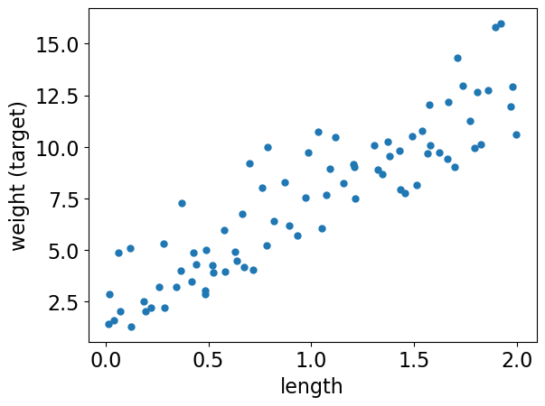
    


Let's plot a linear regression model on this dataset. 


```python
grid = np.linspace(min(X_train)[0], max(X_train)[0], 1000)
grid = grid.reshape(-1, 1)
```


```python
from sklearn.linear_model import Ridge

r = Ridge()
r.fit(X_train, y_train)
plt.plot(X_train, y_train, ".", markersize=10)
plt.plot(grid, r.predict(grid))
plt.grid(True)
plt.xlabel("length")
plt.ylabel("weight (target)");
```


    
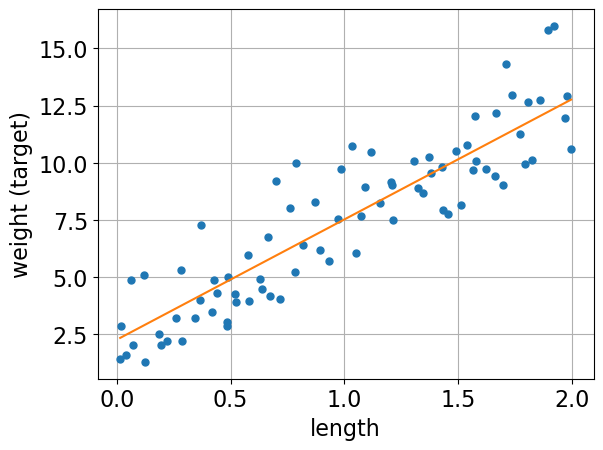
    


**The orange line is the learned linear model.**

### Prediction of linear regression

- Given a snake length, we can use the model above to predict the target (i.e., the weight of the snake). 
- The prediction will be the corresponding weight on the orange line. 


```python
snake_length = 0.75
r.predict([[snake_length]])
```


    array([6.20683258])


#### What are we exactly learning? 

- The model above is a line, which can be represented with a slope (i.e., coefficient or weight) and an intercept. 
- For the above model, we can access the slope (i.e., coefficient or weight) and the intercept using `coef_` and `intercept_`, respectively. 


```python
r.coef_  # r is our linear regression object
```


    array([5.26370005])


```python
r.intercept_  # r is our linear regression object
```


    np.float64(2.2590575478171884)


### How are we making predictions? 
- Given a feature value $x_1$ and learned coefficient $w_1$ and intercept $b$, we can get the prediction $\hat{y}$ with the following formula:
$$\hat{y} = w_1x_1 + b$$


```python
prediction = snake_length * r.coef_ + r.intercept_
prediction
```


    array([6.20683258])


```python
r.predict([[snake_length]])
```


    array([6.20683258])


Great! Now we exactly know how the model is making the prediction. 

### Generalizing to more features
For more features, the model is a higher dimensional hyperplane and the general prediction formula looks as follows: 

$\hat{y} =$ <font color="red">$w_1$</font> <font color="blue">$x_1$ </font> $+ \dots +$ <font color="red">$w_d$</font> <font color="blue">$x_d$</font> + <font  color="green"> $b$</font>

where, 
- <font  color="blue"> ($x_1, \dots, x_d$) are input features </font>
- <font  color="red"> ($w_1, \dots, w_d$) are coefficients or weights </font> (learned from the data)
- <font  color="green"> $b$ is the bias which can be used to offset your hyperplane </font> (learned from the data)

### Example 

- Suppose these are the coefficients learned by a linear regression model on a hypothetical housing price prediction dataset. 

| Feature | Learned coefficient |
|--------------------|---------------------:|
| Bedrooms | 0.20 |
| Bathrooms| 0.11 |
| Square Footage | 0.002 |
| Age | -0.02 |

- Now given a new example, the target will be predicted as follows: 
| Bedrooms | Bathrooms | Square Footage | Age |
|--------------------|---------------------|----------------|-----| 
| 3                  | 2                   | 1875           | 66  |

$$\hat{y} = w_1x_1 + w_2x_2 + w_3x_3 + w_4x_4 + b$$

$$\text{predicted price}=  0.20 \times 3 + 0.11 \times 2 + 0.002 \times 1875 + (-0.02) \times 66 + b$$

When we call `fit`, a coefficient or weight is learned for each feature which tells us the role of that feature in prediction. These coefficients are learned from the training data.  

```{important}
In linear models for regression, the model is a line for a single feature, a plane for two features, and a hyperplane for higher dimensions. We are not yet ready to discuss how does linear regression learn these coefficients and intercept.
```

### `Ridge`

- `scikit-learn` has a model called `LinearRegression` for linear regression. 
- But if we use this "vanilla" version of linear regression, it may result in large coefficients and unexpected results. 
- So instead of using `LinearRegression`, we will always use another linear model called `Ridge`, which is a linear regression model with a complexity hyperparameter `alpha`.


```python
from sklearn.linear_model import LinearRegression  # DO NOT USE IT IN THIS COURSE
from sklearn.linear_model import Ridge  # USE THIS INSTEAD
```

#### Data

Let's use `sklearn`'s built in regression dataset, the Boston Housing dataset. The task associated with this dataset is to predict the median value of homes in several Boston neighborhoods in the 1970s, using information such as crime rate in the neighbourhood, average number of rooms, proximity to the Charles River, highway accessibility, and so on.


```python
from sklearn.datasets import fetch_california_housing


california = fetch_california_housing()
X_train, X_test, y_train, y_test = train_test_split(
    california.data, california.target, test_size=0.2
)
pd.DataFrame(X_train, columns=california.feature_names)
```


<div>
<style scoped>
    .dataframe tbody tr th:only-of-type {
        vertical-align: middle;
    }

    .dataframe tbody tr th {
        vertical-align: top;
    }

    .dataframe thead th {
        text-align: right;
    }
</style>
<table border="1" class="dataframe">
  <thead>
    <tr style="text-align: right;">
      <th></th>
      <th>MedInc</th>
      <th>HouseAge</th>
      <th>AveRooms</th>
      <th>AveBedrms</th>
      <th>Population</th>
      <th>AveOccup</th>
      <th>Latitude</th>
      <th>Longitude</th>
    </tr>
  </thead>
  <tbody>
    <tr>
      <th>0</th>
      <td>2.0000</td>
      <td>52.0</td>
      <td>5.303030</td>
      <td>1.082251</td>
      <td>725.0</td>
      <td>3.138528</td>
      <td>38.03</td>
      <td>-121.88</td>
    </tr>
    <tr>
      <th>1</th>
      <td>2.0000</td>
      <td>52.0</td>
      <td>5.506410</td>
      <td>1.134615</td>
      <td>1026.0</td>
      <td>3.288462</td>
      <td>34.00</td>
      <td>-118.30</td>
    </tr>
    <tr>
      <th>2</th>
      <td>4.0474</td>
      <td>30.0</td>
      <td>5.419355</td>
      <td>1.006452</td>
      <td>858.0</td>
      <td>2.767742</td>
      <td>37.31</td>
      <td>-121.94</td>
    </tr>
    <tr>
      <th>3</th>
      <td>3.2794</td>
      <td>7.0</td>
      <td>5.546473</td>
      <td>1.044166</td>
      <td>5146.0</td>
      <td>3.392221</td>
      <td>34.46</td>
      <td>-117.20</td>
    </tr>
    <tr>
      <th>4</th>
      <td>2.5551</td>
      <td>35.0</td>
      <td>4.018487</td>
      <td>1.016807</td>
      <td>1886.0</td>
      <td>3.169748</td>
      <td>37.35</td>
      <td>-121.86</td>
    </tr>
    <tr>
      <th>...</th>
      <td>...</td>
      <td>...</td>
      <td>...</td>
      <td>...</td>
      <td>...</td>
      <td>...</td>
      <td>...</td>
      <td>...</td>
    </tr>
    <tr>
      <th>16507</th>
      <td>3.0185</td>
      <td>17.0</td>
      <td>4.205479</td>
      <td>0.863014</td>
      <td>434.0</td>
      <td>1.981735</td>
      <td>34.61</td>
      <td>-120.16</td>
    </tr>
    <tr>
      <th>16508</th>
      <td>12.6320</td>
      <td>5.0</td>
      <td>7.462963</td>
      <td>0.888889</td>
      <td>208.0</td>
      <td>3.851852</td>
      <td>34.44</td>
      <td>-119.31</td>
    </tr>
    <tr>
      <th>16509</th>
      <td>3.9808</td>
      <td>20.0</td>
      <td>5.678689</td>
      <td>1.006557</td>
      <td>999.0</td>
      <td>3.275410</td>
      <td>38.28</td>
      <td>-121.20</td>
    </tr>
    <tr>
      <th>16510</th>
      <td>5.8195</td>
      <td>25.0</td>
      <td>6.585513</td>
      <td>0.961771</td>
      <td>1645.0</td>
      <td>3.309859</td>
      <td>33.71</td>
      <td>-117.97</td>
    </tr>
    <tr>
      <th>16511</th>
      <td>3.7315</td>
      <td>20.0</td>
      <td>7.368304</td>
      <td>1.738839</td>
      <td>1085.0</td>
      <td>2.421875</td>
      <td>37.58</td>
      <td>-118.74</td>
    </tr>
  </tbody>
</table>
<p>16512 rows × 8 columns</p>
</div>


```python
print(california.DESCR)
```

    .. _california_housing_dataset:
    
    California Housing dataset
    --------------------------
    
    **Data Set Characteristics:**
    
    :Number of Instances: 20640
    
    :Number of Attributes: 8 numeric, predictive attributes and the target
    
    :Attribute Information:
        - MedInc        median income in block group
        - HouseAge      median house age in block group
        - AveRooms      average number of rooms per household
        - AveBedrms     average number of bedrooms per household
        - Population    block group population
        - AveOccup      average number of household members
        - Latitude      block group latitude
        - Longitude     block group longitude
    
    :Missing Attribute Values: None
    
    This dataset was obtained from the StatLib repository.
    https://www.dcc.fc.up.pt/~ltorgo/Regression/cal_housing.html
    
    The target variable is the median house value for California districts,
    expressed in hundreds of thousands of dollars ($100,000).
    
    This dataset was derived from the 1990 U.S. census, using one row per census
    block group. A block group is the smallest geographical unit for which the U.S.
    Census Bureau publishes sample data (a block group typically has a population
    of 600 to 3,000 people).
    
    A household is a group of people residing within a home. Since the average
    number of rooms and bedrooms in this dataset are provided per household, these
    columns may take surprisingly large values for block groups with few households
    and many empty houses, such as vacation resorts.
    
    It can be downloaded/loaded using the
    :func:`sklearn.datasets.fetch_california_housing` function.
    
    .. rubric:: References
    
    - Pace, R. Kelley and Ronald Barry, Sparse Spatial Autoregressions,
      Statistics and Probability Letters, 33:291-297, 1997.
    


#### `Ridge` on the California housing dataset


```python
pipe = make_pipeline(StandardScaler(), Ridge())
scores = cross_validate(pipe, X_train, y_train, return_train_score=True)
pd.DataFrame(scores)
```


<div>
<style scoped>
    .dataframe tbody tr th:only-of-type {
        vertical-align: middle;
    }

    .dataframe tbody tr th {
        vertical-align: top;
    }

    .dataframe thead th {
        text-align: right;
    }
</style>
<table border="1" class="dataframe">
  <thead>
    <tr style="text-align: right;">
      <th></th>
      <th>fit_time</th>
      <th>score_time</th>
      <th>test_score</th>
      <th>train_score</th>
    </tr>
  </thead>
  <tbody>
    <tr>
      <th>0</th>
      <td>0.003478</td>
      <td>0.000542</td>
      <td>0.599492</td>
      <td>0.608050</td>
    </tr>
    <tr>
      <th>1</th>
      <td>0.002103</td>
      <td>0.000305</td>
      <td>0.613507</td>
      <td>0.604619</td>
    </tr>
    <tr>
      <th>2</th>
      <td>0.001686</td>
      <td>0.000270</td>
      <td>0.598100</td>
      <td>0.608468</td>
    </tr>
    <tr>
      <th>3</th>
      <td>0.001673</td>
      <td>0.000270</td>
      <td>0.612621</td>
      <td>0.604797</td>
    </tr>
    <tr>
      <th>4</th>
      <td>0.001629</td>
      <td>0.000256</td>
      <td>0.601790</td>
      <td>0.606902</td>
    </tr>
  </tbody>
</table>
</div>


#### Hyperparameter `alpha` of `Ridge`

- Ridge has hyperparameters just like the rest of the models we learned.
- The alpha hyperparameter is what makes `Ridge` different from vanilla `LinearRegression`. 
- Similar to the other hyperparameters that we saw, `alpha` controls the fundamental tradeoff. 

```{note}
If we set alpha=0 that is the same as using LinearRegression.
```

Let's examine the effect of `alpha` on the fundamental tradeoff. 


```python
scores_dict = {
    "alpha": 10.0 ** np.arange(-3, 6, 1),
    "mean_train_scores": list(),
    "mean_cv_scores": list(),
}
for alpha in scores_dict["alpha"]:
    pipe_ridge = make_pipeline(StandardScaler(), Ridge(alpha=alpha))
    scores = cross_validate(pipe_ridge, X_train, y_train, return_train_score=True)
    scores_dict["mean_train_scores"].append(scores["train_score"].mean())
    scores_dict["mean_cv_scores"].append(scores["test_score"].mean())

results_df = pd.DataFrame(scores_dict)
```


```python
results_df
```


<div>
<style scoped>
    .dataframe tbody tr th:only-of-type {
        vertical-align: middle;
    }

    .dataframe tbody tr th {
        vertical-align: top;
    }

    .dataframe thead th {
        text-align: right;
    }
</style>
<table border="1" class="dataframe">
  <thead>
    <tr style="text-align: right;">
      <th></th>
      <th>alpha</th>
      <th>mean_train_scores</th>
      <th>mean_cv_scores</th>
    </tr>
  </thead>
  <tbody>
    <tr>
      <th>0</th>
      <td>0.001</td>
      <td>0.606567</td>
      <td>0.605101</td>
    </tr>
    <tr>
      <th>1</th>
      <td>0.010</td>
      <td>0.606567</td>
      <td>0.605101</td>
    </tr>
    <tr>
      <th>2</th>
      <td>0.100</td>
      <td>0.606567</td>
      <td>0.605101</td>
    </tr>
    <tr>
      <th>3</th>
      <td>1.000</td>
      <td>0.606567</td>
      <td>0.605102</td>
    </tr>
    <tr>
      <th>4</th>
      <td>10.000</td>
      <td>0.606557</td>
      <td>0.605100</td>
    </tr>
    <tr>
      <th>5</th>
      <td>100.000</td>
      <td>0.605696</td>
      <td>0.604320</td>
    </tr>
    <tr>
      <th>6</th>
      <td>1000.000</td>
      <td>0.579432</td>
      <td>0.578523</td>
    </tr>
    <tr>
      <th>7</th>
      <td>10000.000</td>
      <td>0.431137</td>
      <td>0.430868</td>
    </tr>
    <tr>
      <th>8</th>
      <td>100000.000</td>
      <td>0.116167</td>
      <td>0.115956</td>
    </tr>
  </tbody>
</table>
</div>


Here we do not really see overfitting but in general, 
- larger `alpha` $\rightarrow$ likely to underfit
- smaller `alpha` $\rightarrow$ likely to overfit

#### Coefficients and intercept

The model learns 
- coefficients associated with each feature
- the intercept or bias

Let's examine the coefficients learned by the model. 


```python
pipe_ridge = make_pipeline(StandardScaler(), Ridge(alpha=1.0))
pipe_ridge.fit(X_train, y_train)
coeffs = pipe_ridge.named_steps["ridge"].coef_
```


```python
pd.DataFrame(data=coeffs, index=california.feature_names, columns=["Coefficients"])
```


<div>
<style scoped>
    .dataframe tbody tr th:only-of-type {
        vertical-align: middle;
    }

    .dataframe tbody tr th {
        vertical-align: top;
    }

    .dataframe thead th {
        text-align: right;
    }
</style>
<table border="1" class="dataframe">
  <thead>
    <tr style="text-align: right;">
      <th></th>
      <th>Coefficients</th>
    </tr>
  </thead>
  <tbody>
    <tr>
      <th>MedInc</th>
      <td>0.827039</td>
    </tr>
    <tr>
      <th>HouseAge</th>
      <td>0.117058</td>
    </tr>
    <tr>
      <th>AveRooms</th>
      <td>-0.265273</td>
    </tr>
    <tr>
      <th>AveBedrms</th>
      <td>0.307521</td>
    </tr>
    <tr>
      <th>Population</th>
      <td>-0.003194</td>
    </tr>
    <tr>
      <th>AveOccup</th>
      <td>-0.039498</td>
    </tr>
    <tr>
      <th>Latitude</th>
      <td>-0.895963</td>
    </tr>
    <tr>
      <th>Longitude</th>
      <td>-0.866110</td>
    </tr>
  </tbody>
</table>
</div>


- The model also learns an intercept (bias). 
- For each prediction, we are adding this amount irrespective of the feature values.  


```python
pipe_ridge.named_steps["ridge"].intercept_
```


    np.float64(2.0667579112160865)


Can we use this information to interpret model predictions? 

## ❓❓ Questions for you

### (iClicker) Exercise 8.1 

**Select all of the following statements which are TRUE.**

- (A) Increasing the hyperparameter `alpha` of `Ridge` is likely to decrease model complexity.
- (B) `Ridge` can be used with datasets that have multiple features.
- (C) With Ridge, we learn one coefficient per training example.
- (D) If you train a linear regression model on a 2-dimensional problem (2 features), the model will learn 3 parameters: one for each feature and one for the bias term. 

```{admonition} V's Solutions!
:class: tip, dropdown
A, B, D
```

<br><br><br><br>

## Interpretation of coefficients 

- One of the main advantages of linear models is that they are relatively easy to interpret. 
- We have one coefficient per feature which kind of describes the role of the feature in the prediction according to the model. 

There are two pieces of information in the coefficients based on

- Sign
- Magnitude

### Sign of the coefficients

In the example below, for instance: 
- MedInc (median income) has a **positive coefficient**
    - the prediction will be proportional to the feature value; as MedInc gets **bigger**, the median house value gets **bigger** 
- AveRooms (Average number of rooms) has a **negative coefficient**
    - the prediction will be inversely proportional to the feature value; as AveRooms gets **bigger**, the median house value gets **smaller**


```python
pd.DataFrame(data=coeffs, index=california.feature_names, columns=["Coefficients"])
```


<div>
<style scoped>
    .dataframe tbody tr th:only-of-type {
        vertical-align: middle;
    }

    .dataframe tbody tr th {
        vertical-align: top;
    }

    .dataframe thead th {
        text-align: right;
    }
</style>
<table border="1" class="dataframe">
  <thead>
    <tr style="text-align: right;">
      <th></th>
      <th>Coefficients</th>
    </tr>
  </thead>
  <tbody>
    <tr>
      <th>MedInc</th>
      <td>0.827039</td>
    </tr>
    <tr>
      <th>HouseAge</th>
      <td>0.117058</td>
    </tr>
    <tr>
      <th>AveRooms</th>
      <td>-0.265273</td>
    </tr>
    <tr>
      <th>AveBedrms</th>
      <td>0.307521</td>
    </tr>
    <tr>
      <th>Population</th>
      <td>-0.003194</td>
    </tr>
    <tr>
      <th>AveOccup</th>
      <td>-0.039498</td>
    </tr>
    <tr>
      <th>Latitude</th>
      <td>-0.895963</td>
    </tr>
    <tr>
      <th>Longitude</th>
      <td>-0.866110</td>
    </tr>
  </tbody>
</table>
</div>


#### Magnitude of the coefficients

- Bigger magnitude $\rightarrow$ bigger impact on the prediction 
- In the example below, both MedInc and AveBedrms have a positive impact on the prediction but MedInc would have a bigger positive impact because it's feature value is going to be multiplied by a number with a bigger magnitude. 


```python
data = {
    "coefficient": pipe_ridge.named_steps["ridge"].coef_.tolist(),
    "magnitude": np.absolute(pipe_ridge.named_steps["ridge"].coef_.tolist()),
}
coef_df = pd.DataFrame(data, index=california.feature_names).sort_values(
    "magnitude", ascending=False
)
coef_df
```


<div>
<style scoped>
    .dataframe tbody tr th:only-of-type {
        vertical-align: middle;
    }

    .dataframe tbody tr th {
        vertical-align: top;
    }

    .dataframe thead th {
        text-align: right;
    }
</style>
<table border="1" class="dataframe">
  <thead>
    <tr style="text-align: right;">
      <th></th>
      <th>coefficient</th>
      <th>magnitude</th>
    </tr>
  </thead>
  <tbody>
    <tr>
      <th>Latitude</th>
      <td>-0.895963</td>
      <td>0.895963</td>
    </tr>
    <tr>
      <th>Longitude</th>
      <td>-0.866110</td>
      <td>0.866110</td>
    </tr>
    <tr>
      <th>MedInc</th>
      <td>0.827039</td>
      <td>0.827039</td>
    </tr>
    <tr>
      <th>AveBedrms</th>
      <td>0.307521</td>
      <td>0.307521</td>
    </tr>
    <tr>
      <th>AveRooms</th>
      <td>-0.265273</td>
      <td>0.265273</td>
    </tr>
    <tr>
      <th>HouseAge</th>
      <td>0.117058</td>
      <td>0.117058</td>
    </tr>
    <tr>
      <th>AveOccup</th>
      <td>-0.039498</td>
      <td>0.039498</td>
    </tr>
    <tr>
      <th>Population</th>
      <td>-0.003194</td>
      <td>0.003194</td>
    </tr>
  </tbody>
</table>
</div>


### Importance of scaling 
- When you are interpreting the model coefficients, scaling is crucial. 
- If you do not scale the data, features with smaller magnitude are going to get coefficients with bigger magnitude whereas features with bigger scale are going to get coefficients with smaller magnitude.
- That said, when you scale the data, feature values become hard to interpret for humans!

```{Important}
Take these coefficients with a grain of salt. They might not always match your intuitions. Also, they do not tell us about how the world works. They only tell us about how the prediction of your model works. 
```

<br><br>

## ❓❓ Questions for you

- Discuss the importance of scaling when interpreting linear regression coefficients. 
- What might be the meaning of complex vs simpler model in case of linear regression? 

<br><br><br><br>

## Logistic regression [[video](https://youtu.be/56L5z_t22qE)]

### Logistic regression intuition 

- A linear model for **classification**. 
- Similar to linear regression, it learns weights associated with each feature and the bias. 
- It applies a **threshold** on the raw output to decide whether the class is positive or negative. 
- In this lecture we will focus on the following aspects of logistic regression.  
    - `predict`, `predict_proba` 
    - how to use learned coefficients to interpret the model

### Motivating example 

- Consider the problem of predicting sentiment expressed in movie reviews. 

#### Training data for the motivating example


<blockquote> 
    <p>Review 1: This movie was <b>excellent</b>! The performances were oscar-worthy!  👍 </p> 
    <p>Review 2: What a <b>boring</b> movie! I almost fell asleep twice while watching it. 👎 </p> 
    <p>Review 3: I enjoyed the movie. <b>Excellent</b>! 👍 </p>             
</blockquote>  

- Targets: positive 👍 and negative 👎
- Features: words (e.g., *excellent*, *flawless*, *boring*)


#### Learned coefficients associated with all features

- Suppose our vocabulary contains only the following 7 words. 
- A linear classifier learns **weights** or **coefficients** associated with the features (words in this example).  
- Let's ignore bias for a bit.


#### Predicting with learned weights 
- Use these learned coefficients to make predictions. For example, consider the following review $x_i$. 
<blockquote> 
It got a bit <b>boring</b> at times but the direction was <b>excellent</b> and the acting was <b>flawless</b>.
</blockquote>
- Feature vector for $x_i$: [1, 0, 1, 1, 0, 0, 0]

- $score(x_i) = $ coefficient(*boring*) $\times 1$ + coefficient(*excellent*) $\times 1$ + coefficient(*flawless*) $\times 1$ = $-1.40 + 1.93 + 1.43 = 1.96$

- $1.96 > 0$ so predict the review as positive 👍. 


```python
x = ["boring=1", "excellent=1", "flawless=1"]
w = [-1.40, 1.93, 1.43]
display(plot_logistic_regression(x, w))
```

    Weighted sum of the input features = 1.960 y_hat = pos


    
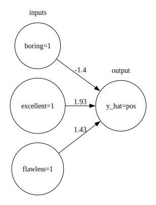
    


- So the prediction is based on the weighted sum of the input features.
- Some feature are pulling the prediction towards positive sentiment and some are pulling it towards negative sentiment. 
- If the coefficient of _boring_ had a bigger magnitude or _excellent_ and _flawless_ had smaller magnitudes, we would have predicted "neg".   


```python
def f(w_0):
    x = ["boring=1", "excellent=1", "flawless=1"]
    w = [-1.40, 1.93, 1.43]
    w[0] = w_0
    print(w)
    display(plot_logistic_regression(x, w))
```


```python
interactive(
    f,
    w_0=widgets.FloatSlider(min=-6, max=2, step=0.5, value=-1.40),
)
```


    interactive(children=(FloatSlider(value=-1.4, description='w_0', max=2.0, min=-6.0, step=0.5), Output()), _dom…


In our case, for values for the coefficient of _boring_ < -3.36, the prediction would be negative. 

A linear model learns these coefficients or weights from the training data! 

So a linear classifier is a linear function of the input `X`, followed by a threshold. 

$$
\begin{equation}
\begin{split}
z =& w_1x_1 + \dots + w_dx_d + b\\
=& w^Tx + b
\end{split}
\end{equation}$$

$$\hat{y} = \begin{cases}
         1, & \text{if } z \geq r\\
         -1, & \text{if } z < r
\end{cases}$$

#### Components of a linear classifier

1. input features ($x_1, \dots, x_d$)
2. coefficients (weights) ($w_1, \dots, w_d$)
3. bias ($b$ or $w_0$) (can be used to offset your hyperplane)
4. threshold ($r$)

In our example before, we assumed $r=0$ and $b=0$.

### Logistic regression on the cities data


```python
cities_df = pd.read_csv(DATA_DIR + "canada_usa_cities.csv")
train_df, test_df = train_test_split(cities_df, test_size=0.2, random_state=123)
X_train, y_train = train_df.drop(columns=["country"]).values, train_df["country"].values
X_test, y_test = test_df.drop(columns=["country"]).values, test_df["country"].values

cols = train_df.drop(columns=["country"]).columns
train_df.head()
```


<div>
<style scoped>
    .dataframe tbody tr th:only-of-type {
        vertical-align: middle;
    }

    .dataframe tbody tr th {
        vertical-align: top;
    }

    .dataframe thead th {
        text-align: right;
    }
</style>
<table border="1" class="dataframe">
  <thead>
    <tr style="text-align: right;">
      <th></th>
      <th>longitude</th>
      <th>latitude</th>
      <th>country</th>
    </tr>
  </thead>
  <tbody>
    <tr>
      <th>160</th>
      <td>-76.4813</td>
      <td>44.2307</td>
      <td>Canada</td>
    </tr>
    <tr>
      <th>127</th>
      <td>-81.2496</td>
      <td>42.9837</td>
      <td>Canada</td>
    </tr>
    <tr>
      <th>169</th>
      <td>-66.0580</td>
      <td>45.2788</td>
      <td>Canada</td>
    </tr>
    <tr>
      <th>188</th>
      <td>-73.2533</td>
      <td>45.3057</td>
      <td>Canada</td>
    </tr>
    <tr>
      <th>187</th>
      <td>-67.9245</td>
      <td>47.1652</td>
      <td>Canada</td>
    </tr>
  </tbody>
</table>
</div>


Let's first try `DummyClassifier` on the cities data. 


```python
dummy = DummyClassifier()
scores = cross_validate(dummy, X_train, y_train, return_train_score=True)
pd.DataFrame(scores)
```


<div>
<style scoped>
    .dataframe tbody tr th:only-of-type {
        vertical-align: middle;
    }

    .dataframe tbody tr th {
        vertical-align: top;
    }

    .dataframe thead th {
        text-align: right;
    }
</style>
<table border="1" class="dataframe">
  <thead>
    <tr style="text-align: right;">
      <th></th>
      <th>fit_time</th>
      <th>score_time</th>
      <th>test_score</th>
      <th>train_score</th>
    </tr>
  </thead>
  <tbody>
    <tr>
      <th>0</th>
      <td>0.000251</td>
      <td>0.000520</td>
      <td>0.588235</td>
      <td>0.601504</td>
    </tr>
    <tr>
      <th>1</th>
      <td>0.000135</td>
      <td>0.000215</td>
      <td>0.588235</td>
      <td>0.601504</td>
    </tr>
    <tr>
      <th>2</th>
      <td>0.000107</td>
      <td>0.000161</td>
      <td>0.606061</td>
      <td>0.597015</td>
    </tr>
    <tr>
      <th>3</th>
      <td>0.000090</td>
      <td>0.000151</td>
      <td>0.606061</td>
      <td>0.597015</td>
    </tr>
    <tr>
      <th>4</th>
      <td>0.000087</td>
      <td>0.000145</td>
      <td>0.606061</td>
      <td>0.597015</td>
    </tr>
  </tbody>
</table>
</div>


Now let's try `LogisticRegression`


```python
from sklearn.linear_model import LogisticRegression

lr = LogisticRegression()
scores = cross_validate(lr, X_train, y_train, return_train_score=True)
pd.DataFrame(scores)
```


<div>
<style scoped>
    .dataframe tbody tr th:only-of-type {
        vertical-align: middle;
    }

    .dataframe tbody tr th {
        vertical-align: top;
    }

    .dataframe thead th {
        text-align: right;
    }
</style>
<table border="1" class="dataframe">
  <thead>
    <tr style="text-align: right;">
      <th></th>
      <th>fit_time</th>
      <th>score_time</th>
      <th>test_score</th>
      <th>train_score</th>
    </tr>
  </thead>
  <tbody>
    <tr>
      <th>0</th>
      <td>0.008704</td>
      <td>0.000351</td>
      <td>0.852941</td>
      <td>0.827068</td>
    </tr>
    <tr>
      <th>1</th>
      <td>0.002323</td>
      <td>0.000246</td>
      <td>0.823529</td>
      <td>0.827068</td>
    </tr>
    <tr>
      <th>2</th>
      <td>0.001963</td>
      <td>0.000254</td>
      <td>0.696970</td>
      <td>0.858209</td>
    </tr>
    <tr>
      <th>3</th>
      <td>0.001884</td>
      <td>0.000221</td>
      <td>0.787879</td>
      <td>0.843284</td>
    </tr>
    <tr>
      <th>4</th>
      <td>0.001814</td>
      <td>0.000252</td>
      <td>0.939394</td>
      <td>0.805970</td>
    </tr>
  </tbody>
</table>
</div>


Logistic regression seems to be doing better than dummy classifier. But note that there is a lot of variation in the scores. 

### Accessing learned parameters

- Recall that logistic regression learns the weights $w$ and bias or intercept $b$.

- How to access these weights? 
    - Similar to `Ridge`, we can access the weights and intercept using `coef_` and `intercept_` attribute of the `LogisticRegression` object, respectively. 


```python
lr = LogisticRegression()
lr.fit(X_train, y_train)
print("Model weights: %s" % (lr.coef_))  # these are the learned weights
print("Model intercept: %s" % (lr.intercept_))  # this is the bias term
data = {"features": cols, "coefficients": lr.coef_[0]}
pd.DataFrame(data)
```

    Model weights: [[-0.04108378 -0.33683087]]
    Model intercept: [10.886759]


<div>
<style scoped>
    .dataframe tbody tr th:only-of-type {
        vertical-align: middle;
    }

    .dataframe tbody tr th {
        vertical-align: top;
    }

    .dataframe thead th {
        text-align: right;
    }
</style>
<table border="1" class="dataframe">
  <thead>
    <tr style="text-align: right;">
      <th></th>
      <th>features</th>
      <th>coefficients</th>
    </tr>
  </thead>
  <tbody>
    <tr>
      <th>0</th>
      <td>longitude</td>
      <td>-0.041084</td>
    </tr>
    <tr>
      <th>1</th>
      <td>latitude</td>
      <td>-0.336831</td>
    </tr>
  </tbody>
</table>
</div>


- Both negative weights 
- The weight of latitude is larger in magnitude. 
- This makes sense because Canada as a country lies above the USA and so we expect latitude values to contribute more to a prediction than longitude. 

### Prediction with learned parameters

Let's predict target of a test example. 


```python
example = X_test[0, :]
example
```


    array([-64.8001,  46.098 ])


#### Raw scores

- Calculate the raw score as: ```y_hat = np.dot(w, x) + b```


```python
(
    np.dot(
        example,
        lr.coef_.reshape(
            2,
        ),
    )
    + lr.intercept_
)
```


    array([-1.97823755])


- Apply the threshold to the raw score. 
- Since the prediction is < 0, predict "negative". 
- What is a "negative" class in our context? 
- With logistic regression, the model randomly assigns one of the classes as a positive class and the other as negative. 
    - Usually it would alphabetically order the target and pick the first one as negative and second one as the positive class. 

- The `classes_` attribute tells us which class is considered negative and which one is considered positive. - In this case, Canada is the negative class and USA is a positive class. 


```python
lr.classes_
```


    array(['Canada', 'USA'], dtype=object)


- So based on the negative score above (-1.978), we would predict Canada. 
- Let's check the prediction given by the model. 


```python
lr.predict([example])
```


    array(['Canada'], dtype=object)


Great! The predictions match! We exactly know how the model is making predictions. 

### Decision boundary of logistic regression

- The decision boundary of logistic regression is a **hyperplane** dividing the feature space in half. 


```python
lr = LogisticRegression()
lr.fit(X_train, y_train)
mglearn.discrete_scatter(X_train[:, 0], X_train[:, 1], y_train)
mglearn.plots.plot_2d_separator(lr, X_train, fill=False, eps=0.5, alpha=0.7)
plt.title(lr.__class__.__name__)
plt.xlabel("longitude")
plt.ylabel("latitude");
```


    
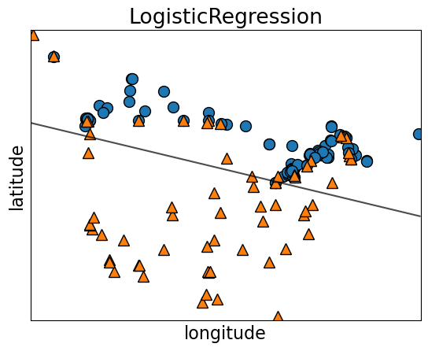
    


- For $d=2$, the decision boundary is a line (1-dimensional)
- For $d=3$, the decision boundary is a plane (2-dimensional)
- For $d\gt 3$, the decision boundary is a $d-1$-dimensional hyperplane


```python
fig, axes = plt.subplots(1, 3, figsize=(20, 5))
for model, ax in zip(
    [KNeighborsClassifier(), SVC(gamma=0.01), LogisticRegression()], axes
):
    clf = model.fit(X_train, y_train)
    mglearn.plots.plot_2d_separator(
        clf, X_train, fill=True, eps=0.5, ax=ax, alpha=0.4
    )
    mglearn.discrete_scatter(X_train[:, 0], X_train[:, 1], y_train, ax=ax)
    ax.set_title(clf.__class__.__name__)
    ax.set_xlabel("longitude")
    ax.set_ylabel("latitude")
axes[0].legend();
```


    
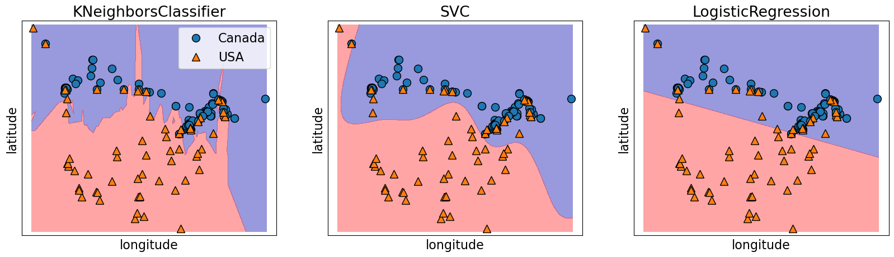
    


- Notice a linear decision boundary (a line in our case). 
- Compare it with  KNN or SVM RBF decision boundaries. 

### Main hyperparameter of logistic regression 

- `C` is the main hyperparameter which controls the fundamental trade-off.
- We won't really talk about the interpretation of this hyperparameter right now. 
- At a high level, the interpretation is similar to `C` of SVM RBF
    - smaller `C` $\rightarrow$ might lead to underfitting
    - bigger `C` $\rightarrow$ might lead to overfitting


```python
scores_dict = {
    "C": 10.0 ** np.arange(-4, 6, 1),
    "mean_train_scores": list(),
    "mean_cv_scores": list(),
}
for C in scores_dict["C"]:
    lr = LogisticRegression(C=C)
    scores = cross_validate(lr, X_train, y_train, return_train_score=True)
    scores_dict["mean_train_scores"].append(scores["train_score"].mean())
    scores_dict["mean_cv_scores"].append(scores["test_score"].mean())

results_df = pd.DataFrame(scores_dict)
results_df
```


<div>
<style scoped>
    .dataframe tbody tr th:only-of-type {
        vertical-align: middle;
    }

    .dataframe tbody tr th {
        vertical-align: top;
    }

    .dataframe thead th {
        text-align: right;
    }
</style>
<table border="1" class="dataframe">
  <thead>
    <tr style="text-align: right;">
      <th></th>
      <th>C</th>
      <th>mean_train_scores</th>
      <th>mean_cv_scores</th>
    </tr>
  </thead>
  <tbody>
    <tr>
      <th>0</th>
      <td>0.0001</td>
      <td>0.664707</td>
      <td>0.658645</td>
    </tr>
    <tr>
      <th>1</th>
      <td>0.0010</td>
      <td>0.784424</td>
      <td>0.790731</td>
    </tr>
    <tr>
      <th>2</th>
      <td>0.0100</td>
      <td>0.827842</td>
      <td>0.826203</td>
    </tr>
    <tr>
      <th>3</th>
      <td>0.1000</td>
      <td>0.832320</td>
      <td>0.820143</td>
    </tr>
    <tr>
      <th>4</th>
      <td>1.0000</td>
      <td>0.832320</td>
      <td>0.820143</td>
    </tr>
    <tr>
      <th>5</th>
      <td>10.0000</td>
      <td>0.832320</td>
      <td>0.820143</td>
    </tr>
    <tr>
      <th>6</th>
      <td>100.0000</td>
      <td>0.832320</td>
      <td>0.820143</td>
    </tr>
    <tr>
      <th>7</th>
      <td>1000.0000</td>
      <td>0.832320</td>
      <td>0.820143</td>
    </tr>
    <tr>
      <th>8</th>
      <td>10000.0000</td>
      <td>0.832320</td>
      <td>0.820143</td>
    </tr>
    <tr>
      <th>9</th>
      <td>100000.0000</td>
      <td>0.832320</td>
      <td>0.820143</td>
    </tr>
  </tbody>
</table>
</div>


<br><br><br><br>

## Predicting probability scores [[video](https://youtu.be/_OAK5KiGLg0)]

### `predict_proba`

- So far in the context of classification problems, we focused on getting "hard" predictions. 
- Very often it's useful to know "soft" predictions, i.e., how confident the model is with a given prediction.  
- For most of the `scikit-learn` classification models we can access this confidence score or probability score using a method called `predict_proba`.  

Let's look at probability scores of logistic regression model for our test example. 


```python
example
```


    array([-64.8001,  46.098 ])


```python
lr = LogisticRegression(random_state=123)
lr.fit(X_train, y_train)
lr.predict([example])  # hard prediction
```


    array(['Canada'], dtype=object)


```python
lr.predict_proba([example])  # soft prediction
```


    array([[0.87849316, 0.12150684]])


- The output of `predict_proba` is the probability of each class. 
- In binary classification, we get probabilities associated with both classes (even though this information is redundant). 
- The first entry is the estimated probability of the first class and the second entry is the estimated probability of the second class from `model.classes_`. 


```python
lr.classes_
```


    array(['Canada', 'USA'], dtype=object)


- Because it's a probability, the sum of the entries for both classes should always sum to 1. 
- Since the probabilities for the two classes sum to 1, exactly one of the classes will have a score >=0.5, which is going to be our predicted class.  

#### How does logistic regression calculate these probabilities? 

- The weighted sum $w_1x_1 + \dots + w_dx_d + b$ gives us "raw model output".
- For linear regression this would have been the prediction.
- For logistic regression, you check the **sign** of this value.
  - If positive (or 0), predict $+1$; if negative, predict $-1$.
  - These are "hard predictions".

- You can also have "soft predictions", aka **predicted probabilities**. 
  - To convert the raw model output into probabilities, instead of taking the sign, we apply the **sigmoid**.

#### The sigmoid function 
- The sigmoid function "squashes" the raw model output from any number to the range $[0,1]$ using the following formula, where $z$ is the raw model output. 
$$\frac{1}{1+e^{-z}}$$
- Then we can interpret the output as probabilities.


```python
sigmoid = lambda z: 1 / (1 + np.exp(-z))
sigmoid(0)
```


    np.float64(0.5)


```python
sigmoid = lambda z: 1 / (1 + np.exp(-z))
raw_model_output = np.linspace(-8, 8, 1000)
plt.plot(raw_model_output, sigmoid(raw_model_output))
plt.plot([0, 0], [0, 0.5], "--k")
plt.plot([-8, 0], [0.5, 0.5], "--k")
plt.xlabel("raw model output, $w^Tx + b$")
plt.ylabel("predicted probability")
plt.title("the sigmoid function");
```


    
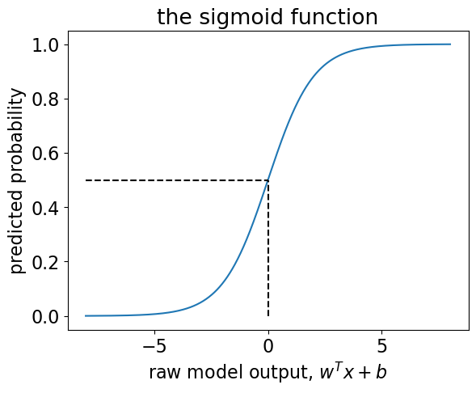
    


- Recall our hard predictions that check the sign of $w^Tx + b$, or, in other words, whether or not it is $\geq 0$.
  - The threshold $w^Tx+b=0$ corresponds to $p=0.5$. 
  - In other words, if our predicted probability is $\geq 0.5$ then our hard prediction is $+1$.

Let's get the probability score by calling sigmoid on the raw model output for our test example.


```python
sigmoid(
    np.dot(
        example,
        lr.coef_.reshape(
            2,
        ),
    )
    + lr.intercept_
)
```


    array([0.12150684])


This is the probability score of the positive class, which is USA. 


```python
lr.predict_proba([example])
```


    array([[0.87849316, 0.12150684]])


With `predict_proba`, we get the same probability score for USA!!

- Let's visualize probability scores for some examples. 


```python
data_dict = {
    "y": y_train[:12],
    "y_hat": lr.predict(X_train[:12]).tolist(),
    "probabilities": lr.predict_proba(X_train[:12]).tolist(),
}
```


```python
pd.DataFrame(data_dict)
```


<div>
<style scoped>
    .dataframe tbody tr th:only-of-type {
        vertical-align: middle;
    }

    .dataframe tbody tr th {
        vertical-align: top;
    }

    .dataframe thead th {
        text-align: right;
    }
</style>
<table border="1" class="dataframe">
  <thead>
    <tr style="text-align: right;">
      <th></th>
      <th>y</th>
      <th>y_hat</th>
      <th>probabilities</th>
    </tr>
  </thead>
  <tbody>
    <tr>
      <th>0</th>
      <td>Canada</td>
      <td>Canada</td>
      <td>[0.7046136400143141, 0.2953863599856858]</td>
    </tr>
    <tr>
      <th>1</th>
      <td>Canada</td>
      <td>Canada</td>
      <td>[0.5630224174651548, 0.43697758253484525]</td>
    </tr>
    <tr>
      <th>2</th>
      <td>Canada</td>
      <td>Canada</td>
      <td>[0.8389756947416367, 0.1610243052583633]</td>
    </tr>
    <tr>
      <th>3</th>
      <td>Canada</td>
      <td>Canada</td>
      <td>[0.7964215270662817, 0.20357847293371834]</td>
    </tr>
    <tr>
      <th>4</th>
      <td>Canada</td>
      <td>Canada</td>
      <td>[0.9010852321946795, 0.09891476780532049]</td>
    </tr>
    <tr>
      <th>5</th>
      <td>Canada</td>
      <td>Canada</td>
      <td>[0.7752884548630534, 0.22471154513694652]</td>
    </tr>
    <tr>
      <th>6</th>
      <td>USA</td>
      <td>USA</td>
      <td>[0.030739733331869412, 0.9692602666681306]</td>
    </tr>
    <tr>
      <th>7</th>
      <td>Canada</td>
      <td>Canada</td>
      <td>[0.6880359361853483, 0.3119640638146517]</td>
    </tr>
    <tr>
      <th>8</th>
      <td>Canada</td>
      <td>Canada</td>
      <td>[0.7891381897690053, 0.21086181023099465]</td>
    </tr>
    <tr>
      <th>9</th>
      <td>USA</td>
      <td>USA</td>
      <td>[0.006546893270012566, 0.9934531067299874]</td>
    </tr>
    <tr>
      <th>10</th>
      <td>USA</td>
      <td>USA</td>
      <td>[0.27874871715903127, 0.7212512828409687]</td>
    </tr>
    <tr>
      <th>11</th>
      <td>Canada</td>
      <td>Canada</td>
      <td>[0.8388866943476289, 0.16111330565237114]</td>
    </tr>
  </tbody>
</table>
</div>


The actual `y` and `y_hat` match in most of the cases but in some cases the model is more confident about the prediction than others. 

#### Least confident cases 

Let's examine some cases where the model is least confident about the prediction. 


```python
least_confident_X = X_train[[127, 141]]
least_confident_X
```


    array([[ -79.7599,   43.6858],
           [-123.078 ,   48.9854]])


```python
least_confident_y = y_train[[127, 141]]
least_confident_y
```


    array(['Canada', 'USA'], dtype=object)


```python
probs = lr.predict_proba(least_confident_X)

data_dict = {
    "y": least_confident_y,
    "y_hat": lr.predict(least_confident_X).tolist(),
    "probability score (Canada)": probs[:, 0],
    "probability score (USA)": probs[:, 1],
}
pd.DataFrame(data_dict)
```


<div>
<style scoped>
    .dataframe tbody tr th:only-of-type {
        vertical-align: middle;
    }

    .dataframe tbody tr th {
        vertical-align: top;
    }

    .dataframe thead th {
        text-align: right;
    }
</style>
<table border="1" class="dataframe">
  <thead>
    <tr style="text-align: right;">
      <th></th>
      <th>y</th>
      <th>y_hat</th>
      <th>probability score (Canada)</th>
      <th>probability score (USA)</th>
    </tr>
  </thead>
  <tbody>
    <tr>
      <th>0</th>
      <td>Canada</td>
      <td>Canada</td>
      <td>0.634397</td>
      <td>0.365603</td>
    </tr>
    <tr>
      <th>1</th>
      <td>USA</td>
      <td>Canada</td>
      <td>0.635648</td>
      <td>0.364352</td>
    </tr>
  </tbody>
</table>
</div>


```python
mglearn.discrete_scatter(
    least_confident_X[:, 0],
    least_confident_X[:, 1],
    least_confident_y,
    markers="o",
)
mglearn.plots.plot_2d_separator(lr, X_train, fill=True, eps=0.5, alpha=0.5)
```


    
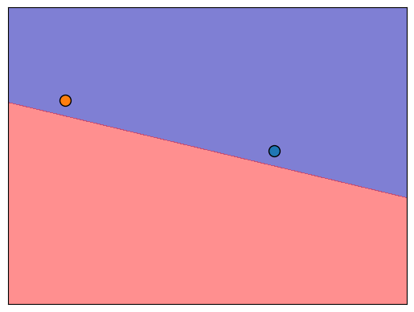
    


The points are close to the decision boundary which makes sense. 

#### Most confident cases 

Let's examine some cases where the model is most confident about the prediction. 


```python
most_confident_X = X_train[[37, 4]]
most_confident_X
```


    array([[-110.9748,   32.2229],
           [ -67.9245,   47.1652]])


```python
most_confident_y = y_train[[37, 165]]
most_confident_y
```


    array(['USA', 'Canada'], dtype=object)


```python
probs = lr.predict_proba(most_confident_X)

data_dict = {
    "y": most_confident_y,
    "y_hat": lr.predict(most_confident_X).tolist(),
    "probability score (Canada)": probs[:, 0],
    "probability score (USA)": probs[:, 1],
}
pd.DataFrame(data_dict)
```


<div>
<style scoped>
    .dataframe tbody tr th:only-of-type {
        vertical-align: middle;
    }

    .dataframe tbody tr th {
        vertical-align: top;
    }

    .dataframe thead th {
        text-align: right;
    }
</style>
<table border="1" class="dataframe">
  <thead>
    <tr style="text-align: right;">
      <th></th>
      <th>y</th>
      <th>y_hat</th>
      <th>probability score (Canada)</th>
      <th>probability score (USA)</th>
    </tr>
  </thead>
  <tbody>
    <tr>
      <th>0</th>
      <td>USA</td>
      <td>USA</td>
      <td>0.010027</td>
      <td>0.989973</td>
    </tr>
    <tr>
      <th>1</th>
      <td>Canada</td>
      <td>Canada</td>
      <td>0.901085</td>
      <td>0.098915</td>
    </tr>
  </tbody>
</table>
</div>


```python
most_confident_X
```


    array([[-110.9748,   32.2229],
           [ -67.9245,   47.1652]])


```python
mglearn.discrete_scatter(
    most_confident_X[:, 0],
    most_confident_X[:, 1],
    most_confident_y,
    markers="o",
)
mglearn.plots.plot_2d_separator(lr, X_train, fill=True, eps=0.5, alpha=0.5)
```


    
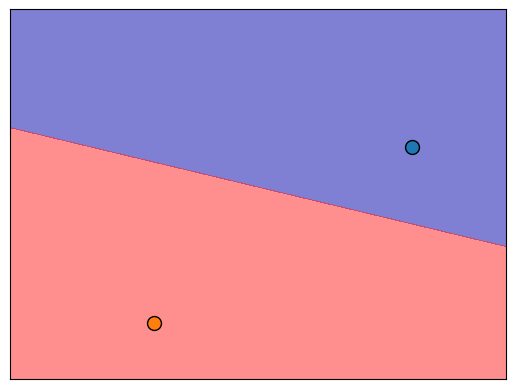
    


The points are far away from the decision boundary which makes sense. 

#### Over confident cases

Let's examine some cases where the model is confident about the prediction but the prediction is wrong. 


```python
over_confident_X = X_train[[25, 98]]
over_confident_X
```


    array([[-129.9912,   55.9383],
           [-134.4197,   58.3019]])


```python
over_confident_y = y_train[[25, 98]]
over_confident_y
```


    array(['Canada', 'USA'], dtype=object)


```python
probs = lr.predict_proba(over_confident_X)

data_dict = {
    "y": over_confident_y,
    "y_hat": lr.predict(over_confident_X).tolist(),
    "probability score (Canada)": probs[:, 0],
    "probability score (USA)": probs[:, 1],
}
pd.DataFrame(data_dict)
```


<div>
<style scoped>
    .dataframe tbody tr th:only-of-type {
        vertical-align: middle;
    }

    .dataframe tbody tr th {
        vertical-align: top;
    }

    .dataframe thead th {
        text-align: right;
    }
</style>
<table border="1" class="dataframe">
  <thead>
    <tr style="text-align: right;">
      <th></th>
      <th>y</th>
      <th>y_hat</th>
      <th>probability score (Canada)</th>
      <th>probability score (USA)</th>
    </tr>
  </thead>
  <tbody>
    <tr>
      <th>0</th>
      <td>Canada</td>
      <td>Canada</td>
      <td>0.931786</td>
      <td>0.068214</td>
    </tr>
    <tr>
      <th>1</th>
      <td>USA</td>
      <td>Canada</td>
      <td>0.961898</td>
      <td>0.038102</td>
    </tr>
  </tbody>
</table>
</div>


```python
mglearn.discrete_scatter(
    over_confident_X[:, 0],
    over_confident_X[:, 1],
    over_confident_y,
    markers="o",
)
mglearn.plots.plot_2d_separator(lr, X_train, fill=True, eps=0.5, alpha=0.5)
```


    
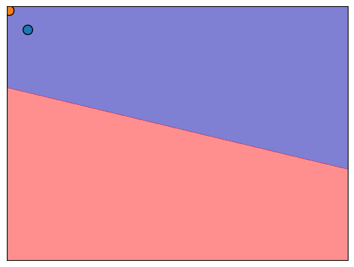
    


- The cities are far away from the decision boundary. So the model is pretty confident about the prediction. 
- But the cities are likely to be from Alaska and our linear model is not able to capture that this part belong to the USA and not Canada.

Below we are using colour to represent prediction probabilities. If you are closer to the border, the model is less confident whereas the model is more confident about the mainland cities, which makes sense.  


```python
plot_probs(lr, X_train, y_train)
```


    
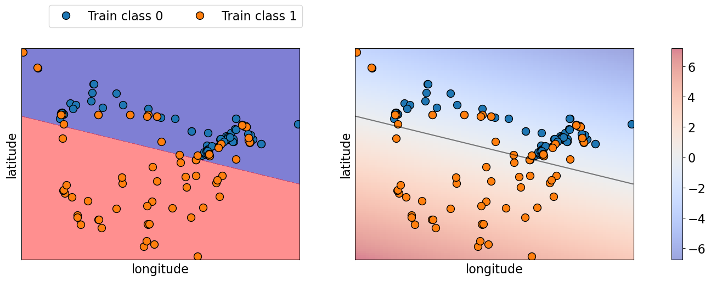
    


Sometimes a complex model that is overfitted, tends to make more confident predictions, even if they are wrong, whereas a simpler model tends to make predictions with more uncertainty. 

To summarize, 
- With hard predictions, we only know the class. 
- With probability scores we know how confident the model is with certain predictions, which can be useful in understanding the model better. 

## ❓❓ Questions for you

### (iClicker) Exercise 8.2

**Select all of the following statements which are TRUE.**

- (A) Increasing logistic regression's `C` hyperparameter increases model complexity.
- (B) The raw output score can be used to calculate the probability score for a given prediction. 
- (C) For linear classifier trained on $d$ features, the decision boundary is a $d-1$-dimensional hyperparlane.  
- (D) A linear model is likely to be uncertain about the data points close to the decision boundary. 

```{admonition} V's Solutions!
:class: tip, dropdown
A, B, C, D
```

<br><br><br><br>

### Linear SVM 

- We have seen non-linear SVM with RBF kernel before. This is the default SVC model in `sklearn` because it tends to work better in many cases. 
- There is also a linear SVM. You can pass `kernel="linear"` to create a linear SVM. 


```python
cities_df = pd.read_csv(DATA_DIR + "canada_usa_cities.csv")
train_df, test_df = train_test_split(cities_df, test_size=0.2, random_state=123)
X_train, y_train = train_df.drop(columns=["country"]).values, train_df["country"].values
X_test, y_test = test_df.drop(columns=["country"]).values, test_df["country"].values
```


```python
fig, axes = plt.subplots(1, 2, figsize=(18, 5))
from matplotlib.colors import ListedColormap

for (model, ax) in zip([SVC(gamma=0.01), SVC(kernel="linear")], axes):
    mglearn.discrete_scatter(
        X_train[:, 0], X_train[:, 1], y_train, markers="o", ax=ax
    )
    model.fit(X_train, y_train)
    ax.set_xlabel("longitude")
    ax.set_ylabel("latitude")
    mglearn.plots.plot_2d_separator(
        model, X_train, fill=True, eps=0.5, ax=ax, alpha=0.5
    )

axes[0].set_title("SVM RBF")
axes[1].set_title("Linear SVM");
```


    
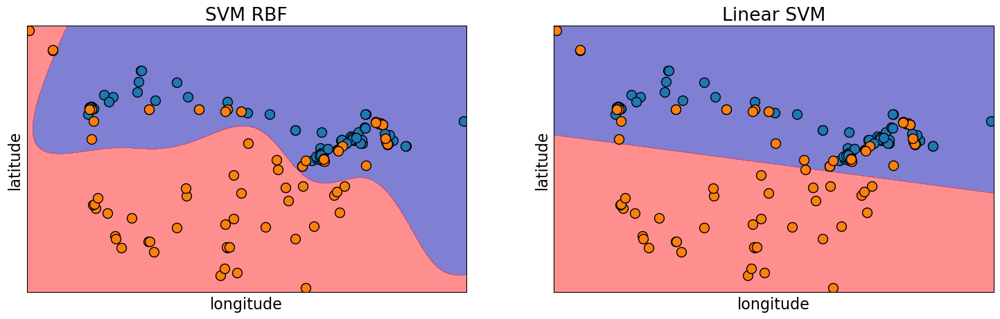
    


- `predict` method of linear SVM and logistic regression works the same way. 
- We can get `coef_` associated with the features and `intercept_` using a Linear SVM model. 


```python
linear_svc = SVC(kernel="linear")
linear_svc.fit(X_train, y_train)
print("Model weights: %s" % (linear_svc.coef_))
print("Model intercept: %s" % (linear_svc.intercept_))
```

    Model weights: [[-0.0195598  -0.23640124]]
    Model intercept: [8.22811601]


```python
lr = LogisticRegression()
lr.fit(X_train, y_train)
print("Model weights: %s" % (lr.coef_))
print("Model intercept: %s" % (lr.intercept_))
```

    Model weights: [[-0.04108378 -0.33683087]]
    Model intercept: [10.886759]


- Note that the coefficients and intercept are slightly different for logistic regression. 
- This is because the `fit` for linear SVM and logistic regression are different. 

<br><br><br><br>

## Multi-class classification 

- So far we have been talking about binary classification 
- Can we use these classifiers when there are more than two classes? 
    - ["ImageNet" computer vision competition](http://www.image-net.org/challenges/LSVRC/), for example, has 1000 classes 
- Can we use decision trees or KNNs for multi-class classification?
- What about logistic regression and Linear SVMs?

- Some models naturally extend to multiclass classification. 
- If they don't a common technique is to reduce multiclass classication into several instances of binary classification problems. 
- Two kind of "hacky" ways to reduce multi-class classification into binary classification:  
    - the one-vs.-rest approach
    - the one-vs.-one approach 


```python
import mglearn
from sklearn.datasets import make_blobs

X, y = make_blobs(centers=4, n_samples=120, cluster_std=2.0, random_state=42)
X_train, X_test, y_train, y_test = train_test_split(
    X, y, test_size=0.2, random_state=123
)
mglearn.discrete_scatter(X_train[:, 0], X_train[:, 1], y_train)
plt.xlabel("Feature 0")
plt.ylabel("Feature 1")
plt.legend(["Class 0", "Class 1", "Class 2", "Class 3"], fontsize=10);
```


    
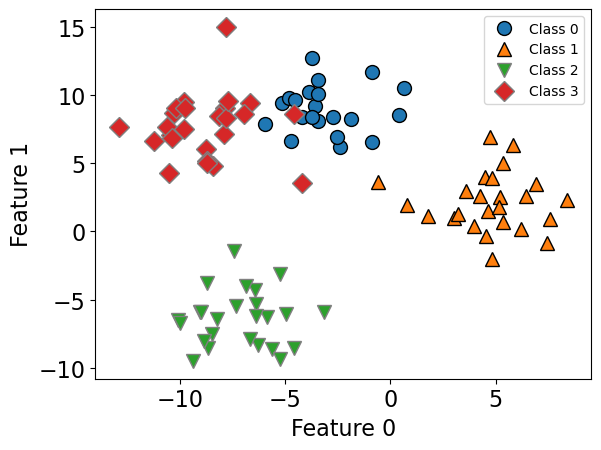
    


```python
lr = LogisticRegression()
lr.fit(X_train, y_train)
```


```python
lr.score(X_train, y_train)
```


    0.96875


```python
lr.score(X_test, y_test)
```


    0.9583333333333334


Logisitic regression learns a coefficient associated with each feature and each class. 


```python
lr.coef_
```


    array([[ 0.29324459,  0.7588186 ],
           [ 1.17054987, -0.31908384],
           [-0.3298721 , -0.84698489],
           [-1.13392236,  0.40725012]])


For each class there is an intercept.  


```python
lr.intercept_
```


    array([-0.64417243,  5.10584062,  1.09706504, -5.55873323])


### Predictions

- Predictions are made by
    - getting raw scores for each class
    - applying **softmax** instead of **sigmoid** to get probability distribution over a number of classes
    - picking the class with the highest prediction probability

### Sigmoid vs. Softmax 
- For binary classification, we used the sigmoid function, which "squashes" the raw model output from any number to the range $[0,1]$ using the following formula, where $x$ is the raw model output. 
$$\frac{1}{1+e^{-x}}$$
- For multiclass classification, instead of sigmoid, we use softmax, which normalizes a set of raw scores into probabilities. 

$$\sigma(\vec{z})_i=\frac{e^{z_i}}{\sum_{j=1}^{K}e^{z_j}}$$

- It basically makes sure all the outputs are probabilities between 0 and 1, and that they all sum to 1.

We can examine class probabilities by calling `predict_proba` on an example. 


```python
lr.predict_proba(X_test)[0]
```


    array([4.10793260e-03, 2.31298589e-08, 5.83848726e-06, 9.95886206e-01])


```python
lr.classes_
```


    array([0, 1, 2, 3])


```python
# The prediction here is class 3 because it has the highest predict proba score of 0.995 
lr.predict(X_test)[0]
```


    np.int64(3)


You will learn more about how `fit` works for Multinomial logistic regression in DSCI 573. 

<br><br><br><br>

## Summary of linear models 
- Linear regression is a linear model for regression whereas logistic regression is a linear model for classification. 
- Both these models learn one coefficient per feature, plus an intercept. 

### Main hyperparameters 
- The main hyperparameter is the "regularization" hyperparameter controlling the fundamental tradeoff. 
    - Logistic Regression: `C`
    - Linear SVM: `C` 
    - Ridge: `alpha`

### Interpretation of coefficients in linear models 
- the $j$th coefficient tells us how feature $j$ affects the prediction
- if $w_j > 0$ then increasing $x_{ij}$ moves us toward predicting $+1$
- if $w_j < 0$ then increasing $x_{ij}$ moves us toward prediction $-1$
- if $w_j == 0$ then the feature is not used in making a prediction

### Strengths of linear models 

- Fast to train and predict
- Scale to large datasets and work well with sparse data 
- Relatively easy to understand and interpret the predictions
- Perform well when there is a large number of features 

### Limitations of linear models 

- Is your data "linearly separable"? Can you draw a hyperplane between these datapoints that separates them with 0 error. 
    - If the training examples can be separated by a linear decision rule, they are **linearly separable**.


A few questions you might be thinking about
- How often the real-life data is linearly separable?
- Is the following XOR function linearly separable?  

| $$x_1$$ | $$x_2$$ | target|
|---------|---------|---------|
| 0 | 0  | 0|
| 0 | 1  | 1|
| 1 | 0  | 1|
| 1 | 1  | 0|    

- Are linear classifiers very limiting because of this?     

## Summary of the course 

- In this course, we learned about some machine learning fundamentals and got introduced to some basic ML algorithms. 
- We also learned about some good habits, such as when to split the data, cross-validation, and being vigilant about the golden rule. 

Here’s a summary of the models we discussed in this course.

Model |      Strengths | Weaknesses | Key hyperparameters |
:-----------|      :------------|:------------|:---------------------|
decision tree | Interpretable; Fast; captures non-linear relationships | Sensitive to the training data; prone to overfitting: sensitive to `max_depth` hyperparameter. | `max_depth`, `min_samples_split`, `min_samples_leaf` |
$k$-NN | Minimal training; capable of modeling complex decision boundaries | Sensitive to feature scaling, choice of $k$; curse of dimensionality; doesn't work well with sparse data; no notion of feature importances | `k` (`n_neighbors` in `sklearn`), distance metric |
SVM RBF | Effective for high-dimensional spaces; robust to overfitting with proper `C` tuning; works well with sparse data  | Slow for large datasets; doesn't scale well, sensitive to feature scaling and careful tuning of the hyperparameters `C` and `gamma`, no notion of feature importances | `C`, `gamma` |
naive Bayes | Fast; scales well; works well with sparse data; probabilistic interpretation. | Conditional independence often unrealistic; generalization performance is usually not that great, limited to classification tasks; not suitable for regression. | `alpha` (smoothing hyperparameter) |
logistic regression | Outputs have a nice probabilistic interpretation; Scales well; works well with sparse data; the learned coefficient provide a nice interpretation for feature importances | doesn't work well when the decision boundaries are non-linear | `C` |
ridge | Handles multicollinearity well; reduces overfitting; interpretable coefficients; scales well | limited because it assumes linear relationship between `X` and `y` | `alpha` |

- When you encounter your next predictive problem, you should now be able to build a simple end-to-end machine learning pipeline, which involves:
    - splitting the data
    - carrying out preliminary exploratory data analysis
    - identifying different kinds of features and what feature transformations you need to apply on each feature  
    - building a pipeline and/or column transformers
    - carrying out automated hyperparameter optimization and picking the best hyperparameters
    - preliminary interpretation the model
    - validating the model on the test set
  

### Coming up ...

A few big questions remain (more to come in 572, 573, 563, 575):

- **How do we choose our features?** (feature selection, dimensionality reduction, regularization etc.)
- **How do we come up with new useful features** (feature engineering)
- **How do we choose between different models?** (different evaluation metrics, what happens if we're not happy with our test error?)
- **How to deal with class imbalance?**
- **What do we do if we do not have targets** (unsupervised learning)
- **How to build models for more interesting data such as images, user preferences, or sequential data?)**

### Final remarks 

I hope you learned something useful from the course. You all are wonderful students and I had fun teaching this course ♥️! 


FYI: The online course evaluations are up, it'll be great if you can fill them in when you get a chance. 

