# Lecture 1: Classification metrics

## Pre-readings
Try your best to watch these before the class.

- **Confusion Matrix:** [StatQuest video](https://www.youtube.com/watch?v=Kdsp6soqA7o)(7m)
- **Precision and Recall:** [StatQuest Sensitivity and Specificity video](https://www.youtube.com/watch?v=vP06aMoz4v8) (11.5m)
- **RUC and AUC**: [StatQuest video](https://www.youtube.com/watch?v=4jRBRDbJemM)(16m)

## Other optional readings:
- Interactive article on Precision and Recall: [mlu-explian](https://mlu-explain.github.io/precision-recall/)
- Interactive article on ROC and AUC: [mlu-explian](https://mlu-explain.github.io/roc-auc/)


## Learning outcomes 

From this lecture, students are expected to be able to:

- Explain why accuracy is not always the best metric in ML.
- Explain components of a confusion matrix. 
- Define precision, recall, and f1-score and use them to evaluate different classifiers. 
- Interpret and use precision-recall curves. 
- Interpret and use ROC curves and ROC AUC using `scikit-learn`.  
- Explain and use `class_weight` to deal with data imbalance.
- Assess model performance on specific groups in a dataset. 

## Lecture slides

````{tab-set}
```{tab-item} Section 1 slides
<html>
  <body>
    <iframe src="lecture_1.pdf#navpanes=0&statusbar=0&messages=0&pagemode=none" width="100%" height="475px" style="position: relative;z-index: 9999999;">
    </iframe>
  </body>
</html>

```

```{tab-item} Section 2 slides
<html>
  <body>
    <iframe src="DSCI_573-Lec1.pdf#navpanes=0&statusbar=0&messages=0&pagemode=none" width="100%" height="475px" style="position: relative;z-index: 9999999;">
    </iframe>
  </body>
</html>
```
````

### Imports


```python
import os
import sys

sys.path.append("code/.")

import IPython
import matplotlib.pyplot as plt
# import mglearn
import numpy as np
import pandas as pd
from IPython.display import HTML, display
from plotting_functions import *
from sklearn.dummy import DummyClassifier
from sklearn.linear_model import LogisticRegression
from sklearn.model_selection import cross_val_score, cross_validate, train_test_split
from sklearn.pipeline import Pipeline, make_pipeline
from sklearn.preprocessing import StandardScaler

# %matplotlib inline
pd.set_option("display.max_colwidth", 200)

from IPython.display import Image
# Ignore future deprecation warnings from sklearn (using `os` instead of `warnings` also works in subprocesses)
import os
os.environ['PYTHONWARNINGS']='ignore::FutureWarning'
```

### Machine learning workflow 

- Here is a typical workflow of a supervised machine learning systems. 
- In DSCI 571, we talked about data splitting, preprocessing, some EDA, model selection with hyperparameter optimization, and interpretation in the context of linear models.
- In DSCI 573, we will talk about, evaluation metrics and model selection in terms of evaluation metrics, feature engineering, feature selection, and model transparency and interpretation.  


 


## Evaluation metrics for binary classification: Motivation 

### Dataset for demonstration 

- Let's classify fraudulent and non-fraudulent credit card transactions using Kaggle's [Credit Card Fraud Detection](https://www.kaggle.com/mlg-ulb/creditcardfraud) data set.


```python
cc_df = pd.read_csv("data/creditcard.zip").assign(Class=lambda df: df['Class'].replace({0: 'Non fraud', 1: 'Fraud'}))
# Sorting columns so it is easier to read
cc_df = cc_df[['Class', 'Time', 'Amount'] + cc_df.columns[cc_df.columns.str.startswith('V')].to_list()]

train_df, test_df = train_test_split(cc_df, test_size=0.3, random_state=111)

train_df
```


<div>
<style scoped>
    .dataframe tbody tr th:only-of-type {
        vertical-align: middle;
    }

    .dataframe tbody tr th {
        vertical-align: top;
    }

    .dataframe thead th {
        text-align: right;
    }
</style>
<table border="1" class="dataframe">
  <thead>
    <tr style="text-align: right;">
      <th></th>
      <th>Class</th>
      <th>Time</th>
      <th>Amount</th>
      <th>V1</th>
      <th>V2</th>
      <th>V3</th>
      <th>V4</th>
      <th>V5</th>
      <th>V6</th>
      <th>V7</th>
      <th>...</th>
      <th>V19</th>
      <th>V20</th>
      <th>V21</th>
      <th>V22</th>
      <th>V23</th>
      <th>V24</th>
      <th>V25</th>
      <th>V26</th>
      <th>V27</th>
      <th>V28</th>
    </tr>
  </thead>
  <tbody>
    <tr>
      <th>64454</th>
      <td>Non fraud</td>
      <td>51150.0</td>
      <td>1.00</td>
      <td>-3.538816</td>
      <td>3.481893</td>
      <td>-1.827130</td>
      <td>-0.573050</td>
      <td>2.644106</td>
      <td>-0.340988</td>
      <td>2.102135</td>
      <td>...</td>
      <td>-1.509991</td>
      <td>1.345904</td>
      <td>0.530978</td>
      <td>-0.860677</td>
      <td>-0.201810</td>
      <td>-1.719747</td>
      <td>0.729143</td>
      <td>-0.547993</td>
      <td>-0.023636</td>
      <td>-0.454966</td>
    </tr>
    <tr>
      <th>37906</th>
      <td>Non fraud</td>
      <td>39163.0</td>
      <td>18.49</td>
      <td>-0.363913</td>
      <td>0.853399</td>
      <td>1.648195</td>
      <td>1.118934</td>
      <td>0.100882</td>
      <td>0.423852</td>
      <td>0.472790</td>
      <td>...</td>
      <td>0.810267</td>
      <td>-0.192932</td>
      <td>0.687055</td>
      <td>-0.094586</td>
      <td>0.121531</td>
      <td>0.146830</td>
      <td>-0.944092</td>
      <td>-0.558564</td>
      <td>-0.186814</td>
      <td>-0.257103</td>
    </tr>
    <tr>
      <th>79378</th>
      <td>Non fraud</td>
      <td>57994.0</td>
      <td>23.74</td>
      <td>1.193021</td>
      <td>-0.136714</td>
      <td>0.622612</td>
      <td>0.780864</td>
      <td>-0.823511</td>
      <td>-0.706444</td>
      <td>-0.206073</td>
      <td>...</td>
      <td>0.258815</td>
      <td>-0.178761</td>
      <td>-0.310405</td>
      <td>-0.842028</td>
      <td>0.085477</td>
      <td>0.366005</td>
      <td>0.254443</td>
      <td>0.290002</td>
      <td>-0.036764</td>
      <td>0.015039</td>
    </tr>
    <tr>
      <th>245686</th>
      <td>Non fraud</td>
      <td>152859.0</td>
      <td>156.52</td>
      <td>1.604032</td>
      <td>-0.808208</td>
      <td>-1.594982</td>
      <td>0.200475</td>
      <td>0.502985</td>
      <td>0.832370</td>
      <td>-0.034071</td>
      <td>...</td>
      <td>-1.009429</td>
      <td>-0.040448</td>
      <td>0.519029</td>
      <td>1.429217</td>
      <td>-0.139322</td>
      <td>-1.293663</td>
      <td>0.037785</td>
      <td>0.061206</td>
      <td>0.005387</td>
      <td>-0.057296</td>
    </tr>
    <tr>
      <th>60943</th>
      <td>Non fraud</td>
      <td>49575.0</td>
      <td>57.50</td>
      <td>-2.669614</td>
      <td>-2.734385</td>
      <td>0.662450</td>
      <td>-0.059077</td>
      <td>3.346850</td>
      <td>-2.549682</td>
      <td>-1.430571</td>
      <td>...</td>
      <td>0.157993</td>
      <td>-0.430295</td>
      <td>-0.228329</td>
      <td>-0.370643</td>
      <td>-0.211544</td>
      <td>-0.300837</td>
      <td>-1.174590</td>
      <td>0.573818</td>
      <td>0.388023</td>
      <td>0.161782</td>
    </tr>
    <tr>
      <th>...</th>
      <td>...</td>
      <td>...</td>
      <td>...</td>
      <td>...</td>
      <td>...</td>
      <td>...</td>
      <td>...</td>
      <td>...</td>
      <td>...</td>
      <td>...</td>
      <td>...</td>
      <td>...</td>
      <td>...</td>
      <td>...</td>
      <td>...</td>
      <td>...</td>
      <td>...</td>
      <td>...</td>
      <td>...</td>
      <td>...</td>
      <td>...</td>
    </tr>
    <tr>
      <th>105747</th>
      <td>Non fraud</td>
      <td>69669.0</td>
      <td>43.05</td>
      <td>1.222065</td>
      <td>-0.557475</td>
      <td>0.231881</td>
      <td>-0.054993</td>
      <td>-0.516954</td>
      <td>0.277267</td>
      <td>-0.428552</td>
      <td>...</td>
      <td>-0.506402</td>
      <td>-0.423128</td>
      <td>-0.432976</td>
      <td>-0.627235</td>
      <td>-0.038963</td>
      <td>-0.270258</td>
      <td>0.423935</td>
      <td>0.395472</td>
      <td>0.005571</td>
      <td>0.003752</td>
    </tr>
    <tr>
      <th>102486</th>
      <td>Non fraud</td>
      <td>68226.0</td>
      <td>49.00</td>
      <td>-0.378726</td>
      <td>0.176414</td>
      <td>2.038723</td>
      <td>1.075694</td>
      <td>-0.216415</td>
      <td>0.921706</td>
      <td>0.055936</td>
      <td>...</td>
      <td>0.958591</td>
      <td>0.027322</td>
      <td>0.207481</td>
      <td>0.801599</td>
      <td>-0.158665</td>
      <td>-0.340407</td>
      <td>-0.327219</td>
      <td>-0.132057</td>
      <td>0.020642</td>
      <td>-0.085085</td>
    </tr>
    <tr>
      <th>135892</th>
      <td>Non fraud</td>
      <td>81448.0</td>
      <td>9.23</td>
      <td>-2.201029</td>
      <td>2.135296</td>
      <td>-0.082015</td>
      <td>-0.079166</td>
      <td>-0.824369</td>
      <td>-0.347833</td>
      <td>-0.465664</td>
      <td>...</td>
      <td>0.606909</td>
      <td>0.104650</td>
      <td>-0.222762</td>
      <td>-0.569381</td>
      <td>-0.039511</td>
      <td>-0.459539</td>
      <td>0.307848</td>
      <td>0.316537</td>
      <td>0.269799</td>
      <td>0.147944</td>
    </tr>
    <tr>
      <th>10196</th>
      <td>Non fraud</td>
      <td>15772.0</td>
      <td>87.00</td>
      <td>-1.998332</td>
      <td>-0.137916</td>
      <td>2.196376</td>
      <td>1.961751</td>
      <td>-0.344791</td>
      <td>0.764497</td>
      <td>0.196137</td>
      <td>...</td>
      <td>1.171180</td>
      <td>-0.258861</td>
      <td>-0.854563</td>
      <td>-0.761780</td>
      <td>0.709752</td>
      <td>-0.053680</td>
      <td>0.139729</td>
      <td>-0.383565</td>
      <td>0.534322</td>
      <td>0.071052</td>
    </tr>
    <tr>
      <th>129900</th>
      <td>Non fraud</td>
      <td>79237.0</td>
      <td>1.00</td>
      <td>1.245801</td>
      <td>-0.448697</td>
      <td>0.882059</td>
      <td>-0.711534</td>
      <td>-1.333740</td>
      <td>-0.858295</td>
      <td>-0.666356</td>
      <td>...</td>
      <td>0.565160</td>
      <td>-0.214347</td>
      <td>-0.028209</td>
      <td>0.101153</td>
      <td>-0.019020</td>
      <td>0.371669</td>
      <td>0.453354</td>
      <td>-0.681970</td>
      <td>0.084611</td>
      <td>0.032330</td>
    </tr>
  </tbody>
</table>
<p>199364 rows × 31 columns</p>
</div>


- Good size dataset 
- For confidentially reasons, it only provides features transformed with PCA (V1, V2, etc), which is a popular dimensionality reduction technique.
- A timestamp is also provided, as well as the amount of the transaction.
- The class is the target where 0 means "not fraudulent" and 1 means "fraudulent"

### Exploratory Data Analysis


```python
train_df.info()
```

    <class 'pandas.core.frame.DataFrame'>
    Index: 199364 entries, 64454 to 129900
    Data columns (total 31 columns):
     #   Column  Non-Null Count   Dtype  
    ---  ------  --------------   -----  
     0   Class   199364 non-null  object 
     1   Time    199364 non-null  float64
     2   Amount  199364 non-null  float64
     3   V1      199364 non-null  float64
     4   V2      199364 non-null  float64
     5   V3      199364 non-null  float64
     6   V4      199364 non-null  float64
     7   V5      199364 non-null  float64
     8   V6      199364 non-null  float64
     9   V7      199364 non-null  float64
     10  V8      199364 non-null  float64
     11  V9      199364 non-null  float64
     12  V10     199364 non-null  float64
     13  V11     199364 non-null  float64
     14  V12     199364 non-null  float64
     15  V13     199364 non-null  float64
     16  V14     199364 non-null  float64
     17  V15     199364 non-null  float64
     18  V16     199364 non-null  float64
     19  V17     199364 non-null  float64
     20  V18     199364 non-null  float64
     21  V19     199364 non-null  float64
     22  V20     199364 non-null  float64
     23  V21     199364 non-null  float64
     24  V22     199364 non-null  float64
     25  V23     199364 non-null  float64
     26  V24     199364 non-null  float64
     27  V25     199364 non-null  float64
     28  V26     199364 non-null  float64
     29  V27     199364 non-null  float64
     30  V28     199364 non-null  float64
    dtypes: float64(30), object(1)
    memory usage: 48.7+ MB


```python
train_df.describe()
```


<div>
<style scoped>
    .dataframe tbody tr th:only-of-type {
        vertical-align: middle;
    }

    .dataframe tbody tr th {
        vertical-align: top;
    }

    .dataframe thead th {
        text-align: right;
    }
</style>
<table border="1" class="dataframe">
  <thead>
    <tr style="text-align: right;">
      <th></th>
      <th>Time</th>
      <th>Amount</th>
      <th>V1</th>
      <th>V2</th>
      <th>V3</th>
      <th>V4</th>
      <th>V5</th>
      <th>V6</th>
      <th>V7</th>
      <th>V8</th>
      <th>...</th>
      <th>V19</th>
      <th>V20</th>
      <th>V21</th>
      <th>V22</th>
      <th>V23</th>
      <th>V24</th>
      <th>V25</th>
      <th>V26</th>
      <th>V27</th>
      <th>V28</th>
    </tr>
  </thead>
  <tbody>
    <tr>
      <th>count</th>
      <td>199364.000000</td>
      <td>199364.000000</td>
      <td>199364.000000</td>
      <td>199364.000000</td>
      <td>199364.000000</td>
      <td>199364.000000</td>
      <td>199364.000000</td>
      <td>199364.000000</td>
      <td>199364.000000</td>
      <td>199364.000000</td>
      <td>...</td>
      <td>199364.000000</td>
      <td>199364.000000</td>
      <td>199364.000000</td>
      <td>199364.000000</td>
      <td>199364.000000</td>
      <td>199364.000000</td>
      <td>199364.000000</td>
      <td>199364.000000</td>
      <td>199364.000000</td>
      <td>199364.000000</td>
    </tr>
    <tr>
      <th>mean</th>
      <td>94888.815669</td>
      <td>88.164679</td>
      <td>0.000492</td>
      <td>-0.000726</td>
      <td>0.000927</td>
      <td>0.000630</td>
      <td>0.000036</td>
      <td>0.000011</td>
      <td>-0.001286</td>
      <td>-0.002889</td>
      <td>...</td>
      <td>-0.001132</td>
      <td>-0.001995</td>
      <td>0.001205</td>
      <td>0.000155</td>
      <td>-0.000198</td>
      <td>0.000113</td>
      <td>0.000235</td>
      <td>0.000312</td>
      <td>-0.000366</td>
      <td>0.000227</td>
    </tr>
    <tr>
      <th>std</th>
      <td>47491.435489</td>
      <td>238.925768</td>
      <td>1.959870</td>
      <td>1.645519</td>
      <td>1.505335</td>
      <td>1.413958</td>
      <td>1.361718</td>
      <td>1.327188</td>
      <td>1.210001</td>
      <td>1.214852</td>
      <td>...</td>
      <td>0.814356</td>
      <td>0.766957</td>
      <td>0.748510</td>
      <td>0.726634</td>
      <td>0.628139</td>
      <td>0.605060</td>
      <td>0.520857</td>
      <td>0.481960</td>
      <td>0.401541</td>
      <td>0.333139</td>
    </tr>
    <tr>
      <th>min</th>
      <td>0.000000</td>
      <td>0.000000</td>
      <td>-56.407510</td>
      <td>-72.715728</td>
      <td>-31.813586</td>
      <td>-5.683171</td>
      <td>-42.147898</td>
      <td>-26.160506</td>
      <td>-43.557242</td>
      <td>-73.216718</td>
      <td>...</td>
      <td>-4.932733</td>
      <td>-28.009635</td>
      <td>-34.830382</td>
      <td>-8.887017</td>
      <td>-44.807735</td>
      <td>-2.824849</td>
      <td>-10.295397</td>
      <td>-2.241620</td>
      <td>-22.565679</td>
      <td>-11.710896</td>
    </tr>
    <tr>
      <th>25%</th>
      <td>54240.000000</td>
      <td>5.640000</td>
      <td>-0.918124</td>
      <td>-0.600193</td>
      <td>-0.892476</td>
      <td>-0.847178</td>
      <td>-0.691241</td>
      <td>-0.768512</td>
      <td>-0.553979</td>
      <td>-0.209746</td>
      <td>...</td>
      <td>-0.456984</td>
      <td>-0.212688</td>
      <td>-0.227836</td>
      <td>-0.541795</td>
      <td>-0.162330</td>
      <td>-0.354604</td>
      <td>-0.317761</td>
      <td>-0.326730</td>
      <td>-0.070929</td>
      <td>-0.052819</td>
    </tr>
    <tr>
      <th>50%</th>
      <td>84772.500000</td>
      <td>22.000000</td>
      <td>0.018854</td>
      <td>0.065463</td>
      <td>0.179080</td>
      <td>-0.019531</td>
      <td>-0.056703</td>
      <td>-0.275290</td>
      <td>0.040497</td>
      <td>0.022039</td>
      <td>...</td>
      <td>0.004125</td>
      <td>-0.062702</td>
      <td>-0.029146</td>
      <td>0.007666</td>
      <td>-0.011678</td>
      <td>0.041031</td>
      <td>0.016587</td>
      <td>-0.052790</td>
      <td>0.001239</td>
      <td>0.011234</td>
    </tr>
    <tr>
      <th>75%</th>
      <td>139349.250000</td>
      <td>77.150000</td>
      <td>1.315630</td>
      <td>0.803617</td>
      <td>1.028023</td>
      <td>0.744201</td>
      <td>0.610407</td>
      <td>0.399827</td>
      <td>0.570449</td>
      <td>0.327408</td>
      <td>...</td>
      <td>0.457170</td>
      <td>0.132667</td>
      <td>0.186899</td>
      <td>0.529210</td>
      <td>0.146809</td>
      <td>0.439209</td>
      <td>0.351366</td>
      <td>0.242169</td>
      <td>0.090453</td>
      <td>0.078052</td>
    </tr>
    <tr>
      <th>max</th>
      <td>172792.000000</td>
      <td>11898.090000</td>
      <td>2.451888</td>
      <td>22.057729</td>
      <td>9.382558</td>
      <td>16.491217</td>
      <td>34.801666</td>
      <td>23.917837</td>
      <td>44.054461</td>
      <td>19.587773</td>
      <td>...</td>
      <td>5.591971</td>
      <td>24.133894</td>
      <td>27.202839</td>
      <td>10.503090</td>
      <td>22.083545</td>
      <td>4.022866</td>
      <td>6.070850</td>
      <td>3.517346</td>
      <td>12.152401</td>
      <td>33.847808</td>
    </tr>
  </tbody>
</table>
<p>8 rows × 30 columns</p>
</div>


- We do not have categorical features. All features are numeric. 
- We have to be careful about the `Time` and `Amount` features. 
- We could scale `Amount` to the same scale as the V1, V2, etc variables. 
- Do we want to scale time?
    - We could, but in this lecture, we'll just drop the Time feature. 
    - The temporal features we are interested in would be things like what time each day (or week, or month) a fraudulent transaction occurred and we will learn more about this type of preprocessing later.

Let's separate `X` and `y` for train and test splits.


```python
X_train_big, y_train_big = train_df.drop(columns=["Class", "Time"]), train_df["Class"]
X_test, y_test = test_df.drop(columns=["Class", "Time"]), test_df["Class"]
```

- It's easier to demonstrate evaluation metrics using an explicit validation set instead of using cross-validation. 
- So let's create a single validation set here just for learning purposes. 
- Our data is large enough so it shouldn't be a problem. 


```python
X_train, X_valid, y_train, y_valid = train_test_split(
    X_train_big, y_train_big, test_size=0.3, random_state=123
)
```

### Baseline Classifier


```python
dummy = DummyClassifier()
dummy.fit(X_train, y_train)
dummy.score(X_valid, y_valid)
```


    0.9982945995652901


### Observations 

- `DummyClassifier` is getting 0.998 cross-validation accuracy!! 
- Should we be happy with this accuracy and deploy this `DummyClassifier` model for fraud detection? 

## ❓❓ Questions for you
```{admonition} sklearn DummyClassifier strategy for fit and predict
:class: attention

Points to consider:
- What is the default stratgey for `DummyClassifier`?
Check the documentation: [DummyClassifier](https://scikit-learn.org/stable/modules/generated/sklearn.dummy.DummyClassifier.html)

- What are your seeing in your observation?
```

Let's explore that question by looking at the proportion of each class:


```python
y_train.value_counts(normalize=True)
```


    Class
    Non fraud    0.998302
    Fraud        0.001698
    Name: proportion, dtype: float64


- We have a rather large class imbalance. 
- We have MANY non-fraud transactions and only a handful of fraud transactions. 
- So in the training set, `prior` strategy (default) is labeling 199,025 (99.83%) instances correctly and only 339 (0.17%) instances incorrectly. 
- Is this what we want? 
- The "fraud" class is the important class that we want to spot. 

With such a high scoring baseline model, it becomes tricty to make any substantial improvements.
- Let's try a proper model with `LogisticRegression` and compare the results.
- In this case we will scale the features before passing it to the Logistic Regrssion model.   


```python
pipe = make_pipeline(StandardScaler(), LogisticRegression())
pipe.fit(X_train, y_train)
pipe.score(X_valid, y_valid)
```


    0.9992141782310651


- We are getting a slightly better score with logistic regression, but is it a meaningful improvement?
- What score should be considered a good score in this case?

```{admonition} Is accuracy a good metric in this example?
:class: important

Remember that the `score` method by default returns **accuracy**, which is defined as the proportion of correct predictions:

$\text{accuracy} = \frac{\text{number of correct predictions}}{\text{total number of predictions}}$

- Is accuracy a good metric here? 
- Is there anything more informative than accuracy that we can use? 
```


## Confusion matrix

Instead of just reporting the accuracy,
which tells us what proportion of the model predictions are correct,
we can look into **how** the model predictions are correct and incorrect.
A common way of doing this is to create a **confusion matrix**
which shows how each class' actual and predicted label.


```python
from sklearn.metrics import ConfusionMatrixDisplay 

cm = ConfusionMatrixDisplay.from_estimator(
    pipe,
    X_valid,
    y_valid,
    values_format="d",  # Show the full number 59,700 instead of 6e+04,
    # normalize='all'  # Show the proportion in each square instead of the count
)
```


    

    


- Perfect prediction has all values down the diagonal
- Off diagonal entries can often tell us about what is being mis-predicted
- In this case it seems like we are doing really well for the non-fraud transactions, but for the fraudulent transactions, we're only predicting about 60% to be fradulent.
- Which quadrant/error do you think is more important here?
    - Probably the missed fradulent transactions since they would be very costly! There is still some cost associated with investigating the non-fradulent transactions so we need to consider that as well, but to a lesser extent.

As a comparison, our dummy matrix will always have all the predictions in the column for the most common class, in this case "Non fraud".


```python
ConfusionMatrixDisplay.from_estimator(
    dummy,
    X_valid,
    y_valid,
    values_format="d",
);
```


    
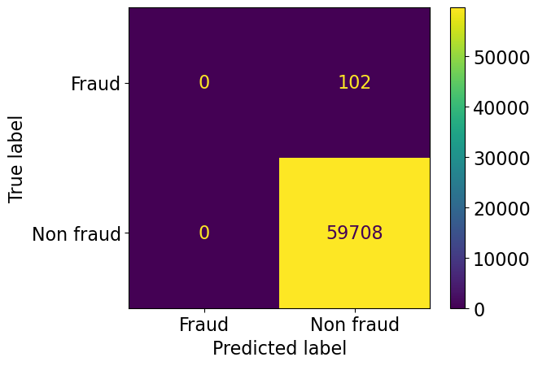
    


We can generalize the confusion matrix for a binary classification problem in a table like this:


How do we know which class is the "positive" one?

When we're interested in spotting a class (spot fraud transaction, spot spam, spot disease, etc),
the thing that we are interested in spotting is considered "positive". 
Above we wanted to spot fraudulent transactions and so they are "positive".
If we're not interested in one class more than the other,
and just want to build a model that can distinguish between two classes,
then we can big either as the positive one for the confusion matrix.

Using this more general notation,
we could communicate additional insight into the errors of our model
by saying that we had 8 false positives (type I error) in our confusion matrix above,
and 38 false negatives.
Since these numbers are only meaningful in the context of the total number of predictions,
we could instead reporting them as proportions so that they are easier to interpret.

If you want access to the values without plotting them, you can use the `confusion_matrix` function.

## ❓❓ Questions for you

```{admonition} Question
:class: tip

**With your newfound knowledge about confusion matrices,
which of the following two statement do you agree with?**

- In medical diagnosis, false positives are more damaging than false negatives (assuming "positive" means the person has a disease, "negative" means they don't).
- In spam classification, false positives are more damaging than false negatives (assuming "positive" means the email is spam, "negative" means they it's not).


<details><summary>View answer</summary>

For the first one, it is probably more dire if we miss a person that should have gotten a treatment (FN). People we predict has a disease will likely go through some follow up with a doctor befor ereceiveing treatment so there is less of a chance of potentially hurting them from the treatment.

For the second one, it is probably more damaging if we accidentally label a non-spam email as spam (FP), since the receipient could miss important info. They can always manually move a FN to the spam folder.

</details>
```


```python
from sklearn.metrics import confusion_matrix

confusion_matrix(y_valid, pipe.predict(X_valid))
```


    array([[   63,    39],
           [    8, 59700]])


### Confusion matrix with cross-validation 

- Above we used a confusion matrix on a single validation data set. This is just for educational purposes, since we will actually use multiple validation sets via CV to assess our model performance and tune hyperparameters.
- You can also calculate a confusion matrix with cross-validation, by using the `cross_val_predict` method.
- This adds up all the values of the TP, TN, FP, FN from the different CV folds, so that each part of the data is evaluated once (since we do crossvalidation with non-overlapping folds).


```python
from sklearn.model_selection import cross_val_predict

confusion_matrix(y_train, cross_val_predict(pipe, X_train, y_train))
```


    array([[   143,     94],
           [    20, 139297]])


- To plot it, we need to use the `from_predictions` method instead of the `from_estimator` method as we did above.


```python
ConfusionMatrixDisplay.from_predictions(
    y_train,  # true class labels
    cross_val_predict(pipe, X_train, y_train),  # predicted class labels
    # Normalizing would be additionally helpful here since the overall number of predictions no longer corresponds
    # to the number of rows in the data set (due to cross-validation) and is thus harder to interpret
    normalize='all'  
)
```


    <sklearn.metrics._plot.confusion_matrix.ConfusionMatrixDisplay at 0x14dd18b60>


    
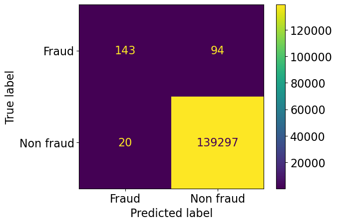
    


## Precision and recall

While it is informative to inspect the confusion matrix to understand what our model is getting right and wrong,
it can also useful to be able to report a single number of our model performance,
e.g. for hyperparameter tuning or to compare many different models.

How can we distill the information from the confusion matrix into a single number?
There are many metrics for this and they all focus on slightly different things.
In this image,
we can see eight metrics that are commonly calculated based on the TP, FP, TN, and FP from a confusion matrix.
Note that the metrics are symmetric in the rows and columns
(e.g. the False Positive Rate is the same as (1 - True Negative Rate),
so there are really only four calculations to make:


You don't have to memorize all the names of these metrics,
but make sure you understand the general principal of how they are calculated.
Two metrics that are particularly common to use in machine learning context
(and important to memorize)
are **precision** (also called PPV) and **recall** (also called TPR).

As we mentioned earlier,
we're often more interested in the positive class
and both these metrics are defined with that in mind as they both include the True Positives in the nominator.
These metrics will help us assess our model,
and summarize important aspects of the confusion matrix.

### Precision 

*Among the positive predictions, what proportion was actually positive?*

Precision is the ability of the classifier to putting a positive label on a positive observation. You can remember this as “How **p**recise are the model’s **p**redictions?”.

$$ precision = \frac{TP}{TP+FP} = \frac{Correctly\ positive\ predictions}{All\ positive\ predictions} $$

### Recall 

*Out of all actual positives, what proportion did the model identify?*

Recall is the ability of the classifier to find all the positive samples. You can remember it as "What proportion of the **r**eal positives the did the model **r**ecall.

$$ recall = \frac{TP}{TP+FN} = \frac{Correctly\ positive\ predictions}{All\ actual\ positives} $$

### Toy example

- Imagine that your model has identified everything outside the circle as non-fraud and everything inside the circle as fraud. 

<!--   -->


### Real example

Let's compute precision and recall on our data. Recall what the confusion matrix looks like:


```python
ConfusionMatrixDisplay.from_estimator(
    pipe,
    X_valid,
    y_valid,
    values_format="d",
);
```


    

    


We access the numbers via the `confusion_matrix` function we saw earlier.


```python
TP, FN, FP, TN = confusion_matrix(y_valid, pipe.predict(X_valid)).flatten()
print(TP, FN, FP, TN)
```

    63 39 8 59700


```python
precision = TP / (TP + FP)
precision
```


    0.8873239436619719


```python
recall = TP / (TP + FN)
recall
```


    0.6176470588235294


We don't have to compute these by hand as there are built-in function in sklearn for them.
We can see that our manual calculation is the same as the sklearn functions.


```python
from sklearn.metrics import precision_score, recall_score

precision_score(y_valid, pipe.predict(X_valid), pos_label='Fraud')  # We need to tell sklearn which label to treat as the postive one.
```


    0.8873239436619719


```python
from sklearn.metrics import precision_score, recall_score

precision_score(y_valid, dummy.predict(X_valid), pos_label='Fraud')  # We need to tell sklearn which label to treat as the postive one.
```

    /opt/miniconda3/envs/573/lib/python3.12/site-packages/sklearn/metrics/_classification.py:1531: UndefinedMetricWarning: Precision is ill-defined and being set to 0.0 due to no predicted samples. Use `zero_division` parameter to control this behavior.
      _warn_prf(average, modifier, f"{metric.capitalize()} is", len(result))


    0.0


```python
recall_score(y_valid, pipe.predict(X_valid), pos_label='Fraud')
```


    0.6176470588235294


```python
recall_score(y_valid, pipe.predict(X_valid), pos_label='Fraud')
```


    0.6176470588235294


### Drawbacks of precision and recall

While precision and recall are informative metrics to report.
They often lead to subpar results when optimized on in isolation.
To understand this, we can think of the extremes of the metrics.

Since `recall = TP / (TP + FN)` it will minimize FN to achieve a score closer to 1.
An undesired way of minimizing FN would be to predict all samples to be positive.
This would likely lead to high FP and low TN, but that is not part of the definition of recall.

Similarly, since `precision = TP / (TP + FP)` it will minimize FP to achieve a score closer to 1.
An undesired way of minimizing FP would be to minimize the number of positive predictions made.
For example, if we just make a single positive prediction and it is correct, we have maxed out precision,
regardless of how many actual positives we have missed (so likely leading to high FN).

To avoid these pitfalls,
we want to use a metric that looks at both the precision and recall.
One such metric that is commonly used is the F1-score.

### F1-score and $F_\beta$-score

F1-score combines precision and recall to give one score, which could be used in hyperparameter optimization.
It is the **harmonic mean of precision and recall**:

$$ F_1 = 2 \cdot \frac{ precision \cdot recall}{precision + recall}$$

The general score function is callsed $F_\beta$ score and the formula is 
$$ F_\beta = (1 + \beta^2) \cdot \frac{ precision \cdot recall}{(\beta^2 \cdot precision) + recall}$$


```python
# Using our definitions of `precision` and `recall` from above
f1_score = (2 * precision * recall) / (precision + recall)
f1_score
```


    0.7283236994219653


```python
from sklearn.metrics import f1_score

f1_score(y_valid, pipe.predict(X_valid), pos_label='Fraud')  # Recall and precision equally important
```


    0.7283236994219653


In the F1 score,
both the precision and recall are regarded as equally important.

However, in real life applications we might care more about one than the other but still want to hav a single number.
For this we often use the general [Fbeta sore](https://scikit-learn.org/stable/modules/generated/sklearn.metrics.fbeta_score.html), where beta ($\beta$) is the weight of recall vs precision.
- For example, $\beta = 2$ means that recall is weighted twice as much as precision when computing the score;
which we would refer to as the F2 score.
- Finding a suitable number for beta is context dependent and would require domain expertise in the specific field that the model would be deployed in.


```python
from sklearn.metrics import fbeta_score

fbeta_score(y_valid, pipe.predict(X_valid), pos_label='Fraud', beta=1)  # Same as F1
```


    0.7283236994219653


```python
fbeta_score(y_valid, pipe.predict(X_valid), pos_label='Fraud', beta=2)  # Recall twice as important
```


    0.6576200417536534


Although F1 (and $F_\beta$ more generally) are useful metrics that are commonly used to tune our models,
it is important to understand that they are not the perfectly suitable for all scenarios.
For example,imagine if we cared about the number of True Negatives in our problem,
this is not taken into account at all in the F1 metric.

There are other metrics that try to summarize the entire confusion matrix
and all its basic rates (TPR, TNR, FPR, FNR).
One of the most commonly used is **Matthews Correlation Coefficient (MCC)**,
which is [available in sklearn](https://scikit-learn.org/stable/modules/generated/sklearn.metrics.matthews_corrcoef.html)
and can be good to be aware of for problems where the TN are important:

$$ MCC = \frac{TP \cdot TN - FP \cdot FN}{\sqrt{(TP + FP) \cdot (TP + FN) \cdot (TN + FP) \cdot (TN + FN)}}$$

### Classification report 

There is a convenient function called `classification_report` in `sklearn` which prints out the three metrics we have discussed all at once.


```python
from sklearn.metrics import classification_report

print(
    classification_report(
        y_valid, pipe.predict(X_valid)
    )
)
```

                  precision    recall  f1-score   support
    
           Fraud       0.89      0.62      0.73       102
       Non fraud       1.00      1.00      1.00     59708
    
        accuracy                           1.00     59810
       macro avg       0.94      0.81      0.86     59810
    weighted avg       1.00      1.00      1.00     59810
    


### (Optional) Macro average and weighted average

**Macro average**
- Gives equal importance to all classes and average over all classes.  
- For instance, in the example above, recall for non-fraud is 1.0 and fraud is 0.63, and so macro average is 0.81. 
- More relevant in case of multi-class problems.    

**Weighted average**

- Weighted by the number of samples in each class. 
- Divide by the total number of samples. 

Which one is relevant when depends upon whether you think each class should have the same weight or each sample should have the same weight. 

**Toy example**


```python
from sklearn.metrics import classification_report
y_true_toy = [0, 1, 0, 1, 0]
y_pred_toy = [0, 0, 0, 1, 0]
target_names_toy = ['class 0', 'class 1']
print(classification_report(y_true_toy, y_pred_toy, target_names=target_names_toy))
```

                  precision    recall  f1-score   support
    
         class 0       0.75      1.00      0.86         3
         class 1       1.00      0.50      0.67         2
    
        accuracy                           0.80         5
       macro avg       0.88      0.75      0.76         5
    weighted avg       0.85      0.80      0.78         5
    


- weighted average is weighted by the proportion of examples in a particular class. So for the toy example above:
- weighted_average precision: 3/5 * 0.75 + 2/5 * 1.00 = 0.85
- weighted_average recall: 3/5 * 1.00 + 2/5 * 0.5 = 0.80
- weighted_average f1-score: 3/5 * 0.86 + 2/5 * 0.67 = 0.78

- macro average gives equal weight to both classes. So for the toy example above:
- macro average precision: 0.5 * 0.75 + 0.5 * 1.00 =0. 875
- macro average recall: 0.5 * 1.00 + 0.5 * 0.5 =0. 75
- macro average f1-score: 0.5 * 0.75 + 0.5 * 1.00 =0.765

```{admonition} Interim summary
:class: tip

- Accuracy is often not sufficient when scoring/comparing models and it is especially misleading when there is class imbalance. 
- A confusion matrix provides a way to break down errors made by our model and understand how the model is wrong. 
- We looked at three metrics based on confusion matrix: 
    - precision, recall, f1-score. 
```

```{note}
- What you consider "positive" (fraud in our case) is important when calculating precision, recall, and f1-score. 
- If you flip what is considered positive or negative, we'll end up with different TP, FP, TN, FN, and hence different precision, recall, and f1-scores. 
```

<!-- ### Evalution metrics overview   -->
<!-- There is a lot of terminology here.  -->

<!--  -->
<!--  -->

### Cross validation with different metrics

- We can pass different evaluation metrics with `scoring` argument of `cross_validate`.


```python
from sklearn.metrics import make_scorer

scoring = {
    "accuracy": 'accuracy',
    # We need to use `make_scorer` in order to set parameters such as pos_label (the default expectation is pos_label=1)
    'f1': make_scorer(f1_score, pos_label='Fraud'),
    'f2': make_scorer(fbeta_score, pos_label='Fraud', beta=2),
    'recall': make_scorer(recall_score, pos_label='Fraud'),
    'precision': make_scorer(precision_score, pos_label='Fraud'),
}  # scoring can be a string, a list, or a dictionary
pipe = make_pipeline(StandardScaler(), LogisticRegression())
scores = cross_validate(
    pipe, X_train_big, y_train_big, return_train_score=True, scoring=scoring
)
pd.DataFrame(scores)
```


<div>
<style scoped>
    .dataframe tbody tr th:only-of-type {
        vertical-align: middle;
    }

    .dataframe tbody tr th {
        vertical-align: top;
    }

    .dataframe thead th {
        text-align: right;
    }
</style>
<table border="1" class="dataframe">
  <thead>
    <tr style="text-align: right;">
      <th></th>
      <th>fit_time</th>
      <th>score_time</th>
      <th>test_accuracy</th>
      <th>train_accuracy</th>
      <th>test_f1</th>
      <th>train_f1</th>
      <th>test_f2</th>
      <th>train_f2</th>
      <th>test_recall</th>
      <th>train_recall</th>
      <th>test_precision</th>
      <th>train_precision</th>
    </tr>
  </thead>
  <tbody>
    <tr>
      <th>0</th>
      <td>0.227572</td>
      <td>0.646450</td>
      <td>0.999122</td>
      <td>0.999335</td>
      <td>0.700855</td>
      <td>0.772532</td>
      <td>0.638629</td>
      <td>0.703675</td>
      <td>0.602941</td>
      <td>0.664207</td>
      <td>0.836735</td>
      <td>0.923077</td>
    </tr>
    <tr>
      <th>1</th>
      <td>0.235183</td>
      <td>0.635062</td>
      <td>0.999223</td>
      <td>0.999317</td>
      <td>0.735043</td>
      <td>0.765591</td>
      <td>0.669782</td>
      <td>0.696401</td>
      <td>0.632353</td>
      <td>0.656827</td>
      <td>0.877551</td>
      <td>0.917526</td>
    </tr>
    <tr>
      <th>2</th>
      <td>0.239476</td>
      <td>0.657359</td>
      <td>0.999298</td>
      <td>0.999210</td>
      <td>0.754386</td>
      <td>0.724891</td>
      <td>0.676101</td>
      <td>0.653029</td>
      <td>0.632353</td>
      <td>0.612546</td>
      <td>0.934783</td>
      <td>0.887701</td>
    </tr>
    <tr>
      <th>3</th>
      <td>0.240652</td>
      <td>0.642117</td>
      <td>0.999172</td>
      <td>0.999254</td>
      <td>0.697248</td>
      <td>0.742981</td>
      <td>0.607029</td>
      <td>0.673981</td>
      <td>0.558824</td>
      <td>0.634686</td>
      <td>0.926829</td>
      <td>0.895833</td>
    </tr>
    <tr>
      <th>4</th>
      <td>0.225068</td>
      <td>0.632709</td>
      <td>0.999147</td>
      <td>0.999185</td>
      <td>0.696429</td>
      <td>0.716157</td>
      <td>0.623003</td>
      <td>0.643642</td>
      <td>0.582090</td>
      <td>0.602941</td>
      <td>0.866667</td>
      <td>0.881720</td>
    </tr>
  </tbody>
</table>
</div>


- You read more about creating [your own scoring function](https://scikit-learn.org/stable/modules/generated/sklearn.metrics.make_scorer.html).
- Grid search also has a similar `scoring` parameter.

<br><br>

### (Optional) Evaluation metrics for multi-class classification 

Let's examine precision, recall, and f1-score of different classes in the [HappyDB](https://www.kaggle.com/ritresearch/happydb) corpus.


```python
df = pd.read_csv("data/cleaned_hm.csv", index_col=0)
sample_df = df.dropna()
sample_df.head()
sample_df = sample_df.rename(
    columns={"cleaned_hm": "moment", "ground_truth_category": "target"}
)
sample_df.head()
```


<div>
<style scoped>
    .dataframe tbody tr th:only-of-type {
        vertical-align: middle;
    }

    .dataframe tbody tr th {
        vertical-align: top;
    }

    .dataframe thead th {
        text-align: right;
    }
</style>
<table border="1" class="dataframe">
  <thead>
    <tr style="text-align: right;">
      <th></th>
      <th>wid</th>
      <th>reflection_period</th>
      <th>original_hm</th>
      <th>moment</th>
      <th>modified</th>
      <th>num_sentence</th>
      <th>target</th>
      <th>predicted_category</th>
    </tr>
    <tr>
      <th>hmid</th>
      <th></th>
      <th></th>
      <th></th>
      <th></th>
      <th></th>
      <th></th>
      <th></th>
      <th></th>
    </tr>
  </thead>
  <tbody>
    <tr>
      <th>27676</th>
      <td>206</td>
      <td>24h</td>
      <td>We had a serious talk with some friends of ours who have been flaky lately. They understood and we had a good evening hanging out.</td>
      <td>We had a serious talk with some friends of ours who have been flaky lately. They understood and we had a good evening hanging out.</td>
      <td>True</td>
      <td>2</td>
      <td>bonding</td>
      <td>bonding</td>
    </tr>
    <tr>
      <th>27678</th>
      <td>45</td>
      <td>24h</td>
      <td>I meditated last night.</td>
      <td>I meditated last night.</td>
      <td>True</td>
      <td>1</td>
      <td>leisure</td>
      <td>leisure</td>
    </tr>
    <tr>
      <th>27697</th>
      <td>498</td>
      <td>24h</td>
      <td>My grandmother start to walk from the bed after a long time.</td>
      <td>My grandmother start to walk from the bed after a long time.</td>
      <td>True</td>
      <td>1</td>
      <td>affection</td>
      <td>affection</td>
    </tr>
    <tr>
      <th>27705</th>
      <td>5732</td>
      <td>24h</td>
      <td>I picked my daughter up from the airport and we have a fun and good conversation on the way home.</td>
      <td>I picked my daughter up from the airport and we have a fun and good conversation on the way home.</td>
      <td>True</td>
      <td>1</td>
      <td>bonding</td>
      <td>affection</td>
    </tr>
    <tr>
      <th>27715</th>
      <td>2272</td>
      <td>24h</td>
      <td>when i received flowers from my best friend</td>
      <td>when i received flowers from my best friend</td>
      <td>True</td>
      <td>1</td>
      <td>bonding</td>
      <td>bonding</td>
    </tr>
  </tbody>
</table>
</div>


```python
train_df, test_df = train_test_split(sample_df, test_size=0.3, random_state=123)
X_train_happy, y_train_happy = train_df["moment"], train_df["target"]
X_test_happy, y_test_happy = test_df["moment"], test_df["target"]
```


```python
from sklearn.feature_extraction.text import CountVectorizer

pipe_lr = make_pipeline(
    CountVectorizer(stop_words="english"), LogisticRegression(max_iter=2000)
)
```


```python
pipe_lr.fit(X_train_happy, y_train_happy)
pred = pipe_lr.predict(X_test_happy)
```


```python
ConfusionMatrixDisplay.from_estimator(
    pipe_lr, X_test_happy, y_test_happy, xticks_rotation="vertical"
);
```


    

    


The prediction and recall in a multi-class setting are defined as One-vs-the-rest (OvR),
where the class of interested is picked as the positive and evertyhing else is negative.


```python
print(classification_report(y_test_happy, pred))
```

                      precision    recall  f1-score   support
    
         achievement       0.79      0.87      0.83      1302
           affection       0.90      0.91      0.91      1423
             bonding       0.91      0.85      0.88       492
    enjoy_the_moment       0.60      0.55      0.57       469
            exercise       0.91      0.57      0.70        74
             leisure       0.73      0.70      0.72       407
              nature       0.73      0.46      0.57        71
    
            accuracy                           0.82      4238
           macro avg       0.80      0.70      0.74      4238
        weighted avg       0.82      0.82      0.82      4238
    


- Seems like there is a lot of variation in the scores for different classes. The model is performing pretty well on _affection_ class but not that well on _enjoy_the_moment_ and _nature_ classes.  
- If each class is equally important for you, pick macro avg as your evaluation metric.
- If each example is equally important, pick weighted avg as your metric. 

<br><br>

<br><br><br><br>

## Precision-recall curve

- Confusion matrix provides a detailed break down of the errors made by the model. 
- But when creating a confusion matrix, we are using "hard" predictions. 
- Most classifiers in `scikit-learn` provide `predict_proba` method (or `decision_function`) which provides degree of certainty about predictions by the classifier. 
- Can we explore the degree of uncertainty to understand and improve the model performance? 

Let's revisit the classification report on our fraud detection example. 


```python
pipe_lr = make_pipeline(StandardScaler(), LogisticRegression())
pipe_lr.fit(X_train, y_train);
```


```python
y_pred = pipe_lr.predict(X_valid)
print(classification_report(y_valid, y_pred))
```

                  precision    recall  f1-score   support
    
           Fraud       0.89      0.62      0.73       102
       Non fraud       1.00      1.00      1.00     59708
    
        accuracy                           1.00     59810
       macro avg       0.94      0.81      0.86     59810
    weighted avg       1.00      1.00      1.00     59810
    


By default, predictions use the threshold of 0.5. If `predict_proba` > 0.5, predict "fraud" else predict "non-fraud".
We can see this by manually typing in the 0.5 threshold and getting the same results as above.


```python
fraud_column = np.where(pipe_lr.classes_ == 'Fraud')[0][0]

y_pred = np.array(['Non fraud'] * X_valid.shape[0])  # Base array with all "Non fraud"
y_pred[pipe_lr.predict_proba(X_valid)[:, fraud_column] > 0.5] = 'Fraud'  # Overwrite with Fraud labels where over the threshold
print(classification_report(y_valid, y_pred))
```

                  precision    recall  f1-score   support
    
           Fraud       0.89      0.62      0.73       102
       Non fraud       1.00      1.00      1.00     59708
    
        accuracy                           1.00     59810
       macro avg       0.94      0.81      0.86     59810
    weighted avg       1.00      1.00      1.00     59810
    


- Suppose for your business it is more costly to miss fraudulent transactions and suppose you want to achieve a recall of at least 75% for the "fraud" class. 
- One way to do this is by changing the threshold of `predict_proba`.
    - `predict` returns 1 when `predict_proba`'s probabilities are above 0.5 for the "fraud" class.

```{admonition} Key idea
:class: tip 
**what if we threshold the probability at a smaller value so that we identify more examples as "fraud" examples?**
```

Let's lower the threshold to 0.1. In other words, predict the examples as "fraud" if `predict_proba` > 0.1.  


```python
y_pred_lower_threshold = np.array(['Non fraud'] * X_valid.shape[0])  # Base array with all "Non fraud"
y_pred_lower_threshold[pipe_lr.predict_proba(X_valid)[:, fraud_column] > 0.1] = 'Fraud'  # Overwrite with Fraud labels where over the threshold
```


```python
print(classification_report(y_valid, y_pred_lower_threshold))
```

                  precision    recall  f1-score   support
    
           Fraud       0.77      0.75      0.76       102
       Non fraud       1.00      1.00      1.00     59708
    
        accuracy                           1.00     59810
       macro avg       0.88      0.88      0.88     59810
    weighted avg       1.00      1.00      1.00     59810
    


### Operating point 

- Now our recall for "fraud" class is >= 0.75. 
- Setting a requirement on a classifier (e.g., recall of >= 0.75) is called setting the **operating point**. 
- It's usually driven by business goals and is useful to make performance guarantees to customers. 

### Precision/Recall tradeoff 

- But there is a trade-off between precision and recall. 
- If you identify more things as "fraud", recall is going to increase but there are likely to be more false positives. 

Let's sweep through different thresholds. 


```python
from collections import defaultdict

metrics = defaultdict(list)  # To be able to append to each entry in the dict by default

for threshold in np.arange(0.1, 1, 0.2):
    preds = np.array(['Non fraud'] * X_valid.shape[0])
    preds[pipe_lr.predict_proba(X_valid)[:, fraud_column] > threshold] = 'Fraud'
    metrics['threshold'].append(threshold)
    metrics['precision'].append(np.round(precision_score(y_valid, preds, pos_label='Fraud'), 4))
    metrics['recall'].append(np.round(recall_score(y_valid, preds, pos_label='Fraud'), 4))

pd.DataFrame(metrics)
```


<div>
<style scoped>
    .dataframe tbody tr th:only-of-type {
        vertical-align: middle;
    }

    .dataframe tbody tr th {
        vertical-align: top;
    }

    .dataframe thead th {
        text-align: right;
    }
</style>
<table border="1" class="dataframe">
  <thead>
    <tr style="text-align: right;">
      <th></th>
      <th>threshold</th>
      <th>precision</th>
      <th>recall</th>
    </tr>
  </thead>
  <tbody>
    <tr>
      <th>0</th>
      <td>0.1</td>
      <td>0.7700</td>
      <td>0.7549</td>
    </tr>
    <tr>
      <th>1</th>
      <td>0.3</td>
      <td>0.7955</td>
      <td>0.6863</td>
    </tr>
    <tr>
      <th>2</th>
      <td>0.5</td>
      <td>0.8873</td>
      <td>0.6176</td>
    </tr>
    <tr>
      <th>3</th>
      <td>0.7</td>
      <td>0.8939</td>
      <td>0.5784</td>
    </tr>
    <tr>
      <th>4</th>
      <td>0.9</td>
      <td>0.8909</td>
      <td>0.4804</td>
    </tr>
  </tbody>
</table>
</div>


### Decreasing the threshold

- Decreasing the threshold means a lower bar for predicting fraud. 
    - You are willing to risk more false positives in exchange of more true positives. 
    - Recall would either stay the same or go up and precision is likely to go down
    - Occasionally, precision may increase if all the new examples after decreasing the threshold are TPs. 

### Increasing the threshold

- Increasing the threshold means a higher bar for predicting fraud. 
    - Recall would go down or stay the same but precision is likely to go up 
    - Occasionally, precision may go down if TP decrease but FP do not decrease.

### Precision-recall curve

Often, when developing a model, it's not always clear what the operating point will be and to understand the the model better, it's informative to look at all possible thresholds and corresponding trade-offs of precision and recall in a plot.
This type of plot is often called a PR curve,
and the top-right would be a perfect classifier (precision = recall = 1).


```python
from sklearn.metrics import PrecisionRecallDisplay

PrecisionRecallDisplay.from_estimator(
    pipe_lr,
    X_valid,
    y_valid,
    pos_label='Fraud',
    name='LR',  # For Logistic Regression
);
```


    
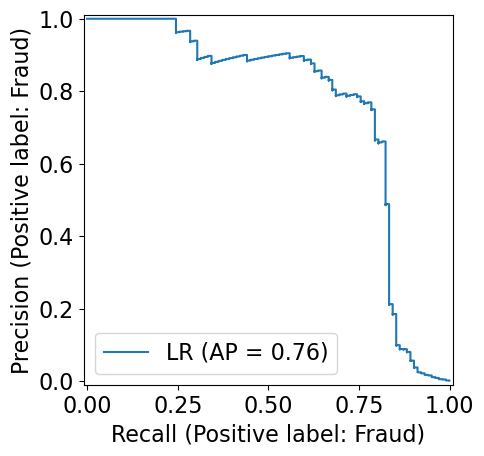
    


We can add the points for the thresholds we included in our `metrics` dataframe.
As we can see below, the middle red point (the 0.5 default threshold),
does seem to strike a good balance between precision and recall.
However, the far right point (the 0.1 threshold) is a good alternative,
particularly if recall would be more highly valued than precision.
(You don't need to remember the plotting code for adding the points, it is just for illustration).


```python
PrecisionRecallDisplay.from_estimator(
    pipe_lr,
    X_valid,
    y_valid,
    pos_label='Fraud',
    name='LR'
)
# Add a few threshold values as points
plt.scatter(
    x='recall',
    y='precision',
    data=pd.DataFrame(metrics),
    color='red',
);
```


    
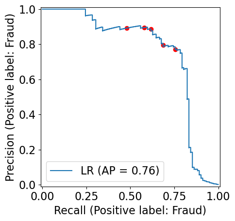
    


- The probability threshold is not shown here, but it's going from 0 (lower-right) to 1 (upper left).
- At a threshold of 0 (lower right), we are classifying everything  as "fraud", so there are no false negatives.
- Raising the threshold increases the precision but at the expense of lowering the recall. 
- At the extreme left, where the threshold is 1, we get into the situation where all the examples classified as "fraud" are actually "fraud" (although they might be very few); we have no false positives. 
- Usually the goal is to keep recall high as precision goes up. 

If you want access to the underlying values directly as a dataframe,
you can use the function `precision_recall_curve`.


```python
from sklearn.metrics import precision_recall_curve

pd.DataFrame(
    precision_recall_curve(
        y_valid,
        pipe_lr.predict_proba(X_valid)[:, fraud_column], 
        pos_label='Fraud',
    ),
    index=['precision', 'recall', 'threshold']
).T
```


<div>
<style scoped>
    .dataframe tbody tr th:only-of-type {
        vertical-align: middle;
    }

    .dataframe tbody tr th {
        vertical-align: top;
    }

    .dataframe thead th {
        text-align: right;
    }
</style>
<table border="1" class="dataframe">
  <thead>
    <tr style="text-align: right;">
      <th></th>
      <th>precision</th>
      <th>recall</th>
      <th>threshold</th>
    </tr>
  </thead>
  <tbody>
    <tr>
      <th>0</th>
      <td>0.001705</td>
      <td>1.000000</td>
      <td>5.175855e-09</td>
    </tr>
    <tr>
      <th>1</th>
      <td>0.001705</td>
      <td>1.000000</td>
      <td>1.041297e-08</td>
    </tr>
    <tr>
      <th>2</th>
      <td>0.001705</td>
      <td>1.000000</td>
      <td>4.313910e-08</td>
    </tr>
    <tr>
      <th>3</th>
      <td>0.001705</td>
      <td>1.000000</td>
      <td>7.319365e-08</td>
    </tr>
    <tr>
      <th>4</th>
      <td>0.001706</td>
      <td>1.000000</td>
      <td>8.480516e-08</td>
    </tr>
    <tr>
      <th>...</th>
      <td>...</td>
      <td>...</td>
      <td>...</td>
    </tr>
    <tr>
      <th>59045</th>
      <td>1.000000</td>
      <td>0.039216</td>
      <td>1.000000e+00</td>
    </tr>
    <tr>
      <th>59046</th>
      <td>1.000000</td>
      <td>0.029412</td>
      <td>1.000000e+00</td>
    </tr>
    <tr>
      <th>59047</th>
      <td>1.000000</td>
      <td>0.019608</td>
      <td>1.000000e+00</td>
    </tr>
    <tr>
      <th>59048</th>
      <td>1.000000</td>
      <td>0.009804</td>
      <td>1.000000e+00</td>
    </tr>
    <tr>
      <th>59049</th>
      <td>1.000000</td>
      <td>0.000000</td>
      <td>NaN</td>
    </tr>
  </tbody>
</table>
<p>59050 rows × 3 columns</p>
</div>


## Precision-Recall curve via cross-validation

In our actual pipelines,
we will not have a single validation set,
but instead use cross-validation.
Just as we did with the confusion matrix previously,
we can create a PR curve from the `cross_val_predict` function.


```python
PrecisionRecallDisplay.from_predictions(
    y_train,
    cross_val_predict(pipe_lr, X_train, y_train, method='predict_proba')[:, 0],  # See note below for explanation
    pos_label='Fraud'
)
```


    <sklearn.metrics._plot.precision_recall_curve.PrecisionRecallDisplay at 0x14fbd3f50>


    
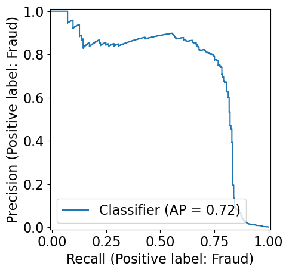
    


With the confusion matrix,
we were interested in the hard predictions,
which is the default from `cross_val_predict`.
With the PR curve,
we instead want to visualize the probabilities,
so we need to use the `method` parameter to specify that the predictions we get back
should be the soft probabilities and not the hard classes.

Also note the `[:, 0]` indexing above,
when we use predict_proba,
we get two columns back in our array,
reflecting the probabilities to be assigned to either class.
These two columns are orderd alphabetically by the name of the class.
Therefore, the probability of `'Fraud'` is in index `0`,
and the probability of `'Non-Fraud'` is in index `1`,
but you will have to change this depending on your class names.

### AP score 

- Often it's useful to have one number summarizing the PR plot (e.g., in hyperparameter optimization)
- One way to do this is by computing the area under the PR curve. 
- This is called **average precision** (AP score) and you can see that it is marked in the plots above.
- Average precision computes the weighted mean of precisions achieved at each threshold, with the increase in recall from the previous threshold used as the weight
- AP score has a value between 0 (worst) and 1 (best). 
- A random classifier has an AP score equal to the proportion of the positive class, so this is the baseline to compare against.
- The average_precision_score function supports multiclass and multilabel formats by computing each class score in a One-vs-the-rest (OvR) fashion and averaging

If we want to access the AP score number, we can use the `average_precision_score` function.


```python
from sklearn.metrics import average_precision_score

ap_lr = average_precision_score(y_valid, pipe_lr.predict_proba(X_valid)[:, fraud_column], pos_label='Fraud')
print("Average precision of logistic regression: {:.3f}".format(ap_lr))
```

    Average precision of logistic regression: 0.757


### AP vs. F1-score

It is very important to note this distinction:

- F1 score is for a given threshold and measures the quality of `predict`.
- AP score is a summary across thresholds and measures the quality of `predict_proba`.
- Thus, optimizing towards a high F1 score means that you find the model that performs the best at the default decision threshold while considering both recall and precision (and using Fbeta score, you can easily tune if recall or precision should be considered more important). You can still use a PR curve to change the decision threshold after model optimization, but the model has not been optimized to perform well over many thresholds, so there might not be many attractive tradeoffs.
- Optimizing towards a high AP score means that you get the model that performs the best over all possible decision thresholds, which could give you more flexibility in your tradeoffs between precision and recall when deciding on a decision threshold. However, there is no guarantee that this includes the model that performs the best overall (at least theoretically this might have been a model that performed well only for a few thresholds, although that is unlikely).

```{important}
Remember to pick the desired threshold based on the results on the validation set and **not** on the test set.
```

### A few comments on PR curve

- Different classifiers might work well in different parts of the curve, i.e., at different operating points.   
- We can compare PR curves of different classifiers to understand these differences. 
- Let's create PR curves for SVC and Logistic Regression. 


```python
pipe_svc = make_pipeline(StandardScaler(), SVC())
pipe_svc.fit(X_train, y_train)
```


<style>#sk-container-id-1 {
  /* Definition of color scheme common for light and dark mode */
  --sklearn-color-text: black;
  --sklearn-color-line: gray;
  /* Definition of color scheme for unfitted estimators */
  --sklearn-color-unfitted-level-0: #fff5e6;
  --sklearn-color-unfitted-level-1: #f6e4d2;
  --sklearn-color-unfitted-level-2: #ffe0b3;
  --sklearn-color-unfitted-level-3: chocolate;
  /* Definition of color scheme for fitted estimators */
  --sklearn-color-fitted-level-0: #f0f8ff;
  --sklearn-color-fitted-level-1: #d4ebff;
  --sklearn-color-fitted-level-2: #b3dbfd;
  --sklearn-color-fitted-level-3: cornflowerblue;

  /* Specific color for light theme */
  --sklearn-color-text-on-default-background: var(--sg-text-color, var(--theme-code-foreground, var(--jp-content-font-color1, black)));
  --sklearn-color-background: var(--sg-background-color, var(--theme-background, var(--jp-layout-color0, white)));
  --sklearn-color-border-box: var(--sg-text-color, var(--theme-code-foreground, var(--jp-content-font-color1, black)));
  --sklearn-color-icon: #696969;

  @media (prefers-color-scheme: dark) {
    /* Redefinition of color scheme for dark theme */
    --sklearn-color-text-on-default-background: var(--sg-text-color, var(--theme-code-foreground, var(--jp-content-font-color1, white)));
    --sklearn-color-background: var(--sg-background-color, var(--theme-background, var(--jp-layout-color0, #111)));
    --sklearn-color-border-box: var(--sg-text-color, var(--theme-code-foreground, var(--jp-content-font-color1, white)));
    --sklearn-color-icon: #878787;
  }
}

#sk-container-id-1 {
  color: var(--sklearn-color-text);
}

#sk-container-id-1 pre {
  padding: 0;
}

#sk-container-id-1 input.sk-hidden--visually {
  border: 0;
  clip: rect(1px 1px 1px 1px);
  clip: rect(1px, 1px, 1px, 1px);
  height: 1px;
  margin: -1px;
  overflow: hidden;
  padding: 0;
  position: absolute;
  width: 1px;
}

#sk-container-id-1 div.sk-dashed-wrapped {
  border: 1px dashed var(--sklearn-color-line);
  margin: 0 0.4em 0.5em 0.4em;
  box-sizing: border-box;
  padding-bottom: 0.4em;
  background-color: var(--sklearn-color-background);
}

#sk-container-id-1 div.sk-container {
  /* jupyter's `normalize.less` sets `[hidden] { display: none; }`
     but bootstrap.min.css set `[hidden] { display: none !important; }`
     so we also need the `!important` here to be able to override the
     default hidden behavior on the sphinx rendered scikit-learn.org.
     See: https://github.com/scikit-learn/scikit-learn/issues/21755 */
  display: inline-block !important;
  position: relative;
}

#sk-container-id-1 div.sk-text-repr-fallback {
  display: none;
}

div.sk-parallel-item,
div.sk-serial,
div.sk-item {
  /* draw centered vertical line to link estimators */
  background-image: linear-gradient(var(--sklearn-color-text-on-default-background), var(--sklearn-color-text-on-default-background));
  background-size: 2px 100%;
  background-repeat: no-repeat;
  background-position: center center;
}

/* Parallel-specific style estimator block */

#sk-container-id-1 div.sk-parallel-item::after {
  content: "";
  width: 100%;
  border-bottom: 2px solid var(--sklearn-color-text-on-default-background);
  flex-grow: 1;
}

#sk-container-id-1 div.sk-parallel {
  display: flex;
  align-items: stretch;
  justify-content: center;
  background-color: var(--sklearn-color-background);
  position: relative;
}

#sk-container-id-1 div.sk-parallel-item {
  display: flex;
  flex-direction: column;
}

#sk-container-id-1 div.sk-parallel-item:first-child::after {
  align-self: flex-end;
  width: 50%;
}

#sk-container-id-1 div.sk-parallel-item:last-child::after {
  align-self: flex-start;
  width: 50%;
}

#sk-container-id-1 div.sk-parallel-item:only-child::after {
  width: 0;
}

/* Serial-specific style estimator block */

#sk-container-id-1 div.sk-serial {
  display: flex;
  flex-direction: column;
  align-items: center;
  background-color: var(--sklearn-color-background);
  padding-right: 1em;
  padding-left: 1em;
}


/* Toggleable style: style used for estimator/Pipeline/ColumnTransformer box that is
clickable and can be expanded/collapsed.
- Pipeline and ColumnTransformer use this feature and define the default style
- Estimators will overwrite some part of the style using the `sk-estimator` class
*/

/* Pipeline and ColumnTransformer style (default) */

#sk-container-id-1 div.sk-toggleable {
  /* Default theme specific background. It is overwritten whether we have a
  specific estimator or a Pipeline/ColumnTransformer */
  background-color: var(--sklearn-color-background);
}

/* Toggleable label */
#sk-container-id-1 label.sk-toggleable__label {
  cursor: pointer;
  display: block;
  width: 100%;
  margin-bottom: 0;
  padding: 0.5em;
  box-sizing: border-box;
  text-align: center;
}

#sk-container-id-1 label.sk-toggleable__label-arrow:before {
  /* Arrow on the left of the label */
  content: "▸";
  float: left;
  margin-right: 0.25em;
  color: var(--sklearn-color-icon);
}

#sk-container-id-1 label.sk-toggleable__label-arrow:hover:before {
  color: var(--sklearn-color-text);
}

/* Toggleable content - dropdown */

#sk-container-id-1 div.sk-toggleable__content {
  max-height: 0;
  max-width: 0;
  overflow: hidden;
  text-align: left;
  /* unfitted */
  background-color: var(--sklearn-color-unfitted-level-0);
}

#sk-container-id-1 div.sk-toggleable__content.fitted {
  /* fitted */
  background-color: var(--sklearn-color-fitted-level-0);
}

#sk-container-id-1 div.sk-toggleable__content pre {
  margin: 0.2em;
  border-radius: 0.25em;
  color: var(--sklearn-color-text);
  /* unfitted */
  background-color: var(--sklearn-color-unfitted-level-0);
}

#sk-container-id-1 div.sk-toggleable__content.fitted pre {
  /* unfitted */
  background-color: var(--sklearn-color-fitted-level-0);
}

#sk-container-id-1 input.sk-toggleable__control:checked~div.sk-toggleable__content {
  /* Expand drop-down */
  max-height: 200px;
  max-width: 100%;
  overflow: auto;
}

#sk-container-id-1 input.sk-toggleable__control:checked~label.sk-toggleable__label-arrow:before {
  content: "▾";
}

/* Pipeline/ColumnTransformer-specific style */

#sk-container-id-1 div.sk-label input.sk-toggleable__control:checked~label.sk-toggleable__label {
  color: var(--sklearn-color-text);
  background-color: var(--sklearn-color-unfitted-level-2);
}

#sk-container-id-1 div.sk-label.fitted input.sk-toggleable__control:checked~label.sk-toggleable__label {
  background-color: var(--sklearn-color-fitted-level-2);
}

/* Estimator-specific style */

/* Colorize estimator box */
#sk-container-id-1 div.sk-estimator input.sk-toggleable__control:checked~label.sk-toggleable__label {
  /* unfitted */
  background-color: var(--sklearn-color-unfitted-level-2);
}

#sk-container-id-1 div.sk-estimator.fitted input.sk-toggleable__control:checked~label.sk-toggleable__label {
  /* fitted */
  background-color: var(--sklearn-color-fitted-level-2);
}

#sk-container-id-1 div.sk-label label.sk-toggleable__label,
#sk-container-id-1 div.sk-label label {
  /* The background is the default theme color */
  color: var(--sklearn-color-text-on-default-background);
}

/* On hover, darken the color of the background */
#sk-container-id-1 div.sk-label:hover label.sk-toggleable__label {
  color: var(--sklearn-color-text);
  background-color: var(--sklearn-color-unfitted-level-2);
}

/* Label box, darken color on hover, fitted */
#sk-container-id-1 div.sk-label.fitted:hover label.sk-toggleable__label.fitted {
  color: var(--sklearn-color-text);
  background-color: var(--sklearn-color-fitted-level-2);
}

/* Estimator label */

#sk-container-id-1 div.sk-label label {
  font-family: monospace;
  font-weight: bold;
  display: inline-block;
  line-height: 1.2em;
}

#sk-container-id-1 div.sk-label-container {
  text-align: center;
}

/* Estimator-specific */
#sk-container-id-1 div.sk-estimator {
  font-family: monospace;
  border: 1px dotted var(--sklearn-color-border-box);
  border-radius: 0.25em;
  box-sizing: border-box;
  margin-bottom: 0.5em;
  /* unfitted */
  background-color: var(--sklearn-color-unfitted-level-0);
}

#sk-container-id-1 div.sk-estimator.fitted {
  /* fitted */
  background-color: var(--sklearn-color-fitted-level-0);
}

/* on hover */
#sk-container-id-1 div.sk-estimator:hover {
  /* unfitted */
  background-color: var(--sklearn-color-unfitted-level-2);
}

#sk-container-id-1 div.sk-estimator.fitted:hover {
  /* fitted */
  background-color: var(--sklearn-color-fitted-level-2);
}

/* Specification for estimator info (e.g. "i" and "?") */

/* Common style for "i" and "?" */

.sk-estimator-doc-link,
a:link.sk-estimator-doc-link,
a:visited.sk-estimator-doc-link {
  float: right;
  font-size: smaller;
  line-height: 1em;
  font-family: monospace;
  background-color: var(--sklearn-color-background);
  border-radius: 1em;
  height: 1em;
  width: 1em;
  text-decoration: none !important;
  margin-left: 1ex;
  /* unfitted */
  border: var(--sklearn-color-unfitted-level-1) 1pt solid;
  color: var(--sklearn-color-unfitted-level-1);
}

.sk-estimator-doc-link.fitted,
a:link.sk-estimator-doc-link.fitted,
a:visited.sk-estimator-doc-link.fitted {
  /* fitted */
  border: var(--sklearn-color-fitted-level-1) 1pt solid;
  color: var(--sklearn-color-fitted-level-1);
}

/* On hover */
div.sk-estimator:hover .sk-estimator-doc-link:hover,
.sk-estimator-doc-link:hover,
div.sk-label-container:hover .sk-estimator-doc-link:hover,
.sk-estimator-doc-link:hover {
  /* unfitted */
  background-color: var(--sklearn-color-unfitted-level-3);
  color: var(--sklearn-color-background);
  text-decoration: none;
}

div.sk-estimator.fitted:hover .sk-estimator-doc-link.fitted:hover,
.sk-estimator-doc-link.fitted:hover,
div.sk-label-container:hover .sk-estimator-doc-link.fitted:hover,
.sk-estimator-doc-link.fitted:hover {
  /* fitted */
  background-color: var(--sklearn-color-fitted-level-3);
  color: var(--sklearn-color-background);
  text-decoration: none;
}

/* Span, style for the box shown on hovering the info icon */
.sk-estimator-doc-link span {
  display: none;
  z-index: 9999;
  position: relative;
  font-weight: normal;
  right: .2ex;
  padding: .5ex;
  margin: .5ex;
  width: min-content;
  min-width: 20ex;
  max-width: 50ex;
  color: var(--sklearn-color-text);
  box-shadow: 2pt 2pt 4pt #999;
  /* unfitted */
  background: var(--sklearn-color-unfitted-level-0);
  border: .5pt solid var(--sklearn-color-unfitted-level-3);
}

.sk-estimator-doc-link.fitted span {
  /* fitted */
  background: var(--sklearn-color-fitted-level-0);
  border: var(--sklearn-color-fitted-level-3);
}

.sk-estimator-doc-link:hover span {
  display: block;
}

/* "?"-specific style due to the `<a>` HTML tag */

#sk-container-id-1 a.estimator_doc_link {
  float: right;
  font-size: 1rem;
  line-height: 1em;
  font-family: monospace;
  background-color: var(--sklearn-color-background);
  border-radius: 1rem;
  height: 1rem;
  width: 1rem;
  text-decoration: none;
  /* unfitted */
  color: var(--sklearn-color-unfitted-level-1);
  border: var(--sklearn-color-unfitted-level-1) 1pt solid;
}

#sk-container-id-1 a.estimator_doc_link.fitted {
  /* fitted */
  border: var(--sklearn-color-fitted-level-1) 1pt solid;
  color: var(--sklearn-color-fitted-level-1);
}

/* On hover */
#sk-container-id-1 a.estimator_doc_link:hover {
  /* unfitted */
  background-color: var(--sklearn-color-unfitted-level-3);
  color: var(--sklearn-color-background);
  text-decoration: none;
}

#sk-container-id-1 a.estimator_doc_link.fitted:hover {
  /* fitted */
  background-color: var(--sklearn-color-fitted-level-3);
}
</style><div id="sk-container-id-1" class="sk-top-container"><div class="sk-text-repr-fallback"><pre>Pipeline(steps=[(&#x27;standardscaler&#x27;, StandardScaler()), (&#x27;svc&#x27;, SVC())])</pre><b>In a Jupyter environment, please rerun this cell to show the HTML representation or trust the notebook. <br />On GitHub, the HTML representation is unable to render, please try loading this page with nbviewer.org.</b></div><div class="sk-container" hidden><div class="sk-item sk-dashed-wrapped"><div class="sk-label-container"><div class="sk-label fitted sk-toggleable"><input class="sk-toggleable__control sk-hidden--visually" id="sk-estimator-id-1" type="checkbox" ><label for="sk-estimator-id-1" class="sk-toggleable__label fitted sk-toggleable__label-arrow fitted">&nbsp;&nbsp;Pipeline<a class="sk-estimator-doc-link fitted" rel="noreferrer" target="_blank" href="https://scikit-learn.org/1.5/modules/generated/sklearn.pipeline.Pipeline.html">?<span>Documentation for Pipeline</span></a><span class="sk-estimator-doc-link fitted">i<span>Fitted</span></span></label><div class="sk-toggleable__content fitted"><pre>Pipeline(steps=[(&#x27;standardscaler&#x27;, StandardScaler()), (&#x27;svc&#x27;, SVC())])</pre></div> </div></div><div class="sk-serial"><div class="sk-item"><div class="sk-estimator fitted sk-toggleable"><input class="sk-toggleable__control sk-hidden--visually" id="sk-estimator-id-2" type="checkbox" ><label for="sk-estimator-id-2" class="sk-toggleable__label fitted sk-toggleable__label-arrow fitted">&nbsp;StandardScaler<a class="sk-estimator-doc-link fitted" rel="noreferrer" target="_blank" href="https://scikit-learn.org/1.5/modules/generated/sklearn.preprocessing.StandardScaler.html">?<span>Documentation for StandardScaler</span></a></label><div class="sk-toggleable__content fitted"><pre>StandardScaler()</pre></div> </div></div><div class="sk-item"><div class="sk-estimator fitted sk-toggleable"><input class="sk-toggleable__control sk-hidden--visually" id="sk-estimator-id-3" type="checkbox" ><label for="sk-estimator-id-3" class="sk-toggleable__label fitted sk-toggleable__label-arrow fitted">&nbsp;SVC<a class="sk-estimator-doc-link fitted" rel="noreferrer" target="_blank" href="https://scikit-learn.org/1.5/modules/generated/sklearn.svm.SVC.html">?<span>Documentation for SVC</span></a></label><div class="sk-toggleable__content fitted"><pre>SVC()</pre></div> </div></div></div></div></div></div>


```python
pipe_lr = make_pipeline(StandardScaler(), LogisticRegression(max_iter=1000))
pipe_lr.fit(X_train, y_train)
```


<style>#sk-container-id-2 {
  /* Definition of color scheme common for light and dark mode */
  --sklearn-color-text: black;
  --sklearn-color-line: gray;
  /* Definition of color scheme for unfitted estimators */
  --sklearn-color-unfitted-level-0: #fff5e6;
  --sklearn-color-unfitted-level-1: #f6e4d2;
  --sklearn-color-unfitted-level-2: #ffe0b3;
  --sklearn-color-unfitted-level-3: chocolate;
  /* Definition of color scheme for fitted estimators */
  --sklearn-color-fitted-level-0: #f0f8ff;
  --sklearn-color-fitted-level-1: #d4ebff;
  --sklearn-color-fitted-level-2: #b3dbfd;
  --sklearn-color-fitted-level-3: cornflowerblue;

  /* Specific color for light theme */
  --sklearn-color-text-on-default-background: var(--sg-text-color, var(--theme-code-foreground, var(--jp-content-font-color1, black)));
  --sklearn-color-background: var(--sg-background-color, var(--theme-background, var(--jp-layout-color0, white)));
  --sklearn-color-border-box: var(--sg-text-color, var(--theme-code-foreground, var(--jp-content-font-color1, black)));
  --sklearn-color-icon: #696969;

  @media (prefers-color-scheme: dark) {
    /* Redefinition of color scheme for dark theme */
    --sklearn-color-text-on-default-background: var(--sg-text-color, var(--theme-code-foreground, var(--jp-content-font-color1, white)));
    --sklearn-color-background: var(--sg-background-color, var(--theme-background, var(--jp-layout-color0, #111)));
    --sklearn-color-border-box: var(--sg-text-color, var(--theme-code-foreground, var(--jp-content-font-color1, white)));
    --sklearn-color-icon: #878787;
  }
}

#sk-container-id-2 {
  color: var(--sklearn-color-text);
}

#sk-container-id-2 pre {
  padding: 0;
}

#sk-container-id-2 input.sk-hidden--visually {
  border: 0;
  clip: rect(1px 1px 1px 1px);
  clip: rect(1px, 1px, 1px, 1px);
  height: 1px;
  margin: -1px;
  overflow: hidden;
  padding: 0;
  position: absolute;
  width: 1px;
}

#sk-container-id-2 div.sk-dashed-wrapped {
  border: 1px dashed var(--sklearn-color-line);
  margin: 0 0.4em 0.5em 0.4em;
  box-sizing: border-box;
  padding-bottom: 0.4em;
  background-color: var(--sklearn-color-background);
}

#sk-container-id-2 div.sk-container {
  /* jupyter's `normalize.less` sets `[hidden] { display: none; }`
     but bootstrap.min.css set `[hidden] { display: none !important; }`
     so we also need the `!important` here to be able to override the
     default hidden behavior on the sphinx rendered scikit-learn.org.
     See: https://github.com/scikit-learn/scikit-learn/issues/21755 */
  display: inline-block !important;
  position: relative;
}

#sk-container-id-2 div.sk-text-repr-fallback {
  display: none;
}

div.sk-parallel-item,
div.sk-serial,
div.sk-item {
  /* draw centered vertical line to link estimators */
  background-image: linear-gradient(var(--sklearn-color-text-on-default-background), var(--sklearn-color-text-on-default-background));
  background-size: 2px 100%;
  background-repeat: no-repeat;
  background-position: center center;
}

/* Parallel-specific style estimator block */

#sk-container-id-2 div.sk-parallel-item::after {
  content: "";
  width: 100%;
  border-bottom: 2px solid var(--sklearn-color-text-on-default-background);
  flex-grow: 1;
}

#sk-container-id-2 div.sk-parallel {
  display: flex;
  align-items: stretch;
  justify-content: center;
  background-color: var(--sklearn-color-background);
  position: relative;
}

#sk-container-id-2 div.sk-parallel-item {
  display: flex;
  flex-direction: column;
}

#sk-container-id-2 div.sk-parallel-item:first-child::after {
  align-self: flex-end;
  width: 50%;
}

#sk-container-id-2 div.sk-parallel-item:last-child::after {
  align-self: flex-start;
  width: 50%;
}

#sk-container-id-2 div.sk-parallel-item:only-child::after {
  width: 0;
}

/* Serial-specific style estimator block */

#sk-container-id-2 div.sk-serial {
  display: flex;
  flex-direction: column;
  align-items: center;
  background-color: var(--sklearn-color-background);
  padding-right: 1em;
  padding-left: 1em;
}


/* Toggleable style: style used for estimator/Pipeline/ColumnTransformer box that is
clickable and can be expanded/collapsed.
- Pipeline and ColumnTransformer use this feature and define the default style
- Estimators will overwrite some part of the style using the `sk-estimator` class
*/

/* Pipeline and ColumnTransformer style (default) */

#sk-container-id-2 div.sk-toggleable {
  /* Default theme specific background. It is overwritten whether we have a
  specific estimator or a Pipeline/ColumnTransformer */
  background-color: var(--sklearn-color-background);
}

/* Toggleable label */
#sk-container-id-2 label.sk-toggleable__label {
  cursor: pointer;
  display: block;
  width: 100%;
  margin-bottom: 0;
  padding: 0.5em;
  box-sizing: border-box;
  text-align: center;
}

#sk-container-id-2 label.sk-toggleable__label-arrow:before {
  /* Arrow on the left of the label */
  content: "▸";
  float: left;
  margin-right: 0.25em;
  color: var(--sklearn-color-icon);
}

#sk-container-id-2 label.sk-toggleable__label-arrow:hover:before {
  color: var(--sklearn-color-text);
}

/* Toggleable content - dropdown */

#sk-container-id-2 div.sk-toggleable__content {
  max-height: 0;
  max-width: 0;
  overflow: hidden;
  text-align: left;
  /* unfitted */
  background-color: var(--sklearn-color-unfitted-level-0);
}

#sk-container-id-2 div.sk-toggleable__content.fitted {
  /* fitted */
  background-color: var(--sklearn-color-fitted-level-0);
}

#sk-container-id-2 div.sk-toggleable__content pre {
  margin: 0.2em;
  border-radius: 0.25em;
  color: var(--sklearn-color-text);
  /* unfitted */
  background-color: var(--sklearn-color-unfitted-level-0);
}

#sk-container-id-2 div.sk-toggleable__content.fitted pre {
  /* unfitted */
  background-color: var(--sklearn-color-fitted-level-0);
}

#sk-container-id-2 input.sk-toggleable__control:checked~div.sk-toggleable__content {
  /* Expand drop-down */
  max-height: 200px;
  max-width: 100%;
  overflow: auto;
}

#sk-container-id-2 input.sk-toggleable__control:checked~label.sk-toggleable__label-arrow:before {
  content: "▾";
}

/* Pipeline/ColumnTransformer-specific style */

#sk-container-id-2 div.sk-label input.sk-toggleable__control:checked~label.sk-toggleable__label {
  color: var(--sklearn-color-text);
  background-color: var(--sklearn-color-unfitted-level-2);
}

#sk-container-id-2 div.sk-label.fitted input.sk-toggleable__control:checked~label.sk-toggleable__label {
  background-color: var(--sklearn-color-fitted-level-2);
}

/* Estimator-specific style */

/* Colorize estimator box */
#sk-container-id-2 div.sk-estimator input.sk-toggleable__control:checked~label.sk-toggleable__label {
  /* unfitted */
  background-color: var(--sklearn-color-unfitted-level-2);
}

#sk-container-id-2 div.sk-estimator.fitted input.sk-toggleable__control:checked~label.sk-toggleable__label {
  /* fitted */
  background-color: var(--sklearn-color-fitted-level-2);
}

#sk-container-id-2 div.sk-label label.sk-toggleable__label,
#sk-container-id-2 div.sk-label label {
  /* The background is the default theme color */
  color: var(--sklearn-color-text-on-default-background);
}

/* On hover, darken the color of the background */
#sk-container-id-2 div.sk-label:hover label.sk-toggleable__label {
  color: var(--sklearn-color-text);
  background-color: var(--sklearn-color-unfitted-level-2);
}

/* Label box, darken color on hover, fitted */
#sk-container-id-2 div.sk-label.fitted:hover label.sk-toggleable__label.fitted {
  color: var(--sklearn-color-text);
  background-color: var(--sklearn-color-fitted-level-2);
}

/* Estimator label */

#sk-container-id-2 div.sk-label label {
  font-family: monospace;
  font-weight: bold;
  display: inline-block;
  line-height: 1.2em;
}

#sk-container-id-2 div.sk-label-container {
  text-align: center;
}

/* Estimator-specific */
#sk-container-id-2 div.sk-estimator {
  font-family: monospace;
  border: 1px dotted var(--sklearn-color-border-box);
  border-radius: 0.25em;
  box-sizing: border-box;
  margin-bottom: 0.5em;
  /* unfitted */
  background-color: var(--sklearn-color-unfitted-level-0);
}

#sk-container-id-2 div.sk-estimator.fitted {
  /* fitted */
  background-color: var(--sklearn-color-fitted-level-0);
}

/* on hover */
#sk-container-id-2 div.sk-estimator:hover {
  /* unfitted */
  background-color: var(--sklearn-color-unfitted-level-2);
}

#sk-container-id-2 div.sk-estimator.fitted:hover {
  /* fitted */
  background-color: var(--sklearn-color-fitted-level-2);
}

/* Specification for estimator info (e.g. "i" and "?") */

/* Common style for "i" and "?" */

.sk-estimator-doc-link,
a:link.sk-estimator-doc-link,
a:visited.sk-estimator-doc-link {
  float: right;
  font-size: smaller;
  line-height: 1em;
  font-family: monospace;
  background-color: var(--sklearn-color-background);
  border-radius: 1em;
  height: 1em;
  width: 1em;
  text-decoration: none !important;
  margin-left: 1ex;
  /* unfitted */
  border: var(--sklearn-color-unfitted-level-1) 1pt solid;
  color: var(--sklearn-color-unfitted-level-1);
}

.sk-estimator-doc-link.fitted,
a:link.sk-estimator-doc-link.fitted,
a:visited.sk-estimator-doc-link.fitted {
  /* fitted */
  border: var(--sklearn-color-fitted-level-1) 1pt solid;
  color: var(--sklearn-color-fitted-level-1);
}

/* On hover */
div.sk-estimator:hover .sk-estimator-doc-link:hover,
.sk-estimator-doc-link:hover,
div.sk-label-container:hover .sk-estimator-doc-link:hover,
.sk-estimator-doc-link:hover {
  /* unfitted */
  background-color: var(--sklearn-color-unfitted-level-3);
  color: var(--sklearn-color-background);
  text-decoration: none;
}

div.sk-estimator.fitted:hover .sk-estimator-doc-link.fitted:hover,
.sk-estimator-doc-link.fitted:hover,
div.sk-label-container:hover .sk-estimator-doc-link.fitted:hover,
.sk-estimator-doc-link.fitted:hover {
  /* fitted */
  background-color: var(--sklearn-color-fitted-level-3);
  color: var(--sklearn-color-background);
  text-decoration: none;
}

/* Span, style for the box shown on hovering the info icon */
.sk-estimator-doc-link span {
  display: none;
  z-index: 9999;
  position: relative;
  font-weight: normal;
  right: .2ex;
  padding: .5ex;
  margin: .5ex;
  width: min-content;
  min-width: 20ex;
  max-width: 50ex;
  color: var(--sklearn-color-text);
  box-shadow: 2pt 2pt 4pt #999;
  /* unfitted */
  background: var(--sklearn-color-unfitted-level-0);
  border: .5pt solid var(--sklearn-color-unfitted-level-3);
}

.sk-estimator-doc-link.fitted span {
  /* fitted */
  background: var(--sklearn-color-fitted-level-0);
  border: var(--sklearn-color-fitted-level-3);
}

.sk-estimator-doc-link:hover span {
  display: block;
}

/* "?"-specific style due to the `<a>` HTML tag */

#sk-container-id-2 a.estimator_doc_link {
  float: right;
  font-size: 1rem;
  line-height: 1em;
  font-family: monospace;
  background-color: var(--sklearn-color-background);
  border-radius: 1rem;
  height: 1rem;
  width: 1rem;
  text-decoration: none;
  /* unfitted */
  color: var(--sklearn-color-unfitted-level-1);
  border: var(--sklearn-color-unfitted-level-1) 1pt solid;
}

#sk-container-id-2 a.estimator_doc_link.fitted {
  /* fitted */
  border: var(--sklearn-color-fitted-level-1) 1pt solid;
  color: var(--sklearn-color-fitted-level-1);
}

/* On hover */
#sk-container-id-2 a.estimator_doc_link:hover {
  /* unfitted */
  background-color: var(--sklearn-color-unfitted-level-3);
  color: var(--sklearn-color-background);
  text-decoration: none;
}

#sk-container-id-2 a.estimator_doc_link.fitted:hover {
  /* fitted */
  background-color: var(--sklearn-color-fitted-level-3);
}
</style><div id="sk-container-id-2" class="sk-top-container"><div class="sk-text-repr-fallback"><pre>Pipeline(steps=[(&#x27;standardscaler&#x27;, StandardScaler()),
                (&#x27;logisticregression&#x27;, LogisticRegression(max_iter=1000))])</pre><b>In a Jupyter environment, please rerun this cell to show the HTML representation or trust the notebook. <br />On GitHub, the HTML representation is unable to render, please try loading this page with nbviewer.org.</b></div><div class="sk-container" hidden><div class="sk-item sk-dashed-wrapped"><div class="sk-label-container"><div class="sk-label fitted sk-toggleable"><input class="sk-toggleable__control sk-hidden--visually" id="sk-estimator-id-4" type="checkbox" ><label for="sk-estimator-id-4" class="sk-toggleable__label fitted sk-toggleable__label-arrow fitted">&nbsp;&nbsp;Pipeline<a class="sk-estimator-doc-link fitted" rel="noreferrer" target="_blank" href="https://scikit-learn.org/1.5/modules/generated/sklearn.pipeline.Pipeline.html">?<span>Documentation for Pipeline</span></a><span class="sk-estimator-doc-link fitted">i<span>Fitted</span></span></label><div class="sk-toggleable__content fitted"><pre>Pipeline(steps=[(&#x27;standardscaler&#x27;, StandardScaler()),
                (&#x27;logisticregression&#x27;, LogisticRegression(max_iter=1000))])</pre></div> </div></div><div class="sk-serial"><div class="sk-item"><div class="sk-estimator fitted sk-toggleable"><input class="sk-toggleable__control sk-hidden--visually" id="sk-estimator-id-5" type="checkbox" ><label for="sk-estimator-id-5" class="sk-toggleable__label fitted sk-toggleable__label-arrow fitted">&nbsp;StandardScaler<a class="sk-estimator-doc-link fitted" rel="noreferrer" target="_blank" href="https://scikit-learn.org/1.5/modules/generated/sklearn.preprocessing.StandardScaler.html">?<span>Documentation for StandardScaler</span></a></label><div class="sk-toggleable__content fitted"><pre>StandardScaler()</pre></div> </div></div><div class="sk-item"><div class="sk-estimator fitted sk-toggleable"><input class="sk-toggleable__control sk-hidden--visually" id="sk-estimator-id-6" type="checkbox" ><label for="sk-estimator-id-6" class="sk-toggleable__label fitted sk-toggleable__label-arrow fitted">&nbsp;LogisticRegression<a class="sk-estimator-doc-link fitted" rel="noreferrer" target="_blank" href="https://scikit-learn.org/1.5/modules/generated/sklearn.linear_model.LogisticRegression.html">?<span>Documentation for LogisticRegression</span></a></label><div class="sk-toggleable__content fitted"><pre>LogisticRegression(max_iter=1000)</pre></div> </div></div></div></div></div></div>


How to compare the precision and recall curve for different models? 


```python
# Set up an empty figure
_, ax = plt.subplots()

# Instruct both curves to plot into the existing figure with the `ax` keyword
PrecisionRecallDisplay.from_estimator(
    pipe_lr,
    X_valid,
    y_valid,
    pos_label='Fraud',
    name='LR',
    ax=ax
);
PrecisionRecallDisplay.from_estimator(
    pipe_svc,
    X_valid,
    y_valid,
    pos_label='Fraud',
    name='SVC',
    ax=ax
);
```


    
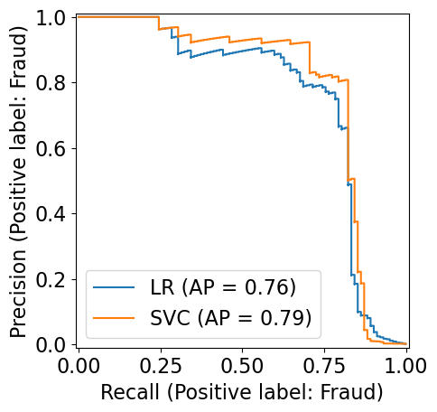
    


We can see that the SVC classifer performs slighlty better for most thresholds,
which means that its AP score is slightly higher,
as we can see in the chart.

If we compare to the f1 score (which only looks at a single threshold),
we can see that the LR actually has a slightly higher score,
so the two metrics don't always agree.

- Comparing the precision-recall curves provide us a detail insight compared to f1 score.
- For example, F1 scores for SVC and logistic regressions are pretty similar. In fact, f1 score of logistic regression is a tiny bit better. 
- But when we look at the PR curve, we see that SVC is doing better than logistic regression for most of the other thresholds. 


```python
svc_preds = pipe_svc.predict(X_valid)
lr_preds = pipe_lr.predict(X_valid)
print("f1_score of logistic regression: {:.3f}".format(f1_score(y_valid, lr_preds, pos_label='Fraud')))
print("f1_score of svc: {:.3f}".format(f1_score(y_valid, svc_preds, pos_label='Fraud')))
```

    f1_score of logistic regression: 0.728
    f1_score of svc: 0.726


### (Optional) Some more details

- How are the thresholds and the precision and recall at the default threshold are calculated? 

How many thresholds? 
- It uses `n_thresholds` where `n_thresholds` is the number of unique `predict_proba` scores in our dataset. 


```python
len(np.unique(pipe_lr.predict_proba(X_valid)[:, fraud_column]))
```


    59049


- For each threshold, precision and recall are calculated.  
- The last precision and recall values are 1. and 0. respectively and do not have a corresponding threshold. 


```python
precision_lr, recall_lr, thresholds_lr = precision_recall_curve(
    y_valid, pipe_lr.predict_proba(X_valid)[:, fraud_column], pos_label='Fraud'
)
precision_svc, recall_svc, thresholds_svc = precision_recall_curve(
    y_valid, pipe_svc.decision_function(X_valid), pos_label='Fraud'
)
```

SVC doesn't have `predict_proba`. Instead it has something called `decision_function`. The index of the threshold that is closest to 0 of decision function is the default threshold in SVC. 

For logistic regression, what's the index of the threshold that is closest to the default threshold of 0.5? 
- We are subtracting 0.5 from the thresholds so that 
    - the numbers close to 0 become -0.5
    - the numbers close to 1 become 0.5    
    - the numbers close to 0.5 become 0
- After this transformation, we are interested in the threshold index where the number is close to 0. So we take  absolute values and argmin.       


```python
close_default_lr = np.argmin(np.abs(thresholds_lr - 0.5))
```


```python
close_zero_svm = np.argmin(np.abs(thresholds_svc))
```


```python
ap_lr = average_precision_score(y_valid, pipe_lr.predict_proba(X_valid)[:, fraud_column], pos_label='Fraud')
ap_svc = average_precision_score(y_valid, pipe_svc.decision_function(X_valid), pos_label='Fraud')
```


```python
print("Average precision of logistic regression: {:.3f}".format(ap_lr))
print("Average precision of SVC: {:.3f}".format(ap_svc))
```

    Average precision of logistic regression: 0.757
    Average precision of SVC: 0.001


<br><br><br><br>

## Receiver Operating Characteristic (ROC) curve 

- Another commonly used tool to analyze the behavior of classifiers at different thresholds.  
- Similar to PR curve, it considers all possible thresholds for a given classifier given by `predict_proba` but instead of precision and recall it plots false positive rate (FPR) and true positive rate (TPR or recall).
$$ TPR = \frac{TP}{TP + FN}$$

$$ FPR  = \frac{FP}{FP + TN}$$

- TPR $\rightarrow$ Fraction of true positives out of all positive examples. 
- FPR $\rightarrow$ Fraction of false positives out of all negative examples. 


```python
from sklearn.metrics import RocCurveDisplay

RocCurveDisplay.from_estimator(
    pipe_lr,
    X_valid,
    y_valid,
    pos_label='Fraud'
);
```


    
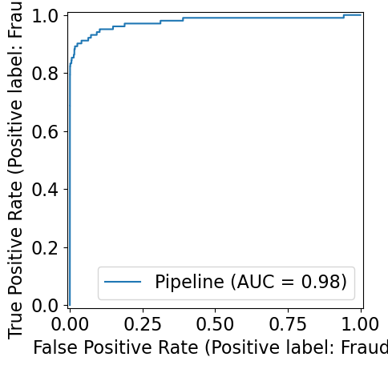
    


We can add in a point for the default threshold of 0.5, and see that it is not optimal.
We can increase or TPR, while keeping the FPR the same
and also increate the FPR marginally over zero while still gaining some TPR.
A good value depends on what is most important bettween TPR and FPR,
but without any knowledge of that, we would try to get as close to the top left corner as possible,
so a TPR around 0.9 and FPR around 0.05.


```python
RocCurveDisplay.from_estimator(
    pipe_lr,
    X_valid,
    y_valid,
    pos_label='Fraud',
    name='LR'
);

from sklearn.metrics import roc_curve

fpr, tpr, thresholds = roc_curve(y_valid, pipe_lr.predict_proba(X_valid)[:, fraud_column], pos_label='Fraud')
default_threshold = np.argmin(np.abs(thresholds - 0.5))

plt.plot(
    fpr[default_threshold],
    tpr[default_threshold],
    "or",
    markersize=10,
    label="threshold 0.5",
)
```


    [<matplotlib.lines.Line2D at 0x31cfa6c30>]


    
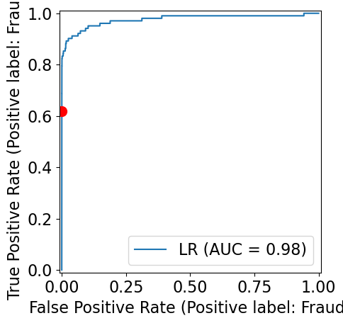
    


- The ideal curve is close to the top left
    - Ideally, you want a classifier with high recall while keeping low false positive rate.  
- The red dot corresponds to the threshold of 0.5, which is used by predict by default.
- We see that compared to the default threshold, we can achieve a better recall of around 0.8 without increasing FPR. 
- We could also compare different models on the ROC curve, just as we did for the PR curve above.

Just as for the confusion matrix and PR curve,
we normally create the ROC curve from the predictions during cross-validation.


```python
RocCurveDisplay.from_predictions(
    y_train,
    cross_val_predict(pipe_lr, X_train, y_train, method='predict_proba')[:, 0],
    pos_label='Fraud'
)
```


    <sklearn.metrics._plot.roc_curve.RocCurveDisplay at 0x31cf4c440>


    
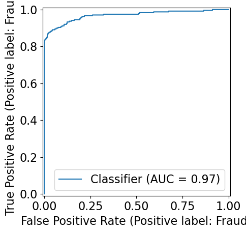
    


> (Optional) Note that concatenating the cross-validation results and then creating a single ROC curve
can in some instances lead to an overly conservative performance evaluation.
This is due to that the individual models have not had their probabilities calibrated with each other
so the ranking that the ROC performs might be thrown off when the probabilities are brought togeher in a single ranking.
Instead, it can be beneficial to create [one curve per CV fold and an average as in this example](https://scikit-learn.org/stable/auto_examples/model_selection/plot_roc_crossval.html),
which also allows us to report on the spread.

### Area under the curve (AUC)

- AUC provides a single number summarizing the ROC curve.


```python
from sklearn.metrics import roc_auc_score

roc_lr = roc_auc_score(y_valid, pipe_lr.predict_proba(X_valid)[:, 1])
roc_svc = roc_auc_score(y_valid, pipe_svc.decision_function(X_valid))
print("AUC for LR: {:.3f}".format(roc_lr))
print("AUC for SVC: {:.3f}".format(roc_svc))
```

    AUC for LR: 0.976
    AUC for SVC: 0.938


- AUC of 0.5 means random chance, which is the baseline to compare against. 
- AUC can be interpreted as evaluating the **ranking** of positive examples.
- What's the probability that a randomly picked positive point has a higher score according to the classifier than a randomly picked point from the negative class. 
- AUC of 1.0 means all positive points have a higher score than all negative points. 

```{important}
For classification problems with imbalanced classes, using AP score or AUC is often much more meaningful than using accuracy. 
```

```{seealso}
Check out [these visualization](https://github.com/dariyasydykova/open_projects/tree/master/ROC_animation) on ROC and AUC in more detail.
```

```{seealso}
Check out how to plot ROC with cross-validation [here](https://scikit-learn.org/stable/auto_examples/model_selection/plot_roc_crossval.html).
```

## Reporting performance from the test data set

After selecting the best hyperparameters and decision threshold,
for our model during cross-validation,
it is time to assess how well our model fairs on unseen data.
Although we used a specific metric when we tuned our model,
it is helpful to report multiple metrics when communicating the test data performance.
It is useful to focus on metrics that are important for the problem at hand,
but also has a meaningingful interpretation, such as precision and recall. 
This process could looks something like this:


```python
pd.DataFrame({
    'F1': [f1_score(y_test, pipe_lr.predict(X_test), pos_label='Fraud')],
    'Precision': [precision_score(y_test, pipe_lr.predict(X_test), pos_label='Fraud')],
    'Recall': [recall_score(y_test, pipe_lr.predict(X_test), pos_label='Fraud')],
})
```


<div>
<style scoped>
    .dataframe tbody tr th:only-of-type {
        vertical-align: middle;
    }

    .dataframe tbody tr th {
        vertical-align: top;
    }

    .dataframe thead th {
        text-align: right;
    }
</style>
<table border="1" class="dataframe">
  <thead>
    <tr style="text-align: right;">
      <th></th>
      <th>F1</th>
      <th>Precision</th>
      <th>Recall</th>
    </tr>
  </thead>
  <tbody>
    <tr>
      <th>0</th>
      <td>0.705882</td>
      <td>0.806723</td>
      <td>0.627451</td>
    </tr>
  </tbody>
</table>
</div>


It's often effective to communicate with a confusion matrix as well,
especially to less technical audiences,
but even in more technical context,
it's helpful to see the actual numbers (or proportions)
of TP, FP, TN, FN.


```python
ConfusionMatrixDisplay.from_estimator(
    pipe_lr,
    X_test,
    y_test
)
```


    <sklearn.metrics._plot.confusion_matrix.ConfusionMatrixDisplay at 0x31cf6cbc0>


    

    


And finally,
seeing a PR or ROC curve
helps to understand the classifiers performance over multiple thresholds.


```python
PrecisionRecallDisplay.from_estimator(
    pipe_lr,
    X_test,
    y_test,
    pos_label='Fraud',
);
```


    
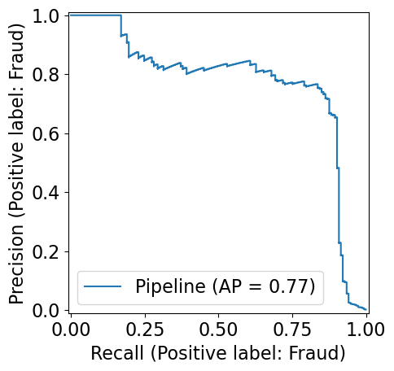
    


```{warning}
Note that we are not allowed to make any modifications to our model,
based on the scores or visualizations of the test data!
That would break the golden rule
and lead to an overly optimistic model
since we are using info from the the test data to improve the model.
Any information in the test data must be completely ignored 
for it to be an valid approximation of the model's generalization performance on unseen data.
```

<br><br><br><br>

## Dealing with class imbalance [[video](https://www.youtube.com/watch?v=jHaKRCFb6Qw)]

### Class imbalance in training sets

- This typically refers to having many more examples of one class than another in one's training set.
- Real world data is often imbalanced. 
    - Our Credit Card Fraud dataset is imbalanced.
    - Ad clicking data is usually drastically imbalanced. (Only around ~0.01% ads are clicked.)
    - Spam classification datasets are also usually imbalanced.

### Addressing class imbalance
A very important question to ask yourself: "Why do I have a class imbalance?"

- Is it because one class is much more rare than the other?
    - If it's just because one is more rare than the other, you need to ask whether you care about one type of error more than the other.    
- Is it because of my data collection methods?
    - If it's the data collection, then that means _your test and training data come from different distributions_!
  
In some cases, it may be fine to just ignore the class imbalance.

### Which type of error is more important? 

- False positives (FPs) and false negatives (FNs) have quite different real-world consequences. 
- In PR curve and ROC curve, we saw how changing the prediction threshold can change FPs and FNs. 
- We can then pick the threshold that's appropriate for our problem. 
- Example: if we want high recall, we may use a lower threshold (e.g., a threshold of 0.1). We'll then catch more fraudulent transactions. Let's first see the report with the standard 0.5 threshold.


```python
pipe_lr = make_pipeline(StandardScaler(), LogisticRegression())
pipe_lr.fit(X_train, y_train)
y_pred = pipe_lr.predict(X_valid)
print(classification_report(y_valid, y_pred))
```

                  precision    recall  f1-score   support
    
           Fraud       0.89      0.62      0.73       102
       Non fraud       1.00      1.00      1.00     59708
    
        accuracy                           1.00     59810
       macro avg       0.94      0.81      0.86     59810
    weighted avg       1.00      1.00      1.00     59810
    


Then we change the threshold to 0.1, which increases the recall and decreases the precision.


```python
y_pred = np.array(['Non fraud'] * X_valid.shape[0])  # Base array with all "Non fraud"
y_pred[pipe_lr.predict_proba(X_valid)[:, fraud_column] > 0.1] = 'Fraud'  # Overwrite with Fraud labels where over the threshold
print(classification_report(y_valid, y_pred))
```

                  precision    recall  f1-score   support
    
           Fraud       0.77      0.75      0.76       102
       Non fraud       1.00      1.00      1.00     59708
    
        accuracy                           1.00     59810
       macro avg       0.88      0.88      0.88     59810
    weighted avg       1.00      1.00      1.00     59810
    


### Handling imbalance

Can we change the model itself rather than changing the threshold so that it takes into account the errors that are important to us?

There are two common approaches for this: 
- **Changing the data (optional)** (not covered in this course)
   - Undersampling
   - Oversampling 
       - Random oversampling
       - SMOTE 
- **Changing the training procedure** 
    - `class_weight`

### Changing the training procedure 

- All `sklearn` classifiers have a parameter called `class_weight`.
- This allows you to specify that one class is more important than another.
- For example, maybe a false negative is 10x more problematic than a false positive. 

### Example: `class_weight` parameter of `sklearn LogisticRegression` 
> class sklearn.linear_model.LogisticRegression(penalty='l2', dual=False, tol=0.0001, C=1.0, fit_intercept=True, intercept_scaling=1, **class_weight=None**, random_state=None, solver='lbfgs', max_iter=100, multi_class='auto', verbose=0, warm_start=False, n_jobs=None, l1_ratio=None)

> class_weight: dict or 'balanced', default=None

> Weights associated with classes in the form {class_label: weight}. If not given, all classes are supposed to have weight one. 


```python
ConfusionMatrixDisplay.from_estimator(
    pipe_lr, X_valid, y_valid, values_format="d"
);
```


    

    


```python
pipe_lr.named_steps["logisticregression"].classes_
```


    array(['Fraud', 'Non fraud'], dtype=object)


Let's set "fraud" class a weight of 10 to see how that leads to more of the Fraudulent examples being predicted correclty.


```python
pipe_lr_weight = make_pipeline(
    StandardScaler(), LogisticRegression(max_iter=500, class_weight={'Non fraud': 1, 'Fraud': 10})
)
pipe_lr_weight.fit(X_train, y_train)
ConfusionMatrixDisplay.from_estimator(
    pipe_lr_weight,
    X_valid,
    y_valid,
    values_format="d",
);
```


    
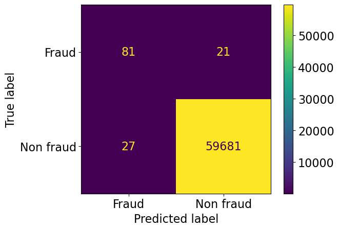
    


- Notice we've reduced false negatives and predicted more Fraud this time.
- This was equivalent to saying give 10x more "importance" to fraud class. 
- Note that as a consequence we are also increasing false positives.    

### `class_weight="balanced"`
- A useful setting is `class_weight="balanced"`.
- This sets the weights so that the classes are "equal".

> class_weight: dict, ‘balanced’ or None
If ‘balanced’, class weights will be given by n_samples / (n_classes * np.bincount(y)). If a dictionary is given, keys are classes and values are corresponding class weights. If None is given, the class weights will be uniform.

> sklearn.utils.class_weight.compute_class_weight(class_weight, classes, y)


```python
pipe_lr_balanced = make_pipeline(
    StandardScaler(), LogisticRegression(max_iter=500, class_weight="balanced")
)
pipe_lr_balanced.fit(X_train, y_train)
ConfusionMatrixDisplay.from_estimator(
    pipe_lr_balanced,
    X_valid,
    y_valid,
    values_format="d",
);
```


    
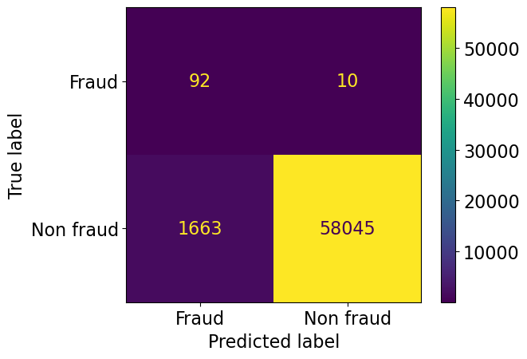
    


We have reduced false negatives but we have many more false positives now ...

### Are we doing better with `class_weight="balanced"`?


```python
from sklearn.metrics import roc_auc_score, average_precision_score

scoring = {
    "accuracy": 'accuracy',
    # We need to use `make_scorer` in order to set parameters such as pos_label (the default expectation is pos_label=1)
    'f1': make_scorer(f1_score, pos_label='Fraud'),
    'recall': make_scorer(recall_score, pos_label='Fraud'),
    'precision': make_scorer(precision_score, pos_label='Fraud'),
    # We need to set the response method to 'predict_proba' when not using a 0/1 binary or integer columns for our classes
    'average_precision': make_scorer(average_precision_score, pos_label='Fraud', response_method='predict_proba'),
    'roc_auc': make_scorer(roc_auc_score, response_method='predict_proba')
} 

pipe_lr = make_pipeline(StandardScaler(), LogisticRegression(max_iter=500))
scores = cross_validate(
    pipe_lr, X_train_big, y_train_big, scoring=scoring
)
pd.DataFrame(scores)
```


<div>
<style scoped>
    .dataframe tbody tr th:only-of-type {
        vertical-align: middle;
    }

    .dataframe tbody tr th {
        vertical-align: top;
    }

    .dataframe thead th {
        text-align: right;
    }
</style>
<table border="1" class="dataframe">
  <thead>
    <tr style="text-align: right;">
      <th></th>
      <th>fit_time</th>
      <th>score_time</th>
      <th>test_accuracy</th>
      <th>test_f1</th>
      <th>test_recall</th>
      <th>test_precision</th>
      <th>test_average_precision</th>
      <th>test_roc_auc</th>
    </tr>
  </thead>
  <tbody>
    <tr>
      <th>0</th>
      <td>0.255253</td>
      <td>0.559520</td>
      <td>0.999122</td>
      <td>0.700855</td>
      <td>0.602941</td>
      <td>0.836735</td>
      <td>0.738362</td>
      <td>0.015361</td>
    </tr>
    <tr>
      <th>1</th>
      <td>0.234963</td>
      <td>0.552853</td>
      <td>0.999223</td>
      <td>0.735043</td>
      <td>0.632353</td>
      <td>0.877551</td>
      <td>0.664055</td>
      <td>0.032287</td>
    </tr>
    <tr>
      <th>2</th>
      <td>0.233854</td>
      <td>0.564115</td>
      <td>0.999298</td>
      <td>0.754386</td>
      <td>0.632353</td>
      <td>0.934783</td>
      <td>0.789219</td>
      <td>0.033146</td>
    </tr>
    <tr>
      <th>3</th>
      <td>0.243386</td>
      <td>0.558791</td>
      <td>0.999172</td>
      <td>0.697248</td>
      <td>0.558824</td>
      <td>0.926829</td>
      <td>0.741774</td>
      <td>0.068564</td>
    </tr>
    <tr>
      <th>4</th>
      <td>0.229784</td>
      <td>0.555100</td>
      <td>0.999147</td>
      <td>0.696429</td>
      <td>0.582090</td>
      <td>0.866667</td>
      <td>0.782267</td>
      <td>0.011107</td>
    </tr>
  </tbody>
</table>
</div>


- Recall is much better but precision has dropped a lot; we have many false positives. 
- You could also optimize `class_weight` using hyperparameter optimization for your specific problem. 

- Changing the class weight will **generally reduce accuracy**.
- The original model was trying to maximize accuracy.
- Now you're telling it to do something different.
- But that can be fine, accuracy isn't the only metric that matters.

### Stratified Splits

- A similar idea of "balancing" classes can be applied to data splits.
- We have the same option in `train_test_split` with the `stratify` argument. 
- By default it splits the data so that if we have 10% negative examples in total, then each split will have 10% negative examples.

- If you are carrying out cross validation using `cross_validate`, by default it uses [`StratifiedKFold`](https://scikit-learn.org/stable/modules/generated/sklearn.model_selection.StratifiedKFold.html). From the documentation: 

> This cross-validation object is a variation of KFold that returns stratified folds. The folds are made by preserving the percentage of samples for each class.

- In other words, if we have 10% negative examples in total, then each fold will have 10% negative examples.

### Is stratifying a good idea? 

  - Well, it's no longer a random sample, which is probably theoretically bad, but not that big of a deal.
  - If you have many examples, it shouldn't matter as much.
  - It can be especially useful in multi-class, say if you have one class with very few cases.
  - In general, these are difficult questions.

<br><br><br><br>

## (Optional) Changing the data 

- Undersampling
- Oversampling 
   - Random oversampling
   - SMOTE 

We cannot use sklearn pipelines because of some API related problems. But there is something called [`imbalance learn`](https://imbalanced-learn.org/stable/), which is an extension of the `scikit-learn` API that allows us to resample. It's already in our course environment. If you don't have the course environment installed, you can install it in your environment with this command: 

`conda install -c conda-forge imbalanced-learn`

### Undersampling


```python
import imblearn
from imblearn.pipeline import make_pipeline as make_imb_pipeline
from imblearn.under_sampling import RandomUnderSampler

rus = RandomUnderSampler()
X_train_subsample, y_train_subsample = rus.fit_resample(X_train, y_train)
print(X_train.shape)
print(X_train_subsample.shape)
y_train_subsample.value_counts()
```

    (139554, 29)
    (474, 29)


    Class
    Fraud        237
    Non fraud    237
    Name: count, dtype: int64


```python
from collections import Counter

from imblearn.under_sampling import RandomUnderSampler
from sklearn.datasets import make_classification

X, y = make_classification(
    n_classes=2,
    class_sep=2,
    weights=[0.1, 0.9],
    n_informative=3,
    n_redundant=1,
    flip_y=0,
    n_features=20,
    n_clusters_per_class=1,
    n_samples=1000,
    random_state=10,
)
print("Original dataset shape %s" % Counter(y))
rus = RandomUnderSampler(random_state=42)
X_res, y_res = rus.fit_resample(X, y)
print("Resampled dataset shape %s" % Counter(y_res))
```

    Original dataset shape Counter({1: 900, 0: 100})
    Resampled dataset shape Counter({0: 100, 1: 100})


```python
undersample_pipe = make_imb_pipeline(
    RandomUnderSampler(), StandardScaler(), LogisticRegression()
)

scoring = {
    'average_precision': make_scorer(average_precision_score, pos_label='Fraud', response_method='predict_proba'),
    'roc_auc': make_scorer(roc_auc_score, response_method='predict_proba')
}
scores = cross_validate(
    undersample_pipe, X_train, y_train, scoring=scoring
)
pd.DataFrame(scores).mean()
```


    fit_time                  0.137661
    score_time                0.045798
    test_average_precision    0.482441
    test_roc_auc              0.028933
    dtype: float64


<br><br>

### Oversampling 

- Random oversampling with replacement 
- SMOTE: Synthetic Minority Over-sampling Technique


```python
from imblearn.over_sampling import RandomOverSampler

ros = RandomOverSampler()
X_train_oversample, y_train_oversample = ros.fit_resample(X_train, y_train)
print(X_train.shape)
print(X_train_oversample.shape)
y_train_oversample.value_counts()
```

    (139554, 29)
    (278634, 29)


    Class
    Non fraud    139317
    Fraud        139317
    Name: count, dtype: int64


```python
oversample_pipe = make_imb_pipeline(
    RandomOverSampler(), StandardScaler(), LogisticRegression(max_iter=1000)
)
scores = cross_validate(
    oversample_pipe, X_train, y_train, scoring=scoring
)
pd.DataFrame(scores).mean()
```


    fit_time                  0.972984
    score_time                0.046790
    test_average_precision    0.712874
    test_roc_auc              0.038268
    dtype: float64


<br><br>

#### [SMOTE: Synthetic Minority Over-sampling Technique](https://arxiv.org/pdf/1106.1813.pdf)

[sklearn SMOTE](https://imbalanced-learn.readthedocs.io/en/stable/generated/imblearn.over_sampling.SMOTE.html)

- Create "synthetic" examples rather than by over-sampling with replacement.
- Inspired by a technique of data augmentation that proved successful in handwritten character recognition. 
- The minority class is over-sampled by taking each minority class sample and introducing synthetic examples along the line segments joining any/all of the $k$ minority class nearest neighbors.
- $k$ is chosen depending upon the amount of over-sampling required.

#### SMOTE idea 

- Take the difference between the feature vector (sample) under consideration and its nearest neighbor. 
- Multiply this difference by a random number between 0 and 1, and add it to the feature vector under consideration. 
- This causes the selection of a random point along the line segment between two specific features. 
- This approach effectively forces the decision region of the minority class to become more general.


<!--  -->

### Using SMOTE

- You need to [`imbalanced-learn`](https://imbalanced-learn.org/stable/index.html)
> class imblearn.over_sampling.SMOTE(sampling_strategy='auto', random_state=None, k_neighbors=5, m_neighbors='deprecated', out_step='deprecated', kind='deprecated', svm_estimator='deprecated', n_jobs=1, ratio=None)

> Class to perform over-sampling using SMOTE.

> This object is an implementation of SMOTE - Synthetic Minority Over-sampling Technique as presented in [this paper](https://arxiv.org/pdf/1106.1813.pdf).


```python
from imblearn.over_sampling import SMOTE

smote_pipe = make_imb_pipeline(
    SMOTE(), StandardScaler(), LogisticRegression(max_iter=1000)
)
scoring = {
    'average_precision': make_scorer(average_precision_score, pos_label='Fraud', response_method='predict_proba'),
    'roc_auc': make_scorer(roc_auc_score, response_method='predict_proba')
}
scores = cross_validate(
    smote_pipe, X_train, y_train, cv=10, scoring=scoring
)
pd.DataFrame(scores).mean()
```


    fit_time                  1.203977
    score_time                0.026035
    test_average_precision    0.732590
    test_roc_auc              0.037043
    dtype: float64


- We got a slightly higher average precision score with SMOTE in this case. 

- The above are rather simple approaches to tackle class imbalance. 
- If you have a problem such as fraud detection problem where you want to spot rare events, you can also think of this problem as anomaly detection problem and use different kinds of algorithms such as [isolation forests](https://scikit-learn.org/stable/modules/generated/sklearn.ensemble.IsolationForest.html).  
- If you are interested in this area, it might be worth checking out this book on this topic. (I've not read it.) 
    - [Imbalanced Learning: Foundations, Algorithms, and Applications](https://www.amazon.com/dp/1118074629/ref=as_li_ss_tl?&linkCode=sl1&tag=inspiredalgor-20&linkId=615e87a9105582e292ad2b7e2c7ea339&language=en_US) (available via UBC's library).

<br><br><br><br>

## What did we learn today? 

- A number of possible ways to evaluate machine learning models 
    - Choose the evaluation metric that makes most sense in your context or which is most common in your discipline  
- Two kinds of binary classification problems 
    - Distinguishing between two classes (e.g., dogs vs. cats)
    - Spotting a class (e.g., spot fraud transaction, spot spam)

- Precision, recall, f1-score are useful when dealing with spotting problems. 
- The thing that we are interested in spotting is considered "positive".   
- Do you need to deal with class imbalance in the given problem? 
- Methods to deal with class imbalance 
    - Changing the training procedure 
        - `class_weight`
    - Changing the data
        - undersampling, oversampling, SMOTE
        

- Do not blindly make decisions solely based on ML model predictions. 
- Try to carefully analyze the errors made by the model on certain groups.  

### Relevant papers and resources 

- [The Relationship Between Precision-Recall and ROC Curves](https://web.archive.org/web/20201030042122/https://www.biostat.wisc.edu/~page/rocpr.pdf)
- [Article claiming that PR curve are better than ROC for imbalanced datasets](https://journals.plos.org/plosone/article?id=10.1371/journal.pone.0118432)
- [Precision-Recall-Gain Curves: PR Analysis Done Right](https://papers.nips.cc/paper/2015/file/33e8075e9970de0cfea955afd4644bb2-Paper.pdf)
- [ROC animation](https://github.com/dariyasydykova/open_projects/tree/master/ROC_animation)
- [Generalization in Adaptive Data Analysis and Holdout Reuse](https://arxiv.org/pdf/1506.02629.pdf)
