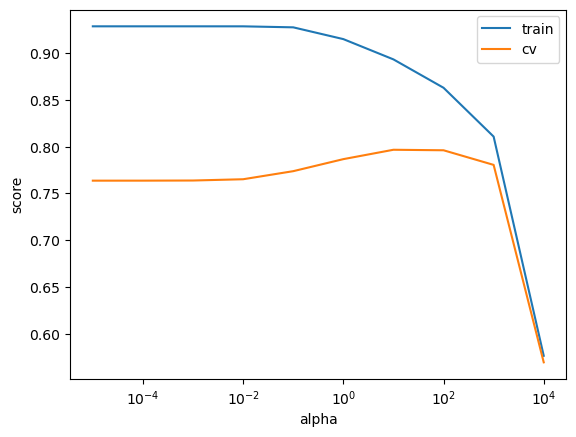
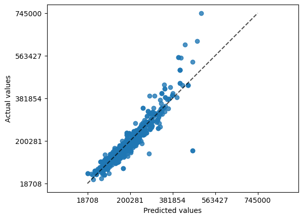
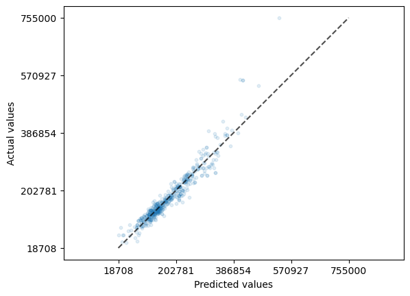
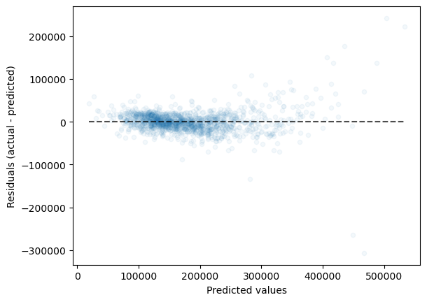
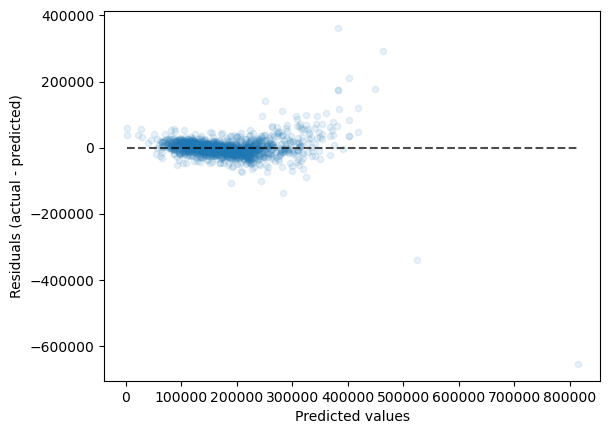
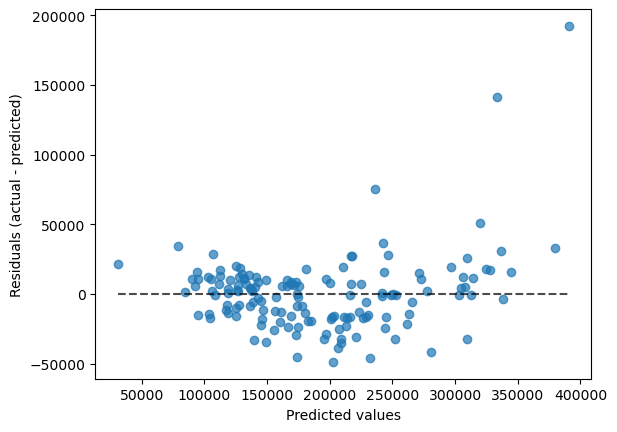
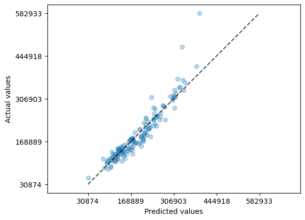
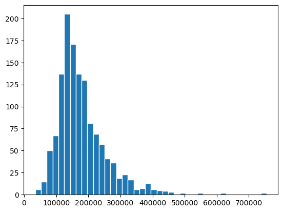
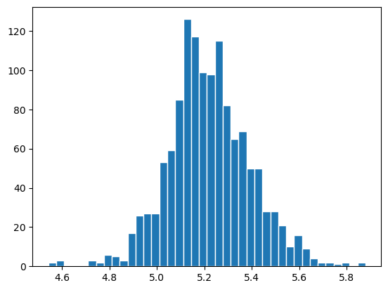

# Lecture 2: Regression metrics


## Pre-readings
Try your best to watch these before the class.
- **Bias and Variance:** [StatQuest video](https://www.youtube.com/watch?v=EuBBz3bI-aA)
- **R-squared:** [StatQuest video](https://www.youtube.com/watch?v=bMccdk8EdGo)

## Other optional readings:
- **Ridge Regression:** [StatQuest video](https://www.youtube.com/watch?v=Q81RR3yKn30)
    - Note it is more connected to the concept of regularization

## Learning outcomes 
From this lecture, students are expected to be able to:

- Carry out feature transformations on a somewhat complicated dataset. 
- Visualize transformed features as a dataframe. 
- Use `Ridge` and `RidgeCV`.
- Explain how `alpha` hyperparameter of `Ridge` relates to the fundamental tradeoff. 
- Explain the effect of `alpha` on the magnitude of the learned coefficients. 
- Examine coefficients of transformed features.  
- Appropriately select a scoring metric given a regression problem.
- Interpret and communicate the meanings of different scoring metrics on regression problems.
    - MSE, RMSE, $R^2$, MAE, MAPE
- Apply log-transform on the target values in a regression problem with `TransformedTargetRegressor`.

## Lecture slides

````{tab-set}
```{tab-item} Section 1 slides
<html>
  <body>
    <iframe src="lecture_2.pdf#navpanes=0&statusbar=0&messages=0&pagemode=none" width="100%" height="475px" style="position: relative;z-index: 9999999;">
    </iframe>
  </body>
</html>

```

```{tab-item} Section 2 slides
<html>
  <body>
    <iframe src="DSCI_573-Lec2.pdf#navpanes=0&statusbar=0&messages=0&pagemode=none" width="100%" height="475px" style="position: relative;z-index: 9999999;">
    </iframe>
  </body>
</html>

```
````


```python
import matplotlib.pyplot as plt
import numpy as np
import pandas as pd
from sklearn.compose import (
    ColumnTransformer,
    TransformedTargetRegressor,
    make_column_transformer,
)
from sklearn.dummy import DummyRegressor
from sklearn.ensemble import RandomForestRegressor
from sklearn.impute import SimpleImputer
from sklearn.linear_model import Ridge, RidgeCV
from sklearn.metrics import make_scorer, mean_squared_error, root_mean_squared_error, r2_score
from sklearn.model_selection import (
    GridSearchCV,
    cross_val_score,
    cross_validate,
    train_test_split,
)
from sklearn.pipeline import Pipeline, make_pipeline
from sklearn.preprocessing import OneHotEncoder, OrdinalEncoder, StandardScaler
from sklearn.tree import DecisionTreeRegressor

# Ignore future deprecation warnings from sklearn (using `os` instead of `warnings` also works in subprocesses)
import os
os.environ['PYTHONWARNINGS']='ignore::FutureWarning'
```

## ❓❓ Questions for you
```{admonition} Question
:class: tip

**Select all of the following statements which are TRUE.**

- (A) Average precision score at threshold 0.5 is the same as F1-score. 
- (B) Using `class_weight="balanced"` is likely to decrease false negatives but increase false positives.
- (C) In ROC curve, the threshold goes from lower left (1.0) to upper right (0.0).
- (D) It's possible that automated tools such as `pandas-profiling` classify a categorical feature as a numeric feature.  

<details><summary>Click to see answers</summary>B, C, D</details>
```

After carrying out preprocessing, why it's useful to get feature names for transformed features?   

## Dataset [[video](https://youtu.be/lgGTKLwNgkQ)]

In this lecture, we'll be using [Kaggle House Prices dataset](https://www.kaggle.com/c/home-data-for-ml-course/). As usual, to run this notebook you'll need to download the data. For this dataset, train and test have already been separated. We'll be working with the train portion in this lecture. 


```python
df = pd.read_csv("data/housing-kaggle-train.csv").drop(columns=['PoolQC'])
train_df, test_df = train_test_split(df, test_size=0.10, random_state=123)
train_df
```


<div>
<style scoped>
    .dataframe tbody tr th:only-of-type {
        vertical-align: middle;
    }

    .dataframe tbody tr th {
        vertical-align: top;
    }

    .dataframe thead th {
        text-align: right;
    }
</style>
<table border="1" class="dataframe">
  <thead>
    <tr style="text-align: right;">
      <th></th>
      <th>Id</th>
      <th>MSSubClass</th>
      <th>MSZoning</th>
      <th>LotFrontage</th>
      <th>LotArea</th>
      <th>Street</th>
      <th>Alley</th>
      <th>LotShape</th>
      <th>LandContour</th>
      <th>Utilities</th>
      <th>...</th>
      <th>ScreenPorch</th>
      <th>PoolArea</th>
      <th>Fence</th>
      <th>MiscFeature</th>
      <th>MiscVal</th>
      <th>MoSold</th>
      <th>YrSold</th>
      <th>SaleType</th>
      <th>SaleCondition</th>
      <th>SalePrice</th>
    </tr>
  </thead>
  <tbody>
    <tr>
      <th>302</th>
      <td>303</td>
      <td>20</td>
      <td>RL</td>
      <td>118.0</td>
      <td>13704</td>
      <td>Pave</td>
      <td>NaN</td>
      <td>IR1</td>
      <td>Lvl</td>
      <td>AllPub</td>
      <td>...</td>
      <td>0</td>
      <td>0</td>
      <td>NaN</td>
      <td>NaN</td>
      <td>0</td>
      <td>1</td>
      <td>2006</td>
      <td>WD</td>
      <td>Normal</td>
      <td>205000</td>
    </tr>
    <tr>
      <th>767</th>
      <td>768</td>
      <td>50</td>
      <td>RL</td>
      <td>75.0</td>
      <td>12508</td>
      <td>Pave</td>
      <td>NaN</td>
      <td>IR1</td>
      <td>Lvl</td>
      <td>AllPub</td>
      <td>...</td>
      <td>0</td>
      <td>0</td>
      <td>NaN</td>
      <td>Shed</td>
      <td>1300</td>
      <td>7</td>
      <td>2008</td>
      <td>WD</td>
      <td>Normal</td>
      <td>160000</td>
    </tr>
    <tr>
      <th>429</th>
      <td>430</td>
      <td>20</td>
      <td>RL</td>
      <td>130.0</td>
      <td>11457</td>
      <td>Pave</td>
      <td>NaN</td>
      <td>IR1</td>
      <td>Lvl</td>
      <td>AllPub</td>
      <td>...</td>
      <td>0</td>
      <td>0</td>
      <td>NaN</td>
      <td>NaN</td>
      <td>0</td>
      <td>3</td>
      <td>2009</td>
      <td>WD</td>
      <td>Normal</td>
      <td>175000</td>
    </tr>
    <tr>
      <th>1139</th>
      <td>1140</td>
      <td>30</td>
      <td>RL</td>
      <td>98.0</td>
      <td>8731</td>
      <td>Pave</td>
      <td>NaN</td>
      <td>IR1</td>
      <td>Lvl</td>
      <td>AllPub</td>
      <td>...</td>
      <td>126</td>
      <td>0</td>
      <td>NaN</td>
      <td>NaN</td>
      <td>0</td>
      <td>5</td>
      <td>2007</td>
      <td>WD</td>
      <td>Normal</td>
      <td>144000</td>
    </tr>
    <tr>
      <th>558</th>
      <td>559</td>
      <td>60</td>
      <td>RL</td>
      <td>57.0</td>
      <td>21872</td>
      <td>Pave</td>
      <td>NaN</td>
      <td>IR2</td>
      <td>HLS</td>
      <td>AllPub</td>
      <td>...</td>
      <td>0</td>
      <td>0</td>
      <td>NaN</td>
      <td>NaN</td>
      <td>0</td>
      <td>8</td>
      <td>2008</td>
      <td>WD</td>
      <td>Normal</td>
      <td>175000</td>
    </tr>
    <tr>
      <th>...</th>
      <td>...</td>
      <td>...</td>
      <td>...</td>
      <td>...</td>
      <td>...</td>
      <td>...</td>
      <td>...</td>
      <td>...</td>
      <td>...</td>
      <td>...</td>
      <td>...</td>
      <td>...</td>
      <td>...</td>
      <td>...</td>
      <td>...</td>
      <td>...</td>
      <td>...</td>
      <td>...</td>
      <td>...</td>
      <td>...</td>
      <td>...</td>
    </tr>
    <tr>
      <th>1041</th>
      <td>1042</td>
      <td>60</td>
      <td>RL</td>
      <td>NaN</td>
      <td>9130</td>
      <td>Pave</td>
      <td>NaN</td>
      <td>Reg</td>
      <td>Lvl</td>
      <td>AllPub</td>
      <td>...</td>
      <td>0</td>
      <td>0</td>
      <td>NaN</td>
      <td>NaN</td>
      <td>0</td>
      <td>7</td>
      <td>2008</td>
      <td>WD</td>
      <td>Normal</td>
      <td>173000</td>
    </tr>
    <tr>
      <th>1122</th>
      <td>1123</td>
      <td>20</td>
      <td>RL</td>
      <td>NaN</td>
      <td>8926</td>
      <td>Pave</td>
      <td>NaN</td>
      <td>IR1</td>
      <td>Lvl</td>
      <td>AllPub</td>
      <td>...</td>
      <td>160</td>
      <td>0</td>
      <td>MnPrv</td>
      <td>NaN</td>
      <td>0</td>
      <td>10</td>
      <td>2009</td>
      <td>COD</td>
      <td>Abnorml</td>
      <td>112000</td>
    </tr>
    <tr>
      <th>1346</th>
      <td>1347</td>
      <td>20</td>
      <td>RL</td>
      <td>NaN</td>
      <td>20781</td>
      <td>Pave</td>
      <td>NaN</td>
      <td>IR2</td>
      <td>Lvl</td>
      <td>AllPub</td>
      <td>...</td>
      <td>0</td>
      <td>0</td>
      <td>NaN</td>
      <td>NaN</td>
      <td>0</td>
      <td>6</td>
      <td>2006</td>
      <td>WD</td>
      <td>Normal</td>
      <td>262500</td>
    </tr>
    <tr>
      <th>1406</th>
      <td>1407</td>
      <td>85</td>
      <td>RL</td>
      <td>70.0</td>
      <td>8445</td>
      <td>Pave</td>
      <td>NaN</td>
      <td>Reg</td>
      <td>Lvl</td>
      <td>AllPub</td>
      <td>...</td>
      <td>0</td>
      <td>0</td>
      <td>MnPrv</td>
      <td>NaN</td>
      <td>0</td>
      <td>3</td>
      <td>2009</td>
      <td>WD</td>
      <td>Normal</td>
      <td>133000</td>
    </tr>
    <tr>
      <th>1389</th>
      <td>1390</td>
      <td>50</td>
      <td>RM</td>
      <td>60.0</td>
      <td>6000</td>
      <td>Pave</td>
      <td>NaN</td>
      <td>Reg</td>
      <td>Lvl</td>
      <td>AllPub</td>
      <td>...</td>
      <td>0</td>
      <td>0</td>
      <td>NaN</td>
      <td>NaN</td>
      <td>0</td>
      <td>3</td>
      <td>2007</td>
      <td>WD</td>
      <td>Normal</td>
      <td>131000</td>
    </tr>
  </tbody>
</table>
<p>1314 rows × 80 columns</p>
</div>


- The supervised machine learning problem is predicting housing price given features associated with properties. 
- Here, the target is `SalePrice`, which is continuous. So it's a **regression problem** (as opposed to classification).

### Let's separate `X` and `y`


```python
X_train = train_df.drop(columns=["SalePrice"])
y_train = train_df["SalePrice"]

X_test = test_df.drop(columns=["SalePrice"])
y_test = test_df["SalePrice"]
```

### Exploratory Data Analysis (EDA)


```python
train_df.describe()
```


<div>
<style scoped>
    .dataframe tbody tr th:only-of-type {
        vertical-align: middle;
    }

    .dataframe tbody tr th {
        vertical-align: top;
    }

    .dataframe thead th {
        text-align: right;
    }
</style>
<table border="1" class="dataframe">
  <thead>
    <tr style="text-align: right;">
      <th></th>
      <th>Id</th>
      <th>MSSubClass</th>
      <th>LotFrontage</th>
      <th>LotArea</th>
      <th>OverallQual</th>
      <th>OverallCond</th>
      <th>YearBuilt</th>
      <th>YearRemodAdd</th>
      <th>MasVnrArea</th>
      <th>BsmtFinSF1</th>
      <th>...</th>
      <th>WoodDeckSF</th>
      <th>OpenPorchSF</th>
      <th>EnclosedPorch</th>
      <th>3SsnPorch</th>
      <th>ScreenPorch</th>
      <th>PoolArea</th>
      <th>MiscVal</th>
      <th>MoSold</th>
      <th>YrSold</th>
      <th>SalePrice</th>
    </tr>
  </thead>
  <tbody>
    <tr>
      <th>count</th>
      <td>1314.000000</td>
      <td>1314.000000</td>
      <td>1089.000000</td>
      <td>1314.000000</td>
      <td>1314.000000</td>
      <td>1314.000000</td>
      <td>1314.000000</td>
      <td>1314.000000</td>
      <td>1307.000000</td>
      <td>1314.000000</td>
      <td>...</td>
      <td>1314.000000</td>
      <td>1314.000000</td>
      <td>1314.000000</td>
      <td>1314.000000</td>
      <td>1314.000000</td>
      <td>1314.000000</td>
      <td>1314.000000</td>
      <td>1314.000000</td>
      <td>1314.000000</td>
      <td>1314.000000</td>
    </tr>
    <tr>
      <th>mean</th>
      <td>734.182648</td>
      <td>56.472603</td>
      <td>69.641873</td>
      <td>10273.261035</td>
      <td>6.076104</td>
      <td>5.570015</td>
      <td>1970.995434</td>
      <td>1984.659056</td>
      <td>102.514155</td>
      <td>441.425419</td>
      <td>...</td>
      <td>94.281583</td>
      <td>45.765601</td>
      <td>21.726788</td>
      <td>3.624049</td>
      <td>13.987062</td>
      <td>3.065449</td>
      <td>46.951294</td>
      <td>6.302131</td>
      <td>2007.840183</td>
      <td>179802.147641</td>
    </tr>
    <tr>
      <th>std</th>
      <td>422.224662</td>
      <td>42.036646</td>
      <td>23.031794</td>
      <td>8997.895541</td>
      <td>1.392612</td>
      <td>1.112848</td>
      <td>30.198127</td>
      <td>20.639754</td>
      <td>178.301563</td>
      <td>459.276687</td>
      <td>...</td>
      <td>125.436492</td>
      <td>65.757545</td>
      <td>60.766423</td>
      <td>30.320430</td>
      <td>53.854129</td>
      <td>42.341109</td>
      <td>522.283421</td>
      <td>2.698206</td>
      <td>1.332824</td>
      <td>79041.260572</td>
    </tr>
    <tr>
      <th>min</th>
      <td>1.000000</td>
      <td>20.000000</td>
      <td>21.000000</td>
      <td>1300.000000</td>
      <td>1.000000</td>
      <td>1.000000</td>
      <td>1872.000000</td>
      <td>1950.000000</td>
      <td>0.000000</td>
      <td>0.000000</td>
      <td>...</td>
      <td>0.000000</td>
      <td>0.000000</td>
      <td>0.000000</td>
      <td>0.000000</td>
      <td>0.000000</td>
      <td>0.000000</td>
      <td>0.000000</td>
      <td>1.000000</td>
      <td>2006.000000</td>
      <td>34900.000000</td>
    </tr>
    <tr>
      <th>25%</th>
      <td>369.250000</td>
      <td>20.000000</td>
      <td>59.000000</td>
      <td>7500.000000</td>
      <td>5.000000</td>
      <td>5.000000</td>
      <td>1953.000000</td>
      <td>1966.250000</td>
      <td>0.000000</td>
      <td>0.000000</td>
      <td>...</td>
      <td>0.000000</td>
      <td>0.000000</td>
      <td>0.000000</td>
      <td>0.000000</td>
      <td>0.000000</td>
      <td>0.000000</td>
      <td>0.000000</td>
      <td>5.000000</td>
      <td>2007.000000</td>
      <td>129600.000000</td>
    </tr>
    <tr>
      <th>50%</th>
      <td>735.500000</td>
      <td>50.000000</td>
      <td>69.000000</td>
      <td>9391.000000</td>
      <td>6.000000</td>
      <td>5.000000</td>
      <td>1972.000000</td>
      <td>1993.000000</td>
      <td>0.000000</td>
      <td>376.000000</td>
      <td>...</td>
      <td>0.000000</td>
      <td>24.000000</td>
      <td>0.000000</td>
      <td>0.000000</td>
      <td>0.000000</td>
      <td>0.000000</td>
      <td>0.000000</td>
      <td>6.000000</td>
      <td>2008.000000</td>
      <td>162000.000000</td>
    </tr>
    <tr>
      <th>75%</th>
      <td>1099.750000</td>
      <td>70.000000</td>
      <td>80.000000</td>
      <td>11509.000000</td>
      <td>7.000000</td>
      <td>6.000000</td>
      <td>2000.000000</td>
      <td>2004.000000</td>
      <td>165.500000</td>
      <td>704.750000</td>
      <td>...</td>
      <td>168.000000</td>
      <td>66.750000</td>
      <td>0.000000</td>
      <td>0.000000</td>
      <td>0.000000</td>
      <td>0.000000</td>
      <td>0.000000</td>
      <td>8.000000</td>
      <td>2009.000000</td>
      <td>212975.000000</td>
    </tr>
    <tr>
      <th>max</th>
      <td>1460.000000</td>
      <td>190.000000</td>
      <td>313.000000</td>
      <td>215245.000000</td>
      <td>10.000000</td>
      <td>9.000000</td>
      <td>2010.000000</td>
      <td>2010.000000</td>
      <td>1378.000000</td>
      <td>5644.000000</td>
      <td>...</td>
      <td>857.000000</td>
      <td>547.000000</td>
      <td>552.000000</td>
      <td>508.000000</td>
      <td>480.000000</td>
      <td>738.000000</td>
      <td>15500.000000</td>
      <td>12.000000</td>
      <td>2010.000000</td>
      <td>755000.000000</td>
    </tr>
  </tbody>
</table>
<p>8 rows × 38 columns</p>
</div>


```python
train_df.info()
```

    <class 'pandas.core.frame.DataFrame'>
    Index: 1314 entries, 302 to 1389
    Data columns (total 80 columns):
     #   Column         Non-Null Count  Dtype  
    ---  ------         --------------  -----  
     0   Id             1314 non-null   int64  
     1   MSSubClass     1314 non-null   int64  
     2   MSZoning       1314 non-null   object 
     3   LotFrontage    1089 non-null   float64
     4   LotArea        1314 non-null   int64  
     5   Street         1314 non-null   object 
     6   Alley          81 non-null     object 
     7   LotShape       1314 non-null   object 
     8   LandContour    1314 non-null   object 
     9   Utilities      1314 non-null   object 
     10  LotConfig      1314 non-null   object 
     11  LandSlope      1314 non-null   object 
     12  Neighborhood   1314 non-null   object 
     13  Condition1     1314 non-null   object 
     14  Condition2     1314 non-null   object 
     15  BldgType       1314 non-null   object 
     16  HouseStyle     1314 non-null   object 
     17  OverallQual    1314 non-null   int64  
     18  OverallCond    1314 non-null   int64  
     19  YearBuilt      1314 non-null   int64  
     20  YearRemodAdd   1314 non-null   int64  
     21  RoofStyle      1314 non-null   object 
     22  RoofMatl       1314 non-null   object 
     23  Exterior1st    1314 non-null   object 
     24  Exterior2nd    1314 non-null   object 
     25  MasVnrType     528 non-null    object 
     26  MasVnrArea     1307 non-null   float64
     27  ExterQual      1314 non-null   object 
     28  ExterCond      1314 non-null   object 
     29  Foundation     1314 non-null   object 
     30  BsmtQual       1280 non-null   object 
     31  BsmtCond       1280 non-null   object 
     32  BsmtExposure   1279 non-null   object 
     33  BsmtFinType1   1280 non-null   object 
     34  BsmtFinSF1     1314 non-null   int64  
     35  BsmtFinType2   1280 non-null   object 
     36  BsmtFinSF2     1314 non-null   int64  
     37  BsmtUnfSF      1314 non-null   int64  
     38  TotalBsmtSF    1314 non-null   int64  
     39  Heating        1314 non-null   object 
     40  HeatingQC      1314 non-null   object 
     41  CentralAir     1314 non-null   object 
     42  Electrical     1313 non-null   object 
     43  1stFlrSF       1314 non-null   int64  
     44  2ndFlrSF       1314 non-null   int64  
     45  LowQualFinSF   1314 non-null   int64  
     46  GrLivArea      1314 non-null   int64  
     47  BsmtFullBath   1314 non-null   int64  
     48  BsmtHalfBath   1314 non-null   int64  
     49  FullBath       1314 non-null   int64  
     50  HalfBath       1314 non-null   int64  
     51  BedroomAbvGr   1314 non-null   int64  
     52  KitchenAbvGr   1314 non-null   int64  
     53  KitchenQual    1314 non-null   object 
     54  TotRmsAbvGrd   1314 non-null   int64  
     55  Functional     1314 non-null   object 
     56  Fireplaces     1314 non-null   int64  
     57  FireplaceQu    687 non-null    object 
     58  GarageType     1241 non-null   object 
     59  GarageYrBlt    1241 non-null   float64
     60  GarageFinish   1241 non-null   object 
     61  GarageCars     1314 non-null   int64  
     62  GarageArea     1314 non-null   int64  
     63  GarageQual     1241 non-null   object 
     64  GarageCond     1241 non-null   object 
     65  PavedDrive     1314 non-null   object 
     66  WoodDeckSF     1314 non-null   int64  
     67  OpenPorchSF    1314 non-null   int64  
     68  EnclosedPorch  1314 non-null   int64  
     69  3SsnPorch      1314 non-null   int64  
     70  ScreenPorch    1314 non-null   int64  
     71  PoolArea       1314 non-null   int64  
     72  Fence          259 non-null    object 
     73  MiscFeature    50 non-null     object 
     74  MiscVal        1314 non-null   int64  
     75  MoSold         1314 non-null   int64  
     76  YrSold         1314 non-null   int64  
     77  SaleType       1314 non-null   object 
     78  SaleCondition  1314 non-null   object 
     79  SalePrice      1314 non-null   int64  
    dtypes: float64(3), int64(35), object(42)
    memory usage: 831.5+ KB


### `pandas_profiler`

We do not have `pandas_profiling` in our course environment. You will  have to install it in the environment on your own if you want to run the code below. 

```conda install -c conda-forge pandas-profiling```


```python
# from pandas_profiling import ProfileReport

# profile = ProfileReport(train_df, title="Pandas Profiling Report")  # , minimal=True)
# profile.to_notebook_iframe()
```

### Feature types 

- Do not blindly trust all the info given to you by automated tools. 
- How does pandas profiling figure out the data type?
    - You can look at the Python data type and say floats are numeric, strings are categorical.
    - However, in doing so you would miss out on various subtleties such as some of the string features being ordinal rather than truly categorical.
    - Also, it will think free text is categorical.

- In addition to tools such as above, it's important to go through data description to understand the data.
- The data description for our dataset is available [here](https://www.kaggle.com/c/home-data-for-ml-course/data?select=data_description.txt).     

### Feature types 

- We have mixed feature types and a bunch of missing values. 
- Now, let's identify feature types and transformations, starting with the numerical columns


```python
numeric_looking_columns = X_train.select_dtypes(include='number').columns.tolist()
print(numeric_looking_columns)
```

    ['Id', 'MSSubClass', 'LotFrontage', 'LotArea', 'OverallQual', 'OverallCond', 'YearBuilt', 'YearRemodAdd', 'MasVnrArea', 'BsmtFinSF1', 'BsmtFinSF2', 'BsmtUnfSF', 'TotalBsmtSF', '1stFlrSF', '2ndFlrSF', 'LowQualFinSF', 'GrLivArea', 'BsmtFullBath', 'BsmtHalfBath', 'FullBath', 'HalfBath', 'BedroomAbvGr', 'KitchenAbvGr', 'TotRmsAbvGrd', 'Fireplaces', 'GarageYrBlt', 'GarageCars', 'GarageArea', 'WoodDeckSF', 'OpenPorchSF', 'EnclosedPorch', '3SsnPorch', 'ScreenPorch', 'PoolArea', 'MiscVal', 'MoSold', 'YrSold']


Not all columns with a numerical data type hold quantitative data,
some of them are categories encoded as numbers:


```python
train_df["MSSubClass"].unique()
```


    array([ 20,  50,  30,  60, 160,  85,  90, 120, 180,  80,  70,  75, 190,
            45,  40])


MSSubClass: Identifies the type of dwelling involved in the sale.	

        20	1-STORY 1946 & NEWER ALL STYLES
        30	1-STORY 1945 & OLDER
        40	1-STORY W/FINISHED ATTIC ALL AGES
        45	1-1/2 STORY - UNFINISHED ALL AGES
        50	1-1/2 STORY FINISHED ALL AGES
        60	2-STORY 1946 & NEWER
        70	2-STORY 1945 & OLDER
        75	2-1/2 STORY ALL AGES
        80	SPLIT OR MULTI-LEVEL
        85	SPLIT FOYER
        90	DUPLEX - ALL STYLES AND AGES
       120	1-STORY PUD (Planned Unit Development) - 1946 & NEWER
       150	1-1/2 STORY PUD - ALL AGES
       160	2-STORY PUD - 1946 & NEWER
       180	PUD - MULTILEVEL - INCL SPLIT LEV/FOYER
       190	2 FAMILY CONVERSION - ALL STYLES AND AGES

Also, month sold is more of a categorical feature than a numeric feature. 


```python
train_df["MoSold"].unique()  # Month Sold
```


    array([ 1,  7,  3,  5,  8, 10,  6,  9, 12,  2,  4, 11])


```python
drop_features = ["Id"]
numeric_features = [
    "BedroomAbvGr",
    "KitchenAbvGr",
    "LotFrontage",
    "LotArea",
    "OverallQual",
    "OverallCond",
    "YearBuilt",
    "YearRemodAdd",
    "MasVnrArea",
    "BsmtFinSF1",
    "BsmtFinSF2",
    "BsmtUnfSF",
    "TotalBsmtSF",
    "1stFlrSF",
    "2ndFlrSF",
    "LowQualFinSF",
    "GrLivArea",
    "BsmtFullBath",
    "BsmtHalfBath",
    "FullBath",
    "HalfBath",
    "TotRmsAbvGrd",
    "Fireplaces",
    "GarageYrBlt",
    "GarageCars",
    "GarageArea",
    "WoodDeckSF",
    "OpenPorchSF",
    "EnclosedPorch",
    "3SsnPorch",
    "ScreenPorch",
    "PoolArea",
    "MiscVal",
    "YrSold",
]
```

```{note}
I've not looked at all the features carefully. It might be appropriate to apply some other encoding on some of the numeric features above. 
```


```python
set(numeric_looking_columns) - set(numeric_features) - set(drop_features)
```


    {'MSSubClass', 'MoSold'}


We'll treat the above numeric-looking features as categorical features. 

- There are a bunch of ordinal features in this dataset. 
- Ordinal features with the same scale 
    - Poor (Po), Fair (Fa), Typical (TA), Good (Gd), Excellent (Ex)
    - These we'll be calling `ordinal_features_reg`.
- Ordinal features with different scales
    - These we'll be calling `ordinal_features_oth`.


```python
ordinal_features_reg = [
    "ExterQual",
    "ExterCond",
    "BsmtQual",
    "BsmtCond",
    "HeatingQC",
    "KitchenQual",
    "FireplaceQu",
    "GarageQual",
    "GarageCond",
    # "PoolQC",
]
ordering = [
    "Po",
    "Fa",
    "TA",
    "Gd",
    "Ex",
]  # if N/A it will just impute something, per below
ordering_ordinal_reg = [ordering] * len(ordinal_features_reg)
ordering_ordinal_reg
```


    [['Po', 'Fa', 'TA', 'Gd', 'Ex'],
     ['Po', 'Fa', 'TA', 'Gd', 'Ex'],
     ['Po', 'Fa', 'TA', 'Gd', 'Ex'],
     ['Po', 'Fa', 'TA', 'Gd', 'Ex'],
     ['Po', 'Fa', 'TA', 'Gd', 'Ex'],
     ['Po', 'Fa', 'TA', 'Gd', 'Ex'],
     ['Po', 'Fa', 'TA', 'Gd', 'Ex'],
     ['Po', 'Fa', 'TA', 'Gd', 'Ex'],
     ['Po', 'Fa', 'TA', 'Gd', 'Ex']]


We'll pass the above as categories in our `OrdinalEncoder`. 

- There are a bunch more ordinal features using different scales.
  - These we'll be calling `ordinal_features_oth`. 
  - We are encoding them separately, to facilitate setting up a column transformer later on.


```python
ordinal_features_oth = [
    "BsmtExposure",
    "BsmtFinType1",
    "BsmtFinType2",
    "Functional",
    "Fence",
]
ordering_ordinal_oth = [
    ["NA", "No", "Mn", "Av", "Gd"],
    ["NA", "Unf", "LwQ", "Rec", "BLQ", "ALQ", "GLQ"],
    ["NA", "Unf", "LwQ", "Rec", "BLQ", "ALQ", "GLQ"],
    ["Sal", "Sev", "Maj2", "Maj1", "Mod", "Min2", "Min1", "Typ"],
    ["NA", "MnWw", "GdWo", "MnPrv", "GdPrv"],
]
```

The remaining features are categorical features.


```python
categorical_features = list(
    set(X_train.columns)
    - set(numeric_features)
    - set(ordinal_features_reg)
    - set(ordinal_features_oth)
    - set(drop_features)
)
categorical_features
```


    ['RoofStyle',
     'RoofMatl',
     'Exterior2nd',
     'Utilities',
     'Condition2',
     'MSSubClass',
     'LotShape',
     'Alley',
     'SaleCondition',
     'CentralAir',
     'MoSold',
     'HouseStyle',
     'SaleType',
     'MiscFeature',
     'LotConfig',
     'PavedDrive',
     'Electrical',
     'Exterior1st',
     'Heating',
     'BldgType',
     'Neighborhood',
     'LandContour',
     'GarageType',
     'GarageFinish',
     'Condition1',
     'LandSlope',
     'Foundation',
     'MSZoning',
     'Street',
     'MasVnrType']


- We are not doing it here but we can engineer our own features too. 
- Would price per square foot be a good feature to add in here?

<details><summary>Click to view the answer</summary>It would certainly be helpful, but at this point we no longer need an ML model since we can just compute the cost from the sqft * the price per square foot</details>

### Applying feature transformations

- Since we have mixed feature types, let's use `ColumnTransformer` to apply different transformations on different features types.  


```python
from sklearn.compose import ColumnTransformer, make_column_transformer

numeric_transformer = make_pipeline(SimpleImputer(strategy="median"), StandardScaler())
ordinal_transformer_reg = make_pipeline(
    SimpleImputer(strategy="most_frequent"),
    OrdinalEncoder(categories=ordering_ordinal_reg),
)

ordinal_transformer_oth = make_pipeline(
    SimpleImputer(strategy="most_frequent"),
    OrdinalEncoder(handle_unknown='use_encoded_value', unknown_value=np.nan, categories=ordering_ordinal_oth),
)

categorical_transformer = make_pipeline(
    SimpleImputer(strategy="constant", fill_value="missing"),
    OneHotEncoder(handle_unknown="ignore", sparse_output=False),
)

preprocessor = make_column_transformer(
    ("drop", drop_features),
    (numeric_transformer, numeric_features),
    (ordinal_transformer_reg, ordinal_features_reg),
    (ordinal_transformer_oth, ordinal_features_oth),
    (categorical_transformer, categorical_features),
)
```

### Examining the preprocessed data


```python
preprocessor.fit(X_train)  # Calling fit to examine all the transformers.
preprocessor.named_transformers_
```


    {'drop': 'drop',
     'pipeline-1': Pipeline(steps=[('simpleimputer', SimpleImputer(strategy='median')),
                     ('standardscaler', StandardScaler())]),
     'pipeline-2': Pipeline(steps=[('simpleimputer', SimpleImputer(strategy='most_frequent')),
                     ('ordinalencoder',
                      OrdinalEncoder(categories=[['Po', 'Fa', 'TA', 'Gd', 'Ex'],
                                                 ['Po', 'Fa', 'TA', 'Gd', 'Ex'],
                                                 ['Po', 'Fa', 'TA', 'Gd', 'Ex'],
                                                 ['Po', 'Fa', 'TA', 'Gd', 'Ex'],
                                                 ['Po', 'Fa', 'TA', 'Gd', 'Ex'],
                                                 ['Po', 'Fa', 'TA', 'Gd', 'Ex'],
                                                 ['Po', 'Fa', 'TA', 'Gd', 'Ex'],
                                                 ['Po', 'Fa', 'TA', 'Gd', 'Ex'],
                                                 ['Po', 'Fa', 'TA', 'Gd', 'Ex']]))]),
     'pipeline-3': Pipeline(steps=[('simpleimputer', SimpleImputer(strategy='most_frequent')),
                     ('ordinalencoder',
                      OrdinalEncoder(categories=[['NA', 'No', 'Mn', 'Av', 'Gd'],
                                                 ['NA', 'Unf', 'LwQ', 'Rec', 'BLQ',
                                                  'ALQ', 'GLQ'],
                                                 ['NA', 'Unf', 'LwQ', 'Rec', 'BLQ',
                                                  'ALQ', 'GLQ'],
                                                 ['Sal', 'Sev', 'Maj2', 'Maj1',
                                                  'Mod', 'Min2', 'Min1', 'Typ'],
                                                 ['NA', 'MnWw', 'GdWo', 'MnPrv',
                                                  'GdPrv']],
                                     handle_unknown='use_encoded_value',
                                     unknown_value=nan))]),
     'pipeline-4': Pipeline(steps=[('simpleimputer',
                      SimpleImputer(fill_value='missing', strategy='constant')),
                     ('onehotencoder',
                      OneHotEncoder(handle_unknown='ignore', sparse_output=False))])}


To create a new df with the transformed feature values,
we need to make sure we get all the correct column names from the pipeline:


```python
ohe_columns = list(
    preprocessor.named_transformers_["pipeline-4"]
    .named_steps["onehotencoder"]
    .get_feature_names_out(categorical_features)
)
new_columns = (
    numeric_features + ordinal_features_reg + ordinal_features_oth + ohe_columns
)
```


```python
X_train_enc = pd.DataFrame(
    preprocessor.transform(X_train), index=X_train.index, columns=new_columns
)
X_train_enc.head()
```


<div>
<style scoped>
    .dataframe tbody tr th:only-of-type {
        vertical-align: middle;
    }

    .dataframe tbody tr th {
        vertical-align: top;
    }

    .dataframe thead th {
        text-align: right;
    }
</style>
<table border="1" class="dataframe">
  <thead>
    <tr style="text-align: right;">
      <th></th>
      <th>BedroomAbvGr</th>
      <th>KitchenAbvGr</th>
      <th>LotFrontage</th>
      <th>LotArea</th>
      <th>OverallQual</th>
      <th>OverallCond</th>
      <th>YearBuilt</th>
      <th>YearRemodAdd</th>
      <th>MasVnrArea</th>
      <th>BsmtFinSF1</th>
      <th>...</th>
      <th>MSZoning_FV</th>
      <th>MSZoning_RH</th>
      <th>MSZoning_RL</th>
      <th>MSZoning_RM</th>
      <th>Street_Grvl</th>
      <th>Street_Pave</th>
      <th>MasVnrType_BrkCmn</th>
      <th>MasVnrType_BrkFace</th>
      <th>MasVnrType_Stone</th>
      <th>MasVnrType_missing</th>
    </tr>
  </thead>
  <tbody>
    <tr>
      <th>302</th>
      <td>0.154795</td>
      <td>-0.222647</td>
      <td>2.312501</td>
      <td>0.381428</td>
      <td>0.663680</td>
      <td>-0.512408</td>
      <td>0.993969</td>
      <td>0.840492</td>
      <td>0.269972</td>
      <td>-0.961498</td>
      <td>...</td>
      <td>0.0</td>
      <td>0.0</td>
      <td>1.0</td>
      <td>0.0</td>
      <td>0.0</td>
      <td>1.0</td>
      <td>0.0</td>
      <td>1.0</td>
      <td>0.0</td>
      <td>0.0</td>
    </tr>
    <tr>
      <th>767</th>
      <td>1.372763</td>
      <td>-0.222647</td>
      <td>0.260890</td>
      <td>0.248457</td>
      <td>-0.054669</td>
      <td>1.285467</td>
      <td>-1.026793</td>
      <td>0.016525</td>
      <td>-0.573129</td>
      <td>0.476092</td>
      <td>...</td>
      <td>0.0</td>
      <td>0.0</td>
      <td>1.0</td>
      <td>0.0</td>
      <td>0.0</td>
      <td>1.0</td>
      <td>0.0</td>
      <td>0.0</td>
      <td>0.0</td>
      <td>1.0</td>
    </tr>
    <tr>
      <th>429</th>
      <td>0.154795</td>
      <td>-0.222647</td>
      <td>2.885044</td>
      <td>0.131607</td>
      <td>-0.054669</td>
      <td>-0.512408</td>
      <td>0.563314</td>
      <td>0.161931</td>
      <td>-0.573129</td>
      <td>1.227559</td>
      <td>...</td>
      <td>0.0</td>
      <td>0.0</td>
      <td>1.0</td>
      <td>0.0</td>
      <td>0.0</td>
      <td>1.0</td>
      <td>0.0</td>
      <td>0.0</td>
      <td>0.0</td>
      <td>1.0</td>
    </tr>
    <tr>
      <th>1139</th>
      <td>0.154795</td>
      <td>-0.222647</td>
      <td>1.358264</td>
      <td>-0.171468</td>
      <td>-0.773017</td>
      <td>-0.512408</td>
      <td>-1.689338</td>
      <td>-1.679877</td>
      <td>-0.573129</td>
      <td>0.443419</td>
      <td>...</td>
      <td>0.0</td>
      <td>0.0</td>
      <td>1.0</td>
      <td>0.0</td>
      <td>0.0</td>
      <td>1.0</td>
      <td>0.0</td>
      <td>0.0</td>
      <td>0.0</td>
      <td>1.0</td>
    </tr>
    <tr>
      <th>558</th>
      <td>0.154795</td>
      <td>-0.222647</td>
      <td>-0.597924</td>
      <td>1.289541</td>
      <td>0.663680</td>
      <td>-0.512408</td>
      <td>0.828332</td>
      <td>0.598149</td>
      <td>-0.573129</td>
      <td>0.354114</td>
      <td>...</td>
      <td>0.0</td>
      <td>0.0</td>
      <td>1.0</td>
      <td>0.0</td>
      <td>0.0</td>
      <td>1.0</td>
      <td>0.0</td>
      <td>0.0</td>
      <td>0.0</td>
      <td>1.0</td>
    </tr>
  </tbody>
</table>
<p>5 rows × 261 columns</p>
</div>


Remember that OHE creates additional columns for each categorical feature


```python
X_train.shape
```


    (1314, 79)


```python
X_train_enc.shape
```


    (1314, 261)


We went from 80 features to 263 features!! 

### Other possible preprocessing?  

- There is a lot of room for improvement ...
- We're just using `SimpleImputer`.
    - In reality we'd want to go through this more carefully.
    - We may also want to drop some columns that are almost entirely missing.    
- We could also check for outliers, and do other exploratory data analysis (EDA).
- But for now this is good enough ...    

<br><br><br><br>

## Model building 

### `DummyRegressor`


```python
dummy = DummyRegressor()
pd.DataFrame(cross_validate(dummy, X_train, y_train, cv=10, return_train_score=True))
```


<div>
<style scoped>
    .dataframe tbody tr th:only-of-type {
        vertical-align: middle;
    }

    .dataframe tbody tr th {
        vertical-align: top;
    }

    .dataframe thead th {
        text-align: right;
    }
</style>
<table border="1" class="dataframe">
  <thead>
    <tr style="text-align: right;">
      <th></th>
      <th>fit_time</th>
      <th>score_time</th>
      <th>test_score</th>
      <th>train_score</th>
    </tr>
  </thead>
  <tbody>
    <tr>
      <th>0</th>
      <td>0.001944</td>
      <td>0.000748</td>
      <td>-0.003547</td>
      <td>0.0</td>
    </tr>
    <tr>
      <th>1</th>
      <td>0.001749</td>
      <td>0.000592</td>
      <td>-0.001266</td>
      <td>0.0</td>
    </tr>
    <tr>
      <th>2</th>
      <td>0.000970</td>
      <td>0.000329</td>
      <td>-0.011767</td>
      <td>0.0</td>
    </tr>
    <tr>
      <th>3</th>
      <td>0.000956</td>
      <td>0.000330</td>
      <td>-0.006744</td>
      <td>0.0</td>
    </tr>
    <tr>
      <th>4</th>
      <td>0.000871</td>
      <td>0.000307</td>
      <td>-0.076533</td>
      <td>0.0</td>
    </tr>
    <tr>
      <th>5</th>
      <td>0.000846</td>
      <td>0.000341</td>
      <td>-0.003133</td>
      <td>0.0</td>
    </tr>
    <tr>
      <th>6</th>
      <td>0.000853</td>
      <td>0.000324</td>
      <td>-0.000397</td>
      <td>0.0</td>
    </tr>
    <tr>
      <th>7</th>
      <td>0.001251</td>
      <td>0.000411</td>
      <td>-0.003785</td>
      <td>0.0</td>
    </tr>
    <tr>
      <th>8</th>
      <td>0.001153</td>
      <td>0.000502</td>
      <td>-0.001740</td>
      <td>0.0</td>
    </tr>
    <tr>
      <th>9</th>
      <td>0.001318</td>
      <td>0.000449</td>
      <td>-0.000117</td>
      <td>0.0</td>
    </tr>
  </tbody>
</table>
</div>


### Let's try a linear model: `Ridge`

- We are going to use `Ridge()` instead of `LinearRegression()` in this course. 
- Similar to linear regression, ridge regression is also a linear model for regression. 
- So the formula it uses to make predictions is the same one used for ordinary least squares (which you'll be learning in DSCI 561). 
- But it has a hyperparameter `alpha` which controls the fundamental tradeoff between under and overfitting.     


```python
lr = make_pipeline(preprocessor, Ridge())
lr.fit(X_train, y_train);
```

Let's check some predictions to see if they are reasonable.


```python
lr_preds = lr.predict(X_test)
lr_preds[:10]
```


    array([225258.22017611,  64999.23854067, 133730.3020094 , 251777.05153863,
           128896.90816884, 207444.93617537, 336055.86532628, 162794.57630587,
           148210.32262533, 129568.33382024])


```python
lr_preds.max(), lr_preds.min()
```


    (409412.7810045788, 39946.12753197555)


```python
print("Smallest coefficient: ", lr.named_steps["ridge"].coef_.min())
print("Largest coefficient:", lr.named_steps["ridge"].coef_.max())
```

    Smallest coefficient:  -191372.77884307227
    Largest coefficient: 83520.96125095767


Let's carry out cross-validation with `Ridge`. 


```python
lr_pipe = make_pipeline(preprocessor, Ridge())
pd.DataFrame(cross_validate(lr_pipe, X_train, y_train, cv=10, return_train_score=True))
```


<div>
<style scoped>
    .dataframe tbody tr th:only-of-type {
        vertical-align: middle;
    }

    .dataframe tbody tr th {
        vertical-align: top;
    }

    .dataframe thead th {
        text-align: right;
    }
</style>
<table border="1" class="dataframe">
  <thead>
    <tr style="text-align: right;">
      <th></th>
      <th>fit_time</th>
      <th>score_time</th>
      <th>test_score</th>
      <th>train_score</th>
    </tr>
  </thead>
  <tbody>
    <tr>
      <th>0</th>
      <td>0.043036</td>
      <td>0.009936</td>
      <td>0.861136</td>
      <td>0.910880</td>
    </tr>
    <tr>
      <th>1</th>
      <td>0.040699</td>
      <td>0.009924</td>
      <td>0.828307</td>
      <td>0.911911</td>
    </tr>
    <tr>
      <th>2</th>
      <td>0.027216</td>
      <td>0.007182</td>
      <td>0.769388</td>
      <td>0.915257</td>
    </tr>
    <tr>
      <th>3</th>
      <td>0.027211</td>
      <td>0.007261</td>
      <td>0.874678</td>
      <td>0.909382</td>
    </tr>
    <tr>
      <th>4</th>
      <td>0.027433</td>
      <td>0.007210</td>
      <td>0.855011</td>
      <td>0.910527</td>
    </tr>
    <tr>
      <th>5</th>
      <td>0.027028</td>
      <td>0.007760</td>
      <td>0.836293</td>
      <td>0.910054</td>
    </tr>
    <tr>
      <th>6</th>
      <td>0.040869</td>
      <td>0.010217</td>
      <td>0.827008</td>
      <td>0.912565</td>
    </tr>
    <tr>
      <th>7</th>
      <td>0.040023</td>
      <td>0.010410</td>
      <td>0.878256</td>
      <td>0.908701</td>
    </tr>
    <tr>
      <th>8</th>
      <td>0.040362</td>
      <td>0.010487</td>
      <td>0.295876</td>
      <td>0.919158</td>
    </tr>
    <tr>
      <th>9</th>
      <td>0.040290</td>
      <td>0.010472</td>
      <td>0.893292</td>
      <td>0.906986</td>
    </tr>
  </tbody>
</table>
</div>


- Quite a bit of variation in the test scores. 
- Performing poorly in fold 8. Not sure why. 
    - Probably it contains the outliers in the data which we kind of ignored. 

### Tuning `alpha` hyperparameter of `Ridge`
- Recall that `Ridge` has a hyperparameter `alpha` that controls the fundamental tradeoff.
- This is like `C` in `LogisticRegression` but, annoyingly, `alpha` is the inverse of `C`.
- That is, large `C` is like small `alpha` and vice versa.
- Smaller `alpha`: lower training error (overfitting)


```python
param_grid = {"ridge__alpha": 10.0 ** np.arange(-5, 5, 1)}

pipe_ridge = make_pipeline(preprocessor, Ridge())

search = GridSearchCV(pipe_ridge, param_grid, return_train_score=True, n_jobs=-1)
search.fit(X_train, y_train)
train_scores = search.cv_results_["mean_train_score"]
cv_scores = search.cv_results_["mean_test_score"]
```


```python
plt.semilogx(param_grid["ridge__alpha"], train_scores.tolist(), label="train")
plt.semilogx(param_grid["ridge__alpha"], cv_scores.tolist(), label="cv")
plt.legend()
plt.xlabel("alpha")
plt.ylabel("score");
```


    

    


```python
best_alpha = search.best_params_
best_alpha
```


    {'ridge__alpha': 10.0}


```python
search.best_score_
```


    0.7966886306743555


- It seems alpha=100 is the best choice here.

- General intuition: larger `alpha` leads to smaller coefficients.
- Smaller coefficients mean the predictions are less sensitive to changes in the data. Hence less chance of overfitting.  


```python
pipe_bigalpha = make_pipeline(preprocessor, Ridge(alpha=1000))
pipe_bigalpha.fit(X_train, y_train)
bigalpha_coeffs = pipe_bigalpha.named_steps["ridge"].coef_
pd.DataFrame(
    data=bigalpha_coeffs, index=new_columns, columns=["Coefficients"]
).sort_values(by="Coefficients", ascending=False)
```


<div>
<style scoped>
    .dataframe tbody tr th:only-of-type {
        vertical-align: middle;
    }

    .dataframe tbody tr th {
        vertical-align: top;
    }

    .dataframe thead th {
        text-align: right;
    }
</style>
<table border="1" class="dataframe">
  <thead>
    <tr style="text-align: right;">
      <th></th>
      <th>Coefficients</th>
    </tr>
  </thead>
  <tbody>
    <tr>
      <th>OverallQual</th>
      <td>9691.749347</td>
    </tr>
    <tr>
      <th>GrLivArea</th>
      <td>7817.545509</td>
    </tr>
    <tr>
      <th>1stFlrSF</th>
      <td>5931.671138</td>
    </tr>
    <tr>
      <th>TotRmsAbvGrd</th>
      <td>5208.478392</td>
    </tr>
    <tr>
      <th>GarageCars</th>
      <td>5057.045031</td>
    </tr>
    <tr>
      <th>...</th>
      <td>...</td>
    </tr>
    <tr>
      <th>SaleType_WD</th>
      <td>-1214.419802</td>
    </tr>
    <tr>
      <th>GarageFinish_Unf</th>
      <td>-1281.080501</td>
    </tr>
    <tr>
      <th>Foundation_CBlock</th>
      <td>-1766.317670</td>
    </tr>
    <tr>
      <th>RoofStyle_Gable</th>
      <td>-1985.220938</td>
    </tr>
    <tr>
      <th>KitchenAbvGr</th>
      <td>-2623.501376</td>
    </tr>
  </tbody>
</table>
<p>261 rows × 1 columns</p>
</div>


- Smaller `alpha` leads to bigger coefficients. 


```python
pipe_smallalpha = make_pipeline(preprocessor, Ridge(alpha=0.01))
pipe_smallalpha.fit(X_train, y_train)
smallalpha_coeffs = pipe_smallalpha.named_steps["ridge"].coef_
pd.DataFrame(
    data=smallalpha_coeffs, index=new_columns, columns=["Coefficients"]
).sort_values(by="Coefficients", ascending=False)
```


<div>
<style scoped>
    .dataframe tbody tr th:only-of-type {
        vertical-align: middle;
    }

    .dataframe tbody tr th {
        vertical-align: top;
    }

    .dataframe thead th {
        text-align: right;
    }
</style>
<table border="1" class="dataframe">
  <thead>
    <tr style="text-align: right;">
      <th></th>
      <th>Coefficients</th>
    </tr>
  </thead>
  <tbody>
    <tr>
      <th>RoofMatl_WdShngl</th>
      <td>128931.535524</td>
    </tr>
    <tr>
      <th>RoofMatl_Membran</th>
      <td>128335.817759</td>
    </tr>
    <tr>
      <th>RoofMatl_Metal</th>
      <td>105899.461747</td>
    </tr>
    <tr>
      <th>Condition2_PosA</th>
      <td>81093.444644</td>
    </tr>
    <tr>
      <th>RoofMatl_CompShg</th>
      <td>71474.560080</td>
    </tr>
    <tr>
      <th>...</th>
      <td>...</td>
    </tr>
    <tr>
      <th>Exterior1st_ImStucc</th>
      <td>-39136.738405</td>
    </tr>
    <tr>
      <th>Condition2_RRAe</th>
      <td>-66145.881890</td>
    </tr>
    <tr>
      <th>MiscFeature_TenC</th>
      <td>-69927.813893</td>
    </tr>
    <tr>
      <th>Condition2_PosN</th>
      <td>-195664.299490</td>
    </tr>
    <tr>
      <th>RoofMatl_ClyTile</th>
      <td>-584070.715187</td>
    </tr>
  </tbody>
</table>
<p>261 rows × 1 columns</p>
</div>


With the best alpha found by the grid search, the coefficients are somewhere in between. 


```python
pipe_bestalpha = make_pipeline(
    preprocessor, Ridge(alpha=search.best_params_["ridge__alpha"])
)
pipe_bestalpha.fit(X_train, y_train)
bestalpha_coeffs = pipe_bestalpha.named_steps["ridge"].coef_
pd.DataFrame(
    data=bestalpha_coeffs, index=new_columns, columns=["Coefficients"]
).sort_values(by="Coefficients", ascending=False)
```


<div>
<style scoped>
    .dataframe tbody tr th:only-of-type {
        vertical-align: middle;
    }

    .dataframe tbody tr th {
        vertical-align: top;
    }

    .dataframe thead th {
        text-align: right;
    }
</style>
<table border="1" class="dataframe">
  <thead>
    <tr style="text-align: right;">
      <th></th>
      <th>Coefficients</th>
    </tr>
  </thead>
  <tbody>
    <tr>
      <th>Neighborhood_NridgHt</th>
      <td>28621.181558</td>
    </tr>
    <tr>
      <th>Neighborhood_StoneBr</th>
      <td>26213.724441</td>
    </tr>
    <tr>
      <th>Neighborhood_NoRidge</th>
      <td>26092.301405</td>
    </tr>
    <tr>
      <th>RoofMatl_WdShngl</th>
      <td>23438.239383</td>
    </tr>
    <tr>
      <th>GrLivArea</th>
      <td>14801.592011</td>
    </tr>
    <tr>
      <th>...</th>
      <td>...</td>
    </tr>
    <tr>
      <th>Neighborhood_Gilbert</th>
      <td>-13724.472165</td>
    </tr>
    <tr>
      <th>LotShape_IR3</th>
      <td>-13805.240950</td>
    </tr>
    <tr>
      <th>Neighborhood_Edwards</th>
      <td>-14272.663320</td>
    </tr>
    <tr>
      <th>Condition2_PosN</th>
      <td>-23876.331528</td>
    </tr>
    <tr>
      <th>RoofMatl_ClyTile</th>
      <td>-30652.823854</td>
    </tr>
  </tbody>
</table>
<p>261 rows × 1 columns</p>
</div>


To summarize: 
- Higher values of `alpha` means a more restricted model.  
- The values of coefficients are likely to be smaller for higher values of `alpha` compared to lower values of alpha. 

### `RidgeCV`

Because it's so common to want to tune `alpha` with `Ridge`, sklearn provides a class called `RidgeCV`, which automatically tunes `alpha` based on cross-validation, as a convenience instead of typing out the full gridsearch syntax each time.


```python
alphas = 10.0 ** np.arange(-6, 6, 1)
ridgecv_pipe = make_pipeline(preprocessor, RidgeCV(alphas=alphas, cv=10))
ridgecv_pipe.fit(X_train, y_train);
```


```python
best_alpha = ridgecv_pipe.named_steps["ridgecv"].alpha_

best_alpha
```


    10.0


<br><br>

Let's examine the tuned model.


```python
ridge_tuned = make_pipeline(preprocessor, Ridge(alpha=best_alpha))
ridge_tuned.fit(X_train, y_train)
ridge_preds = ridge_tuned.predict(X_test)
ridge_preds[:10]
```


    array([226852.0984204 ,  85841.21323794, 138493.79254747, 247996.69427623,
           124356.62249424, 213958.69350431, 327547.42399962, 148013.15409263,
           152934.27365947, 127411.86088092])


```python
df = pd.DataFrame(
    data={"coefficients": ridge_tuned.named_steps["ridge"].coef_}, index=new_columns
)
```


```python
df.sort_values("coefficients", ascending=False)
```


<div>
<style scoped>
    .dataframe tbody tr th:only-of-type {
        vertical-align: middle;
    }

    .dataframe tbody tr th {
        vertical-align: top;
    }

    .dataframe thead th {
        text-align: right;
    }
</style>
<table border="1" class="dataframe">
  <thead>
    <tr style="text-align: right;">
      <th></th>
      <th>coefficients</th>
    </tr>
  </thead>
  <tbody>
    <tr>
      <th>Neighborhood_NridgHt</th>
      <td>28621.181558</td>
    </tr>
    <tr>
      <th>Neighborhood_StoneBr</th>
      <td>26213.724441</td>
    </tr>
    <tr>
      <th>Neighborhood_NoRidge</th>
      <td>26092.301405</td>
    </tr>
    <tr>
      <th>RoofMatl_WdShngl</th>
      <td>23438.239383</td>
    </tr>
    <tr>
      <th>GrLivArea</th>
      <td>14801.592011</td>
    </tr>
    <tr>
      <th>...</th>
      <td>...</td>
    </tr>
    <tr>
      <th>Neighborhood_Gilbert</th>
      <td>-13724.472165</td>
    </tr>
    <tr>
      <th>LotShape_IR3</th>
      <td>-13805.240950</td>
    </tr>
    <tr>
      <th>Neighborhood_Edwards</th>
      <td>-14272.663320</td>
    </tr>
    <tr>
      <th>Condition2_PosN</th>
      <td>-23876.331528</td>
    </tr>
    <tr>
      <th>RoofMatl_ClyTile</th>
      <td>-30652.823854</td>
    </tr>
  </tbody>
</table>
<p>261 rows × 1 columns</p>
</div>


So according to this model:

- As `OverallQual` feature gets bigger the housing price will get bigger.
- `Neighborhood_Edwards` is associated with reducing the housing price. 
    - We'll talk more about interpretation of different kinds of features next week.

<br><br>

## ❓❓ Questions for you

```{admonition} Question
:class: tip
**Select all of the following statements which are TRUE.**

- (A) Price per square foot would be a good feature to add in our `X`. 
- (B) The `alpha` hyperparameter of `Ridge` has similar interpretation as the `C` hyperparameter of `LogisticRegression`; higher `alpha` means more complex model. 
- (C) In `Ridge`, smaller alpha means bigger coefficients whereas bigger alpha means smaller coefficients.  

<details><summary>Click to view the answers</summary>C</details>

<br><br><br><br>

## Regression scoring functions

When we are interested in evaluating how our regression model is doing,
we can no longer use the metrics of classification,
such as accuracy, precision, recall, etc.
Why?
All these metrics check for an exact match to one of the categories,
and there is no notion of being "close" or "far" away from the correct answer.
If we were to check for exact equality of the numerical values of regression,
we would get no exact matches:


```python
(ridge_tuned.predict(X_train) == y_train).mean()
```


    0.0


```python
y_train.values
```


    array([205000, 160000, 175000, ..., 262500, 133000, 131000])


```python
ridge_tuned.predict(X_train)
```


    array([201430.35073678, 172963.41072382, 185110.38205626, ...,
           255111.09578856, 124678.47890063, 137977.01381528])


Instead, we need a score that reflects **how** right/wrong each prediction is.
These all measure the distance of the prediction from the observed value,
with slight variations in how the distance is measured or how they are aggregated together 
into a single number indicating the model performance.

A few of the most popular scoring functions for regression:

- Mean squared error (MSE)
- Root mean squared error (RMSE)
- Mean absolute error (MAE)
- Mean absolute percentage error (MAPE)
- $R^2$

See [sklearn documentation](https://scikit-learn.org/stable/modules/model_evaluation.html#regression-metrics) for more details. 

### Mean squared error (MSE)

- A common metric is mean squared error, which squares the distance from the prediction to the observed value and reports an average for all the predictions as a final single number metric for how well the model performs:

$$ MSE = \frac{1}{n} \sum_{i=1}^{n} ({y_i - \hat{y}_i})^2 $$


```python
preds = ridge_tuned.predict(X_train)
```


```python
np.mean((y_train - preds) ** 2)
```


    703801945.0912743


Perfect predictions would have MSE=0:


```python
np.mean((y_train - y_train) ** 2)
```


    0.0


This score is also implemented in sklearn:


```python
from sklearn.metrics import mean_squared_error

mean_squared_error(y_train, preds)
```


    703801945.0912743


- MSE looks huge and unreasonable. There is an error of ~\$1 Billion!
- How do we know if this score is good or bad?
- Unlike in classification, with regression **our target has units**. 
- The target is in dollars, the mean squared error is in $dollars^2$, also hard to interpret!
- The score also depends on the scale of the targets. 
- If we were working in cents instead of dollars, our MSE would be $10,000 \times (100^2$) higher!


```python
np.mean((y_train * 100 - preds * 100) ** 2)
```


    7038019450912.743


### Root mean squared error (RMSE)

- To convert the MSE from $dollars^2$ into dollars (and make it more interpretable) we can find it's square root.
- This type of conversion is so common that the metric has its own name: The root mean squared error, or RMSE for short.
- Scoring multiple models with either MSE or RMSE would yield the same ranking of the models, but communicating erros in RMSE are often easier to understand.

$$ RMSE = \sqrt{MSE} = \sqrt{\frac{1}{n} \sum_{i=1}^{n} ({y_i - \hat{y}_i})^2} $$


```python
np.sqrt(mean_squared_error(y_train, ridge_tuned.predict(X_train)))
```


    26529.265822696154


```python
# RMSE also has a separate function in sklearn
root_mean_squared_error(y_train, preds)
```


    26529.265822696154


- An error of ~\$30,000 makes more sense than 800 million square dollars.

### Mean absolute error (MAE)

- Instead of squaring the error distances, we could average their absolute value (their magnitude). 
- Less sensitive to outliers than MSE (similar to how the median is less sensitive to ouliers than the average).
- Same units as the target so no need to take the square root.

$$ MAE = \frac{1}{n} \sum_{i=1}^{n} |{y_i - \hat{y}_i}| $$


```python
from sklearn.metrics import mean_absolute_error

mean_absolute_error(y_train, preds)
```


    16362.067003375976


### $R^2$

Another common score is the $R^2$

- This is the score that `sklearn` uses by default when you call score()
- $R^2$ measures the proportion of variation in $y$ that can be explained using $X$. 
- Another way of thinking of this is that we compare our model's errors to the errors in a baseline model which always predicts the mean.
- Independent of the scale of $y$. So the max is 1 for perfect description, and it can be negative if it is worse than predicting the mean.
- You will learn about it in more detail in DSCI 561.

$$R^2(y, \hat{y}) = 1 - \frac{\sum_{i=1}^n (y_i - \hat{y_i})^2}{\sum_{i=1}^n (y_i - \bar{y})^2}$$


### MAPE

- We got an RMSE of ~$30,000 before. 
    - Question: Is an error of \$30,000 acceptable?
        - For a house worth \$600k, it seems reasonable! That's 5% error.
        - For a house worth \$60k, that is terrible. It's 50% error.
- The idea that the severity of the error depends not only on its absolute magnitude,
  but also on the magnitude relative the actual value,
  motivates a score that frames the error in terms of a proportion/percentage instead of an absolute number.
- One such error metric is the mean absolute percentage error, or MAPE.
- The equation is similar to that of MAE, but we are also dividing by the oobserved value that we are trying to predict.
  
$$ MAPE = \frac{1}{n} \sum_{i=1}^{n} \frac{|{y_i - \hat{y}_i}|}{y_i} $$


```python
def my_mape(true, pred):
    return np.mean(np.abs((pred - true)) / true)
    
my_mape(y_train, preds)
```


    0.09789380094473478


Let's use `sklearn` to calculate MAPE. 


```python
from sklearn.metrics import mean_absolute_percentage_error

mean_absolute_percentage_error(y_train, preds)
```


    0.09789380094473478


- On average, we have around 10% error.
- That is quite interpretable!

## Inspecting the error of the model

- Regardless of which error metric we use, it is always a good idea to inspect what type of errors are happening during the prediciton. Maybe the model is really good at houses with high prices and bad at those with lower prices?
- We can do this in several ways, for example, for a time series it would be interesting to plot the actual values and the predicted ones over time.
    - We could of course extend this and plot the error against any of the variables in our dataset to see if there are specific ranges that are problematic
- Another common way is to plot the predicted values (or the error of the predicted values) versus the actual values. This is a similar idea to what what we did in classification when we compared the actual vs predicted values in a confusion matrix.


```python
from sklearn.metrics import PredictionErrorDisplay

PredictionErrorDisplay.from_estimator(
    ridge_tuned,
    X_train,
    y_train,
    kind='actual_vs_predicted',
)
```


    <sklearn.metrics._plot.regression.PredictionErrorDisplay at 0x70a4bad1aea0>


    

    


As you can see above,
there is notable saturation/overplotting in the chart.
We can't really say anything about the relative counts of points
for different regions within the fully opaque area.
A 2D histogram/heatmap would be the ideal solution here,
but there is no easy way to achieve this with `PredictionErrorDisplay`,
so instead we can sample to reduce the number of errors displayed,
and adjust the transparency and size of the points.


```python
PredictionErrorDisplay.from_estimator(
    ridge_tuned,
    X_train,
    y_train,
    kind='actual_vs_predicted',
    # The default is to show 1000 error points
    subsample=500,
    scatter_kwargs={'alpha': 0.12, 's': 10},
);
```


    

    


It can be easier to see the pattern of prediction error,
if we plot the error vs the actual value
instead of the prediction versus the actual value.
In this type of plot,
the ideal case of zero error is a flat line instead of a diagonal one,
which can make it easier to see patterns in the data.
You can get an idea of this by observing the two most severe over-predictions (those far under the dotted line).
In the chart above,
they seem to be closer to the line and the rest of the points than some of the under-predictions (those over the dottedline),
although they are actually further away as we can see below.

> Note that in statistics the difference between an observed value and its predicted value
is called a residual. The term "error" is reserved for "true" values
(e.g. a population mean which can't be measured since we don't have access to the whole population).
In machine learning, the terms error and residuals are used more interchangeably.


```python
PredictionErrorDisplay.from_estimator(
    ridge_tuned,
    X_train,
    y_train,
    scatter_kwargs={'alpha': 0.05, 's': 20},
    subsample=None  # show all predictions
)
```


    <sklearn.metrics._plot.regression.PredictionErrorDisplay at 0x70a52e74d2e0>


    

    


- Here we can see a few cases where our prediction is way off.
- Is there something weird about those houses, perhaps? Outliers in terms of the input feautres? Or maybe we just don't have that much data for these types of houses which throws off the predictions.
- Under the line means we're over-predicting, over the line means we're under-predicting.
- Note that here we inspected the errors on the model fit on all the data. For a more realistic assessment of the model performance, see the section below for how to create these charts during crossvalidation.

### Different scoring functions with `cross_validate`

So far we have seen how to use different metrics to evaluate the errors in our model, but how can we use them during cross-validation to influence which the best hyperparameters are? For example, how can we use MSE instead of the default $R^2$ score? To control the scoring behavior during CV, we can use the `scoring` parameter and set it to either a string of an existing metric, or a scoring function that we have made ourselves.

The default in sklearn's CV is to try to make the scoring metric as big as possible,
which makes sense for classification metrics such as accuracy, precision, recall, etc (and R2).
However, for many our regression metrics, smaller is better.
Because of this,
the version used for CV needs to be inverted to be negative,
which is reflected in the name of these CV scoring methods,
such as `neg_mean_squared_error`, and `neg_root_mean_squared_error`.


```python
pd.DataFrame(
    cross_validate(
        ridge_tuned,
        X_train,
        y_train,
        return_train_score=True,
        scoring="neg_mean_squared_error",
    )
)
```


<div>
<style scoped>
    .dataframe tbody tr th:only-of-type {
        vertical-align: middle;
    }

    .dataframe tbody tr th {
        vertical-align: top;
    }

    .dataframe thead th {
        text-align: right;
    }
</style>
<table border="1" class="dataframe">
  <thead>
    <tr style="text-align: right;">
      <th></th>
      <th>fit_time</th>
      <th>score_time</th>
      <th>test_score</th>
      <th>train_score</th>
    </tr>
  </thead>
  <tbody>
    <tr>
      <th>0</th>
      <td>0.029426</td>
      <td>0.011819</td>
      <td>-7.425590e+08</td>
      <td>-7.149865e+08</td>
    </tr>
    <tr>
      <th>1</th>
      <td>0.040417</td>
      <td>0.012570</td>
      <td>-1.248247e+09</td>
      <td>-6.342779e+08</td>
    </tr>
    <tr>
      <th>2</th>
      <td>0.040979</td>
      <td>0.012555</td>
      <td>-1.065618e+09</td>
      <td>-6.913802e+08</td>
    </tr>
    <tr>
      <th>3</th>
      <td>0.040008</td>
      <td>0.012170</td>
      <td>-9.952110e+08</td>
      <td>-6.816769e+08</td>
    </tr>
    <tr>
      <th>4</th>
      <td>0.041397</td>
      <td>0.012455</td>
      <td>-2.215795e+09</td>
      <td>-6.063768e+08</td>
    </tr>
  </tbody>
</table>
</div>


To make our own scoring metric, we can use the `make_scorer` wrapper function.
This also allows us to specificy if greater or lesser scores indicate better performance.


```python
# make a scorer function that we can pass into cross-validation
mape_scorer = make_scorer(my_mape, greater_is_better=False)

pd.DataFrame(
    cross_validate(
        ridge_tuned, X_train, y_train, return_train_score=True, scoring=mape_scorer
    )
)
```


<div>
<style scoped>
    .dataframe tbody tr th:only-of-type {
        vertical-align: middle;
    }

    .dataframe tbody tr th {
        vertical-align: top;
    }

    .dataframe thead th {
        text-align: right;
    }
</style>
<table border="1" class="dataframe">
  <thead>
    <tr style="text-align: right;">
      <th></th>
      <th>fit_time</th>
      <th>score_time</th>
      <th>test_score</th>
      <th>train_score</th>
    </tr>
  </thead>
  <tbody>
    <tr>
      <th>0</th>
      <td>0.042820</td>
      <td>0.012384</td>
      <td>-0.104175</td>
      <td>-0.099270</td>
    </tr>
    <tr>
      <th>1</th>
      <td>0.041596</td>
      <td>0.012867</td>
      <td>-0.116258</td>
      <td>-0.095073</td>
    </tr>
    <tr>
      <th>2</th>
      <td>0.042752</td>
      <td>0.012727</td>
      <td>-0.121141</td>
      <td>-0.097903</td>
    </tr>
    <tr>
      <th>3</th>
      <td>0.041385</td>
      <td>0.012605</td>
      <td>-0.119933</td>
      <td>-0.098088</td>
    </tr>
    <tr>
      <th>4</th>
      <td>0.041854</td>
      <td>0.012387</td>
      <td>-0.121586</td>
      <td>-0.093236</td>
    </tr>
  </tbody>
</table>
</div>


If you are finding `greater_is_better=False` argument confusing, here is the documentation: 

> greater_is_better(bool), default=True
Whether score_func is a score function (default), meaning high is good, or a loss function, meaning low is good. In the latter case, the scorer object will sign-flip the outcome of the score_func.

Since our custom scorer `mape` gives an error and not a score, I'm passing `False` to it and it'll sign flip so that we can interpret bigger numbers as better performance.
We can also pass multiple metrics together as a dictionary to CV:


```python
scoring = {
    "r2": "r2",
    "mape_scorer": mape_scorer, # just for demonstration for a custom scorer
    "sklearn MAPE": "neg_mean_absolute_percentage_error",
    "neg_root_mean_square_error": "neg_root_mean_squared_error",
    "neg_mean_squared_error": "neg_mean_squared_error",
}

pd.DataFrame(
    cross_validate(
        ridge_tuned, X_train, y_train, return_train_score=True, scoring=scoring
    )
).T
```


<div>
<style scoped>
    .dataframe tbody tr th:only-of-type {
        vertical-align: middle;
    }

    .dataframe tbody tr th {
        vertical-align: top;
    }

    .dataframe thead th {
        text-align: right;
    }
</style>
<table border="1" class="dataframe">
  <thead>
    <tr style="text-align: right;">
      <th></th>
      <th>0</th>
      <th>1</th>
      <th>2</th>
      <th>3</th>
      <th>4</th>
    </tr>
  </thead>
  <tbody>
    <tr>
      <th>fit_time</th>
      <td>4.275608e-02</td>
      <td>4.208136e-02</td>
      <td>4.191828e-02</td>
      <td>4.205155e-02</td>
      <td>4.113150e-02</td>
    </tr>
    <tr>
      <th>score_time</th>
      <td>1.466393e-02</td>
      <td>1.478696e-02</td>
      <td>1.451612e-02</td>
      <td>1.465821e-02</td>
      <td>1.461387e-02</td>
    </tr>
    <tr>
      <th>test_r2</th>
      <td>8.600113e-01</td>
      <td>8.188275e-01</td>
      <td>8.354531e-01</td>
      <td>8.491730e-01</td>
      <td>6.199783e-01</td>
    </tr>
    <tr>
      <th>train_r2</th>
      <td>8.896149e-01</td>
      <td>8.953791e-01</td>
      <td>8.879447e-01</td>
      <td>8.892027e-01</td>
      <td>9.044229e-01</td>
    </tr>
    <tr>
      <th>test_mape_scorer</th>
      <td>-1.041750e-01</td>
      <td>-1.162580e-01</td>
      <td>-1.211412e-01</td>
      <td>-1.199330e-01</td>
      <td>-1.215860e-01</td>
    </tr>
    <tr>
      <th>train_mape_scorer</th>
      <td>-9.927005e-02</td>
      <td>-9.507336e-02</td>
      <td>-9.790265e-02</td>
      <td>-9.808847e-02</td>
      <td>-9.323587e-02</td>
    </tr>
    <tr>
      <th>test_sklearn MAPE</th>
      <td>-1.041750e-01</td>
      <td>-1.162580e-01</td>
      <td>-1.211412e-01</td>
      <td>-1.199330e-01</td>
      <td>-1.215860e-01</td>
    </tr>
    <tr>
      <th>train_sklearn MAPE</th>
      <td>-9.927005e-02</td>
      <td>-9.507336e-02</td>
      <td>-9.790265e-02</td>
      <td>-9.808847e-02</td>
      <td>-9.323587e-02</td>
    </tr>
    <tr>
      <th>test_neg_root_mean_square_error</th>
      <td>-2.724994e+04</td>
      <td>-3.533054e+04</td>
      <td>-3.264380e+04</td>
      <td>-3.154696e+04</td>
      <td>-4.707223e+04</td>
    </tr>
    <tr>
      <th>train_neg_root_mean_square_error</th>
      <td>-2.673923e+04</td>
      <td>-2.518487e+04</td>
      <td>-2.629411e+04</td>
      <td>-2.610894e+04</td>
      <td>-2.462472e+04</td>
    </tr>
    <tr>
      <th>test_neg_mean_squared_error</th>
      <td>-7.425590e+08</td>
      <td>-1.248247e+09</td>
      <td>-1.065618e+09</td>
      <td>-9.952110e+08</td>
      <td>-2.215795e+09</td>
    </tr>
    <tr>
      <th>train_neg_mean_squared_error</th>
      <td>-7.149865e+08</td>
      <td>-6.342779e+08</td>
      <td>-6.913802e+08</td>
      <td>-6.816769e+08</td>
      <td>-6.063768e+08</td>
    </tr>
  </tbody>
</table>
</div>


Are we getting the same `alpha` with mape?


```python
param_grid = {"ridge__alpha": 10.0 ** np.arange(-6, 6, 1)}

pipe_ridge = make_pipeline(preprocessor, Ridge())

search = GridSearchCV(
    pipe_ridge,
    param_grid,
    return_train_score=True,
    n_jobs=-1,
    scoring=mape_scorer
)
search.fit(X_train, y_train);
print("Best hyperparameter values: ", search.best_params_)
print("Best score: %0.3f" % (search.best_score_))
```

    Best hyperparameter values:  {'ridge__alpha': 100.0}
    Best score: -0.111


```python
pd.DataFrame(search.cv_results_)[[
    "mean_train_score",
    "mean_test_score",
    "param_ridge__alpha",
    "mean_fit_time",
    "rank_test_score",
]].sort_values("rank_test_score")
```


<div>
<style scoped>
    .dataframe tbody tr th:only-of-type {
        vertical-align: middle;
    }

    .dataframe tbody tr th {
        vertical-align: top;
    }

    .dataframe thead th {
        text-align: right;
    }
</style>
<table border="1" class="dataframe">
  <thead>
    <tr style="text-align: right;">
      <th></th>
      <th>mean_train_score</th>
      <th>mean_test_score</th>
      <th>param_ridge__alpha</th>
      <th>mean_fit_time</th>
      <th>rank_test_score</th>
    </tr>
  </thead>
  <tbody>
    <tr>
      <th>8</th>
      <td>-0.101282</td>
      <td>-0.110627</td>
      <td>100.000000</td>
      <td>0.073630</td>
      <td>1</td>
    </tr>
    <tr>
      <th>9</th>
      <td>-0.111543</td>
      <td>-0.115387</td>
      <td>1000.000000</td>
      <td>0.062149</td>
      <td>2</td>
    </tr>
    <tr>
      <th>7</th>
      <td>-0.096714</td>
      <td>-0.116619</td>
      <td>10.000000</td>
      <td>0.071083</td>
      <td>3</td>
    </tr>
    <tr>
      <th>6</th>
      <td>-0.091244</td>
      <td>-0.122433</td>
      <td>1.000000</td>
      <td>0.085649</td>
      <td>4</td>
    </tr>
    <tr>
      <th>5</th>
      <td>-0.086182</td>
      <td>-0.126190</td>
      <td>0.100000</td>
      <td>0.075532</td>
      <td>5</td>
    </tr>
    <tr>
      <th>4</th>
      <td>-0.085975</td>
      <td>-0.128442</td>
      <td>0.010000</td>
      <td>0.083047</td>
      <td>6</td>
    </tr>
    <tr>
      <th>3</th>
      <td>-0.086015</td>
      <td>-0.128815</td>
      <td>0.001000</td>
      <td>0.073010</td>
      <td>7</td>
    </tr>
    <tr>
      <th>2</th>
      <td>-0.086020</td>
      <td>-0.128855</td>
      <td>0.000100</td>
      <td>0.081070</td>
      <td>8</td>
    </tr>
    <tr>
      <th>1</th>
      <td>-0.086020</td>
      <td>-0.128859</td>
      <td>0.000010</td>
      <td>0.066091</td>
      <td>9</td>
    </tr>
    <tr>
      <th>0</th>
      <td>-0.086020</td>
      <td>-0.128859</td>
      <td>0.000001</td>
      <td>0.057801</td>
      <td>10</td>
    </tr>
    <tr>
      <th>10</th>
      <td>-0.203421</td>
      <td>-0.204692</td>
      <td>10000.000000</td>
      <td>0.060869</td>
      <td>11</td>
    </tr>
    <tr>
      <th>11</th>
      <td>-0.332130</td>
      <td>-0.332710</td>
      <td>100000.000000</td>
      <td>0.062444</td>
      <td>12</td>
    </tr>
  </tbody>
</table>
</div>


Like we did in classification,
we can still use our diagnostic plots with cross-validation:


```python
from sklearn.model_selection import cross_val_predict

PredictionErrorDisplay.from_predictions(
    y_train,
    cross_val_predict(search, X_train, y_train),
    # Here we show all the errors and set the transparency a bit lower 
    # to draw attention to the large errors, since we discuss them in the 
    # paragraph below (this causes a saturation in the rest of the chart).
    subsample=None,  
    scatter_kwargs={'alpha': 0.1, 's': 20},
)
```


    <sklearn.metrics._plot.regression.PredictionErrorDisplay at 0x70a52e86b020>


    

    


## ❓❓ Questions for you
```{admonition} Question
:class: tip

Woa! The error is even bigger now. Why is that?
<details><summary>Click to see the answer</summary>

```

Remember that the previous time we created these charts,
we used our RidgeCV model.
That model has been refitted on all the data points 
after finding the optimal value of alpha during the CV.
That means that it had seen all the values during training that it was making predictions on.
What we have done here instead,
is to plot the predictions from the model when it only saw part of the data during crossvalidation.
So the value of each validation in the visualization,
represents the prediction when that point was in the validation data set.

If we look at the most extreme error in the bottom right corner,
this CV approach means that the model didn't know that errors could be that large,
whereas in the chart from the RidgeCV visualization the model knew that this large error existed in the training data
and it also had a large weight on the training of the model since it's distance was squared when fitting the linear regression.

</details>

### Using multiple metrics in `GridSearchCV` or `RandomizedSearchCV` 

- We could use multiple metrics with `GridSearchCV` or `RandomizedSearchCV`. 
- But if you do so, you need to set `refit` to the metric (string) for which the `best_params_` will be found and used to build the `best_estimator_` on the whole dataset (remember that the grid search refits the best model on the whole dataset at the end). 


```python
search_multi = GridSearchCV(
    pipe_ridge,
    param_grid,
    return_train_score=True,
    n_jobs=-1,
    scoring=scoring,
    refit="mape_scorer",
)
search_multi.fit(X_train, y_train);
```


```python
print("Best hyperparameter values: ", search_multi.best_params_)
print("Best score: %0.3f" % (search_multi.best_score_))
```

    Best hyperparameter values:  {'ridge__alpha': 100.0}
    Best score: -0.111


Although the model was picked based on one metric,
we now have easy access to review how the top models performed across all the metrics we specified.


```python
pd.DataFrame(
    search_multi.cv_results_
).filter(
    regex='param|mean_test|rank_test'  # Filter the column to display
).sort_values(
    'rank_test_mape_scorer'
)
```


<div>
<style scoped>
    .dataframe tbody tr th:only-of-type {
        vertical-align: middle;
    }

    .dataframe tbody tr th {
        vertical-align: top;
    }

    .dataframe thead th {
        text-align: right;
    }
</style>
<table border="1" class="dataframe">
  <thead>
    <tr style="text-align: right;">
      <th></th>
      <th>param_ridge__alpha</th>
      <th>params</th>
      <th>mean_test_r2</th>
      <th>rank_test_r2</th>
      <th>mean_test_mape_scorer</th>
      <th>rank_test_mape_scorer</th>
      <th>mean_test_sklearn MAPE</th>
      <th>rank_test_sklearn MAPE</th>
      <th>mean_test_neg_root_mean_square_error</th>
      <th>rank_test_neg_root_mean_square_error</th>
      <th>mean_test_neg_mean_squared_error</th>
      <th>rank_test_neg_mean_squared_error</th>
    </tr>
  </thead>
  <tbody>
    <tr>
      <th>8</th>
      <td>100.000000</td>
      <td>{'ridge__alpha': 100.0}</td>
      <td>0.796141</td>
      <td>2</td>
      <td>-0.110627</td>
      <td>1</td>
      <td>-0.110627</td>
      <td>1</td>
      <td>-34783.666640</td>
      <td>2</td>
      <td>-1.257946e+09</td>
      <td>2</td>
    </tr>
    <tr>
      <th>9</th>
      <td>1000.000000</td>
      <td>{'ridge__alpha': 1000.0}</td>
      <td>0.780511</td>
      <td>4</td>
      <td>-0.115387</td>
      <td>2</td>
      <td>-0.115387</td>
      <td>2</td>
      <td>-36633.480864</td>
      <td>5</td>
      <td>-1.361067e+09</td>
      <td>4</td>
    </tr>
    <tr>
      <th>7</th>
      <td>10.000000</td>
      <td>{'ridge__alpha': 10.0}</td>
      <td>0.796689</td>
      <td>1</td>
      <td>-0.116619</td>
      <td>3</td>
      <td>-0.116619</td>
      <td>3</td>
      <td>-34768.696209</td>
      <td>1</td>
      <td>-1.253486e+09</td>
      <td>1</td>
    </tr>
    <tr>
      <th>6</th>
      <td>1.000000</td>
      <td>{'ridge__alpha': 1.0}</td>
      <td>0.786662</td>
      <td>3</td>
      <td>-0.122433</td>
      <td>4</td>
      <td>-0.122433</td>
      <td>4</td>
      <td>-35580.833856</td>
      <td>3</td>
      <td>-1.312511e+09</td>
      <td>3</td>
    </tr>
    <tr>
      <th>5</th>
      <td>0.100000</td>
      <td>{'ridge__alpha': 0.09999999999999999}</td>
      <td>0.773797</td>
      <td>5</td>
      <td>-0.126190</td>
      <td>5</td>
      <td>-0.126190</td>
      <td>5</td>
      <td>-36575.402473</td>
      <td>4</td>
      <td>-1.390181e+09</td>
      <td>5</td>
    </tr>
    <tr>
      <th>4</th>
      <td>0.010000</td>
      <td>{'ridge__alpha': 0.01}</td>
      <td>0.765168</td>
      <td>6</td>
      <td>-0.128442</td>
      <td>6</td>
      <td>-0.128442</td>
      <td>6</td>
      <td>-37283.067398</td>
      <td>6</td>
      <td>-1.443589e+09</td>
      <td>6</td>
    </tr>
    <tr>
      <th>3</th>
      <td>0.001000</td>
      <td>{'ridge__alpha': 0.001}</td>
      <td>0.763811</td>
      <td>7</td>
      <td>-0.128815</td>
      <td>7</td>
      <td>-0.128815</td>
      <td>7</td>
      <td>-37394.968438</td>
      <td>7</td>
      <td>-1.452053e+09</td>
      <td>7</td>
    </tr>
    <tr>
      <th>2</th>
      <td>0.000100</td>
      <td>{'ridge__alpha': 9.999999999999999e-05}</td>
      <td>0.763666</td>
      <td>8</td>
      <td>-0.128855</td>
      <td>8</td>
      <td>-0.128855</td>
      <td>8</td>
      <td>-37406.877360</td>
      <td>8</td>
      <td>-1.452954e+09</td>
      <td>8</td>
    </tr>
    <tr>
      <th>1</th>
      <td>0.000010</td>
      <td>{'ridge__alpha': 9.999999999999999e-06}</td>
      <td>0.763652</td>
      <td>9</td>
      <td>-0.128859</td>
      <td>9</td>
      <td>-0.128859</td>
      <td>9</td>
      <td>-37408.076196</td>
      <td>9</td>
      <td>-1.453045e+09</td>
      <td>9</td>
    </tr>
    <tr>
      <th>0</th>
      <td>0.000001</td>
      <td>{'ridge__alpha': 1e-06}</td>
      <td>0.763650</td>
      <td>10</td>
      <td>-0.128859</td>
      <td>10</td>
      <td>-0.128859</td>
      <td>10</td>
      <td>-37408.196160</td>
      <td>10</td>
      <td>-1.453054e+09</td>
      <td>10</td>
    </tr>
    <tr>
      <th>10</th>
      <td>10000.000000</td>
      <td>{'ridge__alpha': 10000.0}</td>
      <td>0.569424</td>
      <td>11</td>
      <td>-0.204692</td>
      <td>11</td>
      <td>-0.204692</td>
      <td>11</td>
      <td>-51726.553456</td>
      <td>11</td>
      <td>-2.686238e+09</td>
      <td>11</td>
    </tr>
    <tr>
      <th>11</th>
      <td>100000.000000</td>
      <td>{'ridge__alpha': 100000.0}</td>
      <td>0.125775</td>
      <td>12</td>
      <td>-0.332710</td>
      <td>12</td>
      <td>-0.332710</td>
      <td>12</td>
      <td>-73674.678866</td>
      <td>12</td>
      <td>-5.442376e+09</td>
      <td>12</td>
    </tr>
  </tbody>
</table>
</div>


We can see that the same model (choice of hyperparameters) was ranked first across all metrics.

> (Optional) Note that when we fit a linear regression model
scikit-learn needs to figure out which line is the best fit to the data
(even without optimizing hyperparameters).
For a Ridge regression,
this is done by using so called ordinary least squares (OLS) regression,
which means that the line that is considered "the best fit",
is the one that minimzed the sum of squared errors/residuals to the data.
So although we can choose which scoring metric to use to find the best hyperparameters in our grid search,
the fit step will always include this squared distance notion of what the best line is.
OLS is not the only way to find the best line,
and there are [many other types ot linear regressors ](https://scikit-learn.org/stable/modules/linear_model.html)
that all find optimal lines in different ways (e.g. minimizing the absolute distances).

What's the score on the test dataset? 


```python
search_multi.score(X_test, y_test)
```


    -0.09492325020968066


```python
mean_absolute_percentage_error(y_test, ridge_tuned.predict(X_test))
```


    0.0956641017539453


When reporting the error of our model,
we should ideally show multiple metrics
to make it easier to interpret.


```python
pd.DataFrame({
    'MAPE': [mean_absolute_percentage_error(y_test, ridge_tuned.predict(X_test))],
    'RMSE': [root_mean_squared_error(y_test, ridge_tuned.predict(X_test))],
    'R2': [r2_score(y_test, ridge_tuned.predict(X_test))],
})
```


<div>
<style scoped>
    .dataframe tbody tr th:only-of-type {
        vertical-align: middle;
    }

    .dataframe tbody tr th {
        vertical-align: top;
    }

    .dataframe thead th {
        text-align: right;
    }
</style>
<table border="1" class="dataframe">
  <thead>
    <tr style="text-align: right;">
      <th></th>
      <th>MAPE</th>
      <th>RMSE</th>
      <th>R2</th>
    </tr>
  </thead>
  <tbody>
    <tr>
      <th>0</th>
      <td>0.095664</td>
      <td>26559.127006</td>
      <td>0.895811</td>
    </tr>
  </tbody>
</table>
</div>


It is also a good idea to communicate how
the model prediction look compare to the predicted values,
using the same charts as before,
but now on the predictions from the test data.


```python
PredictionErrorDisplay.from_predictions(
    y_test,
    search_multi.predict(X_test),
    subsample=None,  # show all predictions
    scatter_kwargs={'alpha': 0.7}
)
```


    <sklearn.metrics._plot.regression.PredictionErrorDisplay at 0x70a4bb0aac60>


    

    


Depending of the target audience for the communication,
it can be helpful to show the actual vs predicted chart,
since this is easier to understand than looking at the errors/predictions
(but note the caveat mentioned previously).


```python
PredictionErrorDisplay.from_predictions(
    y_test,
    search_multi.predict(X_test),
    kind='actual_vs_predicted',
    subsample=None,  # show all predictions
    scatter_kwargs={'alpha': 0.3}
)
```


    <sklearn.metrics._plot.regression.PredictionErrorDisplay at 0x70a4ba872270>


    

    


```{note}
Note that we are not allowed to make any modifications to our model,
based on the scores or visualizations of the test data errors!
That would break the golden rule
and lead to an overly optimistic model
since we are using info from the the test data to improve the model.
Any information in the test data must be completely ignored 
for it to be an valid approximation of the model's generalization performance on unseen data.
```

## Transforming the targets

We have talked about transforming features, but what about transforming targets?

- When you have prices or count data, the target values are often skewed. 
- Let's look at our target column. 


```python
plt.hist(y_train, bins=40, edgecolor='white');
```


    

    


- A common trick in such cases is applying a log transform on the target column to make it more normal and less skewed.  
- That is, transform $y\rightarrow \log(y)$.
- Linear regression will usually have better performance on data that is more normal. 


```python
plt.hist(np.log10(y_train), bins=40, edgecolor='white');
```


    

    


We can incorporate this in our pipeline using `sklearn` using a TransformedTargetRegressor.

Why don't we incorporate preprocessing targets in our column transformer
instead of this separate TransformedTargetRegressor?

Because we want our predictions to be in the original scale of the housing prices rather than their log scale.
So when we fit with the TransformedTargetRegressor,
the y values will be automatically log transformed,
but when we predict,
the model knows to predict in the original scale
instead of returning the log transformed values:


```python
from sklearn.compose import TransformedTargetRegressor
```


```python
ttr = TransformedTargetRegressor(
    Ridge(alpha=best_alpha),
    func=np.log1p,  # The transformation to use when fitting (to get the original values to log scales)
    inverse_func=np.expm1  # The transformation to use when predicting (to get the logged values back to the original scale)
)
ttr_pipe = make_pipeline(preprocessor, ttr)
```


```python
ttr_pipe
```


<style>#sk-container-id-1 {
  /* Definition of color scheme common for light and dark mode */
  --sklearn-color-text: black;
  --sklearn-color-line: gray;
  /* Definition of color scheme for unfitted estimators */
  --sklearn-color-unfitted-level-0: #fff5e6;
  --sklearn-color-unfitted-level-1: #f6e4d2;
  --sklearn-color-unfitted-level-2: #ffe0b3;
  --sklearn-color-unfitted-level-3: chocolate;
  /* Definition of color scheme for fitted estimators */
  --sklearn-color-fitted-level-0: #f0f8ff;
  --sklearn-color-fitted-level-1: #d4ebff;
  --sklearn-color-fitted-level-2: #b3dbfd;
  --sklearn-color-fitted-level-3: cornflowerblue;

  /* Specific color for light theme */
  --sklearn-color-text-on-default-background: var(--sg-text-color, var(--theme-code-foreground, var(--jp-content-font-color1, black)));
  --sklearn-color-background: var(--sg-background-color, var(--theme-background, var(--jp-layout-color0, white)));
  --sklearn-color-border-box: var(--sg-text-color, var(--theme-code-foreground, var(--jp-content-font-color1, black)));
  --sklearn-color-icon: #696969;

  @media (prefers-color-scheme: dark) {
    /* Redefinition of color scheme for dark theme */
    --sklearn-color-text-on-default-background: var(--sg-text-color, var(--theme-code-foreground, var(--jp-content-font-color1, white)));
    --sklearn-color-background: var(--sg-background-color, var(--theme-background, var(--jp-layout-color0, #111)));
    --sklearn-color-border-box: var(--sg-text-color, var(--theme-code-foreground, var(--jp-content-font-color1, white)));
    --sklearn-color-icon: #878787;
  }
}

#sk-container-id-1 {
  color: var(--sklearn-color-text);
}

#sk-container-id-1 pre {
  padding: 0;
}

#sk-container-id-1 input.sk-hidden--visually {
  border: 0;
  clip: rect(1px 1px 1px 1px);
  clip: rect(1px, 1px, 1px, 1px);
  height: 1px;
  margin: -1px;
  overflow: hidden;
  padding: 0;
  position: absolute;
  width: 1px;
}

#sk-container-id-1 div.sk-dashed-wrapped {
  border: 1px dashed var(--sklearn-color-line);
  margin: 0 0.4em 0.5em 0.4em;
  box-sizing: border-box;
  padding-bottom: 0.4em;
  background-color: var(--sklearn-color-background);
}

#sk-container-id-1 div.sk-container {
  /* jupyter's `normalize.less` sets `[hidden] { display: none; }`
     but bootstrap.min.css set `[hidden] { display: none !important; }`
     so we also need the `!important` here to be able to override the
     default hidden behavior on the sphinx rendered scikit-learn.org.
     See: https://github.com/scikit-learn/scikit-learn/issues/21755 */
  display: inline-block !important;
  position: relative;
}

#sk-container-id-1 div.sk-text-repr-fallback {
  display: none;
}

div.sk-parallel-item,
div.sk-serial,
div.sk-item {
  /* draw centered vertical line to link estimators */
  background-image: linear-gradient(var(--sklearn-color-text-on-default-background), var(--sklearn-color-text-on-default-background));
  background-size: 2px 100%;
  background-repeat: no-repeat;
  background-position: center center;
}

/* Parallel-specific style estimator block */

#sk-container-id-1 div.sk-parallel-item::after {
  content: "";
  width: 100%;
  border-bottom: 2px solid var(--sklearn-color-text-on-default-background);
  flex-grow: 1;
}

#sk-container-id-1 div.sk-parallel {
  display: flex;
  align-items: stretch;
  justify-content: center;
  background-color: var(--sklearn-color-background);
  position: relative;
}

#sk-container-id-1 div.sk-parallel-item {
  display: flex;
  flex-direction: column;
}

#sk-container-id-1 div.sk-parallel-item:first-child::after {
  align-self: flex-end;
  width: 50%;
}

#sk-container-id-1 div.sk-parallel-item:last-child::after {
  align-self: flex-start;
  width: 50%;
}

#sk-container-id-1 div.sk-parallel-item:only-child::after {
  width: 0;
}

/* Serial-specific style estimator block */

#sk-container-id-1 div.sk-serial {
  display: flex;
  flex-direction: column;
  align-items: center;
  background-color: var(--sklearn-color-background);
  padding-right: 1em;
  padding-left: 1em;
}


/* Toggleable style: style used for estimator/Pipeline/ColumnTransformer box that is
clickable and can be expanded/collapsed.
- Pipeline and ColumnTransformer use this feature and define the default style
- Estimators will overwrite some part of the style using the `sk-estimator` class
*/

/* Pipeline and ColumnTransformer style (default) */

#sk-container-id-1 div.sk-toggleable {
  /* Default theme specific background. It is overwritten whether we have a
  specific estimator or a Pipeline/ColumnTransformer */
  background-color: var(--sklearn-color-background);
}

/* Toggleable label */
#sk-container-id-1 label.sk-toggleable__label {
  cursor: pointer;
  display: block;
  width: 100%;
  margin-bottom: 0;
  padding: 0.5em;
  box-sizing: border-box;
  text-align: center;
}

#sk-container-id-1 label.sk-toggleable__label-arrow:before {
  /* Arrow on the left of the label */
  content: "▸";
  float: left;
  margin-right: 0.25em;
  color: var(--sklearn-color-icon);
}

#sk-container-id-1 label.sk-toggleable__label-arrow:hover:before {
  color: var(--sklearn-color-text);
}

/* Toggleable content - dropdown */

#sk-container-id-1 div.sk-toggleable__content {
  max-height: 0;
  max-width: 0;
  overflow: hidden;
  text-align: left;
  /* unfitted */
  background-color: var(--sklearn-color-unfitted-level-0);
}

#sk-container-id-1 div.sk-toggleable__content.fitted {
  /* fitted */
  background-color: var(--sklearn-color-fitted-level-0);
}

#sk-container-id-1 div.sk-toggleable__content pre {
  margin: 0.2em;
  border-radius: 0.25em;
  color: var(--sklearn-color-text);
  /* unfitted */
  background-color: var(--sklearn-color-unfitted-level-0);
}

#sk-container-id-1 div.sk-toggleable__content.fitted pre {
  /* unfitted */
  background-color: var(--sklearn-color-fitted-level-0);
}

#sk-container-id-1 input.sk-toggleable__control:checked~div.sk-toggleable__content {
  /* Expand drop-down */
  max-height: 200px;
  max-width: 100%;
  overflow: auto;
}

#sk-container-id-1 input.sk-toggleable__control:checked~label.sk-toggleable__label-arrow:before {
  content: "▾";
}

/* Pipeline/ColumnTransformer-specific style */

#sk-container-id-1 div.sk-label input.sk-toggleable__control:checked~label.sk-toggleable__label {
  color: var(--sklearn-color-text);
  background-color: var(--sklearn-color-unfitted-level-2);
}

#sk-container-id-1 div.sk-label.fitted input.sk-toggleable__control:checked~label.sk-toggleable__label {
  background-color: var(--sklearn-color-fitted-level-2);
}

/* Estimator-specific style */

/* Colorize estimator box */
#sk-container-id-1 div.sk-estimator input.sk-toggleable__control:checked~label.sk-toggleable__label {
  /* unfitted */
  background-color: var(--sklearn-color-unfitted-level-2);
}

#sk-container-id-1 div.sk-estimator.fitted input.sk-toggleable__control:checked~label.sk-toggleable__label {
  /* fitted */
  background-color: var(--sklearn-color-fitted-level-2);
}

#sk-container-id-1 div.sk-label label.sk-toggleable__label,
#sk-container-id-1 div.sk-label label {
  /* The background is the default theme color */
  color: var(--sklearn-color-text-on-default-background);
}

/* On hover, darken the color of the background */
#sk-container-id-1 div.sk-label:hover label.sk-toggleable__label {
  color: var(--sklearn-color-text);
  background-color: var(--sklearn-color-unfitted-level-2);
}

/* Label box, darken color on hover, fitted */
#sk-container-id-1 div.sk-label.fitted:hover label.sk-toggleable__label.fitted {
  color: var(--sklearn-color-text);
  background-color: var(--sklearn-color-fitted-level-2);
}

/* Estimator label */

#sk-container-id-1 div.sk-label label {
  font-family: monospace;
  font-weight: bold;
  display: inline-block;
  line-height: 1.2em;
}

#sk-container-id-1 div.sk-label-container {
  text-align: center;
}

/* Estimator-specific */
#sk-container-id-1 div.sk-estimator {
  font-family: monospace;
  border: 1px dotted var(--sklearn-color-border-box);
  border-radius: 0.25em;
  box-sizing: border-box;
  margin-bottom: 0.5em;
  /* unfitted */
  background-color: var(--sklearn-color-unfitted-level-0);
}

#sk-container-id-1 div.sk-estimator.fitted {
  /* fitted */
  background-color: var(--sklearn-color-fitted-level-0);
}

/* on hover */
#sk-container-id-1 div.sk-estimator:hover {
  /* unfitted */
  background-color: var(--sklearn-color-unfitted-level-2);
}

#sk-container-id-1 div.sk-estimator.fitted:hover {
  /* fitted */
  background-color: var(--sklearn-color-fitted-level-2);
}

/* Specification for estimator info (e.g. "i" and "?") */

/* Common style for "i" and "?" */

.sk-estimator-doc-link,
a:link.sk-estimator-doc-link,
a:visited.sk-estimator-doc-link {
  float: right;
  font-size: smaller;
  line-height: 1em;
  font-family: monospace;
  background-color: var(--sklearn-color-background);
  border-radius: 1em;
  height: 1em;
  width: 1em;
  text-decoration: none !important;
  margin-left: 1ex;
  /* unfitted */
  border: var(--sklearn-color-unfitted-level-1) 1pt solid;
  color: var(--sklearn-color-unfitted-level-1);
}

.sk-estimator-doc-link.fitted,
a:link.sk-estimator-doc-link.fitted,
a:visited.sk-estimator-doc-link.fitted {
  /* fitted */
  border: var(--sklearn-color-fitted-level-1) 1pt solid;
  color: var(--sklearn-color-fitted-level-1);
}

/* On hover */
div.sk-estimator:hover .sk-estimator-doc-link:hover,
.sk-estimator-doc-link:hover,
div.sk-label-container:hover .sk-estimator-doc-link:hover,
.sk-estimator-doc-link:hover {
  /* unfitted */
  background-color: var(--sklearn-color-unfitted-level-3);
  color: var(--sklearn-color-background);
  text-decoration: none;
}

div.sk-estimator.fitted:hover .sk-estimator-doc-link.fitted:hover,
.sk-estimator-doc-link.fitted:hover,
div.sk-label-container:hover .sk-estimator-doc-link.fitted:hover,
.sk-estimator-doc-link.fitted:hover {
  /* fitted */
  background-color: var(--sklearn-color-fitted-level-3);
  color: var(--sklearn-color-background);
  text-decoration: none;
}

/* Span, style for the box shown on hovering the info icon */
.sk-estimator-doc-link span {
  display: none;
  z-index: 9999;
  position: relative;
  font-weight: normal;
  right: .2ex;
  padding: .5ex;
  margin: .5ex;
  width: min-content;
  min-width: 20ex;
  max-width: 50ex;
  color: var(--sklearn-color-text);
  box-shadow: 2pt 2pt 4pt #999;
  /* unfitted */
  background: var(--sklearn-color-unfitted-level-0);
  border: .5pt solid var(--sklearn-color-unfitted-level-3);
}

.sk-estimator-doc-link.fitted span {
  /* fitted */
  background: var(--sklearn-color-fitted-level-0);
  border: var(--sklearn-color-fitted-level-3);
}

.sk-estimator-doc-link:hover span {
  display: block;
}

/* "?"-specific style due to the `<a>` HTML tag */

#sk-container-id-1 a.estimator_doc_link {
  float: right;
  font-size: 1rem;
  line-height: 1em;
  font-family: monospace;
  background-color: var(--sklearn-color-background);
  border-radius: 1rem;
  height: 1rem;
  width: 1rem;
  text-decoration: none;
  /* unfitted */
  color: var(--sklearn-color-unfitted-level-1);
  border: var(--sklearn-color-unfitted-level-1) 1pt solid;
}

#sk-container-id-1 a.estimator_doc_link.fitted {
  /* fitted */
  border: var(--sklearn-color-fitted-level-1) 1pt solid;
  color: var(--sklearn-color-fitted-level-1);
}

/* On hover */
#sk-container-id-1 a.estimator_doc_link:hover {
  /* unfitted */
  background-color: var(--sklearn-color-unfitted-level-3);
  color: var(--sklearn-color-background);
  text-decoration: none;
}

#sk-container-id-1 a.estimator_doc_link.fitted:hover {
  /* fitted */
  background-color: var(--sklearn-color-fitted-level-3);
}
</style><div id="sk-container-id-1" class="sk-top-container"><div class="sk-text-repr-fallback"><pre>Pipeline(steps=[(&#x27;columntransformer&#x27;,
                 ColumnTransformer(transformers=[(&#x27;drop&#x27;, &#x27;drop&#x27;, [&#x27;Id&#x27;]),
                                                 (&#x27;pipeline-1&#x27;,
                                                  Pipeline(steps=[(&#x27;simpleimputer&#x27;,
                                                                   SimpleImputer(strategy=&#x27;median&#x27;)),
                                                                  (&#x27;standardscaler&#x27;,
                                                                   StandardScaler())]),
                                                  [&#x27;BedroomAbvGr&#x27;,
                                                   &#x27;KitchenAbvGr&#x27;,
                                                   &#x27;LotFrontage&#x27;, &#x27;LotArea&#x27;,
                                                   &#x27;OverallQual&#x27;, &#x27;OverallCond&#x27;,
                                                   &#x27;YearBuilt&#x27;, &#x27;YearRemodAdd&#x27;,
                                                   &#x27;MasVnrArea&#x27;, &#x27;BsmtFinSF1&#x27;,
                                                   &#x27;Bs...
                                                   &#x27;MiscFeature&#x27;, &#x27;LotConfig&#x27;,
                                                   &#x27;PavedDrive&#x27;, &#x27;Electrical&#x27;,
                                                   &#x27;Exterior1st&#x27;, &#x27;Heating&#x27;,
                                                   &#x27;BldgType&#x27;, &#x27;Neighborhood&#x27;,
                                                   &#x27;LandContour&#x27;, &#x27;GarageType&#x27;,
                                                   &#x27;GarageFinish&#x27;, &#x27;Condition1&#x27;,
                                                   &#x27;LandSlope&#x27;, &#x27;Foundation&#x27;,
                                                   &#x27;MSZoning&#x27;, &#x27;Street&#x27;,
                                                   &#x27;MasVnrType&#x27;])])),
                (&#x27;transformedtargetregressor&#x27;,
                 TransformedTargetRegressor(func=&lt;ufunc &#x27;log1p&#x27;&gt;,
                                            inverse_func=&lt;ufunc &#x27;expm1&#x27;&gt;,
                                            regressor=Ridge(alpha=10.0)))])</pre><b>In a Jupyter environment, please rerun this cell to show the HTML representation or trust the notebook. <br />On GitHub, the HTML representation is unable to render, please try loading this page with nbviewer.org.</b></div><div class="sk-container" hidden><div class="sk-item sk-dashed-wrapped"><div class="sk-label-container"><div class="sk-label  sk-toggleable"><input class="sk-toggleable__control sk-hidden--visually" id="sk-estimator-id-1" type="checkbox" ><label for="sk-estimator-id-1" class="sk-toggleable__label  sk-toggleable__label-arrow ">&nbsp;&nbsp;Pipeline<a class="sk-estimator-doc-link " rel="noreferrer" target="_blank" href="https://scikit-learn.org/1.5/modules/generated/sklearn.pipeline.Pipeline.html">?<span>Documentation for Pipeline</span></a><span class="sk-estimator-doc-link ">i<span>Not fitted</span></span></label><div class="sk-toggleable__content "><pre>Pipeline(steps=[(&#x27;columntransformer&#x27;,
                 ColumnTransformer(transformers=[(&#x27;drop&#x27;, &#x27;drop&#x27;, [&#x27;Id&#x27;]),
                                                 (&#x27;pipeline-1&#x27;,
                                                  Pipeline(steps=[(&#x27;simpleimputer&#x27;,
                                                                   SimpleImputer(strategy=&#x27;median&#x27;)),
                                                                  (&#x27;standardscaler&#x27;,
                                                                   StandardScaler())]),
                                                  [&#x27;BedroomAbvGr&#x27;,
                                                   &#x27;KitchenAbvGr&#x27;,
                                                   &#x27;LotFrontage&#x27;, &#x27;LotArea&#x27;,
                                                   &#x27;OverallQual&#x27;, &#x27;OverallCond&#x27;,
                                                   &#x27;YearBuilt&#x27;, &#x27;YearRemodAdd&#x27;,
                                                   &#x27;MasVnrArea&#x27;, &#x27;BsmtFinSF1&#x27;,
                                                   &#x27;Bs...
                                                   &#x27;MiscFeature&#x27;, &#x27;LotConfig&#x27;,
                                                   &#x27;PavedDrive&#x27;, &#x27;Electrical&#x27;,
                                                   &#x27;Exterior1st&#x27;, &#x27;Heating&#x27;,
                                                   &#x27;BldgType&#x27;, &#x27;Neighborhood&#x27;,
                                                   &#x27;LandContour&#x27;, &#x27;GarageType&#x27;,
                                                   &#x27;GarageFinish&#x27;, &#x27;Condition1&#x27;,
                                                   &#x27;LandSlope&#x27;, &#x27;Foundation&#x27;,
                                                   &#x27;MSZoning&#x27;, &#x27;Street&#x27;,
                                                   &#x27;MasVnrType&#x27;])])),
                (&#x27;transformedtargetregressor&#x27;,
                 TransformedTargetRegressor(func=&lt;ufunc &#x27;log1p&#x27;&gt;,
                                            inverse_func=&lt;ufunc &#x27;expm1&#x27;&gt;,
                                            regressor=Ridge(alpha=10.0)))])</pre></div> </div></div><div class="sk-serial"><div class="sk-item sk-dashed-wrapped"><div class="sk-label-container"><div class="sk-label  sk-toggleable"><input class="sk-toggleable__control sk-hidden--visually" id="sk-estimator-id-2" type="checkbox" ><label for="sk-estimator-id-2" class="sk-toggleable__label  sk-toggleable__label-arrow ">&nbsp;columntransformer: ColumnTransformer<a class="sk-estimator-doc-link " rel="noreferrer" target="_blank" href="https://scikit-learn.org/1.5/modules/generated/sklearn.compose.ColumnTransformer.html">?<span>Documentation for columntransformer: ColumnTransformer</span></a></label><div class="sk-toggleable__content "><pre>ColumnTransformer(transformers=[(&#x27;drop&#x27;, &#x27;drop&#x27;, [&#x27;Id&#x27;]),
                                (&#x27;pipeline-1&#x27;,
                                 Pipeline(steps=[(&#x27;simpleimputer&#x27;,
                                                  SimpleImputer(strategy=&#x27;median&#x27;)),
                                                 (&#x27;standardscaler&#x27;,
                                                  StandardScaler())]),
                                 [&#x27;BedroomAbvGr&#x27;, &#x27;KitchenAbvGr&#x27;, &#x27;LotFrontage&#x27;,
                                  &#x27;LotArea&#x27;, &#x27;OverallQual&#x27;, &#x27;OverallCond&#x27;,
                                  &#x27;YearBuilt&#x27;, &#x27;YearRemodAdd&#x27;, &#x27;MasVnrArea&#x27;,
                                  &#x27;BsmtFinSF1&#x27;, &#x27;BsmtFinSF2&#x27;, &#x27;BsmtUnfSF&#x27;,
                                  &#x27;TotalBsmtSF&#x27;, &#x27;...
                                 [&#x27;RoofStyle&#x27;, &#x27;RoofMatl&#x27;, &#x27;Exterior2nd&#x27;,
                                  &#x27;Utilities&#x27;, &#x27;Condition2&#x27;, &#x27;MSSubClass&#x27;,
                                  &#x27;LotShape&#x27;, &#x27;Alley&#x27;, &#x27;SaleCondition&#x27;,
                                  &#x27;CentralAir&#x27;, &#x27;MoSold&#x27;, &#x27;HouseStyle&#x27;,
                                  &#x27;SaleType&#x27;, &#x27;MiscFeature&#x27;, &#x27;LotConfig&#x27;,
                                  &#x27;PavedDrive&#x27;, &#x27;Electrical&#x27;, &#x27;Exterior1st&#x27;,
                                  &#x27;Heating&#x27;, &#x27;BldgType&#x27;, &#x27;Neighborhood&#x27;,
                                  &#x27;LandContour&#x27;, &#x27;GarageType&#x27;, &#x27;GarageFinish&#x27;,
                                  &#x27;Condition1&#x27;, &#x27;LandSlope&#x27;, &#x27;Foundation&#x27;,
                                  &#x27;MSZoning&#x27;, &#x27;Street&#x27;, &#x27;MasVnrType&#x27;])])</pre></div> </div></div><div class="sk-parallel"><div class="sk-parallel-item"><div class="sk-item"><div class="sk-label-container"><div class="sk-label  sk-toggleable"><input class="sk-toggleable__control sk-hidden--visually" id="sk-estimator-id-3" type="checkbox" ><label for="sk-estimator-id-3" class="sk-toggleable__label  sk-toggleable__label-arrow ">drop</label><div class="sk-toggleable__content "><pre>[&#x27;Id&#x27;]</pre></div> </div></div><div class="sk-serial"><div class="sk-item"><div class="sk-estimator  sk-toggleable"><input class="sk-toggleable__control sk-hidden--visually" id="sk-estimator-id-4" type="checkbox" ><label for="sk-estimator-id-4" class="sk-toggleable__label  sk-toggleable__label-arrow ">drop</label><div class="sk-toggleable__content "><pre>drop</pre></div> </div></div></div></div></div><div class="sk-parallel-item"><div class="sk-item"><div class="sk-label-container"><div class="sk-label  sk-toggleable"><input class="sk-toggleable__control sk-hidden--visually" id="sk-estimator-id-5" type="checkbox" ><label for="sk-estimator-id-5" class="sk-toggleable__label  sk-toggleable__label-arrow ">pipeline-1</label><div class="sk-toggleable__content "><pre>[&#x27;BedroomAbvGr&#x27;, &#x27;KitchenAbvGr&#x27;, &#x27;LotFrontage&#x27;, &#x27;LotArea&#x27;, &#x27;OverallQual&#x27;, &#x27;OverallCond&#x27;, &#x27;YearBuilt&#x27;, &#x27;YearRemodAdd&#x27;, &#x27;MasVnrArea&#x27;, &#x27;BsmtFinSF1&#x27;, &#x27;BsmtFinSF2&#x27;, &#x27;BsmtUnfSF&#x27;, &#x27;TotalBsmtSF&#x27;, &#x27;1stFlrSF&#x27;, &#x27;2ndFlrSF&#x27;, &#x27;LowQualFinSF&#x27;, &#x27;GrLivArea&#x27;, &#x27;BsmtFullBath&#x27;, &#x27;BsmtHalfBath&#x27;, &#x27;FullBath&#x27;, &#x27;HalfBath&#x27;, &#x27;TotRmsAbvGrd&#x27;, &#x27;Fireplaces&#x27;, &#x27;GarageYrBlt&#x27;, &#x27;GarageCars&#x27;, &#x27;GarageArea&#x27;, &#x27;WoodDeckSF&#x27;, &#x27;OpenPorchSF&#x27;, &#x27;EnclosedPorch&#x27;, &#x27;3SsnPorch&#x27;, &#x27;ScreenPorch&#x27;, &#x27;PoolArea&#x27;, &#x27;MiscVal&#x27;, &#x27;YrSold&#x27;]</pre></div> </div></div><div class="sk-serial"><div class="sk-item"><div class="sk-serial"><div class="sk-item"><div class="sk-estimator  sk-toggleable"><input class="sk-toggleable__control sk-hidden--visually" id="sk-estimator-id-6" type="checkbox" ><label for="sk-estimator-id-6" class="sk-toggleable__label  sk-toggleable__label-arrow ">&nbsp;SimpleImputer<a class="sk-estimator-doc-link " rel="noreferrer" target="_blank" href="https://scikit-learn.org/1.5/modules/generated/sklearn.impute.SimpleImputer.html">?<span>Documentation for SimpleImputer</span></a></label><div class="sk-toggleable__content "><pre>SimpleImputer(strategy=&#x27;median&#x27;)</pre></div> </div></div><div class="sk-item"><div class="sk-estimator  sk-toggleable"><input class="sk-toggleable__control sk-hidden--visually" id="sk-estimator-id-7" type="checkbox" ><label for="sk-estimator-id-7" class="sk-toggleable__label  sk-toggleable__label-arrow ">&nbsp;StandardScaler<a class="sk-estimator-doc-link " rel="noreferrer" target="_blank" href="https://scikit-learn.org/1.5/modules/generated/sklearn.preprocessing.StandardScaler.html">?<span>Documentation for StandardScaler</span></a></label><div class="sk-toggleable__content "><pre>StandardScaler()</pre></div> </div></div></div></div></div></div></div><div class="sk-parallel-item"><div class="sk-item"><div class="sk-label-container"><div class="sk-label  sk-toggleable"><input class="sk-toggleable__control sk-hidden--visually" id="sk-estimator-id-8" type="checkbox" ><label for="sk-estimator-id-8" class="sk-toggleable__label  sk-toggleable__label-arrow ">pipeline-2</label><div class="sk-toggleable__content "><pre>[&#x27;ExterQual&#x27;, &#x27;ExterCond&#x27;, &#x27;BsmtQual&#x27;, &#x27;BsmtCond&#x27;, &#x27;HeatingQC&#x27;, &#x27;KitchenQual&#x27;, &#x27;FireplaceQu&#x27;, &#x27;GarageQual&#x27;, &#x27;GarageCond&#x27;]</pre></div> </div></div><div class="sk-serial"><div class="sk-item"><div class="sk-serial"><div class="sk-item"><div class="sk-estimator  sk-toggleable"><input class="sk-toggleable__control sk-hidden--visually" id="sk-estimator-id-9" type="checkbox" ><label for="sk-estimator-id-9" class="sk-toggleable__label  sk-toggleable__label-arrow ">&nbsp;SimpleImputer<a class="sk-estimator-doc-link " rel="noreferrer" target="_blank" href="https://scikit-learn.org/1.5/modules/generated/sklearn.impute.SimpleImputer.html">?<span>Documentation for SimpleImputer</span></a></label><div class="sk-toggleable__content "><pre>SimpleImputer(strategy=&#x27;most_frequent&#x27;)</pre></div> </div></div><div class="sk-item"><div class="sk-estimator  sk-toggleable"><input class="sk-toggleable__control sk-hidden--visually" id="sk-estimator-id-10" type="checkbox" ><label for="sk-estimator-id-10" class="sk-toggleable__label  sk-toggleable__label-arrow ">&nbsp;OrdinalEncoder<a class="sk-estimator-doc-link " rel="noreferrer" target="_blank" href="https://scikit-learn.org/1.5/modules/generated/sklearn.preprocessing.OrdinalEncoder.html">?<span>Documentation for OrdinalEncoder</span></a></label><div class="sk-toggleable__content "><pre>OrdinalEncoder(categories=[[&#x27;Po&#x27;, &#x27;Fa&#x27;, &#x27;TA&#x27;, &#x27;Gd&#x27;, &#x27;Ex&#x27;],
                           [&#x27;Po&#x27;, &#x27;Fa&#x27;, &#x27;TA&#x27;, &#x27;Gd&#x27;, &#x27;Ex&#x27;],
                           [&#x27;Po&#x27;, &#x27;Fa&#x27;, &#x27;TA&#x27;, &#x27;Gd&#x27;, &#x27;Ex&#x27;],
                           [&#x27;Po&#x27;, &#x27;Fa&#x27;, &#x27;TA&#x27;, &#x27;Gd&#x27;, &#x27;Ex&#x27;],
                           [&#x27;Po&#x27;, &#x27;Fa&#x27;, &#x27;TA&#x27;, &#x27;Gd&#x27;, &#x27;Ex&#x27;],
                           [&#x27;Po&#x27;, &#x27;Fa&#x27;, &#x27;TA&#x27;, &#x27;Gd&#x27;, &#x27;Ex&#x27;],
                           [&#x27;Po&#x27;, &#x27;Fa&#x27;, &#x27;TA&#x27;, &#x27;Gd&#x27;, &#x27;Ex&#x27;],
                           [&#x27;Po&#x27;, &#x27;Fa&#x27;, &#x27;TA&#x27;, &#x27;Gd&#x27;, &#x27;Ex&#x27;],
                           [&#x27;Po&#x27;, &#x27;Fa&#x27;, &#x27;TA&#x27;, &#x27;Gd&#x27;, &#x27;Ex&#x27;]])</pre></div> </div></div></div></div></div></div></div><div class="sk-parallel-item"><div class="sk-item"><div class="sk-label-container"><div class="sk-label  sk-toggleable"><input class="sk-toggleable__control sk-hidden--visually" id="sk-estimator-id-11" type="checkbox" ><label for="sk-estimator-id-11" class="sk-toggleable__label  sk-toggleable__label-arrow ">pipeline-3</label><div class="sk-toggleable__content "><pre>[&#x27;BsmtExposure&#x27;, &#x27;BsmtFinType1&#x27;, &#x27;BsmtFinType2&#x27;, &#x27;Functional&#x27;, &#x27;Fence&#x27;]</pre></div> </div></div><div class="sk-serial"><div class="sk-item"><div class="sk-serial"><div class="sk-item"><div class="sk-estimator  sk-toggleable"><input class="sk-toggleable__control sk-hidden--visually" id="sk-estimator-id-12" type="checkbox" ><label for="sk-estimator-id-12" class="sk-toggleable__label  sk-toggleable__label-arrow ">&nbsp;SimpleImputer<a class="sk-estimator-doc-link " rel="noreferrer" target="_blank" href="https://scikit-learn.org/1.5/modules/generated/sklearn.impute.SimpleImputer.html">?<span>Documentation for SimpleImputer</span></a></label><div class="sk-toggleable__content "><pre>SimpleImputer(strategy=&#x27;most_frequent&#x27;)</pre></div> </div></div><div class="sk-item"><div class="sk-estimator  sk-toggleable"><input class="sk-toggleable__control sk-hidden--visually" id="sk-estimator-id-13" type="checkbox" ><label for="sk-estimator-id-13" class="sk-toggleable__label  sk-toggleable__label-arrow ">&nbsp;OrdinalEncoder<a class="sk-estimator-doc-link " rel="noreferrer" target="_blank" href="https://scikit-learn.org/1.5/modules/generated/sklearn.preprocessing.OrdinalEncoder.html">?<span>Documentation for OrdinalEncoder</span></a></label><div class="sk-toggleable__content "><pre>OrdinalEncoder(categories=[[&#x27;NA&#x27;, &#x27;No&#x27;, &#x27;Mn&#x27;, &#x27;Av&#x27;, &#x27;Gd&#x27;],
                           [&#x27;NA&#x27;, &#x27;Unf&#x27;, &#x27;LwQ&#x27;, &#x27;Rec&#x27;, &#x27;BLQ&#x27;, &#x27;ALQ&#x27;, &#x27;GLQ&#x27;],
                           [&#x27;NA&#x27;, &#x27;Unf&#x27;, &#x27;LwQ&#x27;, &#x27;Rec&#x27;, &#x27;BLQ&#x27;, &#x27;ALQ&#x27;, &#x27;GLQ&#x27;],
                           [&#x27;Sal&#x27;, &#x27;Sev&#x27;, &#x27;Maj2&#x27;, &#x27;Maj1&#x27;, &#x27;Mod&#x27;, &#x27;Min2&#x27;, &#x27;Min1&#x27;,
                            &#x27;Typ&#x27;],
                           [&#x27;NA&#x27;, &#x27;MnWw&#x27;, &#x27;GdWo&#x27;, &#x27;MnPrv&#x27;, &#x27;GdPrv&#x27;]],
               handle_unknown=&#x27;use_encoded_value&#x27;, unknown_value=nan)</pre></div> </div></div></div></div></div></div></div><div class="sk-parallel-item"><div class="sk-item"><div class="sk-label-container"><div class="sk-label  sk-toggleable"><input class="sk-toggleable__control sk-hidden--visually" id="sk-estimator-id-14" type="checkbox" ><label for="sk-estimator-id-14" class="sk-toggleable__label  sk-toggleable__label-arrow ">pipeline-4</label><div class="sk-toggleable__content "><pre>[&#x27;RoofStyle&#x27;, &#x27;RoofMatl&#x27;, &#x27;Exterior2nd&#x27;, &#x27;Utilities&#x27;, &#x27;Condition2&#x27;, &#x27;MSSubClass&#x27;, &#x27;LotShape&#x27;, &#x27;Alley&#x27;, &#x27;SaleCondition&#x27;, &#x27;CentralAir&#x27;, &#x27;MoSold&#x27;, &#x27;HouseStyle&#x27;, &#x27;SaleType&#x27;, &#x27;MiscFeature&#x27;, &#x27;LotConfig&#x27;, &#x27;PavedDrive&#x27;, &#x27;Electrical&#x27;, &#x27;Exterior1st&#x27;, &#x27;Heating&#x27;, &#x27;BldgType&#x27;, &#x27;Neighborhood&#x27;, &#x27;LandContour&#x27;, &#x27;GarageType&#x27;, &#x27;GarageFinish&#x27;, &#x27;Condition1&#x27;, &#x27;LandSlope&#x27;, &#x27;Foundation&#x27;, &#x27;MSZoning&#x27;, &#x27;Street&#x27;, &#x27;MasVnrType&#x27;]</pre></div> </div></div><div class="sk-serial"><div class="sk-item"><div class="sk-serial"><div class="sk-item"><div class="sk-estimator  sk-toggleable"><input class="sk-toggleable__control sk-hidden--visually" id="sk-estimator-id-15" type="checkbox" ><label for="sk-estimator-id-15" class="sk-toggleable__label  sk-toggleable__label-arrow ">&nbsp;SimpleImputer<a class="sk-estimator-doc-link " rel="noreferrer" target="_blank" href="https://scikit-learn.org/1.5/modules/generated/sklearn.impute.SimpleImputer.html">?<span>Documentation for SimpleImputer</span></a></label><div class="sk-toggleable__content "><pre>SimpleImputer(fill_value=&#x27;missing&#x27;, strategy=&#x27;constant&#x27;)</pre></div> </div></div><div class="sk-item"><div class="sk-estimator  sk-toggleable"><input class="sk-toggleable__control sk-hidden--visually" id="sk-estimator-id-16" type="checkbox" ><label for="sk-estimator-id-16" class="sk-toggleable__label  sk-toggleable__label-arrow ">&nbsp;OneHotEncoder<a class="sk-estimator-doc-link " rel="noreferrer" target="_blank" href="https://scikit-learn.org/1.5/modules/generated/sklearn.preprocessing.OneHotEncoder.html">?<span>Documentation for OneHotEncoder</span></a></label><div class="sk-toggleable__content "><pre>OneHotEncoder(handle_unknown=&#x27;ignore&#x27;, sparse_output=False)</pre></div> </div></div></div></div></div></div></div></div></div><div class="sk-item sk-dashed-wrapped"><div class="sk-label-container"><div class="sk-label  sk-toggleable"><input class="sk-toggleable__control sk-hidden--visually" id="sk-estimator-id-17" type="checkbox" ><label for="sk-estimator-id-17" class="sk-toggleable__label  sk-toggleable__label-arrow ">&nbsp;transformedtargetregressor: TransformedTargetRegressor<a class="sk-estimator-doc-link " rel="noreferrer" target="_blank" href="https://scikit-learn.org/1.5/modules/generated/sklearn.compose.TransformedTargetRegressor.html">?<span>Documentation for transformedtargetregressor: TransformedTargetRegressor</span></a></label><div class="sk-toggleable__content "><pre>TransformedTargetRegressor(func=&lt;ufunc &#x27;log1p&#x27;&gt;, inverse_func=&lt;ufunc &#x27;expm1&#x27;&gt;,
                           regressor=Ridge(alpha=10.0))</pre></div> </div></div><div class="sk-parallel"><div class="sk-parallel-item"><div class="sk-item"><div class="sk-label-container"><div class="sk-label  sk-toggleable"><input class="sk-toggleable__control sk-hidden--visually" id="sk-estimator-id-18" type="checkbox" ><label for="sk-estimator-id-18" class="sk-toggleable__label  sk-toggleable__label-arrow ">regressor: Ridge</label><div class="sk-toggleable__content "><pre>Ridge(alpha=10.0)</pre></div> </div></div><div class="sk-serial"><div class="sk-item"><div class="sk-estimator  sk-toggleable"><input class="sk-toggleable__control sk-hidden--visually" id="sk-estimator-id-19" type="checkbox" ><label for="sk-estimator-id-19" class="sk-toggleable__label  sk-toggleable__label-arrow ">&nbsp;Ridge<a class="sk-estimator-doc-link " rel="noreferrer" target="_blank" href="https://scikit-learn.org/1.5/modules/generated/sklearn.linear_model.Ridge.html">?<span>Documentation for Ridge</span></a></label><div class="sk-toggleable__content "><pre>Ridge(alpha=10.0)</pre></div> </div></div></div></div></div></div></div></div></div></div></div>


Now we can fit and predict using this transformed regresion model.


```python
ttr_pipe.fit(X_train, y_train); # y_train automatically transformed
```


```python
ttr_pipe.predict(X_train)  # predictions automatically un-transformed
```


    array([212336.52875482, 165605.29337552, 181642.35750539, ...,
           265632.62249693, 131235.40231658, 135954.43468708])


```python
mean_absolute_percentage_error(y_test, ttr_pipe.predict(X_test))
```


    0.07740212368464579


We reduced MAPE from ~10% to ~8% with this trick!
It seems like it had a bigger effect than tuning the hyperparameters
for this particular problem.

## Brier score - MSE for classification

We could extend the notion of how wrong an individual prediction is to also apply to classification.
Specifically, classifiers that output a probability/confidence,
can be scored on how far that probability is from the actual outcome
in a similar way that a regression prediction can be scored on how far it is from the observed value.
Note that the observed value in a classification is always 0 or 1,
but the predicted probability can be anything between 0 and 1.
The main notion here is that we think it is a bigger mistake
if the model makes an error when it is really certain on its prediction
versus when it says it is says it doesn't really know and gives maybe just a 0.51/0.49 soft prediction.
Drawing a hard classification boundary treats all incorrect predictions equally,
no matter how certain the model is.

This is a slighlty different approach to classification scoring,
and it has the advantage that you can now also ommunicate the outputted probabilities,
and give an inclination of how certain the model is,
which can then be used as one piece of infomration by a domain expert to decide the next action,
rather than giving a certain yes/no answer.
If a hard prediction is needed,
you can still use a PR or ROC curve to decide on a threshold for hard predictions,
after you have used a probabilistic socring method to find the model with the mode accurate probabilistic predictions.

One of the most common scoring metrics for probabilistic loss is Brier score,
which is the mean squared error of the predictions versus the observed value.
Another commonly used one is log-loss,
which penalizes extreme predictions more if they are wrong.
You can [read more about Brier score in the documentation](https://scikit-learn.org/stable/modules/model_evaluation.html#brier-score-loss)
and see the scikit-learn implementation 
together with an example.

$$ BS = \frac{1}{n} \sum_{i=1}^{n} ({y_i - p_i})^2 $$

As you can see, the formula for BS is the same as for MSE,
but we use $y$ for the actual class label (0 or 1) and $p$ denotes the probability of $y=1$ (ie `predict_proba`).
Note that you often see Brier score written with $f$ (forecasted) instead of $p$ and $o$ (observed) instead of $y$.

## ❓❓ Questions for you

```{admonition} Question
:class: tip

**Select all of the following statements which are TRUE.**

- (A) We can use still use precision and recall for regression problems but now we have other metrics we can use as well.
- (B) In `sklearn` for regression problems, using `r2_score()` and `.score()` (with default values) will produce the same results.
- (C) RMSE is always going to be non-negative.
- (D) MSE does not directly provide the information about whether the model is underpredicting or overpredicting.
- (E) We can pass multiple scoring metrics to `GridSearchCV` or `RandomizedSearchCV` for regression as well as classification problems. 

<details><summary>Click to view the answers</summary>B, C, D, E</details>
```

<br><br><br><br>

## What did we learn today? 

- House prices dataset target is price, which is numeric -> regression rather than classification
- There are corresponding versions of all the tools we used:
    - `DummyClassifier` -> `DummyRegressor`
    - `LogisticRegression` -> `Ridge`
- `Ridge` hyperparameter `alpha` is like `LogisticRegression` hyperparameter `C`, but opposite meaning
- We'll avoid `LinearRegression` in this course in favor of using `Ridge`.

- Scoring metrics
- $R^2$ is the default .score(), it is unitless, 0 is bad, 1 is best
- MSE (mean squared error) is in units of target squared, hard to interpret; 0 is best
- RMSE (root mean squared error) is in the same units as the target; 0 is best
- MAE (mean absolute error) is in the same units as the target; 0 is best
- MAPE (mean absolute percent error) is unitless; 0 is best, 1 is bad
