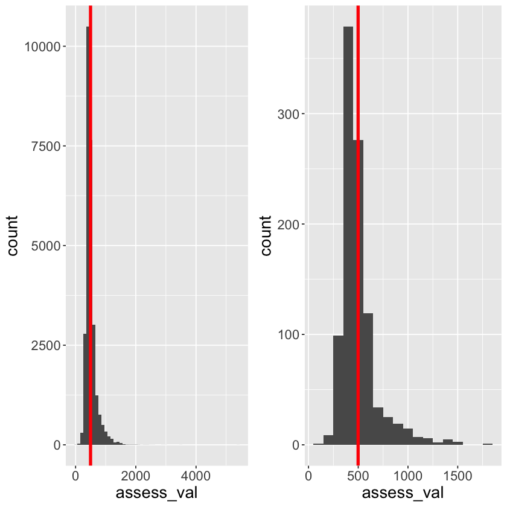
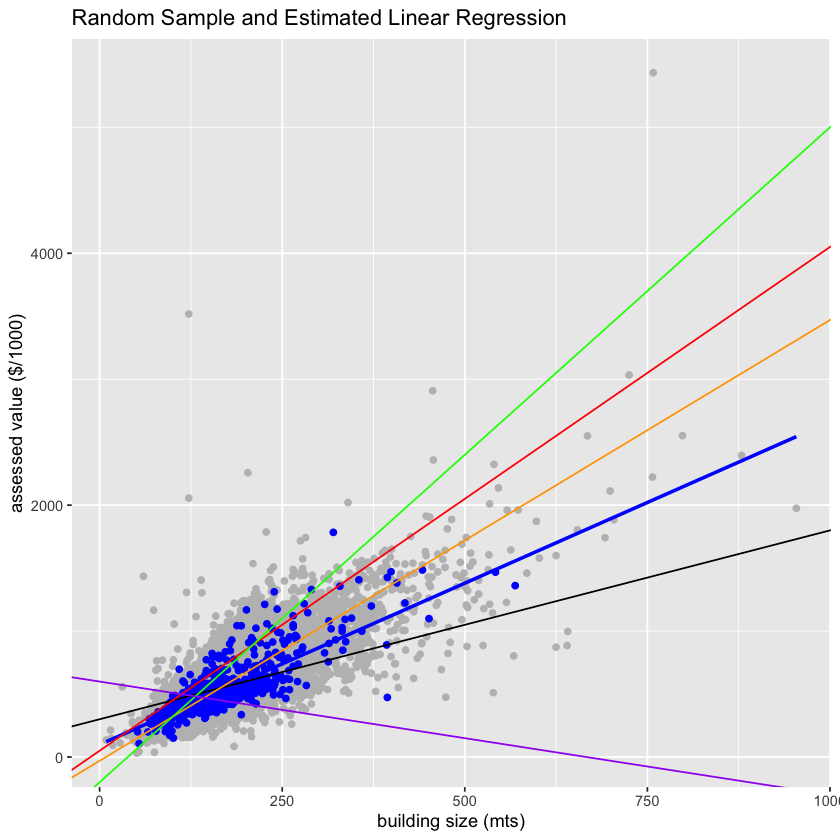

# Lecture 1: Introduction to Linear Regression

*Contributors: Gabriela Cohen Freue, Katie Burak* 


## High-level goals of this course:

- Build a strong conceptual and practical understanding of linear regression

- Become competent using `R` to fit and use a linear models to analyze real data


- Distinguish between generative models (GM) and predictive models (PM):

    - GM: to understand the data-generating mechanism 
    - PM: to make out-of-sample predictions using the estimated model

- Learn how to interpret results and measure their uncertainty


### Limitations:

- Linear Regression is a rich field and we won't be able to exhaustively cover it in 8 lectures

- Mathematical derivations are mostly omitted in lectures but some additional details are given in supplemental reading material

- Inference will be restricted to particular cases

## Lecture 1: Learning Objectives

By the end of this lecture you will be able to:

- Formulate a Linear Regression (LR)
- Compare different definitions of LR
- Identify different goals of a LR
- Identify different elements and assumptions of a LR
- Define common terminology

## References:

- Part of the content of this lecture follows closely [Chapter 17 of Introduction to Data Science, Rafael Irizarry](https://rafalab.github.io/dsbook/regression.html) (book available at [leanpub](https://leanpub.com/datasciencebook))

# 1. Scope of Linear Regression
    
### How have linear regression models been used to date?

As data scientists, we are often interested in understanding the relationship between variables in our data using *models*. 


For example:

- which variables are associated with a response of interest? 

- can we model the relationship between the response and the input variables? Is a linear model adequate?

- which variables are positively/negatively associated with the response? 

- does the relationship between the response and an input variable depend on the values of the other variables?

## 1.1 Examples

#### Sports: an example of prediction

Billy Bean, manager of the Oakland Athletics, used statistics to identify low cost players who can help the team win (example from Introduction to Data Science, Rafael Irizarry)

<table><tr>
<td>  </td>
<td>  </td>
</tr></table>

#### Public Health: an example of estimation

[Funding and Publication of Research on Gun Violence](https://jamanetwork.com/journals/jama/fullarticle/2595514)


Reference: *JAMA* 2017; 317(1):84-85

Fetured twice in New York Times: [Gun Research Is Suddenly Hot](https://www.nytimes.com/2019/04/17/upshot/gun-research-is-suddenly-hot.html), [There's an Awful Lot We Still Don't Know About Guns](https://www.nytimes.com/interactive/2018/03/02/upshot/what-should-government-study-gun-research-funding.html)

#### Climate Change: an example of inference

[Here’s The Best Place To Move If You’re Worried About Climate Change](https://fivethirtyeight.com/features/heres-the-best-place-to-move-if-youre-worried-about-climate-change/)


Reference: featured article in FiveThirtyEight

[Climate Amenities, Climate Change, and American Quality of Life](https://www.journals.uchicago.edu/doi/full/10.1086/684573)

Economists have used different **linear regression models** to explain people's choices in relation to climate variables. Reference: *JAERE* 2016; 3(1): 205-246

#### Epidemiology: an example of estimation and inference

[Protein Consumption and Bone Mineral Density in the Elderly : The Rancho Bernardo Study](https://academic.oup.com/aje/article/155/7/636/60202)


> "**Multiple linear regression analyses** adjusted for standard osteoporosis covariates showed a positive association between animal protein consumption, assessed by food frequency questionnaires in 1988–1992, and BMD, measured 4 years later." Reference: *Am J Epidemiol* 2002; 155(7):636–644

#### Medicine and Molecular Biology: an example of prediction

[Can We Predict Protein from mRNA levels?](https://www.nature.com/articles/nature23293)


Reference: *Nature* 2017, 547:E19–E20

### Real state: our working case study

Property Assessment Tax Data
(Map produced by [MountainMath](https://mountainmath.ca))


We want to identify factors that determine the tax value of a property 


## 1.2 Case Study: Property Tax Assessment

**Class discussion:** 

Which variables are associated with property assessed value? 

- neighbourhood (location)
- number of rooms
- square feet (size)
- age of house

#### Property Tax Assessment Case and Linear Regression

- Different type of variables may be associated with a property assessed value

- In DSCI_552 (Statistical Inference) you have learned tools to study the relation between a continuous and a categorical variable. For example, *do modern houses have a higher value than old houses?* You can:
    - use a *t*-test or a permutation test to test if the average value of modern houses is the same as that of old houses 
 

- However, there are some questions that you won't be able to answer with the tools learned in DSCI_552:

- For example, 
    - *is the assessed value associated with the size of the house?* (unless you collapse the information into 2 groups (large vs small houses)
    - if I build a new house, what would be its expected assessed value?

#### Conclusions 


- Linear Models provide a unifying framework to  <font color=blue> estimate  and  test </font> the true relation between different type of variables and the assessed value


- Linear Models can also be used to <font color=blue> predict </font> the assessed value of a house although it may not be the best predictive model


## 1.3 Estimation *vs.* inference *vs.* prediction 

- **Estimation**: how to estimate the true (but unknown) relation between the response and the input variables


- **Inference**: how to use the model to infer information about the unknown relation between variables


- **Prediction**: how to use the model to predict the value of the response for new observations 


**Note**: *These goals are related!*


**Class Discussion:** 

Inference (I) or Prediction (P)?

**Indicate which of the following are related to estimation and which are related to prediction**: 
    
- (a) A real estate agent wants to identify factors that are related to the assessed values of homes (e.g., size of houses, age, amenities, etc) (Inference)
    
- (b) A real estate agent is interested in determining if a house is under- or over-valued given its characteristics. (Prediction)

- (c) Biologists want to use mRNA data to predict protein values (Prediction)

- (d) Biologists want to verify empirically the central dogma of biology that relates mRNA to protein values (Inference)

- (e) A research group wants to determine if wearing sunscreen is associated with a decreased probability of developing skin cancer in Canada. (Inference) 

- (f) A marketing team thinks that tweets with GIFs get on average more impressions than tweets that do not. They will conduct an A/B testing experiment to test their hypothesis. (Inference)
    
- (g) A marketing team wants to forecast the number of mentions of a new tweet. (Prediction)

    
   

# 2. Exploratory Data Analysis (EDA)

An important step in any data analysis is to explore and know important characteristics of the data. This includes, but it is not limited to:

- knowing the size of the data 

- examining distributions of all variables using graphical and numerical summaries

- identifying missing values and potential outliers

- beginning to discover relationships between variables


This last step, usually referred as **Exploratory Data Analysis (EDA)**, is generally the first step in the analysis. However, a typical data science workflow is never linear and you may need to continue exploring the data at many points of the analysis path.

> **Heads-up**: Professors Peng and Matsui in their book "The Art of Data Science" described this process with **epicycles**


## 2.1 **EDA Checklist**

1. Formulate your question
2. Read in your data
3. Look at the top and the bottom of your data
4. Check the packaging
5. Check your “n”s

> From The Art of Data Science, by Peng and Matsui (in a slightly different order) 

#### The question:

We can use data to examine the relationship between the property assessed value and different characteristics of a property.

We will use a dataset that contains the property tax assessed values of properties in the Strathcona County. A valuation date of July 1, 2014 and a property condition date as of December 31, 2014 are provided. 

#### Read in the data

Dataset: [2015 Property Tax Assessment from Strathcona County](https://data.strathcona.ca/Housing-Buildings/2015-Property-Tax-Assessment/uexh-8sx8)


```R
library(tidyverse)
library(broom)
library(repr)
library(ggplot2)
library(gridExtra)

dat <- read.csv("data/Assessment_2015.csv")

dat
```


<table class="dataframe">
<caption>A data.frame: 33822 × 16</caption>
<thead>
	<tr><th scope=col>the_geom</th><th scope=col>TAX_YEAR</th><th scope=col>ROLL_NUM</th><th scope=col>ADDRESS</th><th scope=col>YEAR_BUILT</th><th scope=col>ASSESSCLAS</th><th scope=col>BLDG_DESC</th><th scope=col>BLDG_METRE</th><th scope=col>BLDG_FEET</th><th scope=col>GARAGE</th><th scope=col>FIREPLACE</th><th scope=col>BASEMENT</th><th scope=col>BSMTDEVL</th><th scope=col>ASSESSMENT</th><th scope=col>LATITUDE</th><th scope=col>LONGITUDE</th></tr>
	<tr><th scope=col>&lt;chr&gt;</th><th scope=col>&lt;int&gt;</th><th scope=col>&lt;dbl&gt;</th><th scope=col>&lt;chr&gt;</th><th scope=col>&lt;int&gt;</th><th scope=col>&lt;chr&gt;</th><th scope=col>&lt;chr&gt;</th><th scope=col>&lt;int&gt;</th><th scope=col>&lt;int&gt;</th><th scope=col>&lt;chr&gt;</th><th scope=col>&lt;chr&gt;</th><th scope=col>&lt;chr&gt;</th><th scope=col>&lt;chr&gt;</th><th scope=col>&lt;int&gt;</th><th scope=col>&lt;dbl&gt;</th><th scope=col>&lt;dbl&gt;</th></tr>
</thead>
<tbody>
	<tr><td>POINT (-112.9144294242738 53.447001849778545) </td><td>2015</td><td>1032301002</td><td><span style=white-space:pre-wrap>                    </span></td><td>1940</td><td>Exempt / Farmland / Residential</td><td>1 1/2 Storey &amp; Basement </td><td>199</td><td>2143</td><td>Y</td><td>Y</td><td>Y</td><td>N</td><td>290000</td><td>53.44695</td><td>-112.9145</td></tr>
	<tr><td>POINT (-112.87633420362904 53.41074767160115) </td><td>2015</td><td>1022705006</td><td><span style=white-space:pre-wrap>                    </span></td><td>1950</td><td><span style=white-space:pre-wrap>Residential                    </span></td><td><span style=white-space:pre-wrap>1 Storey &amp; Basement     </span></td><td> 83</td><td> 895</td><td>Y</td><td>Y</td><td>Y</td><td>Y</td><td>402000</td><td>53.41068</td><td>-112.8765</td></tr>
	<tr><td>POINT (-112.91925958091502 53.40590216915645) </td><td>2015</td><td>1017328004</td><td>229 51268 RNG RD 204</td><td>1983</td><td><span style=white-space:pre-wrap>Residential                    </span></td><td><span style=white-space:pre-wrap>1 Storey &amp; Basement     </span></td><td> 77</td><td> 831</td><td>N</td><td>Y</td><td>Y</td><td>N</td><td>292000</td><td>53.40588</td><td>-112.9196</td></tr>
	<tr><td>POINT (-112.86295897279041 53.447144538217024)</td><td>2015</td><td>1034103000</td><td>                    </td><td>1981</td><td>Residential                    </td><td>Split Entry             </td><td>161</td><td>1731</td><td>N</td><td>Y</td><td>Y</td><td>Y</td><td>518000</td><td>53.44727</td><td>-112.8631</td></tr>
	<tr><td>POINT (-112.91933857223259 53.405754605523676)</td><td>2015</td><td>1017329002</td><td>231 51268 RNG RD 204</td><td>1967</td><td>Residential                    </td><td>1 Storey Basementless   </td><td> 56</td><td> 600</td><td>Y</td><td>Y</td><td>N</td><td>N</td><td>197000</td><td>53.40574</td><td>-112.9197</td></tr>
	<tr><td>POINT (-112.9194226653068 53.40559810142708)  </td><td>2015</td><td>1017330000</td><td>233 51268 RNG RD 204</td><td>1968</td><td>Residential                    </td><td>1 1/2 Sty. Slab on Grade</td><td> 52</td><td> 560</td><td>N</td><td>Y</td><td>N</td><td>N</td><td>181000</td><td>53.40559</td><td>-112.9197</td></tr>
	<tr><td><span style=white-space:pre-wrap>POINT (-112.87706656864435 53.4105316732081)  </span></td><td>2015</td><td>1015300005</td><td><span style=white-space:pre-wrap>                    </span></td><td>1974</td><td>Exempt / Farmland / Residential</td><td><span style=white-space:pre-wrap>1 Storey &amp; Basement     </span></td><td>204</td><td>2195</td><td>Y</td><td>Y</td><td>Y</td><td>Y</td><td>463000</td><td>53.41068</td><td>-112.8772</td></tr>
	<tr><td>POINT (-112.91921628521787 53.40720932431589) </td><td>2015</td><td>1017319003</td><td>205 51268 RNG RD 204</td><td>1962</td><td><span style=white-space:pre-wrap>Residential                    </span></td><td>1 1/2 Storey &amp; Basement </td><td> 95</td><td>1021</td><td>Y</td><td>Y</td><td>N</td><td>N</td><td>302000</td><td>53.40744</td><td>-112.9194</td></tr>
	<tr><td>POINT (-112.92009423892009 53.40723973395918) </td><td>2015</td><td>1017322007</td><td>211 51268 RNG RD 204</td><td>1967</td><td>Residential                    </td><td>1 Storey Basementless   </td><td> 64</td><td> 690</td><td>N</td><td>Y</td><td>N</td><td>N</td><td>245000</td><td>53.40703</td><td>-112.9199</td></tr>
	<tr><td>POINT (-112.91926686738579 53.406126899561784)</td><td>2015</td><td>1017327006</td><td>227 51268 RNG RD 204</td><td>1983</td><td><span style=white-space:pre-wrap>Residential                    </span></td><td><span style=white-space:pre-wrap>2 Storey &amp; Basement     </span></td><td>170</td><td>1832</td><td>Y</td><td>Y</td><td>Y</td><td>Y</td><td>323000</td><td>53.40600</td><td>-112.9195</td></tr>
	<tr><td>POINT (-112.91946041239973 53.405432191305344)</td><td>2015</td><td>1017331008</td><td>235 51268 RNG RD 204</td><td>1965</td><td><span style=white-space:pre-wrap>Residential                    </span></td><td><span style=white-space:pre-wrap>1 Storey &amp; Basement     </span></td><td>101</td><td>1086</td><td>N</td><td>Y</td><td>Y</td><td>Y</td><td>272000</td><td>53.40547</td><td>-112.9198</td></tr>
	<tr><td>POINT (-112.92120223308287 53.40413140696102) </td><td>2015</td><td>1017339001</td><td>253 51268 RNG RD 204</td><td>1969</td><td>Residential                    </td><td>Manufactured Home       </td><td> 77</td><td> 832</td><td>N</td><td>N</td><td>N</td><td>N</td><td>153000</td><td>53.40403</td><td>-112.9214</td></tr>
	<tr><td>POINT (-112.9145393943769 53.408501408843904) </td><td>2015</td><td>1017304005</td><td>171 51268 RNG RD 204</td><td>1993</td><td><span style=white-space:pre-wrap>Residential                    </span></td><td><span style=white-space:pre-wrap>2 Storey &amp; Basement     </span></td><td>164</td><td>1760</td><td>Y</td><td>Y</td><td>Y</td><td>Y</td><td>532000</td><td>53.40871</td><td>-112.9147</td></tr>
	<tr><td>POINT (-112.92142562194445 53.40425474383107) </td><td>2015</td><td>1017340009</td><td>255 51268 RNG RD 204</td><td>1964</td><td>Residential                    </td><td>1 Storey Basementless   </td><td> 77</td><td> 826</td><td>Y</td><td>Y</td><td>N</td><td>N</td><td>184000</td><td>53.40403</td><td>-112.9214</td></tr>
	<tr><td>POINT (-112.92164872423655 53.4043848176214)  </td><td>2015</td><td>1017341007</td><td>257 51268 RNG RD 204</td><td>1972</td><td>Residential                    </td><td>Split Entry             </td><td> 54</td><td> 576</td><td>N</td><td>Y</td><td>Y</td><td>Y</td><td>222000</td><td>53.40416</td><td>-112.9217</td></tr>
	<tr><td>POINT (-112.92005875795091 53.40508263450174) </td><td>2015</td><td>1017334002</td><td>241 51268 RNG RD 204</td><td>1962</td><td>Residential                    </td><td>1 Storey Basementless   </td><td> 45</td><td> 481</td><td>N</td><td>Y</td><td>N</td><td>N</td><td>168000</td><td>53.40526</td><td>-112.9202</td></tr>
	<tr><td>POINT (-112.92025810764135 53.404967611774744)</td><td>2015</td><td>1017335009</td><td>243 51268 RNG RD 204</td><td>1968</td><td>Residential                    </td><td>A-Frame Basementless    </td><td>117</td><td>1256</td><td>Y</td><td>Y</td><td>N</td><td>N</td><td>202000</td><td>53.40504</td><td>-112.9206</td></tr>
	<tr><td>POINT (-112.92045734252574 53.40485708096862) </td><td>2015</td><td>1017336007</td><td>245 51268 RNG RD 204</td><td>2005</td><td><span style=white-space:pre-wrap>Residential                    </span></td><td><span style=white-space:pre-wrap>2 Storey &amp; Basement     </span></td><td>185</td><td>1992</td><td>Y</td><td>N</td><td>Y</td><td>Y</td><td>545000</td><td>53.40493</td><td>-112.9208</td></tr>
	<tr><td>POINT (-112.92065657262883 53.40474205649951) </td><td>2015</td><td>1017337005</td><td>247 51268 RNG RD 204</td><td>1965</td><td>Residential                    </td><td>1 Storey Basementless   </td><td> 58</td><td> 624</td><td>N</td><td>Y</td><td>N</td><td>N</td><td>198000</td><td>53.40481</td><td>-112.9210</td></tr>
	<tr><td>POINT (-112.92085586227155 53.40462927888298) </td><td>2015</td><td>1017337005</td><td>249 51268 RNG RD 204</td><td>1965</td><td>Residential                    </td><td>1 Storey Basementless   </td><td> 58</td><td> 624</td><td>N</td><td>Y</td><td>N</td><td>N</td><td>198000</td><td>53.40470</td><td>-112.9212</td></tr>
	<tr><td>POINT (-112.91960877677339 53.40530322839913) </td><td>2015</td><td>1017332006</td><td>237 51268 RNG RD 204</td><td>1984</td><td>Residential                    </td><td>1 Storey Basementless   </td><td> 80</td><td> 864</td><td>Y</td><td>Y</td><td>N</td><td>N</td><td>263000</td><td>53.40537</td><td>-112.9200</td></tr>
	<tr><td>POINT (-112.92242198320035 53.40409748796812) </td><td>2015</td><td>1017346006</td><td>267 51268 RNG RD 204</td><td>1995</td><td><span style=white-space:pre-wrap>Residential                    </span></td><td><span style=white-space:pre-wrap>2 Storey &amp; Basement     </span></td><td>201</td><td>2167</td><td>Y</td><td>Y</td><td>Y</td><td>N</td><td>527000</td><td>53.40419</td><td>-112.9228</td></tr>
	<tr><td>POINT (-112.91983514443262 53.40518845082868) </td><td>2015</td><td>1017333004</td><td>239 51268 RNG RD 204</td><td>1967</td><td>Residential                    </td><td>A-Frame Basementless    </td><td> 63</td><td> 680</td><td>Y</td><td>Y</td><td>N</td><td>N</td><td>181000</td><td>53.40526</td><td>-112.9202</td></tr>
	<tr><td>POINT (-112.92170273317251 53.403745011605956)</td><td>2015</td><td>1017349000</td><td>273 51268 RNG RD 204</td><td>2012</td><td>Residential                    </td><td>1 Storey Basementless   </td><td>128</td><td>1374</td><td>N</td><td>Y</td><td>N</td><td>N</td><td>310000</td><td>53.40370</td><td>-112.9220</td></tr>
	<tr><td>POINT (-112.92191708124783 53.40387275921222) </td><td>2015</td><td>1017348002</td><td>271 51268 RNG RD 204</td><td>1992</td><td><span style=white-space:pre-wrap>Residential                    </span></td><td><span style=white-space:pre-wrap>1 Storey &amp; Basement     </span></td><td>120</td><td>1287</td><td>N</td><td>N</td><td>Y</td><td>Y</td><td>364000</td><td>53.40370</td><td>-112.9220</td></tr>
	<tr><td>POINT (-112.92213166161493 53.40399601523331) </td><td>2015</td><td>1017347004</td><td>269 51268 RNG RD 204</td><td>1979</td><td><span style=white-space:pre-wrap>Residential                    </span></td><td>1 1/2 Storey &amp; Basement </td><td>107</td><td>1152</td><td>N</td><td>Y</td><td>Y</td><td>N</td><td>305000</td><td>53.40396</td><td>-112.9225</td></tr>
	<tr><td>POINT (-112.91929445337188 53.40632485394756) </td><td>2015</td><td>1017326008</td><td>225 51268 RNG RD 204</td><td>1967</td><td><span style=white-space:pre-wrap>Residential                    </span></td><td><span style=white-space:pre-wrap>1 Storey &amp; Basement     </span></td><td> 98</td><td>1056</td><td>Y</td><td>Y</td><td>Y</td><td>Y</td><td>292000</td><td>53.40613</td><td>-112.9196</td></tr>
	<tr><td>POINT (-112.92037720179421 53.407228812799346)</td><td>2015</td><td>1017323005</td><td>213 51268 RNG RD 204</td><td>2008</td><td><span style=white-space:pre-wrap>Residential                    </span></td><td><span style=white-space:pre-wrap>2 Storey &amp; Basement     </span></td><td>235</td><td>2525</td><td>Y</td><td>Y</td><td>Y</td><td>N</td><td>720000</td><td>53.40718</td><td>-112.9207</td></tr>
	<tr><td>POINT (-112.90637851669213 53.41031412913355) </td><td>2015</td><td>1017116003</td><td>101 51268 RNG RD 204</td><td>1966</td><td>Residential                    </td><td>1 Storey Basementless   </td><td> 67</td><td> 720</td><td>N</td><td>N</td><td>N</td><td>N</td><td>223000</td><td>53.41010</td><td>-112.9066</td></tr>
	<tr><td>POINT (-112.89354609491593 53.40969940663746) </td><td>2015</td><td>1016330001</td><td>15 51263 RNG RD 204 </td><td>1975</td><td>Residential                    </td><td>2 Storey Basementless   </td><td>119</td><td>1279</td><td>N</td><td>Y</td><td>N</td><td>N</td><td>268000</td><td>53.40993</td><td>-112.8938</td></tr>
	<tr><td>⋮</td><td>⋮</td><td>⋮</td><td>⋮</td><td>⋮</td><td>⋮</td><td>⋮</td><td>⋮</td><td>⋮</td><td>⋮</td><td>⋮</td><td>⋮</td><td>⋮</td><td>⋮</td><td>⋮</td><td>⋮</td></tr>
	<tr><td>POINT (-113.30476656922222 53.53037032263911)</td><td>2015</td><td>-2147483648</td><td>161 GREAT OAKS</td><td>1970</td><td>Residential Condominium</td><td>2 Storey &amp; Basement</td><td>114</td><td>1230</td><td>Y</td><td>N</td><td>Y</td><td>Y</td><td>250000</td><td>53.53027</td><td>-113.3063</td></tr>
	<tr><td>POINT (-113.30476656922222 53.53037032263911)</td><td>2015</td><td>-2147483648</td><td>161 GREAT OAKS</td><td>1970</td><td>Residential Condominium</td><td>2 Storey &amp; Basement</td><td>121</td><td>1302</td><td>N</td><td>N</td><td>Y</td><td>Y</td><td>238000</td><td>53.53027</td><td>-113.3063</td></tr>
	<tr><td>POINT (-113.30476656922222 53.53037032263911)</td><td>2015</td><td>-2147483648</td><td>161 GREAT OAKS</td><td>1970</td><td>Residential Condominium</td><td>2 Storey &amp; Basement</td><td>114</td><td>1230</td><td>Y</td><td>N</td><td>Y</td><td>Y</td><td>249000</td><td>53.53027</td><td>-113.3063</td></tr>
	<tr><td>POINT (-113.30476656922222 53.53037032263911)</td><td>2015</td><td>-2147483648</td><td>161 GREAT OAKS</td><td>1970</td><td>Residential Condominium</td><td>2 Storey &amp; Basement</td><td>121</td><td>1302</td><td>N</td><td>N</td><td>Y</td><td>Y</td><td>252000</td><td>53.53027</td><td>-113.3063</td></tr>
	<tr><td>POINT (-113.30476656922222 53.53037032263911)</td><td>2015</td><td>-2147483648</td><td>161 GREAT OAKS</td><td>1970</td><td>Residential Condominium</td><td>2 Storey &amp; Basement</td><td>114</td><td>1230</td><td>Y</td><td>N</td><td>Y</td><td>Y</td><td>248000</td><td>53.53027</td><td>-113.3063</td></tr>
	<tr><td>POINT (-113.30476656922222 53.53037032263911)</td><td>2015</td><td>-2147483648</td><td>161 GREAT OAKS</td><td>1970</td><td>Residential Condominium</td><td>2 Storey &amp; Basement</td><td>121</td><td>1302</td><td>N</td><td>N</td><td>Y</td><td>Y</td><td>257000</td><td>53.53027</td><td>-113.3063</td></tr>
	<tr><td>POINT (-113.30476656922222 53.53037032263911)</td><td>2015</td><td>-2147483648</td><td>161 GREAT OAKS</td><td>1970</td><td>Residential Condominium</td><td>2 Storey &amp; Basement</td><td>114</td><td>1230</td><td>Y</td><td>N</td><td>Y</td><td>Y</td><td>269000</td><td>53.53027</td><td>-113.3063</td></tr>
	<tr><td>POINT (-113.30476656922222 53.53037032263911)</td><td>2015</td><td>-2147483648</td><td>161 GREAT OAKS</td><td>1970</td><td>Residential Condominium</td><td>2 Storey &amp; Basement</td><td>121</td><td>1302</td><td>N</td><td>N</td><td>Y</td><td>Y</td><td>266000</td><td>53.53027</td><td>-113.3063</td></tr>
	<tr><td>POINT (-113.30476656922222 53.53037032263911)</td><td>2015</td><td>-2147483648</td><td>161 GREAT OAKS</td><td>1970</td><td>Residential Condominium</td><td>2 Storey &amp; Basement</td><td>121</td><td>1302</td><td>N</td><td>N</td><td>Y</td><td>Y</td><td>265000</td><td>53.53027</td><td>-113.3063</td></tr>
	<tr><td>POINT (-113.30476656922222 53.53037032263911)</td><td>2015</td><td>-2147483648</td><td>161 GREAT OAKS</td><td>1970</td><td>Residential Condominium</td><td>2 Storey &amp; Basement</td><td>121</td><td>1302</td><td>N</td><td>N</td><td>Y</td><td>Y</td><td>268000</td><td>53.53027</td><td>-113.3063</td></tr>
	<tr><td>POINT (-113.30476656922222 53.53037032263911)</td><td>2015</td><td>-2147483648</td><td>161 GREAT OAKS</td><td>1970</td><td>Residential Condominium</td><td>2 Storey &amp; Basement</td><td>114</td><td>1230</td><td>Y</td><td>N</td><td>Y</td><td>Y</td><td>270000</td><td>53.53027</td><td>-113.3063</td></tr>
	<tr><td>POINT (-113.30476656922222 53.53037032263911)</td><td>2015</td><td>-2147483648</td><td>161 GREAT OAKS</td><td>1970</td><td>Residential Condominium</td><td>2 Storey &amp; Basement</td><td>121</td><td>1302</td><td>N</td><td>N</td><td>Y</td><td>Y</td><td>263000</td><td>53.53027</td><td>-113.3063</td></tr>
	<tr><td>POINT (-113.30476656922222 53.53037032263911)</td><td>2015</td><td>-2147483648</td><td>161 GREAT OAKS</td><td>1970</td><td>Residential Condominium</td><td>2 Storey &amp; Basement</td><td>114</td><td>1230</td><td>Y</td><td>N</td><td>Y</td><td>Y</td><td>257000</td><td>53.53027</td><td>-113.3063</td></tr>
	<tr><td>POINT (-113.30476656922222 53.53037032263911)</td><td>2015</td><td>-2147483648</td><td>161 GREAT OAKS</td><td>1970</td><td>Residential Condominium</td><td>2 Storey &amp; Basement</td><td>121</td><td>1302</td><td>N</td><td>N</td><td>Y</td><td>Y</td><td>240000</td><td>53.53027</td><td>-113.3063</td></tr>
	<tr><td>POINT (-113.30476656922222 53.53037032263911)</td><td>2015</td><td>-2147483648</td><td>161 GREAT OAKS</td><td>1970</td><td>Residential Condominium</td><td>2 Storey &amp; Basement</td><td>121</td><td>1302</td><td>N</td><td>N</td><td>Y</td><td>N</td><td>253000</td><td>53.53027</td><td>-113.3063</td></tr>
	<tr><td>POINT (-113.30476656922222 53.53037032263911)</td><td>2015</td><td>-2147483648</td><td>161 GREAT OAKS</td><td>1970</td><td>Residential Condominium</td><td>2 Storey &amp; Basement</td><td>121</td><td>1302</td><td>N</td><td>N</td><td>Y</td><td>Y</td><td>268000</td><td>53.53027</td><td>-113.3063</td></tr>
	<tr><td>POINT (-113.30476656922222 53.53037032263911)</td><td>2015</td><td>-2147483648</td><td>161 GREAT OAKS</td><td>1970</td><td>Residential Condominium</td><td>2 Storey &amp; Basement</td><td>114</td><td>1230</td><td>Y</td><td>N</td><td>Y</td><td>Y</td><td>261000</td><td>53.53027</td><td>-113.3063</td></tr>
	<tr><td>POINT (-113.30476656922222 53.53037032263911)</td><td>2015</td><td>-2147483648</td><td>161 GREAT OAKS</td><td>1970</td><td>Residential Condominium</td><td>2 Storey &amp; Basement</td><td>121</td><td>1302</td><td>N</td><td>N</td><td>Y</td><td>Y</td><td>269000</td><td>53.53027</td><td>-113.3063</td></tr>
	<tr><td>POINT (-113.30476656922222 53.53037032263911)</td><td>2015</td><td>-2147483648</td><td>161 GREAT OAKS</td><td>1970</td><td>Residential Condominium</td><td>2 Storey &amp; Basement</td><td>114</td><td>1230</td><td>Y</td><td>N</td><td>Y</td><td>Y</td><td>260000</td><td>53.53027</td><td>-113.3063</td></tr>
	<tr><td>POINT (-113.30476656922222 53.53037032263911)</td><td>2015</td><td>-2147483648</td><td>161 GREAT OAKS</td><td>1970</td><td>Residential Condominium</td><td>2 Storey &amp; Basement</td><td>121</td><td>1302</td><td>N</td><td>Y</td><td>Y</td><td>Y</td><td>266000</td><td>53.53027</td><td>-113.3063</td></tr>
	<tr><td>POINT (-113.30476656922222 53.53037032263911)</td><td>2015</td><td>-2147483648</td><td>161 GREAT OAKS</td><td>1970</td><td>Residential Condominium</td><td>2 Storey &amp; Basement</td><td>121</td><td>1302</td><td>N</td><td>N</td><td>Y</td><td>Y</td><td>240000</td><td>53.53027</td><td>-113.3063</td></tr>
	<tr><td>POINT (-113.30476656922222 53.53037032263911)</td><td>2015</td><td>-2147483648</td><td>161 GREAT OAKS</td><td>1970</td><td>Residential Condominium</td><td>2 Storey &amp; Basement</td><td>114</td><td>1230</td><td>Y</td><td>N</td><td>Y</td><td>N</td><td>246000</td><td>53.53027</td><td>-113.3063</td></tr>
	<tr><td>POINT (-113.30476656922222 53.53037032263911)</td><td>2015</td><td>-2147483648</td><td>161 GREAT OAKS</td><td>1970</td><td>Residential Condominium</td><td>2 Storey &amp; Basement</td><td>121</td><td>1302</td><td>N</td><td>N</td><td>Y</td><td>Y</td><td>257000</td><td>53.53027</td><td>-113.3063</td></tr>
	<tr><td>POINT (-113.30476656922222 53.53037032263911)</td><td>2015</td><td>-2147483648</td><td>161 GREAT OAKS</td><td>1970</td><td>Residential Condominium</td><td>2 Storey &amp; Basement</td><td>121</td><td>1302</td><td>N</td><td>N</td><td>Y</td><td>Y</td><td>247000</td><td>53.53027</td><td>-113.3063</td></tr>
	<tr><td>POINT (-113.30476656922222 53.53037032263911)</td><td>2015</td><td>-2147483648</td><td>161 GREAT OAKS</td><td>1970</td><td>Residential Condominium</td><td>2 Storey &amp; Basement</td><td>121</td><td>1302</td><td>N</td><td>N</td><td>Y</td><td>Y</td><td>257000</td><td>53.53027</td><td>-113.3063</td></tr>
	<tr><td>POINT (-113.30476656922222 53.53037032263911)</td><td>2015</td><td>-2147483648</td><td>161 GREAT OAKS</td><td>1970</td><td>Residential Condominium</td><td>2 Storey &amp; Basement</td><td>121</td><td>1302</td><td>N</td><td>N</td><td>Y</td><td>Y</td><td>257000</td><td>53.53027</td><td>-113.3063</td></tr>
	<tr><td>POINT (-113.30476656922222 53.53037032263911)</td><td>2015</td><td>-2147483648</td><td>161 GREAT OAKS</td><td>1970</td><td>Residential Condominium</td><td>2 Storey &amp; Basement</td><td>121</td><td>1302</td><td>N</td><td>N</td><td>Y</td><td>Y</td><td>252000</td><td>53.53027</td><td>-113.3063</td></tr>
	<tr><td>POINT (-113.30476656922222 53.53037032263911)</td><td>2015</td><td>-2147483648</td><td>161 GREAT OAKS</td><td>1970</td><td>Residential Condominium</td><td>2 Storey &amp; Basement</td><td>121</td><td>1302</td><td>N</td><td>N</td><td>Y</td><td>Y</td><td>263000</td><td>53.53027</td><td>-113.3063</td></tr>
	<tr><td>POINT (-113.30476656922222 53.53037032263911)</td><td>2015</td><td>-2147483648</td><td>161 GREAT OAKS</td><td>1970</td><td>Residential Condominium</td><td>2 Storey &amp; Basement</td><td>114</td><td>1230</td><td>Y</td><td>N</td><td>Y</td><td>Y</td><td>260000</td><td>53.53027</td><td>-113.3063</td></tr>
	<tr><td>POINT (-113.30476656922222 53.53037032263911)</td><td>2015</td><td>-2147483648</td><td>161 GREAT OAKS</td><td>1970</td><td>Residential Condominium</td><td>2 Storey &amp; Basement</td><td>114</td><td>1230</td><td>Y</td><td>N</td><td>Y</td><td>Y</td><td>260000</td><td>53.53027</td><td>-113.3063</td></tr>
</tbody>
</table>


- We are going to focus on the population of "Residential" properties

- For simplicity, values are adjusted per $1000


```R
#filter: residential houses
dat <- dat %>% 
        filter(ASSESSCLAS=="Residential")  %>% 
        mutate(assess_val = ASSESSMENT / 1000) 
```

#### Population *vs.* sample

We can consider *all* residential properties in this county as a finite population or we can think that this is a random sample from an unknown data generating process. 


To illustrate some concepts in this course we are going to consider this as a population and take a *random sample* of properties from it.


> **Heads up**: Recall the importance of using a *random* sample to obtain representative summaries and broad conclusions!


#### Important note

In general, we don't have information for all the population. We only have a *random sample* from the population and use it to *estimate* and *infer* information about the *unknown* population. 


```R
set.seed(561)

dat_s <- sample_n(dat, 1000, replace = FALSE)
```

#### Look at the top and the bottom of your data


```R
dat_s  %>%  head(3)
dat_s  %>%  tail(3)
```


<table class="dataframe">
<caption>A data.frame: 3 × 17</caption>
<thead>
	<tr><th></th><th scope=col>the_geom</th><th scope=col>TAX_YEAR</th><th scope=col>ROLL_NUM</th><th scope=col>ADDRESS</th><th scope=col>YEAR_BUILT</th><th scope=col>ASSESSCLAS</th><th scope=col>BLDG_DESC</th><th scope=col>BLDG_METRE</th><th scope=col>BLDG_FEET</th><th scope=col>GARAGE</th><th scope=col>FIREPLACE</th><th scope=col>BASEMENT</th><th scope=col>BSMTDEVL</th><th scope=col>ASSESSMENT</th><th scope=col>LATITUDE</th><th scope=col>LONGITUDE</th><th scope=col>assess_val</th></tr>
	<tr><th></th><th scope=col>&lt;chr&gt;</th><th scope=col>&lt;int&gt;</th><th scope=col>&lt;dbl&gt;</th><th scope=col>&lt;chr&gt;</th><th scope=col>&lt;int&gt;</th><th scope=col>&lt;chr&gt;</th><th scope=col>&lt;chr&gt;</th><th scope=col>&lt;int&gt;</th><th scope=col>&lt;int&gt;</th><th scope=col>&lt;chr&gt;</th><th scope=col>&lt;chr&gt;</th><th scope=col>&lt;chr&gt;</th><th scope=col>&lt;chr&gt;</th><th scope=col>&lt;int&gt;</th><th scope=col>&lt;dbl&gt;</th><th scope=col>&lt;dbl&gt;</th><th scope=col>&lt;dbl&gt;</th></tr>
</thead>
<tbody>
	<tr><th scope=row>1</th><td>POINT (-113.26828568594681 53.53364376673626) </td><td>2015</td><td>-2147483648</td><td>107 GLENCOE BLVD</td><td>1990</td><td>Residential</td><td>2 Storey &amp; Basement</td><td>220</td><td>2368</td><td>Y</td><td>Y</td><td>Y</td><td>Y</td><td>536000</td><td>53.53381</td><td>-113.2685</td><td>536</td></tr>
	<tr><th scope=row>2</th><td>POINT (-113.31770257850987 53.516152401699564)</td><td>2015</td><td>-2147483648</td><td><span style=white-space:pre-wrap>116 WILLOW ST   </span></td><td>1959</td><td>Residential</td><td>1 Storey &amp; Basement</td><td> 97</td><td>1044</td><td>Y</td><td>Y</td><td>Y</td><td>Y</td><td>370000</td><td>53.51608</td><td>-113.3180</td><td>370</td></tr>
	<tr><th scope=row>3</th><td>POINT (-113.28777490571461 53.52360710210846) </td><td>2015</td><td>-2147483648</td><td><span style=white-space:pre-wrap>45 RAVEN DR     </span></td><td>1966</td><td>Residential</td><td>1 Storey &amp; Basement</td><td> 89</td><td> 960</td><td>N</td><td>N</td><td>Y</td><td>Y</td><td>318000</td><td>53.52373</td><td>-113.2880</td><td>318</td></tr>
</tbody>
</table>


<table class="dataframe">
<caption>A data.frame: 3 × 17</caption>
<thead>
	<tr><th></th><th scope=col>the_geom</th><th scope=col>TAX_YEAR</th><th scope=col>ROLL_NUM</th><th scope=col>ADDRESS</th><th scope=col>YEAR_BUILT</th><th scope=col>ASSESSCLAS</th><th scope=col>BLDG_DESC</th><th scope=col>BLDG_METRE</th><th scope=col>BLDG_FEET</th><th scope=col>GARAGE</th><th scope=col>FIREPLACE</th><th scope=col>BASEMENT</th><th scope=col>BSMTDEVL</th><th scope=col>ASSESSMENT</th><th scope=col>LATITUDE</th><th scope=col>LONGITUDE</th><th scope=col>assess_val</th></tr>
	<tr><th></th><th scope=col>&lt;chr&gt;</th><th scope=col>&lt;int&gt;</th><th scope=col>&lt;dbl&gt;</th><th scope=col>&lt;chr&gt;</th><th scope=col>&lt;int&gt;</th><th scope=col>&lt;chr&gt;</th><th scope=col>&lt;chr&gt;</th><th scope=col>&lt;int&gt;</th><th scope=col>&lt;int&gt;</th><th scope=col>&lt;chr&gt;</th><th scope=col>&lt;chr&gt;</th><th scope=col>&lt;chr&gt;</th><th scope=col>&lt;chr&gt;</th><th scope=col>&lt;int&gt;</th><th scope=col>&lt;dbl&gt;</th><th scope=col>&lt;dbl&gt;</th><th scope=col>&lt;dbl&gt;</th></tr>
</thead>
<tbody>
	<tr><th scope=row>998</th><td>POINT (-113.29031567242677 53.55190602122994) </td><td>2015</td><td>-2147483648</td><td><span style=white-space:pre-wrap>106 COACHMAN WY     </span></td><td>1990</td><td>Residential</td><td><span style=white-space:pre-wrap>1 Storey &amp; Basement  </span></td><td>184</td><td>1982</td><td>Y</td><td>Y</td><td>Y</td><td>Y</td><td>512000</td><td>53.55190</td><td>-113.2906</td><td>512</td></tr>
	<tr><th scope=row>999</th><td>POINT (-113.28937772221407 53.515066319465284)</td><td>2015</td><td>-2147483648</td><td><span style=white-space:pre-wrap>45 MEADOWOOD CR     </span></td><td>1970</td><td>Residential</td><td><span style=white-space:pre-wrap>1 Storey &amp; Basement  </span></td><td> 89</td><td> 960</td><td>Y</td><td>N</td><td>Y</td><td>Y</td><td>380000</td><td>53.51508</td><td>-113.2891</td><td>380</td></tr>
	<tr><th scope=row>1000</th><td>POINT (-112.98115374382121 53.48441517042359) </td><td>2015</td><td> 2114896000</td><td>254 52343 RNG RD 211</td><td>1975</td><td>Residential</td><td>1 Storey Basementless</td><td> 88</td><td> 952</td><td>N</td><td>Y</td><td>N</td><td>N</td><td>257000</td><td>53.48441</td><td>-112.9815</td><td>257</td></tr>
</tbody>
</table>


#### Check the packaging and check your "n"s  


```R
str(dat_s)
```

    'data.frame':	1000 obs. of  17 variables:
     $ the_geom  : chr  "POINT (-113.26828568594681 53.53364376673626)" "POINT (-113.31770257850987 53.516152401699564)" "POINT (-113.28777490571461 53.52360710210846)" "POINT (-113.27617960277775 53.55193363362361)" ...
     $ TAX_YEAR  : int  2015 2015 2015 2015 2015 2015 2015 2015 2015 2015 ...
     $ ROLL_NUM  : num  -2.15e+09 -2.15e+09 -2.15e+09 -2.15e+09 1.22e+09 ...
     $ ADDRESS   : chr  "107 GLENCOE BLVD" "116 WILLOW ST" "45 RAVEN DR" "8 CRANBERRY WY" ...
     $ YEAR_BUILT: int  1990 1959 1966 2004 1982 2006 1993 1953 2008 2000 ...
     $ ASSESSCLAS: chr  "Residential" "Residential" "Residential" "Residential" ...
     $ BLDG_DESC : chr  "2 Storey & Basement" "1 Storey & Basement" "1 Storey & Basement" "2 Storey & Basement" ...
     $ BLDG_METRE: int  220 97 89 111 162 160 141 114 243 132 ...
     $ BLDG_FEET : int  2368 1044 960 1192 1740 1724 1515 1229 2613 1420 ...
     $ GARAGE    : chr  "Y" "Y" "N" "Y" ...
     $ FIREPLACE : chr  "Y" "Y" "N" "N" ...
     $ BASEMENT  : chr  "Y" "Y" "Y" "Y" ...
     $ BSMTDEVL  : chr  "Y" "Y" "Y" "Y" ...
     $ ASSESSMENT: int  536000 370000 318000 339000 543000 469000 388000 320000 1174000 483000 ...
     $ LATITUDE  : num  53.5 53.5 53.5 53.6 53.4 ...
     $ LONGITUDE : num  -113 -113 -113 -113 -113 ...
     $ assess_val: num  536 370 318 339 543 ...


#### Additional information about the data

We can define different random variables and study important qualities to characterize them and their relationships.

For example:


- the assessed value (the response $Y$ in a LR model) 
    - `assess_val` in the dataset
       

- the size (an explanatory variable $X_1$ in a LR model)
    - `BLDG_METRE` in the dataset
        

- the availability of a fireplace (another explanatory variable $X_2$ in a LR model)
    - `FIREPLACE` in the dataset

#### Get summary statistics

- Select the variables `assess_val` and `BLDG_METRE` and create a new dataframe called `dat_tax_SLR`

- Use the `gather` function to convert the dataset into a *long* format

- Then use `summarise` to obtain the maximum, minimum, median, mean, and standard deviation of these variables

> **Heads up**: for pedagogical purposes we start with this smaller dataset


```R
# Your code goes here
dat_tax_SLR = dat_s |> select(assess_val, BLDG_METRE) |>
    gather() |>
    group_by(key) |>
    summarise(mean = mean(value, na.rm = TRUE), 
              max = max(value), 
              min = min(value), 
              median = median(value, na.rm = TRUE), 
              sd = sd(value, na.rm = TRUE))
dat_tax_SLR
```


<table class="dataframe">
<caption>A tibble: 2 × 6</caption>
<thead>
	<tr><th scope=col>key</th><th scope=col>mean</th><th scope=col>max</th><th scope=col>min</th><th scope=col>median</th><th scope=col>sd</th></tr>
	<tr><th scope=col>&lt;chr&gt;</th><th scope=col>&lt;dbl&gt;</th><th scope=col>&lt;dbl&gt;</th><th scope=col>&lt;dbl&gt;</th><th scope=col>&lt;dbl&gt;</th><th scope=col>&lt;dbl&gt;</th></tr>
</thead>
<tbody>
	<tr><td>BLDG_METRE</td><td>155.833</td><td> 569</td><td> 52</td><td>140</td><td> 58.79801</td></tr>
	<tr><td>assess_val</td><td>498.669</td><td>1784</td><td>107</td><td>453</td><td>188.72668</td></tr>
</tbody>
</table>


## 2.2 Population and sample distributions

As any random variable, these have a distribution function which we need to answer questions of the kind 

> *what is the probability that the `assess_val` is greater than 500K*?
   
- Plot side-by-side histograms of the population and sample distributions of `assess_val` 

- Add a vertical red line representing the position of the population and sample means (respectively)


```R
# Your code goes here
library(cowplot)
# population
population <- dat |>
  ggplot(aes(x = assess_val)) +
  geom_histogram(binwidth=100) +
  theme(text = element_text(size = 16.5)) +
  geom_vline(xintercept = 496.4043, color = "red", size = 1.5)

# sample
sample <- dat_s |>
  ggplot(aes(x = assess_val)) +
  geom_histogram(binwidth=100) +
  theme(text = element_text(size = 16.5)) +
  geom_vline(xintercept = 498.669, color = "red", size = 1.5)

plot_grid(population, sample, nrow = 1)
```


    

    


# 3. Simple Linear Regression (SLR)

If we want to predict the assessed value of a property, the *best* guess would be its expected value $E[Y]$.

> Even if we don't have all the data from the population, we can make a good prediction if we know the average value
    
In our population data: $E[Y] = 496.4$

In our sample: $\bar{Y} = 498.669$


#### Important note

In general, we don't have information about the population and we use a *random sample* from the population to infer or predict

But if we want to predict the assessed value of a *large* property  (e.g., more than 300 mts) ...

... it makes more sense to just focus on the values of large properties in our population

> Note: It is important that we only make predictions for our response variable within the observed range of our explanatory variable. 


## 3.1 The conditional expectation

The *conditional* expected value is the *best* predictor given additional relevant information.

But, is the assessed value related to the size of the property? Is the "size" *relevant* information?

We can use a linear regression (LR) to answer these questions.

## 3.2 The regression line

Let ${(X_{i},Y_i): i = 1, \ldots , n}$ be a <font color="red">random sample</font> of size $n$ from the population

Then, $Y_i = \beta_0 + \beta_1 X_{i} + \varepsilon_i, \; E[\varepsilon_i|X_i] = E[\varepsilon_i] = 0$

- We made this assumption for any pair of random variables from our population!


#### Notation

- note the use of the subscript $i$ to denote the $i$th experimental unit in our sample:

    - the $i$th house in our dataset
    - the $i$th patient in a medical study
    - the $i$th customer in an economics study

The error term, $\varepsilon_i$ contains all factors affecting $Y_i$ other than $X_{i}$

#### Assumptions

1. An important assumption is that <font color="blue"> the conditional expectation of the response is linearly related to the input variable </font> and the line is the *linear regression* 

$$E[\text{value}_i|\text{size}_i] = \beta_0 + \beta_1 \text{size}_{i}$$


or in a general context: 


$$E[Y_i|X_i] = \beta_0 + \beta_1 X_{i}$$


> **NOTE**: This is not the only way to model the conditional expectation! If the true conditional expectation is not linear, other methods will be better to predict the response! For example: in DSCI_571, you have used `kNN` (see lab problem)!


2. The random errors are independent and identically distributed: *iid assumption*


3. The random errors have all the same variance: $\text{Var}(\varepsilon_i) = \sigma^2$


#### Important note
    
    
As any other assumption, these may not hold or may not be a good assumption. We'll study later how to check these assumptions, some consequences of their violation and what to do in those cases.


Image from the book: "Beyond Multiple Linear Regression", from Paul Roback and Julie Legler

https://bookdown.org/roback/bookdown-BeyondMLR/

## 3.3 Elements of a LR

#### <font color="blue"> The response variable: $Y$  </font> 

Also known as: **output**, **explained variable**, **dependent variable**

#### <font color="blue"> The input variable(s): $X$ </font> 

Also known as: **input**, **explanatory variables**, **independent variable**, **covariates**, **features**

> **Heads up**: In Simple Linear Regression (SLR) there's only 1 input variable


**Question**

You hypothesize that the cancer mortality of each county is related to the average level of poverty. Thus, you want to study quantitavely the association between `TARGET_deathRate` and `povertyPercent`.

**Which variable would you use as the *response* and which as an *input* to build a LR?**

**A.** Response: `TARGET_deathRate` ; Input: `povertyPercent`

**B.** Response: `povertyPercent` ; Input: `TARGET_deathRate`

Answer: A


#### <font color="blue"> The regression coefficients: $\beta_0, \; \beta_1$ </font> 

The true intercept and the slope of this line are called *regression parameters or coefficients*


> Note: These population parameters are *unknown* and *non-random* (we use a *random sample* to estimate them using the `lm` function in R)
   
   
#### <font color="blue"> The error term: $\varepsilon_i$ </font>

The error term contains all factors affecting $Y_i$ other than $X_{i}$


> Note: Any distributional assumption made about the error term also affect the random variable $Y$ (if you assume that $\varepsilon$ is a Normal random variable, then $Y$ would also be Normal).

**Question**

**True or false?**

In a simple linear regression, the response is an exact linear function of the input variable, i.e.,

$$Y_i = \beta_0 + \beta_1 X_i$$

**A.** TRUE

**B.** FALSE

Answer: FALSE

**Question**

**True or false?**

The population regression slope coefficient, $\beta_1$, is usually unknown so we need to estimate it using data.

**A.** TRUE

**B.** FALSE

Answer: TRUE

# 4. Estimation of the regression line

The true regression parameters are unknown! So we use data from a random sample to estimate them!!

> in grey: all points in the population `dat`

> in blue: all points in the random sample `dat_s` (you can also use `dat_tax_SLR`)


```R
plot_slr <- dat %>% ggplot(aes(BLDG_METRE, assess_val)) + 
  geom_point(color = "grey") +
  xlab("building size (mts)") + 
  ylab("assessed value ($/1000)") +
  geom_point(data = dat_s, aes(BLDG_METRE, assess_val), color = "blue") +
  geom_smooth(method = lm, se = FALSE, color = "blue", data=dat_s) +
  ggtitle("Random Sample and Estimated Linear Regression")

plot_slr
```


    Error in dat %>% ggplot(aes(BLDG_METRE, assess_val)): could not find function "%>%"
    Traceback:


**Question**

How would you choose the **best line**? 

**A.** The line that contains most data points 

**B.** The line that minimizes the distance of the points to the line 

**C.** The line that looks the best upon visual inspection


Answer: B is the approach we use in least squares regression (minimizing the *vertical* distance of the points to the line). 

## 4.1 Least squares estimation

#### How do we find the *best* line?

- This is not the only line we can fit!


```R
plot_slr  + 
    geom_abline(intercept=300,slope=1.5, col = "black")+
    geom_abline(intercept=-30,slope=3.5, col = "orange")+
    geom_abline(intercept=50,slope=4, col = "red")+
    geom_abline(intercept=-200,slope=5.2, col = "green")+
    geom_abline(intercept=600,slope=-0.9, col = "purple")
```

    `geom_smooth()` using formula = 'y ~ x'


    

    


####  Discussion :

To define the **best line** we need to know how to measure the distance of the points to the line! 
    
**Which of the following criteria would you choose to define "distance of a point to the line"?** 

> **Note**: discuss with your choice with your neighbour, more than one option can be possible


Figure by Prof. Joel Ostblom


From An Introduction to Statistical Learning, by James, Witten, Hastie and Tibshirani 

Least Squares method minimizes the sum of the squares of the residuals. The residuals are the difference between the observed value of the response ($y_i$) and the predicted value of the response ($\hat{y}_i$):

$$r_i = y_i-\hat{y}_i$$

> **Heads up:** the residuals are the vertical distances of each point to the estimated line

Check [this application](http://setosa.io/ev/ordinary-least-squares-regression/)

> This is just one criteria to estimate the regression line

## 4.2 LS in R

The parameters of the linear model, a.k.a. regression coefficients, can be estimated through **ordinary least squares**! We will use the `lm` function in R to obtain estimates using data.

> **Heads up**: LS is not the only method to estimate the regression coefficients. However, it is the default method in `lm`

The relevant arguments are:

- `formula`: takes the form `response ~ input`.
- `data`: takes a data frame in tidy format.

> **Note**: `lm(response ~ .,data= df)` uses all variables in the dataset `df`, except the `response`, as predictors 

> **Note**: `lm(response ~ input - 1,data= df)` forces the estimated intercept to be 0. Never do this unless you know what you are doing and why. 


```R
lm_slr <- lm(assess_val ~ BLDG_METRE, data = dat_s)
tidy(lm_slr) %>%
    mutate_if(is.numeric, round, 3)
```


<table class="dataframe">
<caption>A tibble: 2 × 5</caption>
<thead>
	<tr><th scope=col>term</th><th scope=col>estimate</th><th scope=col>std.error</th><th scope=col>statistic</th><th scope=col>p.value</th></tr>
	<tr><th scope=col>&lt;chr&gt;</th><th scope=col>&lt;dbl&gt;</th><th scope=col>&lt;dbl&gt;</th><th scope=col>&lt;dbl&gt;</th><th scope=col>&lt;dbl&gt;</th></tr>
</thead>
<tbody>
	<tr><td>(Intercept)</td><td>90.769</td><td>9.793</td><td> 9.268</td><td>0</td></tr>
	<tr><td>BLDG_METRE </td><td> 2.618</td><td>0.059</td><td>44.514</td><td>0</td></tr>
</tbody>
</table>


## 4.3 Parameter *vs* Estimator *vs* Estimate 


#### 3 important different concepts:  

| **Course** | **Population Parameter** | **Estimator** | **Estimate** |
| -------------------------------| ------------------------------- | ------------------------------- | ----------------------- |
|  | unknown quantity| function of the random sample: *random variable*| real number computed with data (non-random) |
| DSCI552 | mean = $\mu$ = $E[Y]$| sample mean = $\bar{Y}$| 516.6 |
| DSCI561 | slope = $\beta_1$| estimator of the slope = $\hat{\beta}_1 = \frac{\sum_{i=1}^n(X_i-\bar{X})(Y_i-\bar{Y})}{\sum_{i=1}^n(X_i-\bar{X})^2}$ | 2.7 |


> **Note**: usually $\hat{\beta}_0$ and $\hat{\beta}_1$ are used for both the estimates and the estimators, which can be confusing

## Historical throwback ...

> **Historical note I**: Least squares (a classical method in Regression) was first used by **Legendre** (1805) and by **Gauss** (1809) to estimate the orbits of comets based on measurements of the comets’ previous locations. Gauss even predicted the appearence of the asteroid Ceres using LS combined with other complex computations (Source: [The Discovery of Statistical Regression](http://econ.ucsb.edu/~doug/240a/The%20Discovery%20of%20Statistical%20Regression.htm))

    


> **Historical note II**: However, neither Legendre or Gauss coined the term "Regression". **Francis Galton** in the nineteenth century use this term to describe a biological phenomenon that he observed: "It appeared from these experiments that the offspring did not tend to resemble their parents seeds in size, but to be always more mediocre than they". It was later his colleage **Karl Pearson** who associated Least Squares to Regression...


Note: unfortunately, Francis Galton had disturbing and unacceptable views of race (https://en.wikipedia.org/wiki/Francis_Galton)
