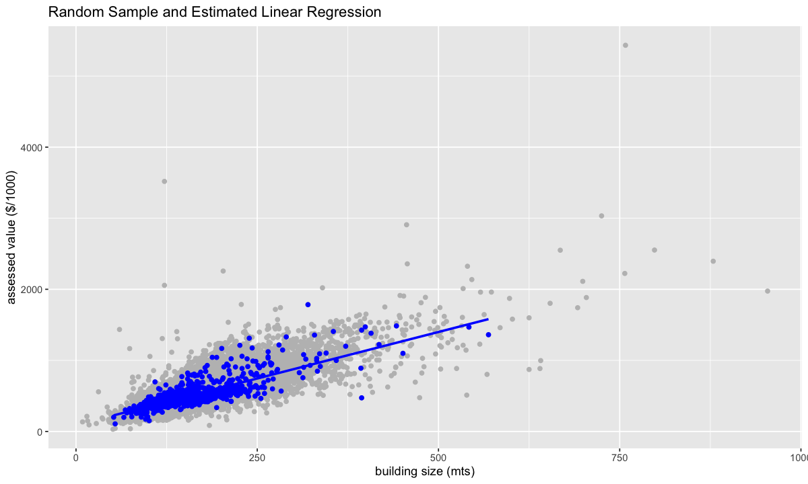
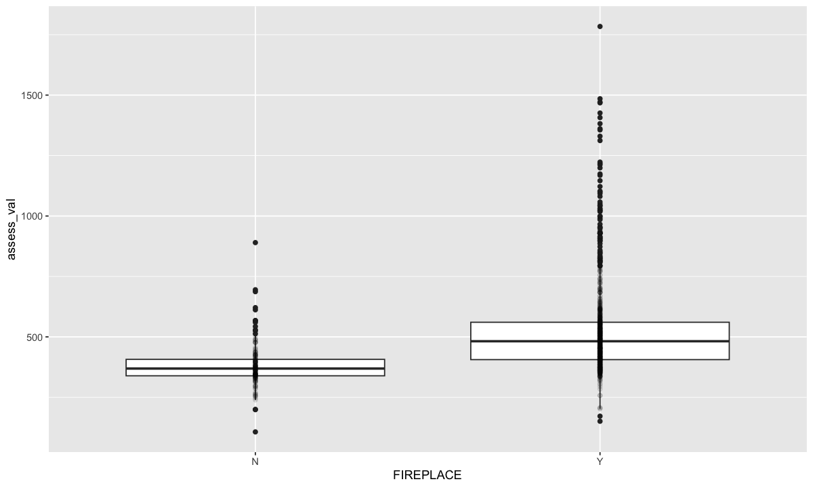
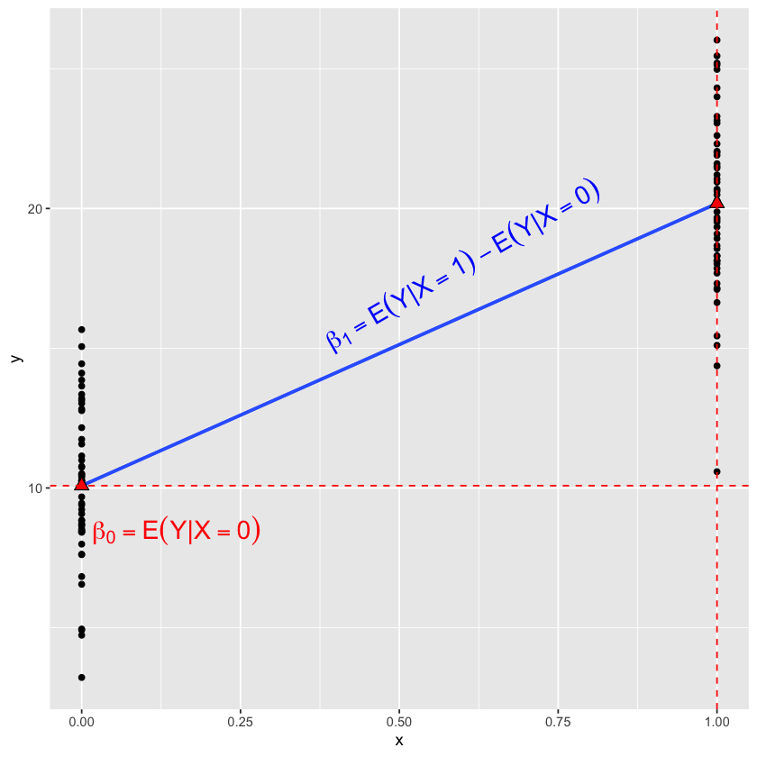

# Lecture 2: SLR with continuous or categorical covariates

### Last class ...

- LR have been widely used to explain/test/predict the relation between variables


- Given a random variable $Y$, its best predictor is its expected value $E[Y]$, which can be estimated with the average value in a sample (a.k.a sample mean)


- If we have additional information from another variable, we can *condition* and look at subgroups of the population to obtain a better predictor: $E[Y|X]$

 
- In some cases, the conditional expectation can be modelled as a linear function:

$E[Y|X_1] = \beta_0 + \beta_1 X_1$ or $Y = \beta_0 + \beta_1 X_1 + \varepsilon$, with $E[\varepsilon|X_1] = 0$


- We have used data from a county in Alberta to define the (population) linear regression


### Today


- Distinguish between a population and a sample:

    - LR coefficients *vs* LR estimated coefficients


- Estimate the regression line using a random sample


- Use LR to model the relation between the response and a continuous explanatory variable


- Use LR to model the relation between the response and a categorical explanatory variable


- Interpret results correctly given the data and estimation method used


```R
library(tidyverse)
library(repr)
options(repr.plot.width=4, repr.plot.height=4)
library(ggplot2)
library(broom)


dat <- read.csv("data/Assessment_2015.csv")
dat <- dat %>% filter(ASSESSCLAS=="Residential")  %>% 
        mutate(assess_val = ASSESSMENT / 1000)

head(dat)
```

    ── Attaching core tidyverse packages ───────────────────────────────────── tidyverse 2.0.0 ──
    ✔ dplyr     1.1.3     ✔ readr     2.1.4
    ✔ forcats   1.0.0     ✔ stringr   1.5.0
    ✔ ggplot2   3.4.3     ✔ tibble    3.2.1
    ✔ lubridate 1.9.2     ✔ tidyr     1.3.0
    ✔ purrr     1.0.2     
    ── Conflicts ─────────────────────────────────────────────────────── tidyverse_conflicts() ──
    ✖ dplyr::filter() masks stats::filter()
    ✖ dplyr::lag()    masks stats::lag()
    ℹ Use the conflicted package (<http://conflicted.r-lib.org/>) to force all conflicts to become errors


<table class="dataframe">
<caption>A data.frame: 6 × 17</caption>
<thead>
	<tr><th></th><th scope=col>the_geom</th><th scope=col>TAX_YEAR</th><th scope=col>ROLL_NUM</th><th scope=col>ADDRESS</th><th scope=col>YEAR_BUILT</th><th scope=col>ASSESSCLAS</th><th scope=col>BLDG_DESC</th><th scope=col>BLDG_METRE</th><th scope=col>BLDG_FEET</th><th scope=col>GARAGE</th><th scope=col>FIREPLACE</th><th scope=col>BASEMENT</th><th scope=col>BSMTDEVL</th><th scope=col>ASSESSMENT</th><th scope=col>LATITUDE</th><th scope=col>LONGITUDE</th><th scope=col>assess_val</th></tr>
	<tr><th></th><th scope=col>&lt;chr&gt;</th><th scope=col>&lt;int&gt;</th><th scope=col>&lt;dbl&gt;</th><th scope=col>&lt;chr&gt;</th><th scope=col>&lt;int&gt;</th><th scope=col>&lt;chr&gt;</th><th scope=col>&lt;chr&gt;</th><th scope=col>&lt;int&gt;</th><th scope=col>&lt;int&gt;</th><th scope=col>&lt;chr&gt;</th><th scope=col>&lt;chr&gt;</th><th scope=col>&lt;chr&gt;</th><th scope=col>&lt;chr&gt;</th><th scope=col>&lt;int&gt;</th><th scope=col>&lt;dbl&gt;</th><th scope=col>&lt;dbl&gt;</th><th scope=col>&lt;dbl&gt;</th></tr>
</thead>
<tbody>
	<tr><th scope=row>1</th><td>POINT (-112.87633420362904 53.41074767160115) </td><td>2015</td><td>1022705006</td><td><span style=white-space:pre-wrap>                    </span></td><td>1950</td><td>Residential</td><td><span style=white-space:pre-wrap>1 Storey &amp; Basement     </span></td><td> 83</td><td> 895</td><td>Y</td><td>Y</td><td>Y</td><td>Y</td><td>402000</td><td>53.41068</td><td>-112.8765</td><td>402</td></tr>
	<tr><th scope=row>2</th><td>POINT (-112.91925958091502 53.40590216915645) </td><td>2015</td><td>1017328004</td><td>229 51268 RNG RD 204</td><td>1983</td><td>Residential</td><td><span style=white-space:pre-wrap>1 Storey &amp; Basement     </span></td><td> 77</td><td> 831</td><td>N</td><td>Y</td><td>Y</td><td>N</td><td>292000</td><td>53.40588</td><td>-112.9196</td><td>292</td></tr>
	<tr><th scope=row>3</th><td>POINT (-112.86295897279041 53.447144538217024)</td><td>2015</td><td>1034103000</td><td>                    </td><td>1981</td><td>Residential</td><td>Split Entry             </td><td>161</td><td>1731</td><td>N</td><td>Y</td><td>Y</td><td>Y</td><td>518000</td><td>53.44727</td><td>-112.8631</td><td>518</td></tr>
	<tr><th scope=row>4</th><td>POINT (-112.91933857223259 53.405754605523676)</td><td>2015</td><td>1017329002</td><td>231 51268 RNG RD 204</td><td>1967</td><td>Residential</td><td>1 Storey Basementless   </td><td> 56</td><td> 600</td><td>Y</td><td>Y</td><td>N</td><td>N</td><td>197000</td><td>53.40574</td><td>-112.9197</td><td>197</td></tr>
	<tr><th scope=row>5</th><td>POINT (-112.9194226653068 53.40559810142708)  </td><td>2015</td><td>1017330000</td><td>233 51268 RNG RD 204</td><td>1968</td><td>Residential</td><td>1 1/2 Sty. Slab on Grade</td><td> 52</td><td> 560</td><td>N</td><td>Y</td><td>N</td><td>N</td><td>181000</td><td>53.40559</td><td>-112.9197</td><td>181</td></tr>
	<tr><th scope=row>6</th><td>POINT (-112.91921628521787 53.40720932431589) </td><td>2015</td><td>1017319003</td><td>205 51268 RNG RD 204</td><td>1962</td><td>Residential</td><td>1 1/2 Storey &amp; Basement </td><td> 95</td><td>1021</td><td>Y</td><td>Y</td><td>N</td><td>N</td><td>302000</td><td>53.40744</td><td>-112.9194</td><td>302</td></tr>
</tbody>
</table>


# 1. Population vs. Sample

#### The population


#### A random house


#### A random sample

Let ${(X_{i1},Y_i): i = 1, \ldots , n}$ be a <font color="red">random sample</font> of size $n$ from the population

Then, $Y_i = \beta_0 + \beta_1 X_{i1} + \varepsilon_i, \; E[\varepsilon_i|X_{i1}] = E[\varepsilon_i] = 0$


For example, $Y_1, Y_2, \ldots, Y_n$, $X_{11}, X_{21}, \ldots, X_{n1}$


- we made this assumption for any pair of random variables from our population!
- note the use of the subscript $i$ to denote the $i$th experimental unit in our sample:

    - the $i$th house in our dataset
    - the $i$th patient in a medical study
    - the $i$th customer in an economics study


- The first subscript is part of the name of the explanatory variable. If you find that confusing, use another name. For example, $\text{size}_1$, $\text{size}_2$, $\ldots$, $\text{size}_n$; or $X_1, X_2, \ldots, X_n$

- Note: subscripts can be written in a different order.

#### The population parameters $\beta_0$ and $\beta_1$ are usually *unknown*!  We use a random sample to *estimate* the regression line.


```R
set.seed(561)

dat_s <- sample_n(dat, 1000, replace = FALSE)
```

# 2. Using R to estimate a SLR with continuous variables


```R
lm_s <- lm(assess_val~BLDG_METRE,data=dat_s)
tidy(lm_s)%>%mutate_if(is.numeric, round, 3)
```


<table class="dataframe">
<caption>A tibble: 2 × 5</caption>
<thead>
	<tr><th scope=col>term</th><th scope=col>estimate</th><th scope=col>std.error</th><th scope=col>statistic</th><th scope=col>p.value</th></tr>
	<tr><th scope=col>&lt;chr&gt;</th><th scope=col>&lt;dbl&gt;</th><th scope=col>&lt;dbl&gt;</th><th scope=col>&lt;dbl&gt;</th><th scope=col>&lt;dbl&gt;</th></tr>
</thead>
<tbody>
	<tr><td>(Intercept)</td><td>90.769</td><td>9.793</td><td> 9.268</td><td>0</td></tr>
	<tr><td>BLDG_METRE </td><td> 2.618</td><td>0.059</td><td>44.514</td><td>0</td></tr>
</tbody>
</table>


The formula in `lm` has the response variable before the `~` and the predictors after. In this case we have only one predictor (`BLDG_METRE`). 

> `lm(assess_val~.,data=dat_s)` uses all variables in the dataset, except the response, as predictors (not appropriate in our example) 

## 2.1 The estimated regression line


```R
plot_slr <- dat %>% ggplot(aes(BLDG_METRE, assess_val)) + 
  geom_point(color = "grey") +
  xlab("building size (mts)") + 
  ylab("assessed value ($/1000)") +
  geom_point(data = dat_s, aes(BLDG_METRE, assess_val), color = "blue") +
  geom_smooth(method = lm, se = FALSE, color = "blue", data=dat_s) +
  ggtitle("Random Sample and Estimated Linear Regression")

plot_slr
```

    `geom_smooth()` using formula = 'y ~ x'


    

    


## 2.2 The estimated slope

The estimated slope: $\hat{\beta}_1=2.6$ measures the relationship between the assessed value and the size of a property

> **Note**: we use a "hat" over the coefficient to distinguish the estimator from the true coefficient


**Question:**

Which of the following is the correct interpretation of $\hat{\beta}_1$?

- **A**. An increase of 1 metre in size *is associated* with an expected increase of $2618 in assessed value.


- **B**. *The effect* of 1 meter increase in the size of a property is a $2618 increase in the assessed value 


- **C**. A 1 meter increase in the size of a property *caused* a $2618 increase in the assessed value 


- **D**. Holding the all factors in $\varepsilon$ fixed, the expected  *effect* of 1 meter increase in the size of a property is a $2618 increase in the assessed value 

<font color="red"> Important:</font> 
We don't know if the change in size *caused* the change in value and we can't isolate the *effect* of size (*holding other factors fixed*) from observational data 

#### A quick mathematical note about the slope

It can be proved mathematically that


$$\hat{\beta}_1=\frac{r_{X_1Y}s_Y}{s_{X_1}}=\frac{\sum_{i=1}^n(X_{i1}-\bar{X_1})(Y_i-\bar{Y})}{\sum_{i=1}^n(X_{i1}-\bar{X}_1)^2}$$


This is the sample version of the population parameter $\beta_1 = \rho \frac{\sigma_Y}{\sigma_{X_1}}$, where $\rho = cor(X_1,Y)$ and $\sigma$ are standard deviations.

## 2.3 The estimated intercept

The estimated intercept: $\hat{\beta}_0=90.8$ measures the expected assessed value (divided by $1000) for a property of size 0 mts. 

- We are not usually interested in this parameter


- We can't even think of it as the value of the land, it's really an interpolated value of our model


- Note that if the predictor is centered, $X_{i1}-\bar{X}_1$, then the intercept represents the value of a property of average size.


- However, it is important to include an intercept in the LR! 

    - a modified analysis is needed otherwise 


####  Important: many statistical properties do not hold for models without an intercept! 

We'll soon look at a real example that runs into this problem...

Mathematically: $$\hat{\beta}_0=\bar{Y} - \hat{\beta}_1 \bar{X_1}$$

- We use a "bar" to denote the mean (sample average) of the variable.

This is also the sample version of the population parameter $\beta_0 = E[Y] - \beta_1 E[X_1]$

**Practice**

1) add a variable called `age` to the data that measures the age of the house in 2015 when the data was collected

2) fit a LR of the assessement value against `age` to study the association between these variable

3) interpret the estimated coefficients

# 3. SLR with categorical predictors

We mentioned before amenities of the house may be an important predictor. In DSC_552: is the assessed value the same for houses with and without a fireplace?

   - You have used *t*-test, permutation test, or bootstrapping test to answer this kind of question
   

<font color="red"> Can we use a categorical variables as explanatory variables? </font>

Is `fireplace` an imporant feature of a house?

> Can we use a LR to answer this question? Yes, but why...


```R
options(repr.plot.width=10, repr.plot.height=6)

fireplace_plot <- dat_s %>% ggplot(aes(FIREPLACE, assess_val)) + 
                                geom_boxplot() + 
                                geom_point(alpha=1/10)

fireplace_plot 
```


    

    


> Note that it doesn't make sense to think of a line going through this plot! 

- the x-axis is not numeric! 
   
- you can replace (N,Y) by (0,1) in the x-axis to make it numeric (that is the trick to compute the coefficients!). That allows us to have a visual representation that may help you to understand and interpret results. 
- *However*, note that the input variable does *not* take *any value other than 0 and 1*. There's no interpretation for values in between or outside 0 and 1.
 

The levels are not even ordered:

- `FIREPLACE` : Y or N

- even if you create a dummy variable with values 0 and 1, the choice of the reference (value 0) is yours and not fixed!
   
<font color="red"> We can still use this variable in a LR, but where's the line now? </font>

> There is no line, there's a linear model

**In DSCI 552:**


```R
t.test(assess_val~FIREPLACE,dat_s,var.equal=T)
```


    
    	Two Sample t-test
    
    data:  assess_val by FIREPLACE
    t = -9.8353, df = 998, p-value < 2.2e-16
    alternative hypothesis: true difference in means is not equal to 0
    95 percent confidence interval:
     -173.2176 -115.5937
    sample estimates:
    mean in group N mean in group Y 
           380.9784        525.3840 


**In DSCI 561**


```R
lm_F <- lm(assess_val~FIREPLACE,dat_s)
tidy(lm_F)
```


<table>
<caption>A tibble: 2 × 5</caption>
<thead>
	<tr><th scope=col>term</th><th scope=col>estimate</th><th scope=col>std.error</th><th scope=col>statistic</th><th scope=col>p.value</th></tr>
	<tr><th scope=col>&lt;chr&gt;</th><th scope=col>&lt;dbl&gt;</th><th scope=col>&lt;dbl&gt;</th><th scope=col>&lt;dbl&gt;</th><th scope=col>&lt;dbl&gt;</th></tr>
</thead>
<tbody>
	<tr><td>(Intercept)</td><td>380.9784</td><td>13.25489</td><td>28.742479</td><td>7.465131e-133</td></tr>
	<tr><td>FIREPLACEY </td><td>144.4057</td><td>14.68241</td><td> 9.835285</td><td> 7.518641e-22</td></tr>
</tbody>
</table>


> Note: we can reproduce the results of a *t*-test using `lm`

## 3.1 The conditional expectation:

- the best predictor of houses with a fireplace: $E[Y|\text{FIREPLACE = Y}] = \mu_1$


- the best predictor of houses without fireplace: $E[Y|\text{FIREPLACE = N}] = \mu_0$


- and a two-sample *t*-test tests the difference between group means!!

$$H_0:  \mu_1 = \mu_0, \; \text{or equivalently} \; H_0:  \mu_1 - \mu_0 = 0$$


<font color="red"> How can we build a LM with these parameters ? </font> 

## 3.2 Categorical variables in LR: dummy variable

The variable `FIREPLACE` is not numeric, so we can't include it as is in a mathematical formula

We need an auxiliary variable: a **dummy** variable!


#### The dummy variable:

 $$X_2 = \left\{ \begin{array}{ll}
         1 & \text{if FIREPLACE = Y};\\
         0 & \text{if FIREPLACE = N}\end{array} \right.$$
         
(omitting the subscript $i$ for simplicity)

<font color="red">This auxiliary variable is a numeric variable, so we can include it in a LR.</font> 

## 3.3 A LR with dummy variables

#### $$E[Y|X_2]=\beta_0 + \beta_2 X_2$$ 

- if FIREPLACE = N: $E[Y|X_2=0]=\beta_0$

- if FIREPLACE = Y $E[Y|X_2 = 1]=\beta_0 + \beta_2$

Then

$$\beta_2 = E[Y|X_2=1]-E[Y|X_2=0]=\mu_1 - \mu_0$$ 


<font color="red"> $H_0: \beta_2=0$ is the same as null hypothesis from the two-sample $t$-test!</font> 

Note: The intercept of this line is not the same as the one of the other line, just the same name


```R
set.seed(561)
library(ggplot2)

x = c(rep(0,50), rep(1, 50))
y = c(rnorm(50, 10, 3), rnorm(50, 20, 3))

dat = data.frame(cbind(x,y))

plot1 <- ggplot(data=dat, aes(x=x, y=y))+
          geom_point() + 
          geom_smooth(method=lm, se=FALSE)

plot2 <- plot1 + geom_smooth(method=lm, se=FALSE)+
            stat_summary(geom = "point",fun = "mean", col = "black",
               size = 3, shape = 24, fill = "red")+ 
            geom_hline(yintercept=mean(y[1:50]), linetype="dashed", color = "red")+
            geom_vline(xintercept=1, linetype="dashed", color = "red")+ 
            annotate("text", x = 0.15, y = 8.5, parse = TRUE,
            label = "beta[0] == E(Y*'|'*X==0)",col="red", size=6)+
            annotate("text", x = 0.6, y = 18, parse = TRUE,
            label = "beta[1] == E(Y*'|'*X==1)-E(Y*'|'*X==0)",col="blue", size=6, angle = 30)

plot2
```

    `geom_smooth()` using formula = 'y ~ x'
    `geom_smooth()` using formula = 'y ~ x'


    

    


- In R: the `lm` function does all the work for you *if* you indicate which variables are categorical!!

- It is important to set categorical variables as "factors"

- You can choose your reference group in R (check the variable created by `lm` with `model.matrix()`).


```R
lm_fire <- lm(assess_val~FIREPLACE, dat_s)
model.matrix(lm_fire)  %>% head()
```


<table>
<caption>A matrix: 6 × 2 of type dbl</caption>
<thead>
	<tr><th></th><th scope=col>(Intercept)</th><th scope=col>FIREPLACEY</th></tr>
</thead>
<tbody>
	<tr><th scope=row>1</th><td>1</td><td>1</td></tr>
	<tr><th scope=row>2</th><td>1</td><td>1</td></tr>
	<tr><th scope=row>3</th><td>1</td><td>0</td></tr>
	<tr><th scope=row>4</th><td>1</td><td>0</td></tr>
	<tr><th scope=row>5</th><td>1</td><td>1</td></tr>
	<tr><th scope=row>6</th><td>1</td><td>1</td></tr>
</tbody>
</table>


```R
tidy(lm(assess_val~FIREPLACE, dat_s))
```


<table>
<caption>A tibble: 2 × 5</caption>
<thead>
	<tr><th scope=col>term</th><th scope=col>estimate</th><th scope=col>std.error</th><th scope=col>statistic</th><th scope=col>p.value</th></tr>
	<tr><th scope=col>&lt;chr&gt;</th><th scope=col>&lt;dbl&gt;</th><th scope=col>&lt;dbl&gt;</th><th scope=col>&lt;dbl&gt;</th><th scope=col>&lt;dbl&gt;</th></tr>
</thead>
<tbody>
	<tr><td>(Intercept)</td><td>380.9784</td><td>13.25489</td><td>28.742479</td><td>7.465131e-133</td></tr>
	<tr><td>FIREPLACEY </td><td>144.4057</td><td>14.68241</td><td> 9.835285</td><td> 7.518641e-22</td></tr>
</tbody>
</table>


## 3.4 The estimated coefficients

#### The estimated *intercept*:

$\hat{\beta}_0=380.98$, is the average assessed value (divided by $1000) for properties without a fireplace.

> It is the sample version of the conditional expectation (mean of the reference group)

#### The estimated *slope*:

$\hat{\beta}_2=144.41$ , is the difference (divided by $1000) of the two sample averages.

> It is the sample version of the difference of the conditional expectations (or group means)


#### **In-class Exercise:**

1) fit a LR of the assessment value against the variable `GARAGE` to study the association between these variables

2) interpret the estimated coefficients


```R
lm_G <- lm(assess_val~GARAGE,dat_s)
tidy(lm_G)
```


<table class="dataframe">
<caption>A tibble: 2 × 5</caption>
<thead>
	<tr><th scope=col>term</th><th scope=col>estimate</th><th scope=col>std.error</th><th scope=col>statistic</th><th scope=col>p.value</th></tr>
	<tr><th scope=col>&lt;chr&gt;</th><th scope=col>&lt;dbl&gt;</th><th scope=col>&lt;dbl&gt;</th><th scope=col>&lt;dbl&gt;</th><th scope=col>&lt;dbl&gt;</th></tr>
</thead>
<tbody>
	<tr><td>(Intercept)</td><td>355.3562</td><td>21.59174</td><td>16.457971</td><td>4.987573e-54</td></tr>
	<tr><td>GARAGEY    </td><td>154.5985</td><td>22.42579</td><td> 6.893784</td><td>9.620718e-12</td></tr>
</tbody>
</table>


