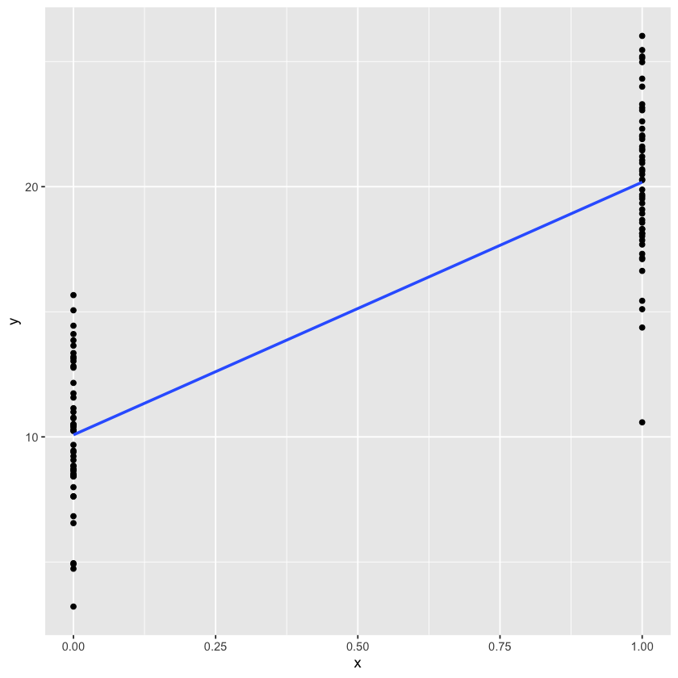
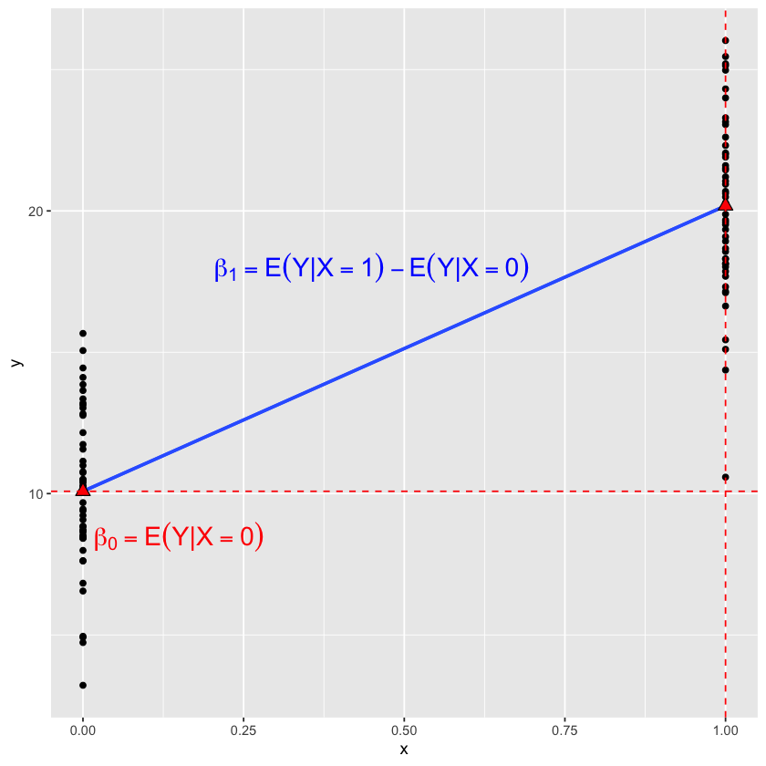
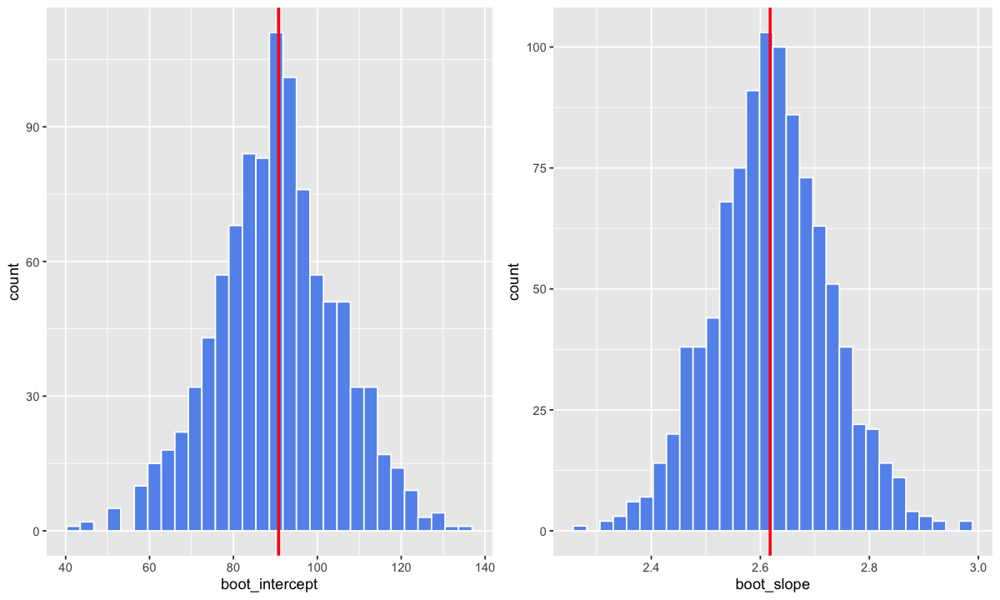
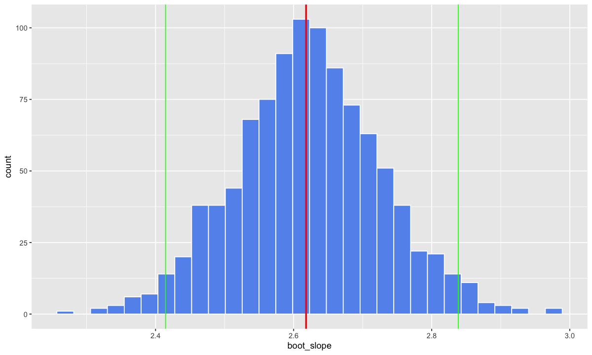
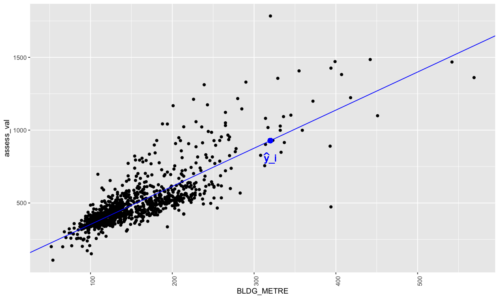
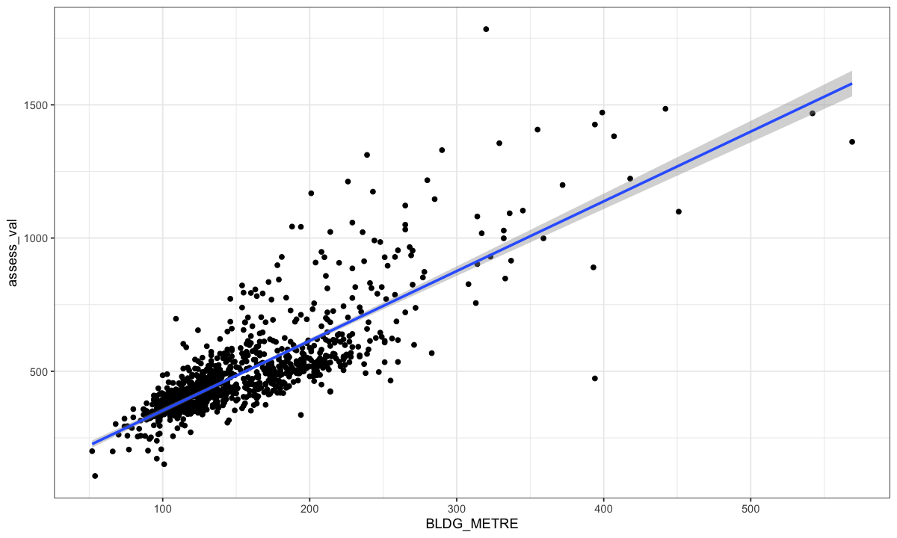
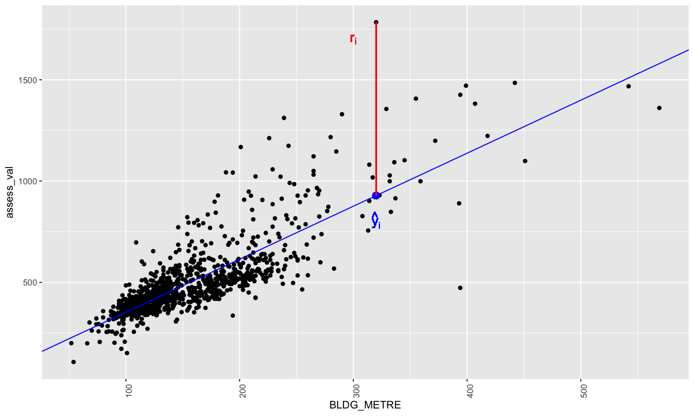

# Lecture 3: estimation, inference and prediction in SLR

### Review Question

For a SLR with a binary categorical predictor variable, what equations are the slope and intercept given by in terms of group means?

A. $\beta_0=E[Y|X=0]$; $\beta_1=E[Y|X=1]$

B. $\beta_0=E[Y|X=1]$; $\beta_1=E[Y|X=0]$

C. $\beta_0=E[Y|X=0]$; $\beta_1=E[Y|X=0]+E[Y|X=1]$

D. $\beta_0=E[Y|X=0]$; $\beta_1=E[Y|X=1]-E[Y|X=0]$


```R
set.seed(561)
library(ggplot2)

x = c(rep(0,50), rep(1, 50))
y = c(rnorm(50, 10, 3), rnorm(50, 20, 3))

dat = data.frame(cbind(x,y))

plot1 <- ggplot(data=dat, aes(x=x, y=y))+
          geom_point() + 
          geom_smooth(method=lm, se=FALSE)

```


```R
plot1 
```

    `geom_smooth()` using formula = 'y ~ x'


    

    


```R
plot2 <- plot1 + geom_smooth(method=lm, se=FALSE)+
            stat_summary(geom = "point",fun = "mean", col = "black",
               size = 3, shape = 24, fill = "red")+ 
            geom_hline(yintercept=mean(y[1:50]), linetype="dashed", color = "red")+
            geom_vline(xintercept=1, linetype="dashed", color = "red")+ 
            annotate("text", x = 0.15, y = 8.5, parse = TRUE,
            label = "beta[0] == E(Y*'|'*X==0)",col="red", size=6)+
            annotate("text", x = 0.45, y = 18, parse = TRUE,
            label = "beta[1] == E(Y*'|'*X==1)-E(Y*'|'*X==0)",col="blue", size=6)
```


```R
plot2
```

    `geom_smooth()` using formula = 'y ~ x'
    `geom_smooth()` using formula = 'y ~ x'


    

    


### Lecture 3 Learning Objectives

- Write a computer script to estimate and test regression coefficients with different approaches
- Understand the tidy table
- Recognize and calculate uncertainty of the estimation
- Choose the approach to obtain or approximate the sampling distribution
- Define and calculate residuals and predictions from the estimated SLR
- Identify hypotheses tested by the `lm` function in R
- Write a computer script to test hypotheses about the regression coefficients
- Interpret the results of inference (CI and tests) correctly given the data and method used

# 1. Simple linear regression


Let $(X_1, Y_1), (X_2,Y_2), \ldots, (X_n,Y_n)$ be a random sample of size $n$, where $X_i$ is the explanatory variable (e.g., size) and $Y_i$ is the response (e.g., assessed values). 

We can model the response we want to predict with a simple linear regression: 


$$Y_i =  \beta_0 + \beta_1 X_i + \varepsilon_i$$


> the subscript $i$ indicates the $i$th observation.


## 1.1 Notation

We usually use 

- capital letters for the random variable: for example the response $Y_i$ 


- lowercase letters for their observed value in the sample: for example $x_i$ is 320 for a house of 320 mts (we measured the house and have its size recorded)
    - I'm not going to make this distinction unless needed


- greek letters for model parameters: for example intercept and slope

> for simplicity the subscript $1$ is drsopped from the name of the explanatory variable


```R
library(tidyverse)
library(repr)
options(repr.plot.width=7, repr.plot.height=4)
library(ggplot2)
library(broom)
library(gridExtra)
library(latex2exp)

dat <- read.csv("data/Assessment_2015.csv")
dat <- dat %>% filter(ASSESSCLAS=="Residential")  %>% 
        mutate(assess_val = ASSESSMENT / 1000)

# Our sample
set.seed(561)
dat_s <- sample_n(dat, 1000, replace = FALSE)
```

    ── Attaching core tidyverse packages ──────────────────────── tidyverse 2.0.0 ──
    ✔ dplyr     1.1.4     ✔ readr     2.1.5
    ✔ forcats   1.0.0     ✔ stringr   1.5.1
    ✔ lubridate 1.9.3     ✔ tibble    3.2.1
    ✔ purrr     1.0.2     ✔ tidyr     1.3.1
    ── Conflicts ────────────────────────────────────────── tidyverse_conflicts() ──
    ✖ dplyr::filter() masks stats::filter()
    ✖ dplyr::lag()    masks stats::lag()
    ℹ Use the conflicted package (<http://conflicted.r-lib.org/>) to force all conflicts to become errors
    
    Attaching package: ‘gridExtra’
    
    
    The following object is masked from ‘package:dplyr’:
    
        combine
    
    


## 1.2 Estimators of regression coefficients

We used the `lm` function in R to estimate a simple linear regression to model `assess_val` and `BLDG_METRE` from a random sample

> Note: `lm` estimates the regression coefficients using a method called "least squares". We'll later see the benefits of this estimator. 


```R
lm_s <- lm(assess_val~BLDG_METRE,data=dat_s)
round(coef(lm_s),2)

dat_s  %>% summarise(mean_val = mean(assess_val)) %>% 
        round(2)
```


<style>
.dl-inline {width: auto; margin:0; padding: 0}
.dl-inline>dt, .dl-inline>dd {float: none; width: auto; display: inline-block}
.dl-inline>dt::after {content: ":\0020"; padding-right: .5ex}
.dl-inline>dt:not(:first-of-type) {padding-left: .5ex}
</style><dl class=dl-inline><dt>(Intercept)</dt><dd>90.77</dd><dt>BLDG_METRE</dt><dd>2.62</dd></dl>


<table class="dataframe">
<caption>A data.frame: 1 × 1</caption>
<thead>
	<tr><th scope=col>mean_val</th></tr>
	<tr><th scope=col>&lt;dbl&gt;</th></tr>
</thead>
<tbody>
	<tr><td>498.67</td></tr>
</tbody>
</table>


#### 3 important different concepts:  

| **Course** | **Population Parameter** | **Estimator** | **Estimate** |
| -------------------------------| ------------------------------- | ------------------------------- | ----------------------- |
|  | unknown quantity| function of the random sample | real number computed with data |
| DSCI 552 | mean $= \mu=E[Y]$| sample mean = $\bar{Y}$| 498.67 |
| DSCI 561 | slope = $\beta_1$| estimator of the slope = $\hat{\beta}_1 = \frac{\sum_{i=1}^n(X_i-\bar{X})(Y_i-\bar{Y})}{\sum_{i=1}^n(X_i-\bar{X})^2}$ | 2.62 |

# 2. Uncertainty in the estimation 

We can think that the *estimates* are a (good) guess about the population parameters based on our data. However,  the values of the estimates depend on the random sample used to compute them:

> **Important**: different samples yield different estimates!

Today we will focus on measuring the uncertainty of our estimates and making inference about the population coefficients

## 2.1 The tidy table 

We can use the function `tidy` to see the estimates and the results of hypotheses tests


```R
lm_s <- lm(assess_val~BLDG_METRE,data=dat_s)
coef_table <- tidy(lm_s)%>%mutate_if(is.numeric, round, 3)
```


```R
coef_table
```


<table class="dataframe">
<caption>A tibble: 2 × 5</caption>
<thead>
	<tr><th scope=col>term</th><th scope=col>estimate</th><th scope=col>std.error</th><th scope=col>statistic</th><th scope=col>p.value</th></tr>
	<tr><th scope=col>&lt;chr&gt;</th><th scope=col>&lt;dbl&gt;</th><th scope=col>&lt;dbl&gt;</th><th scope=col>&lt;dbl&gt;</th><th scope=col>&lt;dbl&gt;</th></tr>
</thead>
<tbody>
	<tr><td>(Intercept)</td><td>90.769</td><td>9.793</td><td> 9.268</td><td>0</td></tr>
	<tr><td>BLDG_METRE </td><td> 2.618</td><td>0.059</td><td>44.514</td><td>0</td></tr>
</tbody>
</table>


   - The first column has the names of the coefficients 
   
   - The second column of the table shows the *estimates*: values of the *estimated* coefficients of the regression line (see lect02 for interpretations)
   
   - The last 3 columns has important quantities to assess uncertainty and test hypotheses about the coefficients

## 2.2 The standard errors

Our estimates are based on (a realization of) a random sample!

<font color="red"> Question: Would we obtain very different estimates from a different sample? </font> 


```R
sample_est <- tidy(lm_s)  %>% select(estimate)  %>% 
                            round(3)
sample_est
```


<table class="dataframe">
<caption>A tibble: 2 × 1</caption>
<thead>
	<tr><th scope=col>estimate</th></tr>
	<tr><th scope=col>&lt;dbl&gt;</th></tr>
</thead>
<tbody>
	<tr><td>90.769</td></tr>
	<tr><td> 2.618</td></tr>
</tbody>
</table>


Let's take another sample and obtain new estimates:  

**Important**: In practice, we will rarely take multiple samples!

> **NOTE**: This is NOT bootstrapping! Why?


```R
dat_s2 <- sample_n(dat, 1000, replace = FALSE)

lm_s2 <- lm(assess_val~BLDG_METRE,data=dat_s2)

sample_2 <- tidy(lm_s2)  %>% select(estimate)  %>% 
                            round(3)
sample_est <- cbind(sample_est, sample_2)
sample_est
```


<table class="dataframe">
<caption>A data.frame: 2 × 2</caption>
<thead>
	<tr><th scope=col>estimate</th><th scope=col>estimate</th></tr>
	<tr><th scope=col>&lt;dbl&gt;</th><th scope=col>&lt;dbl&gt;</th></tr>
</thead>
<tbody>
	<tr><td>90.769</td><td>87.196</td></tr>
	<tr><td> 2.618</td><td> 2.628</td></tr>
</tbody>
</table>


and another sample ...


```R
dat_s3 <- sample_n(dat, 1000, replace = FALSE)

lm_s3 <- lm(assess_val~BLDG_METRE,data=dat_s3)

sample_3 <- tidy(lm_s3)  %>% select(estimate)  %>% 
                            round(3)
sample_est <- cbind(sample_est, sample_3)
sample_est
```


<table class="dataframe">
<caption>A data.frame: 2 × 3</caption>
<thead>
	<tr><th scope=col>estimate</th><th scope=col>estimate</th><th scope=col>estimate</th></tr>
	<tr><th scope=col>&lt;dbl&gt;</th><th scope=col>&lt;dbl&gt;</th><th scope=col>&lt;dbl&gt;</th></tr>
</thead>
<tbody>
	<tr><td>90.769</td><td>87.196</td><td>142.653</td></tr>
	<tr><td> 2.618</td><td> 2.628</td><td>  2.267</td></tr>
</tbody>
</table>


As expected, the estimated coefficients are different! But how different? 

> The **standard error** measures this variation!

The variation of these estimates from *sample to sample* is measured by their standard deviation, which has a special name: *the standard error* (SE)

> But in practice, how can we compute the standard error if we have only 1 sample? 


In practice, we have different ways to measure the sample-to-sample variation of the estimated coefficients:

**(i)**. take multiple samples from the population and compute multiple estimates as we did above, then compute their SE (but this is not a realistic option). 

**(ii)**. use a theoretical result (this is what `lm` does)

**(iii)**. use bootstrapping as you did in DSCI 552 for other quantities! 

> Note: In Regression there are many ways of bootstrapping. In 561, we'll bootstrap from the original sample.

#### Standard error in `lm`

The SE of each coefficient are reported in the 3rd column of the tidy table:

> We will see later how `lm` computes these standard errors


```R
coef_table

summary(lm_s)
```


<table class="dataframe">
<caption>A tibble: 2 × 5</caption>
<thead>
	<tr><th scope=col>term</th><th scope=col>estimate</th><th scope=col>std.error</th><th scope=col>statistic</th><th scope=col>p.value</th></tr>
	<tr><th scope=col>&lt;chr&gt;</th><th scope=col>&lt;dbl&gt;</th><th scope=col>&lt;dbl&gt;</th><th scope=col>&lt;dbl&gt;</th><th scope=col>&lt;dbl&gt;</th></tr>
</thead>
<tbody>
	<tr><td>(Intercept)</td><td>90.769</td><td>9.793</td><td> 9.268</td><td>0</td></tr>
	<tr><td>BLDG_METRE </td><td> 2.618</td><td>0.059</td><td>44.514</td><td>0</td></tr>
</tbody>
</table>


    
    Call:
    lm(formula = assess_val ~ BLDG_METRE, data = dat_s)
    
    Residuals:
        Min      1Q  Median      3Q     Max 
    -649.08  -61.17   -9.55   38.08  855.62 
    
    Coefficients:
                Estimate Std. Error t value Pr(>|t|)    
    (Intercept)  90.7687     9.7935   9.268   <2e-16 ***
    BLDG_METRE    2.6176     0.0588  44.514   <2e-16 ***
    ---
    Signif. codes:  0 ‘***’ 0.001 ‘**’ 0.01 ‘*’ 0.05 ‘.’ 0.1 ‘ ’ 1
    
    Residual standard error: 109.3 on 998 degrees of freedom
    Multiple R-squared:  0.665,	Adjusted R-squared:  0.6647 
    F-statistic:  1981 on 1 and 998 DF,  p-value: < 2.2e-16


#### Bootstrapping

The term **bootstrapping** originates from the phrase "to pull oneself up by one's bootstraps", which refers to completing a seemingly impossible task with no external help. 

In Statistics, bootstrapping refers to <font color="blue">sampling from our original sample</font> **with replacement** (also called **resampling with replacement**) to generate a **many estimates** and measure the sample-to-sample variation. 


>  **Important**: Sampling **with replacement** means that each time we choose an observation from the sample, we return it before randomly selecting another. Resampling with replacement is required to get samples of equal size to the original sample to approximate the sampling variation.

The idea is to use the original sample as an *estimate* of the unknown population. The single sample acts as the "bootstraps" that we can use to "pull ourselves up" and estimate the SE.

#### Again, note that we are sampling from the sample, not from the population!


```R
set.seed(0561)

B = 1000

lm_boot <- replicate(B, {
  sample_n(dat_s, size = nrow(dat_s), replace = TRUE) %>% 
    lm(assess_val~BLDG_METRE,data=.) %>% 
    .$coef 
})

lm_boot <- data.frame(boot_intercept = lm_boot[1,], boot_slope = lm_boot[2,]) 

head(lm_boot)
```


<table class="dataframe">
<caption>A data.frame: 6 × 2</caption>
<thead>
	<tr><th></th><th scope=col>boot_intercept</th><th scope=col>boot_slope</th></tr>
	<tr><th></th><th scope=col>&lt;dbl&gt;</th><th scope=col>&lt;dbl&gt;</th></tr>
</thead>
<tbody>
	<tr><th scope=row>1</th><td> 96.10288</td><td>2.564221</td></tr>
	<tr><th scope=row>2</th><td> 81.23126</td><td>2.675242</td></tr>
	<tr><th scope=row>3</th><td>104.65828</td><td>2.531112</td></tr>
	<tr><th scope=row>4</th><td> 84.15074</td><td>2.679590</td></tr>
	<tr><th scope=row>5</th><td> 92.91517</td><td>2.613855</td></tr>
	<tr><th scope=row>6</th><td> 75.28920</td><td>2.714372</td></tr>
</tbody>
</table>


*Summary of results*


```R
data.frame(coef_table %>% select(estimate),coef_table %>% select(std.error),
B_avg = lm_boot %>% summarize(intercept = mean(boot_intercept),
                               slope = mean(boot_slope)) %>% 
                     round(3)  %>% unlist(),
B_se = lm_boot %>% summarize(intercept = sd(boot_intercept),
                              slope= sd(boot_slope)) %>% 
                    round(3)  %>% unlist())
```


<table class="dataframe">
<caption>A data.frame: 2 × 4</caption>
<thead>
	<tr><th></th><th scope=col>estimate</th><th scope=col>std.error</th><th scope=col>B_avg</th><th scope=col>B_se</th></tr>
	<tr><th></th><th scope=col>&lt;dbl&gt;</th><th scope=col>&lt;dbl&gt;</th><th scope=col>&lt;dbl&gt;</th><th scope=col>&lt;dbl&gt;</th></tr>
</thead>
<tbody>
	<tr><th scope=row>intercept</th><td>90.769</td><td>9.793</td><td>90.301</td><td>14.431</td></tr>
	<tr><th scope=row>slope</th><td> 2.618</td><td>0.059</td><td> 2.621</td><td> 0.106</td></tr>
</tbody>
</table>


`lm` estimates are close to the average of the bootstrapped estimates
- this is expected since the average of the bootstrapped estimates is an estimate of the true $\beta_j$ and least square estimates are unbiased!

`lm` standard errors are not so close to those estimated by bootstrapping
- asymptotic assumptions may not be good in our case

## 2.3 The sampling distribution


$\hat \beta_0$ and $\hat \beta_1$ are estimators of the true population coefficients

> these are functions of the random sample, so they are also *random variables*!

As any other random variable, they have a distribution: the *sampling distribution*!

> We will see later in the course that in many cases we can assume that the sampling distribution is the Normal distribution  


We need the distribution of the estimator $\hat{\beta}_1$ (the sampling distribution) to compute probability statements.

> **Example**: is the estimated slope significantly different from zero? What are the chances, if there was really no association between the variables, of obtaining an estimate as large or larger than the one that we observe in our data?

<font color="blue"> How can we derive or at least approximate the sampling distributions? </font>

**(i)**. take multiple samples from the population (*not a realistic option*) 

**(ii)**. use a theoretical result (this is what `lm` does)

**(iii)**. use bootstrapping

#### (ii) Using theoretical results

Theoretical results are based on assumptions about the distribution of the error terms!


From Beyond Multiple Linear Regression (BMLR), Applied Generalized Linear Models and Multilevel Models in R, by Paul Roback and Julie Legler

From the figure in BMLR, an additional assumption was made:

<font color="blue">  ASSUMPTION 2: the conditional distribution of the error terms is Normal, and so is the conditional distribution of the response!

> This assumption is not always needed in the analysis of the regression line. However, it guarantees that the linear model is a good fit to the data.

An important consequence of this assumption is that if the conditional distribution of the error terms is Normal *then* the sampling distribution is *also* Normal!
    
> Recall: the sampling distribution is the distribution of the estimators of the regression coefficients $\hat{\beta_j}$     
    


**Important**: <font color="blue">CLT to the rescue</font>: 

If the assumption is not true but the conditional distribution of the error terms is *nice enough* (under certain conditions), **and if the sample size is large**, then the sampling distribution can be approximated by a Normal distribution! (this is an asymptotic result, large $n$ theory!)
    
`lm` uses this theoretical result to compute p-values and confidence intervals!


```R
coef_table
```


<table class="dataframe">
<caption>A tibble: 2 × 5</caption>
<thead>
	<tr><th scope=col>term</th><th scope=col>estimate</th><th scope=col>std.error</th><th scope=col>statistic</th><th scope=col>p.value</th></tr>
	<tr><th scope=col>&lt;chr&gt;</th><th scope=col>&lt;dbl&gt;</th><th scope=col>&lt;dbl&gt;</th><th scope=col>&lt;dbl&gt;</th><th scope=col>&lt;dbl&gt;</th></tr>
</thead>
<tbody>
	<tr><td>(Intercept)</td><td>90.769</td><td>9.793</td><td> 9.268</td><td>0</td></tr>
	<tr><td>BLDG_METRE </td><td> 2.618</td><td>0.059</td><td>44.514</td><td>0</td></tr>
</tbody>
</table>


- Since $\sigma^2$, the variance of the error term is unknown and estimated from the data, the distribution of the resulting statistic is a Student's $t$-distribution with $n-p$ degrees of freedom (df), where $n$ is the sample size and $p$ the number of parameters (in our case $p=2$, we will cover more on this topic next week)

#### (iii). Bootstrapping

Again: the idea is to use the original sample as an *estimate* of the unknown population. 

We generate *many* estimates and look at their distribution to approximate the *sampling distribution*


```R
#from bootstrapping
B_hist_slope <- ggplot(lm_boot, aes(x = boot_slope)) +
    geom_histogram(bins = 30, color = "white", fill = "cornflowerblue") +
    geom_vline(aes(xintercept = coef_table$estimate[2]), col = "red", linewidth = 1)

B_hist_int <- ggplot(lm_boot, aes(x = boot_intercept)) +
    geom_histogram(bins = 30, color = "white", fill = "cornflowerblue") +
    geom_vline(aes(xintercept = coef_table$estimate[1]), col = "red", linewidth = 1) 
```


```R
options(repr.plot.width=10, repr.plot.height=6)
grid.arrange(B_hist_int,B_hist_slope, ncol=2)

# It is not a coincidence that these distributions have a bell shape
```


    

    


## 2.4 Confidence Intervals

#### (ii). CI using asymptotic theory

The `lm` function uses results from asymptotic theory to construct confidence intervals

- **Mathematical result**: if $\hat{\beta}$ follows a Normal distribution and estimating the $SE(\hat{\beta})$, classical CI are computed using the $t$-distribution with $n-p$ degrees of freedom (df)


```R
tidy(lm_s, conf.int = TRUE)
```


<table class="dataframe">
<caption>A tibble: 2 × 7</caption>
<thead>
	<tr><th scope=col>term</th><th scope=col>estimate</th><th scope=col>std.error</th><th scope=col>statistic</th><th scope=col>p.value</th><th scope=col>conf.low</th><th scope=col>conf.high</th></tr>
	<tr><th scope=col>&lt;chr&gt;</th><th scope=col>&lt;dbl&gt;</th><th scope=col>&lt;dbl&gt;</th><th scope=col>&lt;dbl&gt;</th><th scope=col>&lt;dbl&gt;</th><th scope=col>&lt;dbl&gt;</th><th scope=col>&lt;dbl&gt;</th></tr>
</thead>
<tbody>
	<tr><td>(Intercept)</td><td>90.768749</td><td>9.79347555</td><td> 9.268288</td><td> 1.132776e-19</td><td>71.550582</td><td>109.98692</td></tr>
	<tr><td>BLDG_METRE </td><td> 2.617547</td><td>0.05880332</td><td>44.513599</td><td>2.897913e-239</td><td> 2.502155</td><td>  2.73294</td></tr>
</tbody>
</table>


#### (iii). CI using bootstrapping

We can also use the repeated estimates from bootstrapping to construct confidence intervals!

   > We computed bootstrap SE and a bootstrap sampling distribution!
    
Let's focus on the slope here.


There are 2 type of bootstrap CI: 

1. **Bootstrap-normal-theory CI**: Assumes that the estimator $\hat{\beta}$ follows a Normal distribution but uses the bootstrap standard error (SE$^*(\hat{\beta})$) 

$$\hat{\beta} \pm z_{\alpha/2}\text{SE}^*(\hat{\beta})$$

2. **Bootstrap-percentile CI**: Uses percentiles from the bootstrap sampling distribution 

$$(\hat{b}^*_{\alpha/2}, \hat{b}^*_{1-\alpha/2})$$

*In our example*:


```R
slope_s <- coef_table  %>% filter(term=="BLDG_METRE") %>% pull(estimate) 
slope_B <- lm_boot  %>% select(boot_slope)  %>% unlist()
(slope_s + qnorm(0.025) * sd(slope_B)) %>% round(2)
(slope_s - qnorm(0.025) * sd(slope_B)) %>% round(2)
```


2.41


2.83


The **bootstrap-normal-theory** CI is $(2.41, 2.83)$


```R
B_hist_slope + geom_vline(aes(xintercept = quantile(slope_B,0.025)),col='green')+
          geom_vline(aes(xintercept = quantile(slope_B,0.975)),col='green')              
```


    

    


```R
quantile(slope_B,0.025)  %>% round(2)
quantile(slope_B,0.975) %>% round(2)
```


<strong>2.5%:</strong> 2.41


<strong>97.5%:</strong> 2.84


The **bootstrap-percentile** confidence interval is $(2.41, 2.84)$

**Question**

Suppose we computed a 95\% confidence interval for the slope $\beta_1$ and found it to be (-0.5, 1.88). 

What does this tell us from an inferential perspective?

**A.** There is a 95% chance that the slope is between -0.5 and 1.88.

**B.** Since this interval contains 0, at the 5% signficance level we do not have sufficient evidence that $\beta_1$ is different from 0.

**C.** Since the interval barely contains 0, the slope is significant at the 5% significance level. 

# 3. Hypothesis tests for the regression coefficients

*Is the assessed value of a property related to its size??*

We can test hypotheses about the true regression coefficients! As a default, `lm` tests if the intercept and the slope are 0:

   - $H_0: \beta_0 = 0$ (null) *vs* $H_A: \beta_0 \neq 0$ (default alternative)
   
   > usually not of interest
   
   - $H_0: \beta_1 = 0$ (null) *vs* $H_A: \beta_1 \neq 0$ (default alternative)
   
   > we can use this test to answer to the question above
   


**The tidy table**


```R
tidy(lm_s) %>% mutate_if(is.numeric, round, 3)
```


<table class="dataframe">
<caption>A tibble: 2 × 5</caption>
<thead>
	<tr><th scope=col>term</th><th scope=col>estimate</th><th scope=col>std.error</th><th scope=col>statistic</th><th scope=col>p.value</th></tr>
	<tr><th scope=col>&lt;chr&gt;</th><th scope=col>&lt;dbl&gt;</th><th scope=col>&lt;dbl&gt;</th><th scope=col>&lt;dbl&gt;</th><th scope=col>&lt;dbl&gt;</th></tr>
</thead>
<tbody>
	<tr><td>(Intercept)</td><td>90.769</td><td>9.793</td><td> 9.268</td><td>0</td></tr>
	<tr><td>BLDG_METRE </td><td> 2.618</td><td>0.059</td><td>44.514</td><td>0</td></tr>
</tbody>
</table>


As you learned in DSCI_552, you can construct a test statistic as:


$$\text{test statistic} = \frac{\text{statistic-parameter}_0}{\text{standard error of the statistic}}$$

In our case, and under the null hypothesis: $$t=\frac{\hat{\beta}}{SE(\hat{\beta})}$$

and this statistic has an (asymptotic) $t$-distribution with $n-p$ degrees of freedom (df)

> "asymptotic" is an approximation achieved with large sample size


```R
statistic <- tidy(lm_s)$estimate/tidy(lm_s)$std.error
round(statistic[2],3)

tidy(lm_s)

2*pt(44.514, df=1000-2,lower.tail=FALSE)
```


44.514


<table class="dataframe">
<caption>A tibble: 2 × 5</caption>
<thead>
	<tr><th scope=col>term</th><th scope=col>estimate</th><th scope=col>std.error</th><th scope=col>statistic</th><th scope=col>p.value</th></tr>
	<tr><th scope=col>&lt;chr&gt;</th><th scope=col>&lt;dbl&gt;</th><th scope=col>&lt;dbl&gt;</th><th scope=col>&lt;dbl&gt;</th><th scope=col>&lt;dbl&gt;</th></tr>
</thead>
<tbody>
	<tr><td>(Intercept)</td><td>90.768749</td><td>9.79347555</td><td> 9.268288</td><td> 1.132776e-19</td></tr>
	<tr><td>BLDG_METRE </td><td> 2.617547</td><td>0.05880332</td><td>44.513599</td><td>2.897913e-239</td></tr>
</tbody>
</table>


2.88063098544645e-239


# 4. Prediction using the estimated regression

In the following plot, the blue dot, <font color="blue"> $\hat{y}$ </font>, is the *predicted* assessed value for a house of size 320 (on the estimated regression line) 

$$ \hat{y}_i=90.769 + 2.618 \times x_{i}$$

> Note: we put a "hat" on $y$ to indicate that it's a predicted value using the regression line 


```R
options(warn = -1)

dat_s %>% ggplot(aes(BLDG_METRE, assess_val)) + theme(axis.text.x = element_text(angle = 90))+
    geom_point()+ 
    geom_abline(intercept=coef(lm_s)[1],slope=coef(lm_s)[2], col = "blue")+
    geom_point(aes(x=320,y=predict(lm_s,data.frame(BLDG_METRE=320))), color="blue", size=3)+
    geom_text(aes(x=320,y=predict(lm_s,data.frame(BLDG_METRE=320))-120,label=TeX("\\widehat{y}_i", output = "character")), color="blue", size=5,parse = TRUE)
```


    

    


The predictor is also a *random variable* since it's a function of the estimated coefficients!

$$ \hat{y}_i=\hat{\beta}_0 + \hat{\beta}_1 \times x_{i}$$

So we can measure the uncertainty of our prediction using standard errors or even computing confidence intervals!(we'll see more about this later)


```R
y_hat <- as.data.frame(predict(lm_s, se.fit = TRUE))
head(y_hat, 3)[,1:2]
```


<table class="dataframe">
<caption>A data.frame: 3 × 2</caption>
<thead>
	<tr><th></th><th scope=col>fit</th><th scope=col>se.fit</th></tr>
	<tr><th></th><th scope=col>&lt;dbl&gt;</th><th scope=col>&lt;dbl&gt;</th></tr>
</thead>
<tbody>
	<tr><th scope=row>1</th><td>666.6292</td><td>5.116616</td></tr>
	<tr><th scope=row>2</th><td>344.6708</td><td>4.889902</td></tr>
	<tr><th scope=row>3</th><td>323.7305</td><td>5.233297</td></tr>
</tbody>
</table>


```R
dat_s %>% ggplot(aes(BLDG_METRE,assess_val)) +
  geom_point() + theme_bw() +
  geom_smooth(method = "lm", se=TRUE)
```

    `geom_smooth()` using formula = 'y ~ x'


    

    


**Question**

True or False: Suppose we estimate a SLR with a continuous response and a continuous explanatory variable. Then the values predicted with the estimated model lie on the estimated regression line. 

A. True

B. False

# 5. Prediction error: the residuals


```R
options(warn = -1)

dat_s %>% ggplot(aes(BLDG_METRE, assess_val)) + theme(axis.text.x = element_text(angle = 90))+
    geom_point()+ 
    geom_abline(intercept=coef(lm_s)[1],slope=coef(lm_s)[2], col = "blue")+
    geom_point(aes(x=320,y=predict(lm_s,data.frame(BLDG_METRE=320))), color="blue", size=3)+
    geom_text(aes(x=320,y=predict(lm_s,data.frame(BLDG_METRE=320))-120,label=TeX(r"($\hat{y}_i$)", output = "character")), color="blue", size=5,parse = TRUE)+
    geom_segment(x=320, y=predict(lm_s,data.frame(BLDG_METRE=320)),xend=320,yend=1784, color="red")+
    geom_text(aes(x=300,y=1700,label=TeX(r"($r_i$)", output = "character")), color="red", size=5,parse = TRUE)
```


    

    


The red line, <font color="red"> $r_i$ </font> represents the $i^{th}$ residual (the difference between the observed and predicted observations)

$$r_i = y_i-\hat{y}_i$$

**Note**: both the `fitted.values` and the `resid` can be obtained using the fuction `augment`


```R
head(augment(lm_s), 3)
```


<table class="dataframe">
<caption>A tibble: 3 × 8</caption>
<thead>
	<tr><th scope=col>assess_val</th><th scope=col>BLDG_METRE</th><th scope=col>.fitted</th><th scope=col>.resid</th><th scope=col>.hat</th><th scope=col>.sigma</th><th scope=col>.cooksd</th><th scope=col>.std.resid</th></tr>
	<tr><th scope=col>&lt;dbl&gt;</th><th scope=col>&lt;int&gt;</th><th scope=col>&lt;dbl&gt;</th><th scope=col>&lt;dbl&gt;</th><th scope=col>&lt;dbl&gt;</th><th scope=col>&lt;dbl&gt;</th><th scope=col>&lt;dbl&gt;</th><th scope=col>&lt;dbl&gt;</th></tr>
</thead>
<tbody>
	<tr><td>536</td><td>220</td><td>666.6292</td><td>-130.62916</td><td>0.002192155</td><td>109.2580</td><td>1.573016e-03</td><td>-1.19665635</td></tr>
	<tr><td>370</td><td> 97</td><td>344.6708</td><td>  25.32916</td><td>0.002002193</td><td>109.3335</td><td>5.399628e-05</td><td> 0.23201112</td></tr>
	<tr><td>318</td><td> 89</td><td>323.7305</td><td>  -5.73046</td><td>0.002293276</td><td>109.3363</td><td>3.167415e-06</td><td>-0.05249777</td></tr>
</tbody>
</table>


When estimating the regression equation, we minimize the sum of squared errors (SSE), defined
as

$$SSE = \sum_{i=1}^n (y_i-\hat{y_i})^2=\sum_{i=1}^n r_i^2$$


• Note that the sum of the residuals is always 0 (i.e., $\sum_{i=1}^n r_i= 0$).

**Question:**

**True or false?**

A positive residual means that we overestimated the observed data with the regression line. 

**A.** TRUE

**B.** FALSE

### In-class Exercise

Suppose we are interested in investigating the association between daily hours exercised ($x$) and hours of sleep at night ($y$) and observed participants exercising anywhere from 0-2.5 hours a day. We estimated the regression model to be $\hat{y}_i=6+1.5x_i$.

i) How many hours of sleep would you predict for a person who exercises 1.5 hours a day on average?

$$ \hat{y}_i=6+1.5\times 1.5=8.25$$

ii) An individual in the study who exercised 1.5 hours a day was found to sleep for 7.75 hours a night. What is the residual of this observation?

$$r_i=y_i-\hat{y}_i=7.75-8.25=-0.5$$

iii) Could we reliably make a prediction for a person who exercised 3 hours a day? Why or why not?

No, this is extrapolation and we do not know the behaviour of our model outside of the observed range of $x$.

### Additional Details

#### Resampling

In our case study, we can resample from the population over and over again: take a sample, obtain the regression estimates, repeat. 

This will give us an idea of the uncertainty in our estimation.

Play with `N` in the code below to understand the asymptotic approximation used by `lm`

However in practice, this is not feasible! 


```R
set.seed(5613)

B <- 1000
N <- 1000
lm_est <- replicate(B, {
  sample_n(dat, N, replace = TRUE) %>% 
    lm(assess_val~BLDG_METRE,data=.) %>% 
    .$coef 
})

lm_resamp <- data.frame(est_intercept = lm_est[1,], est_slope = lm_est[2,]) 

head(lm_resamp)
```


<table class="dataframe">
<caption>A data.frame: 6 × 2</caption>
<thead>
	<tr><th></th><th scope=col>est_intercept</th><th scope=col>est_slope</th></tr>
	<tr><th></th><th scope=col>&lt;dbl&gt;</th><th scope=col>&lt;dbl&gt;</th></tr>
</thead>
<tbody>
	<tr><th scope=row>1</th><td>129.00792</td><td>2.315975</td></tr>
	<tr><th scope=row>2</th><td> 52.63497</td><td>2.891406</td></tr>
	<tr><th scope=row>3</th><td>113.85761</td><td>2.434709</td></tr>
	<tr><th scope=row>4</th><td> 87.06021</td><td>2.601496</td></tr>
	<tr><th scope=row>5</th><td> 98.27328</td><td>2.545676</td></tr>
	<tr><th scope=row>6</th><td> 97.33844</td><td>2.579989</td></tr>
</tbody>
</table>


```R
lm_resamp  %>% summarise(se_int = sd(est_intercept), se_slope = sd(est_slope))
```


<table class="dataframe">
<caption>A data.frame: 1 × 2</caption>
<thead>
	<tr><th scope=col>se_int</th><th scope=col>se_slope</th></tr>
	<tr><th scope=col>&lt;dbl&gt;</th><th scope=col>&lt;dbl&gt;</th></tr>
</thead>
<tbody>
	<tr><td>23.35457</td><td>0.1593693</td></tr>
</tbody>
</table>


```R
tidy(lm_s)
```


<table class="dataframe">
<caption>A tibble: 2 × 5</caption>
<thead>
	<tr><th scope=col>term</th><th scope=col>estimate</th><th scope=col>std.error</th><th scope=col>statistic</th><th scope=col>p.value</th></tr>
	<tr><th scope=col>&lt;chr&gt;</th><th scope=col>&lt;dbl&gt;</th><th scope=col>&lt;dbl&gt;</th><th scope=col>&lt;dbl&gt;</th><th scope=col>&lt;dbl&gt;</th></tr>
</thead>
<tbody>
	<tr><td>(Intercept)</td><td>90.768749</td><td>9.79347555</td><td> 9.268288</td><td> 1.132776e-19</td></tr>
	<tr><td>BLDG_METRE </td><td> 2.617547</td><td>0.05880332</td><td>44.513599</td><td>2.897913e-239</td></tr>
</tbody>
</table>


