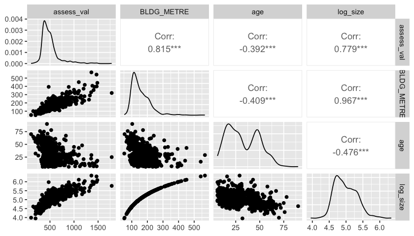
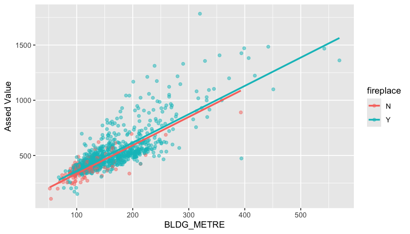
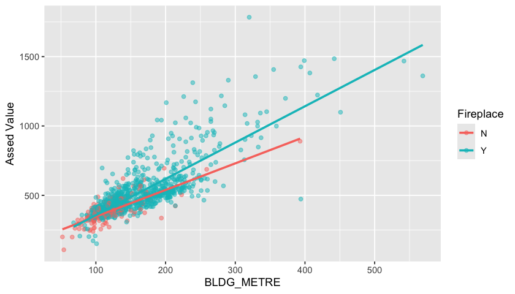

# Lecture 4: Multiple linear regression with categorical variables and interaction terms

### Last class ...

- Estimation and inference of a SLR 

- (Set and tested hypotheses of interest about the regression coefficients)
   
- Predictions using the estimated regression

### Lecture 4 Learning Objectives

- Write a computer script to estimate and test coefficients of additive and multiplicative LR models
- Interpret each estimated coefficient in the presence of other variables in the model, including interaction terms
- Define and calculate residuals and predictions from the estimated multiple linear regression (MLR)
- Identify hypotheses tested by the lm function in R
- Reflect about the methodology used by lm to test hypotheses
- Write a computer script to test hypotheses about the regression coefficients
- Interpret the results of inference (CI and tests) correctly given the data and method used

# 1. Multiple linear regression


In many applications, we observe *many* explanatory variables

For example, both the size (continuous) and the age (discrete) of a property may affect its value

$$Y_i =  \beta_0 + \beta_1 \text{size}_i + \beta_2 \text{age}_i +\varepsilon_i$$


## 1.1 Conceptual notes: population assumptions


- The conditional expectation is the best predictor of $Y$ given a set of explanatory variables $X_1, X_2, \ldots, X_p$


- The linear regression models the conditional expectation as a *linear combination* of the predictors

    - we'll focus later on the meaning of *linear* 
    
$$ E[Y|X_1, \ldots, X_p] = \beta_0 + \beta_1 X_{1} + ...  + \beta_p X_{p}$$


- If the data is jointly Normal, the conditional expectation is truly linear! Otherwise, this is just an assumption. 

*Question: Does linearity imply normality?*


*So, are we ready to predict?*

As before, we need to estimate the (population) regreesion coefficients 

 $$\beta_0, \beta_1, \text{ and } \beta_2$$


... Back to sample, data and estimation!


```R
library(tidyverse)
library(repr)
options(repr.plot.width=7, repr.plot.height=4)
library(ggplot2)
library(broom)
library(gridExtra)
library(latex2exp)
library(GGally)
library(moderndive)

dat <- read.csv("data/Assessment_2015.csv")
dat <- dat %>% filter(ASSESSCLAS=="Residential")  %>% 
        mutate(assess_val = ASSESSMENT / 1000, age=2020-YEAR_BUILT) 


# Our sample
set.seed(561)
dat_s <- sample_n(dat, 1000, replace = FALSE)
```

## 1.2 Visualizing the relation between the variables in the sample

We can start by visualizing the relation between these 3 variables (all quantitative) using pair-wise scatter plots. Take some time to reflect on the relationship between the variables.


```R
dat_s %>% select(assess_val, BLDG_METRE,age) %>% mutate(log_size = log(BLDG_METRE)) %>% 
    ggpairs()
```


    

    


We observe a linear association between size and value and a negative association between age and value. However, there's a lot of variation in value for newer houses, perhaps because they vary a lot in size

The distribution of `age` seems bimodal and a normality assumption doesn't seem reasonable here! We can transform variables to get closer to the assumed model (more about this in Regression II).

## 2. SLR vs. MLR

### SLR: one variable at a time


```R
#Size
lm_size <- lm(assess_val~BLDG_METRE,data=dat_s)
tidy(lm_size)

```


<table class="dataframe">
<caption>A tibble: 2 × 5</caption>
<thead>
	<tr><th scope=col>term</th><th scope=col>estimate</th><th scope=col>std.error</th><th scope=col>statistic</th><th scope=col>p.value</th></tr>
	<tr><th scope=col>&lt;chr&gt;</th><th scope=col>&lt;dbl&gt;</th><th scope=col>&lt;dbl&gt;</th><th scope=col>&lt;dbl&gt;</th><th scope=col>&lt;dbl&gt;</th></tr>
</thead>
<tbody>
	<tr><td>(Intercept)</td><td>90.768749</td><td>9.79347555</td><td> 9.268288</td><td> 1.132776e-19</td></tr>
	<tr><td>BLDG_METRE </td><td> 2.617547</td><td>0.05880332</td><td>44.513599</td><td>2.897913e-239</td></tr>
</tbody>
</table>


```R
#Age
lm_age <- lm(assess_val~age,data=dat_s)
tidy(lm_age)
```


<table class="dataframe">
<caption>A tibble: 2 × 5</caption>
<thead>
	<tr><th scope=col>term</th><th scope=col>estimate</th><th scope=col>std.error</th><th scope=col>statistic</th><th scope=col>p.value</th></tr>
	<tr><th scope=col>&lt;chr&gt;</th><th scope=col>&lt;dbl&gt;</th><th scope=col>&lt;dbl&gt;</th><th scope=col>&lt;dbl&gt;</th><th scope=col>&lt;dbl&gt;</th></tr>
</thead>
<tbody>
	<tr><td>(Intercept)</td><td>647.413924</td><td>12.3523539</td><td> 52.41219</td><td>7.601564e-289</td></tr>
	<tr><td>age        </td><td> -4.576485</td><td> 0.3403857</td><td>-13.44500</td><td> 5.376037e-38</td></tr>
</tbody>
</table>


### MLR: more than one predictor

Should we look at `BLDG_METRE` and `age` together? <font color="blue"> ---> YES </font>


```R
lm_size_age <- lm(assess_val~BLDG_METRE + age, data=dat_s)
tidy(lm_size_age)
```


<table class="dataframe">
<caption>A tibble: 3 × 5</caption>
<thead>
	<tr><th scope=col>term</th><th scope=col>estimate</th><th scope=col>std.error</th><th scope=col>statistic</th><th scope=col>p.value</th></tr>
	<tr><th scope=col>&lt;chr&gt;</th><th scope=col>&lt;dbl&gt;</th><th scope=col>&lt;dbl&gt;</th><th scope=col>&lt;dbl&gt;</th><th scope=col>&lt;dbl&gt;</th></tr>
</thead>
<tbody>
	<tr><td>(Intercept)</td><td>131.508644</td><td>15.1982597</td><td> 8.652875</td><td> 1.986205e-17</td></tr>
	<tr><td>BLDG_METRE </td><td>  2.526029</td><td> 0.0640819</td><td>39.418755</td><td>1.342602e-205</td></tr>
	<tr><td>age        </td><td> -0.814666</td><td> 0.2333191</td><td>-3.491639</td><td> 5.011087e-04</td></tr>
</tbody>
</table>


```R
tidy(lm_size_age)  %>% select(term,estimate)  %>% rename(MLR=estimate) %>% 
    merge(tidy(lm_size)  %>% select(term,estimate),by="term",all=T)  %>% rename(SLR_size=estimate) %>% 
    merge(tidy(lm_age)  %>% select(term,estimate),by="term",all=T)  %>% rename(SLR_age=estimate)
```


    Error in tidy(lm_size_age) %>% select(term, estimate) %>% rename(MLR = estimate) %>% : could not find function "%>%"
    Traceback:


The slope for `BLDG_METRE` remains almost the same but that of `age` is very different

> usually a sign of multicollinearity or confounding

## 3. MLR with continuous predictors

$$Y_i=\beta_0 + \beta_1 \text{size}_i+ \beta_2 \text{age}_i + \varepsilon_i$$

MLR simultaneously models the association of multiple predictors with the response.

**An important model assumption:** 

If we hold the size of the property fixed, say at 155mts:

- the relationship between the value and the age of the property is *linear*

$$Y_i=\beta_0 + \beta_1 155 + \beta_2 \text{age}_i+ \varepsilon_i$$

- the slope $\beta_2$ *does not depend* on the value held constant

(and same for holding `age` fixed)

These type of models are called ***additive models***.

**A peek at our population...**


```R
dat  %>% filter(BLDG_METRE <= 300)  %>% 
    mutate(BLDG_strata = factor(50*round(BLDG_METRE/50))) %>% 
    group_by(BLDG_strata)  %>% 
    summarize(slope=cor(assess_val,age)*sd(assess_val)/sd(age))  %>% 
    ggplot(aes(BLDG_strata,y=slope))+ geom_point()
```


    

    


In general, the slope of `age` does not depend on the value of size we hold fixed

> Note: I've created groups of houses of similar sizes to have enough points to look at the slope. At the tail, this assumption doesn't seem to hold.

## 3.1 Estimating the MLR with `lm`

`R` Code:

`lm_s <- lm(assess_val~BLDG_METRE + age,data=dat_s)`

> variables are added to the model using `+`

`lm` uses a method called least squares to estimate the coefficients from a random sample
- Least squares estimators minimizes the mean squared error (MSE) loss function

**The tidy table**


```R
tidy(lm_size_age) %>% mutate_if(is.numeric, round, 3)
```


<table class="dataframe">
<caption>A tibble: 3 × 5</caption>
<thead>
	<tr><th scope=col>term</th><th scope=col>estimate</th><th scope=col>std.error</th><th scope=col>statistic</th><th scope=col>p.value</th></tr>
	<tr><th scope=col>&lt;chr&gt;</th><th scope=col>&lt;dbl&gt;</th><th scope=col>&lt;dbl&gt;</th><th scope=col>&lt;dbl&gt;</th><th scope=col>&lt;dbl&gt;</th></tr>
</thead>
<tbody>
	<tr><td>(Intercept)</td><td>131.509</td><td>15.198</td><td> 8.653</td><td>0.000</td></tr>
	<tr><td>BLDG_METRE </td><td>  2.526</td><td> 0.064</td><td>39.419</td><td>0.000</td></tr>
	<tr><td>age        </td><td> -0.815</td><td> 0.233</td><td>-3.492</td><td>0.001</td></tr>
</tbody>
</table>


As before, we get estimates, SE of the estimators, and results of classical hypothesis tests

<font color="red">  How do we interpret these values? Which hypotheses are we testing? </font>

#### Interpretation of the estimated coefficients: 

***Two estimated slopes***: $\hat{\beta}_1 = 2.526$ and $\hat{\beta}_2 = -0.815$ 

- Holding age constant, for every additional square meter in the size of a house, we predict an increase of 2526 dollars in the assessed value.


- Holding size constant, for every additional year a house has, we predict a decrease of 815 dollars in the assessed value.
    
   > Is it reasonable to assume the that slope does not depend on the value being held constant?

## 3.2 Confidence Intervals

- CI can be constructed using bootstrapping,either to estimate the SE or the sampling distribution of any coefficient
    
- The `lm` function uses results from asymptotic theory to construct confidence intervals


```R
tidy(lm_size_age, conf.int = TRUE)
```


<table class="dataframe">
<caption>A tibble: 3 × 7</caption>
<thead>
	<tr><th scope=col>term</th><th scope=col>estimate</th><th scope=col>std.error</th><th scope=col>statistic</th><th scope=col>p.value</th><th scope=col>conf.low</th><th scope=col>conf.high</th></tr>
	<tr><th scope=col>&lt;chr&gt;</th><th scope=col>&lt;dbl&gt;</th><th scope=col>&lt;dbl&gt;</th><th scope=col>&lt;dbl&gt;</th><th scope=col>&lt;dbl&gt;</th><th scope=col>&lt;dbl&gt;</th><th scope=col>&lt;dbl&gt;</th></tr>
</thead>
<tbody>
	<tr><td>(Intercept)</td><td>131.508644</td><td>15.1982597</td><td> 8.652875</td><td> 1.986205e-17</td><td>101.684396</td><td>161.3328916</td></tr>
	<tr><td>BLDG_METRE </td><td>  2.526029</td><td> 0.0640819</td><td>39.418755</td><td>1.342602e-205</td><td>  2.400278</td><td>  2.6517796</td></tr>
	<tr><td>age        </td><td> -0.814666</td><td> 0.2333191</td><td>-3.491639</td><td> 5.011087e-04</td><td> -1.272519</td><td> -0.3568132</td></tr>
</tbody>
</table>


## 3.3 Prediction using the regression line and residuals

As before, the *predicted* assessed value is a point on the estimated hyper-plane; the *residual* is the distance to the observed value

$$ \hat{y}_i=131.51 + 2.526 \times x_{i1} - 0.815 \times x_{i2}; \; r_i=y_i-\hat{y}_i$$

They are random variables since they are functions of the estimated coefficients

> Therefore, we can estimate their standard error and CI! (Note: $\varepsilon_i \ne r_i$)


```R
augment(lm_size_age,dat_s)  %>% head(3)
```


<table class="dataframe">
<caption>A tibble: 3 × 24</caption>
<thead>
	<tr><th scope=col>the_geom</th><th scope=col>TAX_YEAR</th><th scope=col>ROLL_NUM</th><th scope=col>ADDRESS</th><th scope=col>YEAR_BUILT</th><th scope=col>ASSESSCLAS</th><th scope=col>BLDG_DESC</th><th scope=col>BLDG_METRE</th><th scope=col>BLDG_FEET</th><th scope=col>GARAGE</th><th scope=col>⋯</th><th scope=col>LATITUDE</th><th scope=col>LONGITUDE</th><th scope=col>assess_val</th><th scope=col>age</th><th scope=col>.fitted</th><th scope=col>.resid</th><th scope=col>.hat</th><th scope=col>.sigma</th><th scope=col>.cooksd</th><th scope=col>.std.resid</th></tr>
	<tr><th scope=col>&lt;chr&gt;</th><th scope=col>&lt;int&gt;</th><th scope=col>&lt;dbl&gt;</th><th scope=col>&lt;chr&gt;</th><th scope=col>&lt;int&gt;</th><th scope=col>&lt;chr&gt;</th><th scope=col>&lt;chr&gt;</th><th scope=col>&lt;int&gt;</th><th scope=col>&lt;int&gt;</th><th scope=col>&lt;chr&gt;</th><th scope=col>⋯</th><th scope=col>&lt;dbl&gt;</th><th scope=col>&lt;dbl&gt;</th><th scope=col>&lt;dbl&gt;</th><th scope=col>&lt;dbl&gt;</th><th scope=col>&lt;dbl&gt;</th><th scope=col>&lt;dbl&gt;</th><th scope=col>&lt;dbl&gt;</th><th scope=col>&lt;dbl&gt;</th><th scope=col>&lt;dbl&gt;</th><th scope=col>&lt;dbl&gt;</th></tr>
</thead>
<tbody>
	<tr><td>POINT (-113.26828568594681 53.53364376673626) </td><td>2015</td><td>-2147483648</td><td>107 GLENCOE BLVD</td><td>1990</td><td>Residential</td><td>2 Storey &amp; Basement</td><td>220</td><td>2368</td><td>Y</td><td>⋯</td><td>53.53381</td><td>-113.2685</td><td>536</td><td>30</td><td>662.7950</td><td>-126.794977</td><td>0.002294257</td><td>108.6541</td><td>1.045848e-03</td><td>-1.16808681</td></tr>
	<tr><td>POINT (-113.31770257850987 53.516152401699564)</td><td>2015</td><td>-2147483648</td><td><span style=white-space:pre-wrap>116 WILLOW ST   </span></td><td>1959</td><td>Residential</td><td>1 Storey &amp; Basement</td><td> 97</td><td>1044</td><td>Y</td><td>⋯</td><td>53.51608</td><td>-113.3180</td><td>370</td><td>61</td><td>326.8388</td><td><span style=white-space:pre-wrap>  43.161196</span></td><td>0.004210664</td><td>108.7199</td><td>2.232698e-04</td><td> 0.39800089</td></tr>
	<tr><td>POINT (-113.28777490571461 53.52360710210846) </td><td>2015</td><td>-2147483648</td><td><span style=white-space:pre-wrap>45 RAVEN DR     </span></td><td>1966</td><td>Residential</td><td>1 Storey &amp; Basement</td><td> 89</td><td> 960</td><td>N</td><td>⋯</td><td>53.52373</td><td>-113.2880</td><td>318</td><td>54</td><td>312.3332</td><td><span style=white-space:pre-wrap>   5.666764</span></td><td>0.003195445</td><td>108.7284</td><td>2.914801e-06</td><td> 0.05222813</td></tr>
</tbody>
</table>


**NOTE**: the `augment` function is very useful to add in-sample predicted values to the original dataset!

## 3.4 Hypothesis tests on the regression coefficients

**Same as before, just more coefficients!**

As a default, `lm` tests if the intercept and the slopes are 0:

   - $H_0: \beta_0 = 0$ (null) *vs* $H_1: \beta_0 \neq 0$ (default alternative)
      
   - $H_0: \beta_1 = 0$ (null) *vs* $H_1: \beta_1 \neq 0$ (default alternative)
   
   - $H_0: \beta_2 = 0$ (null) *vs* $H_1: \beta_2 \neq 0$ (default alternative)

Under the null hypothesis: 

$$t=\frac{\hat{\beta}_j}{SE(\hat{\beta}_j)}$$

> Recall from DSCI552: when the estimator is the sample mean, the $SE(\bar{X}) = \hat{\sigma}/\sqrt{n}$, other estimators have different standard errors.


**Mathematical result**: the $t$-statistic follows a $t$-distribution with $n-q$ degrees of freedom (df), where $n$ is the sample size and $q$ the number of parameters (in this case $q=3=p+1=2+1$).


```R
tidy(lm_size_age)%>%mutate_if(is.numeric, round, 3)

summary(lm_size_age)
```


<table class="dataframe">
<caption>A tibble: 3 × 5</caption>
<thead>
	<tr><th scope=col>term</th><th scope=col>estimate</th><th scope=col>std.error</th><th scope=col>statistic</th><th scope=col>p.value</th></tr>
	<tr><th scope=col>&lt;chr&gt;</th><th scope=col>&lt;dbl&gt;</th><th scope=col>&lt;dbl&gt;</th><th scope=col>&lt;dbl&gt;</th><th scope=col>&lt;dbl&gt;</th></tr>
</thead>
<tbody>
	<tr><td>(Intercept)</td><td>131.509</td><td>15.198</td><td> 8.653</td><td>0.000</td></tr>
	<tr><td>BLDG_METRE </td><td>  2.526</td><td> 0.064</td><td>39.419</td><td>0.000</td></tr>
	<tr><td>age        </td><td> -0.815</td><td> 0.233</td><td>-3.492</td><td>0.001</td></tr>
</tbody>
</table>


    
    Call:
    lm(formula = assess_val ~ BLDG_METRE + age, data = dat_s)
    
    Residuals:
        Min      1Q  Median      3Q     Max 
    -620.36  -67.04   -3.69   35.24  864.53 
    
    Coefficients:
                 Estimate Std. Error t value Pr(>|t|)    
    (Intercept) 131.50864   15.19826   8.653  < 2e-16 ***
    BLDG_METRE    2.52603    0.06408  39.419  < 2e-16 ***
    age          -0.81467    0.23332  -3.492 0.000501 ***
    ---
    Signif. codes:  0 ‘***’ 0.001 ‘**’ 0.01 ‘*’ 0.05 ‘.’ 0.1 ‘ ’ 1
    
    Residual standard error: 108.7 on 997 degrees of freedom
    Multiple R-squared:  0.6691,	Adjusted R-squared:  0.6684 
    F-statistic:  1008 on 2 and 997 DF,  p-value: < 2.2e-16


**Question**

True or False: The `lm` function in R shows results of a hypothesis test for the slope of the LR where the null hypothesis states that the estimated coefficient equals 0.

A. TRUE

B. FALSE

**Question**

Confidence intervals (CI) created by `lm` are centered at the true population coefficients. True or False?

A. TRUE

B. FALSE

## 4. MLR: categorical variables with many levels

In lecture 2 we showed that we can add categorical variables in the LR using (numerical) dummy variables

**Recall**: using a dummy variable $X_2$
 
$$X_2 = \left\{ \begin{array}{ll}
         1 & \text{if FIREPLACE = Y};\\
         0 & \text{if FIREPLACE = N}\end{array} \right.$$
         
Then,

$\beta_0 = E[Y|X_2=0]$, and

$\beta_2 = E[Y|X_2=1]-E[Y|X_2=0]$         

Remember that R creates this dummy variable for us if `FIREPLACE` is a factor!
- R calls the dummy variable `FIREPLACEY` (name of the variable followed by the level corresponding to 1

- Note that we only need *one* dummy variable for 2 levels (the reference level = 0, the other level = 1)

- The reference level (dummy variable = 0, level "left out") is chosen alphabetically. You can change that if you want!

<font color="red"> But how can we include a categorical variable with *more than 2* levels? </font>

We just need more dummy variables!

$$E[Y|X_2,X_3]=\beta_0 + \beta_2 X_2 + \beta_3 X_3$$

> Note: I'm using the name $X_2$ to keep it consistent with lecture 02 but you can use any other name for the variables and the coefficients.

For example, you may prefer:

$$ E[Y|X_2,X_3] = \beta_0 + \beta_M M + \beta_N N$$

where $M$ and $N$ are dummy variables.

The dataset we are working with does not have a categorical variable with more levels so let's create one:

`generation`: a discrete variable with 3 levels: "old" for houses built before 1980, "modern" for houses built between 1981-2000, "new" for houses built after 2000


```R
dat <- dat  %>% mutate(generation = cut(YEAR_BUILT,
                     breaks=c(-Inf,1980,2000,+Inf),
                     labels=c("Old","Modern","New")))

set.seed(561)
dat_s <- sample_n(dat, 1000, replace = FALSE)

head(dat_s)
```


<table class="dataframe">
<caption>A data.frame: 6 × 19</caption>
<thead>
	<tr><th></th><th scope=col>the_geom</th><th scope=col>TAX_YEAR</th><th scope=col>ROLL_NUM</th><th scope=col>ADDRESS</th><th scope=col>YEAR_BUILT</th><th scope=col>ASSESSCLAS</th><th scope=col>BLDG_DESC</th><th scope=col>BLDG_METRE</th><th scope=col>BLDG_FEET</th><th scope=col>GARAGE</th><th scope=col>FIREPLACE</th><th scope=col>BASEMENT</th><th scope=col>BSMTDEVL</th><th scope=col>ASSESSMENT</th><th scope=col>LATITUDE</th><th scope=col>LONGITUDE</th><th scope=col>assess_val</th><th scope=col>age</th><th scope=col>generation</th></tr>
	<tr><th></th><th scope=col>&lt;chr&gt;</th><th scope=col>&lt;int&gt;</th><th scope=col>&lt;dbl&gt;</th><th scope=col>&lt;chr&gt;</th><th scope=col>&lt;int&gt;</th><th scope=col>&lt;chr&gt;</th><th scope=col>&lt;chr&gt;</th><th scope=col>&lt;int&gt;</th><th scope=col>&lt;int&gt;</th><th scope=col>&lt;chr&gt;</th><th scope=col>&lt;chr&gt;</th><th scope=col>&lt;chr&gt;</th><th scope=col>&lt;chr&gt;</th><th scope=col>&lt;int&gt;</th><th scope=col>&lt;dbl&gt;</th><th scope=col>&lt;dbl&gt;</th><th scope=col>&lt;dbl&gt;</th><th scope=col>&lt;dbl&gt;</th><th scope=col>&lt;fct&gt;</th></tr>
</thead>
<tbody>
	<tr><th scope=row>1</th><td>POINT (-113.26828568594681 53.53364376673626) </td><td>2015</td><td>-2147483648</td><td><span style=white-space:pre-wrap>107 GLENCOE BLVD    </span></td><td>1990</td><td>Residential</td><td>2 Storey &amp; Basement</td><td>220</td><td>2368</td><td>Y</td><td>Y</td><td>Y</td><td>Y</td><td>536000</td><td>53.53381</td><td>-113.2685</td><td>536</td><td>30</td><td>Modern</td></tr>
	<tr><th scope=row>2</th><td>POINT (-113.31770257850987 53.516152401699564)</td><td>2015</td><td>-2147483648</td><td><span style=white-space:pre-wrap>116 WILLOW ST       </span></td><td>1959</td><td>Residential</td><td>1 Storey &amp; Basement</td><td> 97</td><td>1044</td><td>Y</td><td>Y</td><td>Y</td><td>Y</td><td>370000</td><td>53.51608</td><td>-113.3180</td><td>370</td><td>61</td><td><span style=white-space:pre-wrap>Old   </span></td></tr>
	<tr><th scope=row>3</th><td>POINT (-113.28777490571461 53.52360710210846) </td><td>2015</td><td>-2147483648</td><td><span style=white-space:pre-wrap>45 RAVEN DR         </span></td><td>1966</td><td>Residential</td><td>1 Storey &amp; Basement</td><td> 89</td><td> 960</td><td>N</td><td>N</td><td>Y</td><td>Y</td><td>318000</td><td>53.52373</td><td>-113.2880</td><td>318</td><td>54</td><td><span style=white-space:pre-wrap>Old   </span></td></tr>
	<tr><th scope=row>4</th><td>POINT (-113.27617960277775 53.55193363362361) </td><td>2015</td><td>-2147483648</td><td><span style=white-space:pre-wrap>8 CRANBERRY WY      </span></td><td>2004</td><td>Residential</td><td>2 Storey &amp; Basement</td><td>111</td><td>1192</td><td>Y</td><td>N</td><td>Y</td><td>Y</td><td>339000</td><td>53.55182</td><td>-113.2764</td><td>339</td><td>16</td><td><span style=white-space:pre-wrap>New   </span></td></tr>
	<tr><th scope=row>5</th><td>POINT (-113.21561364238943 53.41664801825034) </td><td>2015</td><td> 1220717001</td><td>157 51309 RNG RD 225</td><td>1982</td><td>Residential</td><td>1 Storey &amp; Basement</td><td>162</td><td>1740</td><td>Y</td><td>Y</td><td>Y</td><td>Y</td><td>543000</td><td>53.41747</td><td>-113.2162</td><td>543</td><td>38</td><td>Modern</td></tr>
	<tr><th scope=row>6</th><td>POINT (-113.27839485086774 53.54226897623362) </td><td>2015</td><td>-2147483648</td><td><span style=white-space:pre-wrap>28 CLAIRE CL        </span></td><td>2006</td><td>Residential</td><td>2 Storey &amp; Basement</td><td>160</td><td>1724</td><td>Y</td><td>Y</td><td>Y</td><td>Y</td><td>469000</td><td>53.54226</td><td>-113.2787</td><td>469</td><td>14</td><td><span style=white-space:pre-wrap>New   </span></td></tr>
</tbody>
</table>


```R
cbind(generation = c("Old","Modern","New"),dat %>% summarize(pop_count = summary(generation)),
dat_s  %>% summarize(sample_count = summary(generation)))
```

    Warning message:
    “Returning more (or less) than 1 row per `summarise()` group was deprecated in
    dplyr 1.1.0.
    ℹ Please use `reframe()` instead.
    ℹ When switching from `summarise()` to `reframe()`, remember that `reframe()`
      always returns an ungrouped data frame and adjust accordingly.”
    Warning message:
    “Returning more (or less) than 1 row per `summarise()` group was deprecated in
    dplyr 1.1.0.
    ℹ Please use `reframe()` instead.
    ℹ When switching from `summarise()` to `reframe()`, remember that `reframe()`
      always returns an ungrouped data frame and adjust accordingly.”


<table class="dataframe">
<caption>A data.frame: 3 × 3</caption>
<thead>
	<tr><th scope=col>generation</th><th scope=col>pop_count</th><th scope=col>sample_count</th></tr>
	<tr><th scope=col>&lt;chr&gt;</th><th scope=col>&lt;int&gt;</th><th scope=col>&lt;int&gt;</th></tr>
</thead>
<tbody>
	<tr><td>Old   </td><td>10748</td><td>384</td></tr>
	<tr><td>Modern</td><td> 8799</td><td>331</td></tr>
	<tr><td>New   </td><td> 8152</td><td>285</td></tr>
</tbody>
</table>


$$\text{M}=X_2 = \left\{ \begin{array}{ll}
         1 & \text{if generation = ``Modern"};\\
         0 & \text{if otherwise}\end{array} \right.$$
         
         
$$\text{N}=X_3 = \left\{ \begin{array}{ll}
         1 & \text{if generation = ``New"};\\
         0 & \text{if otherwise}\end{array} \right.$$
         
   
Note that we need *two* dummy variable for 3 levels (2 levels compared to one reference level). The reference level is the same for both dummy variables. Both dummy variables equal to 0 when the observation corresponds to the reference level. 

   
- if generation = "old":  $E[Y|X_2=0,X_3=0]=\beta_0$

- if generation = "modern":  $E[Y|X_2=1, X_3=0]=\beta_0 + \beta_2$

- if generation = "new":  $E[Y|X_2=0,X_3=1]=\beta_0 + \beta_3$

Then,


$$\beta_2=E[Y|\text{mod}]-E[Y|\text{old}]\text{ and }H_0: \beta_2=0$$

$$\beta_3=E[Y|\text{new}]-E[Y|\text{old}]\text{ and }H_0: \beta_3=0$$

#### Code

If `generation` is a factor, R creates dummy variables for them!
- R calls these dummy variables `generationModern` and `generationNew` (name of the variable followed by the levels corresponding to 1)


- The reference level (dummy variable = 0, level "left out") is "Old"


```R
dat  %>% select(YEAR_BUILT,age,generation)  %>% str()
```

    'data.frame':	27699 obs. of  3 variables:
     $ YEAR_BUILT: int  1950 1983 1981 1967 1968 1962 1967 1983 1965 1969 ...
     $ age       : num  70 37 39 53 52 58 53 37 55 51 ...
     $ generation: Factor w/ 3 levels "Old","Modern",..: 1 2 2 1 1 1 1 2 1 1 ...


**The tidy table:**


```R
tidy(lm(assess_val~generation,dat_s))
```


<table class="dataframe">
<caption>A tibble: 3 × 5</caption>
<thead>
	<tr><th scope=col>term</th><th scope=col>estimate</th><th scope=col>std.error</th><th scope=col>statistic</th><th scope=col>p.value</th></tr>
	<tr><th scope=col>&lt;chr&gt;</th><th scope=col>&lt;dbl&gt;</th><th scope=col>&lt;dbl&gt;</th><th scope=col>&lt;dbl&gt;</th><th scope=col>&lt;dbl&gt;</th></tr>
</thead>
<tbody>
	<tr><td>(Intercept)     </td><td>409.5833</td><td> 8.928084</td><td>45.87584</td><td>6.039893e-248</td></tr>
	<tr><td>generationModern</td><td>131.7883</td><td>13.121917</td><td>10.04337</td><td> 1.126496e-22</td></tr>
	<tr><td>generationNew   </td><td>159.5219</td><td>13.678828</td><td>11.66196</td><td> 1.497539e-29</td></tr>
</tbody>
</table>


#### Interpretation of the estimated coefficients

- The estimated **intercept**, $\hat{\beta}_0=409.58$, is the average assessed value for old properties!

> It is the sample version of the conditional expectation (mean of the reference group)


- The estimated **"slopes"** (we have 2, one per dummy variable) are the differences of sample means:
    - $\hat{\beta}_2=131.79$: difference between sample mean of Modern houses and sample mean of Old houses. In other words, on average, modern houses are valued 131788 dollars higher than old houses.
    - $\hat{\beta}_3=159.5219$: difference between sample mean of New houses and sample mean of Old houses. In other words, on average, new houses are valued 159521 dollars higher than old houses.

> It is the sample version of the difference of the conditional expectations (or group means)

### In-class Exercise

What if my objective is to compare average costs of "Modern" and "New" generation homes? Recode your model and interpret the slopes (Hint: use `fct_relevel`).


```R
dat_s$generation <- fct_relevel(dat_s$generation, "Old", after = 3 )
levels(dat_s$generation)

tidy(lm(assess_val~generation,dat_s))
```


    Error in fct_relevel(dat_s$generation, "Old", after = 3): could not find function "fct_relevel"
    Traceback:


## 5. MLR: Interaction effects

**Interaction effects** occur when the effect of one explanatory variable on a response *depends* on another explanatory variable. 

Example: the effect of drug dosage on reducing blood pressure may depend on weight.

We can incoorporate interaction effects into our model as follows:

$$Y_i = {\beta}_0+{\beta}_1 X_{i1}+{\beta}_2X_{i2}+{\beta}_3X_{i1}\times X_{i2}+\varepsilon_i.$$


In `lm` we can just add variable in the model using `*` if you want a model with an interaction term. 

> An important difference to note between the additive model and the model with interaction is that we are not assuming that groups share a slope!

-  Let's reconsider a linear regression model with `BLDG_METRE` and `FIREPLACE` as explanatory variables:

$$Y_i = {\beta}_0+{\beta}_1 X_{i1}+{\beta}_2X_{i2}+\varepsilon_i.$$


```R
fit1 <- lm(assess_val ~ BLDG_METRE + FIREPLACE, data = dat_s)
tidy(fit1)%>%mutate_if(is.numeric, round, 3)
```


<table class="dataframe">
<caption>A tibble: 3 × 5</caption>
<thead>
	<tr><th scope=col>term</th><th scope=col>estimate</th><th scope=col>std.error</th><th scope=col>statistic</th><th scope=col>p.value</th></tr>
	<tr><th scope=col>&lt;chr&gt;</th><th scope=col>&lt;dbl&gt;</th><th scope=col>&lt;dbl&gt;</th><th scope=col>&lt;dbl&gt;</th><th scope=col>&lt;dbl&gt;</th></tr>
</thead>
<tbody>
	<tr><td>(Intercept)</td><td>78.482</td><td>10.812</td><td> 7.259</td><td>0.000</td></tr>
	<tr><td>BLDG_METRE </td><td> 2.567</td><td> 0.062</td><td>41.660</td><td>0.000</td></tr>
	<tr><td>FIREPLACEY </td><td>24.685</td><td> 9.327</td><td> 2.647</td><td>0.008</td></tr>
</tbody>
</table>


We can compute estimated regression lines for homes without a fireplace ($x_2=0$) and for homes with a fireplace ($x_2=1$):

- if fireplace = "N": 

$$
\hat{y} = \hat{\beta}_0 + \hat{\beta}_1x_1+\hat{\beta}_2\times 0 
        = 78.482+2.567x_1
$$

- if fireplace = "Y": 

$$
\begin{align}
\hat{y} &= \hat{\beta}_0 + \hat{\beta}_1x_1+\hat{\beta}_2\times1 \\
        &= 78.482+2.567x_1+24.685 \\
        &= 103.167+2.567x_1
\end{align}
$$


```R
ggplot(dat_s, aes(x = BLDG_METRE, y = assess_val, color = FIREPLACE)) +
  geom_point(alpha=0.5) +
  labs(x = "BLDG_METRE", y = "Assed Value", color = "fireplace") +
  geom_parallel_slopes(se = FALSE)
```


    

    


### Class Discussion: Think, Pair, Share

- What do you notice about the slopes and intercepts?

- Is this model additive?

Let's look at predicting the home's value by considering the size of the home and whether it not it has a fireplace, and consider a potential interaction effect between these variables. 


```R
# Alternative:
# fit <- lm(assess_val ~ BLDG_METRE + fireplace + BLDG_METRE* fireplace, data= dat_s) 

fit <- lm(assess_val ~ BLDG_METRE*FIREPLACE, data= dat_s)

tidy(fit)%>%mutate_if(is.numeric, round, 3)
```


<table class="dataframe">
<caption>A tibble: 4 × 5</caption>
<thead>
	<tr><th scope=col>term</th><th scope=col>estimate</th><th scope=col>std.error</th><th scope=col>statistic</th><th scope=col>p.value</th></tr>
	<tr><th scope=col>&lt;chr&gt;</th><th scope=col>&lt;dbl&gt;</th><th scope=col>&lt;dbl&gt;</th><th scope=col>&lt;dbl&gt;</th><th scope=col>&lt;dbl&gt;</th></tr>
</thead>
<tbody>
	<tr><td>(Intercept)          </td><td>155.064</td><td>28.075</td><td> 5.523</td><td>0.000</td></tr>
	<tr><td>BLDG_METRE           </td><td>  1.917</td><td> 0.228</td><td> 8.393</td><td>0.000</td></tr>
	<tr><td>FIREPLACEY           </td><td>-60.217</td><td>30.208</td><td>-1.993</td><td>0.046</td></tr>
	<tr><td>BLDG_METRE:FIREPLACEY</td><td>  0.701</td><td> 0.237</td><td> 2.954</td><td>0.003</td></tr>
</tbody>
</table>


Now, 

- if fireplace = "N": 

$$
\hat{y} = \hat{\beta}_0 + \hat{\beta}_1x_1+\hat{\beta}_2\times 0 + \hat{\beta}_3x_1\times 0
        = 155.064+1.917x_1
$$

- if fireplace = "Y": 

$$
\begin{align}
\hat{y} &= \hat{\beta}_0 + \hat{\beta}_1x_1+\hat{\beta}_2\times1 + \hat{\beta}_3x_1\times 1 \\ 
&= \hat{\beta}_0 + \hat{\beta}_2+(\hat{\beta}_1+\hat{\beta}_3)x_1 \\ 
        &= (155.064-60.217)+(1.917+0.701)x_1 \\ 
        &= 94.847+2.618x_1
\end{align}
$$

What do you notice about these estimated regression lines?


```R
ggplot(dat_s, aes(x = BLDG_METRE, y = assess_val, color = FIREPLACE)) +
  geom_point(alpha=0.5) +
  labs(x = "BLDG_METRE", y = "Assed Value", color = "Fireplace") +
  geom_smooth(method="lm",se = FALSE)
```

    `geom_smooth()` using formula = 'y ~ x'


    

    


### Class Discussion: Think, Pair, Share

- What do you notice about the slopes and intercepts?

- Is this model additive?

- If we can accomodate different slopes with an interaction term, why would you ever force the lines to be parallel? (*Hint: Occam’s Razor*)

Visually, the two slopes still appear to be roughly parallel, and this is because the interaction term here is not significant. Next class, we will see an example where the interaction term has a clear effect. 

### Meaning of Coefficients: 

- `Intercept`: The average value of a home (in $1000s) of zero square meters without a fireplace (155.064; not a practical interpretation).
  
- `BLDG_METRE`: the slope for homes without a fireplace (1.917). That is, an increase in `BLDG_METRE` by one unit is associated with an expected increase in assessed value by $1917 for homes without a fireplace.
  
- `fireplaceY`: holding the size of the home constant, the difference in average value of a home between homes with an without a fireplace (-60.217).

- `BLDG_METRE:fireplaceY`: This can be interpreted as the difference in the slope of homes with a fireplace compared to the slope of homes without a fireplace (i.e., the offset in slope for homes with a fireplace is 0.701). That is, an increase of `BLDG_METRE` by one unit is associated with an expected increase in assessed home value of $1.917+0.701	=2.618$ for homes with a fireplace.

What might be an explanation as to why the sign flipped from (+) to (-) for the fireplace coefficient?

If the presence of a fireplace tends to be associated with larger homes, the main effect might show a negative coefficient due to the interaction capturing the true positive relationship in combination with `BLDG_METRE`. Adding interaction effects into the model can complicate the interpretation of the main effects.


### Summary: what have we learned today?

- MLR including more than one predictor in our model, including interaction terms 
- Interpreting coefficients for categorical data with more than 2 levels
- Interpreting coefficients for MLR (i.e., need to hold all other variables constant)
- How to relevel a factor
- Using ggpairs() to visualize relationships between variables
- Difference between additive and multiplicative models

> This lecture references material from [Chapter 6](https://moderndive.com/6-multiple-regression.html) of ModernDive.
