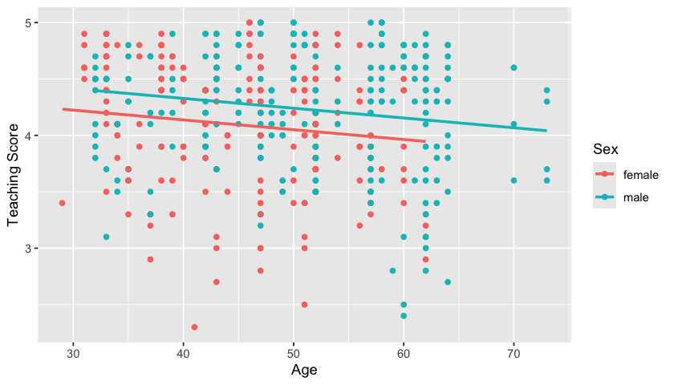

# Lecture 5: Goodness of fit and nested models

### Lecture 5 Outline

- Review Interaction terms 

1. Goodness of fit

    - the coefficient of determination, $R^2$

    - the *F*-test

2. Comparing nested models

    - a more general *F*-test

> This lecture references material from [Chapter 6](https://moderndive.com/6-multiple-regression.html) of ModernDive.


```R
library(tidyverse)
library(repr)
options(repr.plot.width=7, repr.plot.height=4)
library(ggplot2)
library(broom)
library(skimr)
library(moderndive)
library(gridExtra)
library(GGally)
```

    ── Attaching core tidyverse packages ──────────────────────── tidyverse 2.0.0 ──
    ✔ dplyr     1.1.4     ✔ readr     2.1.5
    ✔ forcats   1.0.0     ✔ stringr   1.5.1
    ✔ ggplot2   3.5.1     ✔ tibble    3.2.1
    ✔ lubridate 1.9.3     ✔ tidyr     1.3.1
    ✔ purrr     1.0.2     
    ── Conflicts ────────────────────────────────────────── tidyverse_conflicts() ──
    ✖ dplyr::filter() masks stats::filter()
    ✖ dplyr::lag()    masks stats::lag()
    ℹ Use the conflicted package (<http://conflicted.r-lib.org/>) to force all conflicts to become errors
    
    Attaching package: ‘gridExtra’
    
    
    The following object is masked from ‘package:dplyr’:
    
        combine
    
    
    Registered S3 method overwritten by 'GGally':
      method from   
      +.gg   ggplot2
    


### Dataset

- We will be working with instructor evaluation data from 463 courses at UT Austin.

Variables:
- $y$: the instructor’s teaching score
- $x_1$: the instructor’s age.
- $x_2$: the instructor's sex (M/F).


```R
dat <- evals %>%
  mutate(sex = gender) %>%
  select(score, age, sex)

head(dat)

dat %>% str()
```


<table class="dataframe">
<caption>A tibble: 6 × 3</caption>
<thead>
	<tr><th scope=col>score</th><th scope=col>age</th><th scope=col>sex</th></tr>
	<tr><th scope=col>&lt;dbl&gt;</th><th scope=col>&lt;int&gt;</th><th scope=col>&lt;fct&gt;</th></tr>
</thead>
<tbody>
	<tr><td>4.7</td><td>36</td><td>female</td></tr>
	<tr><td>4.1</td><td>36</td><td>female</td></tr>
	<tr><td>3.9</td><td>36</td><td>female</td></tr>
	<tr><td>4.8</td><td>36</td><td>female</td></tr>
	<tr><td>4.6</td><td>59</td><td>male  </td></tr>
	<tr><td>4.3</td><td>59</td><td>male  </td></tr>
</tbody>
</table>


    tibble [463 × 3] (S3: tbl_df/tbl/data.frame)
     $ score: num [1:463] 4.7 4.1 3.9 4.8 4.6 4.3 2.8 4.1 3.4 4.5 ...
     $ age  : int [1:463] 36 36 36 36 59 59 59 51 51 40 ...
     $ sex  : Factor w/ 2 levels "female","male": 1 1 1 1 2 2 2 2 2 1 ...


-  Let's consider a linear regression model with `age` and `sex` as explanatory variables:

$$Y_i = {\beta}_0+{\beta}_1 X_{i1}+{\beta}_2X_{i2}+\varepsilon_i.$$


```R
fit1 <- lm(score ~ age + sex, data = dat)
tidy(fit1)%>%mutate_if(is.numeric, round, 3)
```


<table class="dataframe">
<caption>A tibble: 3 × 5</caption>
<thead>
	<tr><th scope=col>term</th><th scope=col>estimate</th><th scope=col>std.error</th><th scope=col>statistic</th><th scope=col>p.value</th></tr>
	<tr><th scope=col>&lt;chr&gt;</th><th scope=col>&lt;dbl&gt;</th><th scope=col>&lt;dbl&gt;</th><th scope=col>&lt;dbl&gt;</th><th scope=col>&lt;dbl&gt;</th></tr>
</thead>
<tbody>
	<tr><td>(Intercept)</td><td> 4.484</td><td>0.125</td><td>35.792</td><td>0.000</td></tr>
	<tr><td>age        </td><td>-0.009</td><td>0.003</td><td>-3.280</td><td>0.001</td></tr>
	<tr><td>sexmale    </td><td> 0.191</td><td>0.052</td><td> 3.632</td><td>0.000</td></tr>
</tbody>
</table>


Recall from last class, we can compute estimated regression lines for female ($x_2=0$) and male ($x_2=1$) instructors.

- if sex = "female": 

$$
\hat{y} = \hat{\beta}_0 + \hat{\beta}_1x_1+\hat{\beta}_2\times 0 
        = 4.484-0.009x_1
$$

- if sex = "male": 

$$
\begin{align}
\hat{y} &= \hat{\beta}_0 + \hat{\beta}_1x_1+\hat{\beta}_2\times1 \\
        &= 4.484-0.009x_1+0.191 \\
        &= 4.675-0.009x_1
\end{align}
$$


```R
ggplot(dat, aes(x = age, y = score, color = sex)) +
  geom_point() +
  labs(x = "Age", y = "Teaching Score", color = "Sex") +
  geom_parallel_slopes(se = FALSE)
```


    

    


#### Interaction model:


```R
fit2 <- lm(score ~ age*sex, data = dat)
tidy(fit2)%>%mutate_if(is.numeric, round, 3)
```


<table class="dataframe">
<caption>A tibble: 4 × 5</caption>
<thead>
	<tr><th scope=col>term</th><th scope=col>estimate</th><th scope=col>std.error</th><th scope=col>statistic</th><th scope=col>p.value</th></tr>
	<tr><th scope=col>&lt;chr&gt;</th><th scope=col>&lt;dbl&gt;</th><th scope=col>&lt;dbl&gt;</th><th scope=col>&lt;dbl&gt;</th><th scope=col>&lt;dbl&gt;</th></tr>
</thead>
<tbody>
	<tr><td>(Intercept)</td><td> 4.883</td><td>0.205</td><td>23.795</td><td>0.000</td></tr>
	<tr><td>age        </td><td>-0.018</td><td>0.004</td><td>-3.919</td><td>0.000</td></tr>
	<tr><td>sexmale    </td><td>-0.446</td><td>0.265</td><td>-1.681</td><td>0.094</td></tr>
	<tr><td>age:sexmale</td><td> 0.014</td><td>0.006</td><td> 2.446</td><td>0.015</td></tr>
</tbody>
</table>


Now, 

- if sex = "female": 

$$
\hat{y} = \hat{\beta}_0 + \hat{\beta}_1x_1+\hat{\beta}_2\times 0 + \hat{\beta}_3x_1\times 0
        = 4.883-0.018x_1
$$

- if sex = "male": 

$$
\begin{align}
\hat{y} &= \hat{\beta}_0 + \hat{\beta}_1x_1+\hat{\beta}_2\times1 + \hat{\beta}_3x_1\times 1 \\ 
&= \hat{\beta}_0 + \hat{\beta}_2+(\hat{\beta}_1+\hat{\beta}_3)x_1 \\ 
        &= (4.883-0.446)+(-0.018+0.014)x_1 \\ 
        &= 4.437-0.004x_1
\end{align}
$$


```R
ggplot(dat, aes(x = age, y = score, color = sex)) +
  geom_point() +
  labs(x = "Age", y = "Teaching Score", color = "Sex") +
  geom_smooth(method = "lm", se = FALSE)
```

    `geom_smooth()` using formula = 'y ~ x'


    

    


### Meaning of Coefficients: 

- `Intercept`: The average teaching score of female instructors of zero age (4.883; not a practical interpretation).
- `age`: the slope for female instructors (-0.018). That is, an increase in age by one year is associated with an expected decrease in teaching score of 0.018 for females.
- `sexmale`: holding age constant, the difference in average teaching score between males and females (-0.446).
- `age:sexmale`: This can be interpreted as the difference in the slope of males compared to the slope of females (i.e., the offset in slope for male instructors is 0.014). That is, an increase in age by one year is associated with an expected decrease in teaching score of $-0.018+0.014=-0.004$ for male instructors. 

## 2. Goodness of fit: is our model better than "nothing"?

- We know that the best predictor of the response $Y$ is $E[Y]$ which we can estimate with the sample mean of $Y$, so why do we need a LR? Here, "nothing" means no explanatory variables, intercept-only model, aka null model

- Given the information in $\mathbf{X}$, the best predictor is $E[Y|\mathbf{X}]$ 

- So, an important question is: is our linear regression better than just using $E[Y]$ to predict?

- Statistically, we want to compare our prediction $\hat{Y}$ (the best predictor of $E[Y|\mathbf{X}]$) with $\bar{Y}$ (the best predictor of $E[Y]$).

## 2.1 Sum of squares decomposition

**Total Sum of Squares**: $TSS=\sum_{i=1}^n(y_i-\bar{y})^2$

- the sum of the squares of the observations from the null (intercept-only, no explanatory variables) model

- when properly scaled, it is the sample variance of $Y$ which *estimates* the population variance of $Y$


**Explained Sum of Squares**: $ESS=\sum_{i=1}^n(\hat{y}_i-\bar{y})^2$

- $\hat{y}_i$ predicts $y_i$ using the LR, while $\bar{y}$ predicts $y_i$ without a model. If our model is better than nothing, this should be large!

- measures how much it is *explained* by the additional information given by the LR


**Residual Sum of Squares**: $RSS=\sum_{i=1}^n(y_i - \hat{y}_i)^2$

- this is the sum of the squares of the residuals from the *fitted* model

- our estimated parameters minimize these errors!


If parameters are estimated using LS and the LR has an intercept:

$$TSS=ESS + RSS$$

$$\sum_{i=1}^n(y_i-\bar{y})^2 = \sum_{i=1}^n(\hat{y}_i-\bar{y})^2 + \sum_{i=1}^n(y_i - \hat{y}_i)^2$$

## 2.2 The coefficient of determination

If our model provides a good fit, we expect the TSS (residuals from the null model, in red) to be much larger than the RSS (residuals from the fitted model, which we minimized by LS, in blue)!


Using the decomposition above and dividing by TSS: 

$$1=\frac{\text{ESS}}{\text{TSS}} + \frac{\text{RSS}}{\text{TSS}}$$


**The Coefficient of determination** was first defined as:

$$R^2=1 - \frac{\text{RSS}}{\text{TSS}}$$

*For a LR with an intercept and estimated by LS* it is equivalent to 

$$R^2=\frac{\text{ESS}}{\text{TSS}}$$ 

#### Interpretations 

For a LR with an intercept and estimated by LS, the coefficient of determination:


- is interpreted as the proportion of variance of the response (TSS) explained by the model (ESS)


- is between 0 and 1 since we expect TSS to be much larger than RSS (thus their ratio is smaller than 1)

- measures the gain in predicting the response using the LM instead of the sample mean, relative to the total variation in the response. 

## 2.3 Computation in `R`

For the full model


```R
glance(fit2)
```


<table class="dataframe">
<caption>A tibble: 1 × 12</caption>
<thead>
	<tr><th scope=col>r.squared</th><th scope=col>adj.r.squared</th><th scope=col>sigma</th><th scope=col>statistic</th><th scope=col>p.value</th><th scope=col>df</th><th scope=col>logLik</th><th scope=col>AIC</th><th scope=col>BIC</th><th scope=col>deviance</th><th scope=col>df.residual</th><th scope=col>nobs</th></tr>
	<tr><th scope=col>&lt;dbl&gt;</th><th scope=col>&lt;dbl&gt;</th><th scope=col>&lt;dbl&gt;</th><th scope=col>&lt;dbl&gt;</th><th scope=col>&lt;dbl&gt;</th><th scope=col>&lt;dbl&gt;</th><th scope=col>&lt;dbl&gt;</th><th scope=col>&lt;dbl&gt;</th><th scope=col>&lt;dbl&gt;</th><th scope=col>&lt;dbl&gt;</th><th scope=col>&lt;int&gt;</th><th scope=col>&lt;int&gt;</th></tr>
</thead>
<tbody>
	<tr><td>0.05138382</td><td>0.04518372</td><td>0.5314356</td><td>8.287572</td><td>2.226878e-05</td><td>3</td><td>-362.2636</td><td>734.5273</td><td>755.2159</td><td>129.6325</td><td>459</td><td>463</td></tr>
</tbody>
</table>


> Note: this is very low, indicating our model is likely not a good fit for the data.

**Question:** What is the correct interpretation of the $R^2$ (0.051)?

A. 5.1% of the variation in teaching scores is accounted by its linear relationship with age and sex. 

B. 5.1% of the variation in age and sex is accounted by its linear relationship with teaching scores. 

C. The model makes accurate predictions of teaching scores 5.1% of the time.

D. 5.1% of age and sex influences teaching scores. 


Manual computation:


```R

y <- dat$score
y.hat <- fitted(fit2)

TSS <- sum((y-mean(y))^2)
RSS <- sum((y-y.hat)^2)

my_Rsq <- 1-RSS/TSS

my_Rsq

```


0.0513838248638872


- You probably noticed this in the SLR: $r^2=R^2$

- In fact, the coefficient of determination was first introduced this way in 1921!


#### Scope and limitations

The $R^2$ is computed based on *in-sample* observations and it does not provide a sense of how good is our model in predicting *out-of-sample* cases (aka test set).

Note that $R^2$ computed as $R^2 = 1 - \frac{\text{RSS}}{\text{TSS}}$ ranges between 0 and 1 *if* the LR model has an intercept and is estimated by LS.

- Otherwise, this definition can result in negative values! (see discussion in Wooldridge)

- A negative $R^2$ indicates that the sample mean is a better predictor than the estimated linear regression.


### Regression through the origin (no intercept)

- Sometimes the intercept doesn't necessarily "make sense" or have a clear interpretation (e.g., negative intercept for predicting house prices). 

- So, should we add an intercept? 

    - Estimating an intercept when it is truly zero (in the population) inflates the variances of the coefficient estimators, which results in larger p-values for the slopes
    
    - But if the intercept in the population model is truly different from zero, then the estimators of the slope parameters will be biased unless an intercept is included in the LR
    
- If the model does not have an intercept, we can use the squared correlation coefficient between the actual and fitted values of $Y$.

###  Is the $R^2$ useful?

- The $R^2$ can be used to compare the size of the residuals of the fitted model with those of the null 


- However, we can't use it to *test* any hypothesis to answer this question since its distribution is unknown

# 3. Nested models: the *F*-test

Reduced model: $Y_i=\beta_0 + \beta_1 X_{i1} + \ldots + \beta_q X_{iq} + \varepsilon_i$ 

- LR with $q$ variables


Full model:  $Y_i=\beta_0 + \beta_1 X_{i1} +  \ldots + \beta_q X_{iq} + \ldots +  \beta_s X_{is} + \varepsilon_i$ 

- LR with $p = s$ variables, $k$ additional explanatory variables


Is the full model significantly different from the reduced model? We are *simulataneously* testing if many parameters are zero!


## 3.1 The F-statistic  

The $F$-statistic is defined as

$$\frac{(RSS_{reduced}-RSS_{full})/k}{RSS_{full}/(n-p)} \sim \mathcal{F}_{k, n-p}$$

- $RSS_{reduced}$ is the **RSS** of the reduced model 


- $RSS_{full}$ is the **RSS** of the full model 


- $k$ is the number of parameters tested (difference between models)


- $p$ is the number of parameters of the full model ($s+1$)


## 3.2 Test: Is the linear regression better than "nothing"?

For simplicity, let's compare the additive model versus the null model (without explanatory variables):


- **Reduced model**: $Y_i=\beta_0 + \varepsilon_i$ 

    > Recall: $\hat{\beta}_0= \bar{Y}$, the sample mean of $Y$ 
    
    
    
- **Full model**:  $Y_i=\beta_0 + \beta_1 x_{i1} + \beta_2 x_{i2} + \varepsilon_i$ 


We are interested in testing 

$$H_0: \beta_1 = \beta_2 =0$$

In this example: k=2 (parameters tested), p=3 (# of parameters in full model, including the intercept)

#### The *F*-test above can be used to test this hypothesis.

## 3.3 Computation in `R`


```R
lm_red <- lm(score~1, data=dat)

lm_full <- lm(score~ age + sex, data=dat)

anova(lm_red,lm_full)
```


<table class="dataframe">
<caption>A anova: 2 × 6</caption>
<thead>
	<tr><th></th><th scope=col>Res.Df</th><th scope=col>RSS</th><th scope=col>Df</th><th scope=col>Sum of Sq</th><th scope=col>F</th><th scope=col>Pr(&gt;F)</th></tr>
	<tr><th></th><th scope=col>&lt;dbl&gt;</th><th scope=col>&lt;dbl&gt;</th><th scope=col>&lt;dbl&gt;</th><th scope=col>&lt;dbl&gt;</th><th scope=col>&lt;dbl&gt;</th><th scope=col>&lt;dbl&gt;</th></tr>
</thead>
<tbody>
	<tr><th scope=row>1</th><td>462</td><td>136.6543</td><td>NA</td><td>      NA</td><td>      NA</td><td>          NA</td></tr>
	<tr><th scope=row>2</th><td>460</td><td>131.3228</td><td> 2</td><td>5.331553</td><td>9.337734</td><td>0.0001058844</td></tr>
</tbody>
</table>


#### Note that `glance` also includes this statistic and p-value


```R
glance(lm_full)

summary(lm_full)
```


<table class="dataframe">
<caption>A tibble: 1 × 12</caption>
<thead>
	<tr><th scope=col>r.squared</th><th scope=col>adj.r.squared</th><th scope=col>sigma</th><th scope=col>statistic</th><th scope=col>p.value</th><th scope=col>df</th><th scope=col>logLik</th><th scope=col>AIC</th><th scope=col>BIC</th><th scope=col>deviance</th><th scope=col>df.residual</th><th scope=col>nobs</th></tr>
	<tr><th scope=col>&lt;dbl&gt;</th><th scope=col>&lt;dbl&gt;</th><th scope=col>&lt;dbl&gt;</th><th scope=col>&lt;dbl&gt;</th><th scope=col>&lt;dbl&gt;</th><th scope=col>&lt;dbl&gt;</th><th scope=col>&lt;dbl&gt;</th><th scope=col>&lt;dbl&gt;</th><th scope=col>&lt;dbl&gt;</th><th scope=col>&lt;dbl&gt;</th><th scope=col>&lt;int&gt;</th><th scope=col>&lt;int&gt;</th></tr>
</thead>
<tbody>
	<tr><td>0.03901489</td><td>0.03483669</td><td>0.5343073</td><td>9.337734</td><td>0.0001058844</td><td>2</td><td>-365.2626</td><td>738.5253</td><td>755.0762</td><td>131.3228</td><td>460</td><td>463</td></tr>
</tbody>
</table>


    
    Call:
    lm(formula = score ~ age + sex, data = dat)
    
    Residuals:
         Min       1Q   Median       3Q      Max 
    -1.82833 -0.33494  0.09391  0.42882  0.91506 
    
    Coefficients:
                 Estimate Std. Error t value Pr(>|t|)    
    (Intercept)  4.484116   0.125284  35.792  < 2e-16 ***
    age         -0.008678   0.002646  -3.280 0.001117 ** 
    sexmale      0.190571   0.052469   3.632 0.000313 ***
    ---
    Signif. codes:  0 ‘***’ 0.001 ‘**’ 0.01 ‘*’ 0.05 ‘.’ 0.1 ‘ ’ 1
    
    Residual standard error: 0.5343 on 460 degrees of freedom
    Multiple R-squared:  0.03901,	Adjusted R-squared:  0.03484 
    F-statistic: 9.338 on 2 and 460 DF,  p-value: 0.0001059


#### Interpretation: 

- the full (additive) model gives a better (in-sample) prediction than using just the instructor score sample mean to predict


- the full (additive) model fits the data better than the null model

**Question**

In SLR, the `sigma` value given by the `glance` function is an estimate of the:

(a) Standard deviation of the error term

(b) Variance of the error term

(c) Standard error of the slope

### Is a model with an interaction term significantly different from one without?

- Reduced model: $Y_i=\beta_0 + \beta_1 x_{i1} + \beta_2 x_{i2}  + \varepsilon_i$ 


- Full model: $Y_i=\beta_0 + \beta_1 x_{i1} + \beta_2 x_{i2}  + \beta_3 x_{i1}\times x_{i2} \varepsilon_i$ 

$$H_0: \beta_3 = 0$$ 

- Note: With the $F$-test, we could test the significance of many parameters at once (e.g., $H_0: \beta_3=\beta_4=\beta_5=0$)

- However, for one parameter, the $t$-test and $F$-test are actually equivalent!

> Note that the `tidy` table of the full  model shows the results of individual tests (each parameter, separately, equal to 0), but all the data is used to estimate $\sigma$


```R
lm_red <- lm(score ~ age + sex, data=dat)
lm_full <- lm(score ~ age*sex, data=dat)

anova(lm_red,lm_full)
```


<table class="dataframe">
<caption>A anova: 2 × 6</caption>
<thead>
	<tr><th></th><th scope=col>Res.Df</th><th scope=col>RSS</th><th scope=col>Df</th><th scope=col>Sum of Sq</th><th scope=col>F</th><th scope=col>Pr(&gt;F)</th></tr>
	<tr><th></th><th scope=col>&lt;dbl&gt;</th><th scope=col>&lt;dbl&gt;</th><th scope=col>&lt;dbl&gt;</th><th scope=col>&lt;dbl&gt;</th><th scope=col>&lt;dbl&gt;</th><th scope=col>&lt;dbl&gt;</th></tr>
</thead>
<tbody>
	<tr><th scope=row>1</th><td>460</td><td>131.3228</td><td>NA</td><td>      NA</td><td>      NA</td><td>        NA</td></tr>
	<tr><th scope=row>2</th><td>459</td><td>129.6325</td><td> 1</td><td>1.690269</td><td>5.984869</td><td>0.01480337</td></tr>
</tbody>
</table>


### Conclusion:

The $p$-value of the test (0.0148) is smaller than 0.05. 

Thus, we have evidence that a model with an interaction term fits the data better than a model without. 

Let's compare this result to a $t$-test for $\beta_3$. What do you notice?


```R
tidy(lm_full)%>% filter(term == "age:sexmale")
```


<table class="dataframe">
<caption>A tibble: 1 × 5</caption>
<thead>
	<tr><th scope=col>term</th><th scope=col>estimate</th><th scope=col>std.error</th><th scope=col>statistic</th><th scope=col>p.value</th></tr>
	<tr><th scope=col>&lt;chr&gt;</th><th scope=col>&lt;dbl&gt;</th><th scope=col>&lt;dbl&gt;</th><th scope=col>&lt;dbl&gt;</th><th scope=col>&lt;dbl&gt;</th></tr>
</thead>
<tbody>
	<tr><td>age:sexmale</td><td>0.01353061</td><td>0.005530825</td><td>2.446399</td><td>0.01480337</td></tr>
</tbody>
</table>


The p-value from the $t$-test is the same as for the $F$-test in this case. Also, there is a relationship between the test statistics:

$$(2.446399)^2=5.984868.$$

In general, $t^2\approx F$ asympotically. 

**Question**

The coefficient of determination can be used to test if the full model fits the data better than the null model (intercept-only) True or False?

A. TRUE

B. FALSE

### <font color=red>  Answer: F </font>

- The coefficient of determination *can not* be used to *test* a hypothesis since it does not have a known sampling distribution

> the F-statistic (computed by `glance` or `anova`) can be used to test this hypothesis! these functions are based on classical results which assume Normality of the errors *or* relays on the CLT to obtain an approximate distribution

- The coefficient of determination *compares* the sum of the squared residuals (RSS) with the total sum of squares (TSS). 


**Question**

The $R^2$, defined as $R^2= (cor(Y,\hat{Y}))^2$, computed on test samples (new observations) can be used to assess the prediction performance of the model. True or False?

A. TRUE

B. FALSE


### <font color=red>  Answer: T </font>

Sometime software also report an $R^2$ computed on test data. Note that we can compute $(cor(Y, \hat{Y}))^2$, and call it $R^2$, based on **test data** to evaluate out-of-sample prediction. 

> However, this metric is not equivalent to the ones defined above and its interpretation is different as well.

#### Caution

Even in the context of prediction, I do not recommend you to use this measure to evaluate pediction. Note that $cor(Y, \hat{Y})$ measures the linear relation between these variables. However, we only want to corroborate that $Y$ is approximately equal to $\hat{Y}$! The test MSE (or similar loss functions) is a better metric to evaluate prediction.

### Summary: what have we learned today?

- Interaction terms: can accomodate models without assuming the same slopes for categorical variables
- meaning of $R^2$: proportion of variation in $y$ explained by the model
- $F$-test: formal hypothesis test to compare nested models


