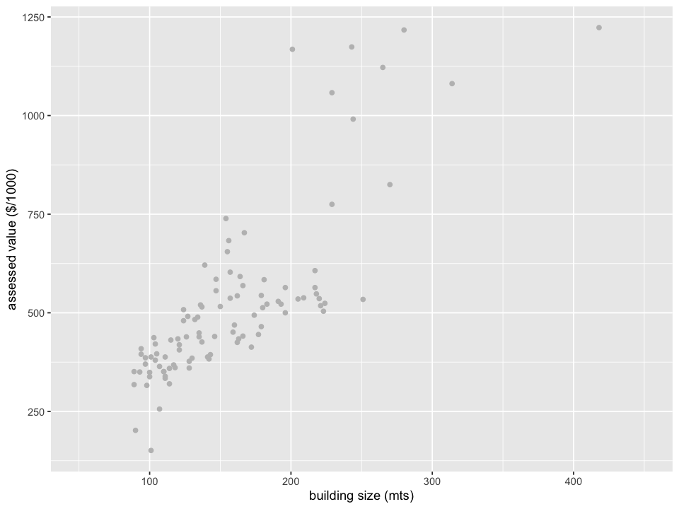
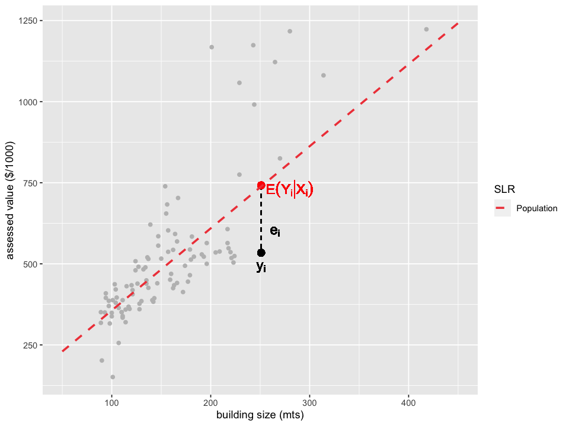
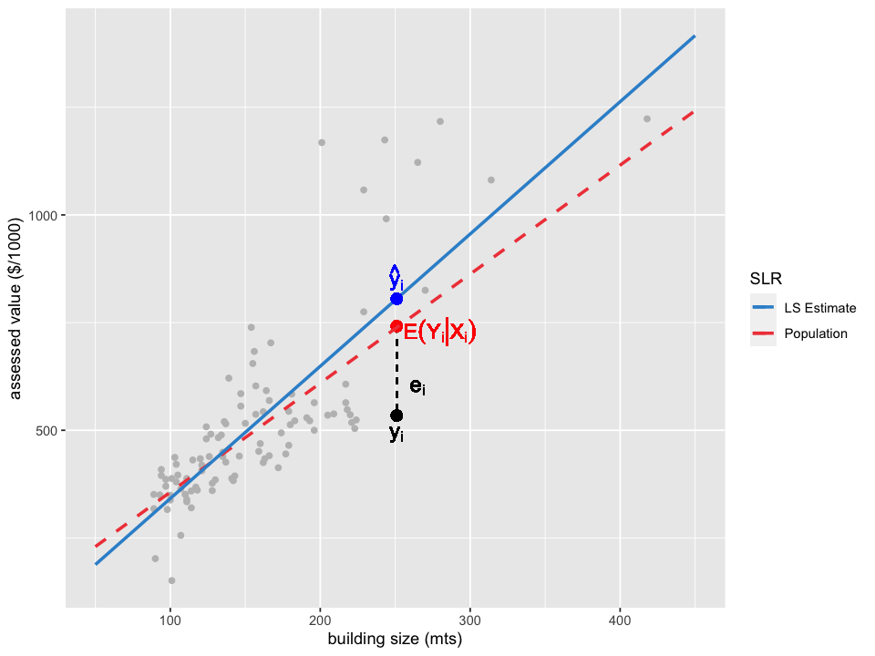
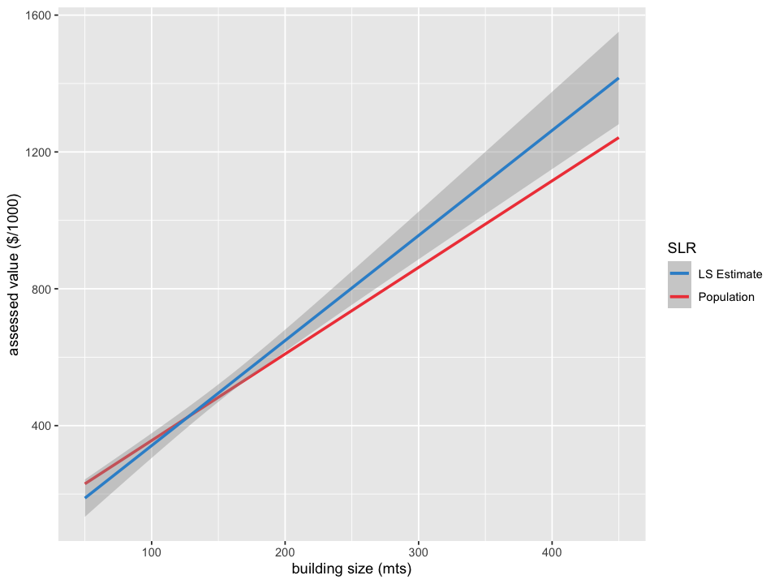
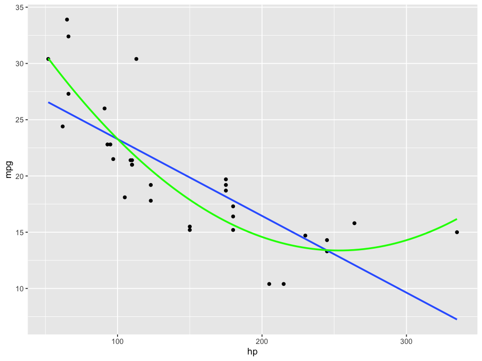
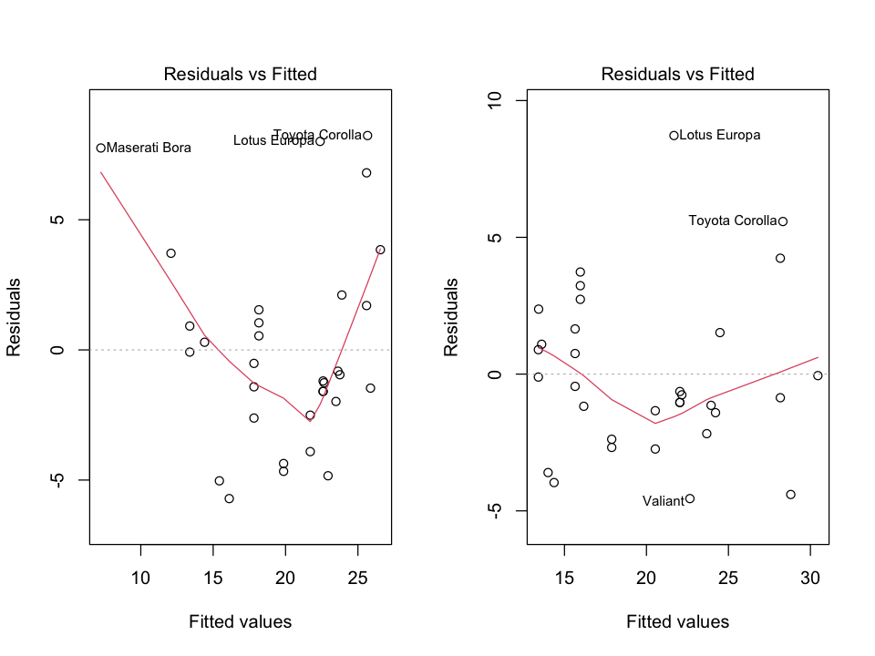
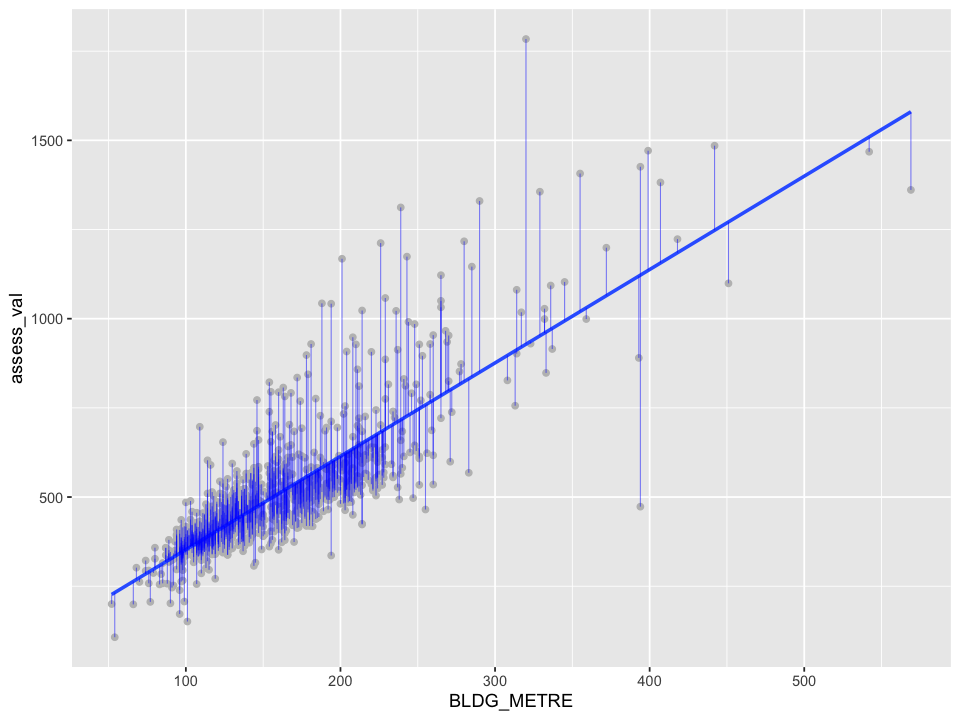
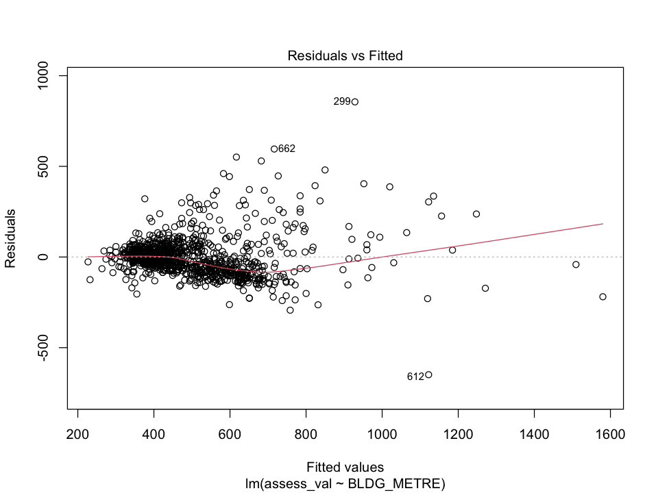
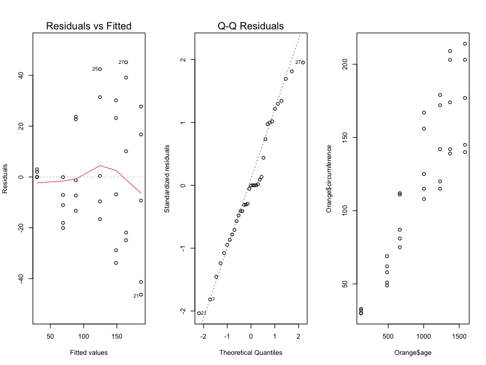

# Lecture 7: uncertainty in prediction and potential problems in LR

### Overview

- The conditional expectation is the best predictor of $Y$ given a vector of variables $\boldsymbol{X}: E[Y|\boldsymbol{X}]$

- A LR assumes a linear form for this conditional expectation


**Lectures 1-4:**

- We have *estimated*, *measured uncertainty*, *tested*, and *interpreted* LR *coefficients* 

**Lectures 5-6**

- We have *assesed*, *compared* and *selected* LR models that best fits the data (inference) or predicted new observations (prediction)

### Lecture 6 Learning Objectives

- Recognize different metrics to evaluate a LR 
- Choose an appropriate measure to evaluate the LR when inference is the primary goal
- Choose an appropriate measure to evaluate the LR when prediction is the primary goal
- Distinguish between measures computed on the training data versus those computed on the test data
- Recognize the limitations of the coefficient of determination (R-square on training set) to evaluate 
- Recognize the limitations of the coefficient of determination to compare nested models
- Choose an appropriate measure to select variables of a LR when inference is the primary goal
- Choose an appropriate measure to select variables of a LR when prediction is the primary goal
- Understand the algorithms (best, forward, backward) to automate a variable selection process in LR
- Interpret the results of a model evaluation and a selection process
- Recognize LASSO as a variable selection method and 
- Identify the problem of post-selection inference when performing LASSO

### Today

Part I: uncertainty of predictions

Part II: assumptions and diagnostics

# 1. Prediction Intervals vs. Confidence Intervals for prediction

- Last week we have seen that the <font color=blue> estimated LR </font> can be used to predict values of the response variable (we can predict observations from the training or test sets).

- We have also learned different metrics to evaluate the estimated model. Many of these metrics compared the observed response $y$ with its predicted value using the estimated LR $\hat{y}$. 
    
- For example: **Mean Squared Error**: MSE = $\frac{1}{n}\sum_{i=1}^n(y_i - \hat{y}_i)^2$

Today, we will learn how to measure the uncertainty of $\hat{y}$.

#### Predictions are random variables

- Since the predictions are functions of the estimated LR, they also depend on the sample used.
    
- A different sample would have resulted in a different estimated LR and thus different predictions
    
- As dicussed for the estimation of the regression parameters, we can obtain *confidence intervals* that take into account the sample-to-sample variation of the predictions as well!
   

There are 2 type of intervals we can construct depending on the quantity we want to predict: 

- *confidence intervals for prediction (CIP)* 
- *prediction intervals (PI)*
    

## 1.1 Dataset: [2015 Property Tax Assessment from Strathcona County](https://data.strathcona.ca/Housing-Buildings/2015-Property-Tax-Assessment/uexh-8sx8)

In this first part of the worksheet, we'll work with a new dataset with data on property tax assessed values of properties in the Strathcona County. A valuation date of July 1, 2014 and a property condition date as of December 31, 2014 are provided. 


```R
options(repr.plot.width=8, repr.plot.height=6)
library(broom)
install.packages("latex2exp")
library(latex2exp)
library(tidyverse)
#library(repr)
library(gridExtra)
library(faraway)
library(mltools)
#library(leaps)
library(glmnet)
library(cowplot)

dat <- read.csv("data/Assessment_2015.csv")
dat <- dat %>% filter(ASSESSCLAS=="Residential")  %>% 
        mutate(assess_val = ASSESSMENT / 1000)
```

    
    The downloaded binary packages are in
    	/var/folders/k5/f23tw_yj4lj2ph0v6wjjzggm0000gr/T//RtmpurorIc/downloaded_packages


    ── Attaching core tidyverse packages ──────────────────────────────────────────────────── tidyverse 2.0.0 ──
    ✔ dplyr     1.1.3     ✔ readr     2.1.4
    ✔ forcats   1.0.0     ✔ stringr   1.5.0
    ✔ ggplot2   3.4.4     ✔ tibble    3.2.1
    ✔ lubridate 1.9.2     ✔ tidyr     1.3.0
    ✔ purrr     1.0.2     
    ── Conflicts ────────────────────────────────────────────────────────────────────── tidyverse_conflicts() ──
    ✖ dplyr::filter() masks stats::filter()
    ✖ dplyr::lag()    masks stats::lag()
    ℹ Use the conflicted package (<http://conflicted.r-lib.org/>) to force all conflicts to become errors
    
    Attaching package: ‘gridExtra’
    
    
    The following object is masked from ‘package:dplyr’:
    
        combine
    
    
    
    Attaching package: ‘mltools’
    
    
    The following object is masked from ‘package:tidyr’:
    
        replace_na
    
    
    Loading required package: Matrix
    
    
    Attaching package: ‘Matrix’
    
    
    The following objects are masked from ‘package:tidyr’:
    
        expand, pack, unpack
    
    
    Loaded glmnet 4.1-8
    
    
    Attaching package: ‘cowplot’
    
    
    The following object is masked from ‘package:lubridate’:
    
        stamp
    
    


**Note 1: re-scaling ASSESSMENT**

The variable `ASSESSMENT` was divided by 1000 to work with smaller numbers. The transformed values are stored in `assess_val` and are used as the response variable. 

**Note 2: population parameters**

Unless we work with a simulated dataset, the true population parameters are *unknown*. Instead of simulating data and *just* to illustrate concepts, we'll use all the residencies in the dataset to obtain a LR and pretend that this is the *population* line.

We'll use a random sample to estimate the true LR and use it to predict


```R
# A smaller sample
set.seed(561)
dat_s <- sample_n(dat, 100, replace = FALSE)

lm_p <- lm(assess_val ~ BLDG_METRE, dat)
lm_s <- lm(assess_val ~ BLDG_METRE, dat_s)

tidy(lm_s)  %>% mutate_if(is.numeric, round, 3)
```


<table class="dataframe">
<caption>A tibble: 2 × 5</caption>
<thead>
	<tr><th scope=col>term</th><th scope=col>estimate</th><th scope=col>std.error</th><th scope=col>statistic</th><th scope=col>p.value</th></tr>
	<tr><th scope=col>&lt;chr&gt;</th><th scope=col>&lt;dbl&gt;</th><th scope=col>&lt;dbl&gt;</th><th scope=col>&lt;dbl&gt;</th><th scope=col>&lt;dbl&gt;</th></tr>
</thead>
<tbody>
	<tr><td>(Intercept)</td><td>34.456</td><td>38.055</td><td> 0.905</td><td>0.367</td></tr>
	<tr><td>BLDG_METRE </td><td> 3.071</td><td> 0.228</td><td>13.446</td><td>0.000</td></tr>
</tbody>
</table>


```R
cols <- c("Population"="#f04546","LS Estimate"="#3591d1")

plot_sample <- ggplot(data=dat_s,aes(BLDG_METRE, assess_val)) + 
  xlab("building size (mts)")+ 
  ylab("assessed value ($/1000)") +
  xlim(50,450)+
  geom_point(aes(BLDG_METRE, assess_val), color="grey")

plot_sample
```


    

    


## 1.2 Prediction of the assessed value of a house in Strathcona

Since we are pretending that we know this population line, we can plot it

> **NOTE**: recall that in practice this line is *unknown*


```R
plot_expect <- plot_sample +
    geom_segment(x = 251, y = predict(lm_p,data.frame(BLDG_METRE = 251)),xend = 251,yend = 534, linetype = "dashed")+
    geom_point(aes(x = 251,y = 534), color = "black", size = 3)+
    geom_text(aes(x = 251,y = 490,label = TeX(r"($y_i$)", output = "character")), size = 5,parse = TRUE)+
    geom_point(aes(x = 251,y = predict(lm_p,data.frame(BLDG_METRE=251))),color = "red", size = 3)+  
    geom_text(aes(x = 280,y = 730,label = TeX(r"($E(Y_i|X_i)$)", output = "character")), color = "red", size = 5,parse = TRUE)+
    geom_text(aes(x = 265,y = 600,label = TeX(r"($e_i$)", output = "character")), size = 5,parse = TRUE)+
    geom_smooth(data = dat,aes(BLDG_METRE, assess_val, color = "Population"),method = lm, 
                linetype = 2, se = FALSE, fullrange=TRUE)+
    scale_colour_manual(name="SLR",values=cols)
```


```R
plot_expect
```

    `geom_smooth()` using formula = 'y ~ x'
    Warning message:
    “Removed 98 rows containing non-finite values (`stat_smooth()`).”


    

    


#### Estimated Linear Regression:

- In practice, we use the random sample to estimate the regression line.

- Based on a random sample of houses from Strathcona, we estimate the relation between the assessed value  of a house and its size. We use the estimated relation to predict the value of any house in the county

- Then we can use the <font color=blue> estimated LR (blue line) </font> to predict.

- The prediction of the $i$-th observation is given by:

$$ \hat{Y}_i = \hat{\beta}_0 + \hat{\beta}_1 X_{i} $$


```R
plot_ls <- plot_expect +    
    geom_smooth(data = dat_s,aes(BLDG_METRE, assess_val, color="LS Estimate"),method=lm, se = FALSE,fullrange=TRUE)+
    geom_point(aes(x=251,y=predict(lm_s,data.frame(BLDG_METRE=251))), color="blue", size=3)+
    geom_text(aes(x=251,y=predict(lm_s,data.frame(BLDG_METRE=251))+50,label=TeX(r"($\hat{y}_i$)", output = "character")), color="blue", size=5,parse = TRUE)

plot_ls
```

    `geom_smooth()` using formula = 'y ~ x'
    Warning message:
    “Removed 98 rows containing non-finite values (`stat_smooth()`).”
    `geom_smooth()` using formula = 'y ~ x'


    

    


### What do we want to predict with <font color=blue> $\hat{y}_i$ </font>?

- **(A)** the *average* assessed value of a house of *this size*: <font color=red> $E[Y_i|X_i]$ </font>

- **(B)** the *actual* value of a house of *this size*: $Y_i$ (knowing its size $X_i$)

#### Note that we predict both with *uncertainty*!

> Which one do you think is more difficult to predict?

The assessed value of a random house in Strathcona can be modelled as the average assessed value of a house with similar characteristics plus some random error. Mathematically:

$$Y_i = \color{red}{E[Y_i|X_{i}]} \color{black}+ \varepsilon_i.$$

A random residence won't have a value exactly equal to the average population value of residencies of the same size, some have higher values and others have lower values 

In addition, we have assumed that the conditional expectation is linear. Then,

$$\color{red}{ E[Y_i|X_{i}] = \beta_0 + \beta_1 X_{i}}.$$

## 1.3 Intervals to describe uncertainty

### 1.3.1 Confidence Intervals for Prediction (CIP)

- The uncertainty comes from the estimation (only 1 sources of variation).

- The predicted value <font color=blue> $ \hat{Y}_i = \hat{\beta}_0 + \hat{\beta}_1 X_{i}$ </font> approximates, with uncertainty, the <font color=red> population $ E[Y_i| X_{i}] = \beta_0 + \beta_1 X_{i}$ </font>

- Since the estimated coefficients <font color=blue> $\hat{\beta}_0$ and $\hat{\beta}_1$ </font> are estimates, *approximations*, of the true population coefficients <font color=red> $\beta_0$ and $\beta_1$ </font>, respectively

- If we take a different sample, we get: different estimates, different fitted lines, and different predictions!

A **95% confidence interval for prediction** is a range that with 95% probability contains the *average* value of a house of *this size* 

Note that once we have estimated values and a numerical range based on the sample we use the word "confidence" (instead of "probability") since nothing else is random

**A quick look at data**

Using the sample `dat_s`, let's compute 95% confidence intervals for prediction using the function `predict`. 

- Create a dataframe, called `dat_cip`, that contains the response, the input, the predictions using `lm_s`, and the lower and upper bounds of the intervals for *each* observation

> Each row corresponds to one (in-sample) prediction and its confidence interval


```R
dat_cip <- dat_s  %>% 
    select(assess_val,BLDG_METRE) %>% 
    cbind(predict(lm_s,interval="confidence",se.fit=TRUE)$fit)


```


<table class="dataframe">
<caption>A data.frame: 6 × 5</caption>
<thead>
	<tr><th></th><th scope=col>assess_val</th><th scope=col>BLDG_METRE</th><th scope=col>fit</th><th scope=col>lwr</th><th scope=col>upr</th></tr>
	<tr><th></th><th scope=col>&lt;dbl&gt;</th><th scope=col>&lt;int&gt;</th><th scope=col>&lt;dbl&gt;</th><th scope=col>&lt;dbl&gt;</th><th scope=col>&lt;dbl&gt;</th></tr>
</thead>
<tbody>
	<tr><th scope=row>1</th><td>536</td><td>220</td><td>710.0708</td><td>671.9440</td><td>748.1977</td></tr>
	<tr><th scope=row>2</th><td>370</td><td> 97</td><td>332.3407</td><td>295.2144</td><td>369.4669</td></tr>
	<tr><th scope=row>3</th><td>318</td><td> 89</td><td>307.7729</td><td>267.9136</td><td>347.6321</td></tr>
	<tr><th scope=row>4</th><td>339</td><td>111</td><td>375.3344</td><td>342.5711</td><td>408.0976</td></tr>
	<tr><th scope=row>5</th><td>543</td><td>162</td><td>531.9542</td><td>506.5840</td><td>557.3243</td></tr>
	<tr><th scope=row>6</th><td>469</td><td>160</td><td>525.8122</td><td>500.5068</td><td>551.1177</td></tr>
</tbody>
</table>


```R
head(dat_cip,3)
```


<table class="dataframe">
<caption>A data.frame: 3 × 5</caption>
<thead>
	<tr><th></th><th scope=col>assess_val</th><th scope=col>BLDG_METRE</th><th scope=col>fit</th><th scope=col>lwr</th><th scope=col>upr</th></tr>
	<tr><th></th><th scope=col>&lt;dbl&gt;</th><th scope=col>&lt;int&gt;</th><th scope=col>&lt;dbl&gt;</th><th scope=col>&lt;dbl&gt;</th><th scope=col>&lt;dbl&gt;</th></tr>
</thead>
<tbody>
	<tr><th scope=row>1</th><td>536</td><td>220</td><td>710.0708</td><td>671.9440</td><td>748.1977</td></tr>
	<tr><th scope=row>2</th><td>370</td><td> 97</td><td>332.3407</td><td>295.2144</td><td>369.4669</td></tr>
	<tr><th scope=row>3</th><td>318</td><td> 89</td><td>307.7729</td><td>267.9136</td><td>347.6321</td></tr>
</tbody>
</table>


#### Question:

What is the interpretation for the CIP of row 1 (671.944, 748.198)?

A. With 95% confidence, the value of a house of size 220 mts is between \\$671944 and \\$748198 (rounded)

B. With 95% confidence, the expected value of a house of size 220 mts is between \\$671944 and \\$748198 (rounded)

C. With 95% probability, the *expected* value of a house of size 220 mts is between \\$671944 and \\$748198 (rounded)

D. With 95% confidence, the value of each house of size 220 mts is between \\$671944 and \\$748198 (rounded)

#### Visualization


```R
ggplot(data=dat_s,aes(BLDG_METRE, assess_val)) + 
        xlab("building size (mts)")+ 
        ylab("assessed value ($/1000)") +
        xlim(50,450)+ 
        geom_smooth(data = dat,aes(BLDG_METRE, assess_val, color="Population"),method=lm, se = FALSE,fullrange=TRUE)+
        geom_smooth(data = dat_s,aes(BLDG_METRE, assess_val, color="LS Estimate"),method=lm, se = TRUE,fullrange=TRUE)+
        scale_colour_manual(name="SLR",values=cols)
```

    `geom_smooth()` using formula = 'y ~ x'
    Warning message:
    “Removed 98 rows containing non-finite values (`stat_smooth()`).”
    `geom_smooth()` using formula = 'y ~ x'


    

    


### In-Class Questions

Using the sample `dat_s`, compute 90% confidence intervals for prediction. Create a dataframe, called `dat_cip_90`, that contains the response, the input, the predictions using `lm_s`, and the lower and upper bounds of the intervals for each observation. Columns in your dataframe should be in this order.


```R
# Your code goes here

dat_cip_90 <- dat_s  %>% 
    select(assess_val,BLDG_METRE) %>% 
    cbind(predict(lm_s,interval="confidence",se.fit=TRUE, level=0.90)$fit)

head(dat_cip_90)
```


<table class="dataframe">
<caption>A data.frame: 6 × 5</caption>
<thead>
	<tr><th></th><th scope=col>assess_val</th><th scope=col>BLDG_METRE</th><th scope=col>fit</th><th scope=col>lwr</th><th scope=col>upr</th></tr>
	<tr><th></th><th scope=col>&lt;dbl&gt;</th><th scope=col>&lt;int&gt;</th><th scope=col>&lt;dbl&gt;</th><th scope=col>&lt;dbl&gt;</th><th scope=col>&lt;dbl&gt;</th></tr>
</thead>
<tbody>
	<tr><th scope=row>1</th><td>536</td><td>220</td><td>710.0708</td><td>678.1672</td><td>741.9744</td></tr>
	<tr><th scope=row>2</th><td>370</td><td> 97</td><td>332.3407</td><td>301.2744</td><td>363.4070</td></tr>
	<tr><th scope=row>3</th><td>318</td><td> 89</td><td>307.7729</td><td>274.4197</td><td>341.1261</td></tr>
	<tr><th scope=row>4</th><td>339</td><td>111</td><td>375.3344</td><td>347.9189</td><td>402.7498</td></tr>
	<tr><th scope=row>5</th><td>543</td><td>162</td><td>531.9542</td><td>510.7251</td><td>553.1833</td></tr>
	<tr><th scope=row>6</th><td>469</td><td>160</td><td>525.8122</td><td>504.6373</td><td>546.9872</td></tr>
</tbody>
</table>


**Question 1** 

Based on the output `dat_cip_90`, which of the following claims is correct?

**A.** with 90% confidence, the expected value of a house of size 97 mts is between \\$301274 and \\$363407 (rounded) 

**B.** with 90% confidence, the expected value of a house of size 97 mts is between \\$2952144	and \\$369467 (rounded) 


**C.** with 90% confidence, the expected value of a house of size 97 mts is between \\$678167 and \\$741974 (rounded) 


**D.** with 90% confidence, the *expected* value of any house is between \\$301274 and \\$363407 (rounded) 

**Question 2** 

Based on the outputs `dat_cip_90` and `dat_cip`, CIP are centered at the fitted value  <font color=blue>$\hat{Y}_i$ </font>.

A. TRUE

B. FALSE

**Question 3** 

The 90% confidence intervals for prediction are wider than the 95% confidence intervals for prediction.

A. TRUE

B. FALSE

#### (B) Prediction Intervals (PI)

The predicted value <font color=blue> $ \hat{Y}_i = \hat{\beta}_0 + \hat{\beta}_1 X_{i}$ </font> also approximates, with uncertainty, an actual observation $ Y_i = \beta_0 + \beta_1 X_{i} + \varepsilon_i$

The uncertainty comes from the estimation **and** from the error term that generates the data!

> 2 sources of variation, so more uncertainty!


```R
plot_ls
```

    `geom_smooth()` using formula = 'y ~ x'
    Warning message:
    “Removed 98 rows containing non-finite values (`stat_smooth()`).”
    `geom_smooth()` using formula = 'y ~ x'


    

    


- **Uncertainty 1**: because the estimated value <font color=blue> $\hat{\beta}_0 + \hat{\beta}_1 X_i$ </font> *approximates* the average (population) value $\beta_0 + \beta_1 X_i$ 

- **Uncertainty 2**: because the actual observation $Y_i$ differs from the average (population) value by an error $\varepsilon_i$


### 1.3.2 Prediction Intervals (PI)

A **prediction interval** is a range that with probability 95% contains the *actual value* of a house of *this size* 

- As mentioned before, for a particular interval based on an *observed* random sample, we replace "probability" by "confidence".

**A quick look at data** (each row corresponds to one (in-sample) prediction and its prediction interval)


```R
dat_pi <- dat_s  %>% 
    select(assess_val,BLDG_METRE) %>% 
    cbind(predict.lm(lm_s,interval="prediction"))

head(dat_pi,3)
```

    Warning message in predict.lm(lm_s, interval = "prediction"):
    “predictions on current data refer to _future_ responses
    ”
    Warning message in data.frame(..., check.names = FALSE):
    “row names were found from a short variable and have been discarded”


<table class="dataframe">
<caption>A data.frame: 3 × 5</caption>
<thead>
	<tr><th></th><th scope=col>assess_val</th><th scope=col>BLDG_METRE</th><th scope=col>fit</th><th scope=col>lwr</th><th scope=col>upr</th></tr>
	<tr><th></th><th scope=col>&lt;dbl&gt;</th><th scope=col>&lt;int&gt;</th><th scope=col>&lt;dbl&gt;</th><th scope=col>&lt;dbl&gt;</th><th scope=col>&lt;dbl&gt;</th></tr>
</thead>
<tbody>
	<tr><th scope=row>1</th><td>536</td><td>220</td><td>710.0708</td><td>454.51943</td><td>965.6222</td></tr>
	<tr><th scope=row>2</th><td>370</td><td> 97</td><td>332.3407</td><td> 76.93664</td><td>587.7447</td></tr>
	<tr><th scope=row>3</th><td>318</td><td> 89</td><td>307.7729</td><td> 51.95726</td><td>563.5885</td></tr>
</tbody>
</table>


#### Interpretation:

*Row 1*: with 95% confidence, the value of a house of size 220 mts is between \\$454519 and \\$965622 (rounded)

Compare this interpretation of the PI to that of the CIP.

Let's use the results in `dat_cip` and `dat_pi` to corroborate that the prediction intervals are wider than the confidence intervals for prediction.


```R
head(dat_cip,3)

head(dat_pi,3)
```


<table class="dataframe">
<caption>A data.frame: 3 × 5</caption>
<thead>
	<tr><th></th><th scope=col>assess_val</th><th scope=col>BLDG_METRE</th><th scope=col>fit</th><th scope=col>lwr</th><th scope=col>upr</th></tr>
	<tr><th></th><th scope=col>&lt;dbl&gt;</th><th scope=col>&lt;int&gt;</th><th scope=col>&lt;dbl&gt;</th><th scope=col>&lt;dbl&gt;</th><th scope=col>&lt;dbl&gt;</th></tr>
</thead>
<tbody>
	<tr><th scope=row>1</th><td>536</td><td>220</td><td>710.0708</td><td>671.9440</td><td>748.1977</td></tr>
	<tr><th scope=row>2</th><td>370</td><td> 97</td><td>332.3407</td><td>295.2144</td><td>369.4669</td></tr>
	<tr><th scope=row>3</th><td>318</td><td> 89</td><td>307.7729</td><td>267.9136</td><td>347.6321</td></tr>
</tbody>
</table>


<table class="dataframe">
<caption>A data.frame: 3 × 5</caption>
<thead>
	<tr><th></th><th scope=col>assess_val</th><th scope=col>BLDG_METRE</th><th scope=col>fit</th><th scope=col>lwr</th><th scope=col>upr</th></tr>
	<tr><th></th><th scope=col>&lt;dbl&gt;</th><th scope=col>&lt;int&gt;</th><th scope=col>&lt;dbl&gt;</th><th scope=col>&lt;dbl&gt;</th><th scope=col>&lt;dbl&gt;</th></tr>
</thead>
<tbody>
	<tr><th scope=row>1</th><td>536</td><td>220</td><td>710.0708</td><td>454.51943</td><td>965.6222</td></tr>
	<tr><th scope=row>2</th><td>370</td><td> 97</td><td>332.3407</td><td> 76.93664</td><td>587.7447</td></tr>
	<tr><th scope=row>3</th><td>318</td><td> 89</td><td>307.7729</td><td> 51.95726</td><td>563.5885</td></tr>
</tbody>
</table>


### Conclusion for Part I

- Confidence intervals for prediction account for the uncertainty given by the estimated LR to predict the conditional expectation of the response.


- Prediction intervals account for the uncertainty given by the estimated LR to predict the conditional expectation of the response, *plus* the error that generates the data.


- PI are wider than CIP, both are centered at the fitted value (classical intervals are based on the $t$-distribution - details omitted).


# 2. Potential problems in Linear Regression

## 2.1 Linearity

By *linear* in a LR, we mean that variables (or functions of them) are multiplied by a coefficient and then sum together

- Mathematically, this is called a linear combination.

- This is sometimes emphasized by saying that the model is *linear in the coefficients*.

Another reasong for defining a LR beyond a linear visualization!

Examples: Is this a LR?

1. $Y_i=\beta_0 + \beta_1 X_{i} + \beta_2 X^2_{i} + \varepsilon_i$ 

2. $Y_i=\beta_0 + \beta_1 e^{X_{i}}  + \varepsilon_i$

3. $Y_i=\beta_0 + \beta_1 X_{i} + \beta_2 W_{i} + \beta_3 X_{i} \times W_{i}+ \varepsilon_i$


4. $Y_i=e^{\beta_0 + \beta_1 X_{i1}}+ \varepsilon_i$

#### Example from `mtcars`: fitting a quadratic function using LR

> gas mileage in miles per gallon (`mpg`) versus horsepower (`hp`)


```R
lr_l <- lm(mpg ~ hp ,data=mtcars)

lr_quad <- lm(mpg ~ hp + I(hp^2),data=mtcars)
li_hp <- 2*mtcars$hp +4
lr_multicol <- lm(mpg ~ hp + li_hp ,data=mtcars)

tidy(lr_multicol)
```


<table class="dataframe">
<caption>A tibble: 3 × 5</caption>
<thead>
	<tr><th scope=col>term</th><th scope=col>estimate</th><th scope=col>std.error</th><th scope=col>statistic</th><th scope=col>p.value</th></tr>
	<tr><th scope=col>&lt;chr&gt;</th><th scope=col>&lt;dbl&gt;</th><th scope=col>&lt;dbl&gt;</th><th scope=col>&lt;dbl&gt;</th><th scope=col>&lt;dbl&gt;</th></tr>
</thead>
<tbody>
	<tr><td>(Intercept)</td><td>30.09886054</td><td>1.6339210</td><td>18.421246</td><td>6.642736e-18</td></tr>
	<tr><td>hp         </td><td>-0.06822828</td><td>0.0101193</td><td>-6.742389</td><td>1.787835e-07</td></tr>
	<tr><td>li_hp      </td><td>         NA</td><td>       NA</td><td>       NA</td><td>          NA</td></tr>
</tbody>
</table>


```R
mtcars  %>% ggplot(aes(x=hp,y=mpg)) + geom_point()+
                geom_smooth(method="lm", se=FALSE)+
                stat_smooth(method = "lm", formula = y ~ x + I(x^2), size = 1, color="green", se=FALSE)
```

    Warning message:
    “Using `size` aesthetic for lines was deprecated in ggplot2 3.4.0.
    ℹ Please use `linewidth` instead.”
    `geom_smooth()` using formula = 'y ~ x'


    

    


```R
tidy(lr_quad)
```


<table class="dataframe">
<caption>A tibble: 3 × 5</caption>
<thead>
	<tr><th scope=col>term</th><th scope=col>estimate</th><th scope=col>std.error</th><th scope=col>statistic</th><th scope=col>p.value</th></tr>
	<tr><th scope=col>&lt;chr&gt;</th><th scope=col>&lt;dbl&gt;</th><th scope=col>&lt;dbl&gt;</th><th scope=col>&lt;dbl&gt;</th><th scope=col>&lt;dbl&gt;</th></tr>
</thead>
<tbody>
	<tr><td>(Intercept)</td><td>40.4091172029</td><td>2.740759e+00</td><td>14.743766</td><td>5.234398e-15</td></tr>
	<tr><td>hp         </td><td>-0.2133082599</td><td>3.488387e-02</td><td>-6.114812</td><td>1.162972e-06</td></tr>
	<tr><td>I(hp^2)    </td><td> 0.0004208156</td><td>9.844453e-05</td><td> 4.274647</td><td>1.889240e-04</td></tr>
</tbody>
</table>


### Linearity assumption:

The conditional expectation is modeled with a linear combination of variables.

In real applications, the linear function is only an *approximation* of the conditional expectation.

- If the true form is far from linear, then many of our conclusions may be flawed.

- In particular, our prediction is no longer optimal and its accuracy may be seriously compromised!

Is there a way to check the linearity assumption?

#### Residual plots

Plotting the residuals, $r_i = Y_i - \hat{Y}_i$ versus the fitted value in a $\hat{Y}_i$ is a useful way of identifying important information left in the error term that should be included in the model.

- The residual plot should not show *any* pattern

- The presence of a pattern may indicate some sort of problem that we need to chase ...


```R
par(mfcol = c(1, 2))
plot(lr_l,1)
plot(lr_quad,1)
```


    

    


## 2.2 Normality of the error term

Least squares (LS) estimation *does not* depend on any normality assumption. However, many of the inference results given by `lm` do (at least if sample size is not big enough for the CLT to kick in).

In addition, if the data is Normal, the conditional expectation is *linear*, so people usually check on this assumption as well.

#### The Q-Q plot

- Quantile-Quantile (Q-Q) plots compare the quantiles of the standard Normal Distribution with the empirical quantiles of the standardized residuals

- If the error term is approximately Normal, we expect most of the quantiles of both distributions to be approximately equal (over the 45 degree line in the plots).

Checking this assumption on the Real Estate data


```R
# Using the bigger smaller sample
set.seed(561)
dat_s <- sample_n(dat, 1000, replace = FALSE)
lm_large <- lm(assess_val ~ BLDG_METRE, dat_s)

plot(lm_large,2)
```


    

    


We noticed before a poor fit for big houses!


```R
model.diag.metrics <- augment(lm_large)
ggplot(model.diag.metrics, aes(BLDG_METRE, assess_val)) +
  geom_point(color="grey") +
  stat_smooth(method = lm, se = FALSE) +
  geom_segment(aes(xend = BLDG_METRE, yend = .fitted), color = "blue", alpha=0.5,size = 0.3)
```

    `geom_smooth()` using formula = 'y ~ x'


    

    


## 2.3 Equal variance

- The equal variance assumption is also known as homogeneity, homoscedasticity, or constant variance assumption.

- We assumed that $\varepsilon_i$ are *iid* (independent and identically distributed) all with $E[\varepsilon_i]=0$, $Var[\varepsilon_i]=\sigma^2$, for all $i$.

- Many of the estimation and prediction uncertainty results that we have seen rely on the assumption that $Var[\varepsilon_i]=\sigma^2$, which we estimate with the RSE seen in lecture 06.

> Note: independence will be relaxed in Time Series


How do we check this assumption?

Back to the residual plot:

- If the assumption holds, we should see an even variation about the horizontal line at 0

- For example: you don't want to see a *funnel* effect: more variation for larger fitted values


```R
plot(lm_large,1)
```


    

    


- Usually variable transformations can be used to address this issue. 

- Otherwise, you need to adjust the estimation of the variances of the error terms, which affects the SEs of the coefficients' estimators.

## 2.4 Mulitcollinearity

- Multicollinearity means that some (or all) of the *explanatory* variables are linearly related! 

- When this happens, the LS estimators are very "unstable" and the contribution of one variable gets mixed with that of another variable correlated with it.

In matrix notation , the least squares estimates satisfy: 

$\mathbf{X}^T\mathbf{X}\hat{\mathbf{\beta}}=\mathbf{X}^T\mathbf{Y}$

There's a way to check in `R` if $\mathbf{X}^T\mathbf{X}$ is non-singular (analogous to $\neq 0$), then 

$\hat{\mathbf{\beta}}=(\mathbf{X}^T\mathbf{X})^{-1}\mathbf{X}^T\mathbf{Y}$

However, $\mathbf{X}^T\mathbf{X}$ becomes nearly singular (or singular) when explanatory variables are collinear or multicollinear, aka *multicollinearity problem*

- the solution $(\mathbf{X}^T\mathbf{X})^{-1}\mathbf{X}^T\mathbf{Y}$ becomes very unstable! (e.g., values and sign of some coefficients change as variables are added)


- $Var(\hat{\mathbf{\beta}})=\hat{\sigma}^2(\mathbf{X}^T\mathbf{X})^{-1}$ so the SEs of $\hat{\mathbf{\beta}}$ can be large under multicollinearity (similar effect as dividing by 0).

### Diagnosing multicollinearity

- Correlation between explanatory variables can be checked using pairwise plots

- Multicollinearity can be also measured through the variance inflation factors (VIF):

$\text{VIF}_j=\frac{1}{1-R^2_{X_j,\boldsymbol{X}_{-j}}}, \; j=1,\ldots,p$

- Regress $X_j$ against all other explanatory variables and get the corresponding coefficient of determination: $R^2_{X_j,\boldsymbol{X}_{-j}}$


- Note $R^2_{X_j,\boldsymbol{X}_{-j}}$ measures how much of the observed variation of $X_j$ can be explained by other variables

If  $\text{VIF}_j >>1$, there is a sign of multicollinearity. Removing $X_j$ may alliviate the problem

- Understanding the domain field of application helps to solve the problem by removing redundant variables

- Ridge, a penalized estimation method, has been proposed in 1970 as a remedy to LS under multicollinearity


### 2.5 Post-Selection Inference

A so-called **post-selection inference** problem arises when using LASSO for variable selection with the goal of later conducting inference on the selected model. For instance, choosing variables with LASSO, plugging those variables into `lm` and directly interpreting the $p$-values can be problematic as $p$-values are not being properly controled at the type I error rate (this issue is related to the double dipping discussed in DSCI 552).

To mitigate these issues, you can perform model selection on the training data, and use the testing data to conduct statistical inference.

## 2.6 Confounding factors

In observational studies, we may not be able to measure all variables that are related with the response. The part of the response that can not be explained by the model is captured in the *error term*. 

**Confounding** refers to a situation in which a variable, not included in the model, is related with both the response and at least one covariate in the model.

### Example of confounding: 

After this program, you will likely start the job hunt! 

Say you are looking for jobs in the tech industry, and you create a linear regression model to predict salaries using the number of programming languages people know. 

What could be some possible confounders in this scenario?

### Key assumptions to check:
    
- Linearity assumptions


- $\varepsilon_i \text{ are } iid \; E[\varepsilon_i]=0, \; V[\varepsilon_i]=\sigma$


- We don't need to assume normality to get LS estimates 


- We check Normality if we use it to construct CI and tests (assuming an exact sampling distribution)

- We don't need Normality if we approximate the sampling distribution with a *t*-distribution or using resampling techniques such as bootstrapping


- We assume that the explanatory variables are not collinear (largely correlated)


- Be careful with possible confounding factors when making interpretations and assessing results. 

### In-Class Exercise

Using the `Orange` data in base `R`, create a linear regression modelling `circumference` with `age`. 

Do you believe the key assumptions for this model are satisfied? 


```R
fit <- lm(circumference ~ age, data=Orange)

par(mfrow=c(1,3))
plot(fit, 1)
plot(fit, 2)
plot(Orange$age, Orange$circumference)

```


    

    


#### Conclusions Part II

- Checking model assumptions is an important step in any regression analysis.
- If certain assumptions fail, certain steps may need to be taken such as data transformations or choosing a more appropriate model. 
- Having an understanding of the data can help mitigate potential issues (e.g., confounding, multicollinearity).
