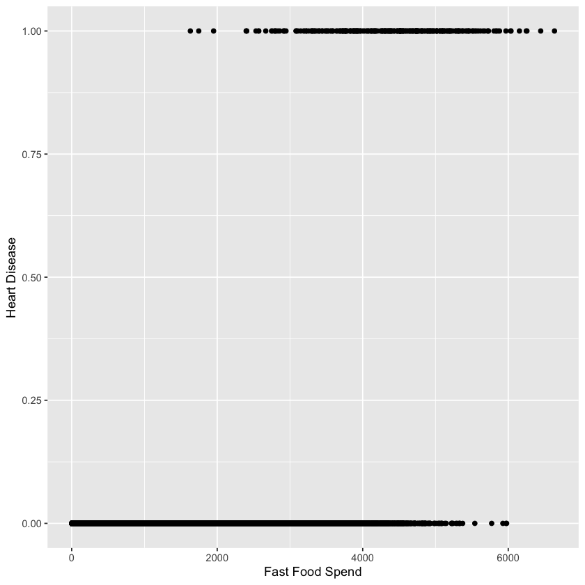
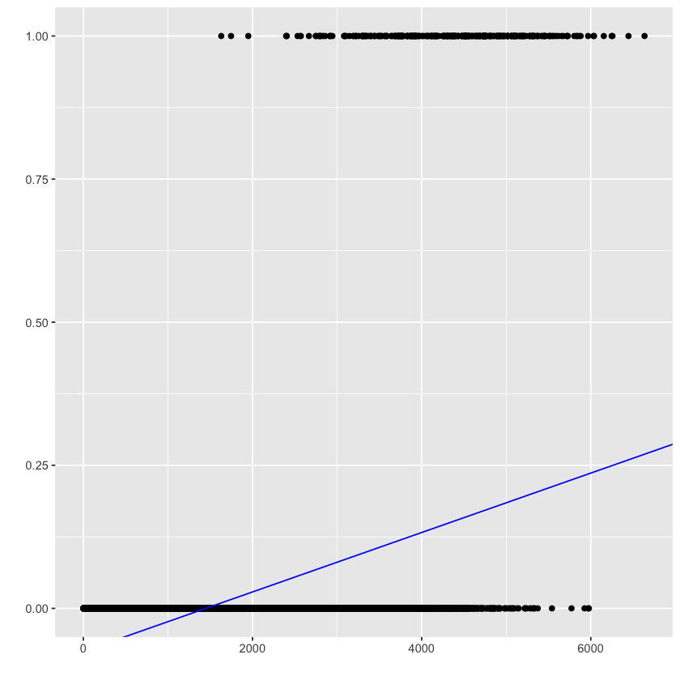
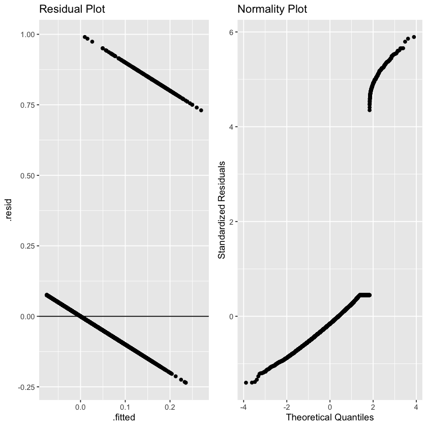
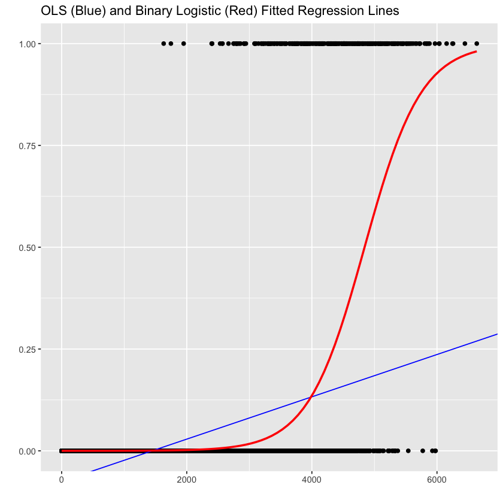
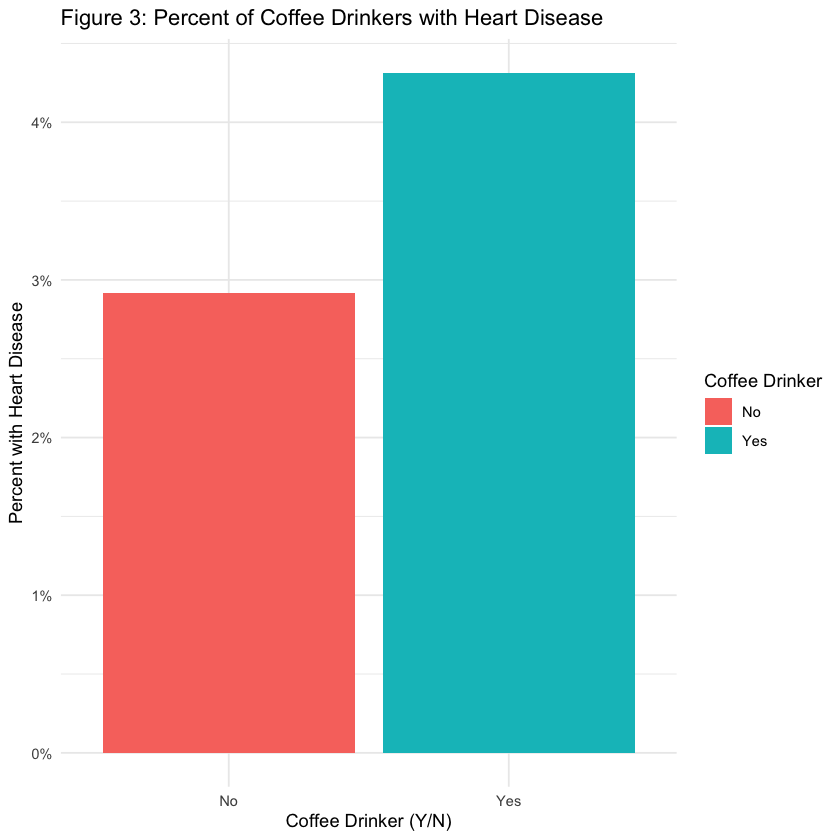

# Lecture 8: Maximum Likelihood Estimation and Logistic Regression

### Lecture 8: Learning Objectives

By the end of this lecture you will be able to: 

- Recall the process of maximum likelihood estimation
- Identify the necessity of MLE in the regression context
- Realize potential cases when linear regression is not appropriate such as logistic regression (more in Regression II)
- Implement a logistic regression model and interpret its coefficients


### Review 

- In DSCI 552, we introduced the concept of maximum likelihood estimation (MLE).

- MLE is a method that, given some observed data and some assumed family of probability distributions, seeks to find values of the parameters that would make the observed data most likely to have occurred.

- We aim to estimate the parameters of a theoretical distribution, so we need to make a distributional assumption for our data (Normal, Binomial, Poisson etc.).

- To obtain parameter estimates for a particular distribution, we use the likelihood function.


# 1. Regression parameters 

**Question:** In DSCI 561, how did we estimate the parameter vector $\hat{\beta}$ in linear regression?

A. By minimizing the sum of the residuals.

B. By maximizing the $R^2$ value.

C. By minimizing the sum of the fitted values.

D. By minimizing the mean squared error (MSE) loss function.

**Question:** We require our errors to follow a normal distribution to estimate coefficients using least squares.

A. TRUE

B. FALSE

## 1.1 Motivating Example:

- Suppose that you are working in health care and are looking to investigate the effects of various factors on the development of heart disease.

- What kinds of variables might we consider when looking to predict whether or not someone has heart disease?

- In this example, we will consider a data set with 4 variables:

    - `heart_disease`: an indicator field corresponding to whether an individual has heart disease (1 = yes, heart disease; 0 = no heart disease)
    - `coffee_drinker`: an indicator field corresponding to whether an individual drinks coffee regularly (1 = yes, coffee drinker; 0 = not a coffee drinker)
    - `fast_food_spend`: a numerical field corresponding to the annual spend of each individual on fast food
    - `income` - a numerical field corresponding to the individual’s annual income

> This example is based on [Chapter 7](https://bookdown.org/brianmachut/uofm_analytics_r_hw_sol_2/logreg.html) from "Data Analytics with R" was written by Brian Machut, Nathan Cornwell. 


```R
library(tidyverse)
library(cowplot)
library(ggplot2)
library(broom)
library(gridExtra)
library(dplyr)

dat <- read_csv("data/heart.csv")
```

    ── Attaching core tidyverse packages ──────────────────────── tidyverse 2.0.0 ──
    ✔ dplyr     1.1.4     ✔ readr     2.1.5
    ✔ forcats   1.0.0     ✔ stringr   1.5.1
    ✔ ggplot2   3.5.1     ✔ tibble    3.2.1
    ✔ lubridate 1.9.3     ✔ tidyr     1.3.1
    ✔ purrr     1.0.2     
    ── Conflicts ────────────────────────────────────────── tidyverse_conflicts() ──
    ✖ dplyr::filter() masks stats::filter()
    ✖ dplyr::lag()    masks stats::lag()
    ℹ Use the conflicted package (<http://conflicted.r-lib.org/>) to force all conflicts to become errors
    
    Attaching package: ‘cowplot’
    
    
    The following object is masked from ‘package:lubridate’:
    
        stamp
    
    
    
    Attaching package: ‘gridExtra’
    
    
    The following object is masked from ‘package:dplyr’:
    
        combine
    
    
    Rows: 10000 Columns: 4
    ── Column specification ────────────────────────────────────────────────────────
    Delimiter: ","
    dbl (4): heart_disease, coffee_drinker, fast_food_spend, income
    
    ℹ Use `spec()` to retrieve the full column specification for this data.
    ℹ Specify the column types or set `show_col_types = FALSE` to quiet this message.


```R
head(dat)
```


<table class="dataframe">
<caption>A tibble: 6 × 4</caption>
<thead>
	<tr><th scope=col>heart_disease</th><th scope=col>coffee_drinker</th><th scope=col>fast_food_spend</th><th scope=col>income</th></tr>
	<tr><th scope=col>&lt;dbl&gt;</th><th scope=col>&lt;dbl&gt;</th><th scope=col>&lt;dbl&gt;</th><th scope=col>&lt;dbl&gt;</th></tr>
</thead>
<tbody>
	<tr><td>0</td><td>0</td><td>1823.816</td><td>44361.625</td></tr>
	<tr><td>0</td><td>1</td><td>2042.951</td><td>12106.135</td></tr>
	<tr><td>0</td><td>0</td><td>2683.873</td><td>31767.139</td></tr>
	<tr><td>0</td><td>0</td><td>1323.127</td><td>35704.494</td></tr>
	<tr><td>0</td><td>0</td><td>1964.140</td><td>38463.496</td></tr>
	<tr><td>0</td><td>1</td><td>2298.971</td><td> 7491.559</td></tr>
</tbody>
</table>


Plotting heart disease against fast food spend, what trends do you observe?


```R
dat  %>% ggplot(aes(fast_food_spend,heart_disease))+
    geom_point()+ 
    xlab("Fast Food Spend")+ 
    ylab("Heart Disease")
```


    

    


#### Question: "How much more likely is it that an individual has heart disease as fast food spending increases?”

> Let's try to answer this question using linear regression. 

In other words, we will think of the 0s and 1s in the response as probabilities ($p_i$), and we estimate an OLS regression model to predict the mean of $Y_i$ subject to fast food spending, $X_{i}$: 

$$
\mathbb{E}(Y_i \mid X_{i}) = p_i = \beta_0 + \beta_1 X_{i}
$$


We have to set our binary response $Y_i$ mathematically as:

$$
Y_i =
\begin{cases}
1 \; \; \; \; \mbox{if the $i$th person has heart disease},\\
0 \; \; \; \; 	\mbox{otherwise.}
\end{cases}
$$

The "1" category is referred as **success**. Note each $Y_i$ is a **Bernoulli** trial whose **probability of success** is $p_i$, i.e., 

$$Y_i \sim \text{Bernoulli}(p_i).$$


```R
LS_fit <- lm(heart_disease ~ fast_food_spend, data = dat)

summary(LS_fit)
```


    
    Call:
    lm(formula = heart_disease ~ fast_food_spend, data = dat)
    
    Residuals:
         Min       1Q   Median       3Q      Max 
    -0.23533 -0.06939 -0.02628  0.02004  0.99046 
    
    Coefficients:
                      Estimate Std. Error t value Pr(>|t|)    
    (Intercept)     -7.519e-02  3.354e-03  -22.42   <2e-16 ***
    fast_food_spend  5.195e-05  1.390e-06   37.37   <2e-16 ***
    ---
    Signif. codes:  0 ‘***’ 0.001 ‘**’ 0.01 ‘*’ 0.05 ‘.’ 0.1 ‘ ’ 1
    
    Residual standard error: 0.1681 on 9998 degrees of freedom
    Multiple R-squared:  0.1226,	Adjusted R-squared:  0.1225 
    F-statistic:  1397 on 1 and 9998 DF,  p-value: < 2.2e-16


```R
heart_plot <-  dat  %>% ggplot() +
                  geom_point(aes(fast_food_spend, heart_disease)) +
                  geom_abline(slope = coef(LS_fit)[2], intercept = coef(LS_fit)[1], color = "blue") +
                  labs(x = '', y = '')
heart_plot
```


    

    


Does this model make any sense? 

> Let's try to predict the probability of having heart disease for someone who spends $600 annually on fast food. 


```R
newdata = data.frame(fast_food_spend = 600)
predict(LS_fit, newdata)
```


<strong>1:</strong> -0.0440226352627225


The predicted probability is less than one, but shouldn't probabilities be restricted in the range $[0,1]$? 

> Let's take a look at some diagnostic plots. 


```R
residual_plot <- LS_fit %>% ggplot(aes(x = .fitted, y = .resid)) +
                    geom_point() +
                    geom_hline(yintercept = 0) +
                    ggtitle("Residual Plot")

standardized_res <- rstandard(LS_fit)

qq_plot <- LS_fit %>% ggplot(aes(sample = standardized_res)) +
              stat_qq() +
              labs(x = "Theoretical Quantiles", y = "Standardized Residuals") + 
              ggtitle("Normality Plot")
```

### Think, Pair, Share: 

What do you think about the model assumptions from these diagnostic plots?


```R
plot_grid(residual_plot, qq_plot, nrow=1)

```


    

    


#### Clearly, assumptions of homoscedasticity and normality appear to be violated. 

Why?

- Our response variable, $y$, is categorical (binary) instead of continuous.

- When performing least squares regression, we assume the error (and consequently $y$) follows a normal distribution.

- Performing least squares regression in this setting is nonsensical as we can obtain predicted probabilities below 0 or above 1.


### Solution: MLE!

Using maximum likelihood estimation, we can assume a variety of different distributions for our response variable and still obtain coefficient estimates (much more to come in DSCI 562).

In this example, we could assume a Bernoulli distribution for $Y_i$ to predict probabilities between 0 and 1. 

This idea leads to the concept of **logistic regression**.

# 2. Logistic Regression

## 1.2 The Logit Function

Let us play around with the distribution theory from **DSCI 551**. Recall:

$$
\begin{gather}
Y_i \sim \text{Bernoulli}(p_i) \\
\mathbb{E}(Y_i) = p_i.
\end{gather}
$$

We can establish the following logit function (which is **monotonic and differentiable**):

$$
\mbox{logit}(p_i)= \log\left(\frac{p_i}{1 - p_i}\right) = \beta_0 + \beta_1 X_{i}.
$$

 With some algebraic arrangements, we can solve for the probability $p_i$:

$$
p_i = \frac{\exp \big( \beta_0 + \beta_1 X_{i} \big) }{ \big[ 1 + \exp \big( \beta_0 + \beta_1 X_{i} \big) \big] } \in [0,1].
$$

Commonly, this is written as 

$$
p_i = \frac{1}{ \big[ 1 + \exp \big ( - \big (\beta_0 + \beta_1 X_{i} \big)\big) \big] }.
$$

> Recall: If $p/(1-p)=o$, then $p=o/(1+o)$.

Under a general framework with $p$ regressors, the **regression parameters** $\beta_0, \beta_1, \dots, \beta_p$ in this model are unknown. 

We can use the function `glm()` with the argument `family = binomial` to get the estimates $\hat{\beta}_0, \hat{\beta}_1, \dots \hat{\beta}_p$.

> The estimates are obtained through **maximum likelihood** where we assume a **joint probability mass function of the $n$ responses $Y_i$**.


```R
heart_plot2 <- heart_plot +
  geom_smooth(aes(fast_food_spend,heart_disease),
    method = "glm", formula = y ~ x,
    method.args = c(family = binomial), se = FALSE, color = "red"
  ) +
  ggtitle("OLS (Blue) and Binary Logistic (Red) Fitted Regression Lines")
  
 heart_plot2
```


    

    


### Think, Pair, Share

What are some differences in the model summary for the logistic regression model in comparison to what we saw previously using linear regression?


```R
binary_log_model <- glm(as.factor(heart_disease) ~ fast_food_spend,
  data = dat, family = binomial
)

summary(binary_log_model)
```


    
    Call:
    glm(formula = as.factor(heart_disease) ~ fast_food_spend, family = binomial, 
        data = dat)
    
    Coefficients:
                      Estimate Std. Error z value Pr(>|z|)    
    (Intercept)     -1.065e+01  3.612e-01  -29.49   <2e-16 ***
    fast_food_spend  2.200e-03  8.815e-05   24.95   <2e-16 ***
    ---
    Signif. codes:  0 ‘***’ 0.001 ‘**’ 0.01 ‘*’ 0.05 ‘.’ 0.1 ‘ ’ 1
    
    (Dispersion parameter for binomial family taken to be 1)
    
        Null deviance: 2920.6  on 9999  degrees of freedom
    Residual deviance: 1596.5  on 9998  degrees of freedom
    AIC: 1600.5
    
    Number of Fisher Scoring iterations: 8


## 2.2 Coefficient Interpretation

**Question: What is the interpretation of the estimate $\hat{\beta}_1$ for `fast_food_spend` on the response `target`?** 

For one-unit increase in fast food spend, it is expected that the *log-odds* of a person having heart disease decreases by 0.002.

> Remember, our response (for now) is on the log-scale! How could we make this interpretation easier to communicate...

We have to transform back our estimated coefficient $\hat{\beta_1}$ to the original scale of the odds $\frac{p_i}{1 - p_i}$. Mathematically, we exponentiate the coefficient: $e^{\hat{\beta}_1}.$ This is called the **odds ratio**.

**Interpretation:** for each unit increase in $X_i$, $Y_i$ is $e^{\hat{\beta}_1}$ times more likely to be 1 than to be 0.


```R
tidy(binary_log_model, exponentiate = TRUE) %>% 
  mutate_if(is.numeric, round, 3)
```


<table class="dataframe">
<caption>A tibble: 2 × 5</caption>
<thead>
	<tr><th scope=col>term</th><th scope=col>estimate</th><th scope=col>std.error</th><th scope=col>statistic</th><th scope=col>p.value</th></tr>
	<tr><th scope=col>&lt;chr&gt;</th><th scope=col>&lt;dbl&gt;</th><th scope=col>&lt;dbl&gt;</th><th scope=col>&lt;dbl&gt;</th><th scope=col>&lt;dbl&gt;</th></tr>
</thead>
<tbody>
	<tr><td>(Intercept)    </td><td>0.000</td><td>0.361</td><td>-29.492</td><td>0</td></tr>
	<tr><td>fast_food_spend</td><td>1.002</td><td>0.000</td><td> 24.953</td><td>0</td></tr>
</tbody>
</table>


**Interpretation:** For each dollar increase in `fast_food_spend`, the patient is 1.002 times more likely to have heart disease than not.

## 2.3 Inference

We can determine **whether a regressor is statistically associated with the logarithm of the response's odds** through **hypothesis testing** for $\beta_j$. We will need the estimated regression coefficient $\hat{\beta}_j$ and its **standard error**, $\mbox{se}(\hat{\beta}_j)$. 

You can test the below hypotheses via the **Wald statistic** $z _j= \frac{\hat{\beta}_j}{\mbox{se}(\hat{\beta}_j)}$:

$$
\begin{align}
H_0: \beta_j &= 0 \\
H_a: \beta_j &\neq 0.        
\end{align}
$$

Now, we can answer the following: **is `fast_food_spend` statistically associated with the logarithm of the odds of `heart_disease`?**


```R
tidy(binary_log_model, conf.int = TRUE) %>% 
  mutate_if(is.numeric, round, 3)
```


<table class="dataframe">
<caption>A tibble: 2 × 7</caption>
<thead>
	<tr><th scope=col>term</th><th scope=col>estimate</th><th scope=col>std.error</th><th scope=col>statistic</th><th scope=col>p.value</th><th scope=col>conf.low</th><th scope=col>conf.high</th></tr>
	<tr><th scope=col>&lt;chr&gt;</th><th scope=col>&lt;dbl&gt;</th><th scope=col>&lt;dbl&gt;</th><th scope=col>&lt;dbl&gt;</th><th scope=col>&lt;dbl&gt;</th><th scope=col>&lt;dbl&gt;</th><th scope=col>&lt;dbl&gt;</th></tr>
</thead>
<tbody>
	<tr><td>(Intercept)    </td><td>-10.651</td><td>0.361</td><td>-29.492</td><td>0</td><td>-11.383</td><td>-9.967</td></tr>
	<tr><td>fast_food_spend</td><td>  0.002</td><td>0.000</td><td> 24.953</td><td>0</td><td>  0.002</td><td> 0.002</td></tr>
</tbody>
</table>


Our sample gives us evidence to reject $H_0$ ($p\text{-value} \approx 0$). Therefore, `fast_food_spend` statistically associated with the logarithm of the odds of `heart_disease`.

Now suppose we want to predict the probability of someone having heart disease who spends $5000 annually on fast food. 

How can we do this?

We use `binary_log_model` for making such prediction as follows:

$$
\begin{gather} 
\log \bigg( \frac{\hat{p}}{1 - \hat{p}}\bigg) = \underbrace{-10.65133}_{\hat{\beta}_0} + \underbrace{0.0022}_{\hat{\beta}_1}(5000) = 0.34867 \\
\frac{\hat{p}}{1 - \hat{p}} = e^{0.34867}=1.417.
\end{gather}
$$

We can also use the function `predict()` with the argument `type = "link"` to obtain the predicted logarithm of the odds. Then, we exponentiate it to get the predicted odds. 

> Note: answers may vary slightly due to rounding


```R
round(exp(predict(binary_log_model,
  tibble(fast_food_spend = 5000),
  type = "link")),3)
```


<strong>1:</strong> 1.414


Hence, a person who spends $5000 annually on fast food is predicted to be 1.414 times more likely to have heart disease.

### Question

Using these odds, what is the probability a person who spends \$5000 annually on fast food has heart disease?

A. 0.414

B. 0.293

C. 0.349

D. 0.586


Now, let's consider a model with both `fast_food_spend` and `coffee_drinker` as covariates: 

$$
\mbox{logit}(p_i)= \log\left(\frac{p_i}{1 - p_i}\right) = \beta_0 + \beta_1 X_{ff_i}+\beta_2 X_{coffee_i}.
$$

Before we fit the model, we will visualize the relationship between drinking coffee and the prevalence of heart disease. 


```R

dat %>%
  mutate(heart_disease = ifelse(heart_disease == 1, "Yes", "No"), 
                coffee_drinker = ifelse(coffee_drinker == 1, "Yes", "No")) %>% 
  group_by(heart_disease, coffee_drinker) %>% 
  summarise(count = n()) %>% 
  ungroup() %>% 
  group_by(coffee_drinker) %>% 
  mutate(total_coffee_drinkers = sum(count)) %>% 
  ungroup() %>%
  mutate(proportion = count / total_coffee_drinkers) %>%
  filter(heart_disease == "Yes") %>%
  ggplot(aes(x = coffee_drinker, y = proportion, fill = coffee_drinker)) + 
  geom_bar(stat = "identity") + 
  theme_minimal() +
  ylab("Percent with Heart Disease") +
  xlab("Coffee Drinker (Y/N)") +
  ggtitle("Figure 3: Percent of Coffee Drinkers with Heart Disease") +
  labs(fill = "Coffee Drinker") + 
  scale_y_continuous(labels = scales::percent)

```

    `summarise()` has grouped output by 'heart_disease'. You can override using the
    `.groups` argument.


    

    


```R
binary_log_model_2 <- glm(as.factor(heart_disease) ~ fast_food_spend+coffee_drinker,
  data = dat, family = binomial
)

tidy(binary_log_model_2)
```


<table class="dataframe">
<caption>A tibble: 3 × 5</caption>
<thead>
	<tr><th scope=col>term</th><th scope=col>estimate</th><th scope=col>std.error</th><th scope=col>statistic</th><th scope=col>p.value</th></tr>
	<tr><th scope=col>&lt;chr&gt;</th><th scope=col>&lt;dbl&gt;</th><th scope=col>&lt;dbl&gt;</th><th scope=col>&lt;dbl&gt;</th><th scope=col>&lt;dbl&gt;</th></tr>
</thead>
<tbody>
	<tr><td>(Intercept)    </td><td>-10.749495878</td><td>3.691914e-01</td><td>-29.116326</td><td>2.230782e-186</td></tr>
	<tr><td>fast_food_spend</td><td>  0.002295242</td><td>9.273881e-05</td><td> 24.749526</td><td>3.136911e-135</td></tr>
	<tr><td>coffee_drinker </td><td> -0.714877620</td><td>1.475190e-01</td><td> -4.846003</td><td> 1.259734e-06</td></tr>
</tbody>
</table>


Interpretation of $\hat{\beta}_2$: 

- $\hat{\beta}_2=-0.7149$, which means that coffee drinkers are $e^{-0.7149}=0.489$ times more likely to have heart disease, holding fast food spending constant. 

- Alternatively, people who drink coffee are $1/e^{-0.7149}=1/0.489=2.04$ more likely to not have heart disease, holding fast food spending constant.

However, isn't this contradictory to the barplot we looked at indicating that coffee drinkers had a higher rate of heart disease? 

#### Class discussion: What could be a possible explanation?


### In-class Exercise

Now, add `income` to your logistic regression model and interpret its respective estimated coefficient. 

- Does income appear to be significant in predicting heart disease? 
- Can/should we compare these nested models using an $F$-test?


```R
binary_log_model_3 <- glm(as.factor(heart_disease) ~ fast_food_spend+coffee_drinker+income,
  data = dat, family = binomial
)

tidy(binary_log_model_3)
```


<table class="dataframe">
<caption>A tibble: 4 × 5</caption>
<thead>
	<tr><th scope=col>term</th><th scope=col>estimate</th><th scope=col>std.error</th><th scope=col>statistic</th><th scope=col>p.value</th></tr>
	<tr><th scope=col>&lt;chr&gt;</th><th scope=col>&lt;dbl&gt;</th><th scope=col>&lt;dbl&gt;</th><th scope=col>&lt;dbl&gt;</th><th scope=col>&lt;dbl&gt;</th></tr>
</thead>
<tbody>
	<tr><td>(Intercept)    </td><td>-1.086905e+01</td><td>4.922555e-01</td><td>-22.080088</td><td>4.911280e-108</td></tr>
	<tr><td>fast_food_spend</td><td> 2.294602e-03</td><td>9.275781e-05</td><td> 24.737563</td><td>4.219578e-135</td></tr>
	<tr><td>coffee_drinker </td><td>-6.467758e-01</td><td>2.362525e-01</td><td> -2.737646</td><td> 6.188063e-03</td></tr>
	<tr><td>income         </td><td> 3.033450e-06</td><td>8.202615e-06</td><td>  0.369815</td><td> 7.115203e-01</td></tr>
</tbody>
</table>


#### Summary: what have we learned today?

- Logistic regression
- Interpreting coefficients on the odds-scale
- Why is linear regerssion not always appropriate?
- Estimating coefficients with MLE 


